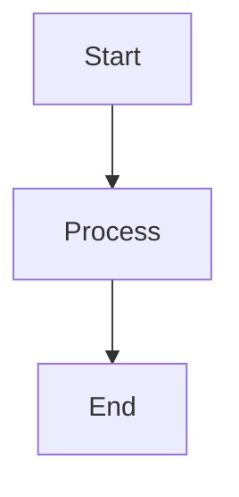

# Neurolink Blog Publishing Guide

This guide documents everything needed to publish blog posts to [blog.neurolink.ink](https://blog.neurolink.ink).

---

## Blog Posts Ready to Publish

| Post | File | Publish Date | Status |
|------|------|--------------|--------|
| OpenRouter Guide | `_posts/2025-01-15-openrouter-integration-guide.md` | Jan 15, 2025 | Ready |
| Multimodal Tutorial | `_posts/2025-01-29-multimodal-document-processing.md` | Jan 29, 2025 | Ready |
| Framework Comparison | `_posts/2025-02-12-framework-comparison.md` | Feb 12, 2025 | Ready |

---

## How to Publish

### 1. Local Preview

Before publishing, always preview your changes locally:

```bash
# Navigate to the blog directory
cd /path/to/neurolink-blog

# Install dependencies (first time only)
bundle install

# Start local server
bundle exec jekyll serve

# Preview at http://localhost:4000
```

For live reload during development:

```bash
bundle exec jekyll serve --livereload
```

### 2. Git Commands to Push

Once you have verified the content locally:

```bash
# Stage all changes
git add .

# Commit with a descriptive message
git commit -m "Publish: [Post Title] - [YYYY-MM-DD]"

# Push to main branch (triggers GitHub Pages deployment)
git push origin main
```

### 3. Verify Deployment

After pushing:

1. Check GitHub Actions for deployment status
   - Go to: `https://github.com/[org]/neurolink-blog/actions`
   - Wait for the "pages build and deployment" workflow to complete

2. Verify the post is live at: `https://blog.neurolink.ink/[year]/[month]/[day]/[post-slug]/`

---

## Social Media Assets

Social media content for promoting blog posts is located at:

```
/marketing/01-01-2026/content-output/social/
```

Available assets:

| Platform | File | Description |
|----------|------|-------------|
| Twitter/X | `twitter-openrouter-thread.md` | Thread for OpenRouter post |
| Twitter/X | `twitter-multimodal-thread.md` | Thread for Multimodal post |
| Twitter/X | `twitter-framework-thread.md` | Thread for Framework Comparison |
| LinkedIn | `linkedin-posts.md` | All LinkedIn promotional posts |
| Reddit | `reddit-posts.md` | Reddit submission content |
| Dev.to | `devto-posts.md` | Dev.to cross-post versions |

---

## Post-Publish Checklist

After publishing each post, verify:

- [ ] Post appears correctly on [blog.neurolink.ink](https://blog.neurolink.ink)
- [ ] All Mermaid diagrams render properly
- [ ] All code blocks have correct syntax highlighting
- [ ] Images and assets load correctly
- [ ] Internal and external links work
- [ ] Meta description displays correctly in browser tab
- [ ] Share on social media using prepared assets:
  - [ ] Twitter/X thread posted
  - [ ] LinkedIn post published
  - [ ] Reddit submission (where appropriate)
  - [ ] Dev.to cross-post (if applicable)

---

## Adding Future Posts

### Post Template

Create new posts in `_posts/` with the filename format: `YYYY-MM-DD-post-slug.md`

```markdown
---
layout: post
title: "Your Post Title Here"
date: YYYY-MM-DD
categories: [category1, category2]
tags: [tag1, tag2, tag3]
author: Neurolink Team
description: "A brief description for SEO and social sharing (150-160 characters)"
---

Introduction paragraph that hooks the reader...

## Section Heading

Content goes here...

## Code Examples

```python
# Your code with syntax highlighting
def example():
    return "Hello, Neurolink!"
```

## Mermaid Diagrams



## Conclusion

Wrap-up and call to action...
```

### Frontmatter Reference

| Field | Required | Description |
|-------|----------|-------------|
| `layout` | Yes | Always use `post` |
| `title` | Yes | Post title in quotes |
| `date` | Yes | Publication date (YYYY-MM-DD) |
| `categories` | No | Array of categories |
| `tags` | No | Array of tags for filtering |
| `author` | No | Author name |
| `description` | No | SEO meta description |

### File Naming Convention

- Use lowercase
- Separate words with hyphens
- Keep slugs concise but descriptive
- Example: `2025-03-15-getting-started-with-neurolink.md`

---

## Troubleshooting

### Mermaid diagrams not rendering

Ensure the theme supports Mermaid or add the following to your layout:

```html
<script src="https://cdn.jsdelivr.net/npm/mermaid/dist/mermaid.min.js"></script>
<script>mermaid.initialize({startOnLoad:true});</script>
```

### Build fails locally

```bash
# Clear Jekyll cache
bundle exec jekyll clean

# Rebuild
bundle exec jekyll build
```

### Posts not appearing

- Verify the date in the filename matches or is before today
- Check that the frontmatter is valid YAML
- Ensure no syntax errors in the markdown

---

## Related Documentation

- Content Inventory: `/marketing/01-01-2026/content-output/CONTENT-INVENTORY.md`
- Publish Preparation: `/marketing/01-01-2026/content-output/PUBLISH-PREP.md`
- Mermaid Verification: `/marketing/01-01-2026/content-output/MERMAID-VERIFICATION.md`
