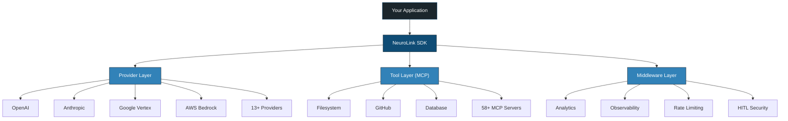
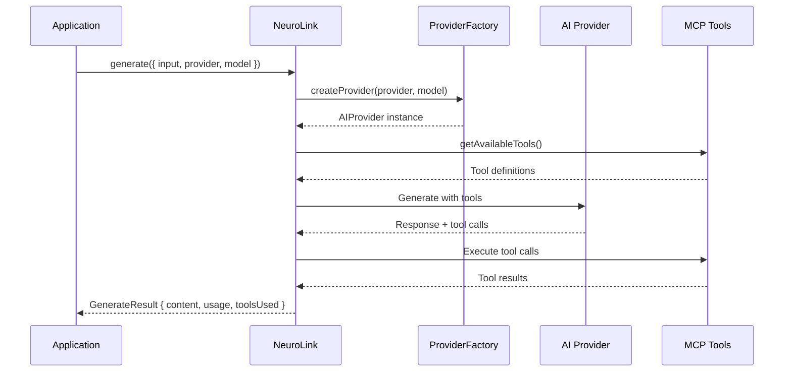
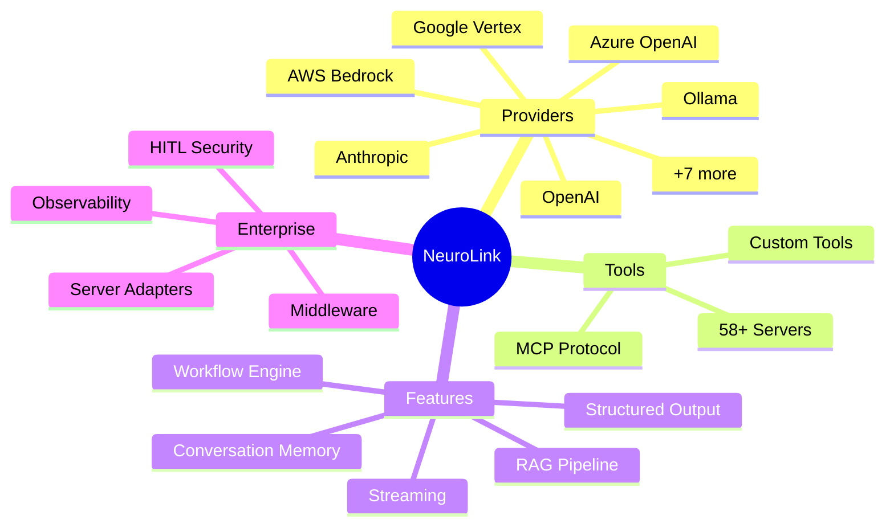

You've heard about NeuroLink but aren't sure where to start. Let's fix that.

Imagine you want to use AI in your app -- maybe OpenAI today, maybe Google's Gemini tomorrow. Normally, that means learning two completely different SDKs, rewriting your code, and dealing with different error messages. NeuroLink is a single toolkit that lets you talk to all of them the same way. Think of it like a universal remote for AI providers.

NeuroLink (`@juspay/neurolink`) is an open-source AI SDK built by Juspay. It gives you one TypeScript API that works with 13+ AI providers, so you can focus on building your app instead of wrestling with provider differences.

In this post, you will learn:

- The core architecture and design philosophy behind NeuroLink
- The full feature surface: providers, MCP tools, streaming, RAG, workflows, and server adapters
- How NeuroLink compares to building direct provider integrations
- When and why to choose NeuroLink for your next project

---

## The Problem NeuroLink Solves

Building production AI applications today means wrestling with fragmentation at every level.

### Provider Fragmentation

OpenAI, Anthropic, Google, and AWS each ship their own SDKs with their own type systems, their own error hierarchies, and their own streaming protocols. A team that starts with OpenAI and later needs Anthropic for its longer context windows or Google for its cost-effective Gemini Flash models faces a significant rewrite -- not because the business logic changed, but because the plumbing is different.

### Vendor Lock-In

Once you have built your application around a specific provider's SDK, switching is expensive. The deeper the integration, the higher the switching cost. This creates a dependency that limits your ability to respond to pricing changes, performance improvements from competitors, or outages from your primary provider.

### Missing Enterprise Features

Most provider SDKs are designed for demos and prototypes. Getting to production requires bolting on retry logic, fallback mechanisms, observability, rate limiting, security guardrails, and conversation memory. These are cross-cutting concerns that every serious AI application needs, yet no single provider SDK offers them.

### Tool Ecosystem Fragmentation

AI models increasingly need to interact with external tools -- databases, file systems, APIs, code execution environments. But LangChain has its own tool format, OpenAI has function calling, and Anthropic has tool use. There is no standard way to define a tool once and use it everywhere. The Model Context Protocol (MCP) changes this, and NeuroLink supports it natively.

### The Production Gap

Demos work. Production is hard. The gap between a working prototype and a production-ready AI application is filled with rate limiting, conversation persistence, monitoring, security approvals, and operational tooling. NeuroLink bridges that gap.

---


## Core Architecture

NeuroLink's architecture is built around a few key principles: a single entry point, a provider abstraction layer, and type safety throughout.

### Single Entry Point

The `NeuroLink` class is the main SDK interface. Everything flows through it:

```typescript
import { NeuroLink } from '@juspay/neurolink';

const neurolink = new NeuroLink();

// Works with any of 13+ providers -- just change the provider string
const result = await neurolink.generate({
  input: { text: 'Explain quantum computing' },
  provider: 'vertex',
  model: 'gemini-3-flash'
});

console.log(result.content);
```

> **Note:** Model names and IDs in code examples reflect versions available at time of writing. Model availability, naming conventions, and pricing change frequently. Always verify current model IDs with your provider's documentation before deploying to production.
{: .prompt-info }

The constructor accepts an optional `NeurolinkConstructorConfig` for configuring conversation memory, human-in-the-loop approval, observability, orchestration, and a tool registry. These are the only five constructor fields:

```typescript
const neurolink = new NeuroLink({
  conversationMemory: memoryConfig,
  enableOrchestration: true,
  hitl: hitlConfig,
  toolRegistry: myToolRegistry,
  observability: observabilityConfig
});
```

The two primary methods are `generate()` for complete responses and `stream()` for real-time token delivery. Both accept the same unified options structure, making it trivial to switch between them.

### Provider Abstraction Layer

Under the hood, NeuroLink uses an `AIProviderFactory` that creates providers via `ProviderFactory` and `ProviderRegistry`. Provider names are normalized, models are resolved dynamically, and environment variables are auto-detected so that configuration is minimal.

### 13 Supported Providers

NeuroLink supports providers across every deployment model through its `AIProviderName` enum:

**Cloud Providers:**

- AWS Bedrock
- AWS SageMaker
- Google Vertex AI
- Google AI Studio
- Azure OpenAI

**API Providers:**

- OpenAI
- Anthropic
- Mistral
- Hugging Face
- OpenRouter

**Local Providers:**

- Ollama

**Proxy Providers:**

- LiteLLM
- OpenAI-Compatible

### Type Safety Throughout

Every interaction with NeuroLink is fully typed. `GenerateOptions` defines your inputs, `GenerateResult` defines the output. `StreamOptions` and `StreamResult` provide the same safety for streaming. This means your IDE catches misconfigurations at compile time, not at runtime in production.



---


## Key Features Deep Dive

NeuroLink is not just a provider wrapper. It is a full AI development platform. Here is a tour of its feature surface.

### Multi-Provider Generation

The `generate()` method is the simplest way to get an AI response. Specify a provider and model, and you get back a typed `GenerateResult` with content, usage metrics, and metadata:

```typescript
const result = await neurolink.generate({
  input: { text: 'Explain quantum computing' },
  provider: 'openai',
  model: 'gpt-4o'
});

console.log(result.content);
console.log(`Tokens: ${result.usage?.total}`);
```

### Streaming

For real-time interfaces like chatbots, `stream()` delivers tokens as they arrive. The `result.stream` async iterator works identically across all 13 providers, regardless of whether the underlying protocol uses SSE, WebSocket, or HTTP chunking:

```typescript
const result = await neurolink.stream({
  input: { text: 'Write a haiku about TypeScript' },
  provider: 'anthropic',
  model: 'claude-sonnet-4-5-20250929',
  temperature: 0.7
});

for await (const chunk of result.stream) {
  process.stdout.write(chunk);
}
```

### Structured Output

When you need validated JSON output, pass a Zod schema to the `schema` option. NeuroLink handles the schema conversion for each provider and validates the response:

```typescript
import { z } from 'zod';

const ProductSchema = z.object({
  name: z.string(),
  price: z.number(),
  category: z.string()
});

const result = await neurolink.generate({
  input: { text: 'Extract: iPhone 16 Pro costs $999 in electronics' },
  provider: 'openai',
  model: 'gpt-4o',
  schema: ProductSchema,
  output: { format: 'structured' }
});
```

### MCP Tool Integration

NeuroLink supports 58+ external MCP (Model Context Protocol) servers. Tools are discovered automatically and executed during generation without manual wiring:

```typescript
import { NeuroLink } from '@juspay/neurolink';

const neurolink = new NeuroLink();

// Discover tools available through MCP
const tools = await neurolink.getAvailableTools();
console.log(`Found ${tools.length} tools`);

// Tools are used automatically during generation
const result = await neurolink.generate({
  input: { text: 'Read the README.md file and summarize it' },
  provider: 'openai',
  model: 'gpt-4o'
});

console.log(result.content);
console.log('Tools used:', result.toolsUsed);
```

### RAG (Retrieval-Augmented Generation)

NeuroLink includes a complete RAG pipeline with document loading, 10 chunking strategies, embedding, and retrieval. You can use the full `RAGPipeline` class or the inline `rag` option for quick queries:

```typescript
import { loadDocument, RAGPipeline } from '@juspay/neurolink';

// Load and process a document
const doc = await loadDocument('./docs/guide.md');
await doc.chunk({ strategy: 'markdown', config: { maxSize: 1000 } });

// Build a RAG pipeline
const pipeline = new RAGPipeline({
  embeddingModel: { provider: 'openai', modelName: 'text-embedding-3-small' },
  generationModel: { provider: 'openai', modelName: 'gpt-4o-mini' }
});

await pipeline.ingest(['./docs/*.md']);
const response = await pipeline.query('What are the key features?');
console.log(response.answer);
```

The `ChunkerRegistry` supports character, sentence, markdown, recursive, semantic, HTML, JSON, LaTeX, and token-based chunking strategies.

### Conversation Memory

NeuroLink supports Redis-based persistence for conversation history and Mem0 integration for long-term user memory. This means your chatbots remember context across sessions without you managing state manually.

### Workflow Engine

The workflow engine enables multi-model ensembles. Use consensus workflows to get the best answer from multiple models, fallback workflows for reliability, or adaptive workflows that route by task complexity:

```typescript
import { NeuroLink, CONSENSUS_3_WORKFLOW } from '@juspay/neurolink';

const neurolink = new NeuroLink();

const result = await neurolink.generate({
  input: { text: 'Explain quantum computing' },
  workflowConfig: CONSENSUS_3_WORKFLOW,
});

console.log('Best response:', result.content);
console.log('Selected model:', result.workflow?.selectedModel);
console.log('Total time:', result.workflow?.metrics?.totalTime);
```

### Human-in-the-Loop (HITL)

For regulated industries, NeuroLink supports approval workflows with confidence thresholds. Actions flagged as dangerous require human approval before execution, configured through the `dangerousActions` field in your HITL configuration.

### Server Adapters

Expose your NeuroLink instance as a fully-featured HTTP API with a single function call. Supported frameworks include Hono, Express, Fastify, and Koa:

```typescript
import { NeuroLink } from '@juspay/neurolink';
import { createServer } from '@juspay/neurolink/server';

const neurolink = new NeuroLink();

const server = await createServer(neurolink, {
  framework: 'hono',
  config: { port: 3000 }
});

await server.initialize();
await server.start();
// Now accessible at http://localhost:3000
```

### Observability

OpenTelemetry and Langfuse integration provide distributed tracing and monitoring for every AI call. You get visibility into latency, token usage, error rates, and tool execution without writing custom instrumentation.

### Provider Fallback

`createAIProviderWithFallback()` configures automatic failover between providers. If your primary provider goes down, requests are routed to the fallback without any changes to your application code.

### Multimodal Support

NeuroLink handles images, PDFs, CSV, and video file inputs. It also supports TTS audio output, video generation via Veo, and PPT generation -- all through the same unified API.

### CLI

The `neurolink` command-line tool handles model management, MCP server management, and Ollama setup, giving you operational control without leaving the terminal.

---

## The NeuroLink API Surface

The public API is organized around clear responsibilities. Here are the main exports from `@juspay/neurolink`:

**Primary Class:**

- `NeuroLink` -- the main SDK interface with `generate()` and `stream()`

**Factory Functions:**

- `createAIProvider()` -- create a specific provider instance
- `createAIProviderWithFallback()` -- primary + fallback provider pair
- `createBestAIProvider()` -- auto-select based on available API keys

**MCP Ecosystem:**

- `initializeMCPEcosystem()` -- bootstrap the MCP tool system
- `executeMCP()` -- execute a specific MCP tool
- `listMCPs()` -- list available MCP servers

**RAG:**

- `MDocument`, `loadDocument()` -- document loading and processing
- `RAGPipeline`, `ChunkerRegistry` -- full retrieval-augmented generation

**Workflows:**

- `CONSENSUS_3_WORKFLOW`, `FAST_FALLBACK_WORKFLOW`, `runWorkflow()` -- multi-model orchestration

**Server:**

- `createServer()` from `@juspay/neurolink/server` -- HTTP API adapters

**Middleware:**

- `MiddlewareFactory`, `createAnalyticsMiddleware()` -- request/response processing

**Observability:**

- `initializeOpenTelemetry()`, `shutdownOpenTelemetry()` -- distributed tracing

---

## How It Compares to Direct Integrations

Here is a practical comparison between using direct provider SDKs and using NeuroLink:

| Concern | Direct Provider SDK | NeuroLink |
|---|---|---|
| **Lines of code per provider** | 50-100+ | 5-10 (same for all) |
| **Switching providers** | Full rewrite | Change one string |
| **Retry/fallback** | Build yourself | Built-in |
| **Tool support** | Provider-specific format | MCP standard (58+ servers) |
| **Observability** | Instrument manually | OpenTelemetry + Langfuse |
| **Streaming normalization** | Handle per provider | Unified async iterator |
| **Type safety** | Varies by SDK | Full TypeScript coverage |
| **Conversation memory** | Build yourself | Redis + Mem0 integration |
| **Server endpoints** | Build yourself | `createServer()` one-liner |

The core trade-off is clear: a direct SDK gives you maximum control over a single provider, while NeuroLink gives you a production-ready abstraction over all of them. For teams building AI features (not AI infrastructure), NeuroLink eliminates months of integration work.



---

## When to Use NeuroLink

NeuroLink is the right choice when your requirements align with one or more of these scenarios:

### Multi-Provider Strategy

If you want to hedge against outages and pricing changes, NeuroLink lets you configure multiple providers and switch between them with a config change. No rewrite required.

### Rapid Prototyping

Want to try GPT-4o, Claude Sonnet, and Gemini Flash on the same prompt? With NeuroLink, you change one string. No need to install three separate SDKs, learn three different APIs, or manage three sets of types.

### Enterprise Requirements

If your organization needs human-in-the-loop approvals, OpenTelemetry observability, Redis-backed conversation memory, or rate limiting, NeuroLink provides these out of the box. Building them from scratch on top of a raw provider SDK is weeks of work.

### Tool-Augmented AI

The MCP ecosystem gives your AI models access to 58+ tool servers -- file systems, databases, GitHub, Slack, and more. NeuroLink discovers and executes these tools automatically during generation.

### Production Deployments

Server adapters for Hono, Express, Fastify, and Koa mean you can expose your AI capabilities as HTTP APIs in minutes. Add rate limiting, caching, and middleware with a few lines of configuration.



---

## What's Next

Now you know what NeuroLink is and why it exists. The big idea is simple: one SDK, any AI provider, no rewrites. Whether you want to build a chatbot, a document pipeline, or a full production API, the same tools work across the board.

Ready to try it yourself? Here is where to go next:

- **Get hands-on:** Follow Getting Started with NeuroLink: Your First AI App in 5 Minutes to write your first generate call.
- **See the breadth:** Check out NeuroLink Quickstart: 10 Things You Can Build Today for ten copy-paste-ready examples.
- **Go deeper:** Read the provider-specific guides starting with the OpenAI Integration Guide.
- **Explore tools:** Learn about MCP Tools Integration to connect your AI models to external capabilities.

NeuroLink is MIT licensed, and contributions are welcome. Star the repo on [GitHub](https://github.com/juspay/neurolink), open a discussion, or submit a pull request. The future of AI development is unified, type-safe, and open source.

---

**Related posts:**

- [Welcome to the NeuroLink Blog](/posts/welcome-to-neurolink-blog/)
