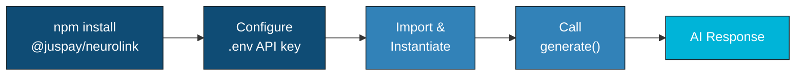
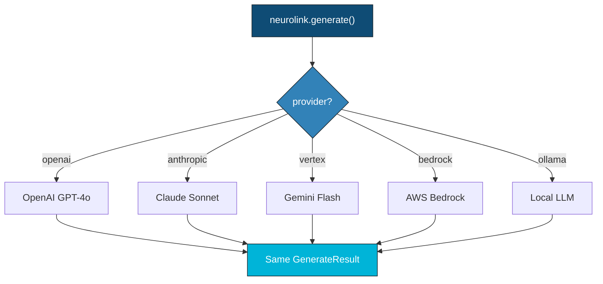

You've heard about AI SDKs but aren't sure where to start. Let's fix that.

Imagine you want to add AI to your app -- maybe a chatbot, maybe a smart search feature. You might think you need days of setup, a PhD in machine learning, and three different API accounts. The truth is, you can get a working AI call running in under 5 minutes with NeuroLink. No prior AI experience needed.

NeuroLink (`@juspay/neurolink`) handles all the complicated provider stuff behind the scenes. You just write a few lines of TypeScript, and it works with any major AI provider -- OpenAI, Google, Anthropic, and more.

In this post, you will learn:

- How to install and configure NeuroLink
- How to make your first AI generation call
- How to switch providers with a single line change
- How to add streaming for real-time output



---

## Prerequisites

Before you begin, make sure you have the following:

- **Node.js >= 20.18.1** -- NeuroLink requires a modern Node.js runtime. Check your version with `node --version`.
- **npm >= 10.0.0 or pnpm >= 8.0.0** -- Either package manager works. This tutorial uses npm, but pnpm commands are identical.
- **An API key from at least one supported provider** -- OpenAI, Anthropic, Google, AWS, or any of the 13 supported providers. If you do not have one yet, OpenAI and Google AI Studio both offer quick signup with free trial credits.
- **Basic TypeScript/JavaScript knowledge** -- NeuroLink is TypeScript-native, but you can use it from plain JavaScript too.

> **Tip:** Not sure which provider to pick? Think of it like choosing a phone carrier -- they all do the same basic thing, just with different pricing. OpenAI (`gpt-4o`) has the biggest community, while Google AI Studio (`gemini-2.5-flash`) lets you get started for free.
{: .prompt-tip }

---


## Installation

### Step 1: Create a New Project

Start with a fresh directory and initialize a Node.js project configured for ES modules:

```bash
mkdir my-ai-app && cd my-ai-app
npm init -y
```

Update your `package.json` to enable ES module support:

```json
{
  "name": "my-ai-app",
  "type": "module",
  "scripts": {
    "start": "npx tsx src/index.ts"
  }
}
```

### Step 2: Install NeuroLink

Install the SDK with a single command:

```bash
npm install @juspay/neurolink
```

If you are using TypeScript (recommended), also install tsx for running TypeScript directly:

```bash
npm install -D tsx typescript
```

### Step 3: Create a Minimal tsconfig.json

Create a `tsconfig.json` at the project root:

```json
{
  "compilerOptions": {
    "target": "ES2022",
    "module": "ESNext",
    "moduleResolution": "bundler",
    "strict": true,
    "esModuleInterop": true,
    "outDir": "./dist"
  },
  "include": ["src/**/*"]
}
```

### Step 4: Configure Your API Key

Create a `.env` file at the project root with your provider's API key. NeuroLink auto-loads dotenv, so no additional configuration is needed:

```bash
OPENAI_API_KEY=sk-your-key-here

# For Anthropic
ANTHROPIC_API_KEY=sk-ant-your-key-here

# For Google AI Studio
GOOGLE_AI_API_KEY=your-google-key-here

# For Google Vertex AI
VERTEX_PROJECT_ID=your-gcp-project-id
```

You only need one provider key to get started. Add more later when you want to explore multi-provider features.

> **Warning:** Your `.env` file contains secret API keys -- treat it like a password. Never commit it to Git. Add `.env` to your `.gitignore` file right away.
{: .prompt-warning }

---


## Your First Generate Call

Create `src/index.ts` and write your first AI generation:

```typescript
import { NeuroLink } from '@juspay/neurolink';

const neurolink = new NeuroLink();

const result = await neurolink.generate({
  input: { text: 'Explain quantum computing in simple terms' },
  provider: 'openai',
  model: 'gpt-4o'
});

console.log(result.content);
console.log(`Tokens used: ${result.usage?.total}`);
console.log(`Response time: ${result.responseTime}ms`);
```

Run it:

```bash
npm start
```

That is it. Five lines of meaningful code, and you have a working AI application.

### Understanding the API

Let us break down what each part does.

**`GenerateOptions`** -- the object you pass to `generate()`:

| Field | Type | Description |
|---|---|---|
| `input.text` | `string` | The prompt or question for the AI model |
| `provider` | `string` | Which AI provider to use (e.g., `'openai'`, `'anthropic'`, `'vertex'`) |
| `model` | `string` | The specific model to use (e.g., `'gpt-4o'`, `'claude-sonnet-4-5-20250929'`) |
| `temperature` | `number` | Creativity control: 0 = deterministic, 1 = creative (optional) |
| `maxTokens` | `number` | Maximum tokens in the response (optional) |
| `systemPrompt` | `string` | Instructions that shape the AI's behavior (optional) |

**`GenerateResult`** -- the object you get back:

| Field | Type | Description |
|---|---|---|
| `content` | `string` | The AI's response text |
| `provider` | `string` | Which provider was used |
| `model` | `string` | Which model was used |
| `usage.total` | `number` | Total tokens consumed |
| `usage.input` | `number` | Tokens in the input prompt |
| `usage.output` | `number` | Tokens in the output response |
| `responseTime` | `number` | Time in milliseconds |

> **Note:** Token usage fields use `total`, `input`, and `output` -- not `totalTokens` or `inputTokens`. This is a deliberate normalization across providers.
{: .prompt-info }

---

## Switching Providers in One Line

Here is the power of a unified SDK. The same code works with any provider -- just change the `provider` and `model` strings:

```typescript
import { NeuroLink } from '@juspay/neurolink';

const neurolink = new NeuroLink();

// OpenAI
const openaiResult = await neurolink.generate({
  input: { text: 'What is machine learning?' },
  provider: 'openai',
  model: 'gpt-4o'
});

// Anthropic Claude
const anthropicResult = await neurolink.generate({
  input: { text: 'What is machine learning?' },
  provider: 'anthropic',
  model: 'claude-sonnet-4-5-20250929'
});

// Google Vertex AI
const vertexResult = await neurolink.generate({
  input: { text: 'What is machine learning?' },
  provider: 'vertex',
  model: 'gemini-3-flash'
});

// AWS Bedrock
const bedrockResult = await neurolink.generate({
  input: { text: 'What is machine learning?' },
  provider: 'bedrock',
  model: 'anthropic.claude-3-sonnet-20240229-v1:0'
});
```

> **Note:** Model names and IDs in code examples reflect versions available at time of writing. Model availability, naming conventions, and pricing change frequently. Always verify current model IDs with your provider's documentation before deploying to production.
{: .prompt-info }

Every call returns the same `GenerateResult` type. Your application code that processes the response does not need to change at all.



### Auto Provider Selection

If you do not want to hardcode a provider, `createBestAIProvider()` scans your environment variables and automatically selects the first available provider:

```typescript
import { createBestAIProvider } from '@juspay/neurolink';

// Automatically uses the provider with a configured API key
const provider = await createBestAIProvider();
const result = await provider.generate({
  input: { text: 'What is machine learning?' }
});

console.log(result.content);
```

This is especially useful for libraries and shared modules where you do not want to assume which provider your user has configured.

### All 13 Supported Providers

Here is the complete list of providers from the `AIProviderName` enum:

| Provider | Config Key | Environment Variable |
|---|---|---|
| OpenAI | `openai` | `OPENAI_API_KEY` |
| Anthropic | `anthropic` | `ANTHROPIC_API_KEY` |
| Google Vertex AI | `vertex` | `VERTEX_PROJECT_ID` |
| AWS Bedrock | `bedrock` | AWS credentials |
| Azure OpenAI | `azure` | `AZURE_OPENAI_API_KEY` |
| Google AI Studio | `google-ai` | `GOOGLE_AI_API_KEY` |
| Mistral | `mistral` | `MISTRAL_API_KEY` |
| Ollama | `ollama` | _(local, no key needed)_ |
| LiteLLM | `litellm` | `LITELLM_API_KEY` |
| Hugging Face | `huggingface` | `HUGGINGFACE_API_KEY` |
| AWS SageMaker | `sagemaker` | AWS credentials |
| OpenRouter | `openrouter` | `OPENROUTER_API_KEY` |
| OpenAI-Compatible | `openai-compatible` | Configurable |

---

## Adding Streaming

For chat interfaces and real-time applications, you want tokens to appear as they are generated rather than waiting for the complete response. Switch from `generate()` to `stream()`:

```typescript
import { NeuroLink } from '@juspay/neurolink';

const neurolink = new NeuroLink();

const result = await neurolink.stream({
  input: { text: 'Write a haiku about TypeScript' },
  provider: 'anthropic',
  model: 'claude-sonnet-4-5-20250929',
  systemPrompt: 'You are a creative poet.',
  temperature: 1.0
});

for await (const chunk of result.stream) {
  if ('content' in chunk) {
    process.stdout.write(chunk.content);
  }
}
```

The `result.stream` async iterator delivers text chunks as they arrive from the provider. This works identically across all 13 providers -- NeuroLink normalizes the different streaming protocols (SSE, WebSocket, HTTP chunking) into a single consistent interface.

> **Note:** The streaming property is `result.stream`, not `result.textStream`. This is consistent across all NeuroLink streaming operations.
{: .prompt-info }

### Streaming in a Web Application

If you are building a web frontend, you can pipe the stream directly to a response:

```typescript
// In an Express/Hono route handler
app.post('/chat', async (req, res) => {
  const neurolink = new NeuroLink();
  const result = await neurolink.stream({
    input: { text: req.body.message },
    provider: 'openai',
    model: 'gpt-4o'
  });

  res.setHeader('Content-Type', 'text/event-stream');
  for await (const chunk of result.stream) {
    res.write(`data: ${JSON.stringify({ text: chunk })}\n\n`);
  }
  res.end();
});
```

---

## Adding a System Prompt

System prompts let you shape the AI's behavior and personality. They work with both `generate()` and `stream()`:

```typescript
import { NeuroLink } from '@juspay/neurolink';

const neurolink = new NeuroLink();

// A helpful coding assistant
const result = await neurolink.generate({
  input: { text: 'How do I handle errors in async/await?' },
  provider: 'openai',
  model: 'gpt-4o',
  systemPrompt: 'You are a senior TypeScript developer. Provide concise, practical answers with code examples. Always mention edge cases.',
  temperature: 0.3  // Lower temperature for more deterministic, technical answers
});

console.log(result.content);
```

The `temperature` parameter controls the creativity of the output:

- **0.0** -- Deterministic: always picks the most likely token. Best for factual queries, code generation, and classification.
- **0.5** -- Balanced: a mix of reliability and variety. Good default for most applications.
- **1.0** -- Creative: high variance in token selection. Best for creative writing, brainstorming, and poetry.

---

## Provider Fallback

For production applications, you want resilience. If your primary provider has an outage, you need a fallback:

```typescript
import { createAIProviderWithFallback } from '@juspay/neurolink';

const { primary, fallback } = await createAIProviderWithFallback(
  'openai',   // Primary provider
  'bedrock'   // Fallback provider
);

try {
  const result = await primary.generate({ input: { text: 'Hello!' } });
  console.log(result.content);
} catch (error) {
  const result = await fallback.generate({ input: { text: 'Hello!' } });
  console.log('Fallback:', result.content);
}
```

This pattern ensures your application stays available even when individual providers experience issues. You can configure as many fallback layers as you need.

---

## What's Next

Congratulations -- you just built your first AI application! Let's recap what you accomplished:

1. **Installed** NeuroLink with `npm install @juspay/neurolink`
2. **Configured** a provider API key in `.env`
3. **Generated** your first AI response with `generate()`
4. **Switched** providers by changing a single string
5. **Added streaming** for real-time token delivery with `stream()`
6. **Customized** behavior with system prompts and temperature

That was not so scary, right? Now you have a solid foundation to build on. Here are some fun next steps depending on what interests you:

- **Want to build more things?** Check out NeuroLink Quickstart: 10 Things You Can Build Today for ten copy-paste-ready projects
- **Curious about tools?** Connect your AI to external tools via MCP -- see the MCP Tools Integration Guide
- **Want to understand the big picture?** Read [What is NeuroLink? The Unified AI SDK Explained](/posts/what-is-neurolink-unified-sdk/)
- **Ready for production?** Deploy your AI app as an HTTP API -- see From Zero to Production

Star the [NeuroLink GitHub repository](https://github.com/juspay/neurolink), join the discussions, and let us know what you build. The [npm package](https://www.npmjs.com/package/@juspay/neurolink) is available now.

---

**Related posts:**

- [What is NeuroLink? The Unified AI SDK Explained](/posts/what-is-neurolink-unified-sdk/)
- [Why We Built NeuroLink: Our Origin Story](/posts/why-we-built-neurolink/)
- [Welcome to the NeuroLink Blog](/posts/welcome-to-neurolink-blog/)
