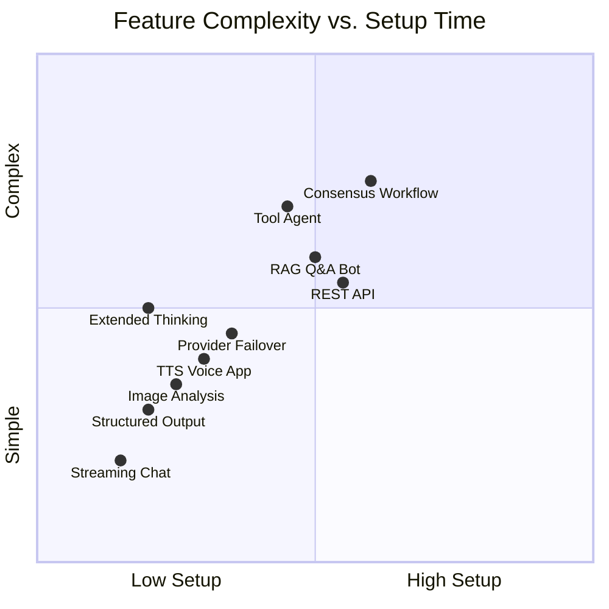

You've heard about AI SDKs but aren't sure where to start. Let's fix that.

You installed NeuroLink -- great! Now imagine you have a toolbox, and you are wondering what you can actually build with it. This post gives you 10 complete, working projects, each under 30 lines of code, that you can copy, paste, and run right now. Think of them as recipes: pick the one that sounds interesting, follow along, and you will have something real running in minutes.

In this post, you will learn:

- 10 distinct application patterns with NeuroLink
- How to leverage providers, tools, streaming, RAG (a way to make AI answer from your own documents), workflows, and server adapters
- Working code you can extend into production applications

```mermaid
flowchart TD
    NL["NeuroLink SDK"]

    NL --> A["1. Streaming Chat"]
    NL --> B["2. Structured Extraction"]
    NL --> C["3. RAG Q&A Bot"]
    NL --> D["4. Multi-Provider Consensus"]
    NL --> E["5. Tool-Augmented Agent"]
    NL --> F["6. REST API Server"]
    NL --> G["7. Provider Failover"]
    NL --> H["8. Voice App (TTS)"]
    NL --> I["9. Image Analysis"]
    NL --> J["10. Extended Thinking"]

    style NL fill:#0f4c75,stroke:#1b262c,color:#fff
    style A fill:#3282b8,stroke:#1b262c,color:#fff
    style B fill:#3282b8,stroke:#1b262c,color:#fff
    style C fill:#3282b8,stroke:#1b262c,color:#fff
    style D fill:#3282b8,stroke:#1b262c,color:#fff
    style E fill:#3282b8,stroke:#1b262c,color:#fff
    style F fill:#3282b8,stroke:#1b262c,color:#fff
    style G fill:#3282b8,stroke:#1b262c,color:#fff
    style H fill:#3282b8,stroke:#1b262c,color:#fff
    style I fill:#3282b8,stroke:#1b262c,color:#fff
    style J fill:#3282b8,stroke:#1b262c,color:#fff
```



---

## 1. A Streaming Chat Interface

The most common AI application: a chat interface that delivers responses in real time. NeuroLink's `stream()` method with a `systemPrompt` creates a fully functional chat personality in a handful of lines.

```typescript
import { NeuroLink } from '@juspay/neurolink';

const neurolink = new NeuroLink();

const result = await neurolink.stream({
  input: { text: 'What are the best practices for API design?' },
  provider: 'anthropic',
  model: 'claude-sonnet-4-5-20250929',
  systemPrompt: 'You are a senior software architect. Be concise and practical.',
  temperature: 0.7
});

for await (const chunk of result.stream) {
  process.stdout.write(chunk);
}
```

The `result.stream` async iterator delivers text chunks as they arrive. This works identically whether the underlying provider uses SSE, WebSocket, or HTTP chunking -- NeuroLink normalizes all of it.

For multi-turn conversations, pass a `conversationHistory` array to maintain context across messages. Combined with NeuroLink's Redis-backed conversation memory, you get persistent chat sessions without managing state yourself.

> **Tip:** Think of `temperature` like a creativity dial. Set it to `0.7` for natural, friendly conversations. Turn it down to `0.2` when you want factual, straight-to-the-point answers (like code help). Turn it up to `1.0` for brainstorming and creative writing.
{: .prompt-tip }

---

## 2. Structured Data Extraction

When you need validated JSON output instead of freeform text, combine NeuroLink with a Zod schema. The AI model will return structured data that matches your type definition exactly.

```typescript
import { NeuroLink } from '@juspay/neurolink';
import { z } from 'zod';

const ProductSchema = z.object({
  name: z.string(),
  price: z.number(),
  category: z.string(),
  features: z.array(z.string())
});

const neurolink = new NeuroLink();
const result = await neurolink.generate({
  input: { text: 'Extract product info: The new UltraWidget Pro costs $49.99, falls under electronics, and features bluetooth, waterproofing, and 48hr battery.' },
  provider: 'openai',
  model: 'gpt-4o',
  schema: ProductSchema,
  output: { format: 'structured' }
});

console.log(JSON.parse(result.content));
// { name: "UltraWidget Pro", price: 49.99, category: "electronics", features: [...] }
```

The Zod schema serves triple duty: it defines the TypeScript type, validates the runtime output, and generates the JSON schema that instructs the AI model. This is structured output with compile-time and runtime safety.

> **Warning:** Heads up if you are using Google's Gemini models: you need to add `disableTools: true` when using schemas. This is a Gemini-specific limitation -- it cannot handle function calling and structured JSON output at the same time.
{: .prompt-warning }

---

## 3. A RAG-Powered Q&A Bot

Retrieval-Augmented Generation (RAG) lets your AI answer questions grounded in your own documents. NeuroLink's inline `rag` option makes this a zero-pipeline-setup experience:

```typescript
import { NeuroLink } from '@juspay/neurolink';

const neurolink = new NeuroLink();

const result = await neurolink.generate({
  input: { text: 'What chunking strategies does NeuroLink support?' },
  provider: 'vertex',
  model: 'gemini-3-flash',
  rag: {
    files: ['./docs/guide.md', './docs/api-reference.md'],
    strategy: 'markdown',
    chunkSize: 512,
    topK: 5
  }
});

console.log(result.content);
```

> **Note:** Model names and IDs in code examples reflect versions available at time of writing. Model availability, naming conventions, and pricing change frequently. Always verify current model IDs with your provider's documentation before deploying to production.
{: .prompt-info }

The `rag` option in `generate()` automatically loads your documents, chunks them using the specified strategy, creates embeddings, retrieves relevant chunks, and injects them into the prompt. No separate pipeline setup required.

For more control, use the full `RAGPipeline` class with the `ChunkerRegistry`, which supports 9 chunking strategies: character, sentence, markdown, recursive, semantic, HTML, JSON, LaTeX, and token-based chunking. This lets you tune retrieval quality for different document types.

---

## 4. Multi-Provider Consensus

For high-stakes decisions, a single model's answer may not be enough. The `CONSENSUS_3_WORKFLOW` sends the same prompt to three different models, then uses a judge model to select the best response:

```typescript
import { NeuroLink, CONSENSUS_3_WORKFLOW } from '@juspay/neurolink';

const neurolink = new NeuroLink();

const result = await neurolink.generate({
  input: { text: 'Should I use microservices or a monolith for a new startup?' },
  workflowConfig: CONSENSUS_3_WORKFLOW
});

console.log('Answer:', result.content);
console.log('Selected model:', result.workflow?.selectedModel);
```

The workflow engine runs multiple models in parallel, collects their responses, and a judge model evaluates them for quality, accuracy, and completeness. The winning response is returned along with metadata about which model was selected and why.

This pattern is particularly valuable for:

- Financial analysis and recommendations
- Medical information summarization
- Legal document review
- Any scenario where accuracy matters more than speed

---

## 5. Tool-Augmented AI Agent

MCP (Model Context Protocol) tools let your AI interact with the real world -- reading files, querying databases, calling APIs. NeuroLink discovers available tools automatically and executes them during generation:

```typescript
import { NeuroLink } from '@juspay/neurolink';

const neurolink = new NeuroLink();
const tools = await neurolink.getAvailableTools();
console.log(`Available tools: ${tools.map(t => t.name).join(', ')}`);

const result = await neurolink.generate({
  input: { text: 'List the files in the current directory and summarize the project structure' },
  provider: 'openai',
  model: 'gpt-4o'
});

console.log(result.content);
console.log('Tools used:', result.toolsUsed);
```

The AI model decides which tools to call based on the user's request, executes them, and incorporates the results into its response. You get an AI agent that can take actions, not just generate text.

With 58+ MCP servers available, your agents can interact with file systems, GitHub, Slack, databases, and much more -- all through a standardized protocol.

---

## 6. A Production REST API

NeuroLink's server adapters let you expose your AI capabilities as a fully-featured HTTP API with a single function call. No route definitions, no middleware setup -- just pick your framework and go:

```typescript
import { NeuroLink } from '@juspay/neurolink';
import { createServer } from '@juspay/neurolink/server';

const neurolink = new NeuroLink();

const server = await createServer(neurolink, {
  framework: 'hono',
  config: { port: 3000 }
});

await server.initialize();
await server.start();
console.log('NeuroLink API running on http://localhost:3000');
```

This automatically creates endpoints for `/generate`, `/stream`, `/tools`, and health checks. You get a production-ready AI API with:

- Automatic request validation
- Streaming response support
- MCP tool routes
- Health check endpoints

Supported frameworks include Hono, Express, Fastify, and Koa. Choose the one that matches your existing stack.

> **Tip:** Hono is recommended for new projects -- it is fast, lightweight, and runs on Edge runtimes, Node.js, and Bun.
{: .prompt-tip }

---

## 7. Provider Failover for High Availability

Production systems cannot afford single points of failure. `createAIProviderWithFallback()` configures a primary and fallback provider so that outages are transparent to your users:

```typescript
import { createAIProviderWithFallback } from '@juspay/neurolink';

const { primary, fallback } = await createAIProviderWithFallback(
  'vertex',    // Primary: Google Vertex
  'bedrock'    // Fallback: AWS Bedrock
);

try {
  const result = await primary.generate({ input: { text: 'Summarize this report...' } });
  console.log(result.content);
} catch {
  console.log('Primary failed, using fallback...');
  const result = await fallback.generate({ input: { text: 'Summarize this report...' } });
  console.log(result.content);
}
```

For fully automatic provider selection, `createBestAIProvider()` scans your environment variables and picks the best available provider without any configuration:

```typescript
import { createBestAIProvider } from '@juspay/neurolink';

const provider = await createBestAIProvider();
// Checks OPENAI_API_KEY, ANTHROPIC_API_KEY, GOOGLE_API_KEY, etc.
// Automatically selects the first available provider
```

NeuroLink also includes built-in retry logic with circuit breakers for fault tolerance at the request level, not just the provider level.

---

## 8. A Voice-Enabled AI App (TTS)

Add text-to-speech to your AI application with the `tts` option. The AI generates a response and speaks it aloud:

```typescript
import { NeuroLink } from '@juspay/neurolink';
import { writeFileSync } from 'fs';

const neurolink = new NeuroLink();

const result = await neurolink.generate({
  input: { text: 'Tell me a short bedtime story about a robot' },
  provider: 'google-ai',
  tts: {
    enabled: true,
    useAiResponse: true,
    voice: 'en-US-Neural2-C',
    format: 'mp3'
  }
});

console.log(result.content);
if (result.audio) {
  writeFileSync('story.mp3', result.audio.buffer);
  console.log(`Audio saved: ${result.audio.size} bytes`);
}
```

The `useAiResponse: true` flag tells NeuroLink to speak the generated AI response rather than the input text. This creates a natural pipeline: generate a story, then hear it read aloud.

This pattern is the foundation for voice assistants, accessibility features, audiobook generators, and interactive educational applications.

---

## 9. Multimodal Image Analysis

Pass images to vision-capable models and get intelligent analysis. NeuroLink supports both Buffer and URL inputs, with the `ImageWithAltText` interface for accessibility:

```typescript
import { NeuroLink } from '@juspay/neurolink';
import { readFileSync } from 'fs';

const neurolink = new NeuroLink();
const imageBuffer = readFileSync('./product-screenshot.png');

const result = await neurolink.generate({
  input: {
    text: 'Describe this product screenshot and identify any UX issues',
    images: [
      { data: imageBuffer, altText: 'Product dashboard screenshot' }
    ]
  },
  provider: 'openai',
  model: 'gpt-4o'
});

console.log(result.content);
```

Image analysis works with any vision-capable model, including GPT-4o, Gemini, and Claude. Use cases range from product screenshot analysis and document OCR to content moderation and accessibility auditing.

You can pass multiple images in the `images` array to enable comparison analysis, multi-page document processing, or before-and-after evaluations.

---

## 10. Extended Thinking for Complex Reasoning

Some problems require deep reasoning -- mathematical proofs, complex code analysis, strategic planning. Extended thinking gives the model a dedicated "thinking budget" to work through the problem step by step before generating a response:

```typescript
import { NeuroLink } from '@juspay/neurolink';

const neurolink = new NeuroLink();

const result = await neurolink.generate({
  input: { text: 'Prove that the square root of 2 is irrational.' },
  provider: 'anthropic',
  model: 'claude-3-7-sonnet-20250219',
  thinkingConfig: {
    enabled: true,
    budgetTokens: 10000
  }
});

console.log(result.content);
```

The `thinkingConfig` options differ by provider:

- **Anthropic:** `{ enabled: true, budgetTokens: 10000 }` -- allocates a token budget for internal reasoning
- **Google Gemini 3:** `{ thinkingLevel: 'high' }` -- sets the thinking depth level (minimal, low, medium, high)

Extended thinking dramatically improves quality on tasks that benefit from step-by-step reasoning: mathematical proofs, code debugging, architectural decision-making, and complex analysis.

> **Note:** Extended thinking increases token usage and response time. Use it selectively for tasks where accuracy is worth the additional cost.
{: .prompt-info }

---

## Complexity vs. Setup Time

Here is how these 10 patterns compare in terms of setup effort and feature complexity:



The key takeaway: even the most complex patterns (consensus workflows, RAG pipelines, tool agents) are achievable in under 30 lines of code. NeuroLink handles the complexity behind a clean API surface.

---

## What's Next

You just saw 10 different things you can build, and every single one fits in under 30 lines of code. The best part? You can mix and match them. Imagine a chatbot that uses streaming (pattern 1) to feel responsive, answers questions from your documents using RAG (pattern 3), and automatically switches providers if one goes down (pattern 7). That is a real production app, and you already know how to build every piece of it.

Here are some great next steps depending on what caught your eye:

- **Want the big picture?** [What is NeuroLink? The Unified AI SDK Explained](/posts/what-is-neurolink-unified-sdk/)
- **Haven't set up yet?** [Getting Started with NeuroLink: Your First AI App in 5 Minutes](/posts/getting-started-first-ai-app/)
- **Ready for production?** From Zero to Production: Deploying Your First NeuroLink App
- **Want better streaming?** Streaming Best Practices with NeuroLink
- **Curious about AI tools?** MCP Tools Integration Guide
- **Need structured data?** Structured Output & JSON Patterns

Share what you build with the community. Open a discussion on the [NeuroLink GitHub repository](https://github.com/juspay/neurolink) or contribute your own examples.

---

**Related posts:**

- [Getting Started with NeuroLink: Your First AI App in 5 Minutes](/posts/getting-started-first-ai-app/)
- [What is NeuroLink? The Unified AI SDK Explained](/posts/what-is-neurolink-unified-sdk/)
- [Why We Built NeuroLink: Our Origin Story](/posts/why-we-built-neurolink/)
