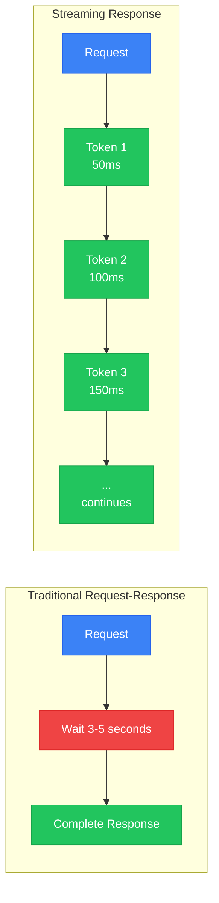
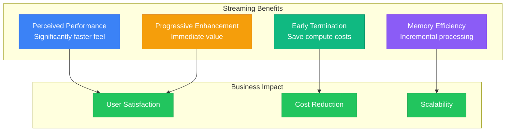
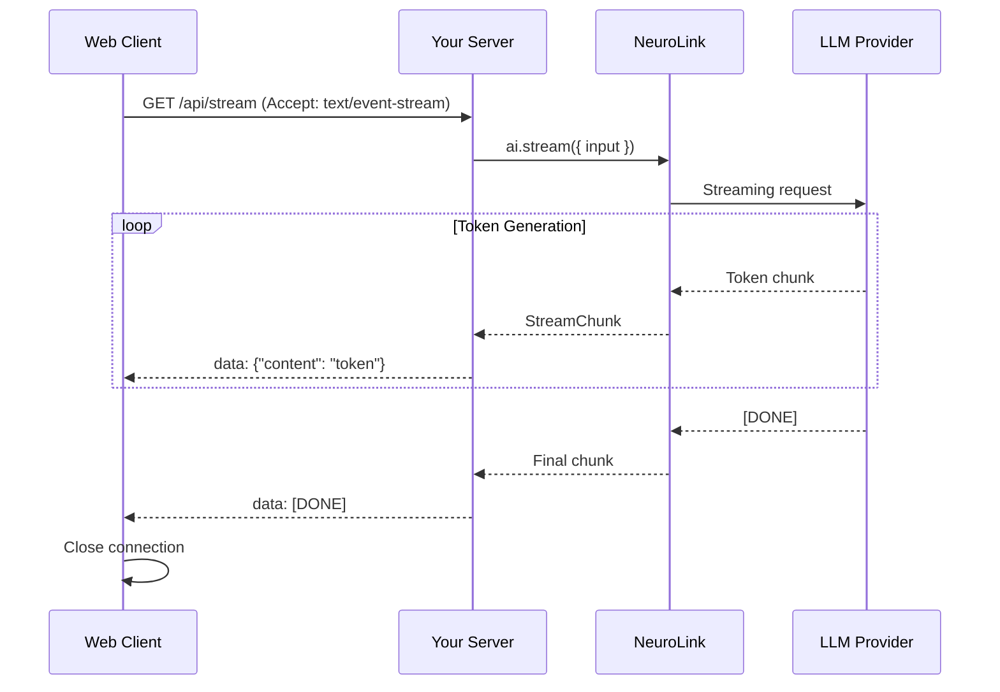
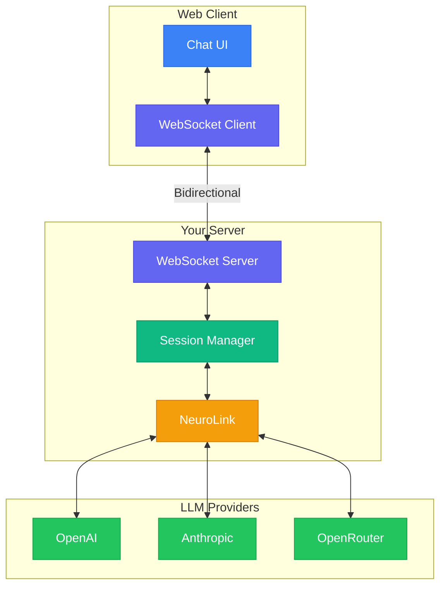
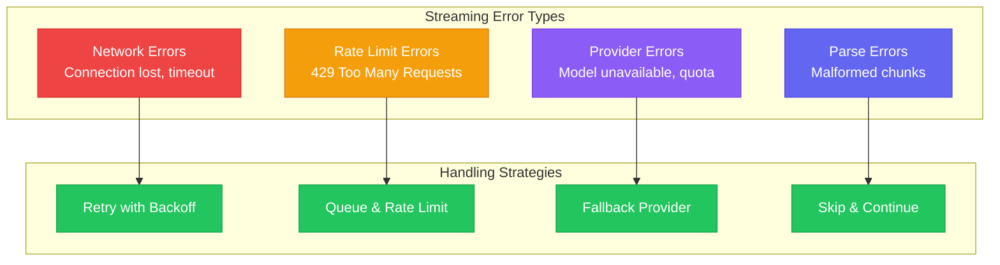

By the end of this guide, you'll have real-time streaming AI responses working with SSE, WebSockets, and production-ready error handling.

Streaming delivers AI responses token by token as they generate. Users see text appear in real time instead of staring at a loading spinner. This guide walks you through every streaming pattern you need: from a basic three-line setup to a full WebSocket server with reconnection, error handling, and React integration.



---

## Why Streaming Matters

Before diving into implementation, understand why streaming transforms AI applications. The benefits extend beyond perceived performance.

### Perceived Latency Reduction

Human perception of speed depends on feedback. A 5-second wait with no feedback feels longer than watching text appear over 5 seconds. Streaming provides continuous visual feedback, making the same actual latency feel dramatically shorter.

Studies show users typically perceive streaming responses as significantly faster than equivalent buffered responses. This perception directly impacts user satisfaction and engagement.

### Early Termination Opportunities

Streaming enables users to stop generation early. If the first few sentences answer their question, they can move on without waiting for a complete response. This saves compute costs and respects user time.

### Progressive Enhancement

Streaming allows progressive UI enhancement. Show rough content immediately, then enhance with formatting, syntax highlighting, or rendered markdown as more context arrives. Users get immediate value while polish applies progressively.

### Memory Efficiency

Buffered responses require holding entire responses in memory before delivery. Streaming processes and delivers chunks incrementally, reducing memory pressure for long responses. This matters especially for resource-constrained environments.



---


## Streaming Fundamentals with NeuroLink

NeuroLink's streaming API provides a consistent interface across all supported providers. The same code works whether you're streaming from OpenAI, Anthropic, or any OpenRouter model.

### Basic Streaming Setup

Start with the simplest streaming pattern:

```typescript
import { NeuroLink } from "@juspay/neurolink";

async function basicStreaming() {
  const ai = new NeuroLink();

  console.log("Basic Streaming Example\n");
  console.log("=".repeat(60));
  console.log("\nResponse:");
  console.log("-".repeat(60));

  // Create a streaming request - returns StreamResult
  const result = await ai.stream({
    input: {
      text: "Explain the benefits of microservices architecture",
    },
    systemPrompt: "You are a senior software architect",
  });

  let fullContent = "";
  let chunkCount = 0;

  // Process chunks as they arrive - iterate over result.stream
  for await (const chunk of result.stream) {
    if ('content' in chunk) {
      process.stdout.write(chunk.content);
      fullContent += chunk.content;
      chunkCount++;
    }
  }

  console.log("\n\n" + "-".repeat(60));
  console.log(`\nStreaming complete!`);
  console.log(`Total chunks: ${chunkCount}`);
  console.log(`Total characters: ${fullContent.length}`);
}

basicStreaming().catch(console.error);
```

The `stream()` method returns a `StreamResult` object containing a `stream` async iterable. Each iteration yields a chunk containing the next portion of the response. Chunks arrive as the model generates them, typically every 10-50 milliseconds.

**CLI equivalent:**

```bash
neurolink stream "Explain microservices architecture" -p openai
```

### Chunk Structure

Each streaming chunk is a simple object with the text content:

```typescript
// StreamChunk is a discriminated union for text and audio chunks
type StreamChunk =
  | { type: "text"; content: string }
  | { type: "audio"; audioChunk: TTSChunk };

// AudioChunk structure for audio data (from TTS processor)
type AudioChunk = {
  data: Buffer;
  sampleRateHz: number;
  channels: number;
  encoding: "PCM16LE";
  isFinal?: boolean;
};

// StreamResult contains metadata after streaming completes
interface StreamResult {
  stream: AsyncIterable<StreamChunk>;
  provider?: string;
  model?: string;
  usage?: TokenUsage;
  finishReason?: string;
  toolCalls?: ToolCall[];
  toolResults?: ToolResult[];
}
```

Access finish reason and usage statistics from the final chunk:

```typescript
async function streamWithMetadata() {
  const ai = new NeuroLink();

  const result = await ai.stream({
    input: { text: "Write a haiku about programming" },
  });

  // Iterate over result.stream to get chunks
  for await (const chunk of result.stream) {
    if ('content' in chunk) {
      process.stdout.write(chunk.content);
    }
  }

  // Metadata is available on the result object after streaming
  if (result.finishReason) {
    console.log(`\n\nFinish reason: ${result.finishReason}`);
  }
  if (result.usage) {
    console.log(`Total tokens used: ${result.usage.total}`);
  }
}
```

---

## Server-Sent Events (SSE) Implementation

Server-Sent Events provide the simplest way to stream AI responses to web clients. SSE uses a single HTTP connection for server-to-client streaming, making it ideal for AI response delivery.

### SSE Architecture



### Express.js SSE Server

Implement an SSE endpoint with Express:

```typescript
import express from "express";
import { NeuroLink } from "@juspay/neurolink";

const app = express();
const ai = new NeuroLink();

app.use(express.json());

// SSE streaming endpoint
app.post("/api/stream", async (req, res) => {
  const { prompt, systemPrompt } = req.body;

  // Set SSE headers
  res.setHeader("Content-Type", "text/event-stream");
  res.setHeader("Cache-Control", "no-cache");
  res.setHeader("Connection", "keep-alive");
  res.setHeader("X-Accel-Buffering", "no"); // Disable nginx buffering

  // Handle client disconnect
  let isClientConnected = true;
  req.on("close", () => {
    isClientConnected = false;
    console.log("Client disconnected");
  });

  try {
    const result = await ai.stream({
      input: {
        text: prompt,
      },
      systemPrompt: systemPrompt || "You are a helpful assistant",
    });

    for await (const chunk of result.stream) {
      // Stop if client disconnected
      if (!isClientConnected) {
        break;
      }

      if ('content' in chunk) {
        // Send SSE formatted data
        res.write(`data: ${JSON.stringify({ content: chunk.content })}\n\n`);
      }
    }

    // Send final metadata from result
    res.write(`data: ${JSON.stringify({
      done: true,
      finishReason: result.finishReason,
      usage: result.usage,
    })}\n\n`);

    // Signal stream end
    res.write("data: [DONE]\n\n");
    res.end();
  } catch (error) {
    console.error("Streaming error:", error);
    res.write(`data: ${JSON.stringify({ error: "Stream failed" })}\n\n`);
    res.end();
  }
});

app.listen(3000, () => {
  console.log("SSE server running on http://localhost:3000");
});
```

### Browser SSE Client

Consume the SSE stream in the browser:

```typescript
// Browser-side SSE client
class AIStreamClient {
  private eventSource: EventSource | null = null;
  private abortController: AbortController | null = null;

  async stream(
    prompt: string,
    onChunk: (content: string) => void,
    onComplete?: (usage: { totalTokens: number }) => void,
    onError?: (error: Error) => void
  ): Promise<void> {
    // Use fetch with POST for SSE (EventSource only supports GET)
    this.abortController = new AbortController();

    try {
      const response = await fetch("/api/stream", {
        method: "POST",
        headers: {
          "Content-Type": "application/json",
          "Accept": "text/event-stream",
        },
        body: JSON.stringify({ prompt }),
        signal: this.abortController.signal,
      });

      if (!response.ok) {
        throw new Error(`HTTP ${response.status}: ${response.statusText}`);
      }

      const reader = response.body?.getReader();
      const decoder = new TextDecoder();

      if (!reader) {
        throw new Error("No response body");
      }

      let buffer = "";

      while (true) {
        const { done, value } = await reader.read();

        if (done) break;

        buffer += decoder.decode(value, { stream: true });

        // Parse SSE messages
        const lines = buffer.split("\n");
        buffer = lines.pop() || ""; // Keep incomplete line in buffer

        for (const line of lines) {
          if (line.startsWith("data: ")) {
            const data = line.slice(6);

            if (data === "[DONE]") {
              return;
            }

            try {
              const parsed = JSON.parse(data);

              if (parsed.content) {
                onChunk(parsed.content);
              }

              if (parsed.done && parsed.usage && onComplete) {
                onComplete(parsed.usage);
              }

              if (parsed.error && onError) {
                onError(new Error(parsed.error));
              }
            } catch (e) {
              // Skip malformed JSON
            }
          }
        }
      }
    } catch (error) {
      if (error instanceof Error && error.name !== "AbortError") {
        onError?.(error);
      }
    }
  }

  abort(): void {
    this.abortController?.abort();
    this.eventSource?.close();
  }
}

// Usage
const client = new AIStreamClient();

client.stream(
  "Explain quantum computing",
  (content) => {
    // Append each chunk to UI
    document.getElementById("response")!.textContent += content;
  },
  (usage) => {
    console.log(`Completed with ${usage.total} tokens`);
  },
  (error) => {
    console.error("Stream error:", error);
  }
);
```

---

## WebSocket Patterns

WebSockets provide bidirectional communication, enabling more sophisticated patterns like conversation continuity and real-time user interruption.

### WebSocket Architecture



### WebSocket Server Implementation

Build a WebSocket server with conversation support:

```typescript
import { WebSocket, WebSocketServer } from "ws";
import { NeuroLink } from "@juspay/neurolink";

interface ClientSession {
  ws: WebSocket;
  sessionId?: string;
  currentStream?: AsyncIterableIterator<any>;
  isStreaming: boolean;
}

const wss = new WebSocketServer({ port: 8080 });
const sessions = new Map<WebSocket, ClientSession>();
const ai = new NeuroLink();

wss.on("connection", (ws: WebSocket) => {
  console.log("Client connected");

  // Initialize session
  const session: ClientSession = {
    ws,
    isStreaming: false,
  };
  sessions.set(ws, session);

  ws.on("message", async (data: Buffer) => {
    const message = JSON.parse(data.toString());
    const session = sessions.get(ws);

    if (!session) return;

    switch (message.type) {
      case "chat":
        await handleChat(session, message);
        break;

      case "abort":
        handleAbort(session);
        break;

      case "ping":
        ws.send(JSON.stringify({ type: "pong" }));
        break;
    }
  });

  ws.on("close", () => {
    const session = sessions.get(ws);
    if (session) {
      handleAbort(session);
      sessions.delete(ws);
    }
    console.log("Client disconnected");
  });
});

async function handleChat(session: ClientSession, message: any): Promise<void> {
  // Abort any existing stream
  if (session.isStreaming) {
    handleAbort(session);
  }

  session.isStreaming = true;

  try {
    // Note: context is for analytics metadata, not session management
    // For conversation history, use the messages array in input
    const result = await ai.stream({
      input: {
        text: message.prompt,
      },
      systemPrompt: message.systemPrompt,
    });

    session.currentStream = result.stream[Symbol.asyncIterator]();

    for await (const chunk of result.stream) {
      // Check if aborted
      if (!session.isStreaming) {
        break;
      }

      if ('content' in chunk) {
        session.ws.send(JSON.stringify({
          type: "chunk",
          content: chunk.content,
        }));
      }
    }

    // Send completion metadata from result
    session.ws.send(JSON.stringify({
      type: "complete",
      finishReason: result.finishReason,
      usage: result.usage,
      sessionId: session.sessionId,
    }));
  } catch (error) {
    session.ws.send(JSON.stringify({
      type: "error",
      message: error instanceof Error ? error.message : "Unknown error",
    }));
  } finally {
    session.isStreaming = false;
    session.currentStream = undefined;
  }
}

function handleAbort(session: ClientSession): void {
  session.isStreaming = false;
  session.currentStream = undefined;
  session.ws.send(JSON.stringify({ type: "aborted" }));
}

console.log("WebSocket server running on ws://localhost:8080");
```

### WebSocket Client with Reconnection

Build a robust WebSocket client with automatic reconnection:

```typescript
class WebSocketAIClient {
  private ws: WebSocket | null = null;
  private url: string;
  private reconnectAttempts = 0;
  private maxReconnectAttempts = 5;
  private reconnectDelay = 1000;
  private messageQueue: any[] = [];

  // Event handlers
  onChunk?: (content: string) => void;
  onComplete?: (data: { usage: any; sessionId: string }) => void;
  onError?: (error: Error) => void;
  onConnectionChange?: (connected: boolean) => void;

  constructor(url: string) {
    this.url = url;
    this.connect();
  }

  private connect(): void {
    this.ws = new WebSocket(this.url);

    this.ws.onopen = () => {
      console.log("Connected to AI server");
      this.reconnectAttempts = 0;
      this.onConnectionChange?.(true);

      // Send queued messages
      while (this.messageQueue.length > 0) {
        const msg = this.messageQueue.shift();
        this.ws?.send(JSON.stringify(msg));
      }
    };

    this.ws.onmessage = (event) => {
      const message = JSON.parse(event.data);

      switch (message.type) {
        case "chunk":
          this.onChunk?.(message.content);
          break;

        case "complete":
          this.onComplete?.({
            usage: message.usage,
            sessionId: message.sessionId,
          });
          break;

        case "error":
          this.onError?.(new Error(message.message));
          break;

        case "aborted":
          console.log("Stream aborted");
          break;
      }
    };

    this.ws.onclose = () => {
      this.onConnectionChange?.(false);
      this.attemptReconnect();
    };

    this.ws.onerror = (error) => {
      console.error("WebSocket error:", error);
    };
  }

  private attemptReconnect(): void {
    if (this.reconnectAttempts >= this.maxReconnectAttempts) {
      this.onError?.(new Error("Max reconnection attempts reached"));
      return;
    }

    this.reconnectAttempts++;
    const delay = this.reconnectDelay * Math.pow(2, this.reconnectAttempts - 1);

    console.log(`Reconnecting in ${delay}ms (attempt ${this.reconnectAttempts})`);

    setTimeout(() => this.connect(), delay);
  }

  send(prompt: string, systemPrompt?: string): void {
    const message = {
      type: "chat",
      prompt,
      systemPrompt,
    };

    if (this.ws?.readyState === WebSocket.OPEN) {
      this.ws.send(JSON.stringify(message));
    } else {
      // Queue message for when connection is established
      this.messageQueue.push(message);
    }
  }

  abort(): void {
    if (this.ws?.readyState === WebSocket.OPEN) {
      this.ws.send(JSON.stringify({ type: "abort" }));
    }
  }

  disconnect(): void {
    this.maxReconnectAttempts = 0; // Prevent reconnection
    this.ws?.close();
  }
}

// Usage
const client = new WebSocketAIClient("ws://localhost:8080");

client.onChunk = (content) => {
  document.getElementById("response")!.textContent += content;
};

client.onComplete = ({ usage, sessionId }) => {
  console.log(`Completed. Tokens: ${usage.total}, Session: ${sessionId}`);
};

client.onConnectionChange = (connected) => {
  document.getElementById("status")!.textContent = connected ? "Connected" : "Reconnecting...";
};

// Send a message
client.send("What is machine learning?");
```

---

## Error Handling Patterns

Production streaming requires robust error handling. Network interruptions, rate limits, and provider errors all need graceful handling.

### Error Categories



### Comprehensive Error Handler

Implement robust error handling with retry logic:

```typescript
import { NeuroLink } from "@juspay/neurolink";

interface StreamOptions {
  prompt: string;
  systemPrompt?: string;
  maxRetries?: number;
  retryDelay?: number;
  onChunk: (content: string) => void;
  onError?: (error: Error, willRetry: boolean) => void;
  onComplete?: () => void;
}

class ResilientStreamer {
  private ai: NeuroLink;

  constructor() {
    this.ai = new NeuroLink();
  }

  async stream(options: StreamOptions): Promise<void> {
    const {
      prompt,
      systemPrompt,
      maxRetries = 3,
      retryDelay = 1000,
      onChunk,
      onError,
      onComplete,
    } = options;

    let attempts = 0;
    let lastError: Error | null = null;

    while (attempts < maxRetries) {
      try {
        const result = await this.ai.stream({
          input: { text: prompt },
          systemPrompt,
        });

        for await (const chunk of result.stream) {
          if ('content' in chunk) {
            onChunk(chunk.content);
          }
        }

        // Success - call complete and return
        onComplete?.();
        return;
      } catch (error) {
        attempts++;
        lastError = error instanceof Error ? error : new Error(String(error));

        const willRetry = attempts < maxRetries && this.shouldRetry(error);

        onError?.(lastError, willRetry);

        if (!willRetry) {
          throw lastError;
        }

        // Exponential backoff
        const delay = retryDelay * Math.pow(2, attempts - 1);
        await this.sleep(delay);
      }
    }

    throw lastError || new Error("Max retries exceeded");
  }

  private shouldRetry(error: unknown): boolean {
    if (!(error instanceof Error)) {
      return true; // Default to retry for unknown errors
    }

    const message = error.message.toLowerCase();

    // Don't retry on authentication or authorization errors
    if (message.includes("401") || message.includes("403")) {
      return false;
    }

    // Don't retry on bad request errors
    if (message.includes("400") || message.includes("invalid")) {
      return false;
    }

    // Retry on rate limit errors
    if (message.includes("429") || message.includes("rate limit")) {
      return true;
    }

    // Retry on server errors
    if (message.includes("500") || message.includes("503")) {
      return true;
    }

    // Retry on network errors
    if (message.includes("econnreset") || message.includes("etimedout")) {
      return true;
    }

    if (message.includes("network") || message.includes("connection")) {
      return true;
    }

    return true; // Default to retry
  }

  private sleep(ms: number): Promise<void> {
    return new Promise((resolve) => setTimeout(resolve, ms));
  }
}

// Usage
const streamer = new ResilientStreamer();

await streamer.stream({
  prompt: "Explain distributed systems",
  maxRetries: 3,
  retryDelay: 1000,
  onChunk: (content) => process.stdout.write(content),
  onError: (error, willRetry) => {
    console.error(`\nError: ${error.message}`);
    if (willRetry) {
      console.log("Retrying...");
    }
  },
  onComplete: () => console.log("\n\nStream complete!"),
});
```

### Fallback Provider Pattern

Automatically switch providers when one fails:

```typescript
import { NeuroLink } from "@juspay/neurolink";

const providers = ["openai", "anthropic", "openrouter"] as const;

async function streamWithFallback(
  prompt: string,
  onChunk: (content: string) => void
): Promise<void> {
  const ai = new NeuroLink();

  for (const provider of providers) {
    try {
      const result = await ai.stream({
        provider,  // Provider specified per-request
        input: { text: prompt },
      });

      for await (const chunk of result.stream) {
        if ('content' in chunk) {
          onChunk(chunk.content);
        }
      }

      // Success with this provider
      return;
    } catch (error) {
      console.warn(`Provider ${provider} failed, trying next...`);
      continue;
    }
  }

  throw new Error("All providers failed");
}
```

---

## UI Integration Patterns

Streaming creates unique UI challenges. Text arrives incrementally, requiring careful state management and rendering optimization.

### React Streaming Hook

Build a reusable React hook for streaming:

```typescript
import { useState, useCallback, useRef } from "react";

interface UseAIStreamOptions {
  endpoint: string;
}

interface UseAIStreamReturn {
  content: string;
  isStreaming: boolean;
  error: Error | null;
  stream: (prompt: string) => Promise<void>;
  abort: () => void;
}

export function useAIStream({ endpoint }: UseAIStreamOptions): UseAIStreamReturn {
  const [content, setContent] = useState("");
  const [isStreaming, setIsStreaming] = useState(false);
  const [error, setError] = useState<Error | null>(null);
  const abortControllerRef = useRef<AbortController | null>(null);

  const stream = useCallback(async (prompt: string) => {
    // Reset state
    setContent("");
    setError(null);
    setIsStreaming(true);

    // Create abort controller
    abortControllerRef.current = new AbortController();

    try {
      const response = await fetch(endpoint, {
        method: "POST",
        headers: {
          "Content-Type": "application/json",
          "Accept": "text/event-stream",
        },
        body: JSON.stringify({ prompt }),
        signal: abortControllerRef.current.signal,
      });

      if (!response.ok) {
        throw new Error(`HTTP ${response.status}`);
      }

      const reader = response.body?.getReader();
      const decoder = new TextDecoder();

      if (!reader) throw new Error("No response body");

      let buffer = "";

      while (true) {
        const { done, value } = await reader.read();
        if (done) break;

        buffer += decoder.decode(value, { stream: true });
        const lines = buffer.split("\n");
        buffer = lines.pop() || "";

        for (const line of lines) {
          if (line.startsWith("data: ")) {
            const data = line.slice(6);
            if (data === "[DONE]") break;

            try {
              const parsed = JSON.parse(data);
              if (parsed.content) {
                setContent((prev) => prev + parsed.content);
              }
            } catch {
              // Skip malformed JSON
            }
          }
        }
      }
    } catch (err) {
      if (err instanceof Error && err.name !== "AbortError") {
        setError(err);
      }
    } finally {
      setIsStreaming(false);
      abortControllerRef.current = null;
    }
  }, [endpoint]);

  const abort = useCallback(() => {
    abortControllerRef.current?.abort();
  }, []);

  return { content, isStreaming, error, stream, abort };
}

// Usage in component
function ChatComponent() {
  const { content, isStreaming, error, stream, abort } = useAIStream({
    endpoint: "/api/stream",
  });

  const handleSubmit = (prompt: string) => {
    stream(prompt);
  };

  return (
    <div>
      <div className="response">
        {content}
        {isStreaming && <span className="cursor">|</span>}
      </div>
      {error && <div className="error">{error.message}</div>}
      {isStreaming && (
        <button onClick={abort}>Stop</button>
      )}
    </div>
  );
}
```

---

## Summary

You now have a complete streaming toolkit. Here is what you built:

- Basic streaming with NeuroLink's consistent API
- SSE endpoints for web client streaming
- WebSocket servers for bidirectional communication
- Error handling with retry and fallback patterns
- React integration with a reusable custom hook

Your next step: pick the transport that fits your use case (SSE for simplicity, WebSocket for bidirectional chat), wire it into your frontend, and ship it. Your users will feel the difference immediately.

---

*Questions about streaming patterns? Join our [Discord community](https://discord.gg/neurolink) or [open an issue on GitHub](https://github.com/juspay/neurolink/issues).*

---

**Related posts:**

- [NeuroLink Quickstart: 10 Things You Can Build Today](/posts/neurolink-quickstart-10-things/)
- [Getting Started with NeuroLink: Your First AI App in 5 Minutes](/posts/getting-started-first-ai-app/)
- [What is NeuroLink? The Unified AI SDK Explained](/posts/what-is-neurolink-unified-sdk/)
