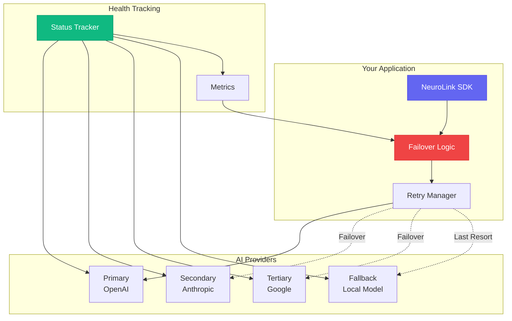
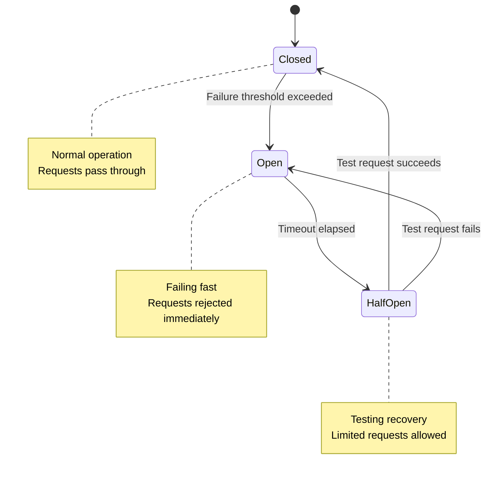

> **Implementation Note**: The patterns shown in this guide are implemented on top of NeuroLink's core API. They are not built-in SDK features but represent recommended approaches you can build yourself.
{: .prompt-info }

By the end of this guide, you'll have a multi-provider failover system with retry logic, circuit breakers, health monitoring, and graceful degradation -- all working with NeuroLink's unified API.

Your production AI system should never go down because a single provider has an outage. You will build failover logic once, and it will work across all 13 providers without vendor-specific error handling.

> **Note:** NeuroLink provides type definitions for FallbackConfig and RetryConfig,
> but automatic failover is currently user-implemented using the patterns shown below.
> Built-in provider failover is on the roadmap for 2026.



---

## Understanding Failover Fundamentals

Failover means automatically switching to a backup system when the primary fails. In AI applications, this translates to routing requests to alternative providers when your preferred model becomes unavailable.

### Why Single-Provider Architectures Fail

Every AI provider experiences downtime. OpenAI reported multiple outages in 2024. Anthropic's Claude has scheduled maintenance windows. Google's Gemini occasionally returns unexpected errors. No provider offers 100% uptime.

Rate limits create additional failure modes. High-traffic applications exhaust quotas quickly. Once you hit the limit, the provider rejects all requests until the window resets. Your users wait or leave.

Network issues compound these problems. Transient failures occur regularly. DNS resolution fails. TLS handshakes timeout. Proxies drop connections. Any network hop between your server and the provider can fail.

Single-provider architectures transform each of these issues into total application failure. Users see errors. Requests queue up. Latency spikes. Revenue disappears.

### The Multi-Provider Solution

Multi-provider architectures eliminate single points of failure. When Provider A fails, requests route to Provider B. When B exhausts rate limits, Provider C handles overflow. Your application stays responsive across all failure modes.

NeuroLink makes multi-provider architecture simple. The unified API means your failover logic does not need provider-specific handling. One interface works across OpenAI, Anthropic, Google, and more.

---


## Basic Failover Pattern

The simplest failover pattern iterates through providers until one succeeds.

```typescript
import { NeuroLink } from '@juspay/neurolink';

const neurolink = new NeuroLink();

// Provider configuration with model mappings
const providerConfigs = [
  { provider: 'openai', model: 'gpt-4o' },
  { provider: 'anthropic', model: 'claude-sonnet-4-5-20250929' },
  { provider: 'vertex', model: 'gemini-2.5-pro' }
];

async function generateWithFailover(prompt: string) {
  const errors: Error[] = [];

  for (const config of providerConfigs) {
    try {
      const response = await neurolink.generate({
        input: { text: prompt },
        provider: config.provider,
        model: config.model
      });

      return {
        response,
        provider: config.provider,
        failoverCount: errors.length
      };
    } catch (error) {
      console.log(`${config.provider} failed: ${error.message}`);
      errors.push(error);
      continue;
    }
  }

  throw new AggregateError(errors, 'All providers failed');
}
```

This pattern establishes OpenAI as primary, Anthropic as secondary, and Google as tertiary. The function tries providers in order until one succeeds.

---


## Retry Strategies That Work

Not all failures require failover. Transient errors often resolve with a simple retry. Implementing intelligent retry logic reduces unnecessary provider switching while maintaining reliability.

### Exponential Backoff with Jitter

Exponential backoff increases delay between retry attempts. This prevents thundering herd problems when many clients retry simultaneously. Jitter adds randomness to prevent synchronization.

```typescript
function sleep(ms: number): Promise<void> {
  return new Promise(resolve => setTimeout(resolve, ms));
}

function calculateBackoff(
  attempt: number,
  options: {
    initialDelay: number;
    maxDelay: number;
    multiplier: number;
    jitter: number;
  }
): number {
  const { initialDelay, maxDelay, multiplier, jitter } = options;

  // Calculate base delay with exponential growth
  const baseDelay = Math.min(
    initialDelay * Math.pow(multiplier, attempt),
    maxDelay
  );

  // Add jitter: random value between -jitter% and +jitter%
  const jitterRange = baseDelay * jitter;
  const jitterValue = (Math.random() * 2 - 1) * jitterRange;

  return Math.round(baseDelay + jitterValue);
}

async function generateWithRetry(
  neurolink: NeuroLink,
  request: { prompt: string; provider: string; model: string },
  maxAttempts: number = 3
) {
  const backoffOptions = {
    initialDelay: 100,
    maxDelay: 30000,
    multiplier: 2,
    jitter: 0.2
  };

  for (let attempt = 0; attempt < maxAttempts; attempt++) {
    try {
      return await neurolink.generate({
        input: { text: request.prompt },
        provider: request.provider,
        model: request.model
      });
    } catch (error) {
      const isLastAttempt = attempt === maxAttempts - 1;
      const isRetriable = isRetriableError(error);

      if (isLastAttempt || !isRetriable) {
        throw error;
      }

      const delay = calculateBackoff(attempt, backoffOptions);
      console.log(`Attempt ${attempt + 1} failed, retrying in ${delay}ms`);
      await sleep(delay);
    }
  }
}
```

The first retry waits 100ms. The second waits 200ms. The third waits 400ms. Jitter varies each delay by up to 20%. This spreads retry traffic across time windows.

### Retry Only on Retriable Errors

Not every error deserves a retry. Authentication failures never succeed on retry. Invalid request formats fail consistently. Retrying these wastes time and resources.

```typescript
function isRetriableError(error: any): boolean {
  // Network errors are retriable
  if (error.code === 'ECONNRESET' ||
      error.code === 'ETIMEDOUT' ||
      error.code === 'ENOTFOUND') {
    return true;
  }

  // HTTP status codes
  const status = error.status || error.statusCode;

  // 5xx errors are typically retriable
  if (status >= 500 && status < 600) {
    return true;
  }

  // Rate limiting is retriable (after delay)
  if (status === 429) {
    return true;
  }

  // These are not retriable
  const nonRetriableStatuses = [
    400, // Bad request
    401, // Authentication error
    403, // Forbidden
    404, // Not found
    422  // Validation error
  ];

  if (nonRetriableStatuses.includes(status)) {
    return false;
  }

  // Check error messages for known patterns
  const message = error.message?.toLowerCase() || '';

  if (message.includes('authentication') ||
      message.includes('invalid api key') ||
      message.includes('content policy')) {
    return false;
  }

  // Default to retriable for unknown errors
  return true;
}
```

### Combined Retry and Failover

Combine retry logic with failover for maximum resilience.

```typescript
import { NeuroLink } from '@juspay/neurolink';

const neurolink = new NeuroLink();

interface ProviderConfig {
  provider: string;
  model: string;
  maxRetries: number;
}

const providers: ProviderConfig[] = [
  { provider: 'openai', model: 'gpt-4o', maxRetries: 3 },
  { provider: 'anthropic', model: 'claude-sonnet-4-5-20250929', maxRetries: 2 },
  { provider: 'vertex', model: 'gemini-2.5-pro', maxRetries: 2 }
];

async function generateWithRetryAndFailover(prompt: string) {
  for (const config of providers) {
    try {
      // Try this provider with retries
      const response = await generateWithRetry(
        neurolink,
        { prompt, provider: config.provider, model: config.model },
        config.maxRetries
      );

      return {
        response,
        provider: config.provider
      };
    } catch (error) {
      console.log(`${config.provider} exhausted all retries: ${error.message}`);
      // Continue to next provider
    }
  }

  throw new Error('All providers failed after retries');
}
```

---

## Circuit Breaker Pattern

Circuit breakers prevent cascade failures. When a provider fails repeatedly, the circuit opens. Open circuits reject requests immediately without contacting the failing provider. After a cooling period, the circuit half-opens to test recovery.



### Implementing a Circuit Breaker

```typescript
type CircuitState = 'closed' | 'open' | 'half-open';

class CircuitBreaker {
  private state: CircuitState = 'closed';
  private failureCount: number = 0;
  private successCount: number = 0;
  private lastFailureTime: number = 0;
  private threshold: number;
  private timeout: number;
  private monitorWindow: number;

  constructor(threshold: number = 5, timeout: number = 60000, monitorWindow?: number) {
    this.threshold = threshold;
    this.timeout = timeout;
    this.monitorWindow = monitorWindow ?? timeout;
  }

  getState(): CircuitState {
    if (this.state === 'open') {
      // Check if timeout has elapsed
      const elapsed = Date.now() - this.lastFailureTime;
      if (elapsed >= this.timeout) {
        this.state = 'half-open';
        this.successCount = 0;
      }
    }
    return this.state;
  }

  canExecute(): boolean {
    const state = this.getState();
    return state === 'closed' || state === 'half-open';
  }

  recordSuccess(): void {
    if (this.state === 'half-open') {
      this.successCount++;
      // After 3 successful requests in half-open state, close the circuit
      if (this.successCount >= 3) {
        this.state = 'closed';
        this.failureCount = 0;
        console.log('Circuit closed - provider recovered');
      }
    } else {
      this.failureCount = 0;
    }
  }

  recordFailure(): void {
    this.failureCount++;
    this.lastFailureTime = Date.now();

    if (this.state === 'half-open') {
      this.state = 'open';
      console.log('Circuit reopened - recovery test failed');
    } else if (this.failureCount >= this.threshold) {
      this.state = 'open';
      console.log(`Circuit opened after ${this.failureCount} failures`);
    }
  }
}
```

### Using Circuit Breakers with Multiple Providers

```typescript
import { NeuroLink } from '@juspay/neurolink';

const neurolink = new NeuroLink();

// Create a circuit breaker for each provider
// CircuitBreaker(threshold, timeout, monitorWindow) - third param optional
const circuits = new Map<string, CircuitBreaker>([
  ['openai', new CircuitBreaker(5, 30000)],
  ['anthropic', new CircuitBreaker(5, 30000)],
  ['vertex', new CircuitBreaker(5, 30000)]
]);

const providerConfigs = [
  { provider: 'openai', model: 'gpt-4o' },
  { provider: 'anthropic', model: 'claude-sonnet-4-5-20250929' },
  { provider: 'vertex', model: 'gemini-2.5-pro' }
];

async function generateWithCircuitBreaker(prompt: string) {
  for (const config of providerConfigs) {
    const circuit = circuits.get(config.provider)!;

    // Skip providers with open circuits
    if (!circuit.canExecute()) {
      console.log(`Skipping ${config.provider} - circuit open`);
      continue;
    }

    try {
      const response = await neurolink.generate({
        input: { text: prompt },
        provider: config.provider,
        model: config.model
      });

      circuit.recordSuccess();
      return {
        response,
        provider: config.provider,
        circuitState: circuit.getState()
      };
    } catch (error) {
      circuit.recordFailure();
      console.log(`${config.provider} failed, circuit state: ${circuit.getState()}`);
    }
  }

  throw new Error('All providers unavailable or failed');
}
```

### Sliding Window Circuit Breaker

Track failure rates over time windows rather than absolute counts. This prevents old failures from keeping circuits open indefinitely.

```typescript
class SlidingWindowCircuitBreaker {
  private state: CircuitState = 'closed';
  private windowSize: number;
  private failureThreshold: number;
  private requests: Array<{ timestamp: number; success: boolean }> = [];
  private lastOpenTime: number = 0;
  private timeout: number;
  private minimumRequests: number;

  constructor(options: {
    windowSize?: number;
    failureThreshold?: number;
    timeout?: number;
    minimumRequests?: number;
  } = {}) {
    this.windowSize = options.windowSize ?? 60000;
    this.failureThreshold = options.failureThreshold ?? 0.5;
    this.timeout = options.timeout ?? 30000;
    this.minimumRequests = options.minimumRequests ?? 10;
  }

  private pruneOldRequests(): void {
    const cutoff = Date.now() - this.windowSize;
    this.requests = this.requests.filter(r => r.timestamp > cutoff);
  }

  private getFailureRate(): number {
    this.pruneOldRequests();
    if (this.requests.length < this.minimumRequests) {
      return 0;
    }
    const failures = this.requests.filter(r => !r.success).length;
    return failures / this.requests.length;
  }

  getState(): CircuitState {
    if (this.state === 'open') {
      if (Date.now() - this.lastOpenTime >= this.timeout) {
        this.state = 'half-open';
      }
    }
    return this.state;
  }

  canExecute(): boolean {
    return this.getState() !== 'open';
  }

  recordSuccess(): void {
    this.requests.push({ timestamp: Date.now(), success: true });
    if (this.state === 'half-open') {
      this.state = 'closed';
      console.log('Circuit closed after successful test');
    }
  }

  recordFailure(): void {
    this.requests.push({ timestamp: Date.now(), success: false });

    if (this.state === 'half-open') {
      this.state = 'open';
      this.lastOpenTime = Date.now();
      return;
    }

    if (this.getFailureRate() >= this.failureThreshold) {
      this.state = 'open';
      this.lastOpenTime = Date.now();
      console.log(`Circuit opened - failure rate: ${(this.getFailureRate() * 100).toFixed(1)}%`);
    }
  }

  getMetrics() {
    this.pruneOldRequests();
    return {
      state: this.getState(),
      requestCount: this.requests.length,
      failureRate: this.getFailureRate(),
      lastOpenTime: this.lastOpenTime
    };
  }
}
```

---

## Health Tracking

Track provider health to make smarter routing decisions. Monitor latency, error rates, and availability over time.

```typescript
interface ProviderHealth {
  provider: string;
  isHealthy: boolean;
  lastSuccess: number | null;
  lastFailure: number | null;
  successCount: number;
  failureCount: number;
  avgLatency: number;
  recentLatencies: number[];
}

class HealthTracker {
  private health: Map<string, ProviderHealth> = new Map();
  private maxLatencySamples = 100;

  constructor(providers: string[]) {
    for (const provider of providers) {
      this.health.set(provider, {
        provider,
        isHealthy: true,
        lastSuccess: null,
        lastFailure: null,
        successCount: 0,
        failureCount: 0,
        avgLatency: 0,
        recentLatencies: []
      });
    }
  }

  recordSuccess(provider: string, latencyMs: number): void {
    const health = this.health.get(provider);
    if (!health) return;

    health.lastSuccess = Date.now();
    health.successCount++;
    health.isHealthy = true;

    // Track latency
    health.recentLatencies.push(latencyMs);
    if (health.recentLatencies.length > this.maxLatencySamples) {
      health.recentLatencies.shift();
    }
    health.avgLatency = health.recentLatencies.reduce((a, b) => a + b, 0)
                        / health.recentLatencies.length;
  }

  recordFailure(provider: string): void {
    const health = this.health.get(provider);
    if (!health) return;

    health.lastFailure = Date.now();
    health.failureCount++;

    // Mark unhealthy after consecutive failures
    const timeSinceSuccess = health.lastSuccess
      ? Date.now() - health.lastSuccess
      : Infinity;

    if (timeSinceSuccess > 60000 && health.failureCount > 3) {
      health.isHealthy = false;
    }
  }

  getHealth(provider: string): ProviderHealth | undefined {
    return this.health.get(provider);
  }

  getHealthyProviders(): string[] {
    return Array.from(this.health.values())
      .filter(h => h.isHealthy)
      .sort((a, b) => a.avgLatency - b.avgLatency)
      .map(h => h.provider);
  }

  getAllHealth(): ProviderHealth[] {
    return Array.from(this.health.values());
  }
}
```

### Health-Aware Failover

Use health tracking to prioritize providers dynamically.

```typescript
import { NeuroLink } from '@juspay/neurolink';

const neurolink = new NeuroLink();

const modelMap: Record<string, string> = {
  openai: 'gpt-4o',
  anthropic: 'claude-sonnet-4-5-20250929',
  vertex: 'gemini-2.5-pro'
};

const healthTracker = new HealthTracker(['openai', 'anthropic', 'vertex']);

async function generateWithHealthAwareFailover(prompt: string) {
  // Get providers sorted by health and latency
  const providers = healthTracker.getHealthyProviders();

  // Add unhealthy providers at the end as last resort
  const allProviders = [
    ...providers,
    ...Object.keys(modelMap).filter(p => !providers.includes(p))
  ];

  for (const provider of allProviders) {
    const startTime = Date.now();

    try {
      const response = await neurolink.generate({
        input: { text: prompt },
        provider,
        model: modelMap[provider]
      });

      const latency = Date.now() - startTime;
      healthTracker.recordSuccess(provider, latency);

      return {
        response,
        provider,
        latency,
        health: healthTracker.getHealth(provider)
      };
    } catch (error) {
      healthTracker.recordFailure(provider);
      console.log(`${provider} failed, health: ${JSON.stringify(healthTracker.getHealth(provider))}`);
    }
  }

  throw new Error('All providers failed');
}

// Expose health status for monitoring
function getProviderHealthStatus() {
  return healthTracker.getAllHealth();
}
```

---

## Failover Strategies

Different applications need different failover behaviors. Implement the strategy that matches your requirements.

### Priority-Based Failover

Use your preferred provider whenever available. Fall back to alternatives only when necessary.

```typescript
import { NeuroLink } from '@juspay/neurolink';

const neurolink = new NeuroLink();

const priorityOrder = [
  { provider: 'openai', model: 'gpt-4o', priority: 1 },
  { provider: 'anthropic', model: 'claude-sonnet-4-5-20250929', priority: 2 },
  { provider: 'vertex', model: 'gemini-2.5-pro', priority: 3 }
];

async function priorityFailover(prompt: string) {
  // Sort by priority (already sorted, but explicit)
  const sorted = [...priorityOrder].sort((a, b) => a.priority - b.priority);

  for (const config of sorted) {
    try {
      return await neurolink.generate({
        input: { text: prompt },
        provider: config.provider,
        model: config.model
      });
    } catch (error) {
      console.log(`Priority ${config.priority} (${config.provider}) failed`);
    }
  }

  throw new Error('All providers failed');
}
```

### Weighted Load Distribution

Spread traffic across multiple providers based on weights. This reduces dependence on any single provider.

```typescript
import { NeuroLink } from '@juspay/neurolink';

const neurolink = new NeuroLink();

const weightedProviders = [
  { provider: 'openai', model: 'gpt-4o', weight: 0.5 },
  { provider: 'anthropic', model: 'claude-sonnet-4-5-20250929', weight: 0.3 },
  { provider: 'vertex', model: 'gemini-2.5-pro', weight: 0.2 }
];

function selectWeightedProvider(): typeof weightedProviders[0] {
  const random = Math.random();
  let cumulative = 0;

  for (const config of weightedProviders) {
    cumulative += config.weight;
    if (random <= cumulative) {
      return config;
    }
  }

  return weightedProviders[weightedProviders.length - 1];
}

async function weightedFailover(prompt: string) {
  const tried = new Set<string>();

  while (tried.size < weightedProviders.length) {
    // Select a provider we have not tried
    let config = selectWeightedProvider();
    let attempts = 0;
    while (tried.has(config.provider) && tried.size < weightedProviders.length) {
      config = selectWeightedProvider();
      if (++attempts > 100) break; // Prevent spin-wait
    }

    if (tried.has(config.provider)) break;
    tried.add(config.provider);

    try {
      return await neurolink.generate({
        input: { text: prompt },
        provider: config.provider,
        model: config.model
      });
    } catch (error) {
      console.log(`${config.provider} failed, trying another`);
    }
  }

  throw new Error('All providers failed');
}
```

### Latency-Based Routing

Route to the fastest available provider based on recent performance.

```typescript
import { NeuroLink } from '@juspay/neurolink';

const neurolink = new NeuroLink();

// Track latency per provider
const latencyTracker = new Map<string, number[]>();

const providers = [
  { provider: 'openai', model: 'gpt-4o' },
  { provider: 'anthropic', model: 'claude-sonnet-4-5-20250929' },
  { provider: 'vertex', model: 'gemini-2.5-pro' }
];

function getAverageLatency(provider: string): number {
  const latencies = latencyTracker.get(provider) || [];
  if (latencies.length === 0) return Infinity;
  return latencies.reduce((a, b) => a + b, 0) / latencies.length;
}

function recordLatency(provider: string, latency: number): void {
  const latencies = latencyTracker.get(provider) || [];
  latencies.push(latency);
  // Keep last 50 measurements
  if (latencies.length > 50) latencies.shift();
  latencyTracker.set(provider, latencies);
}

async function latencyBasedFailover(prompt: string) {
  // Sort providers by average latency
  const sorted = [...providers].sort((a, b) =>
    getAverageLatency(a.provider) - getAverageLatency(b.provider)
  );

  for (const config of sorted) {
    const startTime = Date.now();

    try {
      const response = await neurolink.generate({
        input: { text: prompt },
        provider: config.provider,
        model: config.model
      });

      recordLatency(config.provider, Date.now() - startTime);
      return response;
    } catch (error) {
      // Record high latency on failure to deprioritize
      recordLatency(config.provider, 99999);
      console.log(`${config.provider} failed`);
    }
  }

  throw new Error('All providers failed');
}
```

---

## Graceful Degradation

When all providers fail, graceful degradation maintains functionality. Return cached responses, simplified outputs, or honest error messages rather than crashing.

### Response Caching

Cache successful responses for potential reuse during outages.

```typescript
import { NeuroLink } from '@juspay/neurolink';

const neurolink = new NeuroLink();

// Simple in-memory cache (use Redis in production)
const responseCache = new Map<string, { response: any; timestamp: number }>();
const CACHE_TTL = 3600000; // 1 hour
const STALE_TTL = 86400000; // 24 hours for stale responses

function getCacheKey(prompt: string): string {
  // Normalize the prompt for cache matching
  return prompt.trim().toLowerCase().replace(/\s+/g, ' ');
}

function getCachedResponse(prompt: string, allowStale: boolean = false) {
  const key = getCacheKey(prompt);
  const cached = responseCache.get(key);

  if (!cached) return null;

  const age = Date.now() - cached.timestamp;

  if (age < CACHE_TTL) {
    return { ...cached.response, fromCache: true, stale: false };
  }

  if (allowStale && age < STALE_TTL) {
    return { ...cached.response, fromCache: true, stale: true };
  }

  return null;
}

function cacheResponse(prompt: string, response: any): void {
  const key = getCacheKey(prompt);
  responseCache.set(key, { response, timestamp: Date.now() });
}

async function generateWithCache(prompt: string) {
  // Check cache first
  const cached = getCachedResponse(prompt);
  if (cached) {
    console.log('Cache hit');
    return cached;
  }

  try {
    const response = await generateWithFailover(prompt);
    cacheResponse(prompt, response);
    return response;
  } catch (error) {
    // Try stale cache as fallback
    const stale = getCachedResponse(prompt, true);
    if (stale) {
      console.log('Returning stale cached response');
      return stale;
    }
    throw error;
  }
}
```

### Fallback Responses

Define fallback responses for critical paths when all providers fail.

```typescript
interface FallbackConfig {
  condition: (request: any) => boolean;
  response: any;
}

const fallbacks: FallbackConfig[] = [
  {
    condition: (req) => req.type === 'classification',
    response: {
      category: 'unknown',
      confidence: 0,
      message: 'Classification service temporarily unavailable',
      fallback: true
    }
  },
  {
    condition: (req) => req.type === 'chat',
    response: {
      text: 'I apologize, but I am temporarily unable to respond. Please try again in a few minutes.',
      fallback: true
    }
  }
];

const defaultFallback = {
  error: true,
  message: 'Service temporarily unavailable',
  retryAfter: 60,
  fallback: true
};

function getFallbackResponse(request: any) {
  for (const fallback of fallbacks) {
    if (fallback.condition(request)) {
      return fallback.response;
    }
  }
  return defaultFallback;
}

async function generateWithFallback(request: { prompt: string; type?: string }) {
  try {
    return await generateWithCache(request.prompt);
  } catch (error) {
    console.log('All providers failed, returning fallback');
    return getFallbackResponse(request);
  }
}
```

### Local Model Fallback

Keep a local model as the ultimate fallback. Slower but always available.

```typescript
import { NeuroLink } from '@juspay/neurolink';

const neurolink = new NeuroLink();

const cloudProviders = [
  { provider: 'openai', model: 'gpt-4o' },
  { provider: 'anthropic', model: 'claude-sonnet-4-5-20250929' },
  { provider: 'vertex', model: 'gemini-2.5-pro' }
];

// Ollama endpoint is configured via OLLAMA_BASE_URL environment variable
// e.g., export OLLAMA_BASE_URL=http://localhost:11434
const localProvider = {
  provider: 'ollama',
  model: 'llama3.1:latest'
};

async function generateWithLocalFallback(prompt: string) {
  // Try cloud providers first
  for (const config of cloudProviders) {
    try {
      return await neurolink.generate({
        input: { text: prompt },
        provider: config.provider,
        model: config.model
      });
    } catch (error) {
      console.log(`${config.provider} failed`);
    }
  }

  // Fall back to local model
  console.log('All cloud providers failed, using local model');
  try {
    const response = await neurolink.generate({
      input: { text: prompt },
      provider: localProvider.provider,
      model: localProvider.model
    });

    return {
      ...response,
      localFallback: true
    };
  } catch (error) {
    console.error('Local model also failed:', error.message);
    throw new Error('All providers including local fallback failed');
  }
}
```

---

## Complete Implementation

Here is a production-ready implementation combining all patterns.

```typescript
import { NeuroLink } from '@juspay/neurolink';

// Initialize NeuroLink
const neurolink = new NeuroLink();

// Provider configuration
const providers = [
  { provider: 'openai', model: 'gpt-4o', maxRetries: 3 },
  { provider: 'anthropic', model: 'claude-sonnet-4-5-20250929', maxRetries: 2 },
  { provider: 'vertex', model: 'gemini-2.5-pro', maxRetries: 2 },
  { provider: 'ollama', model: 'llama3.1:latest', maxRetries: 1, local: true }
];

// Circuit breakers for each provider
const circuits = new Map<string, SlidingWindowCircuitBreaker>();
for (const p of providers) {
  circuits.set(p.provider, new SlidingWindowCircuitBreaker({
    windowSize: 60000,
    failureThreshold: 0.5,
    timeout: 30000,
    minimumRequests: 5
  }));
}

// Health tracking
const healthTracker = new HealthTracker(providers.map(p => p.provider));

// Response cache
const cache = new Map<string, { response: any; timestamp: number }>();

// Utility functions
function sleep(ms: number): Promise<void> {
  return new Promise(resolve => setTimeout(resolve, ms));
}

function calculateBackoff(attempt: number): number {
  const baseDelay = 100 * Math.pow(2, attempt);
  const jitter = baseDelay * 0.2 * (Math.random() * 2 - 1);
  return Math.min(baseDelay + jitter, 30000);
}

// Main generation function with all resilience patterns
async function generate(prompt: string, options: {
  useCache?: boolean;
  allowStale?: boolean;
  timeout?: number;
} = {}) {
  const { useCache = true, allowStale = true, timeout = 60000 } = options;

  // Check cache
  if (useCache) {
    const cacheKey = prompt.trim().toLowerCase();
    const cached = cache.get(cacheKey);
    if (cached) {
      const age = Date.now() - cached.timestamp;
      if (age < 3600000) {
        return { ...cached.response, fromCache: true };
      }
    }
  }

  const errors: Error[] = [];
  const startTime = Date.now();

  for (const config of providers) {
    // Check timeout
    if (Date.now() - startTime > timeout) {
      throw new Error('Request timeout exceeded');
    }

    // Check circuit breaker
    const circuit = circuits.get(config.provider)!;
    if (!circuit.canExecute()) {
      console.log(`Skipping ${config.provider} - circuit open`);
      continue;
    }

    // Try with retries
    for (let attempt = 0; attempt < config.maxRetries; attempt++) {
      const attemptStart = Date.now();

      try {
        const response = await neurolink.generate({
          input: { text: prompt },
          provider: config.provider,
          model: config.model
        });

        const latency = Date.now() - attemptStart;

        // Record success
        circuit.recordSuccess();
        healthTracker.recordSuccess(config.provider, latency);

        // Cache response
        if (useCache) {
          const cacheKey = prompt.trim().toLowerCase();
          cache.set(cacheKey, { response, timestamp: Date.now() });
        }

        return {
          ...response,
          metadata: {
            provider: config.provider,
            model: config.model,
            latency,
            retries: attempt,
            failovers: errors.length
          }
        };
      } catch (error) {
        errors.push(error);

        const isLastAttempt = attempt === config.maxRetries - 1;

        if (!isLastAttempt && isRetriableError(error)) {
          const delay = calculateBackoff(attempt);
          console.log(`${config.provider} attempt ${attempt + 1} failed, retrying in ${delay}ms`);
          await sleep(delay);
        } else {
          circuit.recordFailure();
          healthTracker.recordFailure(config.provider);
          console.log(`${config.provider} failed: ${error.message}`);
          break;
        }
      }
    }
  }

  // Try stale cache as last resort
  if (allowStale && useCache) {
    const cacheKey = prompt.trim().toLowerCase();
    const cached = cache.get(cacheKey);
    if (cached) {
      console.log('Returning stale cached response');
      return { ...cached.response, fromCache: true, stale: true };
    }
  }

  throw new AggregateError(errors, 'All providers failed');
}

// Health status endpoint
function getHealthStatus() {
  return {
    providers: healthTracker.getAllHealth(),
    circuits: Object.fromEntries(
      Array.from(circuits.entries()).map(([provider, circuit]) => [
        provider,
        circuit.getMetrics()
      ])
    )
  };
}

// Export the API
export { generate, getHealthStatus };
```

### Usage Example

```typescript
import { generate, getHealthStatus } from './resilient-client';

async function main() {
  try {
    const response = await generate(
      'Explain quantum computing in simple terms',
      { useCache: true, timeout: 45000 }
    );

    console.log('Response:', response.content);
    console.log('Provider:', response.metadata.provider);
    console.log('Latency:', response.metadata.latency, 'ms');
    console.log('Retries:', response.metadata.retries);
    console.log('Failovers:', response.metadata.failovers);
  } catch (error) {
    console.error('All providers failed:', error.message);
  }

  // Check system health
  console.log('Health status:', JSON.stringify(getHealthStatus(), null, 2));
}

main();
```

---

## Testing Your Failover Implementation

Test failover behavior before production using mock providers and controlled failures.

```typescript
import { describe, it, expect, beforeEach, vi } from 'vitest';

// Mock NeuroLink for testing
const mockGenerate = vi.fn();
vi.mock('@juspay/neurolink', () => ({
  NeuroLink: vi.fn(() => ({
    generate: mockGenerate
  }))
}));

describe('Failover Behavior', () => {
  beforeEach(() => {
    mockGenerate.mockReset();
  });

  it('fails over to secondary when primary is down', async () => {
    // First call (OpenAI) fails, second call (Anthropic) succeeds
    mockGenerate
      .mockRejectedValueOnce(new Error('Service unavailable'))
      .mockResolvedValueOnce({ content: 'Success from Anthropic' });

    const result = await generate('Test prompt');

    expect(result.metadata.provider).toBe('anthropic');
    expect(result.metadata.failovers).toBe(1);
  });

  it('retries on transient errors', async () => {
    // Fail twice, then succeed
    mockGenerate
      .mockRejectedValueOnce({ status: 503, message: 'Service unavailable' })
      .mockRejectedValueOnce({ status: 503, message: 'Service unavailable' })
      .mockResolvedValueOnce({ content: 'Success after retries' });

    const result = await generate('Test prompt');

    expect(result.metadata.provider).toBe('openai');
    expect(result.metadata.retries).toBe(2);
  });

  it('uses cached response when all providers fail', async () => {
    // Prime the cache
    mockGenerate.mockResolvedValueOnce({ content: 'Cached response' });
    await generate('Test prompt', { useCache: true });

    // Now all providers fail
    mockGenerate.mockRejectedValue(new Error('All down'));

    const result = await generate('Test prompt', { useCache: true, allowStale: true });

    expect(result.fromCache).toBe(true);
  });

  it('throws when all providers fail and no cache', async () => {
    mockGenerate.mockRejectedValue(new Error('All down'));

    await expect(
      generate('New prompt', { useCache: false })
    ).rejects.toThrow('All providers failed');
  });
});
```

---

## Key Takeaways

You now have a complete failover toolkit. Here is what you built and what to apply in your own system:

1. **Retry with exponential backoff and jitter** -- handles transient failures without thundering herds
2. **Circuit breakers** -- prevent cascade failures and allow recovery time
3. **Health tracking** -- route to the fastest, most reliable provider dynamically
4. **Failover strategies** -- priority-based, weighted, or latency-based depending on your needs
5. **Graceful degradation** -- cached responses and local model fallbacks when all else fails
6. **Testing** -- verify every failure path before production

Your next step: take the combined implementation from the "Complete Implementation" section, wire it into your production code, and add your provider credentials. From there, every AI call in your application is protected.

---

## Resources

- [NeuroLink Documentation](https://neurolink.dev/docs)
- Ollama Local LLM Setup
- Error Handling Patterns

**Related posts:**

- [Real-Time AI: Streaming Response Patterns with NeuroLink](/posts/streaming-best-practices/)
- [What is NeuroLink? The Unified AI SDK Explained](/posts/what-is-neurolink-unified-sdk/)
- [NeuroLink Quickstart: 10 Things You Can Build Today](/posts/neurolink-quickstart-10-things/)
