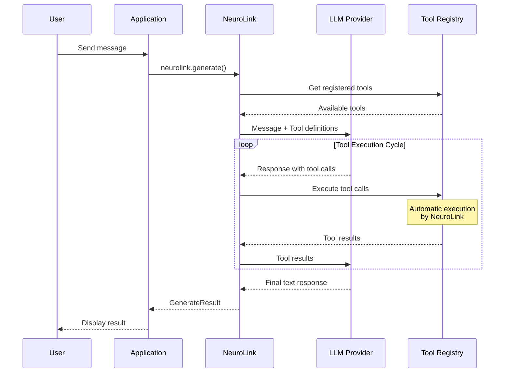

By the end of this guide, you'll have AI function calling working with NeuroLink -- from basic tool definitions to multi-step agentic workflows that query databases, call APIs, and take actions.

You will define tools once using Zod schemas or JSON Schema, register them with NeuroLink, and use them across any of the 13 supported providers. The same tool works with OpenAI, Anthropic, Google, and more -- no provider-specific rewrites.

## Understanding Function Calling in NeuroLink

Function calling in NeuroLink works through a cycle: the AI model receives a prompt along with available tool definitions, determines which tools to use, generates structured function calls, executes them, and processes the results.




## Registering Tools with NeuroLink

Tools in NeuroLink are registered using the `registerTool` method. Each tool requires a description, parameters schema, and an execute function. The SDK **prefers `parameters` with a Zod schema** for automatic validation and type safety.

### Basic Tool Registration (Recommended: Zod Schema)

```typescript
import { NeuroLink } from '@juspay/neurolink';
import { z } from 'zod';

const neurolink = new NeuroLink();

// Define parameter schema with Zod for type safety and validation
const weatherParams = z.object({
  location: z.string().describe('City name or coordinates (e.g., "San Francisco" or "37.7749,-122.4194")'),
  units: z.enum(['celsius', 'fahrenheit', 'kelvin']).optional().describe('Temperature units')
});

// Register a weather tool using Zod schema (preferred approach)
// Note: The tool name is passed as the first argument to registerTool(),
// so there's no need to include a 'name' field inside the tool object
neurolink.registerTool('get_weather', {
  description: 'Get current weather conditions for a specified location. Use this when the user asks about weather, temperature, or atmospheric conditions.',
  parameters: weatherParams,
  execute: async (params) => {
    // params is automatically typed based on your Zod schema
    const { location, units = 'celsius' } = params;

    // Call your weather API here
    const weatherData = await fetchWeatherFromAPI(location, units);

    return {
      location,
      temperature: weatherData.temp,
      units,
      conditions: weatherData.conditions,
      humidity: weatherData.humidity
    };
  }
});
```

> **How It Works Internally**: When you use `parameters` with a Zod schema, NeuroLink automatically converts it to the `inputSchema` format (JSON Schema) that LLM providers expect. This conversion happens transparently, giving you the best of both worlds: type-safe development with Zod and provider-compatible tool definitions.
{: .prompt-info }

### Alternative: MCPExecutableTool Format (inputSchema)

While Zod with `parameters` is the recommended approach, you can also use the full `MCPExecutableTool` format with raw JSON Schema via `inputSchema`. This is what the SDK actually uses internally and what gets sent to LLM providers:

```typescript
// MCPExecutableTool format with inputSchema (what the SDK uses internally)
// This matches the MCP (Model Context Protocol) tool specification
neurolink.registerTool('get_weather', {
  description: 'Get current weather conditions for a specified location.',
  inputSchema: {
    type: 'object',
    properties: {
      location: {
        type: 'string',
        description: 'City name or coordinates'
      },
      units: {
        type: 'string',
        enum: ['celsius', 'fahrenheit', 'kelvin'],
        description: 'Temperature units'
      }
    },
    required: ['location']
  },
  execute: async (params) => {
    // Note: With inputSchema, you need to cast params manually
    const { location, units = 'celsius' } = params as { location: string; units?: string };
    const weatherData = await fetchWeatherFromAPI(location, units);
    return { location, temperature: weatherData.temp, units };
  }
});
```

> **When to use which format?**
>
> - Use `parameters` with Zod for new projects - you get automatic validation, TypeScript inference, and cleaner code
> - Use `inputSchema` when integrating existing JSON Schema definitions, migrating from other SDKs, or when you need precise control over the schema sent to providers
{: .prompt-tip }

### Registering Multiple Tools

For registering multiple tools at once, use `registerTools`:

```typescript
const businessTools = {
  get_sales_data: {
    description: 'Retrieve sales data for a specific time period',
    inputSchema: {
      type: 'object',
      properties: {
        startDate: { type: 'string', description: 'Start date (ISO format)' },
        endDate: { type: 'string', description: 'End date (ISO format)' },
        region: { type: 'string', description: 'Sales region' }
      },
      required: ['startDate', 'endDate']
    },
    execute: async (params) => {
      const { startDate, endDate, region } = params as {
        startDate: string;
        endDate: string;
        region?: string;
      };
      return await salesDatabase.query({ startDate, endDate, region });
    }
  },

  get_inventory_status: {
    description: 'Check inventory levels for products',
    inputSchema: {
      type: 'object',
      properties: {
        productId: { type: 'string', description: 'Product SKU or ID' },
        warehouse: { type: 'string', description: 'Warehouse location' }
      },
      required: ['productId']
    },
    execute: async (params) => {
      const { productId, warehouse } = params as {
        productId: string;
        warehouse?: string;
      };
      return await inventoryService.getStatus(productId, warehouse);
    }
  }
};

// Register all tools at once
neurolink.registerTools(businessTools);
```

### Array Format for Tool Registration

NeuroLink also supports an array format for tool registration:

```typescript
neurolink.registerTools([
  { name: 'tool_one', tool: toolOneDefinition },
  { name: 'tool_two', tool: toolTwoDefinition }
]);
```


## Using Tools in Generation

Once tools are registered, they're automatically available during generation. NeuroLink handles the tool execution loop internally.

### Basic Generation with Tools

```typescript
const neurolink = new NeuroLink();

// Register your tools
neurolink.registerTool('get_company_metrics', {
  description: 'Get key business metrics for the company',
  inputSchema: {
    type: 'object',
    properties: {
      metric: {
        type: 'string',
        enum: ['revenue', 'users', 'growth'],
        description: 'Metric to retrieve'
      }
    },
    required: ['metric']
  },
  execute: async (params) => {
    const { metric } = params as { metric: string };
    // Return mock data for this example
    const metrics = {
      revenue: { value: 2847392.15, currency: 'USD', period: 'monthly' },
      users: { active: 98765, new: 1234, churned: 89 },
      growth: { rate: 15.3, trend: 'up', comparison: 'mom' }
    };
    return metrics[metric as keyof typeof metrics] || { error: 'Unknown metric' };
  }
});

// Generate with tools automatically available
const result = await neurolink.generate({
  input: { text: 'What is our current monthly revenue?' },
  provider: 'openai',
  model: 'gpt-4o',
});

console.log(result.content);
// Output: "Your current monthly revenue is $2,847,392.15 USD."

// Check which tools were used
if (result.toolsUsed) {
  console.log('Tools used:', result.toolsUsed);
}
```

### Disabling Tools for Specific Requests

Sometimes you want to disable tool use for a specific request:

```typescript
// Generate without tools (text-only response)
const result = await neurolink.generate({
  input: { text: 'What is our revenue?' },
  provider: 'openai',
  model: 'gpt-4o',
  disableTools: true  // Tools won't be available for this request
});
```

### Important: Google Gemini Limitation

When using structured output (schemas) with Google providers, you must disable tools:

```typescript
import { z } from 'zod';

const responseSchema = z.object({
  summary: z.string(),
  confidence: z.number()
});

// Google Gemini requires disableTools with schemas
const result = await neurolink.generate({
  input: { text: 'Summarize the data' },
  provider: 'vertex',
  model: 'gemini-2.0-flash',
  schema: responseSchema,
  disableTools: true  // Required for Google providers with schemas
});
```

## Tool Input Schema Best Practices

NeuroLink uses JSON Schema for tool parameters. Here are patterns for common use cases:

### Simple Parameters

```typescript
neurolink.registerTool('search_documents', {
  description: 'Search through document repository',
  inputSchema: {
    type: 'object',
    properties: {
      query: {
        type: 'string',
        description: 'Search query string'
      },
      limit: {
        type: 'number',
        description: 'Maximum results to return',
        default: 10
      }
    },
    required: ['query']
  },
  execute: async (params) => {
    const { query, limit = 10 } = params as { query: string; limit?: number };
    return await documentStore.search(query, limit);
  }
});
```

### Enumerated Values

```typescript
neurolink.registerTool('create_report', {
  description: 'Generate a business report',
  inputSchema: {
    type: 'object',
    properties: {
      reportType: {
        type: 'string',
        enum: ['sales', 'inventory', 'customers', 'financial'],
        description: 'Type of report to generate'
      },
      format: {
        type: 'string',
        enum: ['pdf', 'csv', 'json'],
        description: 'Output format'
      },
      dateRange: {
        type: 'object',
        properties: {
          start: { type: 'string', description: 'Start date (ISO format)' },
          end: { type: 'string', description: 'End date (ISO format)' }
        },
        required: ['start', 'end']
      }
    },
    required: ['reportType', 'format']
  },
  execute: async (params) => {
    const { reportType, format, dateRange } = params as {
      reportType: string;
      format: string;
      dateRange?: { start: string; end: string };
    };
    return await reportGenerator.create(reportType, format, dateRange);
  }
});
```

### Array Parameters

```typescript
neurolink.registerTool('batch_process', {
  description: 'Process multiple items in batch',
  inputSchema: {
    type: 'object',
    properties: {
      items: {
        type: 'array',
        items: {
          type: 'object',
          properties: {
            id: { type: 'string' },
            action: { type: 'string', enum: ['update', 'delete', 'archive'] }
          },
          required: ['id', 'action']
        },
        description: 'Items to process'
      },
      dryRun: {
        type: 'boolean',
        description: 'Preview changes without applying them'
      }
    },
    required: ['items']
  },
  execute: async (params) => {
    const { items, dryRun = false } = params as {
      items: Array<{ id: string; action: string }>;
      dryRun?: boolean;
    };

    if (dryRun) {
      return { preview: items, wouldProcess: items.length };
    }
    return await batchProcessor.execute(items);
  }
});
```

## Provider Support for Function Calling

NeuroLink provides unified function calling across all major providers:

| Provider | Function Calling | Notes |
|----------|-----------------|-------|
| OpenAI | Yes | Full parallel tool support |
| Anthropic | Yes | Claude models with tool use |
| Google AI Studio | Yes | Gemini models |
| Google Vertex | Yes | Gemini models |
| AWS Bedrock | Yes | Claude, Titan, and other models |
| Azure OpenAI | Yes | Same as OpenAI |
| Mistral | Yes | Mistral Large and newer |
| Ollama | Partial | Depends on model |

```typescript
// Same tool works across providers
neurolink.registerTool('calculate', {
  description: 'Perform mathematical calculations',
  inputSchema: {
    type: 'object',
    properties: {
      expression: { type: 'string', description: 'Math expression to evaluate' }
    },
    required: ['expression']
  },
  execute: async (params) => {
    const { expression } = params as { expression: string };
    // Safe evaluation logic here
    return { result: evaluate(expression) };
  }
});

// Use with any provider
const openaiResult = await neurolink.generate({
  input: { text: 'What is 15% of 847?' },
  provider: 'openai',
  model: 'gpt-4o',
});

const anthropicResult = await neurolink.generate({
  input: { text: 'Calculate 15% of 847' },
  provider: 'anthropic',
  model: 'claude-sonnet-4-5-20250929',
});
```

## Streaming with Tools

NeuroLink supports streaming responses that include tool execution:

```typescript
// Start streaming generation with tools
const result = await neurolink.stream({
  input: { text: 'Get our sales data and summarize trends' },
  provider: 'openai',
  model: 'gpt-4o',
});

// Process the stream using the async iterator on result.stream
for await (const chunk of result.stream) {
  if ('content' in chunk) {
    process.stdout.write(chunk.content);
  }
}

// After streaming completes, you can access tool usage information
console.log('Tools used:', result.toolsUsed);
console.log('Tool executions:', result.toolExecutions);
```

> **Note**: When using `stream()`, tool execution events are available via `result.toolEvents` (an AsyncIterable for real-time monitoring). The `toolEvents` property is exclusive to `StreamResult` and is not available when using `generate()`. Both streaming and non-streaming results provide `result.toolExecutions` (summary after completion). You can also implement custom logging within your tool's `execute` function for detailed tracking.

## Building Agentic Workflows

For complex tasks, you can build multi-step agentic workflows by combining tools:

### Research Agent Example

```typescript
const neurolink = new NeuroLink();

// Register research tools
neurolink.registerTool('web_search', {
  description: 'Search the web for information',
  inputSchema: {
    type: 'object',
    properties: {
      query: { type: 'string', description: 'Search query' },
      maxResults: { type: 'number', description: 'Max results', default: 5 }
    },
    required: ['query']
  },
  execute: async (params) => {
    const { query, maxResults = 5 } = params as { query: string; maxResults?: number };
    return await searchEngine.search(query, maxResults);
  }
});

neurolink.registerTool('read_webpage', {
  description: 'Read and extract content from a webpage',
  inputSchema: {
    type: 'object',
    properties: {
      url: { type: 'string', description: 'URL to read' }
    },
    required: ['url']
  },
  execute: async (params) => {
    const { url } = params as { url: string };
    return await webReader.extract(url);
  }
});

neurolink.registerTool('save_notes', {
  description: 'Save research notes for later reference',
  inputSchema: {
    type: 'object',
    properties: {
      title: { type: 'string', description: 'Note title' },
      content: { type: 'string', description: 'Note content' },
      tags: { type: 'array', items: { type: 'string' }, description: 'Tags' }
    },
    required: ['title', 'content']
  },
  execute: async (params) => {
    const { title, content, tags = [] } = params as {
      title: string;
      content: string;
      tags?: string[];
    };
    return await notesDB.save({ title, content, tags });
  }
});

// Run the research agent
const result = await neurolink.generate({
  input: {
    text: 'Research the latest developments in quantum computing and save your findings'
  },
  provider: 'anthropic',
  model: 'claude-sonnet-4-5-20250929',
  systemPrompt: `You are a research assistant. When given a research topic:
1. Search for relevant information
2. Read the most relevant sources
3. Save comprehensive notes with your findings
Be thorough and cite your sources.`
});

console.log(result.content);
console.log('Tools used:', result.toolsUsed);
```

## Error Handling in Tools

Proper error handling in tool execution is crucial for robust applications:

```typescript
neurolink.registerTool('database_query', {
  description: 'Execute a database query',
  inputSchema: {
    type: 'object',
    properties: {
      query: { type: 'string', description: 'SQL query to execute' },
      database: { type: 'string', description: 'Target database' }
    },
    required: ['query', 'database']
  },
  execute: async (params) => {
    const { query, database } = params as { query: string; database: string };

    try {
      // Validate query for safety
      if (!isSelectQuery(query)) {
        return {
          error: 'Only SELECT queries are allowed',
          suggestion: 'Please use a SELECT statement to query data'
        };
      }

      const connection = await getConnection(database);
      const results = await connection.execute(query);

      return {
        success: true,
        rowCount: results.length,
        data: results
      };

    } catch (error) {
      // Return structured error for AI to interpret
      return {
        error: error instanceof Error ? error.message : 'Unknown error',
        errorType: 'database_error',
        suggestion: 'Check the query syntax and database name'
      };
    }
  }
});
```

## Tool Validation and Discovery

NeuroLink provides utilities for tool validation and discovery:

```typescript
import { NeuroLink, validateTool } from '@juspay/neurolink';

const neurolink = new NeuroLink();

// Validate a tool before registration
const myTool = {
  description: 'A custom tool for processing data',
  inputSchema: {
    type: 'object',
    properties: {
      data: { type: 'string' }
    },
    required: ['data']
  },
  execute: async (params) => {
    const { data } = params as { data: string };
    return { processed: data.toUpperCase() };
  }
};

// Validate tool definition
try {
  validateTool('my_tool', myTool);
  console.log('Tool validation passed');
  neurolink.registerTool('my_tool', myTool);
} catch (error) {
  console.error('Tool validation failed:', error);
}
```

## Best Practices Summary

1. **Write Clear Descriptions**: Tool descriptions are critical for the model to understand when and how to use each tool. Be specific about use cases and limitations.

2. **Use JSON Schema Properly**: Define complete input schemas with types, descriptions, and required fields. This helps the model generate valid function calls.

3. **Return Structured Data**: Return well-structured results that the model can easily interpret and use in its response.

4. **Handle Errors Gracefully**: Return informative error objects rather than throwing exceptions. Include suggestions for recovery.

5. **Validate Inputs**: Always validate and sanitize inputs in your execute function before performing operations.

6. **Consider Security**: For destructive operations, implement confirmation flows or approval mechanisms.

7. **Log Tool Execution**: Use NeuroLink's events to monitor tool execution for debugging and analytics.

8. **Test Across Providers**: Verify your tools work correctly with different AI providers you plan to support.

## Common Patterns

### Database Query Tool

```typescript
neurolink.registerTool('query_data', {
  description: 'Query business data by category',
  inputSchema: {
    type: 'object',
    properties: {
      category: {
        type: 'string',
        enum: ['sales', 'customers', 'products', 'orders'],
        description: 'Data category to query'
      },
      filters: {
        type: 'object',
        description: 'Optional filters'
      },
      limit: {
        type: 'number',
        description: 'Maximum records to return'
      }
    },
    required: ['category']
  },
  execute: async (params) => {
    const { category, filters = {}, limit = 100 } = params as {
      category: string;
      filters?: Record<string, unknown>;
      limit?: number;
    };
    return await dataService.query(category, filters, limit);
  }
});
```

### API Integration Tool

```typescript
neurolink.registerTool('call_api', {
  description: 'Make authenticated API calls to external services',
  inputSchema: {
    type: 'object',
    properties: {
      service: {
        type: 'string',
        enum: ['crm', 'erp', 'analytics'],
        description: 'Target service'
      },
      endpoint: {
        type: 'string',
        description: 'API endpoint path'
      },
      method: {
        type: 'string',
        enum: ['GET', 'POST'],
        description: 'HTTP method'
      },
      payload: {
        type: 'object',
        description: 'Request payload for POST'
      }
    },
    required: ['service', 'endpoint']
  },
  execute: async (params) => {
    const { service, endpoint, method = 'GET', payload } = params as {
      service: string;
      endpoint: string;
      method?: string;
      payload?: Record<string, unknown>;
    };

    const client = getServiceClient(service);

    if (method === 'POST') {
      return await client.post(endpoint, payload);
    }
    return await client.get(endpoint);
  }
});
```

## Conclusion

You now have a complete function calling toolkit. Here is what you built:

1. Tool registration with Zod schemas and JSON Schema
2. Automatic tool execution during generation
3. Multi-tool agentic workflows with research, database, and API tools
4. Error handling that returns structured data instead of crashing
5. Tool validation and discovery

Your next step: pick one external system your AI application needs to interact with (a database, an API, a file system), define a tool for it using the patterns above, and register it with NeuroLink. Start simple, test across providers, and add complexity as you go.

---

*Ready to implement function calling? Check out our MCP Integration Guide for additional tool capabilities and Testing AI Applications for testing your tool implementations.*

---

**Related posts:**

- [Why TypeScript is the Future of AI Development](/posts/typescript-future-of-ai-development/)
- [How to Switch AI Providers Without Rewriting Code](/posts/switch-ai-providers-without-rewriting/)
- [NeuroLink Quickstart: 10 Things You Can Build Today](/posts/neurolink-quickstart-10-things/)
