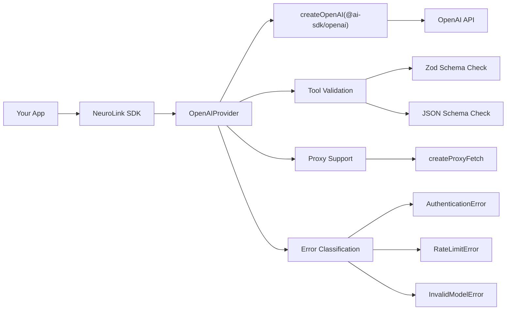

By the end of this guide, you'll have OpenAI's full model lineup -- GPT-4o, o1, o3, and beyond -- working through NeuroLink with streaming, tool calling, embeddings, and production-ready error handling.

You will set up the OpenAI provider, use every major feature through NeuroLink's unified TypeScript API, and understand the architecture that makes provider switching seamless. The same code patterns work with all 13 NeuroLink providers, so everything you learn here transfers directly.

---

## Supported Models

NeuroLink supports the complete OpenAI model lineup through its `OpenAIModels` enum. Here is the full reference:

| Model Family | Model IDs | Best For |
|---|---|---|
| **GPT-5.2** | `gpt-5.2`, `gpt-5.2-pro` | Latest flagship, highest capability |
| **GPT-5** | `gpt-5`, `gpt-5-mini`, `gpt-5-nano` | General purpose, cost tiers |
| **GPT-4.1** | `gpt-4.1`, `gpt-4.1-mini`, `gpt-4.1-nano` | Balanced performance |
| **GPT-4o** | `gpt-4o`, `gpt-4o-mini` | Multimodal, strong default |
| **O-Series** | `o3`, `o3-mini`, `o3-pro`, `o4-mini`, `o1`, `o1-mini` | Reasoning tasks |
| **Legacy** | `gpt-4-turbo`, `gpt-3.5-turbo` | Backward compatibility |

The default model is `gpt-4o`, configured via `getProviderModel("OPENAI_MODEL", "gpt-4o")`. You can override it per-request or globally via the `OPENAI_MODEL` environment variable.

The default embedding model is `text-embedding-3-small`, overridable via the `OPENAI_EMBEDDING_MODEL` environment variable.

> **Tip:** For cost-sensitive applications, `gpt-4o-mini` and `gpt-5-nano` offer strong performance at a fraction of the cost. For tasks requiring deep reasoning, the o-series models (`o3`, `o3-pro`) are purpose-built.
{: .prompt-tip }
> **Note:** Model names and IDs in code examples reflect versions available at time of writing. Model availability, naming conventions, and pricing change frequently. Always verify current model IDs with your provider's documentation before deploying to production.
{: .prompt-info }

---

## Quick Setup

Getting started with OpenAI through NeuroLink takes two steps: set your API key and start generating.

### Environment Configuration

```bash
OPENAI_API_KEY=sk-your-key-here
OPENAI_MODEL=gpt-4o          # optional, defaults to gpt-4o
```

The API key is validated on provider initialization via `validateApiKey(createOpenAIConfig())`. If the key is missing or malformed, you get a clear error immediately rather than a cryptic API failure.

### Basic Generation

```typescript
import { NeuroLink } from '@juspay/neurolink';

const neurolink = new NeuroLink();

const result = await neurolink.generate({
  input: { text: 'Explain quantum computing' },
  provider: 'openai',
  model: 'gpt-4o'
});

console.log(result.content);
console.log(`Tokens: ${result.usage?.total}`);
```

### Basic Streaming

```typescript
import { NeuroLink } from '@juspay/neurolink';

const neurolink = new NeuroLink();
const result = await neurolink.stream({
  input: { text: 'Explain quantum computing' },
  provider: 'openai',
});

for await (const chunk of result.stream) {
  if ('content' in chunk) process.stdout.write(chunk.content);
}
```

That is all you need for basic usage. The following sections cover each feature in depth.

---

## Streaming in Depth

NeuroLink's OpenAI provider uses `streamText()` from the Vercel AI SDK internally, exposing it through the unified `stream()` interface.

### Stream Configuration

The streaming implementation supports full configuration:

```typescript
const result = await neurolink.stream({
  input: { text: 'Write a haiku about TypeScript' },
  provider: 'openai',
  model: 'gpt-4o-mini',
  temperature: 0.7,
  maxTokens: 500,
  timeout: 30000,
});
```

### How Streaming Works Internally

The `executeStream()` method in the OpenAI provider processes the full stream (not just the text stream) to support tool call detection alongside text delivery. The stream emits several chunk types:

- **`text-delta`** -- Partial text content as it is generated
- **`tool-call-streaming-start`** -- Indicates a tool call is beginning
- **`error`** -- Stream-level errors

Timeout control is handled via `createTimeoutController` with configurable timeout values, and analytics are collected automatically through the `streamAnalyticsCollector` for observability integration.

> **Note:** NeuroLink streams use `result.stream`, not `result.textStream`. The full stream is preferred because it supports both text content and tool call events in a single stream.
{: .prompt-info }

---

## Tool Calling

OpenAI's tool calling support is one of its strongest features, and NeuroLink exposes it fully.

### Configuration

- **Tool support:** Always enabled (`supportsTools()` returns `true`)
- **Maximum tools:** 128 per request (configurable via `OPENAI_MAX_TOOLS` environment variable)
- **Multi-step execution:** Controlled by `maxSteps` parameter

### Tool Validation Pipeline

NeuroLink validates every tool before sending it to OpenAI through `validateAndFilterToolsForOpenAI()`:

1. Checks for a `description` string (required by OpenAI)
2. Verifies the `execute` function exists
3. Supports both Zod schemas and JSON schemas for parameters
4. Filters out invalid tools with warning logs instead of failing the entire request

### Example: Weather Tool

```typescript
import { z } from 'zod';
import { tool } from 'ai';
import { NeuroLink } from '@juspay/neurolink';

const weatherTool = tool({
  description: 'Get current weather for a city',
  parameters: z.object({
    city: z.string().describe('City name'),
  }),
  execute: async ({ city }) => {
    return { temp: 22, condition: 'sunny', city };
  },
});

const neurolink = new NeuroLink();
const result = await neurolink.stream({
  input: { text: "What's the weather in Tokyo?" },
  provider: 'openai',
  tools: { getWeather: weatherTool },
});

for await (const chunk of result.stream) {
  if ('content' in chunk) process.stdout.write(chunk.content);
}
```

The AI model will recognize the user's intent, call the `getWeather` tool with `{ city: "Tokyo" }`, receive the result, and incorporate it into a natural language response. Multi-step tool execution is supported: the model can call multiple tools in sequence, with each step informed by the previous tool's results.

### Tool Calling Best Practices

- **Write clear descriptions:** OpenAI uses the `description` field to decide when to call a tool. Be specific.
- **Use Zod `.describe()` on parameters:** The parameter descriptions are sent to the model and improve tool call accuracy.
- **Set `maxSteps` for complex workflows:** If your agent needs to call multiple tools in sequence, increase `maxSteps` from the default.
- **Handle partial failures gracefully:** If one tool fails, the model may retry or use an alternative approach.

> **Warning:** OpenAI has a hard limit of 128 tools per request. If you register more, NeuroLink will validate and filter them. Use the `OPENAI_MAX_TOOLS` environment variable to adjust this limit. Note that tool limits vary by provider -- check each provider's documentation for current limits.
{: .prompt-warning }

---

## Embeddings

NeuroLink's OpenAI provider includes embedding support for RAG pipelines, semantic search, and similarity matching.

```typescript
import { createAIProvider } from '@juspay/neurolink';

const provider = await createAIProvider('openai');
const embedding = await provider.embed(
  'NeuroLink is an AI orchestration SDK'
);
console.log(`Dimension: ${embedding.length}`); // 1536 for text-embedding-3-small
```

The default embedding model is `text-embedding-3-small`, which produces 1536-dimensional vectors. You can override it with the `OPENAI_EMBEDDING_MODEL` environment variable to use `text-embedding-3-large` (3072 dimensions) for higher accuracy at the cost of more storage and compute.

The embedding method creates a separate `createOpenAI` instance with proxy support, so it works correctly in corporate network environments.

---

## Error Handling

NeuroLink classifies OpenAI API errors into typed exceptions, making error handling precise and actionable:

| Error Type | Triggers | Recommended Action |
|---|---|---|
| `AuthenticationError` | Invalid API key, `API_KEY_INVALID` | Check `OPENAI_API_KEY` |
| `RateLimitError` | Rate limit exceeded | Implement exponential backoff |
| `InvalidModelError` | Model not found, `model_not_found` | Verify model ID |
| `NetworkError` | Timeout, connection failure | Retry with increased timeout |
| `ProviderError` | Any other API error | Log and investigate |

```typescript
import {
  AuthenticationError,
  RateLimitError,
  InvalidModelError,
} from '@juspay/neurolink';

const neurolink = new NeuroLink();

try {
  await neurolink.stream({ input: { text: 'hello' }, provider: 'openai' });
} catch (error) {
  if (error instanceof RateLimitError) {
    // Implement exponential backoff
    console.log('Rate limited. Retrying after delay...');
  } else if (error instanceof AuthenticationError) {
    // Check OPENAI_API_KEY
    console.error('Invalid API key. Verify OPENAI_API_KEY.');
  } else if (error instanceof InvalidModelError) {
    // Check model identifier
    console.error('Model not found. Check the model ID.');
  }
}
```

The `handleProviderError()` method in the OpenAI provider examines error messages, status codes, and error types to classify each failure accurately. This classification happens before the error reaches your application code, so you always get a specific, actionable error type rather than a generic exception.

---

## Architecture

Here is how NeuroLink's OpenAI integration is structured:



**Key components:**

- **OpenAIProvider** extends `BaseProvider` and implements the provider interface with OpenAI-specific logic
- **`@ai-sdk/openai`** is the underlying Vercel AI SDK OpenAI adapter, used for both streaming and generation
- **Tool validation** ensures all tools meet OpenAI's requirements before any API call
- **Proxy support** via `createProxyFetch()` allows NeuroLink to work behind corporate proxies
- **Error classification** maps raw API errors to typed NeuroLink exceptions

---

## Proxy and Network Configuration

For enterprise environments behind corporate proxies, NeuroLink injects `createProxyFetch()` into the OpenAI client:

```typescript
const openaiClient = createOpenAI({
  apiKey: config.apiKey,
  fetch: createProxyFetch(),
});
```

This transparently routes all OpenAI API calls through your configured proxy. The timeout is configurable per-request via the `timeout` option in `generate()` and `stream()`.

---

## Comparison with Direct OpenAI SDK

If you are considering whether to use NeuroLink or the direct `openai` package, here is the comparison:

| Feature | Direct `openai` Package | NeuroLink OpenAI Provider |
|---|---|---|
| **API interface** | OpenAI-specific | Unified (works with 13 providers) |
| **Tool handling** | Manual tool loop | Automatic multi-step execution |
| **Error types** | Generic errors | Classified (`AuthenticationError`, etc.) |
| **Streaming** | Raw SSE parsing | Normalized async iterator |
| **Provider switching** | Full rewrite | Change one string |
| **Analytics** | Build yourself | Built-in stream analytics |
| **Proxy support** | Manual configuration | `createProxyFetch()` injection |
| **Fallback** | Not available | `createAIProviderWithFallback()` |
| **Observability** | Build yourself | OpenTelemetry + Langfuse |

The direct SDK is the right choice if you need maximum low-level control over OpenAI-specific features. NeuroLink is the right choice for everything else -- especially if you anticipate using multiple providers or need production features like fallback, observability, and tool validation.

---

## What's Next

You now have OpenAI fully integrated with NeuroLink. Here is what you covered: setup, streaming, tool calling, embeddings, error handling, and network configuration. All of these patterns transfer directly to any other NeuroLink provider.

Your next step: pick one feature from this guide and ship it. Then explore another provider:

- **Try another provider:** Google AI Studio & Gemini Integration Guide for Google's free-tier models
- **Build with tools:** [NeuroLink Quickstart: 10 Things You Can Build Today](/posts/neurolink-quickstart-10-things/) for tool-augmented examples
- **Add resilience:** [How to Switch AI Providers Without Rewriting Code](/posts/switch-ai-providers-without-rewriting/) for multi-provider failover
- **Compare providers:** Check the Provider Comparison Matrix for a side-by-side evaluation of all 13 providers

---

**Related posts:**

- [Function Calling: AI Tool Use Patterns with NeuroLink](/posts/function-calling-patterns/)
- [How to Switch AI Providers Without Rewriting Code](/posts/switch-ai-providers-without-rewriting/)
- [What is NeuroLink? The Unified AI SDK Explained](/posts/what-is-neurolink-unified-sdk/)
