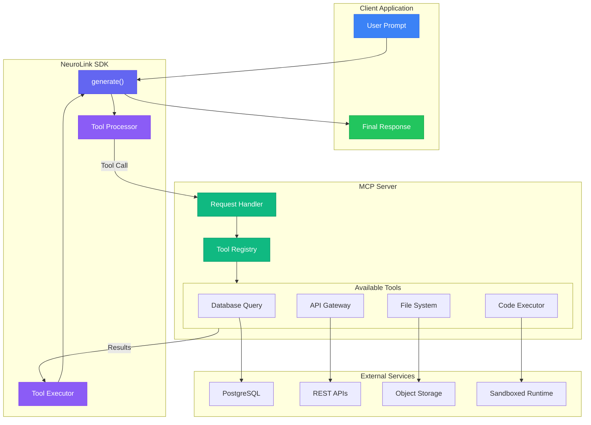
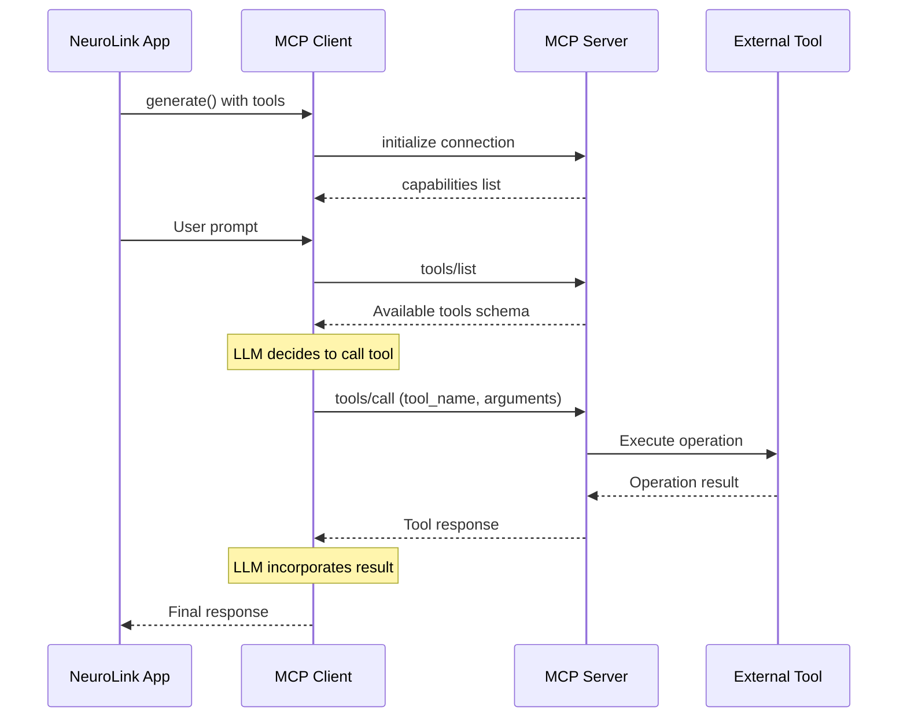

By the end of this guide, you'll have MCP tools connected to NeuroLink, giving your AI the ability to query databases, call APIs, read files, and interact with external services -- all through a standardized protocol.

You will understand the MCP architecture, register custom tools, handle security, and build production-ready integrations. NeuroLink discovers and executes MCP tools automatically during generation, so your AI goes from passive text generator to active agent with minimal setup.



---

## Understanding the Model Context Protocol

MCP provides a standardized interface between AI applications and external tools. Instead of building custom integrations for each capability, you define tools using a common schema that any MCP-compatible client can use.

### The Protocol Architecture

MCP follows a client-server model. Your NeuroLink application acts as the MCP client. Tool servers expose capabilities through a JSON-RPC interface. The protocol handles discovery, invocation, and result handling.



### Core Protocol Messages

MCP defines several message types for tool interaction:

1. **initialize** - Establishes connection and negotiates capabilities
2. **tools/list** - Retrieves available tools and their schemas
3. **tools/call** - Invokes a specific tool with arguments
4. **notifications** - Asynchronous updates from server to client

Each message follows JSON-RPC 2.0 format with typed parameters and responses.

### Tool Schema Definition

Tools are defined using JSON Schema. Each tool has a name, description, and input schema that describes expected parameters:

```typescript
interface Tool {
  name: string;
  description: string;
  inputSchema: {
    type: "object";
    properties: Record<string, JSONSchema>;
    required?: string[];
  };
}
```

The LLM reads these schemas to understand what tools are available and how to call them correctly.

---


## Setting Up MCP with NeuroLink

NeuroLink provides first-class MCP support through its tool integration system. You can connect to existing MCP servers or define inline tools directly in your code.

### Connecting to MCP Servers

Configure MCP server connections in your NeuroLink client:

```typescript
import { NeuroLink } from '@juspay/neurolink';

// Initialize NeuroLink
const neurolink = new NeuroLink();

// Register custom tools programmatically
neurolink.registerTool('database_query', {
  description: 'Execute a read-only SQL query against the database',
  inputSchema: {
    type: 'object',
    properties: {
      sql: { type: 'string', description: 'SQL query to execute' }
    },
    required: ['sql']
  },
  execute: async (params) => {
    const { sql } = params as { sql: string };
    // Connect to your database and execute query
    const pool = await getDbPool();
    return pool.query(sql);
  }
});

// Or configure external MCP servers via .mcp-config.json
// See the configuration section below for mcpServers format

// Generate with tools - tools are automatically discovered
const response = await neurolink.generate({
  input: { text: 'Find all users who signed up last week and export to CSV' },
  provider: 'anthropic',
  tools: ['database_query'] // Specify tools to use
});

console.log(response.content);
```

> **Note:** NeuroLink accepts both Zod schemas (via `parameters`) and JSON Schema (via `inputSchema`) for tool definitions. Use whichever format fits your project.
{: .prompt-info }

External MCP servers can be configured in `.mcp-config.json`:

```json
{
  "mcpServers": {
    "database": {
      "command": "npx",
      "args": ["-y", "@modelcontextprotocol/server-postgres"],
      "env": {
        "DATABASE_URL": "${DATABASE_URL}"
      }
    },
    "filesystem": {
      "command": "npx",
      "args": ["-y", "@modelcontextprotocol/server-filesystem", "/data"]
    }
  }
}
```

### Transport Options

MCP supports multiple transport mechanisms:

| Transport | Use Case | Configuration |
|-----------|----------|---------------|
| **stdio** | Local processes | Command + args to spawn |
| **SSE** | Remote servers | HTTP endpoint URL |
| **WebSocket** | Bidirectional streaming | WebSocket URL |

> **Note:** stdio and Streamable HTTP are the standard MCP transports defined in the specification. WebSocket support is provided via the official SDK's transport module but is not yet part of the MCP specification.
{: .prompt-info }

Choose stdio for local tool servers like database connectors. Use SSE or WebSocket for remote services and shared infrastructure.

### Tool Discovery

NeuroLink automatically discovers tools from registered MCP servers. Tools are available immediately after registration via `registerTool()` or configuration in `.mcp-config.json`.

> **Understanding MCP Auto-Discovery:** NeuroLink automatically discovers tool capabilities from MCP servers once connected. However, your application is responsible for tracking which servers are registered and managing server lifecycle. The server registry pattern shown above is recommended for production.

**Current Approach (v8.32.0):**

```typescript
import { NeuroLink } from '@juspay/neurolink';

const neurolink = new NeuroLink();

// Register tools and track them manually
const registeredTools = new Map<string, any>();

neurolink.registerTool('database_query', {
  description: 'Execute a read-only SQL query',
  inputSchema: {
    type: 'object',
    properties: { sql: { type: 'string' } },
    required: ['sql']
  },
  execute: async (params) => {
    const { sql } = params as { sql: string };
    const pool = await getDbPool();
    return pool.query(sql);
  }
});

registeredTools.set('database_query', { type: 'custom', status: 'active' });

console.log('Registered tools:', Array.from(registeredTools.keys()));
// Output: ['database_query']
```

---

## Defining Custom Tools

While pre-built MCP servers cover common use cases, you often need custom tools for your specific domain. NeuroLink supports defining tools inline or building full MCP servers.

### Inline Tool Definitions

Define tools directly using `registerTool()` or `registerTools()`:

```typescript
import { NeuroLink } from '@juspay/neurolink';

const neurolink = new NeuroLink();

// Register a custom weather tool
neurolink.registerTool('get_weather', {
  description: 'Get current weather for a location',
  inputSchema: {
    type: 'object',
    properties: {
      location: {
        type: 'string',
        description: 'City name or coordinates'
      },
      units: {
        type: 'string',
        enum: ['celsius', 'fahrenheit'],
        default: 'celsius'
      }
    },
    required: ['location']
  },
  execute: async (params) => {
    const { location, units = 'celsius' } = params as { location: string; units?: string };
    // Call your weather API
    const response = await fetch(
      `https://api.weather.com/v1/current?q=${encodeURIComponent(location)}&units=${units}`
    );
    return response.json();
  }
});

// Register a calculation tool
neurolink.registerTool('calculate', {
  description: 'Perform mathematical calculations',
  inputSchema: {
    type: 'object',
    properties: {
      expression: {
        type: 'string',
        description: 'Mathematical expression to evaluate'
      }
    },
    required: ['expression']
  },
  execute: async (params) => {
    const { expression } = params as { expression: string };
    // Use a safe math parser (never use eval!)
    const mathjs = await import('mathjs');
    return { result: mathjs.evaluate(expression) };
  }
});

// Use tools in generation
const response = await neurolink.generate({
  input: { text: 'What is the temperature in Tokyo in Fahrenheit, and what is 32F in Celsius?' },
  provider: 'anthropic',
  tools: ['get_weather', 'calculate']
});

console.log(response.content);
// "The current temperature in Tokyo is 72°F. Converting 32°F to Celsius: 32°F = 0°C."
```

You can also register multiple tools at once using `registerTools()`:

```typescript
// Object format
neurolink.registerTools({
  get_weather: weatherToolDefinition,
  calculate: calculatorToolDefinition
});

// Array format (alternative)
neurolink.registerTools([
  { name: 'get_weather', tool: weatherToolDefinition },
  { name: 'calculate', tool: calculatorToolDefinition }
]);
```

### Building an MCP Server

For reusable tools across multiple applications, build a proper MCP server using the official `@modelcontextprotocol/sdk`:

```typescript
// tools-server.ts
import { Server } from '@modelcontextprotocol/sdk/server/index.js';
import { StdioServerTransport } from '@modelcontextprotocol/sdk/server/stdio.js';
import { ListToolsRequestSchema, CallToolRequestSchema } from '@modelcontextprotocol/sdk/types.js';

const server = new Server(
  {
    name: 'custom-tools',
    version: '1.0.0'
  },
  {
    capabilities: {
      tools: {}
    }
  }
);

// Handle tool listing
server.setRequestHandler(ListToolsRequestSchema, async () => {
  return {
    tools: [
      {
        name: 'lookup_customer',
        description: 'Find customer by email, phone, or ID',
        inputSchema: {
          type: 'object',
          properties: {
            email: { type: 'string', format: 'email' },
            phone: { type: 'string' },
            customerId: { type: 'string' }
          }
        }
      },
      {
        name: 'get_order_status',
        description: 'Get current status of an order',
        inputSchema: {
          type: 'object',
          properties: {
            orderId: { type: 'string', description: 'Order ID to look up' }
          },
          required: ['orderId']
        }
      },
      {
        name: 'create_support_ticket',
        description: 'Create a new support ticket for the customer',
        inputSchema: {
          type: 'object',
          properties: {
            customerId: { type: 'string' },
            subject: { type: 'string' },
            description: { type: 'string' },
            priority: { type: 'string', enum: ['low', 'medium', 'high', 'urgent'] }
          },
          required: ['customerId', 'subject', 'description']
        }
      }
    ]
  };
});

// Handle tool execution
server.setRequestHandler(CallToolRequestSchema, async (request) => {
  const { name, arguments: args } = request.params;

  switch (name) {
    case 'lookup_customer': {
      const db = await getDatabase();
      if (args.email) return { content: [{ type: 'text', text: JSON.stringify(await db.customers.findByEmail(args.email)) }] };
      if (args.phone) return { content: [{ type: 'text', text: JSON.stringify(await db.customers.findByPhone(args.phone)) }] };
      if (args.customerId) return { content: [{ type: 'text', text: JSON.stringify(await db.customers.findById(args.customerId)) }] };
      throw new Error('Must provide email, phone, or customerId');
    }

    case 'get_order_status': {
      const order = await orderService.getStatus(args.orderId);
      return {
        content: [{
          type: 'text',
          text: JSON.stringify({
            orderId: order.id,
            status: order.status,
            estimatedDelivery: order.estimatedDelivery,
            trackingUrl: order.trackingUrl
          })
        }]
      };
    }

    case 'create_support_ticket': {
      const ticket = await ticketService.create({
        customerId: args.customerId,
        subject: args.subject,
        description: args.description,
        priority: args.priority || 'medium'
      });
      return {
        content: [{
          type: 'text',
          text: JSON.stringify({
            ticketId: ticket.id,
            status: 'created',
            url: `https://support.example.com/tickets/${ticket.id}`
          })
        }]
      };
    }

    default:
      throw new Error(`Unknown tool: ${name}`);
  }
});

// Start the server with stdio transport
const transport = new StdioServerTransport();
await server.connect(transport);
```

Run the server and configure it in NeuroLink:

```bash
npx ts-node tools-server.ts
```

Then add to your `.mcp-config.json`:

```json
{
  "mcpServers": {
    "custom-tools": {
      "command": "npx",
      "args": ["ts-node", "tools-server.ts"]
    }
  }
}
```

---

## Tool Execution Patterns

Different scenarios require different tool execution strategies. NeuroLink supports automatic, manual, and hybrid approaches.

### Automatic Tool Execution

The simplest approach lets NeuroLink handle everything:

```typescript
import { NeuroLink } from '@juspay/neurolink';

const neurolink = new NeuroLink();

const response = await neurolink.generate({
  input: { text: 'Check if order #12345 has shipped and create a ticket if it is delayed' },
  provider: 'anthropic',
  tools: ['get_order_status', 'create_support_ticket']
});

// NeuroLink automatically:
// 1. Calls get_order_status with orderId: "12345"
// 2. Analyzes the result
// 3. If delayed, calls create_support_ticket
// 4. Returns final response incorporating all tool results

console.log(response.content);
console.log('Tools used:', response.toolsUsed);
console.log('Tool executions:', response.toolExecutions);
```

### Manual Tool Execution

For direct tool execution, call the tool's `execute` function manually:

```typescript
import { NeuroLink } from '@juspay/neurolink';

const neurolink = new NeuroLink();

// Define tool with execute function
const lookupCustomerTool = {
  name: 'lookup_customer',
  description: 'Look up customer by email',
  inputSchema: {
    type: 'object',
    properties: { email: { type: 'string' } },
    required: ['email']
  },
  execute: async (params: any) => {
    const { email } = params;
    return await customerService.findByEmail(email);
  }
};

neurolink.registerTool('lookup_customer', lookupCustomerTool);

// Execute tool manually
const customerResult = await lookupCustomerTool.execute({
  email: 'john@example.com'
});

console.log('Customer found:', customerResult);

// Add audit logging before execution
await auditLog.record('customer_lookup', { email: 'john@example.com' });

// Execute with context using closures
const toolContext = {
  sessionId: 'session-123',
  userId: 'user-456',
  auditEnabled: true
};

const contextAwareTool = {
  ...lookupCustomerTool,
  execute: async (params: any) => {
    await auditLog.record('tool_execution', { ...params, ...toolContext });
    return lookupCustomerTool.execute(params);
  }
};
```

### Approval-Based Execution (HITL)

NeuroLink supports Human-in-the-Loop (HITL) for sensitive operations. Configure HITL when initializing:

```typescript
import { NeuroLink } from '@juspay/neurolink';

// Initialize with HITL configuration
const neurolink = new NeuroLink({
  hitl: {
    enabled: true,
    timeout: 30000, // 30 seconds to respond
    allowArgumentModification: false,
    auditLogging: true,
    // Keywords that trigger human approval (matches tool names containing these)
    dangerousActions: ['delete', 'remove', 'transfer', 'refund']
  }
});

// Listen for confirmation requests
// Note: HITL events are emitted via the HITLManager, accessed through getEventEmitter()
// The HITLManager handles the confirmation workflow internally
neurolink.getEventEmitter().on('hitl:confirmation-request', async (payload) => {
  console.log(`Approval needed for: ${payload.toolName}`);
  console.log(`Arguments: ${JSON.stringify(payload.arguments)}`);

  // Show to user and get confirmation
  const userApproved = await getUserConfirmation(payload);

  // Respond to the confirmation request via the same event emitter
  neurolink.getEventEmitter().emit('hitl:confirmation-response', {
    confirmationId: payload.confirmationId,
    approved: userApproved,
    reason: userApproved ? 'User approved' : 'User declined',
    modifiedArguments: userApproved ? payload.arguments : undefined
  });
});

// Now generate with tools - sensitive tools will trigger HITL
const response = await neurolink.generate({
  input: { text: 'Refund order #12345' },
  provider: 'anthropic',
  tools: ['process_refund', 'send_email']
});
```

---

## Multi-Tool Workflows

Complex tasks often require coordinating multiple tools. NeuroLink handles tool chaining, parallel execution, and error recovery.

### Sequential Tool Chains

The model naturally chains tools when the task requires it:

```typescript
import { NeuroLink } from '@juspay/neurolink';

const neurolink = new NeuroLink();

const response = await neurolink.generate({
  input: {
    text: `
      Find the customer who placed order #12345.
      Check their purchase history for the last 6 months.
      If they've spent over $1000, apply a 10% loyalty discount to their account.
      Send them an email about the discount.
    `
  },
  provider: 'anthropic',
  tools: [
    'get_order',
    'lookup_customer',
    'get_purchase_history',
    'apply_discount',
    'send_email'
  ]
});

// The model will:
// 1. get_order(orderId: "12345") -> get customerId
// 2. lookup_customer(customerId: "...") -> get customer details
// 3. get_purchase_history(customerId: "...", months: 6) -> calculate total
// 4. If total > 1000: apply_discount(customerId: "...", percent: 10)
// 5. send_email(to: customer.email, template: "loyalty_discount")

console.log(response.content);
console.log('Tool execution chain:', response.toolExecutions);
```

### Parallel Tool Execution

When tools are independent, the model can request multiple tool calls that NeuroLink executes in parallel:

```typescript
import { NeuroLink } from '@juspay/neurolink';

const neurolink = new NeuroLink();

const response = await neurolink.generate({
  input: { text: 'Get the weather in Tokyo, London, and New York' },
  provider: 'anthropic',
  tools: ['get_weather']
});

// The model requests three get_weather calls
// NeuroLink executes them in parallel:
// - get_weather(location: "Tokyo")
// - get_weather(location: "London")
// - get_weather(location: "New York")
// Results combined in final response

console.log(response.content);
```

### Error Handling and Retry

Handle tool execution errors gracefully by wrapping tool logic:

```typescript
import { NeuroLink } from '@juspay/neurolink';

const neurolink = new NeuroLink();

// Create error-handling wrapper for tools
function createErrorHandledTool(toolConfig: any) {
  const originalExecute = toolConfig.execute;

  return {
    ...toolConfig,
    execute: async (params: any) => {
      try {
        const result = await originalExecute(params);
        return { success: true, data: result };
      } catch (error) {
        console.error('Tool execution error:', error instanceof Error ? error.message : String(error));
        return {
          success: false,
          error: error instanceof Error ? error.message : 'Unknown error'
        };
      }
    }
  };
}

// Register error-handled tool
const crmTool = createErrorHandledTool({
  name: 'fetch_crm_data',
  description: 'Fetch customer data from CRM',
  inputSchema: {
    type: 'object',
    properties: { customerId: { type: 'string' } },
    required: ['customerId']
  },
  execute: async (params: any) => {
    const { customerId } = params;
    return await crmService.fetchCustomer(customerId);
  }
});

neurolink.registerTool('fetch_crm_data', crmTool);

// For generation with tools, check response metadata
const response = await neurolink.generate({
  input: { text: 'Sync customer data from the CRM' },
  provider: 'anthropic',
  tools: ['fetch_crm_data', 'update_database']
});

console.log('Response:', response.content);
// Tool execution errors are handled internally by the LLM
```

---

## Real-World Integration Examples

Let's build complete examples showing MCP tools in production scenarios.

### Customer Support Agent

A support bot that can look up customers, check orders, and create tickets:

```typescript
import { NeuroLink } from '@juspay/neurolink';

// Initialize NeuroLink - external MCP servers configured in .mcp-config.json
const neurolink = new NeuroLink();

// Register support tools
neurolink.registerTools({
  lookup_customer: {
    description: 'Look up customer by ID',
    inputSchema: {
      type: 'object',
      properties: { customerId: { type: 'string' } },
      required: ['customerId']
    },
    execute: async (params) => {
      const { customerId } = params as { customerId: string };
      return await customerService.findById(customerId);
    }
  },
  get_order_status: {
    description: 'Get order status and tracking info',
    inputSchema: {
      type: 'object',
      properties: { orderId: { type: 'string' } },
      required: ['orderId']
    },
    execute: async (params) => {
      const { orderId } = params as { orderId: string };
      return await orderService.getStatus(orderId);
    }
  },
  create_ticket: {
    description: 'Create a support ticket',
    inputSchema: {
      type: 'object',
      properties: {
        customerId: { type: 'string' },
        subject: { type: 'string' },
        description: { type: 'string' }
      },
      required: ['customerId', 'subject', 'description']
    },
    execute: async (params) => {
      return await ticketService.create(params);
    }
  }
});

async function handleCustomerMessage(customerId: string, message: string) {
  const response = await neurolink.generate({
    input: {
      text: `Customer ID: ${customerId}\n\nCustomer message: ${message}`
    },
    provider: 'anthropic',
    systemPrompt: `You are a helpful customer support agent for TechCorp.
                   You have access to tools to look up customer information,
                   check order status, and create support tickets.
                   Always verify the customer's identity before sharing sensitive info.
                   Be empathetic and solution-focused.`,
    tools: ['lookup_customer', 'get_order_status', 'create_ticket']
  });

  return response.content;
}

// Example usage
const reply = await handleCustomerMessage(
  'cust_12345',
  'Where is my order? I ordered a laptop 5 days ago and haven\'t received any updates.'
);

console.log(reply);
// "I found your order #ORD-98765 for a TechCorp Pro Laptop. It shipped yesterday
// via FedEx and is currently in transit. Expected delivery is Thursday, July 25.
// Here's your tracking link: https://fedex.com/track/123456789.
// Is there anything else I can help you with?"
```

### Data Analysis Assistant

An assistant that queries databases and generates insights:

```typescript
import { NeuroLink } from '@juspay/neurolink';

const neurolink = new NeuroLink();

// Register SQL query tool
neurolink.registerTool('query_database', {
  description: 'Execute a read-only SQL query against the analytics database',
  inputSchema: {
    type: 'object',
    properties: {
      sql: {
        type: 'string',
        description: 'SQL query to execute. Must be SELECT only.'
      }
    },
    required: ['sql']
  },
  execute: async (params) => {
    const { sql } = params as { sql: string };
    // Validate query is read-only
    if (!sql.trim().toLowerCase().startsWith('select')) {
      throw new Error('Only SELECT queries are allowed');
    }

    const pool = await getDbPool();
    const result = await pool.query(sql);
    return {
      columns: result.fields.map(f => f.name),
      rows: result.rows,
      rowCount: result.rowCount
    };
  }
});

// Register chart creation tool
neurolink.registerTool('create_chart', {
  description: 'Create a chart from data',
  inputSchema: {
    type: 'object',
    properties: {
      type: { type: 'string', enum: ['bar', 'line', 'pie', 'scatter'] },
      title: { type: 'string' },
      data: { type: 'array', items: { type: 'object' } },
      xAxis: { type: 'string' },
      yAxis: { type: 'string' }
    },
    required: ['type', 'data']
  },
  execute: async (params) => {
    const chartUrl = await chartService.create(params);
    return { chartUrl };
  }
});

async function analyzeData(question: string) {
  const response = await neurolink.generate({
    input: { text: question },
    provider: 'anthropic',
    systemPrompt: `You are a data analyst assistant. You can query the company's
                   analytics database and create visualizations.

                   Available tables:
                   - sales (id, date, amount, product_id, customer_id, region)
                   - products (id, name, category, price)
                   - customers (id, name, email, signup_date, tier)

                   Always explain your analysis in plain language.`,
    tools: ['query_database', 'create_chart']
  });

  return response;
}

// Example usage
const analysis = await analyzeData(
  'What were our top 5 products by revenue last quarter? Show me a chart.'
);

console.log(analysis.content);
// "Based on Q2 2025 sales data, here are your top 5 products by revenue:
//
// 1. Enterprise License - $2.4M (34% of revenue)
// 2. Professional Plan - $1.8M (26% of revenue)
// 3. API Access Package - $1.1M (16% of revenue)
// 4. Support Premium - $890K (13% of revenue)
// 5. Training Bundle - $760K (11% of revenue)
//
// I've created a bar chart showing the breakdown: [chart link]
//
// Notable insight: Enterprise licenses alone drove over a third of revenue,
// suggesting strong product-market fit in the enterprise segment."
```

### DevOps Automation

An assistant that manages infrastructure tasks. Configure external MCP servers in `.mcp-config.json`:

```json
{
  "mcpServers": {
    "kubernetes": {
      "command": "npx",
      "args": ["-y", "mcp-server-kubernetes"]
    },
    "github": {
      "command": "npx",
      "args": ["-y", "@modelcontextprotocol/server-github"],
      "env": {
        "GITHUB_TOKEN": "${GITHUB_TOKEN}"
      }
    }
  }
}
```

Then use in your application:

```typescript
import { NeuroLink } from '@juspay/neurolink';

// Initialize with HITL for sensitive operations
const neurolink = new NeuroLink({
  hitl: {
    enabled: true,
    // Keywords that trigger human approval (matches tool names containing these)
    dangerousActions: ['delete', 'scale', 'merge', 'deploy']
  }
});

async function handleDevOpsRequest(request: string) {
  const response = await neurolink.generate({
    input: { text: request },
    provider: 'anthropic',
    systemPrompt: `You are a DevOps assistant with access to Kubernetes and GitHub.
                   Always explain what actions you're taking and their impact.
                   For destructive operations, confirm the action before proceeding.
                   Follow the principle of least privilege.`,
    tools: ['get_pods', 'describe_pod', 'delete_pod', 'scale_deployment', 'get_pull_requests']
  });

  return response;
}

// Example usage
const result = await handleDevOpsRequest(
  'The api-server deployment in production is having memory issues. ' +
  'Can you check the current state and restart the problematic pods?'
);

console.log(result.content);
```

---

## Security Considerations

MCP tools can access sensitive data and perform powerful operations. Security must be a primary concern.

### Principle of Least Privilege

Only expose the minimum capabilities needed:

```typescript
import { NeuroLink } from '@juspay/neurolink';

const neurolink = new NeuroLink();

// Bad: Exposes full database access
neurolink.registerTool('query', {
  description: 'Execute SQL query',
  inputSchema: { type: 'object', properties: { sql: { type: 'string' } } },
  execute: async (params) => {
    const { sql } = params as { sql: string };
    return db.query(sql); // Can DROP tables!
  }
});

// Good: Restricted to specific read operations
neurolink.registerTool('get_customer', {
  description: 'Get customer by ID',
  inputSchema: {
    type: 'object',
    properties: {
      customerId: { type: 'string', pattern: '^cust_[a-z0-9]+$' }
    },
    required: ['customerId']
  },
  execute: async (params) => {
    const { customerId } = params as { customerId: string };
    // Parameterized query prevents injection
    return db.query(
      'SELECT id, name, email FROM customers WHERE id = $1',
      [customerId]
    );
  }
});
```

### Input Validation

Always validate tool inputs:

```typescript
import { z } from 'zod';
import { NeuroLink } from '@juspay/neurolink';

const neurolink = new NeuroLink();

const customerIdSchema = z.string()
  .regex(/^cust_[a-z0-9]{8,}$/)
  .transform(id => id.toLowerCase());

const emailSchema = z.string()
  .email()
  .max(254)
  .transform(email => email.toLowerCase());

neurolink.registerTool('lookup_customer', {
  description: 'Look up customer by ID or email',
  inputSchema: {
    type: 'object',
    properties: {
      customerId: { type: 'string' },
      email: { type: 'string', format: 'email' }
    }
  },
  execute: async (params) => {
    // Validate all inputs with Zod
    const validated = z.object({
      customerId: customerIdSchema.optional(),
      email: emailSchema.optional()
    }).parse(params);

    // At least one identifier required
    if (!validated.customerId && !validated.email) {
      throw new Error('Must provide customerId or email');
    }

    return db.findCustomer(validated);
  }
});
```

### Audit Logging

Log all tool invocations for security and debugging by wrapping tool execute functions:

```typescript
import { NeuroLink } from '@juspay/neurolink';

const neurolink = new NeuroLink();

// Store context separately
const toolContext = {
  userId: 'user-123',
  sessionId: 'session-456'
};

// Create audit wrapper for tools
function createAuditedTool(toolConfig: any, context: any) {
  const originalExecute = toolConfig.execute;

  return {
    ...toolConfig,
    execute: async (params: any) => {
      // Log start
      await auditLog.record({
        timestamp: new Date().toISOString(),
        tool: toolConfig.name,
        arguments: params,
        userId: context.userId,
        sessionId: context.sessionId,
        status: 'started'
      });

      try {
        const startTime = Date.now();
        const result = await originalExecute(params);
        const duration = Date.now() - startTime;

        // Log completion
        await auditLog.record({
          timestamp: new Date().toISOString(),
          tool: toolConfig.name,
          success: true,
          duration,
          sessionId: context.sessionId,
          status: 'completed'
        });

        return result;
      } catch (error) {
        // Log error
        await auditLog.record({
          timestamp: new Date().toISOString(),
          error: error instanceof Error ? error.message : String(error),
          sessionId: context.sessionId,
          status: 'error'
        });
        throw error;
      }
    }
  };
}

// Register with audit wrapper
const queryTool = createAuditedTool({
  name: 'query_database',
  description: 'Query database',
  inputSchema: { type: 'object', properties: { sql: { type: 'string' } } },
  execute: async (params: any) => {
    return await db.query(params.sql);
  }
}, toolContext);

neurolink.registerTool('query_database', queryTool);
```

### Rate Limiting

Prevent abuse with rate limits using context passed to tools:

```typescript
import { RateLimiter } from 'rate-limiter-flexible';
import { NeuroLink } from '@juspay/neurolink';

const neurolink = new NeuroLink();

const toolRateLimiter = new RateLimiter({
  points: 100, // 100 calls
  duration: 60, // per minute
});

// Create rate-limited tool with context
function createRateLimitedTool(toolConfig: any, getUserId: () => string) {
  const originalExecute = toolConfig.execute;

  return {
    ...toolConfig,
    execute: async (params: any) => {
      const userId = getUserId();
      try {
        await toolRateLimiter.consume(userId);
      } catch (error) {
        throw new Error('Rate limit exceeded. Try again later.');
      }

      return originalExecute(params);
    }
  };
}

// Usage with context
const context = { userId: 'user-123' };

const rateLimitedTool = createRateLimitedTool({
  name: 'expensive_operation',
  description: 'Perform an expensive operation',
  inputSchema: { type: 'object', properties: { data: { type: 'object' } } },
  execute: async (params: any) => performExpensiveOperation(params)
}, () => context.userId);

neurolink.registerTool('expensive_operation', rateLimitedTool);
```

### Sandboxing

For code execution tools, use proper sandboxing (e.g., with isolated-vm or Docker):

```typescript
import { NeuroLink } from '@juspay/neurolink';
import ivm from 'isolated-vm';

const neurolink = new NeuroLink();

neurolink.registerTool('execute_code', {
  description: 'Execute JavaScript code in a sandboxed environment',
  inputSchema: {
    type: 'object',
    properties: {
      code: { type: 'string' },
      timeout: { type: 'number', maximum: 30000 }
    },
    required: ['code']
  },
  execute: async (params) => {
    const { code, timeout = 5000 } = params as { code: string; timeout?: number };

    // Create isolated VM
    const isolate = new ivm.Isolate({ memoryLimit: 128 });
    const context = await isolate.createContext();

    try {
      const script = await isolate.compileScript(code);
      const result = await script.run(context, { timeout });
      return { output: result };
    } catch (error) {
      return { error: error instanceof Error ? error.message : String(error) };
    } finally {
      isolate.dispose();
    }
  }
});
```

---

## Performance Optimization

Tool calls add latency. Optimize for the best user experience.

### Connection Management

NeuroLink manages MCP server connections automatically. Configure external servers in `.mcp-config.json`:

```json
{
  "mcpServers": {
    "database": {
      "command": "npx",
      "args": ["-y", "@modelcontextprotocol/server-postgres"],
      "env": {
        "DATABASE_URL": "${DATABASE_URL}"
      },
      "timeout": 30000,
      "autoRestart": true
    }
  }
}
```

### Caching Tool Results

Implement caching in your tool execute functions:

```typescript
import { LRUCache } from 'lru-cache';
import { NeuroLink } from '@juspay/neurolink';

const neurolink = new NeuroLink();

const cache = new LRUCache<string, unknown>({
  max: 1000,
  ttl: 1000 * 60 * 5 // 5 minutes
});

neurolink.registerTool('lookup_product', {
  description: 'Look up product by ID',
  inputSchema: {
    type: 'object',
    properties: { productId: { type: 'string' } },
    required: ['productId']
  },
  execute: async (params) => {
    const { productId } = params as { productId: string };
    const cacheKey = `product:${productId}`;

    const cached = cache.get(cacheKey);
    if (cached) return cached;

    const result = await db.findProduct(productId);
    cache.set(cacheKey, result);
    return result;
  }
});
```

### Streaming with Tools

Use the `stream()` method for real-time responses while tools execute:

```typescript
import { NeuroLink } from '@juspay/neurolink';

const neurolink = new NeuroLink();

const streamResult = await neurolink.stream({
  input: { text: 'Analyze the sales data and provide recommendations' },
  provider: 'anthropic',
  tools: ['query_database', 'create_chart']
});

// Process streaming chunks from the async iterable
// StreamChunk types: { content: string } or { audioChunk: TTSChunk }
for await (const chunk of streamResult.stream) {
  if ('content' in chunk) {
    process.stdout.write(chunk.content);
  }
}

// Tool execution events are available via toolEvents
// Event types are 'tool:start' and 'tool:end'
for await (const event of streamResult.toolEvents) {
  if (event.type === 'tool:start') {
    console.log(`[Tool started: ${event.toolName}]`);
  } else if (event.type === 'tool:end') {
    console.log(`[Tool completed: ${event.toolName} in ${event.duration}ms]`);
  }
}

// Get token usage info
console.log('Token usage:', streamResult.usage);
```

---

## Testing MCP Integrations

Thorough testing ensures reliable tool behavior.

### Unit Testing Tools

Test individual tool implementations:

```typescript
import { describe, it, expect, vi } from 'vitest';

describe('lookup_customer tool', () => {
  it('finds customer by email', async () => {
    const mockDb = {
      findByEmail: vi.fn().mockResolvedValue({
        id: 'cust_123',
        name: 'John Doe',
        email: 'john@example.com'
      })
    };

    const tool = createLookupCustomerTool(mockDb);
    const result = await tool.execute({ email: 'john@example.com' });

    expect(result.id).toBe('cust_123');
    expect(mockDb.findByEmail).toHaveBeenCalledWith('john@example.com');
  });

  it('validates email format', async () => {
    const tool = createLookupCustomerTool({});

    await expect(
      tool.execute({ email: 'invalid-email' })
    ).rejects.toThrow('Invalid email');
  });

  it('requires at least one identifier', async () => {
    const tool = createLookupCustomerTool({});

    await expect(
      tool.execute({})
    ).rejects.toThrow('Must provide customerId or email');
  });
});
```

### Integration Testing

Test complete tool workflows:

```typescript
import { describe, it, expect, beforeAll, afterAll } from 'vitest';
import { NeuroLink } from '@juspay/neurolink';

describe('Customer support integration', () => {
  let neurolink: NeuroLink;
  let testCustomerId: string;

  beforeAll(async () => {
    neurolink = new NeuroLink();

    // Register test tools
    neurolink.registerTool('lookup_customer', {
      description: 'Look up customer',
      inputSchema: { type: 'object', properties: { customerId: { type: 'string' } } },
      execute: async () => ({ id: 'cust_123', name: 'Test User' })
    });

    neurolink.registerTool('get_order_status', {
      description: 'Get order status',
      inputSchema: { type: 'object', properties: { customerId: { type: 'string' } } },
      execute: async () => ({ orderId: 'ord_456', status: 'shipped' })
    });

    // Create test data
    testCustomerId = await createTestCustomer();
  });

  afterAll(async () => {
    await cleanupTestData(testCustomerId);
  });

  it('handles order status inquiry', async () => {
    const response = await neurolink.generate({
      input: { text: `Customer ${testCustomerId} asks: Where is my order?` },
      provider: 'anthropic',
      tools: ['lookup_customer', 'get_order_status']
    });

    expect(response.content).toContain('order');
    expect(response.toolsUsed).toHaveLength(2); // lookup + status
  });
});
```

### Mock Tools for Testing

For testing, register mock tools directly with NeuroLink:

```typescript
import { NeuroLink } from '@juspay/neurolink';

function createTestNeuroLink() {
  const neurolink = new NeuroLink();

  // Register mock tools for testing
  neurolink.registerTools({
    get_weather: {
      description: 'Get weather for a location',
      inputSchema: { type: 'object', properties: { location: { type: 'string' } } },
      execute: async (params) => {
        const { location } = params as { location: string };
        return { location, temperature: 72, conditions: 'sunny' };
      }
    },
    lookup_customer: {
      description: 'Look up customer by ID',
      inputSchema: { type: 'object', properties: { customerId: { type: 'string' } } },
      execute: async (params) => {
        const { customerId } = params as { customerId: string };
        return { id: customerId, name: 'Test User', email: 'test@example.com' };
      }
    }
  });

  return neurolink;
}
```

---

## Conclusion

MCP tools transform AI applications from passive responders into active agents. With NeuroLink's MCP integration, your AI can query databases, call APIs, manage infrastructure, and interact with any service you expose.

Key takeaways:

1. **Protocol understanding** - MCP provides a standardized way to extend AI capabilities through a client-server architecture with JSON-RPC messaging.

2. **Integration options** - Connect to existing MCP servers for common use cases or build custom tools for your specific domain.

3. **Execution patterns** - Choose automatic execution for simple cases, manual control for sensitive operations, or approval-based workflows for production safety.

4. **Security first** - Apply least privilege, validate inputs, log everything, and sandbox untrusted code execution.

5. **Performance matters** - Use connection pooling, caching, and parallel execution to minimize latency.

6. **Testing is essential** - Unit test individual tools, integration test workflows, and use mock servers for development.

Start with simple inline tools to learn the patterns. As your needs grow, build proper MCP servers for reusable capabilities across applications. The combination of powerful LLMs and external tools creates AI systems that accomplish real work in your infrastructure.

---

## Additional Resources

- [MCP Protocol Specification](https://modelcontextprotocol.io/specification)
- [NeuroLink MCP Integration Guide](https://docs.neurolink.ink/docs/mcp-integration)
- [Pre-built MCP Servers](https://github.com/modelcontextprotocol/servers)
- [Building MCP Servers](https://modelcontextprotocol.io/docs/concepts)
- Enterprise Security Guide

---

## Next Steps

You now have MCP tools integrated with NeuroLink. Your next step: identify one external system your AI needs to interact with, build an MCP server for it, and register it. Start simple and add capabilities as you go.

Explore more NeuroLink capabilities:

- [Streaming Best Practices](/posts/streaming-best-practices/) - Real-time AI output
- [Provider Failover Patterns](/posts/provider-failover-patterns/) - Use multiple LLM providers
- [Function Calling: AI Tool Use Patterns with NeuroLink](/posts/function-calling-patterns/) - Tool use patterns
- [OpenAI Integration Guide](/posts/openai-integration-guide/) - Provider-specific deep dive

---

**Related posts:**

- [Function Calling: AI Tool Use Patterns with NeuroLink](/posts/function-calling-patterns/)
- [OpenAI Integration Guide: GPT-4o, o1, and Beyond with NeuroLink](/posts/openai-integration-guide/)
- [Real-Time AI: Streaming Response Patterns with NeuroLink](/posts/streaming-best-practices/)
