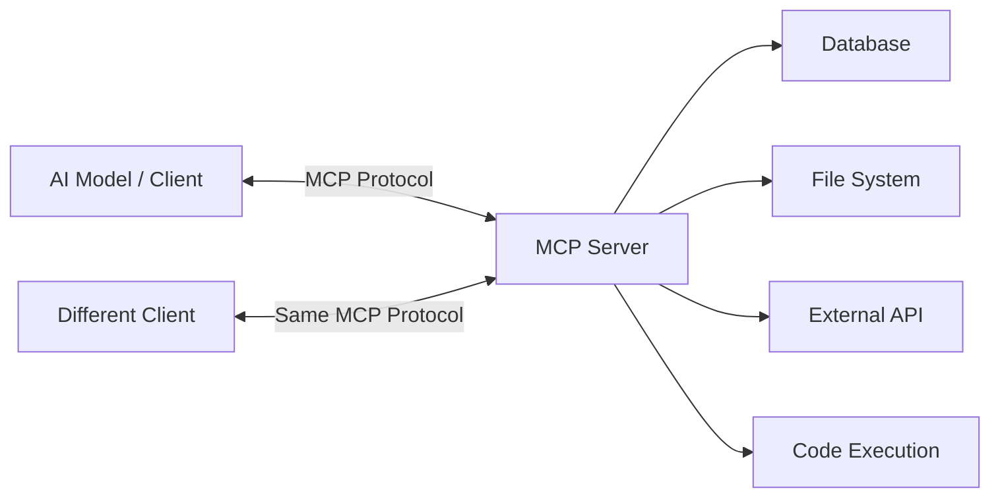

No single tool integration format will win the AI ecosystem. Anyone building proprietary tool formats in 2026 is repeating the mistakes of the pre-USB-C era -- fragmenting the ecosystem for short-term competitive advantage while destroying long-term developer productivity.

MCP (Model Context Protocol) is the first serious attempt at a universal standard for connecting AI models to external tools, and the adoption data suggests it is winning. The question is no longer whether MCP will become the standard -- it is how quickly the holdouts will be forced to adopt it.

MCP (Model Context Protocol) creates a universal interface between AI models and external tools. Developed by Anthropic, donated to the Linux Foundation's Agentic AI Foundation for neutral governance, and adopted by ChatGPT, Cursor, Gemini, VS Code, and hundreds of other tools -- MCP is not a speculative bet. It is the emerging standard.

This post explains why MCP matters, why it is winning, and how NeuroLink implements it with production-grade features including circuit breaking, flexible validation, and factory-based server creation.

---

## What is MCP? The Problem It Solves

### The Problem

AI models need to interact with external tools -- databases, file systems, APIs, code execution environments, and services. Without a standard protocol, every framework builds its own tool integration:

- **LangChain** has its own tool format with custom base classes
- **OpenAI** has function calling with a specific JSON schema format
- **Anthropic** has tool use with its own parameter structure
- **Google** has function declarations with yet another format

Each requires different schema definitions, different execution patterns, and different error handling. If you build a tool for LangChain, you cannot use it with OpenAI's function calling. If you build it for Anthropic, it does not work with Cursor.

### The Solution

MCP standardizes the entire tool interaction pattern. Build a tool server once, and any MCP-compatible client can discover and use it.



### Key Concepts

- **MCP Server:** Exposes tools, resources, and prompts via a standard protocol. A server is a standalone process that advertises its capabilities.
- **MCP Client:** Discovers and invokes tools from MCP servers. Any application that speaks MCP can use any MCP server.
- **Transport Protocols:** stdio, SSE (Server-Sent Events), Streamable HTTP, and WebSocket (via the official SDK's transport module, not yet part of the MCP specification). Different transport for different deployment models.
- **Tool Discovery:** Clients automatically discover available tools from servers without hardcoded configuration.
- **Schema-first:** Tools define their inputs and outputs with JSON Schema, making them self-documenting and machine-parseable.

The analogy holds precisely: just as USB-C eliminated the need to think about which cable, MCP eliminates the need to think about which tool format. You build a tool, and it works everywhere.

---


## Why MCP is Winning: Ecosystem Momentum

MCP is past the tipping point. This is not a speculative protocol -- it has critical mass.

### Adoption Milestones

The trajectory of MCP adoption has been remarkably fast:

- **November 2024:** Anthropic open-sourced MCP
- **Early 2025:** ChatGPT integrated MCP support
- **2025:** Google Gemini added MCP compatibility
- **2025:** Cursor IDE built its entire tool system around MCP
- **2025:** VS Code added native MCP extension support
- **2025:** 10,000+ public MCP servers on registries
- **2025:** 97M+ monthly SDK downloads
- **2025:** Donated to Linux Foundation -- neutral governance ensures no single vendor controls the protocol

When ChatGPT, Cursor, Gemini, and VS Code all adopt the same protocol, the question shifts from "should we adopt MCP?" to "how quickly can we adopt MCP?"

### Why Developers Love It

**Build once, use everywhere.** Write an MCP server for your internal database, and it works with Claude, ChatGPT, Cursor, your custom AI application, and any future MCP client.

**Language-agnostic.** MCP servers can be written in TypeScript, Python, Go, Rust -- whatever your team prefers. The protocol is the contract, not the language.

**Progressive disclosure.** Simple tools are simple to build. Complex tools with multi-step workflows are possible. The protocol does not force complexity on simple use cases.

**Type-safe.** JSON Schema validation ensures tools receive valid inputs. No more hoping the model sends the right parameters.

**Composable.** Combine multiple MCP servers for complex capabilities. A file system server, a database server, and a GitHub server can all be used together in a single conversation.

**No vendor lock-in.** Your MCP server works with Claude, ChatGPT, Cursor, and any MCP client. You are not locked into any specific AI framework.

### The Network Effect

Every new MCP server makes the ecosystem more valuable for every client. Every new MCP client makes the ecosystem more valuable for every server. This is the same dynamic that made USB-C inevitable -- once the standard reaches critical mass, proprietary alternatives become liabilities, not differentiators.

---


## NeuroLink's MCP Implementation: Production-Grade

NeuroLink does not just support MCP. It implements MCP with the resilience patterns you need for production systems.

### Four Transport Protocols

NeuroLink supports all four MCP transport protocols:

- **stdio:** Local process communication -- fastest and simplest, ideal for local tool servers
- **SSE:** Server-Sent Events over HTTP -- good for web-based tool servers
- **HTTP:** Standard REST-based transport -- works with any HTTP infrastructure
- **WebSocket:** Bidirectional real-time communication -- best for interactive tool servers

### Basic Usage

```typescript
import { NeuroLink, executeMCP, listMCPs } from '@juspay/neurolink';

const neurolink = new NeuroLink();

// List available MCP servers
const servers = await listMCPs();

// Execute a tool from an MCP server
const result = await executeMCP({
  server: 'filesystem',
  tool: 'readFile',
  arguments: { path: '/path/to/file.md' },
});
```

### Key Architecture Components

NeuroLink's MCP module is built from four core components, each addressing a specific production concern:

**MCPRegistry** -- Discovers and manages MCP server plugins with a register/unregister lifecycle. The registry provides `register()`, `unregister()`, `listTools()`, `listServers()`, and `executeTool()` methods, giving you a central point of control for all MCP interactions.

**MCPCircuitBreaker** -- Implements the circuit breaker pattern for fault tolerance against unreliable MCP servers. The circuit breaker has three states:

- **Closed:** Normal operation, requests pass through
- **Open:** Server has failed too many times, requests are rejected immediately
- **Half-open:** Testing if the server has recovered

The circuit breaker manager handles multiple breakers and provides a `getHealthSummary()` for monitoring all MCP server health at a glance.

**FlexibleToolValidator** -- Universal safety checks following Anthropic's MCP specification for maximum tool compatibility. Validates tool names with control character detection, length limits, and flexible naming support (dots, hyphens, Unicode characters). The design philosophy: maximum flexibility with universal safety.

**`createMCPServer()`** -- Factory function for creating MCP servers with Zod-validated configuration, domain categories, and tool registration. Supports 10 domain categories: aiProviders, frameworks, development, business, content, data, integrations, automation, analysis, and custom.

### Tool Validation

NeuroLink validates tool schemas before registration, following Anthropic's MCP specification:

```typescript
// NeuroLink validates tool schemas before registration
// Follows Anthropic's MCP spec: maximum flexibility with universal safety
const server = createMCPServer({
  id: 'my-server',
  title: 'My Custom Tools',
  category: 'integrations',
});

server.registerTool({
  name: 'searchDatabase',
  description: 'Search the product database',
  inputSchema: z.object({
    query: z.string(),
    limit: z.number().optional(),
  }),
  execute: async (params, context) => {
    return { success: true, data: results };
  },
});
```

The `validateMCPTool()` function is called on every `registerTool()` invocation. Invalid tools are rejected with detailed error messages and suggestions for fixing the issue, rather than failing silently or crashing at runtime.

> **Note:** NeuroLink's tool validator is deliberately flexible. It allows dots, hyphens, and Unicode in tool names to support the diversity of real-world MCP servers, while blocking control characters and excessively long names for universal safety.
{: .prompt-info }

---

## Building Your Own MCP Server with NeuroLink

The power of MCP is that your tools become universal. Build once with NeuroLink, and every MCP client can use them -- not just NeuroLink itself, but ChatGPT, Cursor, VS Code, and any future MCP-compatible application.

```typescript
import { createMCPServer } from '@juspay/neurolink';
import { z } from 'zod';

// Create an MCP server -- works with ChatGPT, Cursor, VS Code, any MCP client
const server = createMCPServer({
  id: 'product-tools',
  title: 'Product Database Tools',
  description: 'Tools for searching and managing product data',
  category: 'data',
  version: '1.0.0',
  capabilities: ['search', 'crud', 'analytics'],
});

server.registerTool({
  name: 'searchProducts',
  description: 'Search the product catalog',
  inputSchema: z.object({
    query: z.string().describe('Search query'),
    limit: z.number().default(10).describe('Max results'),
    category: z.string().optional().describe('Filter by category'),
  }),
  execute: async ({ query, limit, category }) => {
    const results = await productDB.search(query, { limit, category });
    return { success: true, data: { results, total: results.length } };
  },
});
```

This server is immediately available to any MCP client. The configuration is Zod-validated, so misconfigurations are caught at build time. The 10 domain categories help with organization and discovery in MCP registries.

### Built-in Server Examples

NeuroLink ships with its own MCP servers that demonstrate the pattern:

- **`aiCoreServer`** -- AI provider management tools including `select-provider` and `check-provider-status`. Built using `createMCPServer()` with the `aiProviders` category.
- **`utilityServer`** -- General-purpose utility tools for common operations.

These servers serve as both functional tools and reference implementations for your own MCP servers.

---

## MCP vs Custom Tool Integration

This comparison makes the case for standards over proprietary approaches:

| Aspect | Custom Tool Integration | MCP |
|---|---|---|
| **Portability** | Framework-specific | Universal across all MCP clients |
| **Discovery** | Manual registration | Automatic tool discovery |
| **Schema** | Framework-specific format | JSON Schema standard |
| **Transport** | Varies by implementation | 4 standardized protocols |
| **Security** | Custom implementation | OAuth, HITL approval patterns |
| **Ecosystem** | Isolated to your application | 10,000+ shared servers |
| **Resilience** | Build your own | Circuit breakers, retries (NeuroLink) |
| **Governance** | Vendor-controlled | Linux Foundation |

The comparison drives home a key point: custom tool integration is technical debt. Every proprietary tool format you build today is code you will eventually rewrite to support MCP. Starting with MCP from the beginning eliminates that future migration cost.

> **Tip:** If you have existing tool implementations, wrapping them in an MCP server is straightforward. The server is a thin layer that maps MCP protocol calls to your existing function implementations. You do not need to rewrite your tool logic.
{: .prompt-tip }

---

## The Future of MCP

MCP is becoming the default tool integration protocol for the AI industry. Here is what is coming:

**Agent-to-agent communication.** The next frontier is agents that discover and use each other's capabilities via MCP. Your sales agent discovers a data analysis agent, negotiates capabilities, and delegates work -- all through the MCP protocol.

**MCP marketplace and discovery.** Registries are emerging where MCP servers are published, discovered, and installed. Think npm for AI tools.

**Richer protocol features.** The MCP specification continues to evolve with better authentication, authorization, and resource management.

**NeuroLink's roadmap.** NeuroLink will continue expanding MCP support as the protocol evolves, including deeper integration with the registry ecosystem, improved circuit breaker patterns, and agent-to-agent communication support.

The USB-C effect is already in motion: once the standard wins, everything connects. The question for developers today is not whether to adopt MCP, but how quickly to adopt it.

---

## What's Next

The position is clear: MCP has won the tool integration standard. The adoption curve, the institutional backing from the Linux Foundation, and the sheer number of compatible clients make this a settled question.

The teams that invest in MCP today are building assets that appreciate. Every MCP tool they create works with NeuroLink, ChatGPT, Cursor, VS Code, and every future MCP-compatible client. The teams that continue building proprietary tool integrations are accumulating technical debt that will need to be rewritten.

Build your tools as MCP servers. It is the only strategy that makes sense.

---

**Related posts:**

- [MCP Tools: Extending AI with External Capabilities](/posts/mcp-tools-integration/)
- [Function Calling: AI Tool Use Patterns with NeuroLink](/posts/function-calling-patterns/)
- [Why TypeScript is the Future of AI Development](/posts/typescript-future-of-ai-development/)
