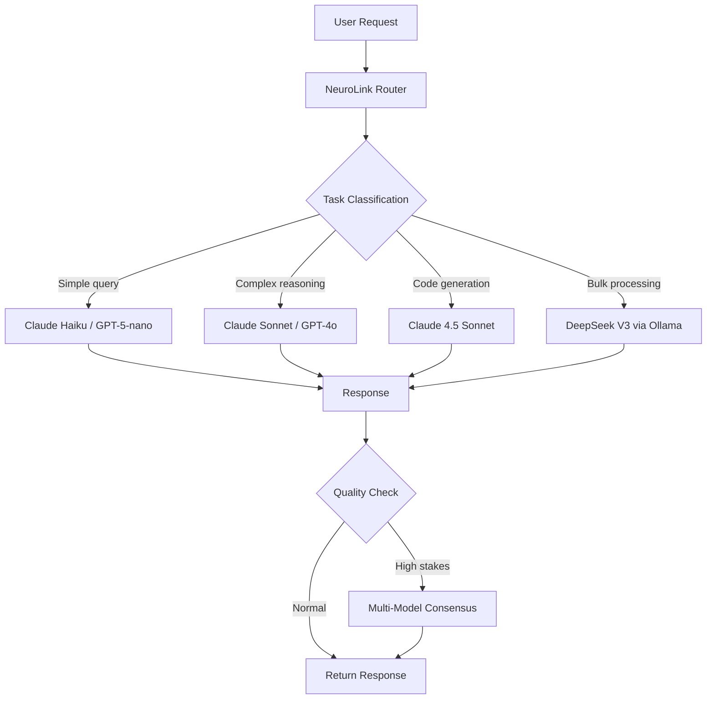

No single AI provider will win. Anyone betting their entire product on one vendor's API is building on sand.

The evidence is clear: model leadership rotates every 6-12 months, pricing shifts by 10x within a single year, and specialized capabilities are fragmenting across providers. GPT-4o leads in speed, Claude in nuanced reasoning, Gemini in multimodal, and open models in cost and privacy. The structural dynamics of this market guarantee continued fragmentation -- not consolidation.

This post lays out the data, the market dynamics, and the architectural patterns for building multi-model applications that thrive regardless of which provider is on top next quarter.

---

## Market Evidence: The Provider Landscape is Diversifying

The pace of model releases has made single-provider loyalty a losing strategy. Consider the timeline from 2024 to 2026:

**OpenAI:** GPT-4o, GPT-4.1, GPT-5, GPT-5.2 (announced or expected) -- four major releases in 18 months, each with different price-performance characteristics.

**Anthropic:** Claude 3.5, Claude 3.7, Claude 4.0, Claude 4.5 (announced or expected) -- four major releases with increasingly strong reasoning and coding capabilities.

**Google:** Gemini 1.5, Gemini 2.0, Gemini 2.5, Gemini 3.0 (announced or expected) -- four generations with the largest context windows and strongest multimodal features.

**Meta:** Llama 3, Llama 3.2, Llama 3.3, Llama 4 (announced or expected) -- open-source models closing the gap with proprietary options.

**Mistral:** Mistral Large, Medium, Small, plus specialized models -- European-based alternative with strong multilingual capabilities.

**DeepSeek:** R1 and V3 -- disrupted pricing expectations and demonstrated that capable models can be dramatically cheaper.

### Key Observations

**Leadership rotates every 3-6 months on benchmarks.** The best model today is rarely the best model six months from now. Teams locked to a single provider miss improvements from competitors.

**Specialized models outperform generalists at specific tasks.** A small, fast model beats a large frontier model for simple classification. A reasoning-specialized model beats a generalist for complex analysis. No single model is best at everything.

**Pricing competition drives costs down 10x year-over-year.** When DeepSeek released models at a fraction of competitor pricing, teams with multi-provider architectures shifted commodity workloads immediately. Single-provider teams could only watch.

**Open-source models close the gap.** Llama 4 and DeepSeek V3 demonstrate that open-source models are competitive with proprietary options for many tasks. Running local models via Ollama eliminates API costs entirely for suitable workloads.

NeuroLink tracks all these models in its enum definitions -- `BedrockModels`, `OpenAIModels`, `VertexModels`, `AnthropicModels`, `MistralModels`, `OllamaModels` -- keeping you current as the landscape evolves.

---


## Technical Argument: Different Models for Different Tasks

No single model excels at everything. The right model depends on the task:

| Task | Best Model Type | Example |
|---|---|---|
| **Code generation** | Large frontier models | Claude 4.5 Sonnet, GPT-5 |
| **Deep reasoning** | Reasoning-specialized | o3-pro, Claude with extended thinking |
| **Quick classification** | Small fast models | GPT-5-nano, Claude Haiku, Gemini Flash |
| **Long context analysis** | Large context models | Claude (200K), Gemini (1M+) |
| **Multilingual** | Specialized multilingual | Mistral, Qwen |
| **Cost-sensitive bulk** | Open-source or small | Ollama + Llama 4, DeepSeek |
| **Regulated industries** | On-premises | Ollama + local models |

A customer support chatbot that handles 90% of queries with simple classification does not need GPT-5 for every request. Route the simple queries to a fast, cheap model and reserve the frontier model for complex cases. This is not premature optimization -- it is basic cost management.

NeuroLink makes task-based routing practical with:

- **`ModelRouter`** -- Routes requests to optimal models based on task characteristics
- **`BinaryTaskClassifier`** -- Classifies tasks as simple or complex for routing decisions
- **Adaptive workflow execution** that routes by complexity using `SPEED_FIRST_WORKFLOW`, `QUALITY_MAX_WORKFLOW`, and `BALANCED_ADAPTIVE_WORKFLOW`

---

## Economic Argument: Competition Drives Better Deals

Vendor lock-in eliminates negotiating leverage. If your application only works with OpenAI, OpenAI has no competitive pressure to offer you better pricing. You are a captive customer.

Multi-provider architecture changes the dynamic:

- You can shift volume to the best price/performance ratio at any time
- You can negotiate from a position of strength: "We can move this workload to Bedrock if the pricing does not work"
- When a disruptive pricing event happens (DeepSeek, Gemini Flash), you can respond immediately

This is not theoretical. When DeepSeek disrupted pricing expectations in early 2025, teams with multi-model architectures shifted commodity tasks within days. Teams locked to a single provider had to plan multi-week migration projects to capture the savings.

With NeuroLink, provider switching is a configuration change, not a rewrite. See [How to Switch AI Providers Without Rewriting Code](/posts/switch-ai-providers-without-rewriting/) for the practical details.

---

## Reliability Argument: Availability Through Diversity

Every AI provider has outages. OpenAI, Anthropic, Google -- they have all experienced service disruptions. Some last minutes, some last hours. For applications with uptime requirements, single-provider means single point of failure.

Multi-provider with automatic failover means resilient AI applications:

```typescript
import { createAIProviderWithFallback } from '@juspay/neurolink';

// Primary on Anthropic, fallback to OpenAI
const { primary, fallback } = await createAIProviderWithFallback(
  'anthropic',
  'openai',
);
```

NeuroLink's circuit breaker pattern prevents cascading failures. If a provider starts failing, the circuit breaker opens and routes traffic to the fallback before the failures cascade through your application. The breaker tests recovery periodically and automatically closes when the provider recovers.

> **Note:** Circuit breakers in NeuroLink track failure rates within configurable statistics windows. You can tune the failure threshold, reset timeout, and half-open test count for your specific availability requirements.
{: .prompt-info }

This is the same pattern used in payment processing, API gateways, and microservice architectures. AI applications deserve the same reliability engineering.

---

## The Multi-Model Architecture Pattern

Here is a practical architecture for multi-model applications:



### Three Layers of Intelligence

**Layer 1: Task Classification** routes each request to the optimal model. Simple queries go to fast, cheap models. Complex reasoning goes to frontier models. Code generation goes to coding-specialized models.

**Layer 2: Primary + Fallback** ensures availability. If the primary provider for any task type is down, the fallback handles it transparently.

**Layer 3: Multi-Model Consensus** for high-stakes decisions. When accuracy matters more than speed, send the request to multiple models and use a judge to select the best response.

### Implementation with NeuroLink

```typescript
import { NeuroLink, CONSENSUS_3_WORKFLOW, SPEED_FIRST_WORKFLOW } from '@juspay/neurolink';

const neurolink = new NeuroLink();

// High-stakes: multi-model consensus
const criticalResult = await neurolink.generate({
  input: { text: 'Approve this $50K transaction?' },
  workflowConfig: CONSENSUS_3_WORKFLOW,
});

// Low-stakes: speed-first routing
const quickResult = await neurolink.generate({
  input: { text: 'Summarize this email' },
  workflowConfig: SPEED_FIRST_WORKFLOW,
});
```

The workflow engine handles the complexity of multi-model orchestration. `CONSENSUS_3_WORKFLOW` runs three models in parallel, collects responses, and uses a judge model to select the best answer. `SPEED_FIRST_WORKFLOW` prioritizes the fastest available model. You configure the policy, and NeuroLink handles the execution.

---

## Getting Started with Multi-Model

If your team is currently on a single provider, here is a practical migration path. You do not need to go multi-model all at once -- each step adds value independently.

### Step 1: Add a Second Provider

Add a second provider's API key to your environment. This takes minutes and costs nothing until you use it:

```bash
OPENAI_API_KEY=sk-your-openai-key
ANTHROPIC_API_KEY=sk-ant-your-anthropic-key
```

### Step 2: Configure Failover

Use `createAIProviderWithFallback()` for resilience. If your primary provider goes down, requests automatically route to the fallback:

```typescript
const { primary, fallback } = await createAIProviderWithFallback(
  'openai',
  'anthropic',
);
```

### Step 3: Route Simple Queries to Cheaper Models

Identify your simplest, highest-volume queries and route them to a fast, cost-effective model. This often reduces AI spend by 40-60% with no quality loss:

```typescript
const model = isSimpleQuery(input) ? 'gpt-4o-mini' : 'gpt-4o';
const result = await neurolink.generate({
  input: { text: input },
  provider: 'openai',
  model: model,
});
```

### Step 4: Add Consensus for High-Value Decisions

For decisions where accuracy matters most, use the workflow engine for multi-model consensus:

```typescript
const result = await neurolink.generate({
  input: { text: criticalQuestion },
  workflowConfig: CONSENSUS_3_WORKFLOW,
});
```

### Step 5: Monitor and Optimize

Use NeuroLink's observability integration (OpenTelemetry + Langfuse) to track cost, latency, and quality per provider. Use the data to optimize your routing rules over time.

---

## What's Next

The position we are taking is simple: single-provider strategies are a liability, and the market dynamics guarantee this will only become more true over time. The data shows that model leadership rotates, pricing drops unpredictably, and specialized capabilities continue to fragment.

NeuroLink makes multi-model practical with unified interfaces, automatic fallback, workflow orchestration, and task-based routing. The teams that adopt multi-provider architectures today will have a structural advantage over those that wait for a crisis to force the migration.

---

**Related posts:**

- [How to Switch AI Providers Without Rewriting Code](/posts/switch-ai-providers-without-rewriting/)
- [Multi-Provider Failover: Never Lose an API Call](/posts/provider-failover-patterns/)
- [OpenAI Integration Guide: GPT-4o, o1, and Beyond with NeuroLink](/posts/openai-integration-guide/)
