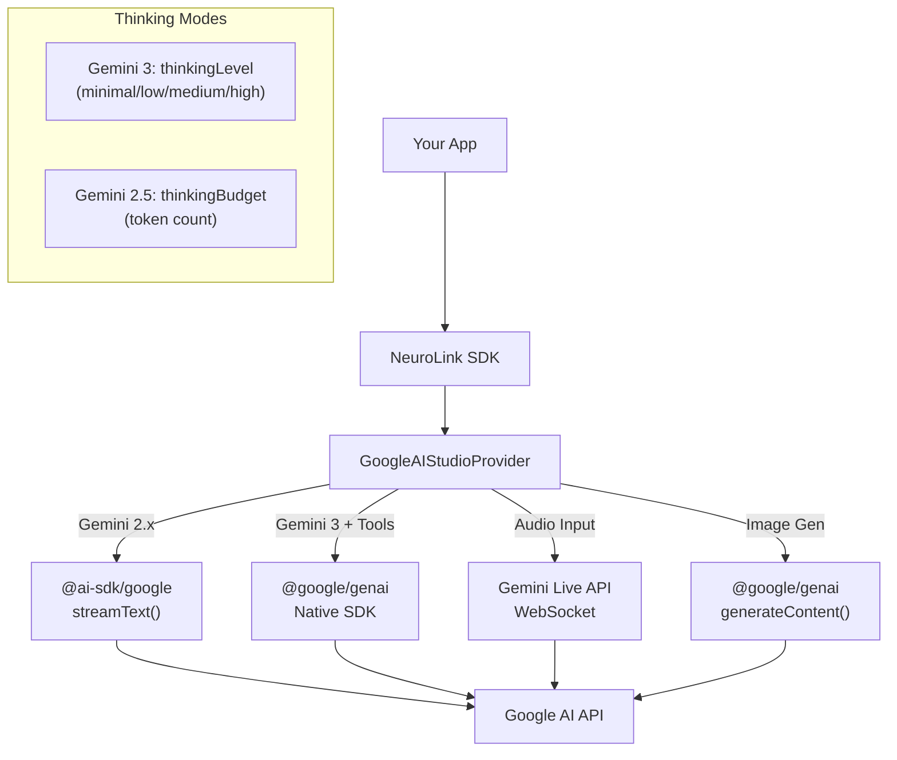

By the end of this guide, you'll have Google's Gemini models running through NeuroLink with free-tier access, including text generation, image creation, audio streaming, and thinking modes.

You will set up Google AI Studio, configure NeuroLink's Google AI provider, and use every major Gemini capability through the same unified API. No GCP project required -- just an API key and a few lines of TypeScript.

---

## Supported Models

NeuroLink supports the complete Gemini model lineup through its `GoogleAIModels` enum:

| Model Family | Model ID | Capabilities |
|---|---|---|
| **Gemini 3 Pro** | `gemini-3-pro-preview`, `gemini-3-pro-image-preview` | Adaptive thinking, image generation |
| **Gemini 3 Flash** | `gemini-3-flash`, `gemini-3-flash-preview` | Fast, adaptive thinking |
| **Gemini 2.5 Pro** | `gemini-2.5-pro` | Best quality, deep analysis |
| **Gemini 2.5 Flash** | `gemini-2.5-flash` _(default)_ | Best value, fast responses |
| **Gemini 2.5 Flash Lite** | `gemini-2.5-flash-lite` | Lowest cost option |
| **Gemini 2.5 Flash Image** | `gemini-2.5-flash-image` | Image generation |
| **Gemini 2.5 Flash Live** | `gemini-2.5-flash-native-audio-preview-09-2025` | Real-time audio |
| **Gemini 2.0 Flash** | `gemini-2.0-flash`, `gemini-2.0-flash-001` | General purpose |
| **Gemini 2.0 Flash Lite** | `gemini-2.0-flash-lite` | Cost-optimized |
| **Embeddings** | `gemini-embedding-001`, `text-embedding-004` | Text embeddings |

> **Note:** The `text-embedding-004` model is being superseded by `gemini-embedding-001`. New projects should use `gemini-embedding-001`.
{: .prompt-info }

The default model is `gemini-2.5-flash`, which offers an excellent balance of speed, quality, and cost. For prototyping and development, the free tier makes it an ideal starting point.

> **Tip:** For cost-sensitive production workloads, `gemini-2.5-flash-lite` offers the lowest per-token cost. For maximum quality, `gemini-2.5-pro` is Google's most capable model. For bleeding-edge features like adaptive thinking, use the `gemini-3-pro-preview` or `gemini-3-flash` models.
{: .prompt-tip }
> **Note:** Model names and IDs in code examples reflect versions available at time of writing. Model availability, naming conventions, and pricing change frequently. Always verify current model IDs with your provider's documentation before deploying to production.
{: .prompt-info }

---

## Quick Setup

### Environment Configuration

```bash
GOOGLE_AI_API_KEY=your-google-ai-key
# Alternative variable name also supported:
# GOOGLE_GENERATIVE_AI_API_KEY=your-google-ai-key
```

NeuroLink automatically maps `GOOGLE_AI_API_KEY` to the internal `GOOGLE_GENERATIVE_AI_API_KEY` variable, so either name works. You can also override the default model with the `GOOGLE_AI_MODEL` environment variable.

### Basic Streaming

```typescript
import { NeuroLink } from '@juspay/neurolink';

const neurolink = new NeuroLink();
const result = await neurolink.stream({
  input: { text: 'Explain machine learning' },
  provider: 'google-ai',
});

for await (const chunk of result.stream) {
  if ('content' in chunk) process.stdout.write(chunk.content);
}
```

That is all you need for basic usage. The provider name is `"google-ai"` (not `"google"` or `"google-ai-studio"`), and the default model is `gemini-2.5-flash`.

> **Note:** The Google Vertex AI provider (for enterprise GCP deployments) uses the config key `"vertex"`, not `"google-vertex"`. The `"google-ai"` provider is for Google AI Studio, which uses API keys instead of GCP service accounts.
{: .prompt-info }

---

## Structured Output Limitation

This is a critical provider-specific limitation you need to know about.

Google Gemini cannot combine function calling (tools) with structured output (JSON schema) in the same request. When using schemas with `output.format: "json"`, you **must** set `disableTools: true`:

```typescript
import { NeuroLink } from '@juspay/neurolink';
import { z } from 'zod';

const AnalysisSchema = z.object({
  summary: z.string(),
  sentiment: z.enum(['positive', 'negative', 'neutral']),
  confidence: z.number(),
});

const neurolink = new NeuroLink();
const result = await neurolink.generate({
  input: { text: 'Analyze this customer review: Great product, fast shipping!' },
  provider: 'google-ai',
  schema: AnalysisSchema,
  output: { format: 'json' },
  disableTools: true, // REQUIRED when using schemas with Google AI
});
```

Without `disableTools: true`, you will get the error: "Function calling with a response mime type: 'application/json' is unsupported."

> **Warning:** This is a Google API limitation, not a NeuroLink limitation. Always set `disableTools: true` when using structured output schemas with `google-ai` or `vertex` providers. Other providers like OpenAI and Anthropic do not have this restriction.
{: .prompt-warning }
> **Note:** Gemini 3+ models lift this restriction and support function calling alongside structured output. The `disableTools: true` requirement applies only to Gemini 2.0 and 2.5 models.
{: .prompt-info }

---

## Streaming with AI SDK

NeuroLink's Google AI Studio provider uses `streamText()` from `@ai-sdk/google` for standard streaming, with intelligent routing for special cases:

- **Gemini 2.x models** use the standard `@ai-sdk/google` streaming path
- **Gemini 3 models with tools** are routed to the native `@google/genai` SDK for full tool calling support
- **Audio input** is auto-detected and routed to the Gemini Live API for bidirectional audio streaming

### Streaming with Thinking

Gemini models support "thinking" -- an extended reasoning mode where the model works through the problem before generating a response. The configuration differs by model generation:

```typescript
// Gemini 3: thinkingLevel (minimal, low, medium, high)
const result = await neurolink.stream({
  input: { text: 'Solve this complex math problem: ...' },
  provider: 'google-ai',
  model: 'gemini-3-pro-preview',
  thinkingConfig: {
    thinkingLevel: 'high', // minimal | low | medium | high
  },
});

for await (const chunk of result.stream) {
  if ('content' in chunk) process.stdout.write(chunk.content);
}
```

```typescript
// Gemini 2.5: thinkingBudget (token count)
const result = await neurolink.stream({
  input: { text: 'Analyze this legal document: ...' },
  provider: 'google-ai',
  model: 'gemini-2.5-pro',
  thinkingConfig: {
    thinkingBudget: 8000, // Token budget for thinking
  },
});
```

The thinking configuration gives the model dedicated reasoning time. For tasks that benefit from step-by-step analysis -- mathematical proofs, code review, strategic planning -- thinking modes significantly improve response quality.

---

## Native Gemini 3 Tool Calling

Gemini 3 models use a native tool calling path through the `@google/genai` SDK for the best tool support. NeuroLink automatically routes Gemini 3 requests to this native path when tools are provided.

### How It Works

1. **Tool conversion:** Vercel AI SDK tool definitions are converted to Google's `FunctionDeclaration[]` format. Both Zod schemas and JSON schemas are supported.
2. **Agentic loop:** The model can call tools multiple times in sequence, up to the configured `maxSteps` limit.
3. **Failed tool tracking:** If a tool fails, NeuroLink tracks retries up to `DEFAULT_TOOL_MAX_RETRIES` before moving on.
4. **Thought signatures:** Gemini 3's `thought_signature` is preserved in conversation history for chain-of-thought continuity.

### Example

```typescript
import { z } from 'zod';
import { tool } from 'ai';
import { NeuroLink } from '@juspay/neurolink';

const neurolink = new NeuroLink();
const result = await neurolink.stream({
  input: { text: 'Search for the latest news' },
  provider: 'google-ai',
  model: 'gemini-3-pro-preview',
  tools: {
    search: tool({
      description: 'Search the web',
      parameters: z.object({ query: z.string() }),
      execute: async ({ query }) => ({ results: [`Result for: ${query}`] }),
    }),
  },
});

for await (const chunk of result.stream) {
  if ('content' in chunk) process.stdout.write(chunk.content);
}
```

The model identifies the need to search, calls the tool with an appropriate query, receives the results, and generates a natural language response incorporating the search results. This all happens transparently through the streaming interface.

> **Note:** `$schema` fields are automatically removed from tool schemas before sending to Google's API for compatibility. NeuroLink handles this conversion internally.
{: .prompt-info }

---

## Image Generation

Google AI Studio supports image generation through Gemini models, making it one of the few providers that can both understand and create images.

### Text-to-Image

```typescript
import { NeuroLink } from '@juspay/neurolink';
import * as fs from 'fs';

const neurolink = new NeuroLink();
const result = await neurolink.generate({
  input: { text: 'A futuristic city skyline at sunset' },
  provider: 'google-ai',
  model: 'gemini-2.5-flash-image',
});

if (result?.imageOutput?.base64) {
  const buffer = Buffer.from(result.imageOutput.base64, 'base64');
  fs.writeFileSync('city.png', buffer);
  console.log('Image saved as city.png');
}
```

### How Image Generation Works

The `executeImageGeneration()` method in NeuroLink's Google AI Studio provider handles:

- **Multimodal input:** Text prompts can be combined with reference images for style transfer or image editing
- **Image detection:** PNG, JPEG, WebP, and GIF formats are detected via magic byte signatures
- **Response modalities:** The model is configured with `["IMAGE", "TEXT"]` modalities
- **Automatic fallback:** Streaming and non-streaming approaches are tried with automatic fallback

Image generation opens up use cases like product mockup generation, design iteration, visual content creation, and image-based data augmentation.

---

## Audio Streaming via Gemini Live

For voice-enabled AI applications, Gemini Live provides bidirectional audio streaming -- you send audio in, and you get audio back in real time.

### How It Works

The `executeAudioStreamViaGeminiLive()` method establishes a WebSocket session via `client.live.connect()`:

- **Input format:** PCM16LE mono frames at a configurable sample rate (default 16kHz)
- **Output format:** PCM16LE audio at 24kHz from Gemini
- **Voice selection:** Configurable via `prebuiltVoiceConfig` with voices like "Orus"
- **Real-time:** Async queue pattern for concurrent send/receive without blocking

Audio streaming is ideal for voice assistants, real-time translation, phone system integration, and accessibility features. NeuroLink automatically detects audio input and routes to the Gemini Live API path.

---

## Architecture

Here is how NeuroLink's Google AI Studio integration routes requests:



The key architectural insight is that NeuroLink uses multiple underlying SDKs to handle different Gemini capabilities:

- **`@ai-sdk/google`** for standard text streaming with Gemini 2.x models
- **`@google/genai`** for native Gemini 3 tool calling, image generation, and audio streaming

This dual-SDK approach gives you the best of both worlds: Vercel AI SDK compatibility for standard operations and native Google SDK access for Gemini-specific features like image generation and Live audio.

---

## Error Handling

The Google AI Studio provider classifies errors into NeuroLink's typed exception hierarchy:

| Error Type | Triggers | Recommended Action |
|---|---|---|
| `AuthenticationError` | `API_KEY_INVALID` | Check `GOOGLE_AI_API_KEY` |
| `RateLimitError` | `RATE_LIMIT_EXCEEDED` | Implement backoff, or upgrade tier |
| `NetworkError` | Timeouts, connection failures | Retry with increased timeout |
| `ProviderError` | Any other API error | Log and investigate |

```typescript
import { AuthenticationError, RateLimitError } from '@juspay/neurolink';

try {
  await neurolink.generate({
    input: { text: 'Hello' },
    provider: 'google-ai',
  });
} catch (error) {
  if (error instanceof RateLimitError) {
    console.log('Rate limited. Consider upgrading from free tier.');
  } else if (error instanceof AuthenticationError) {
    console.error('Check your GOOGLE_AI_API_KEY.');
  }
}
```

> **Tip:** The free tier has generous but limited rate limits. If you hit rate limits frequently, consider upgrading to a paid tier or adding a second provider as a fallback with `createAIProviderWithFallback()`.
{: .prompt-tip }

---

## Google AI Studio vs Google Vertex AI

NeuroLink supports both Google AI Studio (`google-ai`) and Google Vertex AI (`vertex`) as separate providers. Here is when to use each:

| Feature | Google AI Studio (`google-ai`) | Google Vertex AI (`vertex`) |
|---|---|---|
| **Authentication** | API key | GCP service account |
| **Free tier** | Yes, generous | No (GCP billing required) |
| **Enterprise features** | Limited | Full (VPC, IAM, audit logs) |
| **Data residency** | Google-managed | Your GCP region |
| **SLA** | Best effort | Enterprise SLA |
| **Best for** | Prototyping, development, small apps | Enterprise production deployments |

For development and prototyping, Google AI Studio is the clear choice -- free tier access, simple API key authentication, and no GCP setup required. For enterprise production deployments with data residency requirements, Vertex AI provides the governance and compliance features you need.

Both providers access the same Gemini models. Your code stays the same -- only the `provider` string and authentication method change.

---

## What's Next

You now have Google AI Studio fully integrated with NeuroLink. From text generation to image creation to real-time audio, you have access to Gemini's full capability range through the same unified API used by all NeuroLink providers.

Your next step: pick one capability -- text, images, or audio -- and ship it. Then explore:

- **Compare with OpenAI:** [OpenAI Integration Guide](/posts/openai-integration-guide/) for a side-by-side comparison
- **Build multi-provider apps:** [How to Switch AI Providers Without Rewriting Code](/posts/switch-ai-providers-without-rewriting/) for provider portability
- **See all the patterns:** [NeuroLink Quickstart: 10 Things You Can Build Today](/posts/neurolink-quickstart-10-things/) for image analysis, TTS, and structured output examples
- **Understand the architecture:** [What is NeuroLink? The Unified AI SDK Explained](/posts/what-is-neurolink-unified-sdk/) for the full picture

---

**Related posts:**

- [OpenAI Integration Guide: GPT-4o, o1, and Beyond with NeuroLink](/posts/openai-integration-guide/)
- [How to Switch AI Providers Without Rewriting Code](/posts/switch-ai-providers-without-rewriting/)
- [Multi-Provider Failover: Never Lose an API Call](/posts/provider-failover-patterns/)
