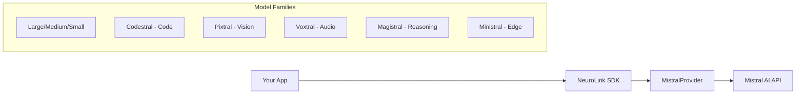

By the end of this guide, you'll have Mistral AI's full model lineup integrated with NeuroLink -- from the ultra-fast Mistral Small to the flagship Large model, with streaming, tool calling, and vision support.

You will set up the Mistral provider, explore the model catalog, and use EU-hosted inference through NeuroLink's unified TypeScript API. If you need GDPR-compliant AI, strong multilingual performance, or competitive pricing, Mistral is a strong option to add to your provider mix.

## Supported Models

Mistral offers one of the broadest model lineups of any AI provider. NeuroLink supports the complete catalog through the `MistralModels` enum. Here is a breakdown by category:

### Large and Medium Models

| Model ID | Best For |
|---|---|
| `mistral-large-latest`, `mistral-large-2512` | Complex reasoning, highest quality output |
| `mistral-medium-latest`, `mistral-medium-2508` | Balanced cost and performance |

These are Mistral's flagship models, designed for tasks that demand deep reasoning, nuanced language understanding, and high-fidelity output. If you need the best Mistral has to offer and cost is secondary, `mistral-large-latest` is your pick.

### Small Models

| Model ID | Best For |
|---|---|
| `mistral-small-latest`, `mistral-small-2506` (default) | Fast inference, vision-capable |

Mistral Small 2506 is the **default model** in NeuroLink's Mistral provider. It was chosen as the default because it supports multimodal input (vision), making it the most versatile starting point for new projects. You can override this default via the `MISTRAL_MODEL` environment variable.

### Magistral Models (Reasoning)

| Model ID | Best For |
|---|---|
| `magistral-medium-latest` | Complex reasoning tasks |
| `magistral-small-latest` | Lightweight reasoning |

The Magistral family is optimized specifically for reasoning-heavy workloads -- think chain-of-thought analysis, logical deduction, and multi-step problem solving.

### Ministral Models (Edge Deployment)

| Model ID | Best For |
|---|---|
| `ministral-14b-2512` | Edge deployment, moderate capability |
| `ministral-8b-2512` | Edge deployment, balanced |
| `ministral-3b-2512` | Ultra-lightweight edge deployment |

These models are designed for running at the edge or in resource-constrained environments. The 3B variant is small enough to run on mobile or IoT devices while still delivering useful output.

### Codestral and Devstral (Code Generation)

| Model ID | Best For |
|---|---|
| `codestral-latest`, `codestral-2508` | Code generation and completion |
| `codestral-embed` | Code embeddings |
| `devstral-medium-latest` | Software development tasks |
| `devstral-small-latest` | Lightweight dev assistance |

Codestral is Mistral's purpose-built model for code. It excels at code generation, completion, explanation, and refactoring across dozens of programming languages. Devstral extends this with broader software development capabilities.

### Pixtral (Vision/Multimodal)

| Model ID | Best For |
|---|---|
| `pixtral-large` | High-quality vision tasks |
| `pixtral-12b` | Balanced vision tasks |

Pixtral models are Mistral's dedicated vision models, capable of understanding images, diagrams, charts, and documents alongside text prompts.

### Voxtral (Audio)

| Model ID | Best For |
|---|---|
| `voxtral-small-latest` | Audio processing |
| `voxtral-mini-latest` | Lightweight audio tasks |

Voxtral brings audio understanding to the Mistral ecosystem, enabling transcription, audio analysis, and voice-based interaction.

### Specialized Models

| Model ID | Best For |
|---|---|
| `mistral-nemo` | General-purpose lightweight tasks |
| `mistral-embed` | Text embeddings |
| `mistral-moderation-latest` | Content moderation |

## Quick Setup

Getting started with Mistral in NeuroLink takes just a few lines of configuration and code.

### Environment Variables

First, set your Mistral API key. You can obtain one from the [Mistral AI platform](https://console.mistral.ai/):

```bash
export MISTRAL_API_KEY=your-mistral-key

# Optional: override the default model (mistral-small-2506)
export MISTRAL_MODEL=mistral-large-latest
```

### Basic Streaming Example

```typescript
import { NeuroLink } from '@juspay/neurolink';

const neurolink = new NeuroLink();

const result = await neurolink.stream({
  input: { text: "Explain the EU AI Act" },
  provider: "mistral",
});

for await (const chunk of result.stream) {
  if ("content" in chunk) process.stdout.write(chunk.content);
}
```

That is all you need. NeuroLink handles API key validation and proxy configuration internally when initializing the Mistral provider. If you are behind a corporate proxy, set the standard `HTTPS_PROXY` environment variable and NeuroLink routes requests transparently.

> **Tip:** If you do not set `MISTRAL_MODEL`, NeuroLink defaults to `mistral-small-2506` -- which supports vision and offers an excellent balance of speed and capability.
{: .prompt-tip }

## Streaming

Streaming is NeuroLink's primary interaction mode, and Mistral's provider implements it through the same `BaseProvider` pattern used across all providers. Under the hood, the `executeStream()` method uses `streamText()` from the Vercel AI SDK with Mistral's model instance.

The streaming implementation includes:

- **Multimodal message building** via `buildMessagesForStream()`, which handles text, images, and mixed content
- **Middleware integration** through `getAISDKModelWithMiddleware()` for analytics, guardrails, and custom logic
- **Analytics collection** via `streamAnalyticsCollector.createAnalytics()` for per-request metrics
- **Tool execution storage** through `handleToolExecutionStorage()` on step completion

### Streaming with Codestral for Code Tasks

When you need code generation, Codestral is the model to reach for:

```typescript
const result = await neurolink.stream({
  input: { text: "Write a Python data pipeline that reads CSV files, cleans missing values, and outputs a summary report" },
  provider: "mistral",
  model: "codestral-latest",
  temperature: 0.3,
  maxTokens: 2000,
});

for await (const chunk of result.stream) {
  if ("content" in chunk) process.stdout.write(chunk.content);
}
```

> **Note:** Model names and IDs in code examples reflect versions available at time of writing. Model availability, naming conventions, and pricing change frequently. Always verify current model IDs with your provider's documentation before deploying to production.
{: .prompt-info }

Setting `temperature: 0.3` keeps the output focused and deterministic -- ideal for code generation where you want consistent, correct results rather than creative variation.

### Streaming with Reasoning Models

For tasks that require deep thinking, use the Magistral family:

```typescript
const result = await neurolink.stream({
  input: { text: "Analyze the game theory implications of AI pricing strategies in a multi-vendor market" },
  provider: "mistral",
  model: "magistral-medium-latest",
});
```

## Tool Calling

Mistral models support tool calling through the same Zod/JSON schema interface used across all NeuroLink providers. The `supportsTools()` method (inherited from BaseProvider) returns `true` by default, and tools are passed directly to `streamText()` with `toolChoice: "auto"`.

Multi-step tool execution is supported through `maxSteps` (configured via `DEFAULT_MAX_STEPS`), allowing Mistral to call tools iteratively to solve complex problems.

Here is an example using Mistral Large with a custom tool:

```typescript
import { z } from "zod";
import { tool } from "ai";

const result = await neurolink.stream({
  input: { text: "Find restaurants near the Eiffel Tower" },
  provider: "mistral",
  model: "mistral-large-latest",
  tools: {
    searchPlaces: tool({
      description: "Search for places by location",
      parameters: z.object({
        query: z.string().describe("What to search for"),
        location: z.string().describe("Location to search near"),
      }),
      execute: async ({ query, location }) => ({
        results: [
          { name: "Le Jules Verne", location, cuisine: "French Fine Dining" },
          { name: "Cafe de l'Homme", location, cuisine: "French Bistro" },
        ],
      }),
    }),
  },
});

for await (const chunk of result.stream) {
  if ("content" in chunk) process.stdout.write(chunk.content);
}
```

Mistral Large is particularly strong at understanding when and how to call tools, making it the recommended model for tool-heavy workflows. For simpler tool interactions, Mistral Small works well too.

> **Note:** Tool calling follows the same Zod schema pattern across all NeuroLink providers. If you have tools built for OpenAI or Anthropic, they work with Mistral without modification.
{: .prompt-info }

## Vision with Pixtral

Mistral's Pixtral models (`pixtral-large`, `pixtral-12b`) and Mistral Small 2506 support image input, enabling you to analyze diagrams, documents, screenshots, and other visual content alongside text prompts.

Images are passed via the `input.images` array:

```typescript
import fs from "fs";
import { NeuroLink } from '@juspay/neurolink';

const neurolink = new NeuroLink();

const result = await neurolink.stream({
  input: {
    text: "Describe this architecture diagram and identify potential bottlenecks",
    images: [fs.readFileSync("diagram.png")],
  },
  provider: "mistral",
  model: "pixtral-large",
});

for await (const chunk of result.stream) {
  if ("content" in chunk) process.stdout.write(chunk.content);
}
```

Pixtral Large is the strongest vision model in Mistral's lineup, capable of understanding complex diagrams, charts, and multi-page documents. For lighter vision tasks -- like reading a receipt or identifying objects in a photo -- Mistral Small 2506 or Pixtral 12B will be faster and cheaper.

> **Tip:** Since `mistral-small-2506` (the default model) is vision-capable, you can pass images without explicitly selecting a Pixtral model. This makes it easy to add vision capabilities to existing Mistral workflows.
{: .prompt-tip }

## Error Handling

NeuroLink's Mistral provider classifies errors into well-defined categories through the `handleProviderError()` method, making it straightforward to implement targeted error handling:

| Error Pattern | Classification | Common Cause |
|---|---|---|
| `API_KEY_INVALID` / `Invalid API key` | Authentication error | Missing or incorrect `MISTRAL_API_KEY` |
| `Rate limit exceeded` | Rate limit error | Too many requests per minute |
| `TimeoutError` | Timeout error | Model taking too long to respond |
| Other errors | Generic `Mistral error` | Various provider-side issues |

Here is a practical error handling pattern:

```typescript
try {
  const result = await neurolink.stream({
    input: { text: "Analyze this document" },
    provider: "mistral",
  });

  for await (const chunk of result.stream) {
    if ("content" in chunk) process.stdout.write(chunk.content);
  }
} catch (error) {
  if (error.message.includes("API_KEY_INVALID")) {
    console.error("Check your MISTRAL_API_KEY environment variable");
  } else if (error.message.includes("Rate limit")) {
    console.error("Rate limited -- implement backoff or upgrade your plan");
  } else if (error.message.includes("TimeoutError")) {
    console.error("Request timed out -- try a smaller model or reduce maxTokens");
  } else {
    console.error("Mistral error:", error.message);
  }
}
```

You can also validate your configuration before making requests using the `validateConfiguration()` method, which checks API key availability and returns the provider configuration including the selected model.

## Architecture

Here is how NeuroLink's Mistral integration fits together:



The flow is straightforward: your application talks to the NeuroLink SDK, which delegates to `MistralProvider`. The provider handles authentication, proxy configuration, and model selection internally. From there, requests go directly to the Mistral AI API.

This architecture means you get the full power of Mistral's API with the convenience of NeuroLink's unified interface. Switch to another provider by changing a single parameter -- no code refactoring required.

## Why Choose Mistral?

There are several compelling reasons to include Mistral in your AI provider strategy:

### EU Data Sovereignty

Mistral is headquartered in France and hosts its inference infrastructure in the European Union. For teams subject to GDPR or other EU data regulations, Mistral eliminates the complexity of cross-border data transfers.

### Competitive Pricing

Mistral consistently undercuts OpenAI and Anthropic on per-token pricing, especially for their Small and Ministral model families. For high-volume workloads, the cost savings can be substantial.

### Multilingual Excellence

Built by a European team with deep roots in NLP research, Mistral models excel at multilingual tasks. French, German, Spanish, Italian, and other European languages see particularly strong performance.

### Code Generation

Codestral is one of the best code generation models available, rivaling dedicated coding models from larger providers. Combined with Devstral for broader software engineering tasks, Mistral offers a compelling toolkit for developer-facing AI applications.

### Model Range

From the 3B Ministral (suitable for edge deployment) to their Large model (available up to 675B parameters on Bedrock), Mistral covers an exceptionally wide range of deployment scenarios. Parameter counts are approximate and may differ from official specifications.

## What's Next

You now have Mistral fully integrated. Your next step: try Mistral Small for a latency-sensitive use case, or Codestral for code generation. Then explore:

- **Compare with other providers:** Check out the Provider Comparison Matrix to see how Mistral stacks up against OpenAI, Anthropic, and Google AI for your specific use cases
- **Explore unified routing:** Learn how LiteLLM + NeuroLink can route requests across multiple providers, including Mistral, through a single proxy
- **Add fallback providers:** Combine Mistral with OpenAI or Anthropic using NeuroLink's `createAIProviderWithFallback()` for zero-downtime resilience

Mistral's combination of speed, EU hosting, competitive pricing, and model breadth makes it an excellent primary or secondary provider for any NeuroLink-powered application.

---

**Related posts:**

- [OpenAI Integration Guide: GPT-4o, o1, and Beyond with NeuroLink](/posts/openai-integration-guide/)
- [Google AI Studio: Free-Tier Gemini Access with NeuroLink](/posts/google-ai-studio-gemini-integration/)
- [Multi-Provider Failover: Never Lose an API Call](/posts/provider-failover-patterns/)
