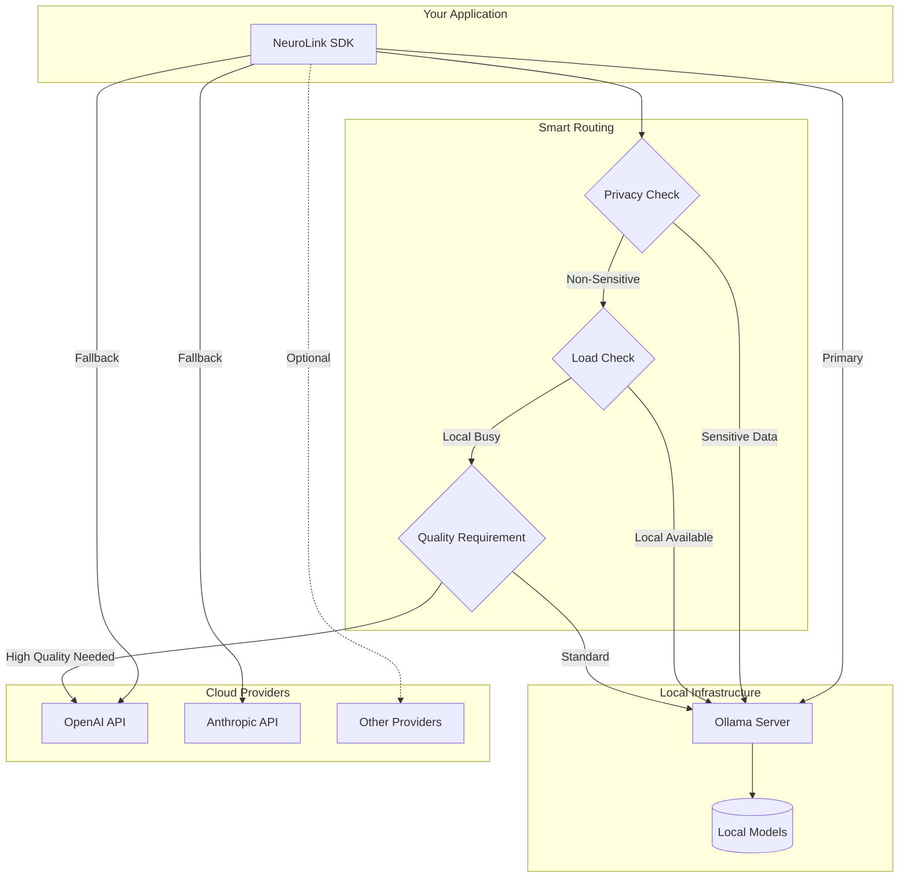

By the end of this guide, you'll have local LLMs running on your own machine with Ollama, integrated into NeuroLink for zero-cost, zero-latency, privacy-first AI development.

You will install Ollama, pull models, configure NeuroLink's Ollama provider, and build hybrid architectures that use local models for development and sensitive workloads while scaling to cloud providers for production. No API keys required -- everything runs on your hardware.

## Architecture Overview

The following diagram illustrates how NeuroLink orchestrates both local Ollama models and cloud providers, enabling seamless hybrid deployments:



## Why Run LLMs Locally?

Before diving into the technical setup, let's understand why local LLM deployment has become increasingly attractive for developers and organizations.

### Privacy and Data Sovereignty

When you run models locally, your data never leaves your infrastructure. This is critical for:

- **Healthcare applications** handling protected health information (PHI)
- **Financial services** processing sensitive customer data
- **Legal tech** working with privileged communications
- **Enterprise applications** dealing with proprietary business information

With local deployment, you maintain complete control over your data pipeline. No third-party provider ever sees your prompts or responses.

### Cost Predictability

Cloud LLM APIs charge per token, which can lead to unpredictable costs as usage scales. Local deployment converts this variable cost into a fixed infrastructure investment. Once you have the hardware, your marginal cost per inference approaches zero.

For applications with high query volumes or lengthy contexts, local deployment often becomes economically superior within months of operation.

### Latency Optimization

Network round-trips to cloud providers introduce latency that can be unacceptable for real-time applications. Local inference eliminates this network overhead entirely. On properly configured hardware, you can achieve response times measured in milliseconds rather than seconds.

### Offline Capability

Local models work without internet connectivity, enabling deployment in:

- Air-gapped environments
- Edge devices with intermittent connectivity
- Mobile applications requiring offline functionality
- Disaster recovery scenarios

## Understanding Ollama

Ollama has emerged as the leading solution for running LLMs locally. It provides a simple, Docker-like experience for model management while handling the complex details of model loading, quantization, and inference optimization.

### Core Features

**Model Management**: Ollama provides a straightforward CLI for pulling, running, and managing models. Models are downloaded once and cached locally, with automatic handling of model weights and configurations.

**Optimized Inference**: Under the hood, Ollama uses llama.cpp for inference, providing excellent performance across different hardware configurations. It automatically selects optimal batch sizes and context lengths based on available resources.

**API Compatibility**: Ollama exposes an OpenAI-compatible API endpoint, making it a drop-in replacement for many existing applications built around the OpenAI SDK.

**Multi-Model Support**: You can run multiple models simultaneously (hardware permitting), switching between them based on task requirements.

## Setting Up Ollama

Let's walk through the complete Ollama setup process across different platforms.

### Installation

**macOS (Homebrew)**:

```bash
brew install ollama
```

**macOS (Direct Download)**:

```bash
curl -fsSL https://ollama.com/install.sh | sh
```

**Linux**:

```bash
curl -fsSL https://ollama.com/install.sh | sh
```

**Windows**:
Download the installer from [ollama.com/download](https://ollama.com/download) and run the setup wizard.

**Docker**:

```bash
docker run -d -v ollama:/root/.ollama -p 11434:11434 --name ollama ollama/ollama
```

### Starting the Ollama Server

After installation, start the Ollama service:

```bash
ollama serve
```

On macOS and Windows, Ollama typically runs as a background service automatically. On Linux, you may want to configure it as a systemd service:

```ini
[Unit]
Description=Ollama Service
After=network-online.target

[Service]
ExecStart=/usr/local/bin/ollama serve
User=ollama
Group=ollama
Restart=always
RestartSec=3

[Install]
WantedBy=default.target
```

Enable and start the service:

```bash
sudo systemctl enable ollama
sudo systemctl start ollama
```

### Pulling Your First Model

With Ollama running, pull a model to get started:

```bash
# Pull Llama 3.1 - great balance of capability and speed
ollama pull llama3.1:latest

# Pull Mistral - excellent for general tasks
ollama pull mistral:latest

# Pull CodeLlama for programming tasks
ollama pull codellama:latest
```

Verify the model is available:

```bash
ollama list
```

Test it with a quick prompt:

```bash
ollama run llama3.1:latest "Explain quantum computing in simple terms"
```

## Configuring NeuroLink for Ollama

NeuroLink's provider-agnostic architecture makes Ollama integration straightforward. Here's how to configure your NeuroLink instance to use local Ollama models.

### Basic Configuration

Initialize NeuroLink and start making requests to your local Ollama instance:

```typescript
import { NeuroLink } from '@juspay/neurolink';

const neurolink = new NeuroLink();

// Simple generation with Ollama
const result = await neurolink.generate({
  input: { text: 'Explain quantum computing in simple terms' },
  provider: 'ollama',
  model: 'llama3.1:latest',
});

console.log(result.content);
```

### Environment Variables

Configure Ollama connection via environment variables:

```bash
export OLLAMA_BASE_URL=http://localhost:11434
export OLLAMA_MODEL=llama3.1:latest
export OLLAMA_TIMEOUT=240000
export OLLAMA_OPENAI_COMPATIBLE=true  # Use OpenAI-compatible API mode (optional)
```

When `OLLAMA_OPENAI_COMPATIBLE` is set to `true`, NeuroLink will use Ollama's OpenAI-compatible endpoint (`/v1/chat/completions`) instead of the native Ollama API (`/api/generate`). This can be useful for compatibility with tools or workflows designed for the OpenAI API format.

### Using Ollama with NeuroLink

> **Note:** Ollama configuration is handled via environment variables (see above). Set `OLLAMA_BASE_URL`, `OLLAMA_MODEL`, and `OLLAMA_TIMEOUT` (default: 240000ms) as needed before initializing NeuroLink.

```typescript
import { NeuroLink } from '@juspay/neurolink';

// Initialize NeuroLink (Ollama settings come from environment variables)
const neurolink = new NeuroLink();

// Use Ollama for generation
const response = await neurolink.generate({
  input: { text: 'Write a TypeScript function to calculate fibonacci numbers' },
  provider: 'ollama',
  model: 'llama3.1:latest',
});

console.log(response.content);
```

### Multiple Model Configuration

Configure multiple Ollama models for different use cases:

```typescript
import { NeuroLink } from '@juspay/neurolink';

const neurolink = new NeuroLink();

// Fast model for quick responses
const quickResponse = await neurolink.generate({
  input: { text: 'What is 2 + 2?' },
  provider: 'ollama',
  model: 'llama3.1:latest',
});

// Code-specialized model for programming tasks
const codeResponse = await neurolink.generate({
  input: { text: 'Write a binary search function in TypeScript' },
  provider: 'ollama',
  model: 'codellama:latest',
});

// Large model for complex reasoning
const complexResponse = await neurolink.generate({
  input: { text: 'Analyze the economic implications of universal basic income' },
  provider: 'ollama',
  model: 'llama3.1:70b',
});
```

## Model Selection Guide

Choosing the right model for your use case is crucial for balancing capability with resource requirements.

### General Purpose Models

**Llama 3.1 8B** (4.7GB)

- Best for: General chat, summarization, simple reasoning
- VRAM: 8GB minimum
- Speed: Fast, suitable for interactive applications
- Quality: Excellent for its size

**Llama 3.1 70B** (40GB)

- Best for: Complex reasoning, nuanced tasks, near-GPT-4 quality
- VRAM: 48GB+ (or CPU with 64GB+ RAM)
- Speed: Slower, better for batch processing
- Quality: State-of-the-art open source

**Mistral 7B** (4.1GB)

- Best for: Quick tasks, high throughput requirements
- VRAM: 6GB minimum
- Speed: Very fast
- Quality: Excellent efficiency-to-quality ratio

### Coding Models

**CodeLlama 13B** (7.4GB)

- Best for: Code generation, debugging, explanation
- VRAM: 12GB minimum
- Languages: Strong in Python, JavaScript, C++, Java

**DeepSeek Coder 33B** (19GB)

- Best for: Complex programming tasks, multi-file contexts
- VRAM: 24GB minimum
- Quality: Approaches GPT-4 for coding

### Specialized Models

**Phi-3 Mini** (2.3GB)

- Best for: Edge deployment, resource-constrained environments
- VRAM: 4GB minimum
- Quality: Impressive for its tiny size

**Mixtral 8x7B** (26GB)

- Best for: Tasks requiring broad knowledge
- VRAM: 32GB minimum
- Architecture: Mixture of experts for efficiency

### Quantization Options

Ollama supports various quantization levels that trade quality for reduced resource requirements:

```bash
# Full precision (largest, highest quality)
ollama pull llama3.1:8b-fp16

# 8-bit quantization (good balance)
ollama pull llama3.1:8b-q8_0

# 4-bit quantization (smallest, slight quality reduction)
ollama pull llama3.1:8b-q4_0
```

For most applications, the default quantization provides an excellent balance. Drop to Q4 only when memory is severely constrained.

## Performance Optimization

Getting the best performance from local LLMs requires attention to hardware configuration and Ollama settings.

### Hardware Considerations

**GPU Acceleration**

For optimal performance, use a GPU with sufficient VRAM:

```bash
# Check if Ollama is using GPU
ollama ps

# Force CPU-only mode (if needed)
CUDA_VISIBLE_DEVICES="" ollama serve  # Force CPU-only mode
```

NVIDIA GPUs require the CUDA toolkit. AMD GPUs need ROCm. Apple Silicon uses Metal automatically.

**Memory Management**

Configure system resources appropriately:

```bash
# Set maximum loaded models
export OLLAMA_MAX_LOADED_MODELS=2

# Control how long models stay loaded in memory (default: 5m)
export OLLAMA_KEEP_ALIVE=10m

# Enable flash attention for better memory efficiency
export OLLAMA_FLASH_ATTENTION=1
```

To configure the **context window** (which affects memory usage), set it per-model in a Modelfile rather than via environment variable:

```dockerfile
# Modelfile.custom
FROM llama3.1:8b
PARAMETER num_ctx 4096
```

Or pass it via the API's `num_ctx` parameter at request time. See the [Ollama FAQ](https://github.com/ollama/ollama/blob/main/docs/faq.md) for the full list of supported environment variables (`OLLAMA_HOST`, `OLLAMA_MODELS`, `OLLAMA_KEEP_ALIVE`, `OLLAMA_NUM_PARALLEL`, `OLLAMA_MAX_LOADED_MODELS`, `OLLAMA_FLASH_ATTENTION`, `OLLAMA_ORIGINS`, etc.).

> **Note:** Ollama does not have `OLLAMA_GPU_OVERHEAD` or `OLLAMA_CONTEXT_LENGTH` environment variables. Context length is set per-model via `PARAMETER num_ctx` in a Modelfile or via the `num_ctx` API parameter. GPU memory allocation is managed automatically by Ollama.
{: .prompt-info }

### Ollama Server Tuning

Create a custom Modelfile for optimized inference:

```dockerfile
# Modelfile.optimized
FROM llama3.1:8b

# Increase context window
PARAMETER num_ctx 8192

# Optimize for speed
PARAMETER num_batch 512
PARAMETER num_thread 8

# Reduce temperature for more deterministic outputs
PARAMETER temperature 0.7
PARAMETER top_p 0.9

# System prompt for your use case
SYSTEM """You are a helpful assistant optimized for technical questions."""
```

Build and use the optimized model:

```bash
ollama create llama-optimized -f Modelfile.optimized
ollama run llama-optimized
```

### NeuroLink Performance Settings

Configure NeuroLink for optimal local inference with streaming:

```typescript
import { NeuroLink } from '@juspay/neurolink';

const neurolink = new NeuroLink();

// Enable streaming for better perceived performance
const result = await neurolink.stream({
  input: { text: 'Explain machine learning in detail' },
  provider: 'ollama',
  model: 'llama3.1:latest',
});

for await (const chunk of result.stream) {
  if ('content' in chunk) {
    process.stdout.write(chunk.content);
  }
}
```

### Batching for Throughput

When processing multiple requests, use concurrent execution:

```typescript
import { NeuroLink } from '@juspay/neurolink';

const neurolink = new NeuroLink();

async function batchInference(prompts: string[]): Promise<string[]> {
  const tasks = prompts.map(prompt =>
    neurolink.generate({
      input: { text: prompt },
      provider: 'ollama',
      model: 'llama3.1:latest',
    })
  );

  const results = await Promise.all(tasks);
  return results.map(r => r.content);
}

// Process batch
const documents = ['Document 1 content...', 'Document 2 content...', 'Document 3 content...'];
const prompts = documents.map(doc => `Summarize: ${doc}`);
const summaries = await batchInference(prompts);

summaries.forEach((summary, i) => {
  console.log(`Summary ${i + 1}:`, summary);
});
```

## Hybrid Cloud and Local Patterns

One of NeuroLink's most powerful features is the ability to seamlessly combine local and cloud providers. This hybrid approach gives you the best of both worlds.

### Fallback Pattern

Use local inference by default, falling back to cloud when local resources are exhausted:

```typescript
import { NeuroLink } from '@juspay/neurolink';

const neurolink = new NeuroLink();

// Try local first, then cloud providers as fallback
async function generateWithFallback(prompt: string): Promise<string> {
  const providers = ['ollama', 'openai', 'anthropic'];

  for (const provider of providers) {
    try {
      const result = await neurolink.generate({
        input: { text: prompt },
        provider,
        model: provider === 'ollama' ? 'llama3.1:latest' : undefined
      });
      return result.content;
    } catch (error) {
      console.log(`Provider ${provider} failed, trying next...`);
      continue;
    }
  }

  throw new Error('All providers failed');
}

const response = await generateWithFallback('Complex analysis task...');
console.log(response);
```

### Task-Based Routing

Route requests to appropriate providers based on task characteristics:

```typescript
import { NeuroLink } from '@juspay/neurolink';

const neurolink = new NeuroLink();

type TaskType = 'simple_qa' | 'code_generation' | 'complex_reasoning' | 'creative_writing';

interface TaskConfig {
  provider: string;
  model: string;
}

const taskRoutes: Record<TaskType, TaskConfig> = {
  simple_qa: { provider: 'ollama', model: 'llama3.1:latest' },
  code_generation: { provider: 'ollama', model: 'codellama:latest' },
  complex_reasoning: { provider: 'anthropic', model: 'claude-3-opus' },
  creative_writing: { provider: 'openai', model: 'gpt-4' },
};

async function routedGenerate(prompt: string, taskType: TaskType): Promise<string> {
  const config = taskRoutes[taskType];

  const result = await neurolink.generate({
    input: { text: prompt },
    provider: config.provider,
    model: config.model
  });

  return result.content;
}

// Automatically routes to appropriate provider
const codeResult = await routedGenerate(
  'Write a TypeScript sorting algorithm',
  'code_generation'
);
console.log(codeResult);
```

### Cost-Optimized Routing

Minimize costs while maintaining quality:

```typescript
import { NeuroLink } from '@juspay/neurolink';

const neurolink = new NeuroLink();

interface ProviderConfig {
  provider: string;
  model: string;
  costPerToken: number;
  qualityScore: number;
}

const providers: ProviderConfig[] = [
  { provider: 'ollama', model: 'llama3.1:latest', costPerToken: 0, qualityScore: 0.85 },
  { provider: 'openai', model: 'gpt-4', costPerToken: 0.00003, qualityScore: 0.95 },
  { provider: 'anthropic', model: 'claude-3-opus', costPerToken: 0.000025, qualityScore: 0.94 }
];

async function costOptimizedGenerate(
  prompt: string,
  minQuality: number = 0.80
): Promise<string> {
  // Filter providers meeting quality requirement, sort by cost
  const eligibleProviders = providers
    .filter(p => p.qualityScore >= minQuality)
    .sort((a, b) => a.costPerToken - b.costPerToken);

  if (eligibleProviders.length === 0) {
    throw new Error('No providers meet quality requirements');
  }

  const selected = eligibleProviders[0];

  const result = await neurolink.generate({
    input: { text: prompt },
    provider: selected.provider,
    model: selected.model
  });

  return result.content;
}

// Will use local (lowest cost meeting 0.80 quality)
const internalSummary = await costOptimizedGenerate(
  'Internal logging summary...',
  0.80
);

// Will use cloud (needs higher quality)
const customerResponse = await costOptimizedGenerate(
  'Important customer query...',
  0.90
);
```

### Privacy-Preserving Routing

Automatically route sensitive data to local inference:

```typescript
import { NeuroLink } from '@juspay/neurolink';

const neurolink = new NeuroLink();

// Patterns that indicate sensitive data
const sensitivePatterns = [
  /\b\d{3}-\d{2}-\d{4}\b/,  // SSN
  /\b[A-Za-z0-9._%+-]+@[A-Za-z0-9.-]+\.[A-Z|a-z]{2,}\b/,  // Email
  /\b\d{16}\b/,  // Credit card
];

const sensitiveKeywords = ['confidential', 'proprietary', 'internal only', 'secret'];

function containsSensitiveData(text: string): boolean {
  // Check patterns
  for (const pattern of sensitivePatterns) {
    if (pattern.test(text)) return true;
  }

  // Check keywords
  const lowerText = text.toLowerCase();
  for (const keyword of sensitiveKeywords) {
    if (lowerText.includes(keyword)) return true;
  }

  return false;
}

async function privacyAwareGenerate(prompt: string): Promise<string> {
  const useLocal = containsSensitiveData(prompt);

  const result = await neurolink.generate({
    input: { text: prompt },
    provider: useLocal ? 'ollama' : 'openai',
    model: useLocal ? 'llama3.1:latest' : 'gpt-4'
  });

  if (useLocal) {
    console.log('Routed to local Ollama for privacy');
  }

  return result.content;
}

// Automatically routes to local Ollama
const sensitiveResult = await privacyAwareGenerate(
  'Analyze this customer data: SSN 123-45-6789...'
);

// Routes to cloud (no sensitive data detected)
const publicResult = await privacyAwareGenerate(
  'What is the capital of France?'
);
```

## Monitoring and Observability

Running local LLMs requires proper monitoring to ensure reliability and performance.

### NeuroLink Metrics

Track performance metrics for your local inference:

```typescript
import { NeuroLink } from '@juspay/neurolink';

const neurolink = new NeuroLink();

interface InferenceMetrics {
  provider: string;
  model: string;
  latencyMs: number;
  inputTokens: number;
  outputTokens: number;
  timestamp: Date;
}

const metricsLog: InferenceMetrics[] = [];

async function trackedGenerate(prompt: string): Promise<string> {
  const startTime = Date.now();

  const result = await neurolink.generate({
    input: { text: prompt },
    provider: 'ollama',
    model: 'llama3.1:latest',
  });

  const latencyMs = Date.now() - startTime;

  metricsLog.push({
    provider: 'ollama',
    model: 'llama3.1:latest',
    latencyMs,
    inputTokens: result.usage?.input ?? 0,
    outputTokens: result.usage?.output ?? 0,
    timestamp: new Date()
  });

  console.log(`Inference completed in ${latencyMs}ms`);

  return result.content;
}

// Get aggregated metrics
function getMetricsSummary() {
  if (metricsLog.length === 0) return null;

  const avgLatency = metricsLog.reduce((sum, m) => sum + m.latencyMs, 0) / metricsLog.length;
  const totalTokens = metricsLog.reduce((sum, m) => sum + m.inputTokens + m.outputTokens, 0);

  return {
    totalRequests: metricsLog.length,
    averageLatencyMs: Math.round(avgLatency),
    totalTokens,
    requestsPerMinute: metricsLog.length / ((Date.now() - metricsLog[0].timestamp.getTime()) / 60000)
  };
}
```

### Health Checks

Implement health checks for your local inference setup:

```typescript
import { NeuroLink } from '@juspay/neurolink';

const neurolink = new NeuroLink();

interface HealthStatus {
  healthy: boolean;
  latencyMs: number;
  error?: string;
}

async function checkOllamaHealth(): Promise<HealthStatus> {
  const startTime = Date.now();

  try {
    // Simple test prompt
    await neurolink.generate({
      input: { text: 'Hello' },
      provider: 'ollama',
      model: 'llama3.1:latest',
    });

    return {
      healthy: true,
      latencyMs: Date.now() - startTime
    };
  } catch (error) {
    return {
      healthy: false,
      latencyMs: Date.now() - startTime,
      error: error instanceof Error ? error.message : 'Unknown error'
    };
  }
}

// Periodic health check
async function startHealthMonitor(intervalMs: number = 30000) {
  setInterval(async () => {
    const status = await checkOllamaHealth();

    if (!status.healthy) {
      console.error(`Ollama health check failed: ${status.error}`);
      // Trigger alert webhook, etc.
    } else {
      console.log(`Ollama healthy, latency: ${status.latencyMs}ms`);
    }
  }, intervalMs);
}

// Manual health check
const status = await checkOllamaHealth();
console.log(`Ollama status: ${status.healthy ? 'healthy' : 'unhealthy'}, latency: ${status.latencyMs}ms`);
```

### Logging Best Practices

Configure comprehensive logging:

```typescript
import { NeuroLink } from '@juspay/neurolink';

// Simple logger interface
interface Logger {
  info: (message: string, data?: object) => void;
  error: (message: string, data?: object) => void;
  warn: (message: string, data?: object) => void;
}

const logger: Logger = {
  info: (message, data) => console.log(`[INFO] ${new Date().toISOString()} - ${message}`, data ?? ''),
  error: (message, data) => console.error(`[ERROR] ${new Date().toISOString()} - ${message}`, data ?? ''),
  warn: (message, data) => console.warn(`[WARN] ${new Date().toISOString()} - ${message}`, data ?? '')
};

const neurolink = new NeuroLink();

async function loggedGenerate(prompt: string): Promise<string> {
  const requestId = Math.random().toString(36).substring(7);

  logger.info('Starting inference', {
    requestId,
    provider: 'ollama',
    promptLength: prompt.length
  });

  try {
    const startTime = Date.now();

    const result = await neurolink.generate({
      input: { text: prompt },
      provider: 'ollama',
      model: 'llama3.1:latest',
    });

    logger.info('Inference completed', {
      requestId,
      latencyMs: Date.now() - startTime,
      outputLength: result.content.length
    });

    return result.content;
  } catch (error) {
    logger.error('Inference failed', {
      requestId,
      error: error instanceof Error ? error.message : 'Unknown error'
    });
    throw error;
  }
}
```

## Troubleshooting Common Issues

### Model Loading Failures

**Symptom**: "Error: model not found" or slow initial response

**Solutions**:

```bash
# Verify model is downloaded
ollama list

# Re-pull if corrupted
ollama rm llama3.1:latest
ollama pull llama3.1:latest

# Check disk space
df -h ~/.ollama
```

### Out of Memory Errors

**Symptom**: "CUDA out of memory" or system freeze

**Solutions**:

```bash
# Use smaller quantized model
ollama pull llama3.1:latest

# Reduce context window per-model via Modelfile:
#   PARAMETER num_ctx 2048
# Or pass num_ctx in the API request

# Limit concurrent models to free memory
export OLLAMA_MAX_LOADED_MODELS=1
```

### Slow Inference

**Symptom**: Response times exceeding expectations

**Solutions**:

```bash
# Verify GPU is being used
ollama ps

# Check for thermal throttling
nvidia-smi -l 1

# Increase batch size for throughput
# In Modelfile:
PARAMETER num_batch 1024
```

### Connection Refused

**Symptom**: NeuroLink cannot connect to Ollama

**Solutions**:

```bash
# Verify Ollama is running
curl http://localhost:11434/api/tags

# Check firewall settings
sudo ufw allow 11434/tcp

# Restart Ollama service
sudo systemctl restart ollama
```

**TypeScript Error Handling**:

```typescript
import { NeuroLink } from '@juspay/neurolink';

const neurolink = new NeuroLink();

async function safeGenerate(prompt: string): Promise<string | null> {
  try {
    const result = await neurolink.generate({
      input: { text: prompt },
      provider: 'ollama',
      model: 'llama3.1:latest',
    });
    return result.content;
  } catch (error) {
    if (error instanceof Error) {
      if (error.message.includes('ECONNREFUSED')) {
        console.error('Ollama server is not running. Start with: ollama serve');
      } else if (error.message.includes('model not found')) {
        console.error('Model not found. Pull with: ollama pull llama3.1:latest');
      } else {
        console.error('Inference error:', error.message);
      }
    }
    return null;
  }
}
```

## Security Considerations

Running local LLMs introduces specific security concerns that should be addressed.

### Network Exposure

By default, Ollama listens only on localhost. If you need remote access:

```bash
# Bind to all interfaces (use with caution)
export OLLAMA_HOST=0.0.0.0:11434

# Better: Use SSH tunnel
ssh -L 11434:localhost:11434 your-server
```

### Model Provenance

Only use models from trusted sources:

- Official Ollama library
- Hugging Face verified models
- Models you've trained yourself

### Resource Limits

Prevent resource exhaustion with request validation:

```typescript
import { NeuroLink } from '@juspay/neurolink';

const neurolink = new NeuroLink();

const MAX_PROMPT_LENGTH = 100000;
const MAX_TOKENS_PER_REQUEST = 4096;

interface RateLimiter {
  requests: number[];
  tokensUsed: number[];
}

const rateLimiter: RateLimiter = {
  requests: [],
  tokensUsed: [] // Simplified: populate from response.usage.totalTokens after each request
};

const RATE_LIMIT = {
  requestsPerMinute: 60,
  tokensPerMinute: 100000 // Not enforced in this example — implement token tracking for production use
};

function checkRateLimit(): boolean {
  const oneMinuteAgo = Date.now() - 60000;

  // Clean old entries
  rateLimiter.requests = rateLimiter.requests.filter(t => t > oneMinuteAgo);
  rateLimiter.tokensUsed = rateLimiter.tokensUsed.filter(t => t > oneMinuteAgo);

  // Token rate limiting (implement for production):
  // const recentTokens = rateLimiter.tokensUsed
  //   .filter(t => t.timestamp > oneMinuteAgo)
  //   .reduce((sum, t) => sum + t.count, 0);
  // if (recentTokens >= RATE_LIMIT.tokensPerMinute) {
  //   throw new Error('Token rate limit exceeded');
  // }

  return rateLimiter.requests.length < RATE_LIMIT.requestsPerMinute;
}

async function secureGenerate(prompt: string, maxTokens: number = 1000): Promise<string> {
  // Validate prompt length
  if (prompt.length > MAX_PROMPT_LENGTH) {
    throw new Error(`Prompt exceeds maximum length of ${MAX_PROMPT_LENGTH} characters`);
  }

  // Validate max tokens
  if (maxTokens > MAX_TOKENS_PER_REQUEST) {
    throw new Error(`Max tokens exceeds limit of ${MAX_TOKENS_PER_REQUEST}`);
  }

  // Check rate limit
  if (!checkRateLimit()) {
    throw new Error('Rate limit exceeded. Please try again later.');
  }

  rateLimiter.requests.push(Date.now());

  const result = await neurolink.generate({
    input: { text: prompt },
    provider: 'ollama',
    model: 'llama3.1:latest',
  });

  return result.content;
}
```

## Conclusion

You now have local LLMs running with Ollama and NeuroLink. Here is what you built:

1. Ollama installation and model setup
2. NeuroLink integration for local inference
3. Model selection for different use cases
4. Performance optimization for your hardware
5. Hybrid cloud-local deployment patterns
6. Monitoring and troubleshooting

Your next step: install Ollama, pull `llama3.1:latest`, and run your first local generation with NeuroLink. Then add it as a fallback provider behind your primary cloud provider for zero-cost resilience.

---

*Have questions about local LLM deployment? Join our community Discord or open an issue on GitHub.*

---

**Related posts:**

- [Getting Started with NeuroLink: Your First AI App in 5 Minutes](/posts/getting-started-first-ai-app/)
- [Multi-Provider Failover: Never Lose an API Call](/posts/provider-failover-patterns/)
- [Mistral AI Integration: Fast European AI with NeuroLink](/posts/mistral-ai-integration/)
