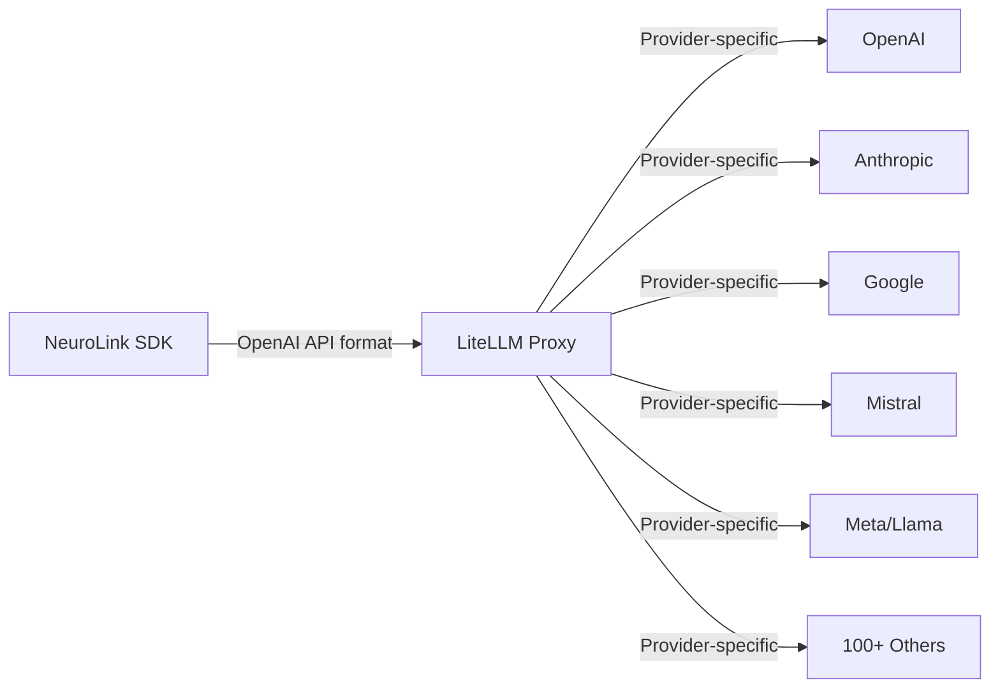
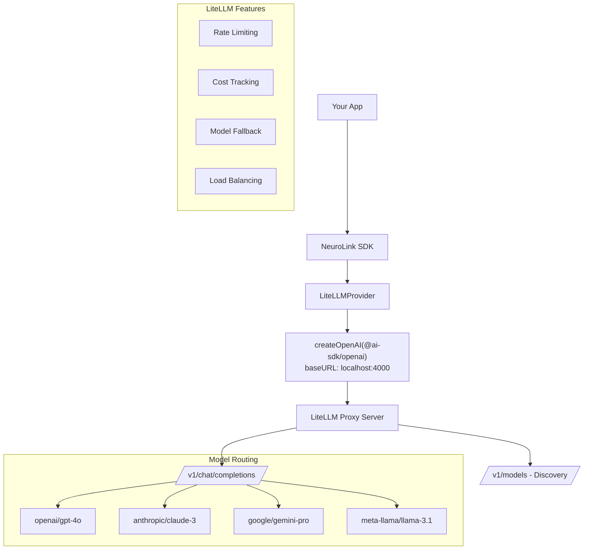

By the end of this guide, you'll have LiteLLM running as a proxy server and connected to NeuroLink, giving you access to 100+ AI models through a single endpoint with centralized cost tracking and rate limiting.

You will set up LiteLLM, configure NeuroLink's LiteLLM provider, and use dynamic model discovery, streaming with tools, and production deployment patterns. LiteLLM handles the routing and cost management; NeuroLink gives you the TypeScript SDK experience.

## How LiteLLM Works with NeuroLink

The key insight behind NeuroLink's LiteLLM integration is simple: LiteLLM acts as a proxy server that implements the OpenAI-compatible API. NeuroLink communicates with LiteLLM exactly like it communicates with OpenAI -- same request format, same response format -- but LiteLLM translates those requests into provider-specific calls behind the scenes.



Under the hood, the `LiteLLMProvider` uses `createOpenAI` from `@ai-sdk/openai` with a custom `baseURL` pointing to the LiteLLM proxy (typically `http://localhost:4000`). Models are referenced using LiteLLM's `provider/model` naming convention -- for example, `openai/gpt-4o-mini` or `anthropic/claude-3-sonnet-20240229`.

This architecture gives you several advantages:

- **Centralized API key management:** Store all provider keys in LiteLLM, not in your application
- **Cost tracking:** LiteLLM logs per-request costs across all providers
- **Rate limit handling:** LiteLLM manages rate limits at the proxy level
- **Model fallback:** Configure automatic fallback between models if one is unavailable
- **Load balancing:** Distribute requests across multiple model endpoints

## Quick Setup

Setting up LiteLLM with NeuroLink is a two-step process: start the LiteLLM proxy, then point NeuroLink at it.

### Step 1: Start the LiteLLM Proxy

```bash
pip install litellm

# Start with a default model
litellm --model openai/gpt-4o-mini --port 4000
```

This starts a local proxy server on port 4000 that routes requests to OpenAI's GPT-4o Mini. You can configure additional models through a YAML config file (covered in the production section below).

### Step 2: Configure NeuroLink

```bash
# .env
LITELLM_BASE_URL=http://localhost:4000  # default
LITELLM_API_KEY=sk-anything             # default passthrough key for local dev
LITELLM_MODEL=openai/gpt-4o-mini       # optional - sets default model
```

The default base URL is `http://localhost:4000` and the default API key is `sk-anything`, which is a passthrough key for local development. In production, you will configure real authentication.

### Step 3: Start Streaming

```typescript
import { NeuroLink } from '@juspay/neurolink';

const neurolink = new NeuroLink();

const result = await neurolink.stream({
  input: { text: "Compare supervised and unsupervised learning" },
  provider: "litellm",
});

for await (const chunk of result.stream) {
  if ("content" in chunk) process.stdout.write(chunk.content);
}
```

That is it. NeuroLink sends the request to LiteLLM, which routes it to the configured model (defaulting to `openai/gpt-4o-mini`).

> **Tip:** The default model is `openai/gpt-4o-mini`. You can override it per-request via the `model` parameter or globally via the `LITELLM_MODEL` environment variable.
{: .prompt-tip }

## Model Discovery

One of LiteLLM's most powerful features is dynamic model discovery, and NeuroLink takes full advantage of it. The `getAvailableModels()` method fetches the list of configured models from LiteLLM's `/v1/models` endpoint, complete with intelligent caching.

### How Discovery Works

The provider implements a 10-minute cache for model discovery results, avoiding repeated API calls. Model fetches have a 5-second timeout to prevent slow proxy responses from blocking your application.

```typescript
const provider = new LiteLLMProvider();
const models = await provider.getAvailableModels();
console.log(models);
// ["openai/gpt-4o", "anthropic/claude-3-sonnet", "google/gemini-pro", ...]
```

### Fallback Models

If the LiteLLM proxy is temporarily unavailable for model discovery, NeuroLink falls back to a sensible default list:

- `openai/gpt-4o`
- `anthropic/claude-3-haiku`
- `meta-llama/llama-3.1-8b-instruct`
- `google/gemini-2.5-flash`

You can customize the fallback list via the `LITELLM_FALLBACK_MODELS` environment variable (comma-separated):

```bash
LITELLM_FALLBACK_MODELS=openai/gpt-4o,anthropic/claude-3-sonnet,mistral/mistral-large
```

> **Note:** Model discovery is a convenience feature for development and debugging. In production, always set `LITELLM_MODEL` explicitly to skip the discovery step and reduce startup latency.
{: .prompt-info }

## Streaming with Tools

NeuroLink's LiteLLM provider supports full streaming with tool calling, structured output, and multi-step execution.

### Basic Tool Calling

```typescript
import { z } from "zod";
import { tool } from "ai";

const result = await neurolink.stream({
  input: { text: "Analyze this dataset for outliers" },
  provider: "litellm",
  model: "anthropic/claude-3-sonnet-20240229",
  tools: {
    analyze: tool({
      description: "Run statistical analysis on a dataset",
      parameters: z.object({
        type: z.string().describe("Type of analysis: mean, median, outliers"),
      }),
      execute: async ({ type }) => ({
        metric: type,
        value: 0.95,
        outliers: [42, 187, 3],
      }),
    }),
  },
});

for await (const chunk of result.stream) {
  if ("content" in chunk) process.stdout.write(chunk.content);
}
```

### Cross-Provider Model Switching

The real power of LiteLLM shines when you switch between models from different providers without changing anything except the model name:

```typescript
// Use Claude for analysis
const analysisResult = await neurolink.stream({
  input: { text: "Analyze this code for security vulnerabilities" },
  provider: "litellm",
  model: "anthropic/claude-3-sonnet-20240229",
});

// Use GPT-4o for summarization
const summaryResult = await neurolink.stream({
  input: { text: "Summarize the key findings" },
  provider: "litellm",
  model: "openai/gpt-4o",
});

// Use Gemini for creative writing
const creativeResult = await neurolink.stream({
  input: { text: "Write a blog post about these findings" },
  provider: "litellm",
  model: "google/gemini-pro",
});
```

All three requests go through the same LiteLLM proxy, using the same authentication and the same NeuroLink interface. The only thing that changes is the model identifier.

### Gemini 2.5 Compatibility

The LiteLLM provider includes special handling for Gemini 2.5 models: `maxTokens` is automatically skipped for these models to avoid compatibility issues. This is handled transparently -- you do not need to adjust your code.

### Structured Output

For tasks that need structured responses, the provider supports `analysisSchema` via `Output.object()`:

```typescript
const result = await neurolink.stream({
  input: { text: "Extract key metrics from this report" },
  provider: "litellm",
  model: "openai/gpt-4o",
  analysisSchema: z.object({
    revenue: z.number(),
    growth: z.number(),
    risks: z.array(z.string()),
  }),
});
```

## Error Handling

The LiteLLM provider implements comprehensive error classification that covers both standard API errors and LiteLLM-specific scenarios (like the proxy being offline).

### Error Categories

| Error Type | Detection Pattern | Meaning |
|---|---|---|
| Timeout | `TimeoutError` | Request exceeded time limit |
| Connection refused | `ECONNREFUSED` / `Failed to fetch` | LiteLLM proxy is not running |
| Auth error | `API_KEY_INVALID` | Invalid LiteLLM configuration |
| Rate limit | `rate limit` | Too many requests |
| Model not found | `model` + `not found` | Model not configured in LiteLLM |

### Practical Error Handling

```typescript
try {
  const result = await neurolink.stream({
    input: { text: "test" },
    provider: "litellm",
  });

  for await (const chunk of result.stream) {
    if ("content" in chunk) process.stdout.write(chunk.content);
  }
} catch (error) {
  if (error.message.includes("ECONNREFUSED")) {
    console.error("LiteLLM proxy is not running.");
    console.error("Start it with: litellm --model openai/gpt-4o-mini --port 4000");
  } else if (error.message.includes("model") && error.message.includes("not found")) {
    console.error("Model not configured in LiteLLM. Check your config.yaml.");
  } else if (error.message.includes("rate limit")) {
    console.error("Rate limited. Implement exponential backoff or adjust LiteLLM limits.");
  } else {
    console.error("LiteLLM error:", error.message);
  }
}
```

> **Warning:** The most common error when getting started is `ECONNREFUSED` -- it simply means the LiteLLM proxy is not running. Make sure to start it before making requests.
{: .prompt-warning }

## Model Naming Convention

LiteLLM uses a `provider/model` format for all model identifiers. This is different from NeuroLink's direct providers (where you just specify the model name) because LiteLLM needs to know which upstream provider to route each request to.

Here are the most common model identifiers:

| Model ID | Provider | Description |
|---|---|---|
| `openai/gpt-4o-mini` | OpenAI | GPT-4o Mini -- fast and affordable |
| `openai/gpt-4o` | OpenAI | GPT-4o -- flagship OpenAI model |
| `openai/gpt-3.5-turbo` | OpenAI | GPT-3.5 Turbo -- legacy fast model |
| `anthropic/claude-3-sonnet-20240229` | Anthropic | Claude 3 Sonnet |
| `google/gemini-pro` | Google | Gemini Pro |
| `meta-llama/llama-3.1-8b-instruct` | Meta | Llama 3.1 8B Instruct |
| `mistral/mistral-large-latest` | Mistral | Mistral Large |

The `provider/` prefix tells LiteLLM which provider SDK and API key to use. You can configure multiple models from the same provider or mix models across providers freely.

## Architecture

Here is the full architecture showing how NeuroLink, LiteLLM, and upstream providers connect:



The key takeaway from this architecture is that NeuroLink sees LiteLLM as just another OpenAI-compatible endpoint. All the multi-provider routing, cost tracking, and load balancing happens inside the LiteLLM proxy -- invisible to your application code.

## Production Configuration

For production deployments, you will want a more robust LiteLLM setup than the quick-start command.

### LiteLLM Config File

Create a `litellm_config.yaml` with your production model configuration:

```yaml
model_list:
  - model_name: gpt-4o
    litellm_params:
      model: openai/gpt-4o
      api_key: sk-your-openai-key

  - model_name: claude-3-sonnet
    litellm_params:
      model: anthropic/claude-3-sonnet-20240229
      api_key: sk-ant-your-anthropic-key

  - model_name: gemini-pro
    litellm_params:
      model: google/gemini-pro
      api_key: your-google-key

  # Load balancing: multiple deployments of the same model
  - model_name: gpt-4o
    litellm_params:
      model: openai/gpt-4o
      api_key: sk-your-second-openai-key

litellm_settings:
  drop_params: true
  set_verbose: false

general_settings:
  master_key: sk-your-production-master-key
```

Start the proxy with the config file:

```bash
litellm --config litellm_config.yaml --port 4000
```

### NeuroLink Production Environment

```bash
# Point to your production LiteLLM instance
LITELLM_BASE_URL=https://litellm.your-company.com
LITELLM_API_KEY=sk-your-production-master-key
LITELLM_MODEL=openai/gpt-4o

# Optional: custom fallback models
LITELLM_FALLBACK_MODELS=openai/gpt-4o,anthropic/claude-3-sonnet,google/gemini-pro
```

### Production Best Practices

1. **Always set `LITELLM_MODEL` explicitly** to skip auto-discovery overhead at startup
2. **Use LiteLLM's master key** for authentication rather than the default `sk-anything`
3. **Configure model fallback** in both LiteLLM (proxy-level) and NeuroLink (SDK-level) for defense in depth
4. **Monitor per-model costs** using LiteLLM's built-in cost tracking dashboard
5. **Set rate limits per model** in LiteLLM to prevent any single model from consuming your entire budget
6. **Deploy LiteLLM behind a load balancer** for high-availability production setups

> **Tip:** LiteLLM supports Docker deployment for production. Use `ghcr.io/berriai/litellm:main-latest` as the base image and mount your config file as a volume.
{: .prompt-tip }

## When to Use LiteLLM vs Direct Providers

LiteLLM adds a proxy layer between your application and AI providers. This is valuable when you need multi-provider routing, but it is not always necessary.

**Use LiteLLM when:**

- You need to route to multiple providers through a single endpoint
- You want centralized cost tracking and rate limiting
- You need model fallback at the infrastructure level
- Your team manages multiple AI provider accounts

**Use direct providers when:**

- You only use one or two providers
- You need the lowest possible latency (no proxy hop)
- You want the simplest possible deployment architecture
- Provider-specific features (like Gemini's image generation) are important

For many teams, the right approach is to start with direct providers and add LiteLLM when the complexity of managing multiple providers warrants it.

## What's Next

You now have LiteLLM routing 100+ models through NeuroLink. Your next step: configure 2-3 models in your LiteLLM config, set up cost tracking, and start routing requests. Then explore:

- **OpenAI-Compatible Endpoints:** For connecting to individual OpenAI-compatible endpoints without a proxy server
- **Provider Comparison Matrix:** To decide which models to configure in your LiteLLM instance
- **[Mistral AI Integration](/posts/mistral-ai-integration/):** For direct Mistral access when you want the lowest latency path

LiteLLM transforms NeuroLink from a multi-provider SDK into a true universal AI gateway, giving you access to virtually any model through a single, consistent interface.

---

**Related posts:**

- [Mistral AI Integration: Fast European AI with NeuroLink](/posts/mistral-ai-integration/)
- [Multi-Provider Failover: Never Lose an API Call](/posts/provider-failover-patterns/)
- [How to Switch AI Providers Without Rewriting Code](/posts/switch-ai-providers-without-rewriting/)
