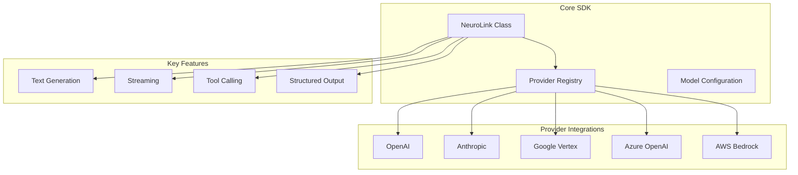
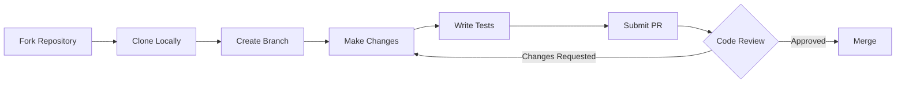

# Contributing to NeuroLink: A Complete Guide

Open source thrives on community contributions. Whether you are an experienced developer or just getting started, this guide will help you make meaningful contributions to NeuroLink. Every contribution matters, from fixing typos in documentation to implementing new features.

> **Note**: This guide outlines the NeuroLink contribution framework and best practices. Our community is actively growing! To see real community discussions and current contribution opportunities, check out:
> - **GitHub Issues**: [github.com/juspay/neurolink/issues](https://github.com/juspay/neurolink/issues) - Browse open issues and submit bug reports
> - **GitHub Discussions**: [github.com/juspay/neurolink/discussions](https://github.com/juspay/neurolink/discussions) - Ask questions, share ideas, and connect with other contributors
> - **Contributors List**: [github.com/juspay/neurolink/graphs/contributors](https://github.com/juspay/neurolink/graphs/contributors) - See who has already contributed

## Why Contribute to NeuroLink?

Contributing to open source projects provides numerous benefits:

- **Learn by doing**: Working on real-world code is one of the best ways to improve your skills
- **Build your portfolio**: Contributions to open source demonstrate your abilities to potential employers
- **Join a community**: Connect with other developers who share your interests
- **Shape the tools you use**: Help improve software that you and others rely on

NeuroLink is a unified AI SDK that simplifies working with multiple AI providers. By contributing, you help make AI development more accessible for everyone.

## Getting Started

### Setting Up Your Development Environment

Before making contributions, you will need to set up a local development environment.

```bash
# Clone the repository
git clone https://github.com/juspay/neurolink.git
cd neurolink

# Install dependencies (requires Node.js >=20.18.1)
pnpm install

# Build the project
pnpm build

# Run tests to verify setup
pnpm test
```

### Understanding the Codebase

The NeuroLink SDK follows a clear project structure:



Key directories to familiarize yourself with:

- `src/` - Core SDK source code
- `src/lib/providers/` - AI provider implementations
- `src/lib/types/` - TypeScript type definitions
- `test/` - Test suites
- `docs/` - Documentation

## Types of Contributions

### Code Contributions

Code contributions can range from bug fixes to new features. Here is the typical workflow:



**Steps to contribute code:**

1. **Fork the repository** on GitHub
2. **Clone your fork** to your local machine
3. **Create a feature branch** with a descriptive name
4. **Make your changes** following the code style guidelines
5. **Write tests** for your changes
6. **Submit a pull request** with a clear description

Example of a well-structured contribution adding a utility function:

```typescript
import { NeuroLink } from '@juspay/neurolink';

/**
 * Utility function to validate provider configuration
 * @param provider - The provider name to validate
 * @param config - Configuration object to check
 * @returns boolean indicating if configuration is valid
 */
export function validateProviderConfig(
  provider: string,
  config: Record<string, unknown>
): boolean {
  const requiredFields: Record<string, string[]> = {
    openai: ['apiKey'],
    anthropic: ['apiKey'],
    vertex: ['projectId', 'location'],
    azure: ['apiKey', 'resourceName', 'deploymentName'],
    bedrock: ['region']
  };

  const required = requiredFields[provider];
  if (!required) {
    return false;
  }

  return required.every(field => field in config && config[field] !== undefined);
}
```

### Documentation Contributions

Clear documentation is essential for any project. Documentation contributions are an excellent way to get started:

- **Fix typos and grammar** - Small fixes make a big difference
- **Improve examples** - Add or clarify code examples
- **Add tutorials** - Write guides for common use cases
- **Translate content** - Help make documentation accessible in more languages

### Bug Reports

Quality bug reports help maintainers identify and fix issues quickly. A good bug report includes:

1. **Description**: Clear summary of the issue
2. **Environment**: Node.js version, OS, SDK version
3. **Steps to reproduce**: Minimal code example that demonstrates the problem
4. **Expected behavior**: What should happen
5. **Actual behavior**: What actually happens
6. **Relevant logs**: Error messages or stack traces

Example bug report template:

```markdown
## Description
The `generate` method throws an error when using structured output with Anthropic provider.

## Environment
- Node.js: 20.10.0
- @juspay/neurolink: 1.2.0
- OS: macOS 14.0

## Steps to Reproduce
const neurolink = new NeuroLink();
const result = await neurolink.generate({
  provider: 'anthropic',
  model: 'claude-sonnet-4-5-20250929',
  input: { text: 'Return a JSON object with name and age' },
  responseFormat: { type: 'json_object' }
});

## Expected Behavior
Should return a valid JSON response.

## Actual Behavior
Throws: "Structured output not supported for this provider"

## Additional Context
This worked in version 1.1.0.
```

### Feature Requests

Have an idea for improving NeuroLink? Feature requests help shape the project roadmap. When proposing a feature:

- **Explain the use case**: Why is this feature needed?
- **Describe the solution**: What would the feature look like?
- **Consider alternatives**: Are there other ways to solve this?
- **Assess impact**: How many users would benefit?

## Building Plugins and Integrations

The NeuroLink SDK can be extended through custom tools and integrations. Here is how to create a custom tool:

```typescript
import { NeuroLink } from '@juspay/neurolink';

// Define a custom tool
const weatherTool = {
  name: 'get_weather',
  description: 'Get current weather for a location',
  parameters: {
    type: 'object' as const,
    properties: {
      location: {
        type: 'string',
        description: 'City name or coordinates'
      },
      units: {
        type: 'string',
        enum: ['celsius', 'fahrenheit'],
        description: 'Temperature units'
      }
    },
    required: ['location']
  }
};

// Use the tool with NeuroLink
const neurolink = new NeuroLink();

const response = await neurolink.generate({
  provider: 'openai',
  model: 'gpt-4o',
  input: {
    text: 'What is the weather in Tokyo?'
  },
  tools: [weatherTool]
});
```

### Integration Examples

You can build integrations that connect NeuroLink to external services. Here is an example integrating with GitHub for AI-powered code review:

```typescript
import { NeuroLink } from '@juspay/neurolink';
import { Octokit } from '@octokit/rest';

const neurolink = new NeuroLink();
const github = new Octokit({ auth: process.env.GITHUB_TOKEN });

async function reviewPullRequest(
  owner: string,
  repo: string,
  prNumber: number
): Promise<void> {
  // Fetch the PR diff
  const { data: pr } = await github.pulls.get({
    owner,
    repo,
    pull_number: prNumber,
    mediaType: { format: 'diff' }
  });

  // Get AI-powered code review
  const review = await neurolink.generate({
    provider: 'anthropic',
    model: 'claude-sonnet-4-5-20250929',
    input: {
      text: `Review this pull request diff and provide feedback on:
        1. Code quality
        2. Potential bugs
        3. Security concerns
        4. Suggestions for improvement

        Diff:
        ${pr}`
    }
  });

  // Post review comment
  await github.pulls.createReview({
    owner,
    repo,
    pull_number: prNumber,
    body: review.content,
    event: 'COMMENT'
  });
}
```

## Commit Message Format

All commits must follow the semantic commit format:

```
type(scope): description
```

**Types:**
- `feat`: New feature
- `fix`: Bug fix
- `docs`: Documentation changes
- `style`: Code style changes (formatting, semicolons, etc.)
- `refactor`: Code refactoring without feature changes
- `test`: Adding or updating tests
- `chore`: Maintenance tasks, dependency updates

**Examples:**
```bash
feat(providers): add support for Mistral AI
fix(streaming): resolve memory leak in long-running streams
docs(readme): update installation instructions
test(generate): add edge case tests for structured output
```

## Automated Validation

All contributions are automatically validated through our CI pipeline:

**ESLint**: Code is checked for style and potential issues
- Run locally with `pnpm lint`
- Fix auto-fixable issues with `pnpm lint:fix`

**Security Scanning**: Dependencies and code are scanned for vulnerabilities
- Automated security checks run on every PR
- High-severity issues will block merging

**Pre-commit Hooks**: Local validation before commits
- Runs linting and type checking automatically
- Ensures consistent code formatting
- Install hooks with `pnpm prepare`

Ensure all checks pass locally before submitting a pull request to speed up the review process.

## Code Style Guidelines

To maintain consistency across the codebase, follow these guidelines:

### TypeScript Best Practices

```typescript
// Use explicit types for function parameters and return values
function processResponse(
  response: GenerateResponse,
  options: ProcessOptions
): ProcessedResult {
  // Implementation
}

// Prefer const over let when values do not change
const config = {
  provider: 'openai',
  model: 'gpt-4o',
};

// Use descriptive variable names
const userMessage = 'Hello, how can you help me?';
const maxRetryAttempts = 3;

// Handle errors appropriately
try {
  const result = await neurolink.generate(options);
  return result;
} catch (error) {
  if (error instanceof RateLimitError) {
    // Handle rate limiting
    await delay(1000);
    return retry(options);
  }
  throw error;
}
```

### Writing Tests

Every code contribution should include tests:

```typescript
import { describe, it, expect } from 'vitest';
import { NeuroLink } from '@juspay/neurolink';

describe('NeuroLink.generate', () => {
  it('should generate text with valid input', async () => {
    const neurolink = new NeuroLink();

    const result = await neurolink.generate({
      provider: 'openai',
      model: 'gpt-4o-mini',
      input: { text: 'Say hello' }
    });

    expect(result).toBeDefined();
    expect(result.content).toBeTruthy();
  });

  it('should throw error for invalid provider', async () => {
    const neurolink = new NeuroLink();

    await expect(
      neurolink.generate({
        provider: 'invalid-provider',
        model: 'some-model',
        input: { text: 'Test' }
      })
    ).rejects.toThrow();
  });
});
```

## Pull Request Guidelines

When submitting a pull request:

1. **Write a clear title** that summarizes the change
2. **Include a description** explaining what and why
3. **Reference related issues** using GitHub keywords (e.g., "Fixes #123")
4. **Keep changes focused** - one feature or fix per PR
5. **Update documentation** if your change affects public APIs
6. **Ensure tests pass** before requesting review

### PR Description Template

```markdown
## Summary
Brief description of what this PR does.

## Changes
- Added new utility function for X
- Updated provider configuration handling
- Fixed edge case in streaming response

## Testing
- Added unit tests for new functionality
- Tested manually with OpenAI and Anthropic providers

## Related Issues
Fixes #123

## Checklist
- [ ] Tests added/updated
- [ ] Documentation updated
- [ ] Changelog entry added
```

## Getting Help

If you get stuck or have questions, the NeuroLink community is here to help:

- **GitHub Issues**: [Search existing issues](https://github.com/juspay/neurolink/issues) or [open a new one](https://github.com/juspay/neurolink/issues/new) for bugs and feature requests
- **GitHub Discussions**: [Join our discussions](https://github.com/juspay/neurolink/discussions) for general questions, ideas, and community conversation
- **Documentation**: Check the [official NeuroLink documentation](https://github.com/juspay/neurolink) for detailed API guidance

Our community is actively growing, and we welcome contributors at all levels. Don't hesitate to ask questions - we are here to help you succeed!

## Recognition

We value every contribution to NeuroLink. Contributors are recognized in several ways:

- **GitHub Contributors page**: All contributors are listed automatically
- **Release notes**: Significant contributions are highlighted in release notes
- **Community mentions**: Outstanding contributions may be featured in announcements

## Next Steps

Ready to contribute? Here is how to get started today:

1. **Browse open issues** labeled "good first issue" for beginner-friendly tasks
2. **Read the documentation** to understand the SDK better
3. **Join the community** to connect with other contributors
4. **Start small** - even fixing a typo is a valuable contribution

Every contribution, no matter how small, helps make NeuroLink better for everyone. We look forward to your contributions!

---

*Have questions about contributing? Open a GitHub Discussion or reach out through the issue tracker. We are here to help you succeed.*
