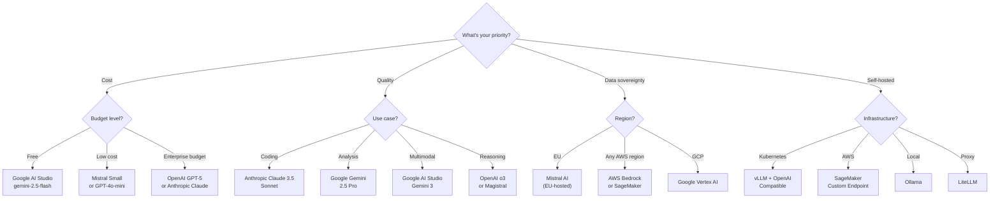
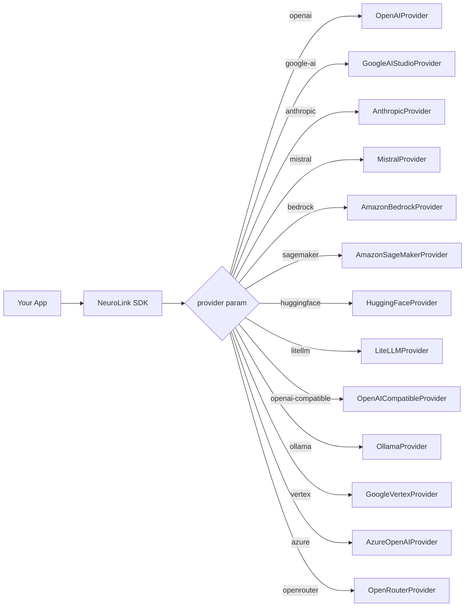

OpenAI, Anthropic, Google, Mistral, and 9 other providers all solve different problems. Here's an honest look at where each one excels, where it falls short, and which to pick for your use case.

NeuroLink supports 13 providers through a unified interface. This comparison covers capabilities, pricing, model quality, and concrete recommendations. No provider is best at everything -- the goal is to help you make an informed choice based on your specific requirements.

## Complete Provider Registry

NeuroLink ships with 13 provider implementations, each wrapping a different AI service through a consistent abstraction layer:

| Provider | Class | Enum Value | SDK Used |
|---|---|---|---|
| **OpenAI** | `OpenAIProvider` | `openai` | `@ai-sdk/openai` |
| **Google AI Studio** | `GoogleAIStudioProvider` | `google-ai` | `@ai-sdk/google` + `@google/genai` |
| **Anthropic** | `AnthropicProvider` | `anthropic` | `@ai-sdk/anthropic` |
| **Mistral** | `MistralProvider` | `mistral` | `@ai-sdk/mistral` |
| **AWS Bedrock** | `AmazonBedrockProvider` | `bedrock` | `@ai-sdk/amazon-bedrock` |
| **AWS SageMaker** | `AmazonSageMakerProvider` | `sagemaker` | Custom `LanguageModelV1` |
| **Google Vertex** | `GoogleVertexProvider` | `vertex` | `@ai-sdk/google-vertex` |
| **Azure OpenAI** | `AzureOpenAIProvider` | `azure` | `@ai-sdk/azure` |
| **Hugging Face** | `HuggingFaceProvider` | `huggingface` | `@ai-sdk/openai` (custom baseURL) |
| **Ollama** | `OllamaProvider` | `ollama` | `@ai-sdk/openai` (local) |
| **LiteLLM** | `LiteLLMProvider` | `litellm` | `@ai-sdk/openai` (proxy) |
| **OpenAI-Compatible** | `OpenAICompatibleProvider` | `openai-compatible` | `@ai-sdk/openai` (custom baseURL) |
| **OpenRouter** | `OpenRouterProvider` | `openrouter` | `@ai-sdk/openai` (OpenRouter API) |

Every provider extends `BaseProvider` and implements the same abstract methods: `executeStream()`, `getAISDKModel()`, `getDefaultModel()`, `getProviderName()`, and `handleProviderError()`. This means adding a new provider requires zero changes to existing code.

> **Note:** Several providers (Hugging Face, Ollama, LiteLLM, OpenAI-Compatible, OpenRouter) use `@ai-sdk/openai` under the hood with custom base URLs. This is because the OpenAI API format has become the de facto standard for LLM endpoints.
{: .prompt-info }

## Capability Comparison Matrix

Not all providers offer the same features. Here is a detailed comparison of capabilities across the major providers:

| Feature | OpenAI | Google AI | Anthropic | Mistral | Bedrock | SageMaker | Vertex | HuggingFace |
|---|---|---|---|---|---|---|---|---|
| **Streaming** | Yes | Yes | Yes | Yes | Yes | Phase 2 | Yes | Yes |
| **Tool Calling** | Yes (128 max) | Yes (native) | Yes | Yes | Yes | Yes | Yes | Model-dependent |
| **Image Generation** | No | Yes | No | No | No | No | No | No |
| **Audio** | No | Yes (Live) | No | Voxtral | No | No | No | No |
| **Embeddings** | Yes | Yes | No | Yes | Yes | No | Yes | No |
| **Thinking/Reasoning** | Yes (o-series) | Yes (levels) | Yes (budget) | No | Yes | No | Yes | No |
| **Proxy Support** | Yes | No | No | Yes | No | No | No | Yes |
| **Free Tier** | No | Yes | No | No | No | No | No | Yes |
| **EU Hosting** | No | No | No | Yes | EU regions | EU regions | EU regions | No |

Key observations:

- **Google AI Studio** is the most feature-rich provider, with image generation, real-time audio, embeddings, and thinking modes all available
- **Anthropic** and **Google** lead in reasoning capabilities with extended thinking and thinking levels
- **Mistral** is the only provider with dedicated EU hosting from a European company
- **Hugging Face** offers free-tier access to open-source models but tool calling depends on the specific model
- **AWS Bedrock** and **Google Vertex** offer enterprise features like IAM-based auth and regional deployment

## Model Quality Rankings

NeuroLink defines a set of `DEFAULT_MODEL_ALIASES` that map quality categories to specific models based on extensive benchmarking:

| Category | Recommended Model | Provider |
|---|---|---|
| **Best Coding** | Claude 3.5 Sonnet | Anthropic |
| **Best Analysis** | Gemini 2.5 Pro | Google AI |
| **Best Creative** | Claude 3.5 Sonnet | Anthropic |
| **Best Value** | Gemini 2.5 Flash | Google AI |
| **Latest OpenAI** | GPT-4o | OpenAI |
| **Fastest OpenAI** | GPT-4o Mini | OpenAI |
| **Latest Anthropic** | Claude 3.5 Sonnet | Anthropic |
| **Fastest Anthropic** | Claude 3.5 Haiku | Anthropic |
| **Latest Google** | Gemini 2.5 Pro | Google AI |
| **Fastest Google** | Gemini 2.5 Flash | Google AI |

These aliases are defined in `src/lib/types/providers.ts` and can be used programmatically to select the right model for each task without hardcoding model identifiers.

> **Tip:** Model rankings shift frequently. These recommendations reflect the state of the art at the time of writing. Always benchmark against your specific use cases before committing to a provider.
{: .prompt-tip }

## Decision Tree

Not sure where to start? This decision tree maps your priorities to the right provider:



The tree is intentionally simplified. Many real-world decisions involve multiple priorities -- for example, you might need EU compliance AND strong coding capability, which would lead you to Mistral's Codestral. Use the decision tree as a starting point, then refine with the detailed comparisons below.

## Provider Selection by Use Case

Here is a concrete recommendation for each common use case:

| Use Case | Recommended Provider | Model | Why |
|---|---|---|---|
| **Prototype / Free** | Google AI Studio | `gemini-2.5-flash` | Generous free tier, fast response times |
| **Production SaaS** | OpenAI | `gpt-4o` | Reliable, well-documented, broad adoption |
| **Code Generation** | Anthropic or Mistral | Claude 3.5 Sonnet or Codestral | Best-in-class code quality |
| **Data Analysis** | Google AI Studio | `gemini-2.5-pro` | Best analytical reasoning |
| **EU Compliance** | Mistral | `mistral-large-latest` | EU-hosted infrastructure |
| **Enterprise AWS** | AWS Bedrock | Claude on Bedrock | No API key management, IAM auth |
| **Custom Models** | SageMaker | Custom endpoint | Full infrastructure control |
| **Multi-Provider** | LiteLLM | Any | Unified routing to 100+ models |
| **Self-Hosted** | Ollama or OpenAI-Compatible | Local models | No cloud dependency |
| **Open Source** | Hugging Face | Llama 3.1 | Access to 100K+ models |
| **Image Generation** | Google AI Studio | Gemini 2.5 Flash Image | Built-in image generation |
| **Audio/Voice** | Google AI Studio | Gemini Live | Real-time audio streaming |

> **Note:** These recommendations are starting points. The best provider for your project depends on your specific requirements around latency, cost, compliance, and model capability. We strongly recommend benchmarking your top 2-3 options against your actual workload.
{: .prompt-info }

## How Provider Switching Works

One of NeuroLink's core design principles is that switching providers should never require code changes beyond the `provider` parameter. Here is the architecture that makes this possible:



All 13 providers extend `BaseProvider` and implement the same `stream()` and `generate()` interface. The `AIProviderFactory` instantiates the correct provider based on the `provider` parameter. Your application code stays the same regardless of which provider runs under the hood.

### Live Example: Same Code, Three Providers

```typescript
import { NeuroLink } from '@juspay/neurolink';

const neurolink = new NeuroLink();

// Same code, different providers -- works identically
const providers = ["openai", "google-ai", "mistral"];

for (const provider of providers) {
  const result = await neurolink.stream({
    input: { text: "Explain microservices architecture" },
    provider,
  });

  console.log(`\n--- ${provider} ---`);
  for await (const chunk of result.stream) {
    if ("content" in chunk) process.stdout.write(chunk.content);
  }
}
```

The only requirement for switching is that the corresponding environment variables are set (e.g., `OPENAI_API_KEY`, `GOOGLE_AI_API_KEY`, `MISTRAL_API_KEY`). No class imports, no SDK changes, no response format adapters needed.

## Error Handling Across Providers

NeuroLink normalizes error types across all providers into a consistent hierarchy:

| Error Type | Description | Common Trigger |
|---|---|---|
| `AuthenticationError` | Invalid API key or credentials | Wrong key, expired token, missing IAM role |
| `RateLimitError` | Too many requests | Exceeded provider rate limits |
| `InvalidModelError` | Model not found or not available | Typo in model name, model deprecated |
| `NetworkError` | Connection or timeout issues | Provider outage, network instability |
| `ProviderError` | Generic provider-side error | Varies by provider |

This means your error handling code works the same regardless of which provider threw the error. You never need to parse provider-specific error formats.

## Pricing Tier Overview

NeuroLink models pricing using the `ModelPricing` type which supports tiers (`free`, `basic`, `premium`, `enterprise`) and per-token pricing with `inputTokens` and `outputTokens`.

Here is a general pricing overview:

| Tier | Providers / Models | Approximate Cost |
|---|---|---|
| **Free** | Google AI Studio (generous free tier), Hugging Face (rate limited) | $0 |
| **Low Cost** | Gemini Flash, GPT-4o-mini, Mistral Small, Ollama (self-hosted) | $0.01 - $0.50 per 1M tokens |
| **Mid Range** | GPT-4o, Mistral Large, Claude 3.5 Sonnet | $2 - $15 per 1M tokens |
| **Premium** | GPT-5, Claude Opus, Gemini Pro | $15 - $75 per 1M tokens |
| **Enterprise** | Bedrock, SageMaker, Vertex AI | Pay-per-use + infrastructure costs |

> **Warning:** AI pricing changes frequently. Always check the provider's official pricing page before committing to a model for production use. The costs above are approximate guidelines, not guarantees.
{: .prompt-warning }

## Migration Guide: Switching Providers

Switching from one provider to another in NeuroLink requires exactly three steps:

1. **Change the `provider` parameter** in your `generate()` or `stream()` calls
2. **Set the new provider's environment variables** (API key, region, etc.)
3. **Optionally adjust the `model` parameter** (or let NeuroLink use the provider's default)

That is it. No code refactoring, no response format changes, no new imports.

```typescript
import { NeuroLink } from '@juspay/neurolink';

const neurolink = new NeuroLink();

// Before: using OpenAI
const resultBefore = await neurolink.generate({
  input: { text: "Analyze this contract" },
  provider: "openai",
  model: "gpt-4o",
});

// After: switched to Anthropic -- same code structure
const resultAfter = await neurolink.generate({
  input: { text: "Analyze this contract" },
  provider: "anthropic",
  model: "claude-3-5-sonnet-20241022",
});

// Both return the same EnhancedGenerateResult type
console.log(resultBefore.content);
console.log(resultAfter.content);
```

For teams managing multiple providers, consider using NeuroLink's `createBestAIProvider()` utility, which automatically detects available providers based on environment variables and selects the best option.

## What's Next

No provider wins on every axis. The right choice depends on your constraints -- latency budget, compliance region, cost ceiling, and whether you need tool calling or streaming.

For deeper evaluation of specific providers:

- [Mistral AI Integration](/posts/mistral-ai-integration/) for EU-hosted models
- [LiteLLM Unified Routing](/posts/litellm-unified-routing/) for multi-model access
- Hugging Face Integration for open-source models
- AWS SageMaker for custom model deployment
- OpenAI-Compatible Endpoints for any compatible API

For the architecture that makes switching painless, read How We Built NeuroLink's Provider Abstraction. For the cost analysis of building your own provider layer, see Build vs Buy: AI Abstraction.

The data in this matrix will shift as providers release new models and adjust pricing. The abstraction layer is what lets you respond to those shifts without rewriting your application.

---

**Related posts:**

- [How to Switch AI Providers Without Rewriting Code](/posts/switch-ai-providers-without-rewriting/)
- [The Multi-Model Future: Why No Single AI Provider Will Win](/posts/multi-model-future/)
- [Multi-Provider Failover: Never Lose an API Call](/posts/provider-failover-patterns/)
