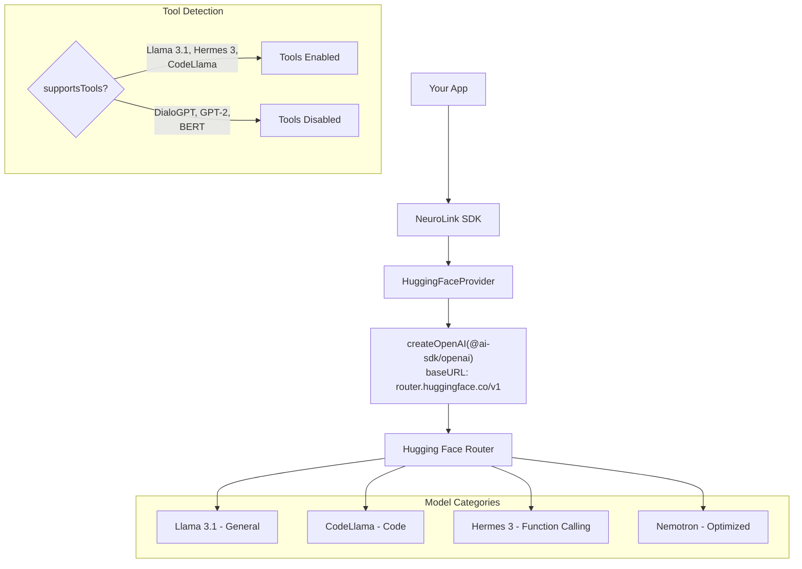

By the end of this guide, you'll have access to 100,000+ open-source models from Hugging Face through NeuroLink, with intelligent tool-calling detection and the same unified API you use with every other provider.

You will set up the Hugging Face provider, understand which models support tool calling, use open models for code generation and conversational AI, and leverage the model recommendations API. NeuroLink automatically detects whether a model supports tools, so you never get errors from trying to use tool calling with an incompatible model.

## How It Works

Under the hood, NeuroLink's Hugging Face integration uses the same pattern as several other providers: it creates an OpenAI-compatible client via `createOpenAI` from `@ai-sdk/openai`, but with a custom base URL pointing to Hugging Face's router.

The endpoint is `https://router.huggingface.co/v1`, which is Hugging Face's unified inference router. This router implements the OpenAI-compatible API specification, meaning NeuroLink communicates with it using the same request and response format as OpenAI -- chat completions, streaming, and tool calling all follow the same protocol.

Proxy support is included via `createProxyFetch()`, which is useful for corporate environments that require all outbound traffic to go through a proxy server.

This architecture means that any model available through the Hugging Face Inference API can be accessed through NeuroLink, provided it supports chat completion (which most instruction-tuned models do).

## Supported Models and Tool Calling Detection

### Default Model

The default model is `meta-llama/Llama-3.1-8B-Instruct`, a capable instruction-tuned model. You can override this via the `HUGGINGFACE_MODEL` environment variable.

> **Tip:** For high-quality reasoning tasks, consider upgrading to `meta-llama/Llama-3.1-70B-Instruct`. For lightweight, fast function calling, try `NousResearch/Hermes-3-Llama-3.2-3B`.
{: .prompt-tip }

### Intelligent Tool-Calling Detection

NeuroLink's `supportsTools()` method examines the model identifier against a curated list of model families known to support tool calling. This prevents the common pitfall of sending tool definitions to models that do not understand them.

**Tool-Capable Models (tools enabled automatically):**

| Model Pattern | Examples | Notes |
|---|---|---|
| `llama-3.1-*-instruct` | Llama-3.1-8B, 70B, 405B-Instruct | Full tool calling support |
| `llama-3.1-nemotron-ultra` | nvidia/Llama-3.1-Nemotron-Ultra-253B-v1 | NVIDIA-optimized variant |
| `hermes-3-llama-3.2` | NousResearch/Hermes-3-Llama-3.2-3B | Excellent function calling |
| `hermes-2-pro` | Hermes 2 Pro series | Earlier function calling models |
| `codellama-*-instruct` | CodeLlama-34b, 13b-Instruct | Code-focused with tool support |
| `mistral-7b-instruct-v0.3` | mistralai/Mistral-7B-Instruct-v0.3 | Mistral open-weight model |
| `mistral-8x7b-instruct` | Mixtral 8x7B | Mixture-of-experts with tools |
| `nous-hermes` | NousResearch series | Community function calling models |
| `openchat` | OpenChat models | Tool-capable chat models |
| `wizardcoder` | WizardCoder models | Code generation with tools |

**Non-Tool Models (tools disabled automatically):**

| Model Pattern | Reason |
|---|---|
| `microsoft/DialoGPT-*` | Conversational model, treats tools as text |
| `gpt2`, `bert`, `roberta` | Pre-2024 models without tool training |
| Most pre-2024 models | Lack structured function calling capability |

When tools are disabled for a model, NeuroLink gracefully degrades -- your tool definitions are simply not sent to the model, preventing confusing error responses. The model will still answer your question, just without tool use.

## Quick Setup

### Environment Variables

```bash
export HUGGINGFACE_API_KEY=hf_your_token_here

# Recommended: Set a capable default model
export HUGGINGFACE_MODEL=meta-llama/Llama-3.1-8B-Instruct
```

You can obtain a Hugging Face API token from [huggingface.co/settings/tokens](https://huggingface.co/settings/tokens). Free tier tokens work, though they have rate limits. Pro and Enterprise tiers offer higher throughput.

### Basic Streaming

```typescript
import { NeuroLink } from '@juspay/neurolink';

const neurolink = new NeuroLink();

const result = await neurolink.stream({
  input: { text: "Write a quicksort implementation in Python" },
  provider: "huggingface",
  model: "codellama/CodeLlama-34b-Instruct-hf",
});

for await (const chunk of result.stream) {
  if ("content" in chunk) process.stdout.write(chunk.content);
}
```

This streams a code generation request through CodeLlama 34B, one of the best open-source coding models available. Because NeuroLink detects that CodeLlama Instruct models support tool calling, you could also pass tools to this request if needed.

### Switching Models Per-Request

One of the advantages of Hugging Face is the sheer variety of models available. You can switch models per-request without any configuration changes:

```typescript
// General conversation with Llama 3.1
const chatResult = await neurolink.stream({
  input: { text: "Explain quantum entanglement in simple terms" },
  provider: "huggingface",
  model: "meta-llama/Llama-3.1-70B-Instruct",
});

// Code generation with CodeLlama
const codeResult = await neurolink.stream({
  input: { text: "Write a REST API with Express.js" },
  provider: "huggingface",
  model: "codellama/CodeLlama-34b-Instruct-hf",
});

// Function calling with Hermes 3
const toolResult = await neurolink.stream({
  input: { text: "What time is it in London?" },
  provider: "huggingface",
  model: "NousResearch/Hermes-3-Llama-3.2-3B",
  tools: { /* ... */ },
});
```

## Tool Calling with Open Models

NeuroLink enhances tool calling for Hugging Face models through several mechanisms:

### Enhanced System Prompts

When tools are enabled, NeuroLink injects enhanced system prompt instructions via `enhanceSystemPromptForTools()`. This adds explicit guidance to the model about how to format tool calls, improving reliability with models that support tools but may not always use them optimally.

### Tool Formatting

The `formatToolsForHuggingFace()` method passes tool definitions through for the OpenAI-compatible endpoint. Since Hugging Face's router implements the OpenAI tool calling specification, standard Zod-based tool definitions work without modification.

### Conditional Tool Enablement

The `prepareStreamOptions()` method checks `supportsTools()` before including tools in the request. For non-capable models, tools are disabled entirely -- preventing confusing error responses and ensuring the model still generates useful text output.

### Complete Tool Calling Example

```typescript
import { z } from "zod";
import { tool } from "ai";
import { NeuroLink } from '@juspay/neurolink';

const neurolink = new NeuroLink();

const result = await neurolink.stream({
  input: { text: "What's the weather in Berlin?" },
  provider: "huggingface",
  model: "meta-llama/Llama-3.1-70B-Instruct",
  tools: {
    getWeather: tool({
      description: "Get the current weather for a city",
      parameters: z.object({
        city: z.string().describe("The city name"),
      }),
      execute: async ({ city }) => ({
        temperature: 18,
        conditions: "Partly cloudy",
        city,
      }),
    }),
  },
});

for await (const chunk of result.stream) {
  if ("content" in chunk) process.stdout.write(chunk.content);
}
```

Llama 3.1 Instruct models have strong native tool calling support, making them an excellent choice for function-calling workloads on open-source models.

> **Note:** Tool calling quality varies by model. Llama 3.1 70B Instruct and Hermes 3 are the most reliable options. For critical tool-calling workflows, test thoroughly with your specific tools and schemas before deploying to production.
{: .prompt-info }

## Model Recommendations API

NeuroLink provides a static method `getToolCallingRecommendations()` on the `HuggingFaceProvider` class that returns performance ratings for recommended models:

```typescript
const recs = HuggingFaceProvider.getToolCallingRecommendations();
console.log(recs.recommended);
// ["meta-llama/Llama-3.1-8B-Instruct", "meta-llama/Llama-3.1-70B-Instruct", ...]
```

Here are the detailed ratings (1-3 scale, 3 = best):

| Model | Speed | Quality | Cost | Recommended For |
|---|---|---|---|---|
| `meta-llama/Llama-3.1-8B-Instruct` | 3 | 2 | 3 | Best overall balance |
| `meta-llama/Llama-3.1-70B-Instruct` | 2 | 3 | 2 | Highest quality, slower |
| `nvidia/Llama-3.1-Nemotron-Ultra-253B-v1` | 2 | 3 | 1 | Maximum capability, resource-heavy |
| `NousResearch/Hermes-3-Llama-3.2-3B` | 3 | 2 | 3 | Lightweight, fast function calling |
| `codellama/CodeLlama-34b-Instruct-hf` | 2 | 3 | 2 | Best for code generation |

For most applications, **Llama 3.1 8B Instruct** is the recommended starting point. It offers the best balance of speed, quality, and cost. Scale up to the 70B variant when quality demands increase, or drop down to Hermes 3 (3B) when speed and cost are the top priorities.

## Error Handling

The Hugging Face provider implements enhanced error handling through `handleProviderError()`, including tool-calling-specific error guidance:

| Error Pattern | Classification | Guidance |
|---|---|---|
| `API_TOKEN_INVALID` / `Invalid token` | Authentication error | Check `HUGGINGFACE_API_KEY` |
| `rate limit` | Rate limit error | Consider upgrading to Pro/Enterprise |
| `model` + `not found` | Model not found | Suggests tool-capable model alternatives |
| `function` / `tool` errors | Tool compatibility error | Suggests compatible models and schema checks |
| Other errors | Generic provider error | Includes full error message |

```typescript
try {
  const result = await neurolink.stream({
    input: { text: "test" },
    provider: "huggingface",
  });

  for await (const chunk of result.stream) {
    if ("content" in chunk) process.stdout.write(chunk.content);
  }
} catch (error) {
  if (error.message.includes("Invalid token")) {
    console.error("Check your HUGGINGFACE_API_KEY environment variable");
  } else if (error.message.includes("rate limit")) {
    console.error("Rate limited. Consider Hugging Face Pro for higher limits.");
  } else if (error.message.includes("tool")) {
    console.error("Tool calling error. Try a tool-capable model like Llama 3.1 Instruct.");
  } else {
    console.error("Hugging Face error:", error.message);
  }
}
```

> **Warning:** Free-tier Hugging Face tokens have strict rate limits. If you are building a production application, upgrade to the Pro or Enterprise tier for reliable throughput.
{: .prompt-warning }

## Architecture

Here is the complete architecture of NeuroLink's Hugging Face integration:



The flow is: your app talks to NeuroLink, which delegates to `HuggingFaceProvider`. The provider creates an OpenAI-compatible client pointing at Hugging Face's router endpoint. Before sending the request, it checks whether the selected model supports tool calling and adjusts the request accordingly. The response streams back through the same unified interface used by every NeuroLink provider.

## Choosing the Right Open Model

With 100,000+ models available, choosing the right one can be overwhelming. Here is a practical guide:

### By Use Case

| Use Case | Model | Why |
|---|---|---|
| **General chat** | `meta-llama/Llama-3.1-8B-Instruct` | Fast, versatile, tool-capable |
| **High-quality reasoning** | `meta-llama/Llama-3.1-70B-Instruct` | Best open-source reasoning |
| **Code generation** | `codellama/CodeLlama-34b-Instruct-hf` | Purpose-built for code |
| **Function calling** | `NousResearch/Hermes-3-Llama-3.2-3B` | Lightweight, excellent tool use |
| **Multilingual** | `mistralai/Mistral-7B-Instruct-v0.3` | Strong European language support |

### Hugging Face vs Direct Provider

When should you use Hugging Face versus accessing a model's provider directly?

**Use Hugging Face when:**

- You want to experiment with many different open-source models
- You need access to models not available through other providers (Hermes, CodeLlama, etc.)
- You want free-tier access for prototyping
- You are evaluating models before deploying them on your own infrastructure

**Use a direct provider when:**

- You need the lowest latency (direct APIs skip the HF router)
- You need guaranteed SLAs and support
- You are in production with high throughput requirements
- The model is available natively (e.g., use [Mistral directly](/posts/mistral-ai-integration/) for Mistral models)

## What's Next

You now have Hugging Face working through NeuroLink's unified interface. From here:

- **AWS SageMaker:** Deploy your favorite Hugging Face models to your own AWS infrastructure for full control
- **[Mistral AI Integration](/posts/mistral-ai-integration/):** Access Mistral models directly for lower latency in production
- **[Provider Comparison Matrix](/posts/provider-comparison-matrix/):** Compare Hugging Face against commercial providers for your use case

The open-source ecosystem on Hugging Face evolves rapidly. NeuroLink gives you a stable, type-safe bridge to that innovation -- experiment freely, then deploy the best model through whichever provider fits your production needs.

---

**Related posts:**

- [Running Local LLMs with NeuroLink and Ollama](/posts/ollama-local-llm-guide/)
- [Provider Comparison Matrix: Choosing the Right AI Provider](/posts/provider-comparison-matrix/)
- [The Hidden Cost of AI Vendor Lock-In](/posts/hidden-cost-vendor-lock-in/)
