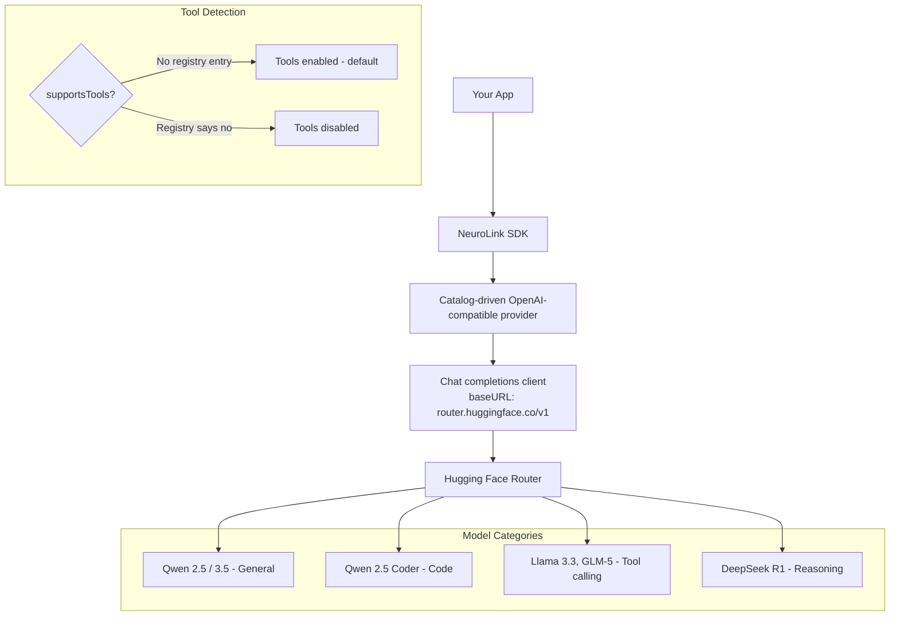

By the end of this guide, you'll have access to 100,000+ open-source models from Hugging Face through NeuroLink, with intelligent tool-calling detection and the same unified API you use with every other provider.

You will set up the Hugging Face provider, understand which models support tool calling, use open models for code generation and conversational AI, and know which models NeuroLink recommends for tool calling. NeuroLink checks tool-calling support before including your tool definitions in a request; when a model does not support tools, you get a clear provider error rather than a confusing failure -- see **Tool-Calling Support Is Model-Dependent** below for how the check works and its limits.

## How It Works

Under the hood, NeuroLink's Hugging Face integration uses the same pattern as several other open-model providers: a generic OpenAI-compatible chat-completions client, configured entirely from a catalog entry (base URL, auth, model defaults, error rules) rather than a hand-written Hugging-Face-specific class.

The endpoint is `https://router.huggingface.co/v1`, which is Hugging Face's unified inference router. This router implements the OpenAI-compatible API specification, meaning NeuroLink communicates with it using the same request and response format as OpenAI -- chat completions, streaming, and tool calling all follow the same protocol.

Proxy support is included via a shared proxy-fetch utility used across NeuroLink's providers, which is useful for corporate environments that require all outbound traffic to go through a proxy server.

This architecture means that any model available through the Hugging Face Inference API can be accessed through NeuroLink, provided it supports chat completion (which most instruction-tuned models do) -- though Hugging Face's own hosted-model roster changes over time, so a given model ID can stop resolving without any change on NeuroLink's side.

## Supported Models and Tool Calling Detection

### Default Model

The default model is `Qwen/Qwen2.5-72B-Instruct`, a strong general-purpose instruction-tuned model. You can override this via the `HUGGINGFACE_MODEL` environment variable.

> **Tip:** For high-quality reasoning tasks, consider `deepseek-ai/DeepSeek-R1`. For a lighter, faster option, `meta-llama/Llama-3.1-8B-Instruct` is NeuroLink's built-in fallback model and remains tool-calling capable.
{: .prompt-tip }

### Tool-Calling Support Is Model-Dependent

NeuroLink checks whether the selected model supports function calling before deciding whether to send your tool definitions along with a request. For most providers this comes from a central model-capability registry that flags specific models as tool-incapable; for a catalog-driven, "it depends on the model" provider like Hugging Face, NeuroLink does not maintain a curated per-model allow-list. When a model has no explicit capability entry, tool support defaults to enabled.

In practice, that means NeuroLink will attempt to send tool definitions to whatever Hugging Face model you select, including small or non-chat models. If the underlying model or Hugging Face's router rejects the request because the model does not actually understand tool calling, you get a provider-level error (see **Error Handling** below) rather than NeuroLink silently disabling tools for you.

The practical takeaway: pick a model you know is tool-capable when tool calling matters. NeuroLink's own error guidance points you toward models it recommends for tool calling -- `meta-llama/Llama-3.3-70B-Instruct`, `zai-org/GLM-5`, and `Qwen/Qwen3.5-397B-A17B` -- when a tool-calling request fails.

## Quick Setup

### Environment Variables

```bash
export HUGGINGFACE_API_KEY=hf_your_token_here

# Optional: override the built-in default (Qwen/Qwen2.5-72B-Instruct) with a
# smaller, faster model
export HUGGINGFACE_MODEL=meta-llama/Llama-3.1-8B-Instruct
```

You can obtain a Hugging Face API token from [huggingface.co/settings/tokens](https://huggingface.co/settings/tokens). Free tier tokens work, though they have rate limits. Pro and Enterprise tiers offer higher throughput.

### Basic Streaming

```typescript
import { NeuroLink } from '@juspay/neurolink';

const neurolink = new NeuroLink();

const result = await neurolink.stream({
  input: { text: "Write a quicksort implementation in Python" },
  provider: "huggingface",
  model: "Qwen/Qwen2.5-Coder-32B-Instruct",
});

for await (const chunk of result.stream) {
  if ("content" in chunk) process.stdout.write(chunk.content);
}
```

This streams a code generation request through Qwen2.5 Coder, a model purpose-built for code generation. You could also pass tools to this request -- see **Tool-Calling Support Is Model-Dependent** above for how NeuroLink decides whether to include them.

### Switching Models Per-Request

One of the advantages of Hugging Face is the sheer variety of models available. You can switch models per-request without any configuration changes:

```typescript
// General conversation with Llama 3.3
const chatResult = await neurolink.stream({
  input: { text: "Explain quantum entanglement in simple terms" },
  provider: "huggingface",
  model: "meta-llama/Llama-3.3-70B-Instruct",
});

// Code generation with Qwen2.5 Coder
const codeResult = await neurolink.stream({
  input: { text: "Write a REST API with Express.js" },
  provider: "huggingface",
  model: "Qwen/Qwen2.5-Coder-32B-Instruct",
});

// Function calling with GLM-5
const toolResult = await neurolink.stream({
  input: { text: "What time is it in London?" },
  provider: "huggingface",
  model: "zai-org/GLM-5",
  tools: { /* ... */ },
});
```

## Tool Calling with Open Models

NeuroLink handles tool calling for Hugging Face the same way it does for every OpenAI-compatible provider -- there is no Hugging-Face-specific prompt-injection or tool-formatting layer:

### Standard Tool Formatting

Since Hugging Face's router implements the OpenAI tool-calling specification, your Zod-based tool definitions pass through unmodified, the same way they would for OpenAI itself.

### Conditional Tool Enablement

Before a request goes out, NeuroLink's shared OpenAI-compatible provider client calls `supportsTools()` to decide whether to attach your tool definitions. As covered above, this check defaults to "supported" for Hugging Face models unless the model registry explicitly says otherwise, so plan for it to include your tools by default rather than assume it will filter out incompatible models for you.

### Complete Tool Calling Example

```typescript
import { z } from "zod";
import { tool } from "ai";
import { NeuroLink } from '@juspay/neurolink';

const neurolink = new NeuroLink();

const result = await neurolink.stream({
  input: { text: "What's the weather in Berlin?" },
  provider: "huggingface",
  model: "meta-llama/Llama-3.3-70B-Instruct",
  tools: {
    getWeather: tool({
      description: "Get the current weather for a city",
      parameters: z.object({
        city: z.string().describe("The city name"),
      }),
      execute: async ({ city }) => ({
        temperature: 18,
        conditions: "Partly cloudy",
        city,
      }),
    }),
  },
});

for await (const chunk of result.stream) {
  if ("content" in chunk) process.stdout.write(chunk.content);
}
```

Llama 3.3 70B Instruct has strong native tool-calling support, making it an excellent choice for function-calling workloads on open-source models.

> **Note:** Tool calling quality varies by model. `meta-llama/Llama-3.3-70B-Instruct`, `zai-org/GLM-5`, and `Qwen/Qwen3.5-397B-A17B` are NeuroLink's built-in recommendations for tool-calling workloads. For critical tool-calling workflows, test thoroughly with your specific tools and schemas before deploying to production.
{: .prompt-info }

## Choosing a Tool-Calling Model

There is no separate recommendations API -- NeuroLink surfaces its tool-calling model suggestions directly in error messages when a request fails (see **Error Handling** below). Based on Hugging Face's current router roster, these are worth defaulting to for tool-calling workloads:

| Model | Notes |
|---|---|
| `meta-llama/Llama-3.3-70B-Instruct` | Latest Llama on the router; strong general tool-calling support |
| `zai-org/GLM-5` | Actively maintained, recommended for tool calling |
| `Qwen/Qwen3.5-397B-A17B` | Large multimodal model, recommended for tool calling |

For most applications, **Llama 3.3 70B Instruct** is a reasonable starting point. For lighter, cheaper requests where tool calling is not required, NeuroLink's own fallback model, `meta-llama/Llama-3.1-8B-Instruct`, remains tool-calling capable and is considerably cheaper to run.

## Error Handling

Hugging Face requests go through NeuroLink's shared `handleProviderError()` mechanism -- the same one every catalog-driven provider uses -- configured with Hugging-Face-specific error rules that add tool-calling guidance:

| Error Pattern | Classification | Guidance |
|---|---|---|
| `API_TOKEN_INVALID` / `Invalid token` | Authentication error | Check `HUGGINGFACE_API_KEY` |
| `rate limit` | Rate limit error | Consider upgrading to Pro/Enterprise |
| `model` + `not found` | Model not found | Suggests tool-capable model alternatives |
| `function` / `tool` errors | Tool compatibility error | Suggests compatible models and schema checks |
| Other errors | Generic provider error | Includes full error message |

```typescript
try {
  const result = await neurolink.stream({
    input: { text: "test" },
    provider: "huggingface",
  });

  for await (const chunk of result.stream) {
    if ("content" in chunk) process.stdout.write(chunk.content);
  }
} catch (error) {
  if (error.message.includes("Invalid token")) {
    console.error("Check your HUGGINGFACE_API_KEY environment variable");
  } else if (error.message.includes("rate limit")) {
    console.error("Rate limited. Consider Hugging Face Pro for higher limits.");
  } else if (error.message.includes("tool")) {
    console.error("Tool calling error. Try a tool-capable model like Llama 3.1 Instruct.");
  } else {
    console.error("Hugging Face error:", error.message);
  }
}
```

> **Warning:** Free-tier Hugging Face tokens have strict rate limits. If you are building a production application, upgrade to the Pro or Enterprise tier for reliable throughput.
{: .prompt-warning }

## Architecture

Here is the complete architecture of NeuroLink's Hugging Face integration:


```mermaid
flowchart TB
    A[Your App] --> B[NeuroLink SDK]
    B --> C["Catalog-driven OpenAI-compatible provider"]
    C --> D["Chat completions client<br/>baseURL: router.huggingface.co/v1"]
    D --> E[Hugging Face Router]

    subgraph "Tool Detection"
        F{supportsTools?}
        F -->|No registry entry| G["Tools enabled - default"]
        F -->|Registry says no| H[Tools disabled]
    end

    subgraph "Model Categories"
        I["Qwen 2.5 / 3.5 - General"]
        J["Qwen 2.5 Coder - Code"]
        K["Llama 3.3, GLM-5 - Tool calling"]
        L["DeepSeek R1 - Reasoning"]
    end

    E --> I
    E --> J
    E --> K
    E --> L
```

The flow is: your app talks to NeuroLink, which resolves Hugging Face's catalog entry and configures a generic OpenAI-compatible chat-completions client pointed at Hugging Face's router endpoint. Before sending the request, NeuroLink checks the model-capability registry for a tool-calling override (Hugging Face models default to enabled, as covered above) and adjusts the request accordingly. The response streams back through the same unified interface used by every NeuroLink provider.

## Choosing the Right Open Model

With 100,000+ models available, choosing the right one can be overwhelming. Here is a practical guide:

### By Use Case

| Use Case | Model | Why |
|---|---|---|
| **General chat** | `meta-llama/Llama-3.1-8B-Instruct` | Fast, versatile, tool-capable |
| **High-quality reasoning** | `deepseek-ai/DeepSeek-R1` | Advanced reasoning model |
| **Code generation** | `Qwen/Qwen2.5-Coder-32B-Instruct` | Purpose-built for code |
| **Function calling** | `zai-org/GLM-5` | Actively maintained, recommended for tool calling |
| **Multilingual / broad language support** | `google/gemma-3-27b-it` | Wide language coverage |

### Hugging Face vs Direct Provider

When should you use Hugging Face versus accessing a model's provider directly?

**Use Hugging Face when:**

- You want to experiment with many different open-source models
- You need access to models not available through other providers (DeepSeek, GLM, Gemma, etc.)
- You want free-tier access for prototyping
- You are evaluating models before deploying them on your own infrastructure

**Use a direct provider when:**

- You need the lowest latency (direct APIs skip the HF router)
- You need guaranteed SLAs and support
- You are in production with high throughput requirements
- The model is available natively (e.g., use [Mistral directly](/posts/mistral-ai-integration/) for Mistral models)

## What's Next

You now have Hugging Face working through NeuroLink's unified interface. From here:

- **AWS SageMaker:** Deploy your favorite Hugging Face models to your own AWS infrastructure for full control
- **[Mistral AI Integration](/posts/mistral-ai-integration/):** Access Mistral models directly for lower latency in production
- **[Provider Comparison Matrix](/posts/provider-comparison-matrix/):** Compare Hugging Face against commercial providers for your use case

The open-source ecosystem on Hugging Face evolves rapidly. NeuroLink gives you a stable, type-safe bridge to that innovation -- experiment freely, then deploy the best model through whichever provider fits your production needs.

---

**Related posts:**

- [Running Local LLMs with NeuroLink and Ollama](/posts/ollama-local-llm-guide/)
- [Provider Comparison Matrix: Choosing the Right AI Provider](/posts/provider-comparison-matrix/)
- [The Hidden Cost of AI Vendor Lock-In](/posts/hidden-cost-vendor-lock-in/)
