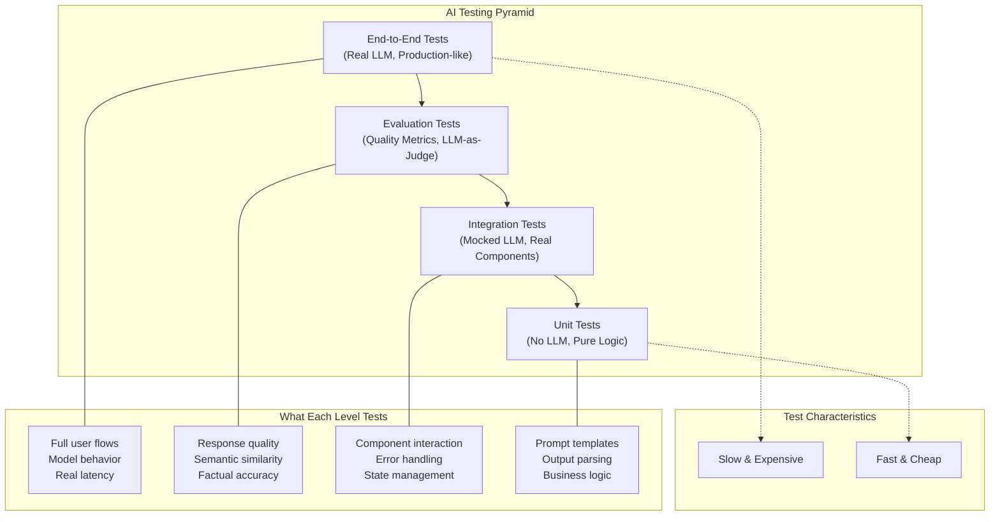

By the end of this guide, you'll have a complete testing strategy for AI applications -- unit tests, integration tests, mocking, evaluation metrics, and CI/CD patterns that handle non-deterministic LLM outputs.

## Why Testing AI Applications Is Different

Traditional software testing relies on a fundamental assumption: given the same input, you expect the same output. AI applications, particularly those built on large language models (LLMs), don't follow this rule. The same prompt might yield slightly different responses each time. This non-determinism requires a paradigm shift in how we approach testing.

Beyond non-determinism, AI applications present additional challenges:

- **Latency variability**: API calls to LLM providers can take anywhere from hundreds of milliseconds to several seconds
- **Cost implications**: Every test run that calls a real LLM costs money
- **Rate limiting**: Providers impose limits that can throttle your test suite
- **Model updates**: Provider model updates can change behavior without warning
- **Context sensitivity**: Small changes in prompts can produce dramatically different outputs

## The Testing Pyramid for AI Applications

The traditional testing pyramid still applies to AI applications, but with important adaptations.



## Setting Up Your Test Environment

Before writing tests, let's set up a proper testing environment for a NeuroLink application.

### Install Testing Dependencies

```bash
npm install --save-dev vitest @vitest/coverage-v8
npm install --save-dev jest @types/jest ts-jest
```

### Configure Vitest

```typescript
// vitest.config.ts
import { defineConfig } from 'vitest/config';

export default defineConfig({
  test: {
    globals: true,
    environment: 'node',
    coverage: {
      provider: 'v8',
      reporter: ['text', 'html'],
    },
    testTimeout: 30000, // LLM calls can be slow
  },
});
```

## Unit Tests: The Foundation

Unit tests for AI applications focus on testing individual components in isolation. This includes prompt construction, input validation, output parsing, and business logic.

### Testing Prompt Templates

```typescript
// src/prompts.ts
export function buildSummaryPrompt(content: string, maxWords: number = 100): string {
  return `Summarize the following content in ${maxWords} words or less.
Be concise and capture the key points.

Content:
${content}

Summary:`;
}

export function buildChatPrompt(
  systemPrompt: string,
  userMessage: string,
  history: Array<{ role: string; content: string }>
): string {
  const historyText = history
    .map((msg) => `${msg.role}: ${msg.content}`)
    .join('\n');

  return `${systemPrompt}

Previous conversation:
${historyText}

User: ${userMessage}
Assistant:`;
}
```

```typescript
// src/prompts.test.ts
import { describe, it, expect } from 'vitest';
import { buildSummaryPrompt, buildChatPrompt } from './prompts';

describe('buildSummaryPrompt', () => {
  it('should include the content in the prompt', () => {
    const content = 'This is the article content.';
    const prompt = buildSummaryPrompt(content, 100);

    expect(prompt).toContain(content);
    expect(prompt).toContain('100 words');
    expect(prompt.toLowerCase()).toContain('summarize');
  });

  it('should handle special characters in content', () => {
    const content = "Article with 'quotes' and \"double quotes\"";
    const prompt = buildSummaryPrompt(content);

    expect(prompt).toContain(content); // Should not escape or mangle content
  });

  it('should use default max words when not specified', () => {
    const prompt = buildSummaryPrompt('Some content');
    expect(prompt).toContain('100 words');
  });
});

describe('buildChatPrompt', () => {
  it('should include system prompt and user message', () => {
    const prompt = buildChatPrompt(
      'You are a helpful assistant.',
      'Hello!',
      []
    );

    expect(prompt).toContain('You are a helpful assistant.');
    expect(prompt).toContain('User: Hello!');
  });

  it('should include conversation history', () => {
    const history = [
      { role: 'User', content: 'Hi' },
      { role: 'Assistant', content: 'Hello!' },
    ];

    const prompt = buildChatPrompt('System prompt', 'How are you?', history);

    expect(prompt).toContain('User: Hi');
    expect(prompt).toContain('Assistant: Hello!');
    expect(prompt).toContain('User: How are you?');
  });
});
```

### Testing Output Parsers

```typescript
// src/parsers.ts
export interface ParsedResponse {
  answer: string;
  confidence: number;
  sources: string[];
}

export function parseStructuredResponse(llmOutput: string): ParsedResponse {
  const lines = llmOutput.trim().split('\n');
  const result: ParsedResponse = {
    answer: '',
    confidence: 0,
    sources: [],
  };

  for (const line of lines) {
    if (line.startsWith('ANSWER:')) {
      result.answer = line.replace('ANSWER:', '').trim();
    } else if (line.startsWith('CONFIDENCE:')) {
      const value = parseFloat(line.replace('CONFIDENCE:', '').trim());
      result.confidence = isNaN(value) ? 0 : Math.min(1, Math.max(0, value));
    } else if (line.startsWith('SOURCES:')) {
      result.sources = line
        .replace('SOURCES:', '')
        .split(',')
        .map((s) => s.trim())
        .filter(Boolean);
    }
  }

  return result;
}
```

```typescript
// src/parsers.test.ts
import { describe, it, expect } from 'vitest';
import { parseStructuredResponse } from './parsers';

describe('parseStructuredResponse', () => {
  it('should parse a complete response', () => {
    const output = `ANSWER: The capital of France is Paris.
CONFIDENCE: 0.95
SOURCES: wikipedia.org, britannica.com`;

    const result = parseStructuredResponse(output);

    expect(result.answer).toBe('The capital of France is Paris.');
    expect(result.confidence).toBe(0.95);
    expect(result.sources).toEqual(['wikipedia.org', 'britannica.com']);
  });

  it('should handle missing fields gracefully', () => {
    const output = 'ANSWER: Just an answer';

    const result = parseStructuredResponse(output);

    expect(result.answer).toBe('Just an answer');
    expect(result.confidence).toBe(0);
    expect(result.sources).toEqual([]);
  });

  it('should clamp confidence to valid range', () => {
    const highConfidence = parseStructuredResponse('CONFIDENCE: 1.5');
    expect(highConfidence.confidence).toBe(1);

    const negativeConfidence = parseStructuredResponse('CONFIDENCE: -0.5');
    expect(negativeConfidence.confidence).toBe(0);
  });
});
```

## The AIProvider Interface: Dependency Injection for Testability

The key to testing NeuroLink applications is using dependency injection. Define an interface that abstracts the AI provider, making it easy to swap real implementations with mocks.

```typescript
// src/types.ts
export interface GenerateOptions {
  input: {
    text?: string;
    messages?: Array<{ role: string; content: string }>;
    images?: Array<{ url: string } | { base64: string }>;
    audio?: { url: string } | { base64: string };
  };
  provider: string;
  model: string;
  temperature?: number;
  maxTokens?: number;
  topP?: number;
  frequencyPenalty?: number;
  presencePenalty?: number;
  stop?: string[];
}

export interface GenerateResult {
  content: string;
  usage?: {
    promptTokens: number;
    completionTokens: number;
    totalTokens: number;
  };
  provider: string;
  model: string;
}

// The AIProvider interface - the key to testability
export interface AIProvider {
  generate(options: GenerateOptions): Promise<GenerateResult>;
}
```

```typescript
// src/neurolink-provider.ts
import { NeuroLink } from '@juspay/neurolink';
import type { AIProvider, GenerateOptions, GenerateResult } from './types';

export class NeuroLinkProvider implements AIProvider {
  private neurolink: NeuroLink;

  constructor() {
    // API keys are read automatically from environment variables
    // (OPENAI_API_KEY, ANTHROPIC_API_KEY, etc.)
    this.neurolink = new NeuroLink();
  }

  async generate(options: GenerateOptions): Promise<GenerateResult> {
    const result = await this.neurolink.generate({
      input: options.input,
      provider: options.provider,
      model: options.model,
      temperature: options.temperature,
      maxTokens: options.maxTokens,
    });

    return {
      content: result.content,
      usage: result.usage,
      provider: options.provider,
      model: options.model,
    };
  }
}
```

## Mocking LLM Responses

Effective mocking is crucial for testing AI applications. Mocks let you run tests quickly, cheaply, and deterministically.

The following mock providers are **recommended patterns to implement in your codebase**, not built-in NeuroLink utilities. They demonstrate how to create testable abstractions around the `AIProvider` interface.

### Simple Mock Provider

```typescript
// src/testing/mock-provider.ts
import type { AIProvider, GenerateOptions, GenerateResult } from '../types';

export class MockAIProvider implements AIProvider {
  private response: string;
  public callCount = 0;
  public lastOptions: GenerateOptions | null = null;

  constructor(response: string) {
    this.response = response;
  }

  async generate(options: GenerateOptions): Promise<GenerateResult> {
    this.callCount++;
    this.lastOptions = options;

    return {
      content: this.response,
      provider: options.provider,
      model: options.model,
      usage: {
        promptTokens: 10,
        completionTokens: 20,
        totalTokens: 30,
      },
    };
  }
}
```

### Sequence-Based Mock for Conversations

```typescript
// src/testing/sequence-mock-provider.ts
import type { AIProvider, GenerateOptions, GenerateResult } from '../types';

export class SequenceMockProvider implements AIProvider {
  private responses: string[];
  private currentIndex = 0;
  public calls: GenerateOptions[] = [];

  constructor(responses: string[]) {
    this.responses = responses;
  }

  async generate(options: GenerateOptions): Promise<GenerateResult> {
    this.calls.push(options);

    if (this.currentIndex >= this.responses.length) {
      throw new Error(
        `No more mock responses available. Expected ${this.responses.length} calls, got ${this.currentIndex + 1}`
      );
    }

    const content = this.responses[this.currentIndex];
    this.currentIndex++;

    return {
      content,
      provider: options.provider,
      model: options.model,
    };
  }

  reset(): void {
    this.currentIndex = 0;
    this.calls = [];
  }
}
```

### Pattern-Based Mock Provider

For more sophisticated testing, match responses based on input patterns:

```typescript
// src/testing/pattern-mock-provider.ts
import type { AIProvider, GenerateOptions, GenerateResult } from '../types';

interface ResponsePattern {
  pattern: RegExp;
  response: string | ((match: RegExpMatchArray) => string);
}

export class PatternMockProvider implements AIProvider {
  private patterns: ResponsePattern[];
  private defaultResponse: string;

  constructor(patterns: ResponsePattern[], defaultResponse = 'Default mock response') {
    this.patterns = patterns;
    this.defaultResponse = defaultResponse;
  }

  async generate(options: GenerateOptions): Promise<GenerateResult> {
    const input = options.input.text ?? '';

    for (const { pattern, response } of this.patterns) {
      const match = input.match(pattern);
      if (match) {
        const content = typeof response === 'function' ? response(match) : response;
        return {
          content,
          provider: options.provider,
          model: options.model,
        };
      }
    }

    return {
      content: this.defaultResponse,
      provider: options.provider,
      model: options.model,
    };
  }
}

// Usage
const mockProvider = new PatternMockProvider([
  {
    pattern: /weather in (\w+)/i,
    response: (match) => `The weather in ${match[1]} is sunny and 72F.`,
  },
  {
    pattern: /capital of (\w+)/i,
    response: 'ANSWER: Paris\nCONFIDENCE: 0.95\nSOURCES: wikipedia.org',
  },
]);
```

## Integration Tests with NeuroLink

Integration tests verify that different components work together correctly while using mocked LLM responses.

```typescript
// src/services/chat-service.ts
import type { AIProvider, GenerateResult } from '../types';

interface Message {
  role: 'user' | 'assistant';
  content: string;
}

export class ChatService {
  private provider: AIProvider;
  private history: Message[] = [];
  private systemPrompt: string;

  constructor(provider: AIProvider, systemPrompt: string) {
    this.provider = provider;
    this.systemPrompt = systemPrompt;
  }

  async chat(userMessage: string): Promise<string> {
    this.history.push({ role: 'user', content: userMessage });

    const result = await this.provider.generate({
      input: { text: this.buildPrompt(userMessage) },
      provider: 'openai',
      model: 'gpt-4',
    });

    this.history.push({ role: 'assistant', content: result.content });

    return result.content;
  }

  private buildPrompt(userMessage: string): string {
    const historyText = this.history
      .slice(0, -1) // Exclude the message we just added
      .map((m) => `${m.role}: ${m.content}`)
      .join('\n');

    return `${this.systemPrompt}\n\n${historyText}\nuser: ${userMessage}`;
  }

  getHistory(): Message[] {
    return [...this.history];
  }

  clearHistory(): void {
    this.history = [];
  }
}
```

```typescript
// src/services/chat-service.test.ts
import { describe, it, expect, beforeEach } from 'vitest';
import { ChatService } from './chat-service';
import { SequenceMockProvider } from '../testing/sequence-mock-provider';
import { MockAIProvider } from '../testing/mock-provider';

describe('ChatService', () => {
  describe('single message', () => {
    it('should return LLM response', async () => {
      const mockProvider = new MockAIProvider('Hello! How can I help you?');
      const chatService = new ChatService(mockProvider, 'You are helpful.');

      const response = await chatService.chat('Hi there!');

      expect(response).toBe('Hello! How can I help you?');
      expect(mockProvider.callCount).toBe(1);
    });

    it('should store messages in history', async () => {
      const mockProvider = new MockAIProvider('Hello!');
      const chatService = new ChatService(mockProvider, 'System prompt');

      await chatService.chat('Hi');

      const history = chatService.getHistory();
      expect(history).toHaveLength(2);
      expect(history[0]).toEqual({ role: 'user', content: 'Hi' });
      expect(history[1]).toEqual({ role: 'assistant', content: 'Hello!' });
    });
  });

  describe('multi-turn conversation', () => {
    it('should maintain context across turns', async () => {
      const mockProvider = new SequenceMockProvider([
        'Nice to meet you!',
        'I can help with many tasks.',
        'Goodbye!',
      ]);
      const chatService = new ChatService(mockProvider, 'You are helpful.');

      const response1 = await chatService.chat('Hello');
      const response2 = await chatService.chat('What can you do?');
      const response3 = await chatService.chat('Bye');

      expect(response1).toContain('meet you');
      expect(response2).toContain('help');
      expect(response3).toContain('Goodbye');
      expect(chatService.getHistory()).toHaveLength(6);
    });

    it('should include history in subsequent prompts', async () => {
      const mockProvider = new SequenceMockProvider(['First response', 'Second response']);
      const chatService = new ChatService(mockProvider, 'System');

      await chatService.chat('First message');
      await chatService.chat('Second message');

      // Check that the second call included the first conversation
      const secondCall = mockProvider.calls[1];
      expect(secondCall.input.text).toContain('First message');
      expect(secondCall.input.text).toContain('First response');
    });
  });

  describe('clearHistory', () => {
    it('should reset conversation state', async () => {
      const mockProvider = new MockAIProvider('Response');
      const chatService = new ChatService(mockProvider, 'System');

      await chatService.chat('Message 1');
      await chatService.chat('Message 2');
      expect(chatService.getHistory()).toHaveLength(4);

      chatService.clearHistory();
      expect(chatService.getHistory()).toHaveLength(0);
    });
  });
});
```

## CLI Configuration Validation

For configuration validation, you can use the NeuroLink CLI's `--dryRun` flag to validate your setup without making actual API calls:

```bash
# Validate configuration without making real API calls
npx neurolink generate --provider openai --model gpt-4 --input "Test" --dryRun
```

You can also validate your configuration programmatically:

```typescript
// src/scripts/validate-config.ts
import { NeuroLinkProvider } from '../neurolink-provider';

async function validateConfig() {
  try {
    const provider = new NeuroLinkProvider();

    // Test a simple call to validate configuration
    const result = await provider.generate({
      input: { text: 'Test configuration' },
      provider: 'openai',
      model: 'gpt-4',
    });

    console.log('Configuration is valid!');
    console.log(`Provider: ${result.provider}, Model: ${result.model}`);
  } catch (error) {
    console.error('Configuration validation failed:', error);
    process.exit(1);
  }
}

validateConfig();
```

For CI/CD pipelines, you can use mock providers to validate configuration without making real API calls:

```yaml
# .github/workflows/validate.yml
name: Validate NeuroLink Config

on: [push, pull_request]

jobs:
  validate:
    runs-on: ubuntu-latest
    steps:
      - uses: actions/checkout@v4

      - name: Setup Node.js
        uses: actions/setup-node@v4
        with:
          node-version: '20'

      - name: Install dependencies
        run: npm ci

      - name: Validate NeuroLink configuration
        run: npm run validate:config
```

## Recording and Replaying Responses

For consistent integration tests, record real LLM responses and replay them:

```typescript
// src/testing/recording-provider.ts
import * as fs from 'fs';
import * as crypto from 'crypto';
import type { AIProvider, GenerateOptions, GenerateResult } from '../types';

export class RecordingProvider implements AIProvider {
  private realProvider: AIProvider;
  private recordingsPath: string;
  private recordings: Map<string, GenerateResult>;

  constructor(realProvider: AIProvider, recordingsPath: string) {
    this.realProvider = realProvider;
    this.recordingsPath = recordingsPath;
    this.recordings = this.loadRecordings();
  }

  private hashOptions(options: GenerateOptions): string {
    const key = JSON.stringify({
      input: options.input,
      provider: options.provider,
      model: options.model,
    });
    return crypto.createHash('sha256').update(key).digest('hex').slice(0, 16);
  }

  private loadRecordings(): Map<string, GenerateResult> {
    try {
      const data = fs.readFileSync(this.recordingsPath, 'utf-8');
      return new Map(Object.entries(JSON.parse(data)));
    } catch {
      return new Map();
    }
  }

  private saveRecordings(): void {
    const data = Object.fromEntries(this.recordings);
    fs.writeFileSync(this.recordingsPath, JSON.stringify(data, null, 2));
  }

  async generate(options: GenerateOptions): Promise<GenerateResult> {
    const key = this.hashOptions(options);

    if (this.recordings.has(key)) {
      return this.recordings.get(key)!;
    }

    // Call real provider and record
    const result = await this.realProvider.generate(options);
    this.recordings.set(key, result);
    this.saveRecordings();

    return result;
  }
}
```

```typescript
// Usage in tests
import { RecordingProvider } from '../testing/recording-provider';
import { NeuroLinkProvider } from '../neurolink-provider';

// During test recording (run once to capture responses)
// Ensure provider-specific API keys are set (OPENAI_API_KEY, ANTHROPIC_API_KEY, etc.)
const realProvider = new NeuroLinkProvider();
const recordingProvider = new RecordingProvider(
  realProvider,
  './tests/fixtures/llm-recordings.json'
);

// In actual tests, use a replay-only provider
class ReplayProvider implements AIProvider {
  private recordings: Map<string, GenerateResult>;

  constructor(recordingsPath: string) {
    const data = fs.readFileSync(recordingsPath, 'utf-8');
    this.recordings = new Map(Object.entries(JSON.parse(data)));
  }

  private hashOptions(options: GenerateOptions): string {
    const key = JSON.stringify({
      input: options.input,
      provider: options.provider,
      model: options.model,
    });
    return crypto.createHash('sha256').update(key).digest('hex').slice(0, 16);
  }

  async generate(options: GenerateOptions): Promise<GenerateResult> {
    const key = this.hashOptions(options);
    const recording = this.recordings.get(key);

    if (!recording) {
      throw new Error(`No recording found for: ${JSON.stringify(options.input)}`);
    }

    return recording;
  }
}
```

## Evaluation Strategies

Beyond pass/fail tests, AI applications benefit from evaluation strategies that assess output quality.

### Flexible Assertion Helpers

```typescript
// src/testing/assertions.ts
export function assertContainsAny(text: string, keywords: string[]): void {
  const lowerText = text.toLowerCase();
  const found = keywords.some((kw) => lowerText.includes(kw.toLowerCase()));

  if (!found) {
    throw new Error(
      `Expected text to contain one of: ${keywords.join(', ')}\nGot: ${text}`
    );
  }
}

export function assertMinLength(text: string, minLength: number): void {
  if (text.length < minLength) {
    throw new Error(
      `Expected text length >= ${minLength}, got ${text.length}`
    );
  }
}

export function assertValidJSON<T>(text: string): T {
  try {
    return JSON.parse(text);
  } catch (e) {
    throw new Error(`Expected valid JSON, got: ${text}`);
  }
}

export function assertMatchesSchema(obj: unknown, schema: Record<string, string>): void {
  if (typeof obj !== 'object' || obj === null) {
    throw new Error('Expected an object');
  }

  for (const [key, type] of Object.entries(schema)) {
    if (!(key in obj)) {
      throw new Error(`Missing required field: ${key}`);
    }
    if (typeof (obj as Record<string, unknown>)[key] !== type) {
      throw new Error(`Field ${key} should be ${type}`);
    }
  }
}
```

```typescript
// src/testing/assertions.test.ts
import { describe, it, expect } from 'vitest';
import {
  assertContainsAny,
  assertMinLength,
  assertValidJSON,
  assertMatchesSchema,
} from './assertions';

describe('assertContainsAny', () => {
  it('should pass when text contains a keyword', () => {
    expect(() => {
      assertContainsAny('Hello world', ['hello', 'goodbye']);
    }).not.toThrow();
  });

  it('should fail when no keywords found', () => {
    expect(() => {
      assertContainsAny('Hello world', ['foo', 'bar']);
    }).toThrow();
  });
});

describe('assertValidJSON', () => {
  it('should parse valid JSON', () => {
    const result = assertValidJSON<{ name: string }>('{"name": "test"}');
    expect(result.name).toBe('test');
  });

  it('should throw on invalid JSON', () => {
    expect(() => assertValidJSON('not json')).toThrow();
  });
});
```

### Golden Dataset Testing

Maintain curated input/output pairs for regression testing:

```typescript
// tests/fixtures/golden-dataset.json
[
  {
    "id": "greeting-1",
    "input": "Hello, how are you?",
    "expectedContains": ["hello", "hi", "greetings"],
    "expectedMinLength": 20
  },
  {
    "id": "capital-question",
    "input": "What is the capital of France?",
    "expectedContains": ["paris"],
    "expectedMinLength": 10
  },
  {
    "id": "code-request",
    "input": "Write a function that adds two numbers",
    "expectedContains": ["function", "return"],
    "expectedMinLength": 50
  }
]
```

```typescript
// tests/golden-dataset.test.ts
import { describe, it, expect } from 'vitest';
import * as fs from 'fs';
import { ChatService } from '../src/services/chat-service';
import { PatternMockProvider } from '../src/testing/pattern-mock-provider';

interface GoldenTestCase {
  id: string;
  input: string;
  expectedContains: string[];
  expectedMinLength: number;
}

describe('Golden Dataset Tests', () => {
  const dataset: GoldenTestCase[] = JSON.parse(
    fs.readFileSync('./tests/fixtures/golden-dataset.json', 'utf-8')
  );

  // Create a mock provider with realistic responses
  const mockProvider = new PatternMockProvider([
    {
      pattern: /hello|how are you/i,
      response: "Hello! I'm doing well, thank you for asking. How can I assist you today?",
    },
    {
      pattern: /capital of france/i,
      response: 'The capital of France is Paris. Paris is also the largest city in France.',
    },
    {
      pattern: /function.*add|adds.*numbers/i,
      response: `Here's a function that adds two numbers:

function add(a: number, b: number): number {
  return a + b;
}`,
    },
  ]);

  const chatService = new ChatService(mockProvider, 'You are a helpful assistant.');

  dataset.forEach((testCase) => {
    it(`should handle: ${testCase.id}`, async () => {
      const response = await chatService.chat(testCase.input);

      // Check minimum length
      expect(response.length).toBeGreaterThanOrEqual(testCase.expectedMinLength);

      // Check that at least one expected keyword is present
      const lowerResponse = response.toLowerCase();
      const hasExpectedContent = testCase.expectedContains.some((kw) =>
        lowerResponse.includes(kw.toLowerCase())
      );
      expect(hasExpectedContent).toBe(true);
    });
  });
});
```

## CI/CD Integration

Integrate AI application tests into your CI/CD pipeline with proper test organization.

### GitHub Actions Workflow

```yaml
# .github/workflows/test.yml
name: Test Suite

on: [push, pull_request]

jobs:
  unit-tests:
    runs-on: ubuntu-latest
    steps:
      - uses: actions/checkout@v4

      - name: Setup Node.js
        uses: actions/setup-node@v4
        with:
          node-version: '20'

      - name: Install dependencies
        run: npm ci

      - name: Run unit tests
        run: npm run test:unit -- --coverage

      - name: Upload coverage
        uses: codecov/codecov-action@v4
        with:
          files: ./coverage/lcov.info

  integration-tests:
    runs-on: ubuntu-latest
    needs: unit-tests
    steps:
      - uses: actions/checkout@v4

      - name: Setup Node.js
        uses: actions/setup-node@v4
        with:
          node-version: '20'

      - name: Install dependencies
        run: npm ci

      - name: Run integration tests with mocks
        run: npm run test:integration
        env:
          USE_MOCK_PROVIDER: 'true'

  # Run evaluation tests less frequently (e.g., nightly or on release)
  evaluation-tests:
    runs-on: ubuntu-latest
    if: github.event_name == 'schedule' || github.ref == 'refs/heads/main'
    steps:
      - uses: actions/checkout@v4

      - name: Setup Node.js
        uses: actions/setup-node@v4
        with:
          node-version: '20'

      - name: Install dependencies
        run: npm ci


      - name: Run evaluation tests
        run: npm run test:eval
        env:
          # NeuroLink reads provider-specific API keys from environment
          OPENAI_API_KEY: ${{ secrets.OPENAI_API_KEY }}
          ANTHROPIC_API_KEY: ${{ secrets.ANTHROPIC_API_KEY }}

```

### Package.json Test Scripts

```json
{
  "scripts": {
    "test": "vitest",
    "test:unit": "vitest run --dir tests/unit",
    "test:integration": "vitest run --dir tests/integration",
    "test:eval": "vitest run --dir tests/evaluation",
    "test:coverage": "vitest run --coverage",
    "test:watch": "vitest watch"
  }
}
```

## Testing Error Handling

AI applications must handle various failure modes gracefully:

```typescript
// src/testing/error-mock-provider.ts
import type { AIProvider, GenerateOptions, GenerateResult } from '../types';

export class ErrorMockProvider implements AIProvider {
  private errorToThrow: Error;

  constructor(error: Error) {
    this.errorToThrow = error;
  }

  async generate(_options: GenerateOptions): Promise<GenerateResult> {
    throw this.errorToThrow;
  }
}

export class IntermittentErrorProvider implements AIProvider {
  private successProvider: AIProvider;
  private failureRate: number;
  private errorToThrow: Error;

  constructor(
    successProvider: AIProvider,
    failureRate: number,
    error: Error
  ) {
    this.successProvider = successProvider;
    this.failureRate = failureRate;
    this.errorToThrow = error;
  }

  async generate(options: GenerateOptions): Promise<GenerateResult> {
    if (Math.random() < this.failureRate) {
      throw this.errorToThrow;
    }
    return this.successProvider.generate(options);
  }
}
```

```typescript
// tests/error-handling.test.ts
import { describe, it, expect } from 'vitest';
import { ChatService } from '../src/services/chat-service';
import { ErrorMockProvider } from '../src/testing/error-mock-provider';

describe('Error Handling', () => {
  it('should handle rate limit errors gracefully', async () => {
    const rateLimitError = new Error('Rate limit exceeded');
    (rateLimitError as any).code = 'RATE_LIMIT';

    const errorProvider = new ErrorMockProvider(rateLimitError);
    const chatService = new ChatService(errorProvider, 'System prompt');

    await expect(chatService.chat('Hello')).rejects.toThrow('Rate limit');
  });

  it('should handle network timeout errors', async () => {
    const timeoutError = new Error('Request timeout');
    (timeoutError as any).code = 'ETIMEDOUT';

    const errorProvider = new ErrorMockProvider(timeoutError);
    const chatService = new ChatService(errorProvider, 'System prompt');

    await expect(chatService.chat('Hello')).rejects.toThrow('timeout');
  });

  it('should handle invalid API key errors', async () => {
    const authError = new Error('Invalid API key');
    (authError as any).status = 401;

    const errorProvider = new ErrorMockProvider(authError);
    const chatService = new ChatService(errorProvider, 'System prompt');

    await expect(chatService.chat('Hello')).rejects.toThrow('Invalid API key');
  });
});
```

## Common Pitfalls to Avoid

### Over-Relying on String Matching

Exact string matching is too brittle for LLM outputs:

```typescript
// Bad: Brittle - will break if LLM response varies slightly
it('should greet the user (brittle)', async () => {
  const response = await chatbot.greet();
  expect(response).toBe('Hello! How can I help you today?');
});

// Good: Flexible - allows for natural variation
it('should greet the user (flexible)', async () => {
  const response = await chatbot.greet();
  const lowerResponse = response.toLowerCase();

  // Check for greeting intent, not exact words
  const hasGreeting = ['hello', 'hi', 'greetings', 'hey'].some((g) =>
    lowerResponse.includes(g)
  );
  expect(hasGreeting).toBe(true);

  // Check for question (offering help)
  expect(response).toContain('?');
});
```

### Not Testing Edge Cases

AI applications fail in unexpected ways. Test edge cases thoroughly:

```typescript
describe('Edge Cases', () => {
  it('should handle empty input', async () => {
    const response = await chatService.chat('');
    expect(response).toBeDefined();
  });

  it('should handle very long input', async () => {
    const longInput = 'word '.repeat(10000);
    // Should either handle or throw a meaningful error
    await expect(chatService.chat(longInput)).resolves.toBeDefined();
  });

  it('should handle special characters', async () => {
    const specialInput = '<script>alert("xss")</script>';
    const response = await chatService.chat(specialInput);
    expect(response).not.toContain('<script>');
  });

  it('should handle unicode and emojis', async () => {
    const response = await chatService.chat('Hello! How are you feeling?');
    expect(response).toBeDefined();
  });
});
```

## Conclusion

By now you have working test patterns for every layer of an AI application: mock providers for unit tests, sequence and pattern mocks for integration tests, golden datasets for regression, recording/replay for deterministic integration tests, and evaluation strategies for quality.

The key principles:

1. Use the `AIProvider` interface for dependency injection and easy mocking
2. Mock providers in most tests for speed, determinism, and cost control
3. Separate test tiers -- unit, integration, and evaluation tests serve different purposes
4. Maintain golden datasets for regression testing
5. Test edge cases (empty input, long input, special characters)
6. Use flexible assertions that check intent, not exact strings

Start with unit tests for your prompt templates and parsers, add integration tests with mock providers, and run evaluation tests periodically against real models.

---

**Related posts:**

- [Performance Benchmarking Guide for NeuroLink](/posts/performance-benchmarks/)
- [Getting Started with NeuroLink: Your First AI App in 5 Minutes](/posts/getting-started-first-ai-app/)
- [Why TypeScript is the Future of AI Development](/posts/typescript-future-of-ai-development/)
