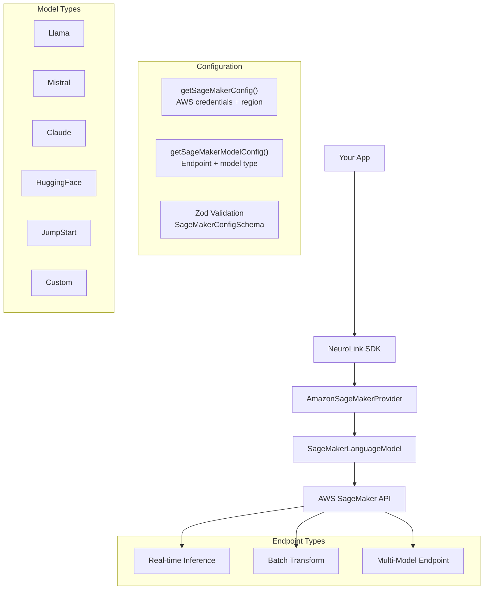

By the end of this guide, you'll have custom models deployed on AWS SageMaker and accessible through NeuroLink's unified TypeScript API -- with the same `generate()` and `stream()` interface you use with every other provider.

You will configure SageMaker endpoints, connect them to NeuroLink, handle credential management, and set up health checks and error handling. SageMaker gives you full control over compute, scaling, and data flow; NeuroLink gives you a clean TypeScript SDK on top.

## Configuration Architecture

SageMaker is the most configuration-intensive provider in NeuroLink, reflecting the complexity of AWS infrastructure. The configuration is split into two parts: AWS-level config and model-level config.

### AWS Configuration

The `SageMakerConfig` type handles AWS authentication and connectivity:

| Parameter | Environment Variable | Default | Description |
|---|---|---|---|
| `region` | `SAGEMAKER_REGION` or `AWS_REGION` | `us-east-1` | AWS region for the SageMaker endpoint |
| `accessKeyId` | `AWS_ACCESS_KEY_ID` | Required | AWS access key |
| `secretAccessKey` | `AWS_SECRET_ACCESS_KEY` | Required | AWS secret key |
| `sessionToken` | `AWS_SESSION_TOKEN` | Optional | For temporary credentials (STS) |
| `timeout` | `SAGEMAKER_TIMEOUT` | `30000` (30s) | Request timeout in milliseconds |
| `maxRetries` | `SAGEMAKER_MAX_RETRIES` | `3` | Maximum retry attempts |
| `endpoint` | `SAGEMAKER_ENDPOINT` | Optional | Custom SageMaker endpoint URL |

Region resolution follows a priority chain: explicit parameter > `SAGEMAKER_REGION` env var > `AWS_REGION` env var > `us-east-1` default.

### Model Configuration

The `SageMakerModelConfig` type handles model-specific settings:

| Parameter | Environment Variable | Description |
|---|---|---|
| `endpointName` | `SAGEMAKER_DEFAULT_ENDPOINT` or `SAGEMAKER_ENDPOINT_NAME` | Name of the SageMaker endpoint |
| `model` | `SAGEMAKER_MODEL` | Model identifier for the SageMaker endpoint |
| `modelType` | `SAGEMAKER_MODEL_TYPE` | One of: `llama`, `mistral`, `claude`, `huggingface`, `jumpstart`, `custom` |
| `contentType` | -- | Default: `application/json` |
| `inputFormat` | -- | One of: `huggingface`, `jumpstart`, `custom` |
| `outputFormat` | -- | One of: `huggingface`, `jumpstart`, `custom` |
| `maxTokens` | -- | Maximum tokens to generate |
| `temperature` | -- | Sampling temperature |
| `topP` | -- | Top-p (nucleus) sampling |
| `stopSequences` | -- | Stop sequences for generation |

Both configurations are validated via Zod schemas (`SageMakerConfigSchema`, `SageMakerModelConfigSchema`), providing clear error messages when configuration is missing or invalid.

> **Note:** SageMaker is the only NeuroLink provider that uses AWS IAM credentials instead of API keys. If you are already using AWS services, you likely have these credentials available in your environment.
{: .prompt-info }

## Quick Setup

### Environment Variables

```bash
export AWS_ACCESS_KEY_ID=AKIA...
export AWS_SECRET_ACCESS_KEY=wJal...
export AWS_REGION=us-east-1

# SageMaker-specific
export SAGEMAKER_DEFAULT_ENDPOINT=my-llama-endpoint
export SAGEMAKER_MODEL=custom-llama-3
export SAGEMAKER_MODEL_TYPE=llama
```

### Basic Generation

```typescript
import { NeuroLink } from '@juspay/neurolink';

const neurolink = new NeuroLink();

const result = await neurolink.generate({
  input: { text: "Summarize this quarterly report" },
  provider: "sagemaker",
});

console.log(result?.content);
```

That is it. NeuroLink loads the AWS credentials from environment variables, validates them against the Zod schema, connects to the specified SageMaker endpoint, and formats the request according to the configured `modelType`.

The constructor accepts optional `modelName`, `endpointName`, and `region` parameters for programmatic configuration:

```typescript
import { AmazonSageMakerProvider } from '@juspay/neurolink';

// Explicit configuration
const provider = new AmazonSageMakerProvider(
  "custom-llama-3",      // modelName
  "my-llama-endpoint",   // endpointName
  "us-west-2"            // region
);
```

## Supported Model Types

SageMaker can serve any model, but different models expect different request/response formats. NeuroLink's `modelType` configuration tells the provider how to format requests for your specific model:

| Model Type | Input Format | Best For | Example |
|---|---|---|---|
| `llama` | Llama chat template | Meta Llama models deployed via SageMaker | Llama 3.1 8B, 70B |
| `mistral` | Mistral chat format | Mistral models on SageMaker | Mistral 7B, Mixtral |
| `claude` | Anthropic message format | Claude models on SageMaker | Claude 3 via Bedrock-SageMaker |
| `huggingface` | HuggingFace Inference format | Any HuggingFace model | Custom fine-tuned models |
| `jumpstart` | AWS JumpStart format | Pre-built JumpStart models | Foundation models from JumpStart |
| `custom` | Your own format | Custom model servers | Your own model format |

### The `custom` Model Type

The `custom` model type is the most flexible option. It lets you define your own input and output format parsers, which is essential when deploying models with non-standard inference APIs:

```typescript
// For a custom model type, define your own input/output handling
const result = await neurolink.generate({
  input: { text: "Process this request" },
  provider: "sagemaker",
  model: "my-custom-model",
});
```

When using `custom`, you can also set `inputFormat` and `outputFormat` to `custom` in the model configuration, giving you full control over request serialization and response parsing.

## Testing and Health Checks

SageMaker deployments involve multiple moving parts (credentials, endpoints, networking, model readiness), so NeuroLink provides comprehensive testing utilities.

### Configuration Check

```typescript
const provider = new AmazonSageMakerProvider("my-model", "my-endpoint");

// Quick configuration overview
const info = provider.getSageMakerInfo();
console.log(info);
// {
//   endpointName: "my-endpoint",
//   modelType: "llama",
//   region: "us-east-1",
//   configured: true
// }
```

The `getSageMakerInfo()` method returns a summary of the current configuration without making any API calls. Use this to verify your configuration is correct before attempting a connection.

### Connection Testing

```typescript
// Test actual connectivity
const conn = await provider.testConnection();
if (!conn.connected) {
  console.error("Connection failed:", conn.error);
  // Possible errors:
  // "AWS credentials not configured"
  // "SageMaker endpoint not found"
  // "Endpoint is not in 'InService' state"
}
```

The `testConnection()` method validates credentials and checks endpoint configuration. For deeper testing, `testConnectivity()` tests actual endpoint reachability by making a lightweight inference call.

### Model Capabilities

```typescript
const capabilities = provider.getModelCapabilities();
console.log(capabilities);
// {
//   streaming: false,  // Phase 2
//   toolCalling: true,
//   embeddings: false,
//   imageGeneration: false
// }
```

> **Tip:** Always run `testConnection()` during your deployment pipeline to catch configuration issues early. A failing SageMaker endpoint at 3 AM is much worse than a failing deployment at 3 PM.
{: .prompt-tip }

## Configuration Summary for Debugging

When things go wrong, the `getConfigurationSummary()` utility provides a debug-safe view of your entire SageMaker configuration:

```typescript
const summary = provider.getConfigurationSummary();
console.log(JSON.stringify(summary, null, 2));
```

This output masks sensitive values -- `accessKeyId` shows only the first 4 characters followed by `***`, and `secretAccessKey` is fully masked. The summary includes all configuration values, making it safe to include in logs and error reports without leaking credentials.

## Endpoint Types

SageMaker supports several endpoint types, each suited to different workloads. NeuroLink's type system includes types for all of them:

### Real-Time Inference

The standard deployment mode. Your model is loaded into memory on a dedicated instance and serves requests synchronously with low latency.

```typescript
// Real-time endpoints are the default
const result = await neurolink.generate({
  input: { text: "Classify this document" },
  provider: "sagemaker",
});
```

### Batch Transform

For processing large datasets asynchronously. Input data is read from S3, processed by the model, and output is written back to S3. This is configured through the `BatchInferenceConfig` type:

```typescript
// Batch inference configuration (via SageMaker API, not NeuroLink directly)
// BatchInferenceConfig type includes:
// - inputDataUri: S3 path to input data
// - outputDataUri: S3 path for output
// - instanceType: e.g., "ml.m5.xlarge"
// - instanceCount: number of instances
// - maxPayloadInMB: maximum request size
```

### Multi-Model Endpoints

Deploy multiple models behind a single endpoint, reducing infrastructure costs by sharing compute resources. The `SageMakerEndpointInfo` type tracks endpoint metadata including status, model variants, and creation timestamps.

## Error Handling

SageMaker has a dedicated error system with a custom `SageMakerError` class and typed error codes:

| Error Code | Description | Common Cause |
|---|---|---|
| `VALIDATION_ERROR` | Invalid configuration | Missing endpoint name, bad model type |
| `CREDENTIALS_ERROR` | AWS authentication failure | Expired keys, wrong region, missing permissions |
| `ENDPOINT_NOT_FOUND` | Endpoint does not exist | Typo in endpoint name, endpoint deleted |
| `THROTTLING_ERROR` | Rate limit exceeded | Too many requests for endpoint capacity |
| `MODEL_ERROR` | Model inference failure | Invalid input format, model OOM |
| `NETWORK_ERROR` | Connection issues | VPC configuration, security groups |
| `SERVICE_UNAVAILABLE` | SageMaker service issue | AWS service disruption |
| `INTERNAL_ERROR` | Internal error | Unexpected failures |

```typescript
try {
  const result = await neurolink.generate({
    input: { text: "Process this" },
    provider: "sagemaker",
  });
} catch (error) {
  if (error.code === "CREDENTIALS_ERROR") {
    console.error("Check your AWS credentials and IAM permissions");
  } else if (error.code === "ENDPOINT_NOT_FOUND") {
    console.error("SageMaker endpoint does not exist. Check the endpoint name and region.");
  } else if (error.code === "THROTTLING_ERROR") {
    console.error("Endpoint is throttled. Consider scaling up the instance count.");
  } else {
    console.error("SageMaker error:", error.message);
  }
}
```

The `handleProviderError()` method wraps all errors with appropriate context, and `handleSageMakerError()` provides consistent formatting across the provider.

> **Warning:** SageMaker errors related to credentials often indicate IAM permission issues, not just wrong keys. Make sure your IAM role has `sagemaker:InvokeEndpoint` permission for the specific endpoint ARN.
{: .prompt-warning }

## Architecture

Here is the complete architecture of NeuroLink's SageMaker integration:



The key architectural distinction from other providers is the `SageMakerLanguageModel` layer. While most NeuroLink providers use off-the-shelf AI SDK packages (like `@ai-sdk/openai`), SageMaker uses a custom `LanguageModelV1` implementation that handles the specifics of AWS authentication, endpoint invocation, and model-type-specific request/response formatting.

## Credential Management

### IAM Roles (Recommended for Production)

In production, prefer IAM roles over access keys. When running on EC2, ECS, or Lambda, the AWS SDK automatically picks up the instance role or task role -- no explicit credentials needed in your environment variables.

```bash
# When using IAM roles, you only need:
export AWS_REGION=us-east-1
export SAGEMAKER_DEFAULT_ENDPOINT=my-production-endpoint
export SAGEMAKER_MODEL_TYPE=llama
# No AWS_ACCESS_KEY_ID or AWS_SECRET_ACCESS_KEY needed
```

### Temporary Credentials (STS)

For cross-account access or time-limited sessions, use AWS STS temporary credentials:

```bash
export AWS_ACCESS_KEY_ID=ASIA...
export AWS_SECRET_ACCESS_KEY=temp_secret...
export AWS_SESSION_TOKEN=FwoGZXIvYXdz...
```

The `sessionToken` is automatically included in SageMaker API calls when present.

### Credential Validation

NeuroLink performs minimal format validation on credentials -- checking that they are present and roughly the right shape -- but delegates detailed validation to the AWS SDK. This is a security best practice: NeuroLink never stores or logs full credentials, and format validation alone cannot determine if credentials are valid.

Region format validation uses the pattern `/^[a-z0-9-]+$/`, and `checkSageMakerConfiguration()` provides a comprehensive pre-flight check that validates all configuration aspects.

## Production Best Practices

### Auto-Scaling

Configure auto-scaling for your SageMaker endpoints to handle variable load. The `ModelDeploymentConfig` type includes auto-scaling parameters:

```typescript
// Monitoring endpoint metrics
// EndpointMetrics type includes:
// - latency (p50, p95, p99)
// - errorRate
// - cpuUtilization
// - memoryUtilization
// - requestCount
```

### Cost Management

SageMaker pricing is instance-based, not per-token. The `CostEstimate` type breaks down costs into instance hours, request costs, and data transfer. Monitor these metrics to right-size your instances.

### Configuration from File

For complex deployments, use `loadConfigurationFromFile()` to load SageMaker configuration from a JSON or YAML file rather than relying solely on environment variables.

### Key Recommendations

1. **Use IAM roles** instead of access keys whenever possible
2. **Configure auto-scaling** for production endpoints to handle traffic spikes
3. **Monitor with EndpointMetrics** to detect latency degradation and error rate increases
4. **Use session tokens** for temporary access in CI/CD pipelines
5. **Test connectivity** during deployment to catch configuration issues early
6. **Set appropriate timeouts** -- `SAGEMAKER_TIMEOUT=30000` (30s) is the default; increase for large models

## What's Next

You now have SageMaker working through NeuroLink's unified interface. From here:

- **[Hugging Face Integration](/posts/hugging-face-integration/):** Discover open-source models on Hugging Face, then deploy them to SageMaker for production use
- **[LiteLLM Unified Routing](/posts/litellm-unified-routing/):** Route requests across multiple providers including SageMaker endpoints
- **[Provider Comparison Matrix](/posts/provider-comparison-matrix/):** Compare SageMaker against other enterprise deployment options like Bedrock and Vertex

SageMaker gives you maximum control over your AI infrastructure. Combined with NeuroLink's unified interface, you get full infrastructure control with the developer experience of a managed API.

---

**Related posts:**

- [Hugging Face Integration: 100,000+ Open Models with NeuroLink](/posts/hugging-face-integration/)
- [Azure OpenAI Integration Guide with NeuroLink](/posts/azure-openai-integration/)
- [Provider Comparison Matrix: Choosing the Right AI Provider](/posts/provider-comparison-matrix/)
