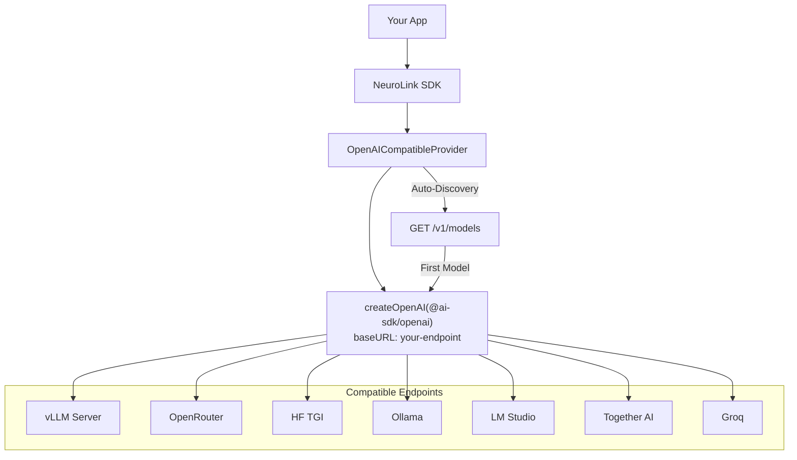

By the end of this guide, you'll have any OpenAI-compatible endpoint connected to NeuroLink -- whether it is vLLM, LM Studio, Together AI, Groq, or your own custom server.

You will configure the OpenAI-Compatible provider with two environment variables, get streaming, tool calling, and automatic model discovery, and use NeuroLink's full middleware stack on top. If your endpoint implements `/v1/chat/completions`, NeuroLink can talk to it.

## How It Works

The implementation is elegantly simple. The `OpenAICompatibleProvider` uses `createOpenAI` from `@ai-sdk/openai` with a custom `baseURL` and `apiKey`. Instead of pointing at `api.openai.com`, it points at whatever endpoint URL you provide.

Two environment variables are required:

- `OPENAI_COMPATIBLE_BASE_URL` -- your endpoint URL (e.g., `http://localhost:8000/v1`)
- `OPENAI_COMPATIBLE_API_KEY` -- your API key for the endpoint

An optional third variable, `OPENAI_COMPATIBLE_MODEL`, specifies which model to use. If you do not set it, NeuroLink will automatically discover available models from the endpoint's `/v1/models` API.

The provider assumes that the endpoint supports the full OpenAI chat completions specification, including streaming and tool calling. The `supportsTools()` method returns `true` by default, since most modern inference servers support function calling. If your specific endpoint does not, tool definitions are simply ignored.

## Quick Setup

### Environment Variables

```bash
export OPENAI_COMPATIBLE_BASE_URL=http://localhost:8000/v1  # e.g., vLLM

# Required: your API key (some servers accept any value)
export OPENAI_COMPATIBLE_API_KEY=your-api-key

# Optional: explicit model selection (skips auto-discovery)
export OPENAI_COMPATIBLE_MODEL=meta-llama/Llama-3.1-8B-Instruct
```

### Basic Streaming

```typescript
import { NeuroLink } from '@juspay/neurolink';

const neurolink = new NeuroLink();

const result = await neurolink.stream({
  input: { text: "Explain distributed computing" },
  provider: "openai-compatible",
});

for await (const chunk of result.stream) {
  if ("content" in chunk) process.stdout.write(chunk.content);
}
```

That is all you need. NeuroLink creates an OpenAI-compatible client pointing at your endpoint, discovers the available model (or uses the one you specified), and streams the response back through the standard interface.

> **Tip:** Many local inference servers (vLLM, Ollama, LM Studio) accept any API key value. Set `OPENAI_COMPATIBLE_API_KEY=sk-placeholder` and it will work. Cloud services (Together AI, Fireworks, Groq) require real API keys.
{: .prompt-tip }

## Automatic Model Discovery

When you do not set `OPENAI_COMPATIBLE_MODEL`, NeuroLink discovers available models automatically by calling the endpoint's `/v1/models` API. This is particularly useful during development when you are experimenting with different models on your inference server.

### Discovery Flow

1. Check `OPENAI_COMPATIBLE_MODEL` environment variable
2. If empty, call `getAvailableModels()` to fetch from `/v1/models`
3. Use the first discovered model, or fall back to `gpt-3.5-turbo`

The `/v1/models` call has a 5-second timeout to prevent slow or unresponsive endpoints from blocking your application. The response is parsed as a standard `ModelsResponse` type: `{ data: Array<{ id: string; object: string; ... }> }`.

### Listing Available Models

```typescript
const provider = new OpenAICompatibleProvider();
const models = await provider.getAvailableModels();
console.log(models);
// ["meta-llama/Llama-3.1-8B-Instruct", "mistralai/Mistral-7B-v0.3", ...]
```

### First Available Model

For quick scripting, use the convenience method:

```typescript
const firstModel = await provider.getFirstAvailableModel();
console.log(firstModel);
// "meta-llama/Llama-3.1-8B-Instruct"
```

### Fallback Models

If the `/v1/models` endpoint is not available (some servers do not implement it), NeuroLink falls back to a common model list:

- `gpt-4o`, `gpt-4o-mini`, `gpt-4-turbo`, `gpt-3.5-turbo`
- `claude-3-5-sonnet`, `claude-3-haiku`
- `gemini-pro`

These fallbacks ensure that NeuroLink can always attempt a request, even if model discovery fails. The actual success depends on whether the endpoint hosts one of these models.

> **Note:** In production, always set `OPENAI_COMPATIBLE_MODEL` explicitly. Auto-discovery adds latency on the first request and introduces a dependency on the `/v1/models` endpoint being available.
{: .prompt-info }

## Streaming with Tools

The OpenAI-Compatible provider supports full streaming with tool calling, following the same pattern as NeuroLink's direct OpenAI provider.

### Tool Calling Example

> **Security Warning:** The `Function()` constructor below is equivalent to `eval()`. In production, replace it with a safe math parser like [mathjs](https://mathjs.org/) (`math.evaluate(expression)`) to prevent arbitrary code execution from LLM-generated expressions.
{: .prompt-danger }

```typescript
import { z } from "zod";
import { tool } from "ai";
import { NeuroLink } from '@juspay/neurolink';

const neurolink = new NeuroLink();

// Connect to vLLM serving Llama 3.1 with tool support
const result = await neurolink.stream({
  input: { text: "Calculate 15% tip on $85.50" },
  provider: "openai-compatible",
  tools: {
    calculate: tool({
      description: "Calculate a mathematical expression",
      parameters: z.object({
        expression: z.string().describe("The math expression to evaluate"),
      }),
      execute: async ({ expression }) => {
        // ⚠️ WARNING: Function() constructor is equivalent to eval() and poses serious security risks.
        // Never use this with untrusted input. In production, use a safe expression parser instead.
        const sanitized = expression.replace(/[^0-9+\-*/().%\s]/g, '');
        if (!sanitized) return { result: "0.00", error: "Invalid expression" };
        const result = Function(`"use strict"; return (${sanitized})`)();
        return { result: Number(result).toFixed(2) };
      },
    }),
  },
});

for await (const chunk of result.stream) {
  if ("content" in chunk) process.stdout.write(chunk.content);
}
```

### Streaming Configuration

The provider includes several smart defaults for streaming:

- **`maxTokens` and `temperature`** are only included if explicitly set (not null or undefined), letting the endpoint use its own defaults
- **`toolChoice: "auto"`** delegates tool selection to the model
- **`maxSteps`** is configured from `DEFAULT_MAX_STEPS` for multi-step tool execution

This means the provider works well with endpoints that have opinionated defaults. It does not override settings unnecessarily.

### Multi-Step Tool Execution

For complex workflows where the model needs to call multiple tools in sequence:

```typescript
const result = await neurolink.stream({
  input: { text: "Find the nearest coffee shop and get directions" },
  provider: "openai-compatible",
  tools: {
    search: tool({
      description: "Search for nearby places",
      parameters: z.object({ query: z.string(), radius: z.number() }),
      execute: async ({ query, radius }) => ({
        name: "Blue Bottle Coffee",
        distance: "0.3 miles",
      }),
    }),
    getDirections: tool({
      description: "Get walking directions to a place",
      parameters: z.object({ destination: z.string() }),
      execute: async ({ destination }) => ({
        steps: ["Walk north on Main St", "Turn right on 2nd Ave"],
        time: "5 minutes",
      }),
    }),
  },
});
```

NeuroLink handles the multi-step tool execution loop automatically, sending tool results back to the model until it produces a final text response.

## Compatible Endpoints

Here is a curated list of popular OpenAI-compatible inference servers and cloud services:

| Endpoint | Base URL Example | Use Case | Tool Support |
|---|---|---|---|
| **vLLM** | `http://localhost:8000/v1` | Self-hosted, high-throughput inference | Yes (model-dependent) |
| **OpenRouter** | `https://openrouter.ai/api/v1` | Multi-model marketplace, pay-per-use | Yes |
| **text-generation-inference** | `http://localhost:8080/v1` | HuggingFace's optimized inference server | Yes (model-dependent) |
| **Ollama** | `http://localhost:11434/v1` | Local model runner, easy setup | Yes (model-dependent) |
| **LM Studio** | `http://localhost:1234/v1` | Desktop model server with GUI | Yes (model-dependent) |
| **Together AI** | `https://api.together.xyz/v1` | Cloud inference, competitive pricing | Yes |
| **Fireworks** | `https://api.fireworks.ai/inference/v1` | Optimized cloud inference | Yes |
| **Groq** | `https://api.groq.com/openai/v1` | Ultra-fast inference with custom hardware | Yes |

Each of these endpoints implements the OpenAI API specification to varying degrees. Core features (chat completions, streaming) are universally supported. Advanced features (tool calling, structured output) depend on the specific endpoint and model.

### Example: Connecting to Groq

```bash
export OPENAI_COMPATIBLE_BASE_URL=https://api.groq.com/openai/v1
export OPENAI_COMPATIBLE_API_KEY=gsk_your_groq_key
export OPENAI_COMPATIBLE_MODEL=llama-3.1-70b-versatile
```

```typescript
const result = await neurolink.stream({
  input: { text: "Explain the transformer architecture" },
  provider: "openai-compatible",
});
// Groq's custom hardware delivers responses in milliseconds
```

### Example: Connecting to vLLM

```bash
# Start vLLM server
python -m vllm.entrypoints.openai.api_server \
  --model meta-llama/Llama-3.1-8B-Instruct \
  --port 8000

# Configure NeuroLink
export OPENAI_COMPATIBLE_BASE_URL=http://localhost:8000/v1
export OPENAI_COMPATIBLE_API_KEY=sk-placeholder
```

```typescript
const result = await neurolink.stream({
  input: { text: "Write unit tests for this function" },
  provider: "openai-compatible",
  // Model auto-discovered from vLLM's /v1/models endpoint
});
```

## Error Handling

The `handleProviderError()` method provides endpoint-specific error classification:

| Error Pattern | Classification | Cause |
|---|---|---|
| `TimeoutError` | Request timeout | Endpoint too slow, model too large |
| `ECONNREFUSED` / `Failed to fetch` | Endpoint not available | Server not running, wrong URL |
| `API_KEY_INVALID` / `Unauthorized` | Authentication failure | Wrong API key |
| `rate limit` | Rate limit exceeded | Too many requests |
| `model` + `not found` / `does not exist` | Model not available | Wrong model name |

```typescript
try {
  const result = await neurolink.stream({
    input: { text: "test" },
    provider: "openai-compatible",
  });

  for await (const chunk of result.stream) {
    if ("content" in chunk) process.stdout.write(chunk.content);
  }
} catch (error) {
  if (error.message.includes("ECONNREFUSED")) {
    console.error("Cannot reach endpoint. Is the server running?");
    console.error("Check OPENAI_COMPATIBLE_BASE_URL:", process.env.OPENAI_COMPATIBLE_BASE_URL);
  } else if (error.message.includes("Unauthorized")) {
    console.error("Authentication failed. Check your API key.");
  } else if (error.message.includes("not found")) {
    console.error("Model not available. Run getAvailableModels() to see options.");
  } else {
    console.error("Error:", error.message);
  }
}
```

> **Warning:** When connecting to self-hosted endpoints, make sure the server is fully loaded before sending requests. Large models (70B+) can take several minutes to load into GPU memory. NeuroLink's timeout defaults to 30 seconds, which may not be enough for the first request on a cold server.
{: .prompt-warning }

## Architecture

Here is how the OpenAI-Compatible provider connects NeuroLink to any compatible endpoint:



The architecture is intentionally minimal: one provider class, one OpenAI client, one base URL. The complexity is in the endpoint server, not in NeuroLink. This is by design -- the OpenAI-Compatible provider is a thin, reliable bridge between NeuroLink's type-safe SDK and whatever endpoint you need to connect to.

## OpenAI-Compatible vs LiteLLM

Both the OpenAI-Compatible provider and LiteLLM connect NeuroLink to external endpoints, but they serve different purposes:

| Feature | OpenAI-Compatible | LiteLLM |
|---|---|---|
| **Connection** | Direct to a single endpoint | Through a proxy server |
| **Setup** | 2 environment variables | Proxy server + configuration |
| **Model routing** | Single endpoint, single (or few) models | Multiple providers, 100+ models |
| **Auto-discovery** | Yes (`/v1/models`) | Yes (`/v1/models`) |
| **Extra infrastructure** | None | LiteLLM proxy server |
| **Best for** | Single custom endpoint | Multi-provider routing |
| **Cost tracking** | No | Built-in |
| **Rate limiting** | No (endpoint-dependent) | Built-in |

**Use OpenAI-Compatible when** you have one endpoint and want the simplest possible setup. No proxy, no extra infrastructure, just a direct connection.

**Use LiteLLM when** you need to route to multiple providers through a single proxy with centralized cost tracking, rate limiting, and model fallback.

## Production Tips

1. **Always set `OPENAI_COMPATIBLE_MODEL` in production.** Auto-discovery adds latency and introduces a failure point. Set the model explicitly to skip the `/v1/models` call entirely.

2. **Test tool support with your specific endpoint.** Not all OpenAI-compatible servers implement tool calling identically. Test your tools against the actual endpoint before deploying to production.

3. **Monitor for endpoint-specific quirks.** Some servers do not implement all optional fields in the OpenAI spec. If you encounter unexpected behavior, check the server's documentation for known deviations from the spec.

4. **Set appropriate timeouts.** Self-hosted servers with large models may need longer timeouts than the default 30 seconds, especially for first requests after a cold start.

5. **Use health checks.** For self-hosted endpoints, implement a health check that calls `/v1/models` periodically to verify the server is responsive before routing traffic to it.

## What's Next

You now have any OpenAI-compatible endpoint working through NeuroLink. From here:

- **[LiteLLM Unified Routing](/posts/litellm-unified-routing/):** Multi-provider routing when you need more than one endpoint
- **[AWS SageMaker](/posts/aws-sagemaker-custom-models/):** AWS-hosted custom model endpoints
- **[Provider Comparison Matrix](/posts/provider-comparison-matrix/):** Evaluate when a direct provider versus OpenAI-Compatible is the right approach

Any server that speaks the OpenAI protocol becomes a first-class NeuroLink provider with streaming, tools, middleware, and observability -- no custom integration code required.

---

**Related posts:**

- [LiteLLM + NeuroLink: Access 100+ Models via Unified Routing](/posts/litellm-unified-routing/)
- [Running Local LLMs with NeuroLink and Ollama](/posts/ollama-local-llm-guide/)
- [Provider Comparison Matrix: Choosing the Right AI Provider](/posts/provider-comparison-matrix/)
