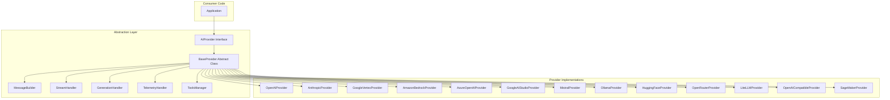

The provider layer was a liability. Thirteen SDKs, thirteen authentication flows, thirteen streaming protocols, thirteen error taxonomies -- all leaking into application code through a growing switch statement that nobody wanted to own. OpenAI uses bearer tokens; Bedrock uses AWS Signature V4; Vertex uses Google service accounts; SageMaker uses custom endpoints with per-model input formats. And that is just authentication.

We decomposed it. NeuroLink supports 13 providers -- OpenAI, Anthropic, Google AI Studio, Google Vertex, AWS Bedrock, Azure OpenAI, Mistral, Ollama, LiteLLM, HuggingFace, OpenRouter, OpenAI-Compatible, and Amazon SageMaker -- behind a single `generate()` and `stream()` interface. From your application code, they all look identical.

The constraint that shaped the architecture: **adding a new provider must not require changing any existing code.** Not a single line. No growing switch statements, no conditional imports, no feature flag checks. The right abstraction is not a wrapper -- it is a contract. This post traces how we built that contract.

## The AIProvider Interface Contract

Everything starts with the `AIProvider` interface. This is the contract that every provider must honor. It defines the methods that consumers (your application code) can call, and the return types they can expect.

The key methods are:

- **`generate()`** -- Non-streaming text generation, returns an `EnhancedGenerateResult`
- **`stream()`** -- Streaming generation, returns an async generator yielding `{ content: string }` chunks
- **`embed()`** -- Generate embeddings for text input
- **`generateText()`** -- Backward-compatible alias for `generate()`

The critical design decision was the return types. Every provider returns the same `EnhancedGenerateResult` from `generate()`, regardless of whether the underlying model is GPT-4o, Claude 3.5 Sonnet, or a custom Llama on SageMaker. This means consumer code never needs to handle provider-specific response formats.

For streaming, we made another deliberate choice: the stream yields `{ content: string }` objects via an `AsyncGenerator`. This is simpler than exposing provider-specific stream types (like OpenAI's delta events or Anthropic's content blocks). The normalization happens inside the provider, not in your code.

```typescript
// From src/lib/core/baseProvider.ts - The abstract base class
export abstract class BaseProvider implements AIProvider {
  protected readonly modelName: string;
  protected readonly providerName: AIProviderName;
  protected readonly defaultTimeout: number = 30000;

  // Abstract methods every provider MUST implement
  protected abstract executeStream(
    options: StreamOptions,
    analysisSchema?: ValidationSchema,
  ): Promise<StreamResult>;

  protected abstract getProviderName(): AIProviderName;
  protected abstract getDefaultModel(): string;
  protected abstract getAISDKModel(): LanguageModelV1 | Promise<LanguageModelV1>;
  protected abstract handleProviderError(error: unknown): Error;
}
```

Five abstract methods. That is the entire contract a new provider must fulfill. Everything else -- message building, timeout handling, tool management, telemetry, analytics -- is inherited from `BaseProvider`.


## BaseProvider: The Template Method Pattern

`BaseProvider` is where the real architectural work happens. It implements the Template Method pattern: the shared workflow is defined in the base class, and subclasses override only the provider-specific steps.

The `generate()` method follows this flow:

1. **Normalize options** -- standardize the input format
2. **Prepare tools** -- validate and format tool definitions
3. **Build messages** -- construct the provider-appropriate message array
4. **Execute generation** -- call the provider's AI SDK (the abstract method)
5. **Enhance result** -- normalize the response into `EnhancedGenerateResult`

Subclasses only implement step 4. Steps 1-3 and 5 are handled by `BaseProvider` and shared across all 13 providers. This eliminates an enormous amount of duplicated code -- and more importantly, duplicated bugs.

### Composition Over Inheritance

Early versions of `BaseProvider` grew into a God class. Every shared utility method -- message formatting, stream handling, telemetry, tool validation -- lived in one massive file. The fix was composition: we extracted responsibilities into focused modules.

```typescript
// From src/lib/core/baseProvider.ts - Composition modules (SRP)
constructor(modelName?, providerName?, neurolink?, middleware?) {
  this.modelName = modelName || this.getDefaultModel();
  this.providerName = providerName || this.getProviderName();

  // Initialize composition modules
  this.messageBuilder = new MessageBuilder(this.providerName, this.modelName);
  this.streamHandler = new StreamHandler(this.providerName, this.modelName);
  this.generationHandler = new GenerationHandler(/* ... */);
  this.telemetryHandler = new TelemetryHandler(/* ... */);
  this.utilities = new Utilities(/* ... */);
  this.toolsManager = new ToolsManager(/* ... */);
}
```

Each module has a single responsibility:

- **MessageBuilder** -- Constructs the message array from user input, handling text, images, and system prompts across providers
- **StreamHandler** -- Manages stream lifecycle, chunk normalization, and abort handling
- **GenerationHandler** -- Orchestrates the generate/stream flow with timeout and retry logic
- **TelemetryHandler** -- Collects per-request metrics (latency, token usage, model, provider)
- **ToolsManager** -- Validates tool schemas, manages tool choice, handles multi-step execution
- **Utilities** -- Shared helpers (timeout wrappers, error formatting, config resolution)

This composition approach means each module can be tested independently, and changes to one area (say, telemetry collection) do not risk breaking another (say, message building).

### Timeout Consolidation

An illustrative example of the value of `BaseProvider`: the `executeWithTimeout()` method. Before we had it, 8 of 10 providers implemented their own timeout logic -- each slightly different, some with bugs. We consolidated it into a single method in `BaseProvider`:

```typescript
// All providers get consistent timeout behavior
protected async executeWithTimeout<T>(
  operation: () => Promise<T>,
  timeoutMs?: number,
): Promise<T> {
  const timeout = timeoutMs ?? this.defaultTimeout;
  // AbortController + Promise.race implementation
  // Consistent across all 13 providers
}
```

One implementation, one test suite, one set of timeout semantics across all providers.

## The Provider Enum as Single Source of Truth

The `AIProviderName` enum is the foundation of the entire registration and routing system:

```typescript
// From src/lib/constants/enums.ts
export enum AIProviderName {
  BEDROCK = "bedrock",
  OPENAI = "openai",
  OPENAI_COMPATIBLE = "openai-compatible",
  OPENROUTER = "openrouter",
  VERTEX = "vertex",
  ANTHROPIC = "anthropic",
  AZURE = "azure",
  GOOGLE_AI = "google-ai",
  HUGGINGFACE = "huggingface",
  OLLAMA = "ollama",
  MISTRAL = "mistral",
  LITELLM = "litellm",
  SAGEMAKER = "sagemaker",
  AUTO = "auto",
}
```

This enum is not just a label -- it drives three critical systems:

### 1. Provider Registration

The `ProviderRegistry` maps enum values to provider factory functions. When you call `generate({ provider: "mistral" })`, the registry looks up `AIProviderName.MISTRAL` and instantiates the correct class.

### 2. Input Normalization

User input strings like `"google-ai"`, `"Google AI"`, `"GOOGLE_AI"`, or `"googleai"` are all normalized to the canonical `AIProviderName.GOOGLE_AI` value before routing. This makes the API forgiving while keeping internal logic strict.

### 3. Environment Variable Resolution

Each enum value maps to a set of expected environment variables. The resolution chain is: explicit parameter > env var > registry default. For example, model resolution for OpenAI checks `options.model` first, then `OPENAI_MODEL` env var, then falls back to `gpt-4o`.

The `AUTO` value is special -- it triggers `createBestAIProvider()`, which scans environment variables for available API keys and selects the best configured provider automatically.

## Adding a New Provider in 4 Steps

This is the ultimate test of an abstraction: how easy is it to extend? Adding a new provider to NeuroLink requires exactly four steps, none of which modify existing code.

### Step 1: Create the Provider Class

```typescript
// src/lib/providers/myProvider.ts
import { BaseProvider } from '../core/baseProvider';
import { AIProviderName } from '../constants/enums';

export class MyProvider extends BaseProvider {
  protected getProviderName(): AIProviderName {
    return AIProviderName.MY_PROVIDER;
  }

  protected getDefaultModel(): string {
    return "my-default-model";
  }

  protected getAISDKModel(): LanguageModelV1 {
    // Create and return the Vercel AI SDK model instance
    return createMySDK({ apiKey: process.env.MY_API_KEY });
  }

  protected async executeStream(options, analysisSchema?) {
    // Provider-specific streaming implementation
    const model = this.getAISDKModel();
    const result = await streamText({ model, messages: options.messages });
    return result;
  }

  protected handleProviderError(error: unknown): Error {
    // Classify provider-specific errors
    if (error.message?.includes("invalid_api_key")) {
      return new AuthenticationError("Check MY_API_KEY");
    }
    return new ProviderError(error.message);
  }
}
```

### Step 2: Implement the Abstract Methods

You need to implement five methods:

- `getProviderName()` -- returns the enum value
- `getDefaultModel()` -- returns the default model identifier
- `getAISDKModel()` -- creates and returns the AI SDK model instance (can be async for providers like OpenAI-Compatible that do auto-discovery)
- `executeStream()` -- implements the provider-specific streaming logic
- `handleProviderError()` -- classifies errors into NeuroLink's error hierarchy

Everything else -- message building, tool management, telemetry, timeout handling -- is inherited from `BaseProvider`.

### Step 3: Register in the Provider Registry

```typescript
// In ProviderRegistry.registerAllProviders()
ProviderRegistry.register(
  AIProviderName.MY_PROVIDER,
  (modelName) => new MyProvider(modelName),
);
```

### Step 4: Add the Enum Value (Optional)

For type safety, add the new provider to the `AIProviderName` enum:

```typescript
export enum AIProviderName {
  // ... existing providers
  MY_PROVIDER = "my-provider",
}
```

This step is optional -- the dynamic provider system can register providers without enum values. But adding the enum gives you compile-time type checking across the entire codebase.

### Why No Existing Code Changes

The key architectural decision is that the factory uses **registration, not conditionals**. There is no switch statement or if-else chain that routes provider names to classes. Instead, providers register themselves in a map, and the factory looks them up by key. Adding a new entry to the map does not modify the factory logic -- it is an additive change.

This is the Open/Closed Principle in practice: the system is open for extension (new providers) and closed for modification (no changes to existing code).

## Architecture Diagram

Here is the full architecture showing how the abstraction layers connect:



The application talks to the `AIProvider` interface. The interface is implemented by `BaseProvider`, which composes its behavior from focused modules. Each concrete provider extends `BaseProvider` and implements only the provider-specific methods. The consumer never knows (or needs to know) which provider is running underneath.

## Lessons Learned

Building a provider abstraction that covers 13 APIs taught us several lessons that apply to any SDK design.

### Lesson 1: Abstract Classes Beat Pure Interfaces for Shared Behavior

A pure interface defines the contract but cannot enforce shared behavior. We started with interfaces and quickly found ourselves duplicating code across providers -- the same timeout logic, the same message formatting, the same error handling patterns. Abstract classes let us define the contract AND the shared implementation in one place.

The trade-off is reduced flexibility (single inheritance in TypeScript), which we mitigated with composition modules.

### Lesson 2: Composition Modules Prevent God Classes

When `BaseProvider` crossed 800 lines, we knew we had a problem. The fix was not to split it into multiple base classes (which would have forced diamond inheritance), but to extract behavior into composed modules: `MessageBuilder`, `StreamHandler`, `GenerationHandler`, `TelemetryHandler`, `ToolsManager`, and `Utilities`.

Each module has a single responsibility and can be tested independently. `BaseProvider` becomes an orchestrator, not a monolith.

### Lesson 3: Make the Default Path Zero-Config

Most developers should not need to read documentation to get started. NeuroLink's default path uses environment variables for configuration, auto-detection for provider selection, and sensible defaults for everything else. The `AUTO` provider scans your environment and picks the best option automatically.

```typescript
import { NeuroLink } from '@juspay/neurolink';

const neurolink = new NeuroLink();
// If OPENAI_API_KEY is set, uses OpenAI
// If ANTHROPIC_API_KEY is set, uses Anthropic
// No explicit provider selection needed
```

Zero-config for the happy path, full control for the power user.

### Lesson 4: Backward Compatibility Layers Are Worth the Cost

When we renamed `generateText()` to `generate()` for clarity, we kept `generateText()` as an alias that wraps `generate()`. This added a few lines of code but saved every existing user from a breaking migration. In SDK design, backward compatibility is not technical debt -- it is customer respect.

### Lesson 5: The Enum Is the Single Source of Truth

Every time we tried to maintain provider lists in multiple places (enum, registry, factory, documentation), they drifted out of sync. Making the `AIProviderName` enum the single source of truth -- and deriving everything else from it -- eliminated an entire class of bugs.

## What's Next

This post covered the architectural foundation: interface contract, abstract base class, composition modules, enum-driven registry, and the extension pattern. The follow-up posts go deeper into the runtime layer:

- **The Factory + Registry Pattern** -- how providers are instantiated, cached, and managed at runtime
- **Multi-Tenant Provider Routing** -- how the abstraction enables tenant-specific provider selection in SaaS applications
- **[Provider Comparison Matrix](/posts/provider-comparison-matrix/)** -- the practical outcome of this abstraction: all 13 providers compared side by side

If you are building your own multi-provider abstraction, start with the interface contract and the abstract base class. Get those right, and the rest follows. Get them wrong, and you will fight the architecture for the life of the project.

---

**Related posts:**

- [Provider Comparison Matrix: Choosing the Right AI Provider](/posts/provider-comparison-matrix/)
- [How to Switch AI Providers Without Rewriting Code](/posts/switch-ai-providers-without-rewriting/)
- [What is NeuroLink? The Unified AI SDK Explained](/posts/what-is-neurolink-unified-sdk/)
