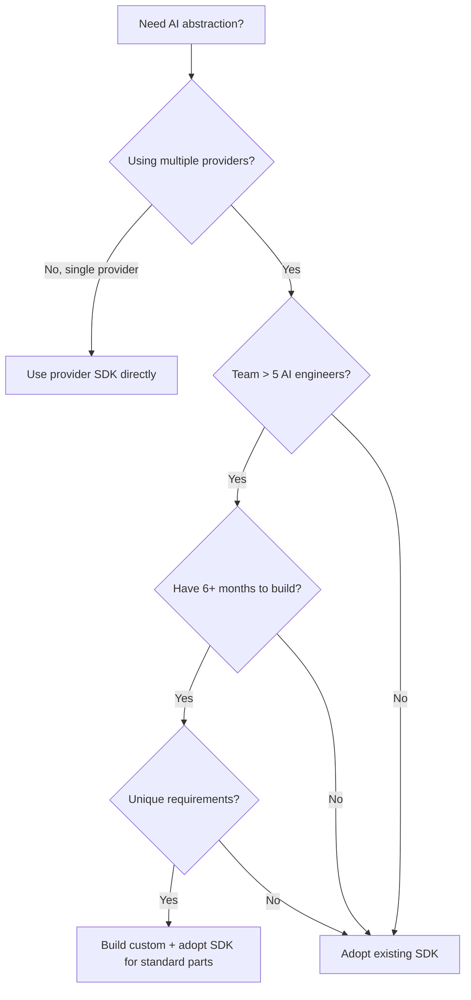

"How hard can it be? We will just wrap the OpenAI SDK." Every team says this. The first version takes two days. The production-grade version takes nine months and dedicated headcount -- and the maintenance never stops.

Building your own AI abstraction layer is a bet that your engineering time is better spent normalizing streaming formats than shipping product features. No single answer fits every team -- for most, that bet loses. But not for all teams, and the distinction matters.

This post provides an honest decision framework. We build NeuroLink, so we have skin in the game -- but we also know exactly how much work a production-grade abstraction requires. There are scenarios where building custom makes sense. The goal is to help you make the right call for your context, not to sell you on ours.

## What an AI Abstraction Layer Actually Requires

Most teams underestimate the hidden complexity of a multi-provider AI abstraction. Here is a breakdown of what a production-grade layer actually involves -- organized by the layers of complexity that emerge over time.

### Layer 1: Provider Abstraction

This is the layer most teams think about:

- **Normalizing request/response formats** across providers -- OpenAI, Anthropic, Google, and Mistral all have different message schemas, content block formats, and metadata structures
- **Handling provider-specific authentication** -- API keys, OAuth tokens, IAM roles, service accounts, session tokens. Each provider's auth mechanism is different
- **Model mapping and capability detection** -- not all models support tool calling, not all support images, not all support streaming. Your abstraction needs to know what each model can do
- **Default model selection** -- what happens when the user does not specify a model?

NeuroLink handles 13 providers, each with unique quirks. The `src/lib/providers/` directory contains 15 implementation files -- and that does not count the shared infrastructure.

### Layer 2: Streaming Normalization

This is where complexity spikes:

- **Different streaming protocols** -- Server-Sent Events (SSE), WebSocket connections, HTTP chunked transfer. Each provider streams differently
- **Unified chunk types** -- your consumer code should not need to know whether a chunk came from OpenAI's delta events or Anthropic's content blocks
- **Timeout handling and abort support** -- streams that hang, connections that drop, AbortController integration
- **Error chunks mid-stream** -- some providers send error chunks within the stream instead of throwing exceptions

Each provider's `executeStream()` method handles these details. The shared `StreamHandler` module normalizes the output, but the per-provider complexity is unavoidable.

### Layer 3: Tool Calling Compatibility

Tool calling (function calling) is one of the most provider-divergent features:

- **Schema normalization** -- Zod schemas, JSON Schema, provider-specific tool formats. Each provider has opinions about how tools should be defined
- **Multi-step execution loops** -- the model calls a tool, you execute it, you send the result back, the model may call another tool. This loop needs to work consistently across providers
- **Tool capability detection** -- not all models support tools. Some models (like certain Hugging Face models) need tools conditionally enabled or disabled
- **Tool result formatting** -- how tool execution results are sent back to the model varies by provider

### Layer 4: Production Concerns

This is the layer that separates prototypes from production systems:

- **Retry logic with exponential backoff** -- handling transient failures across providers
- **Circuit breakers** -- preventing cascading failures when a provider is down
- **Rate limiting and timeout management** -- respecting provider rate limits, configuring per-provider timeouts
- **Error classification and typed exceptions** -- normalizing provider-specific error formats into a consistent hierarchy
- **Observability** -- OpenTelemetry integration, Langfuse tracing, per-request metrics collection

### Layer 5: Enterprise Features

Over time, your abstraction layer will need:

- **MCP tool integration** -- multiple transport protocols (stdio, SSE, Streamable HTTP, and WebSocket (SDK-provided))
- **Conversation memory** -- Redis-backed, in-memory, or external memory services
- **Human-in-the-loop (HITL) approval workflows** -- pausing execution for human review
- **Middleware pipelines** -- analytics, guardrails, content moderation, custom logic
- **Workflow engine** -- consensus voting, fallback chains, adaptive model selection

> **Note:** Most teams plan for Layer 1 and maybe Layer 2. Layers 3-5 emerge as requirements, often under deadline pressure. The total scope is typically 5-10x what teams estimate at the start.
{: .prompt-info }

## The Real Cost of Building

Here are honest engineering cost estimates based on our experience building and maintaining NeuroLink:

| Component | Estimated Build Time | Ongoing Maintenance |
|---|---|---|
| Basic 3-provider wrapper | 2 weeks | 1 day/month per provider |
| Streaming normalization | 1 week | 2 days/month (provider API changes) |
| Tool calling compatibility | 2 weeks | 1 week/quarter |
| Error handling + retry | 1 week | Low |
| Testing across providers | 3 weeks (integration tests) | 2 days/month |
| **Subtotal (basic)** | **9 weeks** | **~2 weeks/quarter** |
| MCP integration | 4 weeks | 1 week/quarter |
| RAG pipeline | 6 weeks | 2 weeks/quarter |
| Workflow engine | 8 weeks | 1 week/quarter |
| Server adapters | 3 weeks | Low |
| **Subtotal (full)** | **30+ weeks** | **~6 weeks/quarter** |

The key insight: **the initial build is 20% of the cost. Maintenance is 80%.** Every time a provider changes their API, adds a model, deprecates a feature, or modifies their streaming format, your abstraction layer needs to be updated. OpenAI alone has made dozens of API changes in 2024-2025 -- each one requiring testing across your abstraction.

### The Maintenance Multiplier

Maintenance cost scales linearly with the number of providers. Each provider is an independent dependency that can change at any time. Three providers means triple the maintenance surface. Thirteen providers means your abstraction layer requires dedicated engineering attention every sprint.

This is the trap: the initial build feels manageable, but the ongoing maintenance quietly consumes engineering bandwidth that should be going into your actual product.

### The Hidden Testing Cost

Integration testing across providers is particularly expensive. You cannot mock provider APIs reliably because the bugs you are trying to catch are in the provider-specific behaviors. Real integration tests require real API keys, real requests, and real costs. Running these tests across 13 providers, with multiple models per provider, is a significant ongoing expense.

## When Building Makes Sense

Let us be honest about when a custom solution is the right call:

### Extremely Specialized Requirements

If your use case requires custom request/response transformations that no existing SDK handles -- for example, a proprietary model format or a non-standard inference protocol -- building custom may be the only option.

### Regulatory Constraints Requiring Full Code Audit

Some regulated industries (healthcare, finance, government) require auditing every line of code in the dependency chain. While NeuroLink is open source (Apache 2.0) and fully auditable, some compliance teams prefer code maintained entirely in-house. If this is a hard requirement, building is the only path.

### Single Provider Only

If you are committed to one provider with no plans to switch, the abstraction layer adds complexity without proportional value. Just use the provider's SDK directly. The cost of abstraction only pays off when you need to support (or might need to support) multiple providers.

### Deep AI Infrastructure Expertise

If your team has 5+ engineers with deep experience in AI infrastructure and the capacity to maintain a multi-provider abstraction long-term, building custom gives you maximum control. The question is whether this is the best use of that expertise.

### Custom Billing or Metering

If you need per-request billing, per-tenant metering, or custom cost attribution that existing tools do not support, building a thin custom layer on top of an existing SDK (hybrid approach) may be the best path.

### Performance-Critical Paths

If you need absolute zero-overhead provider calls -- no middleware, no telemetry, no abstraction at all -- then wrapping a provider SDK adds unnecessary latency. For sub-millisecond-sensitive paths, direct SDK calls may be warranted.

## When Adopting Makes Sense

For most teams, adopting an existing SDK provides better ROI:

### Multi-Provider Requirement

This is the core value proposition of any AI abstraction layer. If you need to route to multiple providers -- for failover, cost optimization, or model selection -- the abstraction pays for itself immediately. Building this from scratch means building and maintaining everything listed in the "What an AI Abstraction Layer Actually Requires" section above.

### Small to Mid-Size Team

Teams under 50 engineers cannot afford to dedicate 2+ full-time engineers to maintaining AI infrastructure. Adopting an SDK converts that ongoing cost into a dependency that is maintained by a dedicated team (in NeuroLink's case, Juspay's AI infrastructure team).

### Fast Time-to-Market

The difference between "9 weeks to build basic support" and "install the package and start coding today" is significant when you are racing to ship. Adoption gives you weeks, not months, to production.

### Production Reliability

An SDK that has been battle-tested across hundreds of deployments catches edge cases you have not encountered yet. Provider API quirks, timeout behaviors, streaming edge cases -- these are bugs you do not want to discover in production.

### Growing Feature Needs

Today you need text generation. Tomorrow you need RAG. Next quarter you need workflows, MCP integration, and HITL approval. An SDK that already has these features means you do not need to build them when the requirements arrive.

### Open Source = "Adopt", Not "Buy"

NeuroLink is open source under Apache 2.0. "Buy" really means "adopt" -- you get full source code access, the ability to fork and modify, and the freedom to contribute back. This eliminates the "vendor lock-in to the SDK" concern.

## The Hybrid Approach

For many teams, the best answer is neither "build everything" nor "adopt everything" -- it is a hybrid:

### Start with an SDK for 80% of Use Cases

Adopt NeuroLink (or another SDK) for the standard provider abstraction, streaming, tool calling, and middleware. This covers the vast majority of use cases with zero custom code.

### Extend with Custom Providers

For specialized needs, build custom providers that plug into the existing SDK. NeuroLink's `OpenAICompatibleProvider` is a perfect example -- it connects to any endpoint that implements the OpenAI API, including your custom endpoints:

```typescript
import { NeuroLink } from '@juspay/neurolink';

const neurolink = new NeuroLink();

// Your custom endpoint, connected through NeuroLink's infrastructure
const result = await neurolink.stream({
  input: { text: "Process this with my custom model" },
  provider: "openai-compatible",
});
```

### Use Middleware for Custom Logic

Instead of forking or replacing the SDK, use the middleware system to inject custom behavior. NeuroLink's `MiddlewareFactory` supports custom middleware that runs before and after every request -- perfect for custom logging, billing, content filtering, or any business-specific logic.

### Build Custom MCP Servers for Internal Tools

Rather than building tool integrations into the AI abstraction layer, build them as standalone MCP servers. This keeps your tools portable (they work with any MCP-compatible client) and your abstraction layer clean.

## Decision Framework

Here is a quick decision flowchart to guide your choice:



The flowchart reveals a pattern: the "build" path requires multiple qualifying conditions -- multiple providers AND a large team AND months of runway AND unique requirements. Missing any one of these conditions points toward adoption.

### The "Two-Week Test"

Here is a practical heuristic: if you can build a working prototype that handles streaming, tool calling, and error normalization across your target providers in two weeks, building might make sense. If two weeks only gets you a basic wrapper without production-grade reliability, the gap between "prototype" and "production" is larger than you think.

## The Total Cost Perspective

When evaluating build vs buy, consider the full cost picture:

**Building custom:**

- 9-30+ weeks of initial development
- 2-6 weeks per quarter of ongoing maintenance
- Integration testing costs across providers
- Opportunity cost of engineers not building product features
- Risk of knowledge concentration (bus factor)

**Adopting NeuroLink:**

- Hours to days for initial integration
- Minimal ongoing maintenance (dependency updates)
- Battle-tested across production deployments
- Full source code access (Apache 2.0)
- Community and team support for edge cases

The calculus usually favors adoption unless your requirements are genuinely unique. And even then, the hybrid approach -- adopt for standard features, extend for custom needs -- is often the most efficient path.

## Conclusion

Building your own AI abstraction layer is expensive -- not in the prototype (that is deceptively easy), but in the ongoing maintenance, edge cases, provider API changes, and opportunity cost of engineers maintaining infrastructure instead of building product.

The question is not "can we build this?" Your team almost certainly can. The question is "should we build this, given what else we could build with the same engineering time?"

For most teams, the answer is: adopt an open-source SDK for the 90% that is commodity, extend it for the 10% that is unique, and spend your engineering budget on what makes your product different.

Read [How We Built NeuroLink's Provider Abstraction](/posts/provider-abstraction/) to understand the architecture, then check the [Provider Comparison Matrix](/posts/provider-comparison-matrix/) to see the full scope of what a production-grade abstraction covers.

---

**Related posts:**

- [How We Built NeuroLink's Provider Abstraction: 13 APIs, One Interface](/posts/provider-abstraction/)
- [The Hidden Cost of AI Vendor Lock-In](/posts/hidden-cost-vendor-lock-in/)
- [Provider Comparison Matrix: Choosing the Right AI Provider](/posts/provider-comparison-matrix/)
