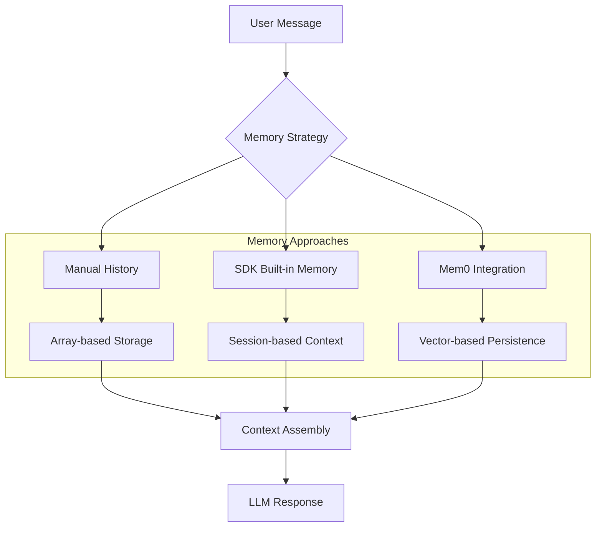

By the end of this guide, you will have conversation memory working in your NeuroLink application -- from simple in-memory session tracking to persistent cross-session recall with Mem0 integration.

You will implement three approaches: manual conversation history management for full control, NeuroLink's built-in session memory for automatic context tracking, and Mem0-backed persistent memory for applications that need to remember users across sessions. Each approach includes working TypeScript examples you can deploy today.



## Understanding Conversation Memory

Conversation memory is the mechanism that allows AI applications to maintain awareness of previous interactions within a session and, in some cases, across multiple sessions. Without proper memory management, each user message would be processed in isolation, leading to disjointed and frustrating user experiences.

### Why Memory Matters

Consider a simple customer support scenario:

**Without Memory:**

```text
User: I want to return my order
AI: I'd be happy to help with your return. Which order would you like to return?

User: The one I placed last Tuesday
AI: I'd be happy to help with your return. Which order would you like to return?
```

**With Memory:**

```text
User: I want to return my order
AI: I'd be happy to help with your return. Which order would you like to return?

User: The one I placed last Tuesday
AI: I found your order #12847 placed on Tuesday for a wireless keyboard. Would you like to initiate a return for this item?
```

The difference is stark. Memory transforms AI from a simple query-response system into an intelligent conversational partner.

## Approach 1: Manual Conversation History Management

The simplest approach to conversation memory is managing an array of messages yourself. This gives you full control and works with any provider.

### Basic Manual Implementation

```typescript
import { NeuroLink } from '@juspay/neurolink';

const neurolink = new NeuroLink();

// Manual conversation management with typed messages
interface Message {
  role: 'user' | 'assistant' | 'system';
  content: string;
}

const conversationHistory: Message[] = [];

async function chat(userMessage: string): Promise<string> {
  // Add user message to history
  conversationHistory.push({ role: 'user', content: userMessage });

  // Build context from conversation history
  const contextSummary = conversationHistory
    .slice(-10) // Keep last 10 messages for context
    .map(m => `${m.role}: ${m.content}`)
    .join('\n');

  const result = await neurolink.generate({
    input: {
      text: userMessage,
    },
    systemPrompt: `You are a helpful assistant. Here is the conversation so far:\n${contextSummary}\n\nRespond to the user's latest message.`,
    provider: 'openai',
    model: 'gpt-4',
  });

  // Add assistant response to history
  conversationHistory.push({ role: 'assistant', content: result.content });

  return result.content;
}

// Usage
await chat("My name is Alice and I love reading books");
await chat("What is my favorite hobby?");
// AI will remember: "Based on what you told me, your favorite hobby is reading books!"
```

### Enhanced Manual Implementation with Token Management

For longer conversations, you need to manage context window limits:

```typescript
import { NeuroLink } from '@juspay/neurolink';

interface Message {
  role: 'user' | 'assistant' | 'system';
  content: string;
  timestamp: Date;
}

class ConversationManager {
  private history: Message[] = [];
  private maxMessages: number;
  private neurolink: NeuroLink;

  constructor(maxMessages = 20) {
    this.maxMessages = maxMessages;
    this.neurolink = new NeuroLink();
  }

  async chat(userMessage: string): Promise<string> {
    // Add user message
    this.history.push({
      role: 'user',
      content: userMessage,
      timestamp: new Date(),
    });

    // Trim history if too long
    if (this.history.length > this.maxMessages) {
      this.history = this.history.slice(-this.maxMessages);
    }

    // Build context
    const context = this.buildContext();

    const result = await this.neurolink.generate({
      input: { text: userMessage },
      systemPrompt: context,
      provider: 'openai',
      model: 'gpt-4',
    });

    // Store assistant response
    this.history.push({
      role: 'assistant',
      content: result.content,
      timestamp: new Date(),
    });

    return result.content;
  }

  private buildContext(): string {
    const historyText = this.history
      .map(m => `[${m.role.toUpperCase()}]: ${m.content}`)
      .join('\n\n');

    return `You are a helpful AI assistant. Maintain context from the conversation history below.

CONVERSATION HISTORY:
${historyText}

Respond naturally to the user's latest message, referencing previous context when relevant.`;
  }

  clearHistory(): void {
    this.history = [];
  }

  getHistory(): Message[] {
    return [...this.history];
  }
}

// Usage
const conversation = new ConversationManager();
await conversation.chat("I'm planning a trip to Japan next month");
await conversation.chat("What's the best time to visit temples?");
await conversation.chat("How long should I stay?");
// AI maintains full context of the Japan trip discussion
```

## Approach 2: NeuroLink Built-in Conversation Memory

NeuroLink provides built-in conversation memory that automatically manages session context. This is the recommended approach for most applications.

### Configuration

```typescript
import { NeuroLink } from '@juspay/neurolink';

const neurolink = new NeuroLink({
  conversationMemory: {
    enabled: true,
    maxSessions: 50,       // Maximum concurrent sessions (default: 50)
    tokenThreshold: 4000,  // Token limit before oldest messages are pruned
  },
});
```

> **Note**: `maxTurnsPerSession` is deprecated. Use `tokenThreshold` instead to control when oldest messages are pruned.
{: .prompt-info }

You can also configure via environment variables:

```bash
NEUROLINK_MEMORY_ENABLED=true

# Maximum number of sessions to keep in memory
NEUROLINK_MEMORY_MAX_SESSIONS=50
```

### Using Session-based Memory

The key to using built-in memory is providing a `sessionId` in the `context` parameter:

```typescript
import { NeuroLink } from '@juspay/neurolink';

const neurolink = new NeuroLink({
  conversationMemory: { enabled: true },
});

// First message in session
const response1 = await neurolink.generate({
  input: { text: "My name is Alice and I love reading books" },
  context: {
    sessionId: "user-123-session-abc",
    userId: "alice",
  },
  provider: 'openai',
  model: 'gpt-4',
});

// Follow-up message - AI automatically remembers previous context
const response2 = await neurolink.generate({
  input: { text: "What is my favorite hobby?" },
  context: {
    sessionId: "user-123-session-abc", // Same session ID
    userId: "alice",
  },
  provider: 'openai',
  model: 'gpt-4',
});

console.log(response2.content);
// Output: "Based on what you told me, your favorite hobby is reading books!"
```

### Session Isolation

Different sessions are completely isolated from each other:

```typescript
// Session 1 - Alice
await neurolink.generate({
  input: { text: "My favorite color is blue" },
  context: { sessionId: "session-alice" },
  provider: 'openai',
});

// Session 2 - Bob (completely isolated)
const bobResponse = await neurolink.generate({
  input: { text: "What is my favorite color?" },
  context: { sessionId: "session-bob" },
  provider: 'openai',
});

console.log(bobResponse.content);
// Output: "I don't have information about your favorite color..."
```

### Memory Management API

NeuroLink provides methods to manage conversation memory:

```typescript
// Get memory usage statistics
const stats = await neurolink.getConversationStats();
console.log(stats);
// Output: { totalSessions: 3, totalTurns: 15 }

// Clear a specific session
const cleared = await neurolink.clearConversationSession("session-123");
console.log(cleared); // true if session existed and was cleared

// To clear multiple sessions, iterate through them
const sessionsToClean = ["session-1", "session-2", "session-3"];
for (const sessionId of sessionsToClean) {
  await neurolink.clearConversationSession(sessionId);
}
```

### Streaming with Memory

Conversation memory works seamlessly with streaming responses:

```typescript
const neurolink = new NeuroLink({
  conversationMemory: { enabled: true },
});

// Stream a response - memory is automatically captured
const streamResult = await neurolink.stream({
  input: { text: "My favorite hobby is photography" },
  provider: "vertex",
  context: {
    sessionId: "photo-session",
    userId: "photographer",
  },
});

// Consume the stream for real-time display
let response = "";
for await (const chunk of streamResult.stream) {
  if ('content' in chunk) {
    response += chunk.content;
    process.stdout.write(chunk.content);
  }
}

// Memory is saved automatically - both user input AND AI response
// Follow-up message will remember the streamed conversation
const followUp = await neurolink.generate({
  input: { text: "What hobby did I mention?" },
  provider: "vertex",
  context: {
    sessionId: "photo-session", // Same session
    userId: "photographer",
  },
});

console.log(followUp.content);
// Output: "You mentioned that your favorite hobby is photography!"
```

### Mixed Generate/Stream Conversations

You can seamlessly mix `generate()` and `stream()` calls within the same session:

```typescript
// Start with generate
await neurolink.generate({
  input: { text: "I work as a software engineer" },
  context: { sessionId: "career-chat" },
  provider: 'openai',
});

// Continue with stream
const streamResult = await neurolink.stream({
  input: { text: "I specialize in AI development" },
  context: { sessionId: "career-chat" },
  provider: 'openai',
});

for await (const chunk of streamResult.stream) {
  if ('content' in chunk) {
    process.stdout.write(chunk.content);
  }
}

// Back to generate - AI remembers both previous messages
const summary = await neurolink.generate({
  input: { text: "Summarize what you know about my career" },
  context: { sessionId: "career-chat" },
  provider: 'openai',
});
// Response includes both software engineering and AI development details
```

## Approach 3: Persistent Memory with Mem0 Integration

For applications requiring memory that persists across sessions and process restarts, NeuroLink integrates with Mem0 for vector-based semantic memory.

### Mem0 Configuration

Mem0 uses a Cloud API for persistent memory storage. Configure it with your Mem0 API credentials:

```typescript
import { NeuroLink } from '@juspay/neurolink';

const neurolink = new NeuroLink({
  conversationMemory: {
    enabled: true,
    mem0Enabled: true,
    mem0Config: {
      apiKey: process.env.MEM0_API_KEY,
      organizationId: 'your-org-id',  // optional
      projectId: 'your-project-id'     // optional
    }
  }
});
```

You can obtain your Mem0 API key from the [Mem0 dashboard](https://app.mem0.ai). The `organizationId` and `projectId` are optional and can be used to organize memories across different projects or teams.

### Cross-Session Memory

With Mem0, memory persists across different sessions:

```typescript
// Store user context in first session
const response1 = await neurolink.generate({
  input: {
    text: "Hi! I'm Sarah, a frontend developer at TechCorp. I love React and TypeScript.",
  },
  context: {
    userId: "user_sarah_123", // Required for memory isolation
    sessionId: "onboarding_session",
  },
  provider: "google-ai",
  model: "gemini-2.0-flash-001",
});

// Wait for memory indexing (in production, use appropriate delays)
await new Promise(resolve => setTimeout(resolve, 30000));

// Later conversation in DIFFERENT session - memory persists!
const response2 = await neurolink.generate({
  input: {
    text: "What programming languages do I work with? And remind me where I work?",
  },
  context: {
    userId: "user_sarah_123", // Same user ID
    sessionId: "help_session", // Different session
  },
  provider: "google-ai",
});

console.log(response2.content);
// Output: "You work with React and TypeScript at TechCorp"
```

### User Isolation in Multi-Tenant Applications

Mem0 ensures complete memory isolation between users:

```typescript
// User Alice's conversation
await neurolink.generate({
  input: {
    text: "I prefer dark mode and use VSCode for development.",
  },
  context: {
    userId: "tenant_1_alice_123",
    sessionId: "preferences_session",
  },
  provider: 'openai',
});

// User Bob's conversation (different tenant)
await neurolink.generate({
  input: {
    text: "I love light themes and use WebStorm IDE.",
  },
  context: {
    userId: "tenant_2_bob_456",
    sessionId: "setup_session",
  },
  provider: 'openai',
});

// Later: Alice queries her preferences
const aliceQuery = await neurolink.generate({
  input: {
    text: "What IDE do I use and what theme do I prefer?",
  },
  context: {
    userId: "tenant_1_alice_123",
  },
  provider: 'openai',
});

console.log(aliceQuery.content);
// Output: "You use VSCode with dark mode" (not Bob's preferences)
```

## Context Window Optimization

Large language models have finite context windows. When managing conversation history, you need to optimize how you use this limited space.

### Token Budget Management

```typescript
class TokenBudgetManager {
  private maxTokens: number;
  private allocation: {
    systemPrompt: number;
    longTermContext: number;
    conversationHistory: number;
    currentMessage: number;
    responseBuffer: number;
  };

  constructor(maxTokens: number, allocation?: Partial<typeof this.allocation>) {
    this.maxTokens = maxTokens;
    this.allocation = {
      systemPrompt: allocation?.systemPrompt || 0.15,
      longTermContext: allocation?.longTermContext || 0.20,
      conversationHistory: allocation?.conversationHistory || 0.50,
      currentMessage: allocation?.currentMessage || 0.10,
      responseBuffer: allocation?.responseBuffer || 0.05,
    };
  }

  calculateBudgets(): Record<string, number> {
    return {
      systemPrompt: Math.floor(this.maxTokens * this.allocation.systemPrompt),
      longTermContext: Math.floor(this.maxTokens * this.allocation.longTermContext),
      conversationHistory: Math.floor(this.maxTokens * this.allocation.conversationHistory),
      currentMessage: Math.floor(this.maxTokens * this.allocation.currentMessage),
      responseBuffer: Math.floor(this.maxTokens * this.allocation.responseBuffer),
    };
  }
}

// Usage
const budgetManager = new TokenBudgetManager(8192);
const budgets = budgetManager.calculateBudgets();
console.log(budgets);
// { systemPrompt: 1228, longTermContext: 1638, conversationHistory: 4096, ... }
```

### Smart Summarization

When conversations grow long, summarize older messages to maintain important context while freeing up token budget:

```typescript
import { NeuroLink } from '@juspay/neurolink';

interface Message {
  role: 'user' | 'assistant';
  content: string;
}

class ConversationSummarizer {
  private neurolink: NeuroLink;

  constructor() {
    this.neurolink = new NeuroLink();
  }

  async summarize(
    messages: Message[],
    options: {
      maxLength?: number;
      preserveRecent?: number;
      focus?: string;
    } = {}
  ): Promise<{
    summary: string | null;
    recentMessages: Message[];
    summarizedCount: number;
  }> {
    const {
      maxLength = 500,
      preserveRecent = 5,
      focus = 'key-points',
    } = options;

    // Keep recent messages intact
    const recentMessages = messages.slice(-preserveRecent);
    const olderMessages = messages.slice(0, -preserveRecent);

    if (olderMessages.length === 0) {
      return { summary: null, recentMessages, summarizedCount: 0 };
    }

    const summaryPrompt = `Summarize the following conversation, focusing on ${focus}.
Keep the summary under ${maxLength} words. Preserve any specific details that might be
referenced later (names, numbers, preferences, decisions made).

Conversation:
${olderMessages.map(m => `${m.role}: ${m.content}`).join('\n')}`;

    const response = await this.neurolink.generate({
      input: { text: summaryPrompt },
      provider: 'openai',
      model: 'gpt-4',
      maxTokens: maxLength * 2,
    });

    return {
      summary: response.content,
      recentMessages,
      summarizedCount: olderMessages.length,
    };
  }
}

// Usage
const summarizer = new ConversationSummarizer();
const result = await summarizer.summarize(longConversation, {
  preserveRecent: 3,
  focus: 'decisions and action items',
});

console.log(`Summarized ${result.summarizedCount} messages`);
console.log(`Summary: ${result.summary}`);
```

## Session ID Best Practices

Choosing the right session ID strategy is crucial for proper memory isolation:

```typescript
// Recommended: Combine user ID with conversation context
function generateSessionId(userId: string, conversationType: string): string {
  return `${userId}-${conversationType}-${Date.now()}`;
}

// For persistent conversations (e.g., ongoing project)
const projectSessionId = `user_${userId}_project_${projectId}`;

// For ephemeral conversations (e.g., single support ticket)
const ticketSessionId = `user_${userId}_ticket_${ticketId}`;

// For anonymous users (e.g., public chatbot)
const anonymousSessionId = `anon_${crypto.randomUUID()}`;

// Usage with context
const context = {
  sessionId: generateSessionId("user_123", "support"),
  userId: "user_123",
  metadata: {
    source: "web-chat",
    department: "billing",
  },
};

await neurolink.generate({
  input: { text: "I have a question about my invoice" },
  context,
  provider: 'openai',
});
```

## Performance Considerations

When building memory-intensive applications, keep these performance tips in mind:

1. **Use appropriate memory limits**: Set `tokenThreshold` based on your use case
2. **Consider memory indexing time**: Mem0 requires time for vector indexing — performance varies by backend configuration, so benchmark your specific deployment
3. **Session cleanup**: Regularly clear unused sessions to prevent memory bloat
4. **Async operations**: Memory storage operations are non-blocking by design
5. **User ID consistency**: Always use consistent user IDs for proper isolation

```typescript
// Memory performance characteristics — actual values depend on backend and deployment
const performanceNotes = {
  lookupTime: "Fast for session retrieval (depends on store backend)",
  storagePerTurn: "Varies by conversation turn content",
  cleanupTime: "Linear in number of sessions for limit enforcement",
  concurrency: "Thread-safe in-memory operations",
};
```

## Troubleshooting Common Issues

### Memory not persisting between calls

- Ensure `sessionId` is consistent across calls
- Verify `conversationMemory.enabled` is true
- Check that `sessionId` is a valid non-empty string

### Session isolation not working

- Verify different `sessionId` values are being used
- Check for session ID conflicts or duplicates
- Ensure user ID is included when using Mem0

## Conclusion

By now you have three working memory approaches: manual history management for full control, built-in session memory for automatic context within sessions, and Mem0 integration for persistent cross-session memory with semantic search.

The right choice depends on your application:

- **One-shot queries:** No memory needed
- **Multi-turn conversations:** Built-in session memory with Redis (when configured with AOF or RDB persistence)
- **Persistent agents:** Mem0 for cross-session semantic recall

Start with session memory for most applications and graduate to Mem0 when you need memory that spans sessions or semantic retrieval. For the complete API reference and additional examples, see the [NeuroLink documentation](https://github.com/juspay/neurolink).

---

**Related posts:**

- [Real-Time AI: Streaming Response Patterns with NeuroLink](/posts/streaming-best-practices/)
- [Function Calling: AI Tool Use Patterns with NeuroLink](/posts/function-calling-patterns/)
- [Build vs Buy: When to Build Your Own AI Abstraction Layer](/posts/build-vs-buy-ai-abstraction/)
