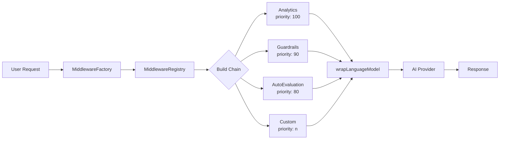
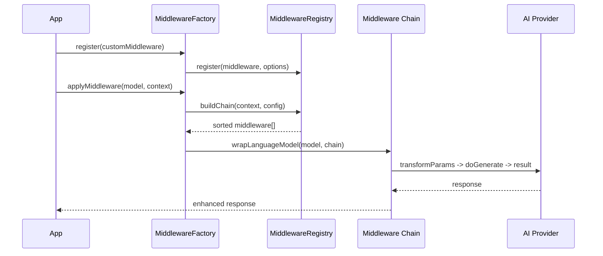

Every `generate()` call in production needed the same boilerplate: timing, token counting, PII filtering, content safety checks, and audit logging. We were copying this logic across every endpoint, and every copy drifted slightly from the others. The maintenance cost was quadratic.

The middleware system was the fix. NeuroLink wraps the language model itself using the AI SDK's `wrapLanguageModel`, so analytics, guardrails, and evaluation run transparently on both `generate()` and `stream()` with zero application code changes. A priority-based chain ensures correct execution order. A registry handles registration and conditional application. And because the factory catches middleware errors gracefully, a broken logger never takes down your AI pipeline.

This deep dive covers the full architecture: the `MiddlewareFactory` and `MiddlewareRegistry`, every built-in middleware (analytics at priority 100, guardrails at 90, auto-evaluation at 80), the custom middleware interface, conditional application by provider or model, and the execution statistics that keep your pipeline observable.

## Architecture overview

NeuroLink's middleware system is built around two core components: the `MiddlewareFactory` and the `MiddlewareRegistry`. Together, they manage registration, configuration, chain building, and execution tracking.



Here is how the pieces fit together:

- **MiddlewareFactory** (`factory.ts`): The orchestrator. It manages the registry, applies presets, merges configurations, and ultimately calls `wrapLanguageModel` with the assembled middleware chain. If anything goes wrong during middleware application, the factory returns the original model -- your requests never fail because of a middleware error.

- **MiddlewareRegistry** (`registry.ts`): The storage layer. It stores registered middleware, handles priority-based ordering, builds execution chains, and tracks execution statistics. The `buildChain()` method (lines 97-141 in the source) is where middleware are sorted by priority and filtered by conditions.

- **NeuroLinkMiddleware type**: Every middleware extends the `LanguageModelV1Middleware` interface with metadata -- an `id`, `name`, `description`, `priority`, and `defaultEnabled` flag. This metadata drives the registry's sorting, filtering, and reporting.

- **Priority system**: Higher priority numbers mean earlier execution in the chain. Analytics runs at priority 100 (first, to capture total time), guardrails at 90, and auto-evaluation at 80. Custom middleware slots in wherever you need it.

- **Conditional application**: Middleware can specify `MiddlewareConditions` to control when they run -- filter by provider, model, or a custom function. This means you can have different guardrails for different providers without if-statements in your application code.


## Built-in middleware deep dive

NeuroLink ships with three production-ready middleware out of the box. Each one addresses a critical production concern, and each is designed to work independently or in combination.

### Analytics middleware

The analytics middleware tracks token usage, response times, and model performance for every LLM call. It runs at priority 100, meaning it is the first middleware in the chain -- this is deliberate, because it needs to measure the total wall-clock time including all other middleware.

The middleware wraps both `wrapGenerate` and `wrapStream` hooks, extracting timing data and usage metrics from every response. The collected data is injected into `experimental_providerMetadata.neurolink.analytics`, making it available downstream without polluting the main response object.

```typescript
import { NeuroLink } from '@juspay/neurolink';

const neurolink = new NeuroLink();
const result = await neurolink.generate({
  input: { text: "Explain middleware patterns" },
  provider: "google-ai",
  middleware: {
    preset: "default", // analytics enabled by default
  },
});
// Analytics data available in provider metadata
```

Because analytics runs first in the chain, the timing data it captures includes latency added by guardrails, evaluation, and any custom middleware. This gives you the true end-to-end picture, not just the raw provider latency.

> **Note:** The `"default"` preset enables analytics automatically. You do not need any additional configuration to start tracking token usage and latency.
{: .prompt-info }

### Guardrails middleware

The guardrails middleware provides three layers of content protection, each independently configurable:

**1. Bad Words Filtering**

The simplest layer. It matches output text against regex patterns and string lists, replacing matches with configurable replacement text (default: `[REDACTED]`). This is fast, deterministic, and catches known patterns like email addresses, phone numbers, and SSNs.

**2. Model-Based Filtering**

A more sophisticated layer that uses a separate LLM to classify content as safe or unsafe. The secondary model evaluates the primary model's output and flags anything that violates your safety policies. Unsafe content is replaced with `<REDACTED BY AI GUARDRAIL>`.

**3. Precall Evaluation**

The most powerful layer. Before the main LLM call even happens, a secondary model evaluates the input for safety. The `PrecallEvaluationResult` includes an `overall` assessment (safe, unsafe, suspicious, or inappropriate), a `safetyScore`, and a `suggestedAction` (allow, block, sanitize, or warn). When `blockUnsafeRequests` is enabled, dangerous prompts never reach the primary model.

```typescript
const result = await neurolink.generate({
  input: { text: userInput },
  provider: "google-ai",
  middleware: {
    middlewareConfig: {
      guardrails: {
        enabled: true,
        config: {
          badWords: {
            enabled: true,
            regexPatterns: ["\\b[\\w.-]+@[\\w.-]+\\.\\w+\\b"],
            replacementText: "[REDACTED]",
          },
          precallEvaluation: {
            enabled: true,
            blockUnsafeRequests: true,
          },
        },
      },
    },
  },
});
```

The guardrails middleware applies to both `wrapGenerate` and `wrapStream`. For streaming responses, it filters each chunk as it arrives, so unsafe content is caught in real-time rather than only after the full response is assembled.

> **Note:** Guardrails run at priority 90, which means analytics has already started its timer before guardrails execute. The latency added by precall evaluation will be captured in your analytics data.
{: .prompt-info }

### Auto-evaluation middleware

The auto-evaluation middleware performs RAGAS-style quality assessment of every response. It scores outputs on relevance, accuracy, and completeness, providing a numerical quality gate for your AI pipeline.

Configuration is straightforward: set a `threshold` score (responses below this are flagged or retried), a `maxRetries` count, and a `blocking` flag that determines whether low-scoring responses are returned with a warning or blocked entirely.

This middleware is covered in depth in a dedicated post on model evaluation and scoring. For now, know that it runs at priority 80 and integrates seamlessly with the analytics and guardrails middleware above it.


## Presets: quick configuration

Configuring middleware individually for every request is tedious. NeuroLink solves this with presets -- named configurations that bundle middleware settings together.

Three built-in presets are registered during `MiddlewareFactory.initialize()`:

| Preset | Middleware Enabled | Use Case |
|--------|-------------------|-----------|
| `"default"` | Analytics only | Development, basic monitoring |
| `"all"` | Analytics + Guardrails | User-facing applications |
| `"security"` | Guardrails only | Security-focused pipelines |

You can also register custom presets for your specific needs:

```typescript
import { MiddlewareFactory } from '@juspay/neurolink/middleware';

const factory = new MiddlewareFactory();

// Use built-in preset
factory.applyMiddleware(model, context, { preset: "security" });

// Register custom preset
factory.registerPreset({
  name: "production",
  description: "Full production configuration",
  config: {
    analytics: { enabled: true },
    guardrails: {
      enabled: true,
      config: { precallEvaluation: { enabled: true } },
    },
    autoEvaluation: {
      enabled: true,
      config: { threshold: 7, maxRetries: 2 },
    },
  },
});
```

Preset values serve as defaults. If you specify explicit `middlewareConfig` values alongside a preset, the explicit values take precedence. This lets you start with a preset and override specific settings per-request without duplicating the entire configuration.

## Writing custom middleware

The built-in middleware covers common concerns, but every production application has unique requirements. NeuroLink's middleware interface is designed to make custom middleware straightforward to write and register.

### Custom middleware lifecycle



### Implementing the interface

A custom middleware implements the `NeuroLinkMiddleware` interface, which consists of a `metadata` object and up to three optional hook functions:

- **`transformParams`**: Modify request parameters before they are sent to the provider. This is the right place to inject system prompts, modify temperature, add metadata, or sanitize inputs.

- **`wrapGenerate`**: Wrap the synchronous generation call. You get access to `doGenerate()` (the function that calls the next middleware or the provider) and `params`. Use this for timing, caching, logging, or response transformation.

- **`wrapStream`**: Wrap the streaming generation call. Same pattern as `wrapGenerate` but for streaming responses.

Here is a complete example of a logging middleware:

```typescript
import type { NeuroLinkMiddleware } from '@juspay/neurolink/middleware';

const loggingMiddleware: NeuroLinkMiddleware = {
  metadata: {
    id: "custom-logging",
    name: "Request Logger",
    description: "Logs all AI requests and responses",
    priority: 95, // Run after analytics but before guardrails
    defaultEnabled: true,
  },

  transformParams: async ({ params }) => {
    console.log("[LOG] Request params:", JSON.stringify(params.prompt));
    return params;
  },

  wrapGenerate: async ({ doGenerate, params }) => {
    const start = Date.now();
    const result = await doGenerate();
    console.log(`[LOG] Generated in ${Date.now() - start}ms`);
    return result;
  },

  wrapStream: async ({ doStream, params }) => {
    console.log("[LOG] Stream started");
    return doStream();
  },
};

const factory = new MiddlewareFactory({
  middleware: [loggingMiddleware],
});
```

### Registration options

When registering custom middleware, the `factory.register()` method accepts options:

- **`replace`**: If `true`, replaces any existing middleware with the same ID. Useful for overriding built-in middleware.
- **`defaultEnabled`**: Controls whether the middleware is active by default.
- **`globalConfig`**: Configuration that applies to this middleware across all requests.

## Conditional middleware

Not every middleware should run on every request. NeuroLink's conditional middleware system lets you control exactly when middleware activates using the `MiddlewareConditions` type.

Four condition types are available:

- **`providers[]`**: Only run for specific providers (e.g., only apply guardrails to OpenAI and Anthropic).
- **`models[]`**: Only run for specific models (e.g., extra validation for GPT-4o but not GPT-4o-mini).
- **`options{}`**: Match against request options.
- **`custom(context) => boolean`**: A function that receives the full request context and returns whether the middleware should apply.

```typescript
const result = await neurolink.generate({
  input: { text: "Analyze this data" },
  provider: "anthropic",
  middleware: {
    middlewareConfig: {
      guardrails: {
        enabled: true,
        conditions: {
          providers: ["openai", "anthropic"],
          models: ["gpt-4o", "claude-sonnet-4-20250514"],
          custom: (ctx) => ctx.session?.userId !== "admin",
        },
      },
    },
  },
});
```

In this example, guardrails only apply when the provider is OpenAI or Anthropic, the model is GPT-4o or Claude Sonnet 4, and the user is not an admin. Admin users bypass guardrails entirely -- a common pattern for internal tooling.

Conditional middleware is particularly powerful in multi-tenant applications where different customers have different security requirements, or in development environments where you want to skip expensive middleware during testing.

## Execution statistics and monitoring

In production, you need to know how your middleware pipeline is performing. NeuroLink tracks detailed execution statistics for every middleware in the chain.

### Per-middleware metrics

The `MiddlewareRegistry.getAggregatedStats()` method returns metrics for each registered middleware:

- **`totalExecutions`**: How many times this middleware has run.
- **`successfulExecutions`**: How many times it completed without error.
- **`failedExecutions`**: How many times it threw an exception.
- **`averageExecutionTime`**: Mean execution time in milliseconds.
- **`lastExecutionTime`**: The most recent execution time.

The registry maintains a ring buffer of the last 100 executions per middleware (implemented at line 311 of `registry.ts`), providing a rolling window of performance data without unbounded memory growth.

### Chain-level summary

For a high-level view, `MiddlewareFactory.getChainStats()` aggregates metrics across the entire chain:

```typescript
const stats = factory.getChainStats(context, config);
console.log(`Applied: ${stats.appliedMiddleware}/${stats.totalMiddleware}`);
console.log(`Total time: ${stats.totalExecutionTime}ms`);
```

### Configuration validation

Before deploying a new middleware configuration, use `MiddlewareFactory.validateConfig()` to check for errors and warnings. It validates that referenced middleware exist, conditions are syntactically correct, and configuration values are within expected ranges. This catches misconfigurations at deploy time rather than at runtime.

## Best practices and common pitfalls

After building and operating middleware pipelines in production, here are the patterns that work and the mistakes to avoid.

### Priority ordering matters

The most common mistake is getting priority ordering wrong. Analytics should run first (highest priority) to capture total time. Guardrails should run second to block unsafe content before it reaches custom middleware. Custom middleware runs last.

If you put a caching middleware at a lower priority than guardrails, cached responses will bypass safety checks. If you put analytics at a lower priority than custom middleware, your timing data will not include custom middleware latency.

### Error handling is graceful by design

The `MiddlewareFactory` is designed to be resilient. If any middleware throws an error during `applyMiddleware()`, the factory catches it and returns the original, unwrapped model (line 183 of `factory.ts`). Your requests still succeed -- they just skip the failed middleware.

This is a deliberate design choice. In production, a broken logging middleware should never take down your AI pipeline. However, you should monitor `failedExecutions` in your stats to catch issues early.

### Performance considerations

Every middleware adds latency to every call. The analytics middleware adds microseconds. Bad word filtering adds milliseconds. Precall evaluation adds a full LLM round-trip -- potentially seconds.

Use `getChainStats()` to measure your pipeline's overhead. If middleware latency exceeds acceptable thresholds, consider:

- Disabling precall evaluation for low-risk internal endpoints
- Using conditions to skip expensive middleware for trusted users
- Moving heavy processing to async post-processing rather than inline middleware

### Testing middleware

Use `createContext()` to build test contexts that simulate different providers, models, and user sessions. This lets you verify conditional middleware behavior without making real API calls.

### Do not modify params in the wrong hook

A subtle but important rule: do not modify request parameters inside `wrapGenerate` or `wrapStream`. These hooks receive params as read-only context. If you need to modify parameters, use `transformParams` -- that is its explicit purpose.

## Conclusion

The middleware system separates infrastructure concerns from business logic. The architecture -- a factory-managed, priority-ordered chain wrapping the language model -- ensures that analytics, guardrails, and custom processing apply transparently to every `generate()` and `stream()` call without touching your application code.

Three entry points:

1. `"default"` preset for immediate analytics tracking
2. `"all"` preset for user-facing applications needing content guardrails
3. Custom middleware for domain-specific processing -- compliance logging, PII detection, response caching, validation

Priority ordering, graceful error handling, and `getChainStats()` make the pipeline observable and debuggable. The middleware pipeline is what separates a prototype from a production system.

## What's next

In the next post, we dive deep into the evaluation system that powers the auto-evaluation middleware, covering RAGAS-style scoring, custom evaluation criteria, and how to build quality gates that catch regressions before they reach your users.

---

**Related posts:**

- [How We Built NeuroLink's Provider Abstraction: 13 APIs, One Interface](/posts/provider-abstraction/)
- [Conversation Memory: Building Stateful AI Applications](/posts/conversation-memory-guide/)
- [Performance Benchmarking Guide for NeuroLink](/posts/performance-benchmarks/)
