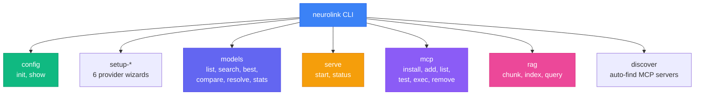

By the end of this guide, you will know every NeuroLink CLI command worth knowing -- from `config init` to `rag query` -- with the syntax, flags, and practical examples that save you from reading `--help` output.

The CLI is where you explore models, prototype prompts, manage MCP servers, and spin up API servers. It is the bridge between "I wonder if this model supports vision" and a working proof of concept. Every command supports `--format json` for scripting and `--debug` for verbose logging.

Getting started takes one line:

```bash
npm install -g @juspay/neurolink
npx @juspay/neurolink
```

Fifteen commands across seven groups. Let us walk through each one.

## CLI command map

Before we dive into individual commands, here is the full landscape:



Seven command groups, fifteen core commands. Let us walk through each one.

## Command 1: `neurolink config init` -- Interactive setup

Every NeuroLink journey starts here. The `config init` command launches an interactive wizard that walks you through initial configuration:

```bash
neurolink config init
# Interactive wizard:
# - Select default provider (auto, openai, bedrock, vertex, anthropic, azure, google-ai, huggingface, mistral)
# - Set output format (text, json, yaml)
# - Set temperature (0.0-2.0)
# - Configure evaluation domain (healthcare, analytics, finance, ecommerce)
# - Enable analytics/evaluation by default
# - Configure provider credentials
```

The wizard uses Inquirer.js for a clean, guided experience. Each step has sensible defaults -- press Enter to accept them and you will have a working configuration in under a minute.

Configuration is stored in `~/.neurolink/config.json`. This file is read by both the CLI and the SDK, so settings you configure here apply everywhere.

NeuroLink supports 9 providers out of the box: OpenAI, Bedrock, Vertex, Anthropic, Azure, Google AI, Hugging Face, Ollama, and Mistral. The wizard will prompt you for credentials specific to your chosen provider.

> **Note:** You can re-run `config init` at any time to update your configuration. Existing settings are preserved as defaults in the wizard prompts.
{: .prompt-info }

## Command 2: `neurolink config show` -- View current config

Before debugging an issue or sharing your setup with a teammate, `config show` gives you the full picture:

```bash
neurolink config show
# Shows: default provider, output format, temperature, max tokens,
#        configured providers with models, evaluation domains, config file location
```

This command displays every active setting, including which providers are configured, their selected models, evaluation domains, and the path to your config file. It is the first command to run when something is not working as expected.

## Commands 3-8: Provider setup wizards

Each supported provider has a dedicated setup command that validates credentials and lets you select from curated model lists:

```bash
# Quick setup for each provider
neurolink setup-openai      # Configure OpenAI (API key + model)
neurolink setup-anthropic   # Configure Anthropic (API key + model)
neurolink setup-bedrock     # Configure AWS Bedrock (region + credentials)
neurolink setup-gcp         # Configure Google Vertex AI (project + auth)
neurolink setup-azure       # Configure Azure OpenAI (endpoint + deployment)
neurolink setup-google-ai   # Configure Google AI Studio (API key + model)
```

Each wizard is tailored to its provider. The OpenAI wizard asks for an API key and lets you pick from the top 5 models. The Bedrock wizard asks for an AWS region and validates your IAM credentials. The Vertex wizard guides you through Google Cloud project selection and authentication.

The key benefit of these wizards over manual `.env` file editing is **validation**. Each wizard tests your credentials against the provider's API before saving the configuration. If your API key is invalid or your IAM role lacks permissions, you find out immediately -- not when your application crashes in production.

> **Note:** Provider setup commands update `~/.neurolink/config.json`. You can also set credentials via environment variables (`OPENAI_API_KEY`, `ANTHROPIC_API_KEY`, etc.), which take precedence over the config file.
{: .prompt-info }

## Command 9: `neurolink models` -- Model discovery

The `models` command is a Swiss Army knife for exploring what is available across all your configured providers. It has six subcommands, each serving a different discovery need.

### List Models

```bash
# List all available models
neurolink models list
neurolink models list --provider openai
neurolink models list --capability vision
neurolink models list --category coding
```

Without flags, `models list` shows every model across every configured provider. Add `--provider` to filter by provider, `--capability` to find models with specific features (vision, function calling, streaming), or `--category` to find models optimized for specific tasks (coding, reasoning, general).

### Search Models

```bash
# Search for models
neurolink models search vision
neurolink models search --use-case coding --max-cost 0.01
neurolink models search --min-context 100000
```

The `search` subcommand combines text search with structured filters. Find models by name, use case, cost ceiling, or minimum context window. This is invaluable when you are choosing between models for a new feature.

### Find the Best Model

```bash
# Get the best model for a task
neurolink models best --coding
neurolink models best --cost-effective --require-vision
neurolink models best --fast --exclude-providers ollama
```

The `best` subcommand uses NeuroLink's model knowledge base to recommend the optimal model for your constraints. Need the cheapest model with vision? The fastest model excluding local providers? The best coding model overall? This command has you covered.

### Resolve Aliases

```bash
# Resolve model aliases
neurolink models resolve claude-latest
neurolink models resolve fastest
```

NeuroLink supports model aliases like `claude-latest` or `fastest`. The `resolve` subcommand shows you exactly which model and provider an alias maps to.

### Compare Models

```bash
# Compare models side by side
neurolink models compare gpt-4o claude-sonnet-4-5-20250929 gemini-2.5-pro
```

The `compare` subcommand generates a side-by-side comparison table showing context window, pricing, capabilities, and performance characteristics for up to any number of models. Perfect for architecture decision records.

### Registry Statistics

```bash
# Registry statistics
neurolink models stats --detailed
```

The `stats` subcommand shows aggregate numbers: total models registered, models per provider, capability distribution, and pricing ranges. The `--detailed` flag breaks this down further.

## Command 10: `neurolink serve` -- HTTP server

When you need to expose NeuroLink as an HTTP API -- for non-TypeScript clients, for testing, or for production deployment -- the `serve` command spins up a server in seconds:

```bash
# Start server with defaults (Hono on port 3000)
neurolink serve

# Customize framework and port
neurolink serve --framework express --port 8080

# Full configuration
neurolink serve --cors --rate-limit 50 --swagger --watch

# With config file
neurolink serve --config server.config.json

# Check server status
neurolink serve status
neurolink serve status --format json
```

### Framework Support

The server supports four frameworks: **Hono** (default, lightweight, multi-runtime), **Express**, **Fastify**, and **Koa**. Hono is recommended for most use cases because it runs on Node.js, Bun, Deno, and Cloudflare Workers with zero configuration changes.

### Auto-Generated Endpoints

Every server instance automatically exposes:

| Endpoint | Description |
|----------|-------------|
| `/api/health` | Health check (for load balancers and k8s probes) |
| `/api/agent/execute` | Synchronous generation |
| `/api/agent/stream` | Streaming generation |
| `/api/tools` | List available tools |
| `/api/mcp/servers` | List MCP server configurations |

### Watch Mode

The `--watch` flag enables automatic restart on file changes -- ideal for development. Combined with `--swagger` for auto-generated API documentation, you get a complete development environment.

> **Note:** The `--rate-limit` flag accepts a number representing maximum requests per 15-minute window. For production, configure rate limiting per-endpoint via a config file.
{: .prompt-info }

## Commands 11-13: `neurolink mcp` -- MCP server management

The Model Context Protocol (MCP) lets your AI agent interact with external systems -- file systems, databases, APIs, browsers. NeuroLink's `mcp` commands manage the full lifecycle of MCP servers.

### Install Popular Servers

```bash
# Install popular MCP servers
neurolink mcp install filesystem
neurolink mcp install github
neurolink mcp install postgres
neurolink mcp install brave
```

NeuroLink maintains a registry of popular MCP servers: filesystem, github, postgres, sqlite, brave, puppeteer, git, memory, and bitbucket. The `install` command downloads, configures, and registers them automatically.

### Add Custom Servers

```bash
# Add custom MCP server
neurolink mcp add my-server node --args server.js --transport stdio
```

For custom MCP servers, the `add` command registers them with the transport protocol (stdio or SSE) and any required arguments.

### Manage Servers

```bash
# List configured servers
neurolink mcp list --status --detailed

# Test server connectivity
neurolink mcp test
neurolink mcp test filesystem

# Execute a tool directly
neurolink mcp exec filesystem read_file --params '{"path": "/tmp/test.txt"}'

# Remove a server
neurolink mcp remove old-server --force
```

The `test` command validates that each MCP server is reachable and responsive. The `exec` command lets you invoke individual tools directly from the terminal -- invaluable for debugging tool behavior without running a full agent loop.

### Auto-Discovery

```bash
# Auto-discover from Claude Desktop / VS Code
neurolink discover
neurolink discover --source claude-desktop --auto-install
```

If you already have MCP servers configured in Claude Desktop or VS Code, `discover` finds and imports them automatically. The `--auto-install` flag skips confirmation prompts.

## Commands 14-15: `neurolink rag` -- RAG operations

Retrieval-Augmented Generation starts with data preparation. The `rag` commands handle the full pipeline: chunking documents, indexing for search, and querying.

### Chunk Documents

```bash
# Chunk a document
neurolink rag chunk document.md
neurolink rag chunk data.csv --strategy recursive --maxSize 2000 --overlap 200
neurolink rag chunk paper.tex --strategy latex --extract --format json
neurolink rag chunk code.ts --strategy semantic --output chunks.json
```

NeuroLink supports ten chunking strategies, each optimized for different content types:

| Strategy | Best For |
|----------|----------|
| `character` | Simple text |
| `recursive` | General-purpose documents |
| `sentence` | Prose and articles |
| `token` | Token-budget-aware chunking |
| `markdown` | Markdown files |
| `html` | Web pages |
| `json` | Structured data |
| `latex` | Academic papers |
| `semantic` | Meaning-preserving chunks |
| `semantic-markdown` | Markdown with semantic boundaries |

The `--maxSize` and `--overlap` flags control chunk size and overlap between consecutive chunks. The `--extract` flag pulls out metadata (headers, tables, figures) alongside the text content.

### Index Documents

```bash
# Index for semantic search
neurolink rag index document.md --provider vertex
neurolink rag index data.csv --indexName sales-data --graph --verbose
```

The `index` command generates embeddings and stores them for retrieval. The `--provider` flag selects the embedding model provider. The `--graph` flag enables Graph RAG, which builds a knowledge graph alongside vector embeddings for richer retrieval.

### Query Indexed Documents

```bash
# Query indexed documents
neurolink rag query "quarterly revenue trends" --hybrid --topK 10
neurolink rag query "error handling patterns" --graph --format json
```

Three search modes are available:

- **Vector search** (default): Pure semantic similarity
- **Hybrid search** (`--hybrid`): Combines vector search with BM25 keyword matching
- **Graph RAG** (`--graph`): Traverses the knowledge graph for contextually rich results

The `--topK` flag controls how many results to return. Combine with `--format json` to pipe results into downstream processing.

## Output formats and piping

Every NeuroLink command supports multiple output formats, making it composable with standard Unix tools:

```bash
# JSON output for scripting
neurolink models list --format json | jq '.[] | select(.provider == "openai")'

# Compact output for quick scanning
neurolink mcp list --format compact

# Save to file
neurolink models stats --output model-stats.json

# Quiet mode (suppress spinners/decorations)
neurolink serve --quiet
```

The `--format json` flag is your best friend for automation. Pipe model lists to jq for filtering, save stats to files for dashboards, or parse MCP server configurations in shell scripts.

## Tips and tricks

These are the patterns that experienced NeuroLink users rely on daily:

- **Debug any command**: Add `--debug` to any command for verbose logging. When something fails, this is always the first step.

- **Chain commands**: `neurolink config init && neurolink serve` sets up and starts a server in one line.

- **Environment variables override config**: `OPENAI_API_KEY`, `ANTHROPIC_API_KEY`, and other provider-specific variables always take precedence over `~/.neurolink/config.json`. This is by design for CI/CD pipelines and container deployments.

- **Provider auto-detection**: If you do not specify a provider in `generate()` or `serve`, NeuroLink picks the best available provider based on which API keys are configured.

- **Embedding model auto-detection**: RAG commands automatically select the right embedding model for your configured provider. No need to specify embedding models manually unless you have a specific preference.

## Quick reference table

Bookmark this table for at-a-glance lookup:

| Command | Description |
|---------|-------------|
| `config init` | Interactive setup wizard |
| `config show` | View current configuration |
| `setup-openai` | Configure OpenAI provider |
| `setup-anthropic` | Configure Anthropic provider |
| `setup-bedrock` | Configure AWS Bedrock |
| `setup-gcp` | Configure Google Vertex AI |
| `setup-azure` | Configure Azure OpenAI |
| `setup-google-ai` | Configure Google AI Studio |
| `models list\|search\|best\|compare\|stats` | Model discovery |
| `serve` | Start HTTP server |
| `mcp install\|add\|list\|test\|exec\|remove` | MCP management |
| `rag chunk\|index\|query` | RAG operations |
| `discover` | Auto-discover MCP servers |

## What's next

You now know every CLI command that matters for daily development: `generate`, `stream`, `mcp`, `discover`, and `chunk`. The CLI is your exploration and operations layer -- once you have discovered the right models and tested your MCP servers, turn those experiments into production code.

Check out the [Getting Started with NeuroLink](/posts/getting-started-first-ai-app/) tutorial for the SDK equivalent of what you just learned, or dive into the [RAG Implementation Guide](/posts/rag-implementation/) for building retrieval-augmented generation applications.

---

**Related posts:**

- [OpenAI-Compatible Endpoints: Connect Any API to NeuroLink](/posts/openai-compatible-endpoints/)
- [Building RAG Applications with NeuroLink SDK](/posts/rag-implementation/)
- [MCP Tools: Extending AI with External Capabilities](/posts/mcp-tools-integration/)
