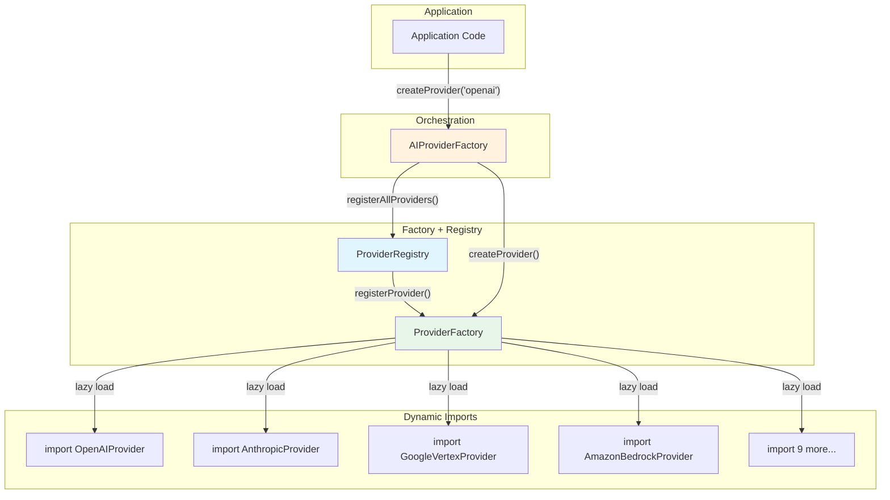

We designed the factory-registry pattern to solve a specific architectural constraint: thirteen providers that all need to be instantiated through a single interface, with circular dependencies threatening the entire module graph. This architecture separates **what can be created** from **what is registered**, and the trade-off -- deferred dynamic imports over static resolution -- is what makes the pipeline scale.

Thirteen providers. A factory that creates any of them. Providers that need types from the factory module. The circular dependency was inevitable -- and it crashed the TypeScript compiler the moment we tried to add provider number four.

The naive fix was `require()` calls and barrel export reordering. That scaled to about six providers before the import graph became unmaintainable. The real fix had to be architectural: separate **what can be created** (the Factory) from **what is registered** (the Registry), and use dynamic `import()` to defer module loading until the moment of instantiation.

The result: zero circular dependencies, zero unused provider loading, and adding provider number fourteen requires changing exactly one file. This post traces the pattern from the problem through the production code in NeuroLink's `providerFactory.ts` and `providerRegistry.ts`.

## The circular dependency problem

Here is the dependency cycle that breaks the naive approach:

`factory.ts` imports `providers/*.ts` (to instantiate them) which imports `types/index.ts` (for shared type definitions) which imports from `factory.ts` (to re-export factory types).

The comment at the top of NeuroLink's `factory.ts` captures the lesson learned:

```typescript
// From src/lib/core/factory.ts - The fix comment at the top of the file
// CIRCULAR DEPENDENCY FIX: Remove barrel export import
// Providers are now managed via ProviderFactory instead of direct imports
import { ProviderFactory } from "../factories/providerFactory.js";
import { ProviderRegistry } from "../factories/providerRegistry.js";
```

### Why Barrel Exports Amplify the Problem

Barrel exports (`index.ts` files that re-export everything from a directory) are convenient but dangerous in large codebases. When `types/index.ts` re-exports from 20 files, importing any single type from that barrel transitively imports all 20 files. If even one of those files imports from a module that imports the barrel, you have a cycle.

### Why `import type` Does Not Solve It

TypeScript's `import type` is erased at compile time, so it cannot create runtime circular dependencies. But when you need runtime behavior -- actually instantiating a provider class -- you need a runtime import. And runtime imports create runtime cycles.

The solution is to defer the runtime import until the moment of instantiation, using dynamic `import()`.


## The ProviderFactory: pure factory pattern

The `ProviderFactory` class is a textbook factory pattern. It maintains a `Map<string, ProviderRegistration>` and exposes three operations: register, create, and list.

The critical design decision: **the factory has zero knowledge of concrete provider implementations**. It stores constructor functions (or async factory functions), not imported classes. This means `providerFactory.ts` never imports `openAI.ts`, `anthropic.ts`, or any other provider file.

```typescript
// From src/lib/factories/providerFactory.ts
type ProviderConstructor =
  | { new (modelName?: string, providerName?: string, sdk?: UnknownRecord, region?: string): AIProvider }
  | ((modelName?: string, providerName?: string, sdk?: UnknownRecord, region?: string) => Promise<AIProvider>);

export class ProviderFactory {
  private static readonly providers = new Map<string, ProviderRegistration>();

  static registerProvider(
    name: AIProviderName | string,
    constructor: ProviderConstructor,
    defaultModel?: string,
    aliases: string[] = [],
  ): void {
    const registration: ProviderRegistration = { constructor, defaultModel, aliases };
    ProviderFactory.providers.set(name.toLowerCase(), registration);
    aliases.forEach((alias) => {
      ProviderFactory.providers.set(alias.toLowerCase(), registration);
    });
  }

  static async createProvider(
    providerName?: AIProviderName | string,
    modelName?: string,
    sdk?: UnknownRecord,
    region?: string,
  ): Promise<AIProvider> {
    const resolvedProviderName = providerName || process.env.NEUROLINK_PROVIDER || 'vertex';
    const registration = ProviderFactory.providers.get(resolvedProviderName.toLowerCase());
    if (!registration) {
      throw new Error(`Unknown provider: ${resolvedProviderName}. Available: ${ProviderFactory.getAvailableProviders().join(', ')}`);
    }
    // Create via factory function or constructor
    // ...
  }
}
```

Note the `ProviderConstructor` union type. It accepts either a synchronous constructor (`new (...)`) or an async factory function (`(...) => Promise<AIProvider>`). This flexibility is what enables the dynamic import pattern in the Registry.

The `registerProvider` method also handles aliases. When you register `"openai"` with aliases `["gpt", "chatgpt"]`, all three strings map to the same registration. Users can call `createProvider("gpt")` and get an OpenAI provider without knowing the canonical name.

## The ProviderRegistry: dynamic import registrar

If the `ProviderFactory` is the "what can be created" side, the `ProviderRegistry` is the "what is registered" side. It is the **only file in the entire codebase** that knows about concrete provider implementations. And even it does not import them directly -- it uses dynamic `import()`.

```typescript
// From src/lib/factories/providerRegistry.ts
export class ProviderRegistry {
  private static registered = false;

  static async registerAllProviders(): Promise<void> {
    if (this.registered) return;

    // Each provider uses dynamic import - no circular dependency
    ProviderFactory.registerProvider(
      AIProviderName.OPENAI,
      async (modelName?, _providerName?, sdk?) => {
        const { OpenAIProvider } = await import("../providers/openAI.js");
        return new OpenAIProvider(modelName, sdk as NeuroLink | undefined);
      },
      OpenAIModels.GPT_4O_MINI,
      ["gpt", "chatgpt"],
    );

    ProviderFactory.registerProvider(
      AIProviderName.ANTHROPIC,
      async (modelName?, _providerName?, sdk?) => {
        const { AnthropicProvider } = await import("../providers/anthropic.js");
        return new AnthropicProvider(modelName, sdk as NeuroLink | undefined);
      },
      AnthropicModels.CLAUDE_SONNET_4_0,
      ["claude", "anthropic"],
    );

    // ... 11 more providers registered the same way

    this.registered = true;
  }
}
```

Three design choices make this work:

### Lazy Loading via Dynamic `import()`

Each provider is wrapped in an async factory function that calls `await import(...)` only when that specific provider is instantiated. If your application uses only OpenAI, the Anthropic, Bedrock, Vertex, and other provider modules are never loaded. This is not just an architectural benefit -- it directly reduces cold start times in serverless environments and memory usage in all environments.

### Idempotent Registration

The `this.registered` flag ensures `registerAllProviders()` is safe to call multiple times. The first call registers everything; subsequent calls return immediately. This is important because multiple code paths might trigger registration, and double-registration would waste time and could cause issues if providers have initialization side effects.

### Aliases for Developer Experience

Each registration includes aliases that map informal names to canonical providers. `"claude"` maps to Anthropic. `"gpt"` maps to OpenAI. This is a small DX touch that eliminates friction -- developers do not need to look up canonical provider names.

## The AIProviderFactory: orchestration layer

The `ProviderFactory` and `ProviderRegistry` handle the factory pattern and provider registration. But the top-level `AIProviderFactory` in `core/factory.ts` orchestrates the full creation flow, including model resolution.

```typescript
// From src/lib/core/factory.ts - Resolution priority chain
static async createProvider(providerName: string, modelName?: string | null): Promise<AIProvider> {
  // PRIORITY 1: Check environment variables
  if (providerName.toLowerCase().includes("bedrock")) {
    const envModel = process.env.BEDROCK_MODEL || process.env.BEDROCK_MODEL_ID;
    if (envModel) resolvedModelName = envModel;
  }

  // PRIORITY 2: Dynamic model resolution (if no env var found)
  if (!resolvedModelName && dynamicModelProvider.needsRefresh()) {
    await this.initializeDynamicProviderWithTimeout();
  }

  // CRITICAL: Initialize providers before using them
  await ProviderRegistry.registerAllProviders();

  // Delegate to pure factory
  return await ProviderFactory.createProvider(normalizedName, finalModelName, sdk, region);
}
```

The model resolution priority chain is:

1. **Explicit parameter**: If you pass a model name directly, it wins.
2. **Environment variable**: Provider-specific env vars like `BEDROCK_MODEL` override defaults.
3. **Dynamic model resolution**: If enabled, NeuroLink queries a model selection service.
4. **Registry default**: The default model registered with the provider (e.g., `GPT_4O_MINI` for OpenAI).

The key line is `await ProviderRegistry.registerAllProviders()` -- this ensures the registry is initialized before any creation attempt. Because registration is idempotent, this is safe to call on every request.

## Architecture diagram

Here is the complete picture, from application code to provider instantiation:



The dependency arrows all flow downward. No module imports the module that imports it. The circle is broken.

## Why this pattern works at scale

After a year in production with 13 providers and counting, here is why the Factory + Registry pattern has proven durable.

### Adding a Provider is a One-File Change

To add a fourteenth provider, you add a single registration block in `providerRegistry.ts`. The factory, the application code, the CLI, the server adapter -- none of them change. The new provider is immediately available via `neurolink.generate({ provider: "new-provider" })`.

### Unused Providers Are Never Loaded

Dynamic imports mean that if you only use OpenAI in your application, the Anthropic, Bedrock, and Vertex modules are never loaded. In a serverless environment where cold start time matters, this is the difference between a 200ms cold start and a 2-second cold start.

### The Factory is Testable

Both `ProviderFactory` and `ProviderRegistry` expose `clearRegistrations()` methods for test isolation. In your test suite, you can register mock providers without loading real provider modules, and clear them between tests to avoid state leakage.

```typescript
// Test isolation
beforeEach(() => {
  ProviderFactory.clearRegistrations();
});

test('creates mock provider', async () => {
  ProviderFactory.registerProvider('mock', MockProvider, 'mock-model');
  const provider = await ProviderFactory.createProvider('mock');
  expect(provider).toBeInstanceOf(MockProvider);
});
```

### Aliases Provide DX Flexibility Without Code Branching

Instead of `if (name === "claude" || name === "anthropic")` scattered through your codebase, aliases handle normalization at the registration layer. Every downstream system works with canonical names.

### The Pattern is Reusable

NeuroLink's `ServerAdapterFactory` uses the same Factory + Registry pattern for web frameworks. Register Hono, Express, Fastify, and Koa as server adapters. Create them by name. Add new frameworks without changing the factory. The pattern scales across domains.

## When to use this pattern

The Factory + Registry pattern is not always necessary. For small codebases with 2-3 implementations, a simple switch statement or direct imports work fine. But consider this pattern when:

- You have **5+ implementations** of an interface and the count is growing.
- You face **circular dependencies** from barrel exports or shared types.
- You need **lazy loading** for performance (serverless, large modules).
- You want **one-file changes** when adding new implementations.
- You need **test isolation** without loading heavy dependencies.

The pattern adds indirection -- three files instead of one. But that indirection buys you a system that scales linearly with the number of implementations, rather than quadratically with the number of dependencies between them.

## Conclusion

Circular dependencies are a symptom of tangled responsibilities. The Factory + Registry pattern untangles them by separating three concerns: orchestration (AIProviderFactory decides what to create), creation (ProviderFactory knows how to create), and registration (ProviderRegistry knows what exists).

Dynamic `import()` makes it work at the module level. Aliases make it developer-friendly. Idempotent registration makes it safe. `clearRegistrations()` makes it testable.

The next time you hit a circular dependency error in a growing TypeScript codebase, the question is not about import paths -- it is about responsibilities that need to be separated.

---

**Related posts:**

- [The Middleware System: Analytics, Guardrails, and Custom Pipelines](/posts/middleware-system/)
- [Multi-Provider Failover: Never Lose an API Call](/posts/provider-failover-patterns/)
- [What is NeuroLink? The Unified AI SDK Explained](/posts/what-is-neurolink-unified-sdk/)
