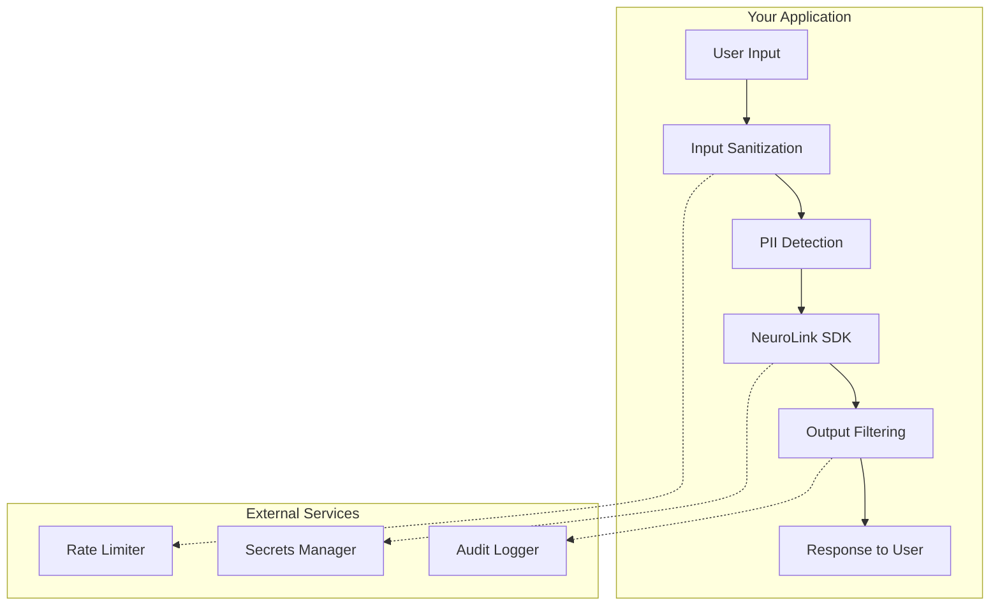

> **⚠️ Compliance Disclaimer**
>
> NeuroLink provides **building blocks** for compliance-ready applications, including:
> - Audit logging capabilities
> - Access control patterns
> - Data handling best practices
>
> However, **compliance certification is your responsibility** and depends on:
> 1. Your deployment configuration
> 2. Which AI providers you use (and their certifications)
> 3. Your organization's compliance program
>
> NeuroLink itself is not certified for HIPAA, SOC2, or GDPR. You must:
> - Deploy on certified infrastructure
> - Use providers with appropriate BAAs/DPAs
> - Implement your organization's compliance controls

Building secure AI applications requires defense in depth. While NeuroLink handles transport-layer security and provider authentication, application-level security remains your responsibility. This guide covers essential patterns for protecting your AI applications in production.

> **Roadmap Note**: Built-in security features (PII detection, rate limiting, audit logging, GDPR automation, HIPAA controls) are on the NeuroLink roadmap. This guide covers **implementation patterns you build yourself** using external tools and custom code - these are not built-in SDK features.
{: .prompt-warning }

## Security Architecture Overview

A secure AI application implements multiple layers of protection:



Each layer addresses specific security concerns:

- **Input Sanitization**: Prevents prompt injection and malicious content
- **PII Detection**: Protects sensitive user data from reaching AI providers
- **Output Filtering**: Removes inappropriate or sensitive content from responses
- **Rate Limiting**: Prevents abuse and controls costs
- **Audit Logging**: Enables compliance verification and incident investigation

## The Security Wrapper Pattern

Wrap your NeuroLink calls in a security layer that handles validation, filtering, and logging:

> **⚠️ Note:** This is application-level code you must implement. NeuroLink provides the SDK, not these specific features. You'll build security wrappers and validation logic yourself using the patterns shown below.
{: .prompt-warning }

```typescript
import { NeuroLink } from '@juspay/neurolink';

interface SecurityOptions {
  maxInputLength?: number;
  allowedTopics?: string[];
  auditLogger?: (event: AuditEvent) => void;
}

interface AuditEvent {
  timestamp: string;
  action: string;
  inputHash: string;
  userId?: string;
  success: boolean;
  errorType?: string;
}

// Security wrapper for AI generation
async function secureGenerate(
  userInput: string,
  userId?: string,
  options: SecurityOptions = {}
) {
  const { maxInputLength = 10000, auditLogger } = options;

  // 1. Sanitize input
  const sanitized = sanitizeInput(userInput, maxInputLength);

  // 2. Check for PII (manual or external service)
  if (containsPII(sanitized)) {
    auditLogger?.({
      timestamp: new Date().toISOString(),
      action: 'generate',
      inputHash: hashInput(sanitized),
      userId,
      success: false,
      errorType: 'pii_detected'
    });
    throw new Error('PII detected in input');
  }

  // 3. Call NeuroLink
  const neurolink = new NeuroLink();
  const result = await neurolink.generate({
    input: { text: sanitized },
    provider: 'openai',
    model: 'gpt-4',
  });

  // 4. Filter output
  const filtered = filterOutput(result.content);

  // 5. Log successful request
  auditLogger?.({
    timestamp: new Date().toISOString(),
    action: 'generate',
    inputHash: hashInput(sanitized),
    userId,
    success: true
  });

  return filtered;
}
```

## Input Sanitization

Sanitizing user input prevents prompt injection attacks and ensures content meets your application requirements.

### Basic Sanitization

```typescript
function sanitizeInput(input: string, maxLength: number = 10000): string {
  // Remove null bytes and control characters
  let sanitized = input.replace(/[\x00-\x08\x0B\x0C\x0E-\x1F\x7F]/g, '');

  // Normalize whitespace
  sanitized = sanitized.replace(/\s+/g, ' ').trim();

  // Enforce length limit
  if (sanitized.length > maxLength) {
    sanitized = sanitized.substring(0, maxLength);
  }

  return sanitized;
}
```

### Prompt Injection Prevention

Detect and block common prompt injection patterns:

```typescript
const INJECTION_PATTERNS = [
  /ignore\s+(all\s+)?(previous|prior|above)\s+instructions/i,
  /disregard\s+(all\s+)?(previous|prior|above)/i,
  /you\s+are\s+now\s+in\s+(\w+)\s+mode/i,
  /\[system\]/i,
  /\[INST\]/i,
  /<\|im_start\|>/i,
  /```system/i,
];

function detectPromptInjection(input: string): boolean {
  return INJECTION_PATTERNS.some(pattern => pattern.test(input));
}

function sanitizeWithInjectionCheck(input: string): string {
  const sanitized = sanitizeInput(input);

  if (detectPromptInjection(sanitized)) {
    throw new Error('Potential prompt injection detected');
  }

  return sanitized;
}
```

### Content Policy Enforcement

Block content that violates your application's policies:

```typescript
interface ContentPolicy {
  blockedTerms: string[];
  maxUrls: number;
  allowCode: boolean;
}

function enforceContentPolicy(
  input: string,
  policy: ContentPolicy
): { valid: boolean; reason?: string } {
  // Check blocked terms
  const lowercaseInput = input.toLowerCase();
  for (const term of policy.blockedTerms) {
    if (lowercaseInput.includes(term.toLowerCase())) {
      return { valid: false, reason: `Blocked term: ${term}` };
    }
  }

  // Count URLs
  const urlPattern = /https?:\/\/[^\s]+/gi;
  const urls = input.match(urlPattern) || [];
  if (urls.length > policy.maxUrls) {
    return { valid: false, reason: 'Too many URLs' };
  }

  // Check for code blocks if disallowed
  if (!policy.allowCode && /```[\s\S]*```/.test(input)) {
    return { valid: false, reason: 'Code blocks not allowed' };
  }

  return { valid: true };
}
```

## PII Detection

Protecting personally identifiable information requires detecting and handling sensitive data before it reaches AI providers. The patterns below show how to implement PII detection in your application layer.

### Pattern-Based Detection

Implement regex-based detection for common PII types:

```typescript
const PII_PATTERNS = {
  email: /[a-zA-Z0-9._%+-]+@[a-zA-Z0-9.-]+\.[a-zA-Z]{2,}/g,
  phone: /(\+\d{1,3}[-.]?)?\(?\d{3}\)?[-.]?\d{3}[-.]?\d{4}/g,
  ssn: /\b\d{3}[-]?\d{2}[-]?\d{4}\b/g,
  creditCard: /\b\d{4}[-\s]?\d{4}[-\s]?\d{4}[-\s]?\d{4}\b/g,
  ipAddress: /\b\d{1,3}\.\d{1,3}\.\d{1,3}\.\d{1,3}\b/g,
};

interface PIIDetectionResult {
  hasPII: boolean;
  types: string[];
  positions: { type: string; start: number; end: number }[];
}

function detectPII(input: string): PIIDetectionResult {
  const result: PIIDetectionResult = {
    hasPII: false,
    types: [],
    positions: []
  };

  for (const [type, pattern] of Object.entries(PII_PATTERNS)) {
    let match;
    // Reset regex state
    pattern.lastIndex = 0;

    while ((match = pattern.exec(input)) !== null) {
      result.hasPII = true;
      if (!result.types.includes(type)) {
        result.types.push(type);
      }
      result.positions.push({
        type,
        start: match.index,
        end: match.index + match[0].length
      });
    }
  }

  return result;
}

function containsPII(input: string): boolean {
  return detectPII(input).hasPII;
}
```

### PII Redaction

Replace detected PII with placeholder tokens:

```typescript
function redactPII(input: string): string {
  let redacted = input;

  const replacements: Record<string, string> = {
    email: '[EMAIL]',
    phone: '[PHONE]',
    ssn: '[SSN]',
    creditCard: '[CREDIT_CARD]',
    ipAddress: '[IP_ADDRESS]',
  };

  for (const [type, pattern] of Object.entries(PII_PATTERNS)) {
    redacted = redacted.replace(pattern, replacements[type] || '[REDACTED]');
  }

  return redacted;
}
```

### External PII Detection Services

For production applications, consider dedicated PII detection services:

```typescript
// Example integration with external PII detection
interface PIIService {
  detect(text: string): Promise<PIIDetectionResult>;
  redact(text: string): Promise<string>;
}

// Wrapper that uses external service with local fallback
async function detectPIIWithFallback(
  input: string,
  externalService?: PIIService
): Promise<PIIDetectionResult> {
  if (externalService) {
    try {
      return await externalService.detect(input);
    } catch (error) {
      console.warn('External PII service unavailable, using local detection');
    }
  }

  // Fall back to local detection
  return detectPII(input);
}
```

## Output Filtering

Filter AI responses to remove sensitive content, enforce format requirements, and ensure compliance with your content policies.

### Basic Output Filtering

```typescript
function filterOutput(output: string): string {
  let filtered = output;

  // Remove any PII that might appear in output
  filtered = redactPII(filtered);

  // Remove potential prompt leakage
  filtered = removePromptLeakage(filtered);

  // Enforce content policies
  filtered = enforceOutputPolicies(filtered);

  return filtered;
}

function removePromptLeakage(output: string): string {
  // Remove system prompt patterns that might leak
  const leakagePatterns = [
    /\[?system\]?:.*?(?=\n|$)/gi,
    /instructions?:.*?(?=\n\n|$)/gi,
    /you are an? .*? assistant/gi,
  ];

  let cleaned = output;
  for (const pattern of leakagePatterns) {
    cleaned = cleaned.replace(pattern, '');
  }

  return cleaned.trim();
}

function enforceOutputPolicies(output: string): string {
  // Remove URLs if your policy requires it
  // output = output.replace(/https?:\/\/[^\s]+/g, '[URL removed]');

  // Truncate excessively long responses
  const maxLength = 50000;
  if (output.length > maxLength) {
    output = output.substring(0, maxLength) + '...';
  }

  return output;
}
```

### Content Safety Filtering

```typescript
interface SafetyCheckResult {
  safe: boolean;
  categories: string[];
  action: 'allow' | 'warn' | 'block';
}

function checkOutputSafety(output: string): SafetyCheckResult {
  const categories: string[] = [];

  // Check for potentially harmful content patterns
  const harmfulPatterns = [
    { pattern: /how to (make|build|create) (a )?(bomb|weapon|explosive)/i, category: 'violence' },
    { pattern: /hack(ing)? (into|someone)/i, category: 'illegal' },
  ];

  for (const { pattern, category } of harmfulPatterns) {
    if (pattern.test(output)) {
      categories.push(category);
    }
  }

  if (categories.length > 0) {
    return { safe: false, categories, action: 'block' };
  }

  return { safe: true, categories: [], action: 'allow' };
}
```

## API Key Management

Proper API key handling is critical for securing your AI application.

### Environment-Based Configuration

Never hardcode API keys. Use environment variables with validation.

> **Important**: NeuroLink does not have its own API key. Instead, it uses provider-specific API keys directly (e.g., `OPENAI_API_KEY`, `ANTHROPIC_API_KEY`, `GOOGLE_API_KEY`). You configure keys for each AI provider you want to use.
{: .prompt-warning }

```typescript
interface ProviderAPIConfig {
  openai?: string;
  anthropic?: string;
  google?: string;
}

function loadProviderConfig(): ProviderAPIConfig {
  const config: ProviderAPIConfig = {
    openai: process.env.OPENAI_API_KEY,
    anthropic: process.env.ANTHROPIC_API_KEY,
    google: process.env.GOOGLE_API_KEY,
  };

  // Validate that at least one provider key is configured
  const hasProvider = Object.values(config).some(key => !!key);
  if (!hasProvider) {
    throw new Error('At least one provider API key must be configured (OPENAI_API_KEY, ANTHROPIC_API_KEY, etc.)');
  }

  // Validate OpenAI key format if provided
  if (config.openai && !config.openai.startsWith('sk-')) {
    console.warn('OpenAI API key may be invalid - expected sk- prefix');
  }

  return config;
}
```

### Secret Manager Integration

For production deployments, use a secrets manager:

```typescript
// AWS Secrets Manager example
import { SecretsManagerClient, GetSecretValueCommand } from '@aws-sdk/client-secrets-manager';

async function getAPIKeyFromSecretsManager(secretName: string): Promise<string> {
  const client = new SecretsManagerClient({ region: process.env.AWS_REGION });

  const command = new GetSecretValueCommand({ SecretId: secretName });
  const response = await client.send(command);

  if (!response.SecretString) {
    throw new Error(`Secret ${secretName} not found`);
  }

  const secrets = JSON.parse(response.SecretString);
  return secrets.apiKey;
}

// HashiCorp Vault example
import Vault from 'node-vault';

async function getAPIKeyFromVault(path: string): Promise<string> {
  const vault = Vault({
    apiVersion: 'v1',
    endpoint: process.env.VAULT_ADDR,
    token: process.env.VAULT_TOKEN,
  });

  const result = await vault.read(path);
  return result.data.apiKey;
}
```

### Key Rotation Support

Design your application to handle key rotation gracefully:

```typescript
class APIKeyManager {
  private currentKey: string;
  private keySource: () => Promise<string>;
  private refreshInterval: number;

  constructor(keySource: () => Promise<string>, refreshIntervalMs: number = 3600000) {
    this.keySource = keySource;
    this.refreshInterval = refreshIntervalMs;
    this.currentKey = '';

    // Start periodic refresh
    this.startRefreshLoop();
  }

  async getKey(): Promise<string> {
    if (!this.currentKey) {
      this.currentKey = await this.keySource();
    }
    return this.currentKey;
  }

  private startRefreshLoop(): void {
    setInterval(async () => {
      try {
        this.currentKey = await this.keySource();
        console.log('API key refreshed successfully');
      } catch (error) {
        console.error('Failed to refresh API key:', error);
        // Keep using existing key on refresh failure
      }
    }, this.refreshInterval);
  }
}
```

## Rate Limiting

Protect your application from abuse with rate limiting. Use external services or middleware since NeuroLink does not provide built-in rate limiting.

> **⚠️ Note:** This is application-level code you must implement. NeuroLink provides the SDK, not built-in rate limiting. You will need to build rate limiting logic using external libraries or custom code as shown in the patterns below.
{: .prompt-warning }

### Token Bucket Implementation

```typescript
class TokenBucket {
  private tokens: number;
  private lastRefill: number;
  private readonly maxTokens: number;
  private readonly refillRate: number; // tokens per second

  constructor(maxTokens: number, refillRate: number) {
    this.maxTokens = maxTokens;
    this.refillRate = refillRate;
    this.tokens = maxTokens;
    this.lastRefill = Date.now();
  }

  tryConsume(tokens: number = 1): boolean {
    this.refill();

    if (this.tokens >= tokens) {
      this.tokens -= tokens;
      return true;
    }

    return false;
  }

  private refill(): void {
    const now = Date.now();
    const elapsed = (now - this.lastRefill) / 1000;
    const tokensToAdd = elapsed * this.refillRate;

    this.tokens = Math.min(this.maxTokens, this.tokens + tokensToAdd);
    this.lastRefill = now;
  }
}
```

### Per-User Rate Limiting

```typescript
class RateLimiter {
  private buckets: Map<string, TokenBucket> = new Map();
  private readonly maxTokens: number;
  private readonly refillRate: number;

  constructor(maxRequestsPerMinute: number) {
    this.maxTokens = maxRequestsPerMinute;
    this.refillRate = maxRequestsPerMinute / 60;
  }

  checkLimit(userId: string): { allowed: boolean; retryAfter?: number } {
    let bucket = this.buckets.get(userId);

    if (!bucket) {
      bucket = new TokenBucket(this.maxTokens, this.refillRate);
      this.buckets.set(userId, bucket);
    }

    if (bucket.tryConsume()) {
      return { allowed: true };
    }

    return {
      allowed: false,
      retryAfter: Math.ceil(1 / this.refillRate)
    };
  }
}

// Usage in your API handler
const rateLimiter = new RateLimiter(60); // 60 requests per minute

async function handleRequest(userId: string, input: string) {
  const { allowed, retryAfter } = rateLimiter.checkLimit(userId);

  if (!allowed) {
    throw new Error(`Rate limit exceeded. Retry after ${retryAfter} seconds`);
  }

  return secureGenerate(input, userId);
}
```

### Redis-Based Distributed Rate Limiting

For distributed applications, use Redis:

```typescript
import Redis from 'ioredis';

class DistributedRateLimiter {
  private redis: Redis;
  private windowMs: number;
  private maxRequests: number;

  constructor(redisUrl: string, windowMs: number, maxRequests: number) {
    this.redis = new Redis(redisUrl);
    this.windowMs = windowMs;
    this.maxRequests = maxRequests;
  }

  async checkLimit(key: string): Promise<{ allowed: boolean; remaining: number }> {
    const now = Date.now();
    const windowStart = now - this.windowMs;

    // Use Redis sorted set for sliding window
    const pipeline = this.redis.pipeline();
    pipeline.zremrangebyscore(key, 0, windowStart);
    pipeline.zadd(key, now, `${now}-${Math.random()}`);
    pipeline.zcard(key);
    pipeline.expire(key, Math.ceil(this.windowMs / 1000));

    const results = await pipeline.exec();
    const count = results?.[2]?.[1] as number || 0;

    return {
      allowed: count <= this.maxRequests,
      remaining: Math.max(0, this.maxRequests - count)
    };
  }
}
```

## Audit Logging

Comprehensive audit logging enables compliance verification, security monitoring, and incident investigation. The patterns below show how to implement audit logging in your application - this is not a built-in NeuroLink feature.

### Structured Audit Events

```typescript
interface AuditEvent {
  timestamp: string;
  eventId: string;
  eventType: 'request' | 'response' | 'error' | 'security';
  action: string;
  userId?: string;
  sessionId?: string;

  // Request details (hashed/redacted for privacy)
  inputHash: string;
  inputLength: number;

  // Response details
  outputLength?: number;
  provider?: string;
  model?: string;
  tokensUsed?: number;
  latencyMs?: number;

  // Security details
  ipAddress?: string;
  userAgent?: string;
  securityFlags?: string[];

  // Outcome
  success: boolean;
  errorType?: string;
  errorMessage?: string;
}

function createAuditEvent(
  action: string,
  input: string,
  userId?: string
): Partial<AuditEvent> {
  return {
    timestamp: new Date().toISOString(),
    eventId: crypto.randomUUID(),
    eventType: 'request',
    action,
    userId,
    inputHash: hashInput(input),
    inputLength: input.length,
  };
}

function hashInput(input: string): string {
  return crypto.createHash('sha256').update(input).digest('hex').substring(0, 16);
}
```

### Audit Logger Implementation

```typescript
interface AuditLoggerConfig {
  destination: 'console' | 'file' | 'service';
  filePath?: string;
  serviceUrl?: string;
  batchSize?: number;
  flushIntervalMs?: number;
}

class AuditLogger {
  private config: AuditLoggerConfig;
  private buffer: AuditEvent[] = [];

  constructor(config: AuditLoggerConfig) {
    this.config = config;

    if (config.batchSize && config.flushIntervalMs) {
      setInterval(() => this.flush(), config.flushIntervalMs);
    }
  }

  log(event: AuditEvent): void {
    if (this.config.batchSize) {
      this.buffer.push(event);
      if (this.buffer.length >= this.config.batchSize) {
        this.flush();
      }
    } else {
      this.writeEvent(event);
    }
  }

  private writeEvent(event: AuditEvent): void {
    const logLine = JSON.stringify(event);

    switch (this.config.destination) {
      case 'console':
        console.log(logLine);
        break;
      case 'file':
        // Append to file (use proper file rotation in production)
        require('fs').appendFileSync(this.config.filePath!, logLine + '\n');
        break;
      case 'service':
        // Send to logging service asynchronously
        this.sendToService([event]).catch(console.error);
        break;
    }
  }

  private async flush(): Promise<void> {
    if (this.buffer.length === 0) return;

    const events = [...this.buffer];
    this.buffer = [];

    if (this.config.destination === 'service') {
      await this.sendToService(events);
    } else {
      events.forEach(event => this.writeEvent(event));
    }
  }

  private async sendToService(events: AuditEvent[]): Promise<void> {
    await fetch(this.config.serviceUrl!, {
      method: 'POST',
      headers: { 'Content-Type': 'application/json' },
      body: JSON.stringify({ events }),
    });
  }
}
```

### Integration Example

Putting it all together:

```typescript
import { NeuroLink } from '@juspay/neurolink';

// Initialize components
const rateLimiter = new RateLimiter(60);
const auditLogger = new AuditLogger({
  destination: 'service',
  serviceUrl: process.env.AUDIT_LOG_URL,
  batchSize: 100,
  flushIntervalMs: 5000,
});

async function secureAIRequest(
  userInput: string,
  userId: string,
  sessionId: string
): Promise<string> {
  const startTime = Date.now();
  const auditEvent = createAuditEvent('generate', userInput, userId) as AuditEvent;
  auditEvent.sessionId = sessionId;

  try {
    // Rate limiting
    const { allowed } = rateLimiter.checkLimit(userId);
    if (!allowed) {
      auditEvent.success = false;
      auditEvent.errorType = 'rate_limit_exceeded';
      auditEvent.securityFlags = ['rate_limited'];
      auditLogger.log(auditEvent);
      throw new Error('Rate limit exceeded');
    }

    // Input validation
    const sanitized = sanitizeWithInjectionCheck(userInput);

    // PII check
    const piiResult = detectPII(sanitized);
    if (piiResult.hasPII) {
      auditEvent.success = false;
      auditEvent.errorType = 'pii_detected';
      auditEvent.securityFlags = ['pii_blocked', ...piiResult.types];
      auditLogger.log(auditEvent);
      throw new Error('PII detected in input');
    }

    // Make AI request
    const neurolink = new NeuroLink();
    const result = await neurolink.generate({
      input: { text: sanitized },
      provider: 'openai',
      model: 'gpt-4',
    });

    // Filter output
    const filtered = filterOutput(result.content);

    // Log success
    auditEvent.success = true;
    auditEvent.outputLength = filtered.length;
    auditEvent.provider = 'openai';
    auditEvent.model = 'gpt-4';
    auditEvent.latencyMs = Date.now() - startTime;
    auditLogger.log(auditEvent);

    return filtered;

  } catch (error) {
    if (!auditEvent.errorType) {
      auditEvent.success = false;
      auditEvent.errorType = error instanceof Error ? error.name : 'unknown';
      auditEvent.errorMessage = error instanceof Error ? error.message : 'Unknown error';
      auditLogger.log(auditEvent);
    }
    throw error;
  }
}
```

## Security Checklist

Use this checklist when deploying AI applications to production:

### Input Security
- [ ] Implement input sanitization for all user inputs
- [ ] Add prompt injection detection and prevention
- [ ] Enforce input length limits
- [ ] Validate content against your content policy

### Data Privacy
- [ ] Implement PII detection before sending to AI providers
- [ ] Configure PII handling (redact, reject, or encrypt)
- [ ] Document data flows for compliance purposes
- [ ] Consider using a dedicated PII detection service

### API Key Management
- [ ] Store API keys in environment variables or secrets manager
- [ ] Never commit API keys to source control
- [ ] Implement key rotation procedures
- [ ] Use separate keys for development and production

### Rate Limiting
- [ ] Implement per-user rate limiting
- [ ] Set appropriate limits based on your use case
- [ ] Return meaningful error messages with retry information
- [ ] Monitor for rate limit abuse patterns

### Output Security
- [ ] Filter AI outputs for PII and sensitive content
- [ ] Check outputs against content safety policies
- [ ] Implement output length limits
- [ ] Log filtered content for security review

### Audit Logging
- [ ] Log all AI requests with appropriate detail
- [ ] Hash or redact sensitive data in logs
- [ ] Implement log retention policies
- [ ] Set up alerts for security-relevant events

## Conclusion

Security for AI applications requires a layered approach combining input validation, data protection, access control, and comprehensive logging. While NeuroLink provides secure transport and provider authentication, implementing application-level security controls is essential for protecting your users and meeting compliance requirements.

The patterns in this guide provide a foundation for building secure AI applications. Adapt them to your specific requirements, regulatory environment, and risk tolerance. Security is an ongoing process - regularly review and update your security controls as threats evolve and new best practices emerge.

---

*Questions about securing your AI application? Join our [Discord community](https://discord.gg/neurolink) or reach out at security@neurolink.ink.*
