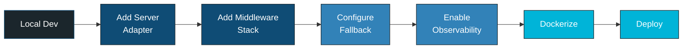
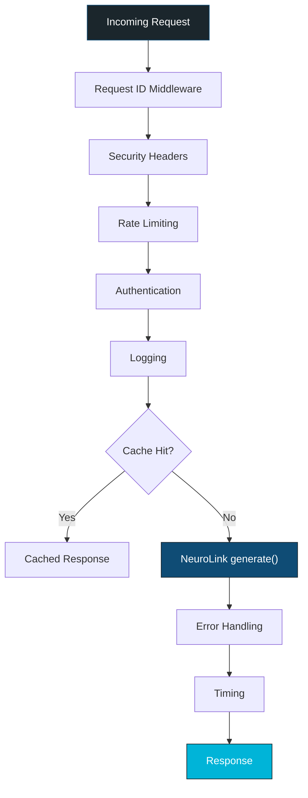
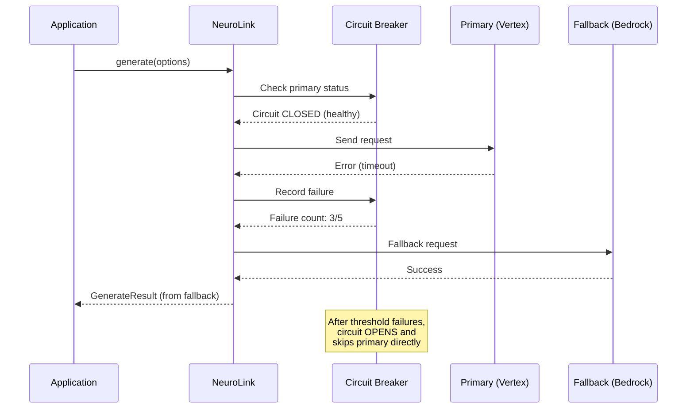
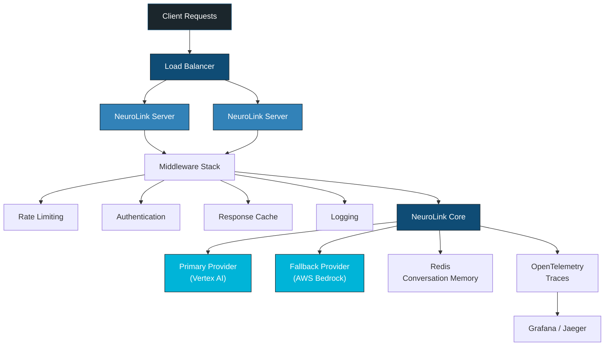

Your NeuroLink prototype works locally and you are not sure what to do next. That is totally normal -- the jump from `npx ts-node app.ts` to a production deployment sounds intimidating, but NeuroLink handles most of the hard parts for you. Let's walk through it step by step.

You will take a working NeuroLink script and turn it into a production HTTP API with server adapters, environment configuration, rate limiting, observability, provider failover, conversation memory, and Docker containerization. Each section builds on the last, so by the end you will have a deployment-ready application.

## The deployment path



Each step is incremental. You can deploy after any step and add more production hardening later.

## Section 1: From script to server

A NeuroLink prototype is typically a script that calls `neurolink.generate()`. To serve it over HTTP, wrap it in a server adapter.

NeuroLink supports four frameworks through its `createServer()` API:

| Framework | Best For | Runtime Support |
|-----------|----------|-----------------|
| **Hono** (recommended) | Lightweight, multi-runtime | Node.js, Bun, Deno, Cloudflare Workers |
| **Express** | Existing Express apps | Node.js |
| **Fastify** | High-performance Node.js | Node.js |
| **Koa** | Middleware-first architecture | Node.js |

Hono is the default recommendation because it runs on every major JavaScript runtime with zero configuration changes. If you are starting fresh, use Hono. If you have an existing Express or Fastify application, use the corresponding adapter.

Here is a complete production server in 15 lines:

```typescript
import { NeuroLink } from '@juspay/neurolink';
import { createServer } from '@juspay/neurolink/server';

const neurolink = new NeuroLink({
  observability: {
    openTelemetry: { enabled: true },
    langfuse: { enabled: true }
  }
});

const server = await createServer(neurolink, {
  framework: 'hono',
  config: {
    port: parseInt(process.env.PORT || '3000'),
    host: '0.0.0.0'
  }
});

await server.initialize();
await server.start();
console.log(`NeuroLink server running on port ${process.env.PORT || 3000}`);
```

The server automatically exposes these endpoints:

| Endpoint | Method | Description |
|----------|--------|-------------|
| `/generate` | POST | Synchronous generation |
| `/stream` | POST | Streaming generation |
| `/tools` | GET | List available tools |
| `/health` | GET | Health check |

The `ServerAdapterConfig` type controls framework, port, host, CORS, and logging settings.

## Section 2: Environment configuration

NeuroLink auto-loads `.env` files via dotenv. In development, this is convenient. In production, use platform-specific secrets management.

### Required Environment Variables by Provider

| Provider | Required Variables |
|----------|-------------------|
| OpenAI | `OPENAI_API_KEY`, optionally `OPENAI_MODEL` |
| Anthropic | `ANTHROPIC_API_KEY` |
| Google Vertex | `VERTEX_PROJECT_ID`, Google credentials |
| AWS Bedrock | AWS credentials, `BEDROCK_MODEL` or `BEDROCK_MODEL_ID` |
| Azure | `AZURE_OPENAI_API_KEY`, `AZURE_OPENAI_ENDPOINT`, `AZURE_OPENAI_MODEL` |
| Google AI | `GOOGLE_API_KEY` |

### Automatic Provider Selection

If you configure multiple providers, NeuroLink can automatically select the best available one:

```typescript
import { createBestAIProvider, createAIProviderWithFallback } from '@juspay/neurolink';

// Option A: Automatic -- uses whichever provider has keys configured
const provider = await createBestAIProvider();

// Option B: Explicit fallback chain
const { primary, fallback } = await createAIProviderWithFallback(
  'vertex',    // Primary: Google Vertex AI
  'bedrock'    // Fallback: AWS Bedrock
);
```

`createBestAIProvider()` inspects configured environment variables and selects the provider with the highest priority. This is useful in CI/CD environments where different stages have different providers configured.

> **Heads up:** Never commit `.env` files to version control. In production, use your platform's secrets management -- AWS Secrets Manager, Google Secret Manager, Azure Key Vault, or Kubernetes secrets all work great.
{: .prompt-info }

## Section 3: Adding production middleware

NeuroLink exports pre-built HTTP middleware that you can stack on your server adapter. Here is the full middleware stack for a production deployment:



The available middleware includes:

- **`createRateLimitMiddleware()`** -- Request rate limiting with `InMemoryRateLimitStore`
- **`createCacheMiddleware()`** -- Response caching with `InMemoryCacheStore`
- **`createAuthMiddleware()`** -- API key or JWT authentication
- **`createLoggingMiddleware()`** -- Structured request/response logging
- **`createErrorHandlingMiddleware()`** -- Standardized error responses
- **`createTimingMiddleware()`** -- Response time tracking
- **`createSecurityHeadersMiddleware()`** -- Security headers (HSTS, CSP, etc.)
- **`createRequestIdMiddleware()`** -- Correlation IDs for distributed tracing
- **`createCompressionMiddleware()`** -- Response compression

You can also use the `MiddlewareFactory` for preset configurations. The `"production"` preset enables the most common middleware with sensible defaults.

## Section 4: Provider fallback for reliability

A single-provider architecture is a single point of failure. When your provider goes down -- and it will -- your application goes down with it.

NeuroLink's fallback system handles this automatically:



The built-in `CircuitBreaker` class prevents cascading failures. After a configurable number of consecutive failures, the circuit "opens" and subsequent requests skip the primary provider entirely, going directly to the fallback. After a cooldown period, the circuit "half-opens" and tests the primary with a single request.

Supporting utilities:

- **`withRetry()`**: Automatic retry with exponential backoff. Controlled by `RETRY_ATTEMPTS` and `RETRY_DELAYS` constants.
- **`withTimeout()`**: Prevents hanging requests. Controlled by `PROVIDER_TIMEOUTS` constants.

For multi-region deployments, configure your primary on one cloud provider and your fallback on another:

```typescript
const { primary, fallback } = await createAIProviderWithFallback(
  'vertex',    // Primary: Google Vertex AI (us-central1)
  'bedrock'    // Fallback: AWS Bedrock (us-east-1)
);
```

## Section 5: Observability and monitoring

In production, you need to answer questions like: How many tokens are we consuming? Which prompts are slow? What is our error rate by provider? How much are we spending per feature?

NeuroLink provides observability at three levels:

### OpenTelemetry Integration

```typescript
import {
  initializeOpenTelemetry,
  shutdownOpenTelemetry,
  flushOpenTelemetry,
  initializeTelemetry,
  getTelemetryStatus
} from '@juspay/neurolink';

// Initialize observability
await initializeOpenTelemetry({
  serviceName: 'my-neurolink-app',
  exporterUrl: process.env.OTEL_EXPORTER_OTLP_ENDPOINT
});

await initializeTelemetry();
const status = await getTelemetryStatus();
console.log('Telemetry:', status);

// Graceful shutdown
process.on('SIGTERM', async () => {
  await flushOpenTelemetry();
  await shutdownOpenTelemetry();
  process.exit(0);
});
```

Export traces to any OTLP-compatible backend: Jaeger, Grafana Tempo, Datadog, Honeycomb, or New Relic. Every `generate()` and `stream()` call is traced with provider, model, token usage, latency, and error information.

### Langfuse Integration

For AI-specific monitoring that goes beyond generic tracing, Langfuse integration provides prompt versioning, evaluation tracking, and per-prompt cost breakdowns. Configure it in the NeuroLink constructor:

```typescript
const neurolink = new NeuroLink({
  observability: {
    langfuse: { enabled: true }
  }
});
```

### Analytics Middleware

The built-in analytics middleware collects per-request metrics automatically. Use `getAnalyticsMetrics()` to retrieve aggregated data for dashboards and alerts.

> **Heads up:** Always implement graceful shutdown with `flushOpenTelemetry()` and `shutdownOpenTelemetry()`. Without flushing, the last batch of traces can be lost when the process exits -- and missing traces are hard to debug.
{: .prompt-info }

## Section 6: HITL security for regulated deployments

If your application operates in a regulated domain -- financial services, healthcare, legal -- you need human approval for certain AI-driven actions. NeuroLink's HITL (Human-in-the-Loop) manager provides this out of the box.

```typescript
import { NeuroLink } from '@juspay/neurolink';

const neurolink = new NeuroLink({
  hitl: {
    enabled: true,
    dangerousActions: ['writeFile', 'executeCode', 'sendEmail'],
  }
});

// Tools matching dangerousActions keywords will pause for human approval
const result = await neurolink.generate({
  input: { text: 'Update the configuration file with new settings' },
  provider: 'openai',
  model: 'gpt-4o'
});
```

When the AI agent attempts to call a tool that matches a `dangerousActions` keyword, execution pauses. The HITL manager emits a confirmation event that your application handles -- typically by showing the proposed action in a UI for human review. The reviewer can approve, reject, or modify the parameters.

This pattern satisfies regulatory requirements for human oversight while preserving the agent's autonomous workflow for non-sensitive operations.

## Section 7: Conversation memory for stateful apps

Stateless request/response is fine for one-shot queries. But for multi-turn conversations, chatbots, and persistent agents, you need memory that survives server restarts and scales across instances.

```typescript
import { NeuroLink } from '@juspay/neurolink';

const neurolink = new NeuroLink({
  conversationMemory: {
    enabled: true,
    redis: {
      url: process.env.REDIS_URL || 'redis://localhost:6379'
    }
  }
});

// First turn
const result1 = await neurolink.generate({
  input: { text: 'My name is Alice and I work on payments.' },
  provider: 'openai',
  model: 'gpt-4o'
});

// Second turn -- NeuroLink remembers the context
const result2 = await neurolink.generate({
  input: { text: 'What did I just tell you about myself?' },
  provider: 'openai',
  model: 'gpt-4o'
});

console.log(result2.content); // References Alice and payments
```

Redis-backed memory provides persistence, shared state across server instances, and automatic expiration of inactive sessions. For long-term memory that spans days or weeks, configure Mem0 integration.

## Section 8: Containerizing with docker

The final step is packaging your application for deployment. Here is a production-ready Dockerfile:

```dockerfile
FROM node:20-slim AS builder
WORKDIR /app
COPY package.json pnpm-lock.yaml ./
RUN corepack enable && pnpm install --frozen-lockfile
COPY . .
RUN pnpm run build

FROM node:20-slim
WORKDIR /app
COPY --from=builder /app/dist ./dist
COPY --from=builder /app/node_modules ./node_modules
COPY --from=builder /app/package.json ./
EXPOSE 3000
RUN apt-get update && apt-get install -y --no-install-recommends curl && rm -rf /var/lib/apt/lists/*
HEALTHCHECK --interval=30s --timeout=5s CMD curl -f http://localhost:3000/health || exit 1
CMD ["node", "dist/server.js"]
```

Key decisions in this Dockerfile:

- **Multi-stage build**: The builder stage installs dependencies and compiles TypeScript. The production stage copies only the compiled output and node_modules, reducing image size.
- **Node.js 20**: NeuroLink requires Node.js >= 20.18.1 (per `engines` in package.json).
- **Health check**: The `HEALTHCHECK` instruction uses NeuroLink's built-in `/health` endpoint for container orchestrator health checks.
- **Secrets via environment**: API keys and credentials are injected via Docker secrets or environment variables at runtime, never baked into the image.

## Production architecture

Here is the complete production architecture we have built:



## Production checklist

Before you deploy, verify each item:

- [ ] **Environment**: API keys in platform secrets, not `.env` files
- [ ] **Rate limiting**: Configured per-endpoint
- [ ] **Authentication**: API key or JWT middleware enabled
- [ ] **Fallback**: Primary + fallback provider configured
- [ ] **Observability**: OpenTelemetry traces exported
- [ ] **Logging**: Structured logging with request correlation IDs
- [ ] **Error handling**: Standardized error responses, circuit breakers active
- [ ] **Health checks**: `/health` and `/ready` endpoints exposed
- [ ] **Conversation memory**: Redis or Mem0 configured (for stateful apps)
- [ ] **HITL**: Enabled for regulated domains
- [ ] **Docker**: Multi-stage build, health check, secrets via env vars

## What's next

You have come a long way -- from a local script to a production-ready, Dockerized application with middleware, fallback providers, observability, and conversation memory. Every step was incremental, and you can deploy after any step and add more later. That is the point: production readiness is not all-or-nothing.

From here, explore the [provider integration guides](/posts/openai-integration-guide/) for detailed provider setup and the [error handling patterns](/posts/error-handling-patterns/) for resilient production systems. You have got this.

---

**Related posts:**

- [AI in Production: Lessons from Serving Millions of Requests at Juspay](/posts/ai-in-production-juspay-lessons/)
- [Performance Benchmarking Guide for NeuroLink](/posts/performance-benchmarks/)
- [Security Best Practices for AI Applications](/posts/enterprise-security-guide/)
