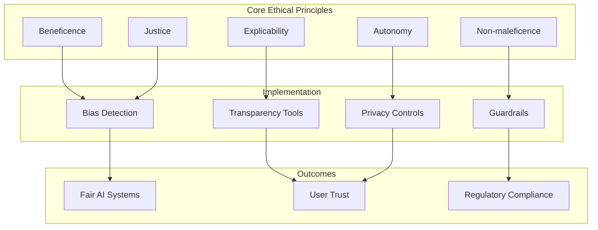
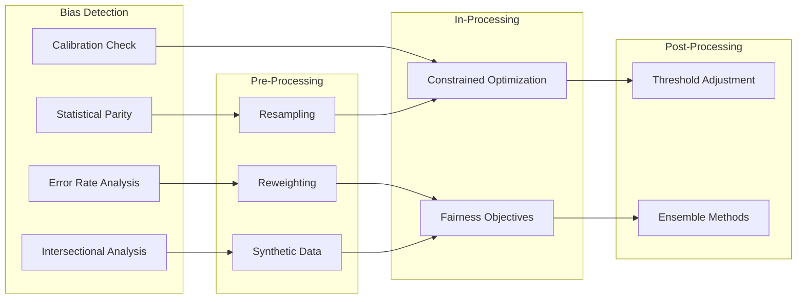

# AI Ethics: Building Responsible AI Applications

As artificial intelligence becomes increasingly woven into the fabric of our daily lives, the responsibility to develop and deploy these systems ethically has never been more critical. From healthcare diagnostics to financial decisions, AI systems are making choices that profoundly impact human lives. This guide explores the fundamental principles, practical strategies, and implementation frameworks for building AI applications that are not only powerful but also responsible, fair, and transparent.

## The Foundation of Ethical AI Development



### Why Ethics Matter in AI

The conversation around AI ethics is not merely philosophical--it carries tangible consequences for individuals and society. When an AI system denies someone a loan, flags a resume for rejection, or recommends a medical treatment, real people experience real outcomes. Unlike traditional software where bugs result in crashes or errors, AI system failures can manifest as discrimination, privacy violations, or harmful decisions that may go undetected for extended periods.

Consider the documented cases: facial recognition systems with significantly higher error rates for certain demographic groups, hiring algorithms that perpetuated historical biases, and predictive policing tools that reinforced systemic inequalities. These are not hypothetical scenarios but real-world implementations that caused measurable harm.

The stakes extend beyond individual incidents. Public trust in AI technology depends on the collective behavior of developers and organizations. Each instance of AI causing harm erodes confidence and potentially slows beneficial innovation. Building ethical AI is therefore both a moral imperative and a practical necessity for the sustainable advancement of the field.

### Core Ethical Principles

The foundation of responsible AI development rests on several interconnected principles that should guide every decision from initial conception through deployment and maintenance.

**Beneficence** requires that AI systems be designed with the explicit goal of benefiting users and society. This goes beyond merely avoiding harm--it demands proactive consideration of how the technology can improve outcomes and experiences. Developers must ask not only "will this cause harm?" but also "how can this create positive value?"

**Non-maleficence** establishes the fundamental obligation to avoid causing harm. This includes direct harms, such as physical danger or financial loss, as well as indirect harms like reinforcing stereotypes or enabling surveillance. The principle extends to potential harms that may not be immediately obvious, requiring careful analysis of downstream effects and unintended consequences.

**Autonomy** respects users' right to make informed decisions about their interaction with AI systems. This encompasses transparency about when AI is being used, meaningful consent for data collection and processing, and the ability to opt out or appeal AI-driven decisions. Autonomy also means designing systems that augment human decision-making rather than replacing it entirely in high-stakes contexts.

**Justice** demands fair distribution of AI's benefits and burdens across different groups and populations. This principle challenges developers to consider who benefits from their systems, who might be disadvantaged, and how to ensure equitable outcomes. Justice also encompasses procedural fairness--ensuring that the processes by which AI systems make decisions are themselves fair and accountable.

**Explicability** combines transparency and accountability, requiring that AI systems be understandable and that clear lines of responsibility exist for their outputs. Users affected by AI decisions deserve explanations they can comprehend, and organizations deploying AI must be accountable for outcomes.

## Identifying and Mitigating Bias

### Understanding Sources of Bias

Bias in AI systems emerges from multiple sources throughout the development lifecycle. Recognizing these sources is the first step toward effective mitigation.

**Historical bias** occurs when training data reflects past discrimination or inequitable practices. A hiring algorithm trained on historical hiring decisions will learn and perpetuate any biases present in those decisions. Even if the original discriminatory intent has been addressed, the data carries its legacy forward.

**Representation bias** emerges when training data fails to adequately represent all relevant populations. If a medical imaging system is trained primarily on data from one demographic group, its accuracy may suffer significantly when applied to others. This is particularly problematic when the underrepresented groups are already marginalized.

**Measurement bias** arises from how features and outcomes are defined and measured. Using arrest rates as a proxy for criminal behavior, for example, conflates actual behavior with law enforcement practices that may themselves be biased. The choice of what to measure and how to measure it embeds assumptions that can introduce systematic unfairness.

**Aggregation bias** occurs when a single model is applied across groups that should be modeled separately. Different populations may have different relationships between features and outcomes, and failing to account for this heterogeneity can produce systematically worse performance for some groups.

**Evaluation bias** happens when the benchmarks used to assess model performance fail to reflect the diversity of real-world applications. A model that performs excellently on standard benchmarks may fail dramatically in deployment if those benchmarks were not representative.

### Bias Detection Strategies

Effective bias detection requires systematic approaches integrated throughout the development process.

**Statistical parity testing** examines whether outcomes are distributed similarly across protected groups. While perfect parity may not always be achievable or appropriate, significant disparities warrant investigation and potential intervention.

**Error rate analysis** compares false positive and false negative rates across groups. Even when overall accuracy is similar, differences in the types of errors can indicate bias. A system with higher false positive rates for certain groups effectively subjects those groups to greater scrutiny or denial of benefits.

**Calibration analysis** assesses whether predicted probabilities have the same meaning across groups. A risk score of 70% should indicate the same actual likelihood of an outcome regardless of which group the individual belongs to. Miscalibration can lead to systematically different treatment.

**Intersectional analysis** recognizes that bias may manifest at the intersection of multiple characteristics. A system might perform acceptably for men overall and women overall, while failing dramatically for a specific subgroup. Testing must account for these intersectional effects.

**Adversarial testing** deliberately probes the system with inputs designed to reveal bias or failure modes. This includes testing with edge cases, unusual combinations of features, and scenarios specifically constructed to stress known vulnerability points.

Here is how to implement bias detection with NeuroLink using the actual SDK API:

```typescript
import { NeuroLink } from '@juspay/neurolink';

const neurolink = new NeuroLink();

interface BiasAnalysisResult {
  overallScore: number;
  demographicParity: Record<string, number>;
  errorRateDisparity: Record<string, number>;
  recommendations: string[];
}

interface TestCase {
  input: string;
  demographic: string;
}

interface ResponseRecord {
  demographic: string;
  input: string;
  output: string;
}

async function detectBiasInResponses(
  testCases: TestCase[]
): Promise<BiasAnalysisResult> {
  // Generate responses for each demographic group
  const responses: ResponseRecord[] = await Promise.all(
    testCases.map(async (testCase) => {
      const result = await neurolink.generate({
        input: { text: testCase.input },
        provider: 'openai',
        model: 'gpt-4o',
      });

      return {
        demographic: testCase.demographic,
        input: testCase.input,
        output: result.content
      };
    })
  );

  // Analyze responses for bias using a separate evaluation call
  const biasAnalysis = await neurolink.generate({
    input: {
      text: `Analyze these AI responses across demographic groups for:
        1. Sentiment differences
        2. Information quality disparities
        3. Tone or formality variations
        4. Stereotype reinforcement

        Responses to analyze:
        ${JSON.stringify(responses, null, 2)}

        Return your analysis as JSON with this structure:
        {
          "overallScore": <0-100>,
          "demographicParity": { "<group>": <score> },
          "errorRateDisparity": { "<group>": <score> },
          "recommendations": ["<recommendation1>", "<recommendation2>"]
        }`
    },
    provider: 'openai',
    model: 'gpt-4o',
    systemPrompt: `You are a bias detection expert. Analyze AI responses
      for fairness and equity across demographic groups. Be thorough and
      objective in your analysis.`
  });

  // Parse the JSON response
  try {
    const jsonMatch = biasAnalysis.content.match(/\{[\s\S]*\}/);
    if (jsonMatch) {
      return JSON.parse(jsonMatch[0]);
    }
  } catch (error) {
    console.error('Failed to parse bias analysis:', error);
  }

  // Return default if parsing fails
  return {
    overallScore: 0,
    demographicParity: {},
    errorRateDisparity: {},
    recommendations: ['Analysis parsing failed - manual review required']
  };
}

// Example usage
async function runBiasAudit() {
  const testCases: TestCase[] = [
    { input: 'Write a job recommendation letter for Alex', demographic: 'neutral' },
    { input: 'Write a job recommendation letter for Maria', demographic: 'female-coded' },
    { input: 'Write a job recommendation letter for James', demographic: 'male-coded' }
  ];

  const results = await detectBiasInResponses(testCases);
  console.log('Bias Analysis Results:', results);
}
```

### Mitigation Techniques



Once bias is detected, several approaches can help address it.

**Pre-processing interventions** modify training data to reduce bias before model development. Techniques include resampling to achieve better representation, reweighting to adjust the influence of different examples, and generating synthetic data to fill gaps in representation.

**In-processing interventions** modify the learning algorithm itself to promote fairness. Constrained optimization can incorporate fairness metrics directly into the objective function, forcing the model to balance predictive performance against equity considerations.

**Post-processing interventions** adjust model outputs to achieve fairer results. Threshold adjustment, for example, can set different decision boundaries for different groups to equalize error rates. While post-processing cannot fix fundamental model problems, it can improve outcomes when combined with other approaches.

**Ensemble approaches** combine multiple models, each potentially optimized for different fairness criteria or different subpopulations. The ensemble can achieve better overall performance while maintaining acceptable fairness across groups.

## Building Transparent AI Systems

### The Importance of Transparency

Transparency serves multiple crucial functions in ethical AI development. It enables accountability by allowing stakeholders to understand and question AI decisions. It builds trust by demystifying systems that might otherwise seem arbitrary or opaque. It facilitates improvement by making it possible to identify problems and their sources. And it empowers users to make informed decisions about their engagement with AI systems.

### Levels of Transparency

Transparency operates at multiple levels, each serving different stakeholders and purposes.

**Algorithmic transparency** refers to the ability to understand how a model works internally. For simple models like linear regression or decision trees, this may be straightforward. For complex neural networks, achieving meaningful algorithmic transparency requires specific interpretability techniques.

**Process transparency** encompasses documentation of how the AI system was developed, including data sources, preprocessing steps, model selection criteria, and validation approaches. This level of transparency supports reproducibility and enables external review.

**Outcome transparency** focuses on making individual decisions understandable to those affected. When someone is denied a loan or flagged for additional screening, they deserve an explanation that meaningfully conveys why that decision was made.

**Organizational transparency** addresses how companies and institutions communicate about their AI use, including policies, governance structures, and accountability mechanisms. This level of transparency shapes public understanding and enables informed societal discourse.

### Implementing Explainable AI

Several techniques can make AI systems more interpretable and explainable.

**Feature importance analysis** identifies which inputs most strongly influence model outputs. Methods like SHAP (SHapley Additive exPlanations) provide principled approaches to attributing predictions to specific features.

**Local interpretable models** approximate complex models with simpler ones in the vicinity of specific predictions. LIME (Local Interpretable Model-agnostic Explanations) generates explanations by fitting interpretable models to explain individual predictions.

**Attention visualization** for transformer-based models reveals which parts of the input the model focuses on when generating outputs. While attention weights do not perfectly represent reasoning processes, they provide useful insights.

**Counterfactual explanations** describe the minimal changes to inputs that would change the output. "Your loan was denied, but if your income were $5,000 higher, it would have been approved" provides actionable information that pure feature importance cannot.

**Concept-based explanations** map model behavior to human-understandable concepts. Rather than explaining in terms of low-level features, these approaches express explanations in terms of meaningful categories that users can relate to.

Here is how to implement explainable AI decisions with NeuroLink:

```typescript
import { NeuroLink } from '@juspay/neurolink';
import { z } from 'zod';

const neurolink = new NeuroLink();

// Define a schema for structured explainable output
const ExplainableDecisionSchema = z.object({
  decision: z.string(),
  confidence: z.number().min(0).max(1),
  explanation: z.object({
    summary: z.string(),
    keyFactors: z.array(z.object({
      factor: z.string(),
      impact: z.enum(['positive', 'negative', 'neutral']),
      weight: z.number()
    })),
    counterfactual: z.string(),
    limitations: z.array(z.string())
  })
});

type ExplainableDecision = z.infer<typeof ExplainableDecisionSchema>;

async function makeExplainableDecision(
  context: string,
  question: string
): Promise<ExplainableDecision> {
  const result = await neurolink.generate({
    input: {
      text: `Context: ${context}

Question: ${question}

Provide a decision with full explanation. Return your response as JSON with:
- decision: your decision
- confidence: confidence level 0-1
- explanation.summary: plain-language explanation
- explanation.keyFactors: array of {factor, impact, weight}
- explanation.counterfactual: what would change the decision
- explanation.limitations: uncertainties and caveats`
    },
    provider: 'anthropic',
    model: 'claude-sonnet-4-5-20250929',
    systemPrompt: `You are an AI that provides fully explainable decisions.
      For every decision, you MUST provide:
      1. The decision itself
      2. Your confidence level (0-1)
      3. A plain-language explanation accessible to non-experts
      4. Key factors that influenced the decision with their impact
      5. A counterfactual (what would change the decision)
      6. Limitations and uncertainties in your analysis

      Be honest about uncertainty. Never claim more confidence than warranted.
      Always acknowledge when you lack sufficient information.`
  });

  // Parse and validate the response
  const jsonMatch = result.content.match(/\{[\s\S]*\}/);
  if (!jsonMatch) {
    throw new Error('Failed to extract JSON from response');
  }

  const parsed = JSON.parse(jsonMatch[0]);
  const validated = ExplainableDecisionSchema.parse(parsed);

  // Log decision for audit trail
  console.log(`Decision: ${validated.decision}`);
  console.log(`Confidence: ${(validated.confidence * 100).toFixed(1)}%`);
  console.log(`Explanation: ${validated.explanation.summary}`);
  console.log('Key Factors:');
  validated.explanation.keyFactors.forEach((factor) => {
    const sign = factor.impact === 'positive' ? '+' : factor.impact === 'negative' ? '-' : '~';
    console.log(`  ${sign} ${factor.factor} (weight: ${factor.weight})`);
  });
  console.log(`Counterfactual: ${validated.explanation.counterfactual}`);

  return validated;
}
```

## User Consent and Data Privacy

### Meaningful Consent

True informed consent requires more than checkbox acknowledgment of lengthy terms of service. Meaningful consent demands that users genuinely understand what they are agreeing to and have genuine choice in the matter.

**Clear communication** presents information in accessible language, avoiding jargon and legal complexity that obscures rather than illuminates. Visual explanations, interactive tutorials, and layered disclosure can help users engage with consent processes.

**Granular control** allows users to make nuanced choices about how their data is used rather than presenting all-or-nothing propositions. Users might consent to data use for service improvement while declining participation in advertising or third-party sharing.

**Ongoing consent** recognizes that consent is not a one-time event but an ongoing relationship. As AI systems evolve and new uses emerge, users should have opportunities to revisit and modify their consent decisions.

**Easy withdrawal** ensures that revoking consent is as simple as granting it. Barriers to withdrawal effectively coerce continued consent and undermine its validity.

### Privacy-Preserving Techniques

Technical approaches can enable AI development while protecting individual privacy.

**Differential privacy** adds carefully calibrated noise to data or outputs, providing mathematical guarantees about the privacy protection afforded to individuals in the dataset. This allows learning from aggregate patterns while limiting what can be inferred about any specific person.

**Federated learning** keeps data on users' devices while training models through distributed computation. The central model learns from many users without ever accessing raw individual data.

**Secure multi-party computation** enables multiple parties to jointly compute functions over their data without revealing that data to each other. This allows collaborative AI development while maintaining data isolation.

**Homomorphic encryption** allows computation on encrypted data without decrypting it. While computationally expensive, this approach enables AI services to process sensitive information without exposure.

## Implementing Ethical Guardrails

### Content Safety with System Prompts

The most effective way to implement ethical guardrails in NeuroLink is through well-designed system prompts that guide AI behavior. This approach works with the model's natural language understanding capabilities rather than requiring external filtering systems.

> **Note:** The guardrails implementation pattern shown below is a conceptual example demonstrating how to structure safety checks and ethical guidelines. You would implement this pattern in your application code using NeuroLink's `generate()` API—this is not a built-in MiddlewareFactory API.

```typescript
import { NeuroLink } from '@juspay/neurolink';

const neurolink = new NeuroLink();

// Define ethical guidelines as a comprehensive system prompt
const ETHICAL_SYSTEM_PROMPT = `You are a helpful AI assistant committed to ethical behavior.

CORE PRINCIPLES:
1. SAFETY: Never provide information that could cause harm to individuals or groups
2. HONESTY: Be truthful and acknowledge uncertainty when you don't know something
3. FAIRNESS: Treat all individuals and groups with equal respect and consideration
4. PRIVACY: Never ask for or encourage sharing of personal identifying information
5. TRANSPARENCY: Be clear about your limitations as an AI system

CONTENT RESTRICTIONS:
- Do not generate hate speech, discriminatory content, or content targeting protected groups
- Do not provide instructions for illegal activities or violence
- Do not generate sexually explicit content
- Do not impersonate real individuals or spread misinformation
- If asked for potentially harmful information, explain why you cannot help and suggest alternatives

RESPONSE GUIDELINES:
- If a request could be interpreted multiple ways, assume the most benign interpretation
- If uncertain about the appropriateness of a response, err on the side of caution
- Always be willing to explain your reasoning and limitations
- Respect user autonomy while maintaining ethical boundaries`;

async function safeGenerate(userInput: string): Promise<string> {
  // Pre-check for obviously problematic requests
  const checkResult = await neurolink.generate({
    input: {
      text: `Evaluate if this user request requires any safety considerations:
        "${userInput}"

        Respond with JSON: {"safe": true/false, "concerns": ["list of concerns if any"]}`
    },
    provider: 'anthropic',
    model: 'claude-sonnet-4-5-20250929',
    systemPrompt: 'You are a content safety evaluator. Be thorough but not overly restrictive.'
  });

  let safetyCheck = { safe: true, concerns: [] as string[] };
  try {
    const match = checkResult.content.match(/\{[\s\S]*\}/);
    if (match) {
      safetyCheck = JSON.parse(match[0]);
    }
  } catch {
    // If parsing fails, proceed with caution
    console.warn('Safety check parsing failed, proceeding with standard response');
  }

  // Log any concerns for review
  if (safetyCheck.concerns.length > 0) {
    console.log('Safety concerns identified:', safetyCheck.concerns);
  }

  // Generate response with ethical guidelines
  const result = await neurolink.generate({
    input: { text: userInput },
    provider: 'anthropic',
    model: 'claude-sonnet-4-5-20250929',
    systemPrompt: ETHICAL_SYSTEM_PROMPT
  });

  return result.content;
}
```

### Human-in-the-Loop for High-Stakes Decisions

For high-stakes operations, NeuroLink provides Human-in-the-Loop (HITL) functionality that requires human approval before executing potentially dangerous actions.

```typescript
import { NeuroLink } from '@juspay/neurolink';

// Configure HITL for dangerous operations
const neurolink = new NeuroLink({
  hitl: {
    enabled: true,
    // Keywords that trigger human approval requirement
    dangerousActions: [
      'delete',
      'remove',
      'terminate',
      'transfer',
      'payment',
      'financial',
      'medical',
      'legal'
    ],
    // Timeout for human response (30 seconds)
    timeout: 30000,
    // Allow humans to modify arguments before approval
    allowArgumentModification: true,
    // Reject automatically if no human response
    autoApproveOnTimeout: false,
    // Optional: Enable basic audit logging for HITL events
    // Note: This is a simple boolean flag for logging HITL confirmation
    // requests. For full compliance logging (SOC2, HIPAA, etc.),
    // see docs/guides/enterprise/compliance.md
    auditLogging: true
  }
});

// Listen for confirmation requests
neurolink.getEventEmitter().on('hitl:confirmation-request', (event) => {
  console.log('Human approval required:');
  console.log(`  Tool: ${event.payload.toolName}`);
  console.log(`  Action: ${event.payload.actionType}`);
  console.log(`  Arguments:`, event.payload.arguments);
  console.log(`  Timeout: ${event.payload.timeout}ms`);

  // In a real application, this would trigger a UI notification
  // and wait for human input before responding
});

// Example: Financial decision requiring human approval
async function processFinancialRequest(request: string) {
  const result = await neurolink.generate({
    input: { text: request },
    provider: 'openai',
    model: 'gpt-4o',
    systemPrompt: `You are a financial assistant. For any actions involving
      money transfers, account changes, or financial commitments, you must
      use the appropriate tool which will require human approval.

      Always explain the implications of financial decisions clearly.
      Never rush users into decisions. Encourage review and consideration.`
  });

  return result;
}
```

### Output Validation and Post-Processing

Implement validation layers to catch problematic outputs before they reach users:

```typescript
import { NeuroLink } from '@juspay/neurolink';
import { z } from 'zod';

const neurolink = new NeuroLink();

// Schema for validated safe output
const SafeOutputSchema = z.object({
  content: z.string(),
  containsPII: z.boolean(),
  confidenceLevel: z.number(),
  requiresDisclaimer: z.boolean(),
  disclaimerText: z.string().optional()
});

type SafeOutput = z.infer<typeof SafeOutputSchema>;

interface ValidationResult {
  isValid: boolean;
  issues: string[];
  sanitizedContent: string;
}

async function validateAndSanitizeOutput(
  rawOutput: string,
  context: string
): Promise<ValidationResult> {
  // Use AI to check for PII and sensitive content
  const validationResult = await neurolink.generate({
    input: {
      text: `Analyze this AI output for potential issues:

Output to validate:
"${rawOutput}"

Context: ${context}

Check for:
1. Personal Identifiable Information (PII) - emails, phones, SSNs, addresses
2. Potentially harmful advice or instructions
3. Unverified claims presented as facts
4. Content requiring disclaimers (medical, legal, financial)
5. Bias or stereotyping

Respond with JSON:
{
  "isValid": true/false,
  "issues": ["list of identified issues"],
  "containsPII": true/false,
  "piiFound": ["list of PII types found"],
  "requiresDisclaimer": true/false,
  "disclaimerType": "medical|legal|financial|none",
  "suggestedFixes": ["list of suggested improvements"]
}`
    },
    provider: 'anthropic',
    model: 'claude-sonnet-4-5-20250929',
    systemPrompt: 'You are a content validation expert. Be thorough in identifying issues.'
  });

  let validation = {
    isValid: true,
    issues: [] as string[],
    containsPII: false,
    piiFound: [] as string[],
    requiresDisclaimer: false,
    disclaimerType: 'none',
    suggestedFixes: [] as string[]
  };

  try {
    const match = validationResult.content.match(/\{[\s\S]*\}/);
    if (match) {
      validation = { ...validation, ...JSON.parse(match[0]) };
    }
  } catch {
    console.warn('Validation parsing failed');
  }

  // Sanitize if PII was found
  let sanitizedContent = rawOutput;
  if (validation.containsPII) {
    const sanitizeResult = await neurolink.generate({
      input: {
        text: `Remove all PII from this text while preserving meaning:
"${rawOutput}"

Replace PII with generic placeholders like [EMAIL], [PHONE], etc.`
      },
      provider: 'anthropic',
      model: 'claude-sonnet-4-5-20250929',
    });
    sanitizedContent = sanitizeResult.content;
  }

  // Add disclaimers if needed
  if (validation.requiresDisclaimer) {
    const disclaimers: Record<string, string> = {
      medical: '\n\n---\nDisclaimer: This is not medical advice. Consult a healthcare professional.',
      legal: '\n\n---\nDisclaimer: This is not legal advice. Consult a qualified attorney.',
      financial: '\n\n---\nDisclaimer: This is not financial advice. Consult a financial advisor.'
    };
    sanitizedContent += disclaimers[validation.disclaimerType] || '';
  }

  return {
    isValid: validation.isValid,
    issues: validation.issues,
    sanitizedContent
  };
}
```

### Audit Logging for Compliance

The example below demonstrates a custom audit logging implementation pattern for regulatory compliance and debugging. Note that the `auditLogging` flag in the HITL configuration above is a simple boolean that enables basic logging of HITL events—for comprehensive compliance logging (SOC2, HIPAA, GDPR, etc.), you'll need to implement a custom solution like the one shown here, or refer to our [Enterprise Compliance Guide](/docs/guides/enterprise/compliance.md) for production-ready patterns:

```typescript
import { NeuroLink } from '@juspay/neurolink';

interface AuditLogEntry {
  timestamp: string;
  requestId: string;
  userId?: string;
  sessionId?: string;
  action: 'generate' | 'stream' | 'tool_execution';
  provider: string;
  model: string;
  inputHash: string;  // Hash of input for privacy
  outputLength: number;
  responseTimeMs: number;
  toolsUsed?: string[];
  hitlTriggered: boolean;
  hitlApproved?: boolean;
  safetyChecks: {
    passed: boolean;
    concerns: string[];
  };
}

// Simple hash function for privacy-preserving logging
function hashInput(input: string): string {
  let hash = 0;
  for (let i = 0; i < input.length; i++) {
    const char = input.charCodeAt(i);
    hash = ((hash << 5) - hash) + char;
    hash = hash & hash;
  }
  return hash.toString(16);
}

class AuditLogger {
  private logs: AuditLogEntry[] = [];

  log(entry: AuditLogEntry): void {
    this.logs.push(entry);
    // In production, send to secure logging service
    console.log('AUDIT:', JSON.stringify(entry));
  }

  getLogs(filter?: Partial<AuditLogEntry>): AuditLogEntry[] {
    if (!filter) return this.logs;
    return this.logs.filter(log =>
      Object.entries(filter).every(([key, value]) =>
        log[key as keyof AuditLogEntry] === value
      )
    );
  }
}

const auditLogger = new AuditLogger();

// Wrapper function with audit logging
async function auditedGenerate(
  neurolink: NeuroLink,
  input: string,
  options: {
    provider: string;
    model: string;
    userId?: string;
    sessionId?: string;
  }
): Promise<{ content: string; auditId: string }> {
  const requestId = `req_${Date.now()}_${Math.random().toString(36).slice(2)}`;
  const startTime = Date.now();

  // Perform safety check
  const safetyResult = await neurolink.generate({
    input: { text: `Is this request safe to process? "${input}" Reply: {"safe": true/false, "concerns": []}` },
    provider: options.provider,
    model: options.model
  });

  let safetyCheck = { passed: true, concerns: [] as string[] };
  try {
    const match = safetyResult.content.match(/\{[\s\S]*\}/);
    if (match) {
      const parsed = JSON.parse(match[0]);
      safetyCheck = { passed: parsed.safe, concerns: parsed.concerns || [] };
    }
  } catch {
    // Default to passed if parsing fails
  }

  // Generate response
  const result = await neurolink.generate({
    input: { text: input },
    provider: options.provider,
    model: options.model
  });

  // Create audit log entry
  const auditEntry: AuditLogEntry = {
    timestamp: new Date().toISOString(),
    requestId,
    userId: options.userId,
    sessionId: options.sessionId,
    action: 'generate',
    provider: options.provider,
    model: options.model,
    inputHash: hashInput(input),
    outputLength: result.content.length,
    responseTimeMs: Date.now() - startTime,
    toolsUsed: result.toolsUsed,
    hitlTriggered: false,  // Would be set by HITL system
    safetyChecks: safetyCheck
  };

  auditLogger.log(auditEntry);

  return {
    content: result.content,
    auditId: requestId
  };
}
```

### Organizational Guardrails

Technical measures must be supported by organizational structures and processes.

**Ethics review boards** provide structured evaluation of AI projects, bringing diverse perspectives to assess potential harms and benefits. These boards should include not only technical experts but also ethicists, affected community representatives, and other relevant stakeholders.

**Impact assessments** systematically evaluate potential consequences before deployment. Algorithmic impact assessments can be modeled on environmental impact assessments, providing comprehensive analysis of risks and mitigation strategies.

**Incident response procedures** establish clear protocols for addressing problems when they arise. Fast, effective response to ethical failures limits harm and demonstrates organizational commitment to responsible practices.

**Continuous monitoring** extends oversight beyond initial deployment. AI systems can drift, adversaries can develop new attacks, and societal contexts can change. Ongoing vigilance is essential to maintaining ethical operation.

**Whistleblower protections** enable employees to raise concerns about ethical issues without fear of retaliation. Internal channels for reporting concerns complement formal review processes.

## Industry Standards and Regulatory Compliance

### Current Regulatory Landscape

The regulatory environment for AI is evolving rapidly across jurisdictions.

The **EU AI Act** establishes a risk-based framework with different requirements for different AI applications. High-risk systems face significant obligations around transparency, human oversight, and robustness, while lower-risk applications face lighter requirements.

The **GDPR** provides important protections relevant to AI, including rights to explanation for automated decisions and requirements for lawful bases for data processing. These apply to AI systems processing personal data of EU residents.

Various **sectoral regulations** apply AI-specific requirements in domains like healthcare, finance, and employment. AI systems in these contexts must comply with existing frameworks while potentially facing additional AI-specific requirements.

**US regulatory approaches** remain more fragmented, with agency-specific guidance and state-level initiatives creating a complex compliance landscape. Executive orders and proposed legislation signal increasing federal attention to AI governance.

### Industry Standards and Best Practices

Beyond legal requirements, industry standards provide valuable guidance.

**IEEE standards** for algorithmic bias considerations, transparency, and other ethical issues offer detailed technical guidance. These standards emerge from broad expert input and represent evolving consensus on responsible practices.

**ISO standards** increasingly address AI-specific concerns, providing frameworks for AI management systems, risk management, and other governance needs.

**Partnership on AI** and similar multi-stakeholder initiatives develop best practices through collaboration among companies, civil society, and researchers. These efforts can move faster than formal standardization while building broad consensus.

**Company-specific AI principles** published by major technology companies, while varying in specificity and implementation, represent public commitments that stakeholders can use to hold organizations accountable.

## Building an Ethical AI Culture

### Leadership Commitment

Ethical AI requires genuine leadership commitment, not just policy documents. Leaders must allocate resources, prioritize ethical considerations in product decisions, and model the behaviors they expect from their organizations.

This commitment must survive commercial pressure. When ethical concerns conflict with speed to market or competitive advantage, leadership responses signal organizational priorities more clearly than any written principle.

### Team Diversity

Diverse teams are better positioned to anticipate ethical problems and develop inclusive solutions. This includes diversity across demographic characteristics, disciplinary backgrounds, and life experiences.

Diversity must be accompanied by inclusion--ensuring that all team members have voice and influence. A diverse team where minority perspectives are dismissed gains little advantage in ethical reasoning.

### Ethical Training and Support

All team members should understand basic ethical principles and their application to AI development. This includes technical staff who might not otherwise engage with ethical considerations.

Specialized ethics expertise should be available to support teams facing difficult decisions. This might include in-house ethicists, external advisors, or consultation processes with ethics review bodies.

### Incentive Alignment

Incentive structures should reward ethical behavior and penalize ethical failures. If developers are evaluated purely on technical performance without consideration of ethical outcomes, organizational values are merely aspirational.

This extends to commercial incentives. If business models depend on practices incompatible with ethical AI, no amount of individual commitment will suffice. Sustainable ethical AI requires business models that make ethics economically viable.

## Conclusion

Building responsible AI applications is not a one-time achievement but an ongoing commitment. It requires technical sophistication to detect and address bias, organizational structures to ensure accountability, and cultural values that prioritize ethical outcomes alongside commercial success.

The principles and practices outlined in this guide provide a foundation, but effective implementation requires continuous learning and adaptation. As AI capabilities advance and applications expand, new ethical challenges will emerge. The organizations and individuals best positioned to navigate these challenges will be those who have built ethical reasoning into their core processes and culture.

The future of AI depends on the choices we make today. By embracing responsible development practices, we can help ensure that artificial intelligence serves human flourishing rather than undermining it. The technology we build reflects our values--let us build technology that reflects values worthy of the future we hope to create.

At NeuroLink, we are committed to providing tools and guidance that help developers build AI applications that are not only powerful but also ethical and responsible. Features like Human-in-the-Loop approval workflows, comprehensive audit logging, and flexible system prompt configuration make it easier to implement responsible AI patterns in your applications.

---

*Building AI applications with NeuroLink? Explore our HITL security workflows, middleware system, and enterprise features at [neurolink.ink](https://neurolink.ink).*
