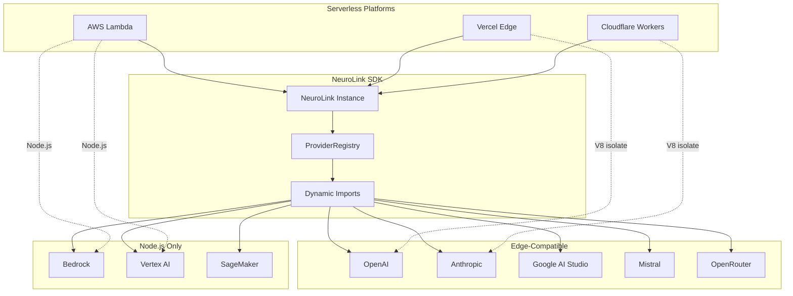

By the end of this guide, you will have NeuroLink running on AWS Lambda, Vercel Edge Functions, and Cloudflare Workers -- with working deployment code, cold start optimization, and streaming configuration for each platform.

NeuroLink's SDK-first architecture makes it naturally serverless-compatible: no sidecar, no proxy, no external service. Dynamic imports mean only the provider you use gets loaded. Environment-based configuration maps directly onto serverless secrets. And Hono's multi-runtime adapter runs identically on Node.js, Bun, Deno, and Workers.

## Why NeuroLink is Serverless-Ready

Five architectural decisions make NeuroLink work well on serverless platforms:

**1. Zero Infrastructure Dependency**

NeuroLink is an SDK, not a service. There is no database to connect to, no sidecar to start, no health check to wait for. Import it, instantiate it, call `generate()`. The entire AI pipeline runs in your function's process.

**2. Dynamic Imports for Cold Start Optimization**

The `ProviderRegistry` uses dynamic `import()` for every provider. When your Lambda function uses OpenAI, only the OpenAI provider module is loaded. The Anthropic, Bedrock, Vertex, and other provider modules stay on disk, unloaded.

```typescript
// From src/lib/factories/providerRegistry.ts - Dynamic imports for cold start optimization
// Only the requested provider is imported at runtime
ProviderFactory.registerProvider(
  AIProviderName.OPENAI,
  async (modelName?, _providerName?, sdk?) => {
    // This import only happens when OpenAI is actually used
    const { OpenAIProvider } = await import("../providers/openAI.js");
    return new OpenAIProvider(modelName, sdk as NeuroLink | undefined);
  },
  OpenAIModels.GPT_4O_MINI,
  ["gpt", "chatgpt"],
);
```

This means cold start time scales with the number of providers you actually use, not the number NeuroLink supports.

**3. Hono Multi-Runtime Support**

NeuroLink's server adapter uses Hono, which natively supports Cloudflare Workers, Vercel Edge, Deno Deploy, and Node.js. You can run the same Hono application on Lambda, Workers, and Edge Functions with minimal changes.

**4. Environment-Based Configuration**

All NeuroLink configuration flows through environment variables. No file system access required. No config files to mount. Set `OPENAI_API_KEY` as a Lambda environment variable or a Cloudflare Workers secret, and NeuroLink picks it up automatically.

**5. Stateless by Default**

NeuroLink does not require in-process state. Conversation memory uses Redis (or Mem0), which is external. Without conversation memory configured, every request is fully stateless -- perfect for serverless.

## AWS Lambda Pattern

AWS Lambda is the most flexible serverless platform. It runs full Node.js, supports long execution times (up to 15 minutes), and can stream responses via Lambda Response Streaming.

### Basic Handler

```typescript
import { NeuroLink } from '@juspay/neurolink';

// Initialize outside handler for connection reuse across warm invocations
const neurolink = new NeuroLink();

export const handler = async (event: APIGatewayProxyEvent) => {
  const { prompt, provider = 'bedrock', model } = JSON.parse(event.body || '{}');

  const result = await neurolink.generate({
    input: { text: prompt },
    provider,
    model,
    region: process.env.AWS_REGION, // Use Lambda's region for Bedrock
  });

  return {
    statusCode: 200,
    headers: { 'Content-Type': 'application/json' },
    body: JSON.stringify({
      content: result.content,
      provider: result.provider,
      model: result.model,
      usage: result.usage,
    }),
  };
};
```

### Key Considerations

**Initialize Outside the Handler**: The `const neurolink = new NeuroLink()` line is outside the handler function. This means the NeuroLink instance is created once during cold start and reused across warm invocations. Provider registrations, connection pools, and cached configurations persist between requests.

**Timeout Configuration**: Lambda's default timeout is 3 seconds, which is too short for most LLM calls. Set it to at least 30 seconds. If you are using slow providers or long prompts, 60-90 seconds is safer. The Lambda timeout should always exceed the NeuroLink provider timeout from `PROVIDER_TIMEOUTS`.

**Region-Aware Provider Selection**: When using AWS Bedrock, pass `region: process.env.AWS_REGION` to use Bedrock in the same region as your Lambda function. This minimizes cross-region latency.

**Streaming on Lambda**: For streaming responses, use Lambda Response Streaming with `awslambda.streamifyResponse`. This sends chunks to the client as they arrive from the model, rather than buffering the entire response.

> **Note:** Bedrock is the natural choice for Lambda deployments because both run in AWS. Authentication uses the Lambda execution role's IAM permissions -- no API key management needed.
{: .prompt-info }

## Vercel edge functions pattern

Vercel Edge Functions run on V8 isolates, similar to Cloudflare Workers. They start faster than Lambda (no full Node.js initialization), but they have stricter constraints: no native modules, no file system access, and limited execution time.

```typescript
import { NeuroLink } from '@juspay/neurolink';

export const config = { runtime: 'edge' };

const neurolink = new NeuroLink();

export default async function handler(req: Request) {
  const { prompt } = await req.json();

  const streamResult = await neurolink.stream({
    input: { text: prompt },
    provider: 'google-ai', // Lightweight, no AWS SDK needed
    model: 'gemini-2.5-flash',
  });

  // Convert AsyncGenerator to ReadableStream
  const readable = new ReadableStream({
    async start(controller) {
      for await (const chunk of streamResult.stream) {
        controller.enqueue(
          new TextEncoder().encode(`data: ${JSON.stringify(chunk)}\n\n`)
        );
      }
      controller.close();
    },
  });

  return new Response(readable, {
    headers: {
      'Content-Type': 'text/event-stream',
      'Cache-Control': 'no-cache',
    },
  });
}
```

### Key Considerations

**Provider Selection Matters**: V8 isolates do not have access to Node.js-specific APIs. Providers that depend on the AWS SDK (Bedrock) or Google Cloud's auth library (Vertex AI) will not work on edge. Use edge-compatible providers: OpenAI, Anthropic, Google AI Studio, Mistral, or OpenRouter.

**Streaming is Natural**: Edge functions and streaming are a natural fit. The Web Streams API (`ReadableStream`) is natively supported, and Vercel's edge runtime is optimized for streaming responses.

**Hono Adapter**: NeuroLink's Hono server adapter works directly with Vercel's edge runtime. If you prefer a full server framework over raw request handlers, use Hono.

## Cloudflare workers pattern

Cloudflare Workers run on V8 isolates at the edge, with strict memory (128MB) and CPU time (10-50ms CPU time) limits. They start extremely fast but impose the tightest constraints.

```typescript
import { Hono } from 'hono';
import { NeuroLink } from '@juspay/neurolink';

// Hono app for Cloudflare Workers
const app = new Hono();
const neurolink = new NeuroLink();

app.post('/generate', async (c) => {
  const { prompt } = await c.req.json();

  const result = await neurolink.generate({
    input: { text: prompt },
    provider: 'openai',
    model: 'gpt-4o-mini',
  });

  return c.json({
    content: result.content,
    usage: result.usage,
  });
});

export default app;
```

### Key Considerations

**Hono is the Natural Choice**: Cloudflare Workers and Hono were designed to work together. NeuroLink's `HonoServerAdapter` detects the Workers runtime automatically.

**Provider Constraints**: Like Vercel Edge, Workers cannot use providers that require Node.js-specific APIs. Stick to REST-based providers: OpenAI, Anthropic, Google AI Studio.

**State via KV or D1**: Workers do not have access to a local file system or direct Redis connections. For session state, use Cloudflare KV or D1 instead of Redis-backed conversation memory.

**CPU Time vs Wall Time**: Workers limit CPU time (the time your code is actively executing), not wall time (total elapsed time including network waits). Since most of an LLM call is waiting for the provider's response, you have more headroom than the CPU limit suggests.

## Cold start optimization strategies

Cold starts are the Achilles heel of serverless AI. NeuroLink initialization, provider registration, and the first API call all contribute to cold start latency. Here are five strategies to minimize it.

### Strategy 1: Provider Pre-Selection

Only register the providers you actually use. If you only need OpenAI, there is no need to register all 13 providers. While NeuroLink's lazy loading prevents unused providers from being imported, the registration overhead itself is non-zero.

### Strategy 2: Skip Dynamic Model Resolution

NeuroLink has an optional dynamic model resolution feature that queries an external service for the best model. In serverless, this can add up to 10 seconds to cold start if the endpoint is unreachable.

```typescript
// From src/lib/core/factory.ts - Timeout-protected dynamic model init
// In serverless, this can add 10s to cold start if endpoint is unreachable
private static async initializeDynamicProviderWithTimeout(): Promise<void> {
  const INIT_TIMEOUT = 10000; // 10 seconds

  await Promise.race([
    dynamicModelProvider.initialize(),
    new Promise((_, reject) =>
      setTimeout(() => reject(new Error('Dynamic provider initialization timeout')), INIT_TIMEOUT),
    ),
  ]);
}

// Optimization: pass explicit model to skip dynamic resolution entirely
const result = await neurolink.generate({
  input: { text: prompt },
  provider: 'openai',
  model: 'gpt-4o-mini', // Explicit model = no dynamic resolution
});
```

Always pass explicit model names in serverless deployments. This skips the dynamic resolution path entirely.

### Strategy 3: Disable MCP Tools

If your serverless function only needs `generate()` or `stream()`, disable MCP tool discovery. Tool discovery involves scanning for and connecting to MCP servers, which is unnecessary for simple generation use cases and adds cold start latency.

### Strategy 4: Use `import type` for Types

NeuroLink already separates type imports from runtime imports in its source code. Follow this pattern in your own code: use `import type` for TypeScript types and only import runtime values when you need them.

### Strategy 5: Lazy Observability

Initialize Langfuse and OpenTelemetry lazily, after the first request, rather than during cold start. The first request will miss tracing, but subsequent requests will be fully traced, and your cold start is faster.

## Provider selection matrix for Serverless

Not every provider works on every serverless platform. Here is the compatibility matrix:

| Provider | Lambda (Node.js) | Vercel Edge (V8) | Workers (V8) | Notes |
|----------|:-:|:-:|:-:|-------|
| OpenAI | Yes | Yes | Yes | REST API, universal |
| Anthropic | Yes | Yes | Yes | REST API, universal |
| Google AI Studio | Yes | Yes | Yes | REST API with API key |
| Mistral | Yes | Yes | Yes | REST API |
| OpenRouter | Yes | Yes | Yes | REST API |
| Azure OpenAI | Yes | Partial | Partial | Works with API key, not managed identity |
| AWS Bedrock | Yes | No | No | Requires AWS SDK |
| Google Vertex | Yes | No | No | Requires Google Auth library |
| SageMaker | Yes | No | No | Requires AWS SDK |
| Ollama | No | No | No | Local only |

**Rule of thumb**: REST-based providers with API key authentication work everywhere. Providers that require cloud-specific SDKs (AWS SDK, Google Auth) only work on Node.js runtimes.

## Serverless architecture overview



## Conclusion

By now you have NeuroLink running on all three platforms with working deployment code, cold start optimizations, and streaming configuration. The key patterns:

1. **Lazy provider loading** -- dynamic imports ensure unused providers are never loaded, keeping cold starts fast
2. **Explicit model names** -- skip dynamic model resolution by passing model names directly to eliminate the biggest cold start risk
3. **Hono multi-runtime** -- use Hono for portable code across Lambda, Workers, and Edge Functions
4. **Match provider to platform** -- edge-compatible providers (OpenAI, Anthropic, Google AI) for Workers and Edge; full provider support on Lambda

For the architectural patterns that make this possible, see [The Factory + Registry Pattern](/posts/factory-registry-pattern/) which explains how dynamic imports break circular dependencies while enabling lazy loading.

---

**Related posts:**

- [The Factory + Registry Pattern: How NeuroLink Breaks Circular Dependencies](/posts/factory-registry-pattern/)
- [From Zero to Production: Deploying Your First NeuroLink App](/posts/zero-to-production-neurolink/)
- [Performance Benchmarking Guide for NeuroLink](/posts/performance-benchmarks/)
