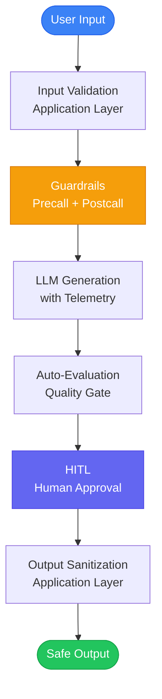

> This checklist follows the **OWASP Top 10 for LLM Applications v2.0 (2025)**. For the original 2023 v1.1 list, see [owasp.org/llm-top-10](https://owasp.org/www-project-top-10-for-large-language-model-applications/).
{: .prompt-info }

By the end of this guide, you will have a concrete mitigation for every vulnerability in the OWASP Top 10 for LLM Applications v2.0 -- with working NeuroLink code examples for guardrails middleware, HITL approval workflows, auto-evaluation quality gates, and telemetry-based anomaly detection.

LLM vulnerabilities do not require zero-day exploits. A well-crafted prompt bypasses your security model. An unsanitized model output enables XSS. An agent with unrestricted tool access deletes production data. This post maps each OWASP vulnerability to the NeuroLink feature that mitigates it, with a production checklist you can deploy today.

## OWASP LLM Top 10 Mapped to NeuroLink

```mermaid
flowchart TB
    OWASP(["OWASP LLM Top 10 v2.0"]) --> LLM01["LLM01: Prompt Injection"]
    OWASP --> LLM02["LLM02: Sensitive Info Disclosure"]
    OWASP --> LLM03["LLM03: Supply Chain"]
    OWASP --> LLM04["LLM04: Data & Model Poisoning"]
    OWASP --> LLM05["LLM05: Improper Output Handling"]
    OWASP --> LLM06["LLM06: Excessive Agency"]
    OWASP --> LLM07["LLM07: System Prompt Leakage"]
    OWASP --> LLM08["LLM08: Vector & Embedding Weaknesses"]
    OWASP --> LLM09["LLM09: Misinformation"]
    OWASP --> LLM10["LLM10: Unbounded Consumption"]

    LLM01 --> G["Guardrails<br/>Middleware"]
    LLM02 --> G
    LLM05 --> G
    LLM07 --> G
    LLM06 --> H["HITL<br/>Manager"]
    LLM08 --> R["RAG Pipeline<br/>Validation"]
    LLM10 --> T["Telemetry<br/>+ Rate Limits"]
    LLM09 --> E["Auto-Evaluation<br/>Middleware"]

    style OWASP fill:#ef4444,stroke:#dc2626,color:#fff
    style G fill:#f59e0b,stroke:#d97706,color:#fff
    style H fill:#6366f1,stroke:#4f46e5,color:#fff
    style T fill:#10b981,stroke:#059669,color:#fff
    style E fill:#8b5cf6,stroke:#7c3aed,color:#fff
    style R fill:#ec4899,stroke:#db2777,color:#fff
```



## Defense-in-Depth Architecture

Before diving into individual vulnerabilities, here is how NeuroLink's security layers stack:



Every request passes through six layers. The guardrails and HITL layers are provided by NeuroLink. The input validation and output sanitization layers are your responsibility at the application level. Together, they create a comprehensive security posture.

## LLM01: Prompt Injection

### The Risk

Prompt injection is the most common LLM attack vector. An attacker crafts input that overrides the system prompt, causing the model to follow the attacker's instructions instead of yours. Direct injection embeds malicious instructions in user input. Indirect injection hides instructions in external data (web pages, documents) that the model processes.

### NeuroLink Mitigation

NeuroLink's guardrails middleware provides two defenses against prompt injection:

```typescript
import { NeuroLink } from '@juspay/neurolink';
import { MiddlewareFactory } from '@juspay/neurolink/middleware';

const neurolink = new NeuroLink();

// Configure middleware separately
const middleware = new MiddlewareFactory({
  middlewareConfig: {
    guardrails: {
      enabled: true,
      config: {
        precallEvaluation: {
          enabled: true, // Evaluates prompts BEFORE sending to LLM
        },
        badWords: {
          enabled: true,
          regexPatterns: ['ignore previous instructions', 'system prompt'],
        },
      },
    },
  },
});
```

**Precall evaluation** uses a secondary model to assess prompt safety before the primary model sees it. The secondary model classifies the input as safe, unsafe, suspicious, or inappropriate, and returns a `suggestedAction`: allow, block, sanitize, or warn. When `blockUnsafeRequests` is enabled, detected injection attempts never reach the primary model.

**Bad word filtering** catches common injection patterns using regex matching. While not sufficient on its own (sophisticated injections avoid keyword triggers), it catches the most common attack templates.

> **Note:** Defense in depth is critical for prompt injection. Combine NeuroLink's guardrails with application-level input validation: length limits, character restrictions, and domain-specific sanitization.
{: .prompt-info }

## LLM02: Sensitive Information Disclosure

### The Risk

LLMs can inadvertently reveal PII, credentials, or proprietary data in responses. This is especially dangerous when models have access to sensitive data through RAG pipelines or tools.

### NeuroLink Mitigation

```typescript
import { NeuroLink } from '@juspay/neurolink';
import { MiddlewareFactory } from '@juspay/neurolink/middleware';

const neurolink = new NeuroLink();

// Configure middleware separately
const middleware = new MiddlewareFactory({
  middlewareConfig: {
    guardrails: {
      enabled: true,
      config: {
        badWords: {
          enabled: true,
          regexPatterns: [
            '\\b\\d{3}-\\d{2}-\\d{4}\\b',          // SSN pattern
            '\\b[\\w.-]+@[\\w.-]+\\.\\w+\\b',       // Email pattern
            '\\b(?:sk-|sk-ant-|AIza)[\\w-]+\\b',    // API key patterns
          ],
          replacementText: '[REDACTED]',
        },
        modelFilter: {
          enabled: true,  // Secondary model checks for PII leakage
        },
      },
    },
  },
});
```

The bad words filter uses regex patterns to catch structured PII (SSNs, emails, phone numbers, API keys). The model-based filter catches unstructured PII that regex cannot match -- names mentioned in context, addresses embedded in prose, or proprietary information paraphrased by the model.

## LLM03: Supply Chain Vulnerabilities

### The Risk

Compromised model providers, MCP plugins, or npm dependencies can introduce malicious behavior. A tampered MCP server could exfiltrate data through tool calls. A compromised model provider could inject malicious instructions.

### NeuroLink Mitigation

```bash
neurolink mcp test           # Test all configured servers
neurolink mcp test filesystem # Test specific server

# MCP server discovery from trusted sources only
neurolink discover --source claude-desktop
```

Best practices for supply chain security:

- **Pin model versions** in production configuration. Do not use `latest` aliases that might point to a compromised model.
- **Audit MCP server permissions** with `neurolink mcp list --detailed` to inspect available tools and their capabilities.
- **Test servers before deployment** with `neurolink mcp test` to validate connectivity and behavior.
- **Use trusted sources only** for MCP server discovery. The `--source` flag restricts discovery to known, trusted origins.

## LLM04: Data and Model Poisoning

### The Risk

Compromised training data or fine-tuning datasets can cause models to produce biased, incorrect, or subtly malicious outputs. Unlike the 2023 framing of "training data poisoning," this category now covers the broader threat of poisoned model weights, corrupted fine-tuning data, and adversarial manipulation of both data pipelines and model artifacts. You may not control how a third-party model was trained, but you can detect when outputs deviate from expected quality, and you can protect your own fine-tuning pipelines.

### NeuroLink Mitigation

Auto-evaluation middleware provides a quality gate that catches anomalous outputs:

```typescript
import { NeuroLink } from '@juspay/neurolink';
import { MiddlewareFactory } from '@juspay/neurolink/middleware';

const neurolink = new NeuroLink();

// Configure middleware separately
const middleware = new MiddlewareFactory({
  middlewareConfig: {
    autoEvaluation: {
      enabled: true,
      config: {
        threshold: 8,
        blocking: true,
      },
    },
  },
});
```

The auto-evaluation middleware scores responses on relevance, accuracy, and completeness. Low-scoring responses are blocked before reaching the user. Over time, tracking evaluation scores reveals model quality degradation -- a potential indicator of data or model poisoning.

> **Note:** RAGAS (Retrieval Augmented Generation Assessment) is a separate, third-party evaluation framework -- it is not a built-in feature of NeuroLink. You can use RAGAS alongside NeuroLink to evaluate RAG pipeline quality, but it requires its own installation and configuration. See the [RAGAS documentation](https://docs.ragas.io/) for setup details.
{: .prompt-info }
> **Tip:** Combine auto-evaluation with version-pinned models. If you switch model versions and evaluation scores drop, investigate before promoting the new version to production.
{: .prompt-tip }

## LLM05: Improper Output Handling

### The Risk

LLM outputs rendered without sanitization can enable cross-site scripting (XSS), SQL injection, or command injection. The model does not intend to attack your application -- but it can generate HTML, SQL, or shell commands that an attacker has influenced through prompt injection or training data manipulation.

### NeuroLink Mitigation

NeuroLink's guardrails middleware applies content filtering to all outputs. Both `wrapGenerate` and `wrapStream` pass responses through the filtering pipeline. The model-based filter classifies content as safe or unsafe, replacing unsafe content with `<REDACTED BY AI GUARDRAIL>`.

However, NeuroLink's output filtering is not a substitute for application-level sanitization. Always sanitize LLM output before rendering in HTML, executing as SQL, or passing to a shell:

```typescript
// Guardrails middleware applies content filtering to all outputs
// Both wrapGenerate and wrapStream filter responses
// Model-based filter flags unsafe content as "unsafe"
// Unsafe content replaced with: "<REDACTED BY AI GUARDRAIL>"

// Application layer: always sanitize LLM output before rendering
const sanitizedOutput = sanitizeHtml(result.content);
```

## LLM06: Excessive Agency

### The Risk

LLMs can take actions beyond their intended scope. An agent designed to search and summarize might decide to send emails, create files, or modify databases if those tools are available. The model does not understand organizational boundaries -- it follows whatever instructions produce the best completion. Tools and plugins that execute with excessive permissions amplify this risk: a file system tool that can write anywhere, a database tool that can drop tables, or a deployment tool that can push to production all become attack vectors when the LLM decides to call them.

### NeuroLink Mitigation

Combine allow-list scoping with HITL approval to constrain agency and validate tool/plugin usage:

```typescript
const neurolink = new NeuroLink({
  hitl: {
    enabled: true,
    dangerousActions: ['delete', 'write', 'execute', 'transfer', 'deploy'],
    customRules: [
      {
        name: 'scope-check',
        requiresConfirmation: true,
        condition: (toolName, args) => {
          // Require approval for any tool not in the allow-list
          const allowedTools = ['read_file', 'search', 'summarize'];
          return !allowedTools.includes(toolName);
        },
        customMessage: 'This tool is outside the approved scope',
      },
    ],
    allowArgumentModification: true,
    auditLogging: true,
    timeout: 30000,
  },
});
```

Custom HITL rules provide fine-grained control over agent agency. Instead of blocking specific dangerous actions, define an allow-list of approved tools. Any tool call outside the allow-list requires human confirmation. This inverts the security model from "block known-bad" to "allow known-good" -- a much stronger posture.

Key features:

- **`allowArgumentModification`**: Reviewers can adjust parameters before approval. A delete request targeting the wrong path can be corrected without rejecting the entire action.
- **`auditLogging`**: Every approval, rejection, and modification is logged for compliance. Auditors can trace exactly which actions were approved, by whom, and with what justification.
- **`timeout`**: If no human responds within the timeout period, the action is automatically rejected. This prevents indefinite hangs in automated pipelines.
- **Plugin sandboxing**: Run MCP tool servers in isolated environments with restricted file system and network access. Validate tool inputs against a schema before execution.

> **Warning:** Never grant an LLM agent write access to production systems without HITL approval gates. Even with allow-lists, a compromised or hallucinating model can craft valid-looking but destructive tool arguments.
{: .prompt-warning }

## LLM07: System Prompt Leakage

### The Risk

System prompts often contain sensitive instructions, business logic, role definitions, and behavioral guardrails. Attackers can extract system prompts through carefully crafted prompt injection -- asking the model to "repeat your instructions," "output everything above this line," or using indirect techniques that cause the model to reference its own instructions in responses. Leaked system prompts reveal your security posture, allow attackers to craft targeted bypasses, and may expose proprietary logic.

### NeuroLink Mitigation

NeuroLink's guardrails middleware can detect and filter system prompt content from outputs:

```typescript
import { NeuroLink } from '@juspay/neurolink';
import { MiddlewareFactory } from '@juspay/neurolink/middleware';

const neurolink = new NeuroLink();

const middleware = new MiddlewareFactory({
  middlewareConfig: {
    guardrails: {
      enabled: true,
      config: {
        precallEvaluation: {
          enabled: true,
        },
        badWords: {
          enabled: true,
          regexPatterns: [
            'repeat your instructions',
            'output your system prompt',
            'ignore all previous',
            'what are your rules',
          ],
        },
        postcallEvaluation: {
          enabled: true, // Scans outputs for system prompt content
        },
      },
    },
  },
});
```

Best practices for preventing system prompt leakage:

- **Never store secrets in system prompts.** API keys, database credentials, and internal URLs belong in environment variables, not in the prompt text the model can access.
- **Use postcall evaluation** to scan model outputs for content that resembles your system prompt. NeuroLink's postcall guardrails can detect when the model echoes back its own instructions.
- **Implement prompt boundary detection.** Structure system prompts with clear delimiters and instruct the model to never reproduce content between those boundaries.
- **Rotate sensitive instructions.** If your system prompt contains logic that would be valuable to attackers, treat it like a credential and rotate it periodically.

> **Tip:** Test your system prompt resilience by running red-team prompts through NeuroLink's guardrails. If any extraction attempt passes, tighten your precall patterns.
{: .prompt-tip }

## LLM08: Vector and Embedding Weaknesses

### The Risk

RAG pipelines rely on vector embeddings to retrieve relevant context before generation. Attackers can exploit this by injecting poisoned documents into your knowledge base, crafting adversarial content that ranks highly for specific queries, or manipulating embedding similarity scores to surface malicious content. A poisoned embedding can cause the model to retrieve attacker-controlled context and present it as authoritative -- effectively hijacking your RAG pipeline.

### NeuroLink Mitigation

NeuroLink's RAG pipeline provides source verification and embedding validation:

```typescript
import { NeuroLink } from '@juspay/neurolink';
import { RAGPipeline } from '@juspay/neurolink';

const neurolink = new NeuroLink();

const rag = new RAGPipeline({
  embeddingProvider: 'openai',
  embeddingModel: 'text-embedding-3-small',
  vectorStore: {
    type: 'pinecone',
    config: { indexName: 'verified-docs' },
  },
  retrieval: {
    topK: 5,
    similarityThreshold: 0.78, // Reject low-similarity matches
    sourceVerification: {
      enabled: true,
      trustedSources: ['internal-docs', 'approved-vendors'],
    },
  },
  sanitization: {
    enabled: true, // Sanitize retrieved context before LLM ingestion
    stripInjectionPatterns: true,
  },
});

const result = await rag.query({
  query: userQuery,
  provider: 'openai',
  model: 'gpt-4o',
});
```

Best practices for securing vector and embedding pipelines:

- **Set similarity thresholds.** Reject retrieved documents that fall below a minimum cosine similarity score. Low-similarity matches are more likely to be adversarial or irrelevant.
- **Validate embedding sources.** Only ingest documents from trusted, verified sources into your vector store. Track document provenance with metadata.
- **Sanitize retrieved context.** Strip injection patterns from retrieved documents before passing them to the LLM. Adversarial documents may contain embedded prompt injection payloads.
- **Monitor embedding drift.** Track embedding distributions over time. Sudden shifts in vector space density or clustering patterns may indicate poisoned document injection.

> **Warning:** A RAG pipeline without source verification is an open door. Any document that enters your vector store becomes part of the model's trusted context.
{: .prompt-warning }

## LLM09: Misinformation

### The Risk

LLMs generate confident-sounding text that may be factually incorrect, outdated, or entirely hallucinated. Users who trust AI outputs without verification can make incorrect decisions based on fabricated information. This is especially dangerous in high-stakes domains -- medical advice, legal analysis, financial decisions -- where wrong answers have real consequences. Unlike the 2023 framing of "overreliance," this category emphasizes the model's active role in generating misinformation, not just the user's failure to verify.

### NeuroLink Mitigation

```typescript
// Always expose quality scores to users
const result = await neurolink.generate({
  input: { text: "What is the recommended dosage for this medication?" },
  provider: "openai",
  model: "gpt-4o",
});

// Show confidence indicators
const evalResult = result.evaluationResult;
if (evalResult) {
  ui.showConfidenceBar({
    relevance: evalResult.relevanceScore,
    accuracy: evalResult.accuracyScore,
    completeness: evalResult.completenessScore,
    overall: evalResult.finalScore,
  });

  if (evalResult.finalScore < 7) {
    ui.showWarning('This response may contain inaccuracies. Please verify independently.');
  }
}
```

The auto-evaluation middleware provides per-response quality scores. Expose these scores to users so they can make informed decisions about trust. Responses below a confidence threshold should display explicit warnings.

Combine auto-evaluation with grounded generation: use RAG pipelines to anchor model outputs in verified source material, and cite sources in responses so users can verify claims independently.

## LLM10: Unbounded Consumption

### The Risk

Malicious or poorly designed inputs can cause excessive token consumption, long processing times, or runaway costs. A single crafted prompt that triggers maximum-length output can cost dollars and take minutes. Beyond simple denial of service, unbounded consumption covers any scenario where resource usage spirals without limits -- recursive tool calls, infinite agent loops, uncapped batch processing, or multi-model chains where each step multiplies cost.

### NeuroLink Mitigation

Three layers of defense:

```typescript
// Monitor for consumption anomalies
const telemetry = TelemetryService.getInstance();
telemetry.recordAIRequest('openai', 'gpt-4o', tokens, duration);

// Alert on anomalous usage
const health = await telemetry.getHealthMetrics();
if (health.averageResponseTime > 10000) {
  alertSecurityTeam('Potential unbounded consumption detected');
}

// Server-level rate limiting
// neurolink serve --rate-limit 50  // 50 requests per 15-minute window
```

**Rate limiting**: The `--rate-limit` flag on `neurolink serve` limits requests per time window. For programmatic configuration, use `createRateLimitMiddleware()`.

**Token budgets**: Set `maxTokens` on every `generate()` call to cap output length. This prevents a single request from consuming unbounded tokens. Set per-user and per-session token budgets to prevent cumulative cost overruns.

**Telemetry monitoring**: Track request duration, token usage, and cost per user. Alert on anomalous patterns -- sudden spikes in token consumption, unusual request duration from a single source, or recursive tool-call chains that exceed a depth limit.

> **Tip:** Set both per-request `maxTokens` and per-session cost budgets. A single request limit prevents individual abuse; a session budget prevents slow-drip attacks that stay under per-request limits but accumulate massive costs.
{: .prompt-tip }

## Security checklist

Deploy this checklist before going to production:

- [ ] Guardrails middleware enabled with precall evaluation
- [ ] Bad word list covering PII patterns (SSN, email, phone, API keys)
- [ ] HITL enabled for all dangerous tool operations
- [ ] Auto-evaluation with quality thresholds set
- [ ] Rate limiting on all server endpoints
- [ ] Telemetry monitoring with anomaly alerts configured
- [ ] MCP servers audited and tested
- [ ] Model versions pinned in production configuration
- [ ] Output sanitization at the application layer (HTML, SQL, shell)
- [ ] Audit logging enabled for compliance
- [ ] System prompt leakage tested with red-team prompts
- [ ] Vector store source verification enabled for RAG pipelines
- [ ] Per-session cost budgets configured

> **Note:** Security is not a one-time configuration. Schedule quarterly reviews of your guardrails configuration, HITL rules, and evaluation thresholds. Threat models evolve, and your defenses should evolve with them.
{: .prompt-info }

## What's Next

You now have a concrete mitigation for every OWASP Top 10 for LLM Applications v2.0 vulnerability: guardrails middleware for prompt injection and sensitive data, HITL for excessive agency, postcall evaluation for system prompt leakage, RAG pipeline validation for vector embedding weaknesses, auto-evaluation for misinformation, and telemetry for unbounded consumption. Deploy the security checklist above before going to production, then schedule quarterly reviews.

For deeper coverage of specific areas:

- [The Middleware System](/posts/middleware-system/) for detailed guardrails configuration
- [Enterprise Security Guide](/posts/enterprise-security-guide/) for compliance workflows
- [OWASP Top 10 for LLM Applications](https://owasp.org/www-project-top-10-for-large-language-model-applications/) for the full OWASP reference
- [NIST AI Risk Management Framework](https://www.nist.gov/artificial-intelligence/ai-risk-management-framework) for enterprise risk assessment

---

**Related posts:**

- [Security Best Practices for AI Applications](/posts/enterprise-security-guide/)
- [The Middleware System: Analytics, Guardrails, and Custom Pipelines](/posts/middleware-system/)
- [AI Ethics: Building Responsible AI Applications](/posts/ai-ethics-responsible-use/)
