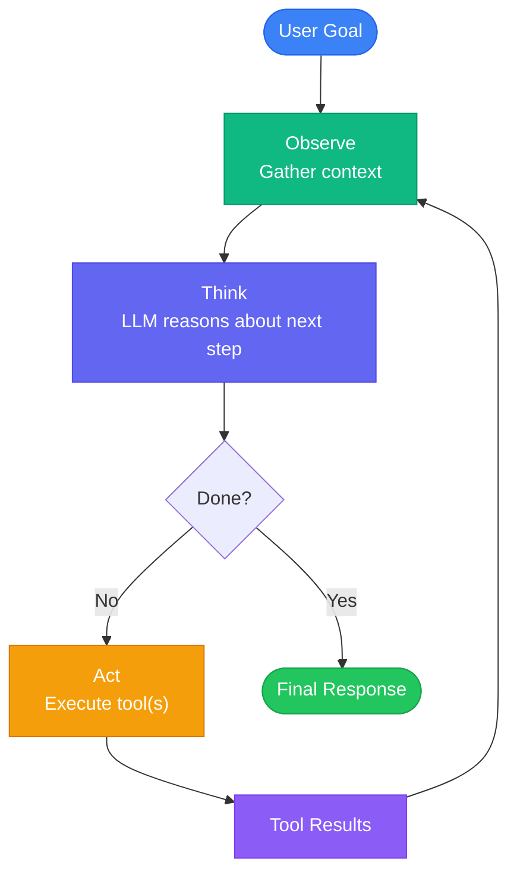
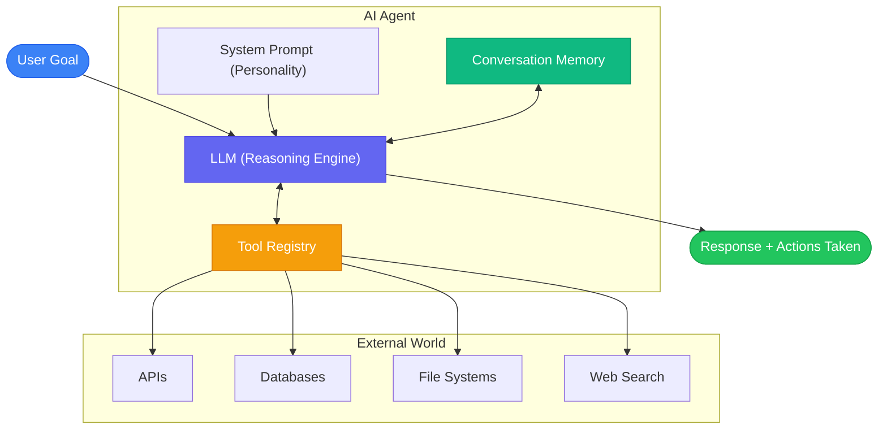
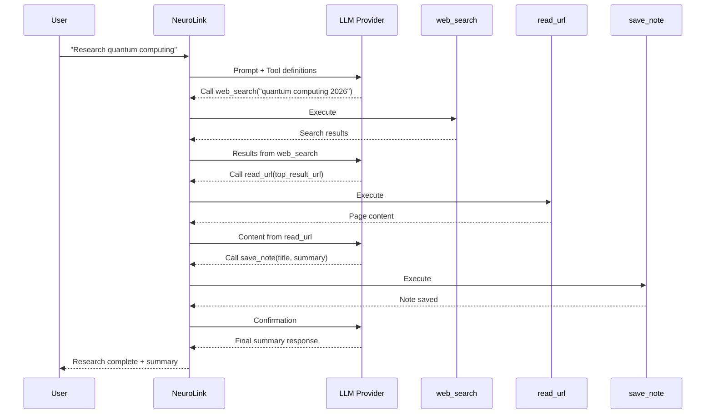

You will build an AI agent that goes beyond question-answering to autonomously completing tasks -- researching topics, reading documents, saving notes, and handling dangerous actions with human oversight.

The difference between a chatbot and an agent is the tool execution loop. A chatbot takes a prompt and returns text. An agent takes a goal, reasons about how to achieve it, uses tools, observes results, and iterates until done.

By the end of this tutorial, you will have a production-ready agent with tool calling, streaming, memory, and HITL safety. Here is what you will learn:

- How the agent loop works (observe, think, act, observe)
- Registering tools with Zod schemas
- Building a research assistant agent
- Streaming agent execution for real-time feedback
- Adding conversation memory for stateful agents
- HITL safety for dangerous tool operations
- Error recovery and production deployment patterns

## The agent loop: Observe, think, act, observe

The core concept behind every AI agent is a loop:



NeuroLink handles this loop internally when tools are registered. You provide the goal and the tools. The LLM decides when to call tools, which tools to call, what arguments to pass, and when it has enough information to return a final answer. Multiple tool calls can happen per iteration -- the LLM can call web search and calculator in parallel if both are needed.


## Agent architecture

Here is how the pieces fit together:



Four components make an agent:

1. **LLM**: The reasoning engine that decides what to do next.
2. **Tool Registry**: The set of actions the agent can take.
3. **System Prompt**: The personality, strategy, and constraints the agent follows.
4. **Conversation Memory**: Context from previous interactions (optional, for stateful agents).


## Registering tools: The foundation of agency

Tools give your agent its capabilities. Without tools, it is just a chatbot. With tools, it can search the web, read files, query databases, send emails, and interact with any API. You will register tools in two ways.

### Tool registration via constructor

The recommended approach is registering tools in the NeuroLink constructor. These tools are available for every `generate()` and `stream()` call:

```typescript
import { NeuroLink } from '@juspay/neurolink';
import { z } from 'zod';
import { tool } from 'ai';

const neurolink = new NeuroLink({
  toolRegistry: {
    web_search: tool({
      description: 'Search the web for current information. Use when you need facts, data, or recent events.',
      parameters: z.object({
        query: z.string().describe('Search query'),
        maxResults: z.number().optional().describe('Maximum results to return')
      }),
      execute: async ({ query, maxResults = 5 }) => {
        const results = await searchAPI.search(query, maxResults);
        return results.map(r => ({ title: r.title, snippet: r.snippet, url: r.url }));
      }
    }),
  }
});
```

Each tool has three parts:

- **`description`**: A natural language description that tells the LLM when and how to use the tool. Be specific -- "Search the web for current information" is better than "Search."
- **`parameters`**: A Zod schema that defines the tool's input. The LLM generates arguments that match this schema. Zod's `.describe()` method adds parameter-level documentation.
- **`execute`**: An async function that performs the action and returns the result. The return value is fed back to the LLM as context for the next reasoning step.

### Registering multiple tools

Your agent becomes powerful when it has multiple complementary tools. Here is how you register a tool set for a research agent:

```typescript
const neurolink = new NeuroLink({
  toolRegistry: {
    web_search: tool({
      description: 'Search the web for information on a topic',
      parameters: z.object({
        query: z.string().describe('Search query'),
      }),
      execute: async ({ query }) => {
        return await searchAPI.search(query);
      }
    }),
    read_url: tool({
      description: 'Read the full content of a web page given its URL',
      parameters: z.object({
        url: z.string().url().describe('URL to read'),
      }),
      execute: async ({ url }) => {
        return await fetchAndParse(url);
      }
    }),
    save_note: tool({
      description: 'Save a research note with a title and content',
      parameters: z.object({
        title: z.string().describe('Note title'),
        content: z.string().describe('Note content with citations'),
      }),
      execute: async ({ title, content }) => {
        await notesDB.save({ title, content, timestamp: Date.now() });
        return { saved: true, title };
      }
    }),
  }
});
```

### Per-call tool registration

For dynamic tools that vary by request, pass them in the `tools` option of `generate()` or `stream()`:

```typescript
const result = await neurolink.generate({
  input: { text: 'Analyze this dataset' },
  provider: 'openai',
  model: 'gpt-4o',
  tools: {
    query_database: dynamicQueryTool,
  },
});
```

Use constructor registration for persistent tools (web search, file operations) and per-call registration for request-specific tools (database queries with specific connection strings).

## Your first agent: A research assistant

Let us put it all together. Here is a complete research agent that searches the web, reads top results, and saves comprehensive notes:

```typescript
const result = await neurolink.generate({
  input: { text: 'Research the latest advances in quantum error correction and save a summary' },
  provider: 'anthropic',
  model: 'claude-sonnet-4-5-20250929',
  systemPrompt: `You are a thorough research assistant. When given a research topic:
1. Search for the most relevant and recent information
2. Read the top 2-3 sources for detailed content
3. Save comprehensive notes with citations
Be systematic and cite your sources.`,
});

console.log('Tools used:', result.toolsUsed);
console.log('Tool executions:', result.toolExecutions);
```

### What happens under the hood



The LLM orchestrates multiple tool calls autonomously. It decides to search first, then read the most relevant result, then save notes. At no point does your code tell it what to do next -- the system prompt provides strategy, and the LLM executes it.

The `result.toolsUsed` array shows which tools were called. The `result.toolExecutions` array provides detailed information about each execution: tool name, arguments, result, and timing.

## Streaming agent execution

Next, you will add real-time feedback using `stream()` instead of `generate()`. This lets you show users what the agent is doing as it works:

```typescript
const result = await neurolink.stream({
  input: { text: 'Analyze our Q4 sales data and create a report' },
  provider: 'openai',
  model: 'gpt-4o',
});

for await (const chunk of result.stream) {
  if ('content' in chunk) {
    process.stdout.write(chunk.content);
  }
}

// Monitor tool execution events
for await (const event of result.toolEvents) {
  if (event.type === 'tool:start') {
    console.log(`[Agent is using: ${event.toolName}]`);
  }
}
```

The `result.stream` async iterable provides text chunks as they arrive from the model. The `result.toolEvents` async iterable provides real-time notifications about tool execution: when a tool starts, when it completes, and whether it succeeded or failed.

In a web application, you can use these events to build a live activity feed: "Agent is searching the web...", "Agent is reading results...", "Agent is writing the report..."

## Stateful agents with conversation memory

Now you will add memory so your agent retains context across requests. A project management agent needs to remember tasks; a customer support agent needs to recall history.

You will enable conversation memory with a single configuration option:

```typescript
const neurolink = new NeuroLink({
  conversationMemory: { enabled: true }
});

// Agent remembers previous interactions
const result = await neurolink.generate({
  input: { text: 'Add the API refactoring task we discussed yesterday to the sprint' },
  context: { sessionId: 'project-mgmt-alice', userId: 'alice' },
  provider: 'anthropic',
});
```

The `context.sessionId` ties requests to a conversation. All messages within the same session are available as context for the LLM. The `context.userId` enables user-specific memory partitioning.

For simple applications, in-memory conversation storage works. For production, configure Redis-backed memory for persistence across server restarts and shared state across multiple server instances. For long-term memory that spans days or weeks, integrate Mem0.

## Safety: HITL for dangerous actions

Your agent now has tools and memory. Next, you will add safety guardrails. An agent with access to `send_email`, `delete_file`, or `deploy_to_production` should not execute those actions without approval. You will configure NeuroLink's HITL (Human-in-the-Loop) manager to add a human approval gate for sensitive operations.

```typescript
const neurolink = new NeuroLink({
  hitl: {
    enabled: true,
    timeout: 30000,
    dangerousActions: ['delete', 'send_email', 'deploy', 'transfer_funds']
  }
});

neurolink.getEventEmitter().on('hitl:confirmation-request', async (payload) => {
  const approved = await getUserApproval(payload);
  neurolink.getEventEmitter().emit('hitl:confirmation-response', {
    confirmationId: payload.confirmationId,
    approved,
  });
});
```

When the agent attempts to call a tool that matches a `dangerousActions` keyword, execution pauses. The HITL manager emits a `hitl:confirmation-request` event with the full details of the proposed action: tool name, arguments, and the agent's reasoning. Your application presents this to a human reviewer.

The reviewer approves or rejects via a `hitl:confirmation-response` event. If approved, the tool executes normally. If rejected, the agent receives a "rejected" result and adjusts its strategy -- it might try an alternative approach or ask the user for clarification.

The `timeout` setting (in milliseconds) prevents indefinite waits. If no human responds within the timeout, the action is automatically rejected.

> **Tip:** The `dangerousActions` field uses keyword matching. If a tool name contains any keyword from the list, HITL confirmation is triggered. Use broad keywords like "delete" rather than exact tool names for comprehensive coverage.
{: .prompt-tip }

## Error recovery in agent workflows

Tools fail. APIs return errors. Files go missing. You will handle this by returning structured error objects from tools rather than throwing exceptions. When you throw, the agent loop crashes. When you return an error object, the LLM receives the error as context and adjusts its strategy.

```typescript
const web_search = tool({
  description: 'Search the web',
  parameters: z.object({ query: z.string() }),
  execute: async ({ query }) => {
    try {
      const results = await searchAPI.search(query);
      return { success: true, results };
    } catch (error) {
      return { success: false, error: error.message, suggestion: 'Try a different query' };
    }
  }
});
```

The LLM interprets the error and decides what to do: retry with a modified query, try an alternative tool, or inform the user that the action could not be completed. This makes agents resilient without complex retry logic in your application code.

For long-running tool operations, implement timeouts within the `execute` function to prevent single tool calls from consuming the entire request budget.

## Provider-agnostic agents

The same agent definition works across every provider NeuroLink supports. Your tools, system prompt, and application logic remain identical -- only the `provider` and `model` change:

```typescript
// Same agent, different providers
const openaiResult = await neurolink.generate({
  input: { text: goal },
  provider: 'openai',
  model: 'gpt-4o',
});

const anthropicResult = await neurolink.generate({
  input: { text: goal },
  provider: 'anthropic',
  model: 'claude-sonnet-4-5-20250929',
});

const googleResult = await neurolink.generate({
  input: { text: goal },
  provider: 'google-ai',
  model: 'gemini-2.5-pro',
});
```

Tips for choosing the right model for agentic workloads:

| Use Case | Recommended Models | Why |
|----------|-------------------|-----|
| Complex multi-step tasks | Claude Sonnet 4.5, GPT-4o | Best reasoning for tool selection |
| Fast, simple tool use | Gemini 2.5 Flash, GPT-4o-mini | Low latency, cost-effective |
| Deep reasoning + tools | o3, Claude with extended thinking | For tasks requiring planning |

## Production considerations

Before deploying agents to production, address these concerns:

**Audit Logging**: Log every tool execution with timestamps, arguments, results, and the LLM's reasoning. This is critical for debugging, compliance, and understanding agent behavior.

**Rate Limiting**: Limit tool calls per session to prevent runaway agents. A bug in the system prompt or an adversarial user could cause an agent to loop indefinitely.

**Token Budget Management**: Set `maxTokens` and monitor token usage. Long agent loops with many tool calls can consume thousands of tokens per request.

**Monitoring with OpenTelemetry**: Use NeuroLink's built-in OpenTelemetry integration to trace agent execution end-to-end. Each tool call appears as a span, making it easy to identify slow tools or failing steps.

**Testing with Mock Tools**: In your test suite, replace real tools with mock implementations that return predictable results. This lets you test agent behavior without making real API calls or file system modifications.

## What you built and what's next

You built an AI agent with tool calling, streaming execution, conversation memory, HITL safety, and error recovery. The same agent definition works across every provider NeuroLink supports.

Next, explore multi-agent patterns where specialized agents (researcher, writer, reviewer) collaborate toward shared goals. While NeuroLink does not include a built-in multi-agent framework, you can compose agents using its generation and tool-calling primitives. For multi-agent patterns, see our upcoming guide on multi-agent network topologies.

For the tool registration mechanics behind agent systems, see [Function Calling Patterns](/posts/function-calling-patterns/). For MCP-based tools, see [MCP Tools Integration](/posts/mcp-tools-integration/). For adding memory to your agents, see [Conversation Memory Guide](/posts/conversation-memory-guide/).

---

**Related posts:**

- [Function Calling: AI Tool Use Patterns with NeuroLink](/posts/function-calling-patterns/)
- [MCP Tools: Extending AI with External Capabilities](/posts/mcp-tools-integration/)
- [Conversation Memory: Building Stateful AI Applications](/posts/conversation-memory-guide/)
