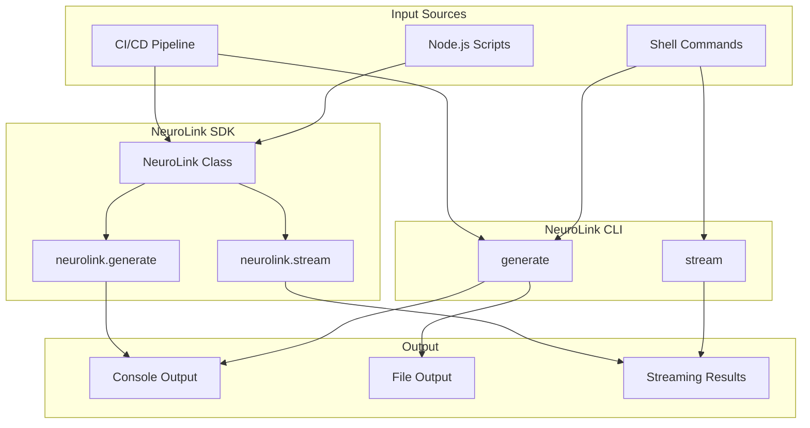
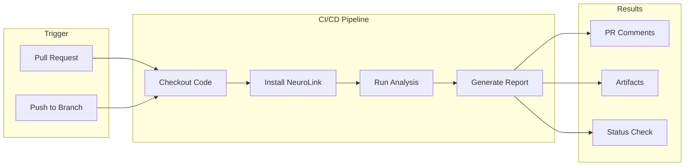

You will automate AI tasks directly from the command line using NeuroLink's CLI. By the end of this tutorial, you will have shell scripts that generate code reviews, CI/CD pipelines that run AI analysis on every PR, and Node.js automation scripts with structured output.

This tutorial covers CLI commands, shell integration, Node.js SDK usage, and CI/CD workflows.

## CLI Automation Architecture



## Getting Started with NeuroLink CLI

Start by installing the NeuroLink CLI, which is included with the `@juspay/neurolink` package.

### Installation

Install NeuroLink globally:

```bash
npm install -g @juspay/neurolink
```

Or add to your project:

```bash
npm install @juspay/neurolink
```

### Provider Setup

Before using the CLI, set up at least one AI provider:

```bash
neurolink setup

# Setup specific provider (positional argument)
neurolink setup openai
neurolink setup google-ai
neurolink setup anthropic

# Setup specific provider (--provider flag)
neurolink setup --provider openai
neurolink setup --provider anthropic

# List available providers
neurolink setup --list

# Check provider status
neurolink status
```

The setup wizard guides you through configuring API keys and environment variables.

## Essential CLI Commands

You will use three core commands for AI generation.

### Generate Command

The `generate` (or `gen`) command performs one-shot AI generation:

```bash
# Basic generation
neurolink generate "Explain quantum computing in simple terms"

# Short alias
neurolink gen "Write a Python function to sort a list"

# Specify provider
neurolink generate "Analyze this code" --provider openai

# Use specific model and temperature
neurolink gen "Write a creative story" -m gpt-4 -t 0.8

# Control output length
neurolink generate "Summarize machine learning" --maxTokens 500

# Add system prompt for context
neurolink gen "Review this PR" --system "You are a senior code reviewer"
```

### Stream Command

The `stream` command delivers real-time streaming output:

```bash
# Stream a creative story
neurolink stream "Write a story about space exploration"

# Stream with specific provider
neurolink stream "Explain machine learning" -p anthropic

# Stream to file
neurolink stream "Write documentation" --output docs.txt

# Stream code walkthrough
neurolink stream "Walk through this code step by step" -m claude-3-5-sonnet
```

## Common CLI Options

These options work with `generate` and `stream` commands:

| Option | Alias | Description | Default |
|--------|-------|-------------|---------|
| `--provider` | `-p` | AI provider (auto, openai, anthropic, vertex, etc.) | auto |
| `--model` | `-m` | Specific model to use | provider default |
| `--temperature` | `-t` | Creativity level (0.0-2.0) | 0.7 |
| `--maxTokens` | `--max` | Maximum tokens to generate | 1000 |
| `--system` | `-s` | System prompt for context | none |
| `--output` | `-o` | Output file path | stdout |
| `--format` | `-f` | Output format (text, json, table) | text |
| `--quiet` | `-q` | Suppress progress messages | false |
| `--debug` | | Enable debug output | false |

> **Important Note**: The CSV and multimodal features described in the following section (CSV file analysis, video processing, PDF handling, etc.) should be verified against the current NeuroLink SDK documentation before use in production. Feature availability, supported file formats, and implementation details may vary by provider and SDK version. Always refer to the official [NeuroLink documentation](https://juspay.in/neurolink) for the most up-to-date information on supported input types and their specific requirements.

## Multimodal CLI Usage

NeuroLink CLI supports images, PDFs, CSV files, and videos:

```bash
# Analyze an image
neurolink gen "Describe this image" --image photo.jpg

# Multiple images
neurolink gen "Compare these images" --image img1.png --image img2.png

# Analyze CSV data
neurolink gen "Analyze this sales data" --csv data.csv

# Process PDF document
neurolink gen "Summarize this document" --pdf report.pdf

# Analyze video content
neurolink gen "Describe what happens in this video" --video clip.mp4

# Configure video analysis
neurolink gen "Analyze video" --video demo.mp4 --video-frames 16 --video-quality 90
```

## Shell integration and Piping

Next, you will pipe data in and out of the CLI using standard Unix patterns.

### Input from Stdin

```bash
# Pipe file content for analysis
cat src/complex-function.ts | neurolink generate "Explain this code"

# Pipe git diff for review
git diff HEAD~1 | neurolink gen "Review these changes"

# Pipe error logs for diagnosis
tail -100 /var/log/app.log | neurolink gen "Diagnose these errors"

# Use heredoc for multi-line input
neurolink generate << 'EOF'
Analyze this function and suggest improvements:

function calculate(a, b) {
  return a + b * 2 - b / 2;
}
EOF
```

### Output Processing

```bash
# Generate and format with jq
neurolink generate "List 5 programming languages" --format json | jq '.languages[]'

# Generate and format with prettier
neurolink gen "Write a React component" | prettier --parser typescript

# Stream to file while displaying
neurolink stream "Write documentation" | tee docs.md
```

## Creating automation scripts

### Daily Analysis Script

```bash
#!/bin/bash
set -e

# daily-analysis.sh - Daily code quality check with NeuroLink

PROJECT_DIR="${1:-.}"
REPORT_DIR="./reports/$(date +%Y-%m-%d)"
mkdir -p "$REPORT_DIR"

echo "Running NeuroLink daily analysis..."

# Analyze recent changes
echo "Analyzing recent git changes..."
git log --since="24 hours ago" --pretty=format:"%s%n%b" | \
  neurolink generate "Summarize these commits and highlight key changes" \
  --output "$REPORT_DIR/changes-summary.md"

# Review modified files
echo "Reviewing modified files..."
git diff --name-only HEAD~5 | head -10 | while read file; do
  if [ -f "$file" ]; then
    echo "Reviewing $file..."
    cat "$file" | neurolink gen "Review this code for issues" \
      --quiet >> "$REPORT_DIR/code-review.md"
  fi
done

echo "Daily analysis complete. Report: $REPORT_DIR/"
```

### Interactive CLI Helper

```bash
#!/bin/bash
# ai-helper.sh - Interactive AI assistant

echo "NeuroLink AI Helper"
echo "Type 'exit' to quit"
echo ""

while true; do
  read -p "You: " query
  [ "$query" = "exit" ] && break
  [ -z "$query" ] && continue

  echo ""
  neurolink stream "$query" -p anthropic
  echo ""
  echo ""
done

echo "Goodbye!"
```

### Git Commit Message Generator

```bash
#!/bin/bash
# git-commit-ai.sh - Generate commit messages with AI

# Get staged changes
STAGED_DIFF=$(git diff --cached)

if [ -z "$STAGED_DIFF" ]; then
  echo "No staged changes found."
  exit 1
fi

echo "Generating commit message..."

# Generate commit message
COMMIT_MSG=$(echo "$STAGED_DIFF" | neurolink gen \
  "Generate a concise git commit message following conventional commits format.
   Focus on the 'why' not the 'what'. Keep it under 72 characters for the title." \
  --quiet --maxTokens 100)

echo ""
echo "Suggested commit message:"
echo "$COMMIT_MSG"
echo ""

read -p "Use this message? (y/n/e for edit): " choice

case $choice in
  y|Y)
    git commit -m "$COMMIT_MSG"
    ;;
  e|E)
    git commit -e -m "$COMMIT_MSG"
    ;;
  *)
    echo "Commit cancelled."
    ;;
esac
```

## Node.js SDK Integration

For programmatic control, you will use the NeuroLink SDK directly in Node.js scripts.

### Basic SDK Usage

```typescript
#!/usr/bin/env npx tsx

import { NeuroLink } from '@juspay/neurolink';

const neurolink = new NeuroLink();

// Simple generation
const result = await neurolink.generate({
  input: { text: 'Explain quantum computing in simple terms' },
  provider: 'openai',
  model: 'gpt-4o',
  temperature: 0.7,
  maxTokens: 500
});

console.log(result.content);
console.log(`Provider: ${result.provider}, Model: ${result.model}`);
console.log(`Tokens: ${result.usage?.total}`);
```

### Streaming with SDK

```typescript
#!/usr/bin/env npx tsx

import { NeuroLink } from '@juspay/neurolink';

const neurolink = new NeuroLink();

const result = await neurolink.stream({
  input: { text: 'Write a short story about AI' },
  provider: 'anthropic',
  model: 'claude-sonnet-4-5-20250929',
  temperature: 0.8
});

// Process stream chunks
for await (const chunk of result.stream) {
  if ('content' in chunk) {
    process.stdout.write(chunk.content);
  }
}

console.log('\n\nStream complete!');
console.log(`Provider: ${result.provider}`);
```

### Multimodal Analysis Script

> **Important Note**: The CSV and multimodal examples below demonstrate conceptual patterns. Before implementing these features in production, please verify the exact API interfaces, parameter names, and supported options against the current [NeuroLink SDK documentation](https://juspay.in/neurolink) and [test examples](https://github.com/juspay/neurolink/tree/main/tests). Feature availability and implementation details may vary by provider and SDK version.

```typescript
#!/usr/bin/env npx tsx

import { NeuroLink } from '@juspay/neurolink';
import { readFileSync } from 'fs';

const neurolink = new NeuroLink();

// Analyze image
async function analyzeImage(imagePath: string, prompt: string) {
  const imageBuffer = readFileSync(imagePath);

  const result = await neurolink.generate({
    input: {
      text: prompt,
      images: [imageBuffer]
    },
    provider: 'vertex',
    model: 'gemini-2.0-flash-001',
  });

  return result.content;
}

// For CSV processing examples, refer to:
// - Official NeuroLink multimodal documentation
// - Test suite: https://github.com/juspay/neurolink/tree/main/tests
// The exact API for CSV files may differ from generic examples shown here

// Example usage
const imageAnalysis = await analyzeImage(
  './screenshot.png',
  'Describe what you see in this image and identify any UI issues'
);
console.log('Image Analysis:', imageAnalysis);
```

> **Note:** For complete CSV processing examples with verified APIs, refer to the [NeuroLink test examples](https://github.com/juspay/neurolink/tree/main/tests).

## CI/CD Integration



### GitHub Actions Integration

Create `.github/workflows/neurolink-review.yml`:

```yaml
name: NeuroLink Code Review

on:
  pull_request:
    branches: [main, develop]

jobs:
  code-review:
    runs-on: ubuntu-latest
    steps:
      - uses: actions/checkout@v4
        with:
          fetch-depth: 0

      - name: Setup Node.js
        uses: actions/setup-node@v4
        with:
          node-version: '20'

      - name: Install NeuroLink
        run: npm install -g @juspay/neurolink


      - name: Get changed files
        id: changed
        run: |
          FILES=$(git diff --name-only origin/${{ github.base_ref }}...HEAD | grep -E '\.(js|ts|py)$' || true)
          echo "files=$FILES" >> $GITHUB_OUTPUT

      - name: Run Code Review
        if: steps.changed.outputs.files != ''
        env:
          OPENAI_API_KEY: ${{ secrets.OPENAI_API_KEY }}
        run: |
          echo "# AI Code Review" > review.md
          echo "" >> review.md

          echo "${{ steps.changed.outputs.files }}" | tr ' ' '\n' | while read file; do

            if [ -f "$file" ]; then
              echo "## $file" >> review.md
              cat "$file" | neurolink gen "Review this code for bugs, security issues, and improvements. Be concise." --quiet >> review.md
              echo "" >> review.md
            fi
          done

      - name: Post Review Comments
        if: steps.changed.outputs.files != ''
        uses: actions/github-script@v7
        with:
          script: |
            const fs = require('fs');
            const review = fs.readFileSync('review.md', 'utf8');
            if (review.trim()) {
              github.rest.issues.createComment({
                owner: context.repo.owner,
                repo: context.repo.repo,
                issue_number: context.issue.number,
                body: review
              });
            }
```

### GitLab CI Integration

Create `.gitlab-ci.yml`:

```yaml
stages:
  - analyze
  - report

variables:
  OPENAI_API_KEY: $OPENAI_API_KEY

neurolink-analyze:
  stage: analyze
  image: node:20-alpine
  before_script:
    - npm install -g @juspay/neurolink
  script:
    - |
      git diff --name-only $CI_MERGE_REQUEST_DIFF_BASE_SHA...HEAD | \
        grep -E '\.(js|ts)$' | head -10 | while read file; do
        if [ -f "$file" ]; then
          echo "Analyzing $file..."
          cat "$file" | neurolink gen "Identify potential issues" --quiet >> analysis.txt
        fi
      done
  artifacts:
    paths:
      - analysis.txt
    expire_in: 1 week
  only:
    - merge_requests

neurolink-report:
  stage: report
  image: node:20-alpine
  needs:
    - neurolink-analyze
  before_script:
    - npm install -g @juspay/neurolink
  script:
    - |
      cat analysis.txt | neurolink gen "Summarize these findings into a brief report" \
        --output report.md
  artifacts:
    paths:
      - report.md
  only:
    - merge_requests
```

## Shell aliases

Add these to your `.bashrc` or `.zshrc`:

```bash
# Basic aliases
alias nl="neurolink"
alias nlg="neurolink generate"
alias nls="neurolink stream"

# Provider shortcuts
alias nlo="neurolink generate --provider openai"
alias nla="neurolink generate --provider anthropic"
alias nlv="neurolink generate --provider vertex"

# Common tasks
alias nlcode="neurolink generate --system 'You are an expert programmer'"
alias nlreview="neurolink generate --system 'Review this code for issues'"
alias nlexplain="neurolink generate --system 'Explain this clearly'"

# Git integration
alias nlcommit="git diff --cached | neurolink gen 'Generate a commit message'"
alias nldiff="git diff | neurolink gen 'Summarize these changes'"
```

### Advanced Shell Functions

```bash
# Review current git changes
nlgitreview() {
  git diff --cached | neurolink gen "Review these code changes" -p anthropic
}

# Quick code generation with file output
nlquick() {
  local description="$1"
  local output="${2:-generated-code.ts}"
  neurolink generate "$description" --output "$output"
  echo "Generated: $output"
}

# Analyze a file
nlfile() {
  local file="$1"
  local task="${2:-Analyze this code}"
  cat "$file" | neurolink gen "$task"
}

# Stream explanation of a file
nlexplainfile() {
  local file="$1"
  cat "$file" | neurolink stream "Explain this code step by step"
}

# PR description generator
nlpr() {
  local base="${1:-main}"
  git log "$base"...HEAD --pretty=format:"- %s" | \
    neurolink gen "Generate a PR description from these commits"
}
```

## Environment variables

Configure NeuroLink behavior with environment variables:

```bash
# Provider API keys
export OPENAI_API_KEY="sk-..."
export ANTHROPIC_API_KEY="sk-ant-..."
export GOOGLE_AI_API_KEY="..."
export GOOGLE_GENERATIVE_AI_API_KEY="..."  # Alternative for Google AI
export AZURE_OPENAI_API_KEY="..."
export AZURE_OPENAI_ENDPOINT="..."

# AWS Bedrock (uses AWS credentials)
export AWS_ACCESS_KEY_ID="..."
export AWS_SECRET_ACCESS_KEY="..."
export AWS_REGION="us-east-1"

# Google Vertex AI
export GOOGLE_APPLICATION_CREDENTIALS="/path/to/service-account.json"
export VERTEX_PROJECT_ID="your-project"
export VERTEX_LOCATION="us-central1"

# Behavior configuration
export NEUROLINK_DEBUG="true"     # Enable debug logging
export NO_COLOR="1"               # Disable colored output
```

> **Note:** NeuroLink does not use a unified API key. Set provider-specific keys (OPENAI_API_KEY, ANTHROPIC_API_KEY, etc.) and NeuroLink automatically detects them.

## Advanced SDK Patterns

### With Conversation Memory

```typescript
import { NeuroLink } from '@juspay/neurolink';

const neurolink = new NeuroLink({
  conversationMemory: {
    enabled: true,
    redisConfig: { host: 'localhost', port: 6379 }
  }
});

// Conversation with memory
const responses: string[] = [];

const questions = [
  'What is TypeScript?',
  'What are its main benefits?',
  'How does it compare to JavaScript?'
];

for (const question of questions) {
  const result = await neurolink.generate({
    input: { text: question },
    provider: 'openai',
    model: 'gpt-4o',
  });
  responses.push(result.content);
  console.log(`Q: ${question}`);
  console.log(`A: ${result.content}\n`);
}
```

### With Structured Output

```typescript
import { NeuroLink } from '@juspay/neurolink';
import { z } from 'zod';

const neurolink = new NeuroLink();

// Define schema for structured output
const AnalysisSchema = z.object({
  summary: z.string(),
  issues: z.array(z.object({
    severity: z.enum(['low', 'medium', 'high']),
    description: z.string(),
    suggestion: z.string()
  })),
  score: z.number().min(0).max(100)
});

const result = await neurolink.generate({
  input: { text: 'Analyze this code: function add(a,b) { return a+b }' },
  provider: 'openai',
  model: 'gpt-4o',
  schema: AnalysisSchema,
  disableTools: false
});

// Result is typed according to schema
const analysis = JSON.parse(result.content);
console.log('Score:', analysis.score);
console.log('Issues:', analysis.issues);
```

### With MCP Tools

```typescript
import { NeuroLink } from '@juspay/neurolink';

const neurolink = new NeuroLink();

// Define tools for generation
const tools = {
  readFile: {
    description: 'Read contents of a file',
    parameters: {
      type: 'object',
      properties: {
        path: { type: 'string', description: 'File path to read' }
      },
      required: ['path']
    }
  }
};

// Use tools in generation
const result = await neurolink.generate({
  input: { text: 'Read the package.json and tell me the version' },
  provider: 'anthropic',
  model: 'claude-sonnet-4-5-20250929',
  tools
});

console.log(result.content);

// Check for tool executions in result
if (result.toolCalls) {
  console.log('Tool calls:', result.toolCalls);
}
```

## Best practices

### Error Handling

```bash
#!/bin/bash
# Robust error handling in scripts

run_with_retry() {
  local max_attempts=3
  local attempt=1

  while [ $attempt -le $max_attempts ]; do
    if neurolink generate "$1" --quiet 2>/dev/null; then
      return 0
    fi
    echo "Attempt $attempt failed, retrying..."
    attempt=$((attempt + 1))
    sleep 2
  done

  echo "All attempts failed"
  return 1
}

# Use the function
run_with_retry "Explain recursion"
```

### Rate Limiting

```typescript
import { NeuroLink } from '@juspay/neurolink';

const neurolink = new NeuroLink();

async function processWithRateLimit(prompts: string[], delayMs = 1000) {
  const results = [];

  for (const prompt of prompts) {
    const result = await neurolink.generate({
      input: { text: prompt }
    });
    results.push(result);

    // Respect rate limits
    await new Promise(resolve => setTimeout(resolve, delayMs));
  }

  return results;
}
```

### Timeout Handling

```bash
# With timeout in shell
timeout 120 neurolink generate "Complex analysis task" || {
  echo "Generation timed out"
  exit 1
}
```

```typescript
// With timeout in SDK - NeuroLink supports timeout parameter directly
const result = await neurolink.generate({
  input: { text: 'Analyze this complex problem' },
  timeout: 120000  // 2 minutes in milliseconds (or use "120s" string format)
});
console.log(result.content);

// NeuroLink handles timeout internally and throws an error if exceeded
// Wrap in try-catch to handle timeout errors gracefully
try {
  const result = await neurolink.generate({
    input: { text: 'Long running analysis' },
    timeout: 30000  // 30 seconds
  });
  console.log(result.content);
} catch (error) {
  if (error instanceof Error && error.message.includes('timeout')) {
    console.log('Generation timed out');
  }
}
```

## What you built

You now have a complete CLI automation toolkit:

- **CLI commands** (`generate`, `stream`) for shell scripting
- **Shell integration** with stdin/stdout piping for batch processing
- **Node.js SDK** for programmatic control and structured output
- **CI/CD integration** for automated code review on every PR

Start with the CLI commands, then add SDK scripts as your automation needs grow. Install NeuroLink and try it now:

```bash
npm install -g @juspay/neurolink
neurolink setup
neurolink generate "Hello, AI automation!"
```

---

**Related posts:**

- [NeuroLink CLI Mastery: 15 Commands Every AI Developer Should Know](/posts/neurolink-cli-mastery/)
- [Testing AI Applications: A Complete Guide](/posts/testing-ai-applications/)
- [Performance Benchmarking Guide for NeuroLink](/posts/performance-benchmarks/)
