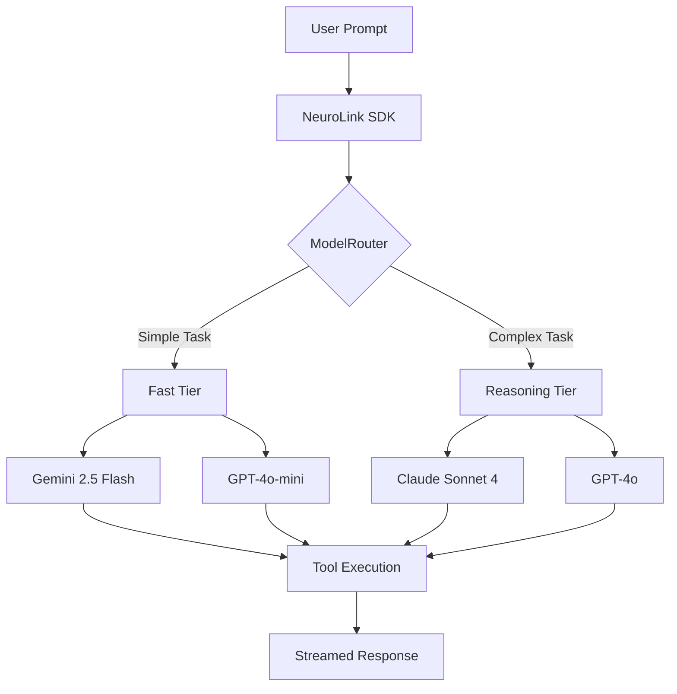

You will build a TypeScript agent that routes tasks to the best AI model -- OpenAI for speed, Claude for reasoning, Gemini for multimodal -- with automatic fallback when any provider fails.

By the end of this step-by-step tutorial, you will have a production-ready multi-provider agent that:

- Switches between providers per-request with a single parameter change
- Defines custom tools with Zod schemas for type-safe function calling
- Streams responses in real-time for instant user feedback
- Falls back automatically when a provider is unavailable
- Routes tasks to the optimal model based on complexity
- Runs consensus workflows for critical decisions

Let us build it.

## Prerequisites and Project Setup

You need Node.js 18+ and TypeScript 5.x installed. Create a new project:

```bash
mkdir agent-demo && cd agent-demo
npm init -y
npm install @juspay/neurolink ai zod
npm install -D typescript @types/node
npx tsc --init
```

Set up your environment variables. NeuroLink auto-loads `.env` files:

```bash
OPENAI_API_KEY=sk-...
ANTHROPIC_API_KEY=sk-ant-...
GOOGLE_API_KEY=AIza...
```

You need at least one provider key to follow along. Two or more keys enable the fallback and multi-provider patterns.

> **Warning:** Never commit `.env` files to version control. Add `.env` to your `.gitignore` immediately.
{: .prompt-warning }


## Step 1: Initialize the NeuroLink SDK

Start by creating a single NeuroLink instance. One constructor, one `generate()` method, one `stream()` method -- regardless of which provider handles the request.

```typescript
import { NeuroLink } from "@juspay/neurolink";

const neurolink = new NeuroLink();

// Or with orchestration enabled for automatic model routing
const neurolinkWithRouting = new NeuroLink({
  enableOrchestration: true,
});

// Provider and model are specified per-request in generate()/stream() calls,
// not in the constructor.
```

The constructor accepts optional configuration for conversation memory, orchestration, HITL, tool registry, and observability. For now, a bare `new NeuroLink()` is all you need.

The key insight: provider and model are **per-request** parameters, not constructor parameters. This means you can route different requests to different providers without creating multiple NeuroLink instances.

## Step 2: Define Custom Tools with Zod Schemas

Now you will define tools that make your agent actionable. Each tool has a description (so the LLM knows when to use it), a Zod schema (for type-safe arguments), and an execute function:

> **Security Warning:** The `Function()` constructor below is equivalent to `eval()`. In production, replace it with a safe math parser like [mathjs](https://mathjs.org/) (`math.evaluate(expression)`) to prevent arbitrary code execution from LLM-generated expressions.
{: .prompt-danger }

```typescript
import { z } from "zod";
import { tool } from "ai";

const searchTool = tool({
  description: "Search the knowledge base for relevant information",
  parameters: z.object({
    query: z.string().describe("Search query"),
    limit: z.number().optional().describe("Max results"),
  }),
  execute: async ({ query, limit = 5 }) => {
    // Replace with your actual search implementation
    const results = await searchDatabase(query, limit);
    return { results, count: results.length };
  },
});

const calculatorTool = tool({
  description: "Perform mathematical calculations",
  parameters: z.object({
    expression: z.string().describe("Math expression to evaluate"),
  }),
  execute: async ({ expression }) => {
    // IMPORTANT: Use mathjs in production — Function() is unsafe with LLM input
    // import { evaluate } from 'mathjs';
    // const result = evaluate(expression);
    const sanitized = expression.replace(/[^0-9+\-*/().%\s]/g, '');
    if (!sanitized) return { expression, error: "Invalid expression" };
    const result = Function(`"use strict"; return (${sanitized})`)();
    return { expression, result: String(result) };
  },
});

const tools = { search: searchTool, calculator: calculatorTool };
```

The `.describe()` method on Zod fields is important -- it tells the LLM what each parameter means, improving the quality of generated arguments. Be specific: "Search query string" is better than "query."

## Step 3: Generate with Provider Switching

Now you will use the same code and tools with different providers. Switch models by changing two parameters:

```typescript
// Fast task -> OpenAI GPT-4o-mini
const quickAnswer = await neurolink.generate({
  input: { text: "What is 2 + 2?" },
  provider: "openai",
  model: "gpt-4o-mini",
  tools,
});

// Reasoning task -> Anthropic Claude
const analysis = await neurolink.generate({
  input: { text: "Analyze this contract for legal risks..." },
  provider: "anthropic",
  model: "claude-sonnet-4-20250514",
  tools,
  maxTokens: 4096,
});

// Multimodal task -> Google Gemini
const imageAnalysis = await neurolink.generate({
  input: {
    text: "Describe what you see in this image",
    images: [imageBuffer],
  },
  provider: "google-ai",
  model: "gemini-2.5-flash",
});

console.log(quickAnswer.content);
console.log(analysis.content);
console.log(imageAnalysis.content);
```

Three observations:

1. **The interface is identical**. `generate()` takes the same options regardless of provider. The `input`, `tools`, `maxTokens`, and other parameters work the same way across all providers.

2. **Tools are portable**. The same `tools` object works with OpenAI, Anthropic, and Google. NeuroLink handles the provider-specific tool calling formats internally.

3. **Multimodal is built in**. The `images` field in the input enables vision capabilities on providers that support it. No special configuration required.

## Step 4: Add Automatic Fallback

Next, you will add automatic failover. When OpenAI is down, your agent falls back to Anthropic or Google instead of returning an error.

```typescript
import { createAIProviderWithFallback } from "@juspay/neurolink";

// Primary: OpenAI, Fallback: Vertex AI
const { primary, fallback } = await createAIProviderWithFallback(
  "openai",
  "vertex"
);

async function resilientGenerate(prompt: string) {
  try {
    return await neurolink.generate({
      input: { text: prompt },
      provider: "openai",
      tools,
    });
  } catch (error) {
    console.warn("Primary provider failed, using fallback:", error.message);
    return await neurolink.generate({
      input: { text: prompt },
      provider: "vertex",
      tools,
    });
  }
}
```

The `createAIProviderWithFallback()` function from `@juspay/neurolink` sets up a primary/fallback pair with built-in circuit breaker logic. After repeated failures on the primary, requests are routed directly to the fallback without even attempting the primary -- reducing latency during outages.

For more sophisticated fallback strategies, use NeuroLink's `CircuitBreaker` class with configurable failure thresholds and cooldown periods.

## Step 5: Stream Responses in Real Time

Now you will add streaming so users see text appearing word by word instead of waiting 5-10 seconds for a complete response.

```typescript
const result = await neurolink.stream({
  input: { text: "Write a comprehensive guide to TypeScript generics" },
  provider: "openai",
  model: "gpt-4o",
  tools,
  temperature: 0.7,
  maxTokens: 2000,
});

for await (const chunk of result.stream) {
  if ("content" in chunk) {
    process.stdout.write(chunk.content);
  }
}

// Access analytics after stream completes
const analytics = await result.analytics;
console.log("Token usage:", analytics?.providerAnalytics?.tokenUsage);
```

The `result.stream` async iterable yields typed chunks. Text chunks have `type: "text"` and a `content` field. Tool call chunks and other event types are also available for advanced use cases.

After the stream completes, `result.analytics` provides token usage, latency, and other metrics. This data is available even for streaming requests, though it is only complete after the stream finishes.

## Step 6: Smart Model Routing

Instead of manually choosing a provider for every request, you will enable automatic routing. NeuroLink's `ModelRouter` classifies prompts by complexity and selects the optimal model:

```typescript
// Enable orchestration for automatic routing
const neurolink = new NeuroLink({
  enableOrchestration: true,
});

// NeuroLink automatically classifies and routes:
// Simple prompts -> fast model (gemini-2.5-flash)
// Complex prompts -> reasoning model (claude-sonnet-4)

const result = await neurolink.generate({
  input: { text: "Design a distributed caching architecture" },
  // No provider specified -- NeuroLink routes automatically
});

console.log("Routed to:", result.provider, result.model);
```

The `ModelRouter` uses a `BinaryTaskClassifier` to determine prompt complexity. Simple prompts (questions, classifications, formatting) route to the fast tier. Complex prompts (analysis, planning, multi-step reasoning) route to the reasoning tier.

The routing configuration uses two tiers from `MODEL_CONFIGS`:

| Tier | Models | Avg Latency | Cost |
|------|--------|-------------|------|
| Fast | Gemini 2.5 Flash, GPT-4o-mini | ~800ms | Low |
| Reasoning | Claude Sonnet 4, GPT-4o | ~3000ms | Higher |

This achieves the best of both worlds: fast responses for simple tasks and high-quality responses for complex ones, with cost savings of 60% or more compared to routing everything through reasoning models.

## Architecture overview



## Step 7: Consensus Workflows for Critical Decisions

For high-stakes decisions, you will run multiple models in parallel and let a judge select the best response:

```typescript
import { CONSENSUS_3_WORKFLOW } from "@juspay/neurolink";

const result = await neurolink.generate({
  input: { text: "Should we migrate from PostgreSQL to DynamoDB?" },
  workflowConfig: CONSENSUS_3_WORKFLOW,
});

console.log("Best response:", result.content);
console.log("Selected model:", result.workflow?.selectedModel);
console.log("Workflow time:", result.workflow?.metrics?.totalTime);
```

The `CONSENSUS_3_WORKFLOW` runs three models (from different providers) on the same prompt. A judge model evaluates the responses and selects the best one based on quality, accuracy, and completeness. This is expensive (3x the cost of a single call) but provides higher confidence for critical decisions.

Other built-in workflows include `QUALITY_MAX_WORKFLOW` for maximum quality and adaptive workflows that adjust strategy based on task characteristics.

## Complete agent code

Here is the full agent combining all the patterns into a single file:

> **Security Warning:** The `Function()` constructor below is equivalent to `eval()`. In production, replace it with a safe math parser like [mathjs](https://mathjs.org/) (`math.evaluate(expression)`) to prevent arbitrary code execution from LLM-generated expressions.
{: .prompt-danger }

```typescript
import { NeuroLink } from "@juspay/neurolink";
import { z } from "zod";
import { tool } from "ai";

// Define tools
const tools = {
  search: tool({
    description: "Search for information",
    parameters: z.object({
      query: z.string().describe("Search query"),
    }),
    execute: async ({ query }) => {
      // Your search implementation
      return { results: [`Result for: ${query}`] };
    },
  }),
  calculator: tool({
    description: "Perform calculations",
    parameters: z.object({
      expression: z.string().describe("Math expression"),
    }),
    execute: async ({ expression }) => {
      // IMPORTANT: Use mathjs in production — Function() is unsafe with LLM input
      // import { evaluate } from 'mathjs';
      // const result = evaluate(expression);
      const sanitized = expression.replace(/[^0-9+\-*/().%\s]/g, '');
      if (!sanitized) return { expression, error: "Invalid expression" };
      const result = Function(`"use strict"; return (${sanitized})`)();
      return { expression, result: String(result) };
    },
  }),
};

// Initialize with smart routing
const neurolink = new NeuroLink({
  enableOrchestration: true,
});

// Generate with automatic provider selection
async function agentGenerate(prompt: string) {
  try {
    const result = await neurolink.stream({
      input: { text: prompt },
      tools,
    });

    for await (const chunk of result.stream) {
      if ("content" in chunk) {
        process.stdout.write(chunk.content);
      }
    }

    console.log("\n---");
    const analytics = await result.analytics;
    console.log("Provider:", analytics?.provider);
    console.log("Tokens:", analytics?.providerAnalytics?.tokenUsage);
  } catch (error) {
    console.error("Agent error:", error.message);
  }
}

// Run the agent
await agentGenerate("What is the square root of 144? Use the calculator tool.");
```

## Production checklist

Before deploying your multi-provider agent to production:

- [ ] **Set timeouts per provider**: Use the `timeout` option in generate/stream calls to prevent hanging requests.
- [ ] **Monitor token usage and costs**: Use NeuroLink's analytics middleware to track per-request costs across providers.
- [ ] **Enable observability**: Initialize OpenTelemetry with `initializeOpenTelemetry()` for distributed tracing across the full agent execution.
- [ ] **Configure conversation memory**: For multi-turn agents, enable Redis-backed memory for persistence.
- [ ] **Add HITL for dangerous tools**: Use `dangerousActions` to require human approval for sensitive operations.
- [ ] **Test with multiple providers**: Verify your agent works correctly with each provider you plan to use. Tool calling behavior can vary.
- [ ] **Pin model versions**: Use specific model versions (e.g., `claude-sonnet-4-20250514`) rather than aliases in production.

## What you built and What's Next

You built a multi-provider AI agent with tool calling, streaming, automatic failover, smart routing, and consensus workflows. From here, explore:

- [Building RAG Applications with NeuroLink SDK](/posts/rag-implementation/) for retrieval-augmented generation
- [LLM Cost Optimization Strategies](/posts/cost-optimization-strategies/) for advanced cost optimization strategies
- [Building AI Agents with NeuroLink](/posts/building-ai-agents/) for the complete agent architecture guide
- [AI Application Security Checklist](/posts/ai-security-checklist-owasp-top-10-llm/) for securing your agent in production

---

**Related posts:**

- [Building AI Agents with NeuroLink: From Chatbot to Autonomous System](/posts/building-ai-agents/)
- [Multi-Provider Failover: Never Lose an API Call](/posts/provider-failover-patterns/)
- [AI Application Security Checklist: OWASP Top 10 for LLM Applications](/posts/ai-security-checklist-owasp-top-10-llm/)
