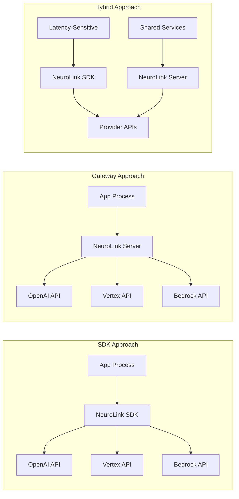

When you need to unify multiple AI providers behind a single interface, you face a fundamental architectural choice: put the abstraction in a **library** (SDK) or in a **service** (gateway). Both solve the same problem, but they make radically different trade-offs.

LangChain is an SDK. LiteLLM Proxy is a gateway. Portkey is a gateway (now part of Palo Alto Networks' Prisma AIRS platform since May 2026). NeuroLink is an SDK with optional gateway capabilities. Each approach has genuine strengths that matter in different contexts.

This comparison examines both approaches with evidence from real projects: what each gives you, what each costs you, and a decision framework for choosing. We also cover the hybrid pattern -- SDK for latency-sensitive paths, gateway for shared services -- which avoids the forced either/or choice.

> **Tested: 2026-07-04 against NeuroLink v9.81.** Provider count has grown from 13 at the original writing to 29+ named providers. Competitor status has changed materially: Portkey was acquired by Palo Alto Networks (closed May 29, 2026) and Helicone entered maintenance mode (acquired by Mintlify, March 2026). All claims below reflect the current state.

## Defining the Two Approaches

### The SDK Approach

An SDK is a library imported directly into your application code. Provider logic executes in the same process as your application. There is no network hop between your code and the AI provider (beyond the provider API itself).

```typescript
// From src/lib/neurolink.ts - SDK initialization is zero-infrastructure
import { NeuroLink } from '@juspay/neurolink';

const neurolink = new NeuroLink();

const result = await neurolink.generate({
  input: { text: 'Explain quantum computing' },
  provider: 'vertex',
  model: 'gemini-2.5-flash'
});
```

Configuration happens through code, environment variables, or config files. There is no server to deploy, no endpoint to configure, no infrastructure to manage. `npm install` and you are running.

### The Gateway Approach

A gateway is a centralized proxy service that routes AI requests. Applications send HTTP requests to the gateway, which forwards them to the appropriate provider. The gateway is the single point of contact for all AI interactions.

Configuration happens through an API or admin dashboard. The gateway manages API keys centrally, applies rate limits, logs requests, caches responses, and handles authentication. Applications are thin clients that know nothing about providers.

### Comparison Table

| Dimension | SDK | Gateway |
|-----------|-----|---------|
| **Latency** | No proxy hop | +5-50ms per request |
| **Ops Overhead** | Zero (library) | Service to deploy, scale, monitor |
| **Type Safety** | Full (TypeScript end-to-end) | Lost at HTTP boundary |
| **Auth Management** | Per-application | Centralized |
| **Team Autonomy** | Each team controls their AI | Central team controls AI |
| **Observability** | Per-application | Centralized |
| **Deployment** | Any runtime (Node, Edge, Lambda) | Requires a running service |
| **Multi-language** | TypeScript only | Any language via HTTP |

## Why NeuroLink Chose SDK-First

Five factors drove the decision to build NeuroLink as an SDK rather than a gateway.

### Zero Additional Latency

Every AI request to a gateway adds a network hop. In a data center, that is 1-5ms. Across regions, it is 20-50ms. For streaming responses, the proxy adds latency to every chunk. For agentic workloads with multiple tool calls per request, the latency compounds: 10 tool calls through a gateway adds 50-500ms of pure proxy overhead.

With an SDK, the generate call goes directly from your process to the provider's API. No intermediate hop.

### Type Safety End-to-End

TypeScript types flow from the SDK into your application code. Tool parameters are validated by Zod schemas at compile time. Generate results have typed fields. Stream chunks are discriminated unions. Error types are narrowable with `instanceof`.

With a gateway, you lose type safety at the HTTP boundary. Request bodies are untyped JSON. Response shapes depend on runtime behavior. You need to write validation code that the SDK provides for free.

### No Infrastructure Dependency

An SDK works without any deployed service. It runs on your laptop, in a CI pipeline, on a Lambda function, on a Cloudflare Worker, on a Vercel Edge Function. There is no gateway URL to configure, no health check to wait for, no service to keep running.

This is not just a convenience -- it is an architectural constraint. A gateway creates a dependency that every application must account for in its availability calculations. If the gateway goes down, every application goes down.

### Edge and Serverless Compatibility

SDKs run on any JavaScript runtime: Node.js, Bun, Deno, Cloudflare Workers, Vercel Edge Functions. A gateway requires a running server, which means it cannot run on edge platforms or within serverless functions without an external deployment.

NeuroLink's Hono adapter runs natively on Workers and Edge -- something a gateway architecture cannot match without deploying the gateway to those platforms.

### Developer Experience

`npm install @juspay/neurolink` and you are running. No service to deploy, no Docker container to start, no admin dashboard to configure. For a developer building a prototype or a small team shipping a feature, the SDK path removes all operational friction.

## The server adapter layer: Best of Both Worlds

NeuroLink recognized that some teams genuinely need gateway capabilities: centralized API key management, organization-wide rate limiting, a REST API for non-TypeScript clients. Rather than forcing a choice, NeuroLink provides an optional server adapter layer that adds gateway capabilities to the SDK.

```typescript
// From src/lib/server/factory/serverAdapterFactory.ts
// When you need gateway capabilities, add a server layer
import { NeuroLink } from '@juspay/neurolink';
import { createServer } from '@juspay/neurolink/server';

const neurolink = new NeuroLink();
const server = await createServer(neurolink, {
  framework: 'hono', // or 'express', 'fastify', 'koa'
  config: {
    port: 3000,
    cors: { enabled: true },
    rateLimit: { enabled: true, maxRequests: 100 }
  }
});

await server.initialize();
await server.start();
```

The `ServerAdapterFactory` supports four frameworks: Hono (with multi-runtime support for Node.js, Bun, and Deno), Express, Fastify, and Koa. Each adapter provides the same route surface and middleware capabilities.

Built-in server middleware includes:

- CORS configuration
- Rate limiting with configurable windows
- API key and JWT authentication
- Body parsing and validation
- Request metrics and timing
- Health check endpoints

The critical point: the server adapter is the **same SDK** exposed over HTTP. There is no separate gateway codebase. The same NeuroLink instance, the same provider registrations, the same middleware chain -- just accessible via REST.

## When to Choose Gateway Over SDK

To be fair, the SDK-first approach is not universally correct. Gateways have genuine advantages in several important scenarios:

### Non-TypeScript Clients

If your organization has Python, Go, Java, or Ruby services that need AI capabilities, they cannot import a TypeScript SDK. A gateway provides a language-agnostic REST API that any HTTP client can consume.

NeuroLink's server adapter solves this by letting you deploy the SDK as a gateway for non-TypeScript consumers while keeping the SDK for TypeScript applications.

### Centralized API Key Management

In large organizations, managing API keys across dozens of services is a security and operational burden. A gateway centralizes key management: services authenticate to the gateway, and the gateway authenticates to providers. No provider API keys in application code.

### Organization-Wide Rate Limiting

When multiple teams share provider quotas, per-application rate limiting is insufficient. A gateway can enforce organization-wide limits across all services, preventing one team from consuming the entire quota.

### Audit Logging at the Infrastructure Level

Some compliance requirements mandate centralized logging of all AI interactions. A gateway provides a single point for comprehensive audit logs without requiring every application to implement its own logging.

### API-Over-Library Teams

Some organizations prefer the API consumption model. Developers consume REST APIs; they do not install SDKs. For these teams, a gateway is the natural interface.

## The hybrid pattern

Rather than choosing one approach exclusively, the evidence points toward a hybrid: use the SDK where latency and type safety matter, and the gateway where central control matters.



### When to Use Each Mode

- **SDK for**: Real-time streaming, function calling, agentic loops, edge deployments, serverless functions -- anything where latency matters or where you need type safety.

- **Gateway for**: Batch processing, admin APIs, non-TypeScript clients, centralized rate limiting, audit logging -- anything where central control matters more than latency.

### Shared Configuration

Both modes share the same configuration via environment variables. Set `OPENAI_API_KEY` once, and it works whether the request comes through the SDK or the gateway. The NeuroLink instance is the same in both cases.

### Production Lifecycle Management

The server adapter includes built-in lifecycle management for production gateways:

```typescript
// From src/lib/server/abstract/baseServerAdapter.ts
// Built-in lifecycle management for production gateways
export abstract class BaseServerAdapter extends EventEmitter {
  protected lifecycleState: ServerLifecycleState = 'uninitialized';
  protected activeConnections: Map<string, TrackedConnection> = new Map();

  protected async gracefulShutdown(): Promise<void> {
    this.lifecycleState = 'draining';
    await this.stopAcceptingConnections();
    await this.drainConnections();
    this.lifecycleState = 'stopping';
    await this.closeServer();
  }
}
```

The `BaseServerAdapter` tracks active connections, supports graceful shutdown with connection draining, and manages the server lifecycle through well-defined states: uninitialized, initializing, initialized, starting, running, draining, stopping, stopped, error. This is production-grade lifecycle management that handles rolling deployments and zero-downtime restarts.

### The SDK-First Landscape in 2026

It is worth noting that the SDK-first approach has gained significant traction. Mastra -- a TypeScript AI agent framework ($35M total funding, ~25K GitHub stars as of July 2026) -- also embraced the SDK pattern. Mastra's v1.47.0 introduced a `GatewayManager` primitive that centralizes model discovery and authentication across providers, closely mirroring the hybrid pattern NeuroLink has offered since launch: a library-first core with optional centralized routing. The parallel architectures suggest the ecosystem is converging on SDK-with-optional-gateway as the dominant pattern for TypeScript shops.

## Decision framework

Use this decision matrix to choose the right approach for your organization:

| If You Need... | Choose |
|----------------|--------|
| Minimum latency | SDK |
| Type safety in TypeScript | SDK |
| Edge/serverless deployment | SDK |
| Quick prototyping | SDK |
| Non-TypeScript client support | Gateway (server adapter) |
| Centralized API key management | Gateway |
| Organization-wide rate limiting | Gateway |
| Compliance audit logging | Gateway |
| Both latency-sensitive and shared-service patterns | Hybrid |

### The Sweet Spot

For most teams, the answer is **SDK-first with optional gateway**. Start with the SDK for its zero-infrastructure simplicity and type safety. When you need gateway capabilities for specific use cases, add the server adapter. You do not need to choose one architecture and commit to it forever -- NeuroLink supports both without code changes.

## The verdict

Neither approach is universally better. The right choice depends on your deployment model, latency requirements, language ecosystem, and team structure. The evidence shows:

- **SDKs win** on latency, type safety, edge compatibility, and developer onboarding speed.
- **Gateways win** on centralized governance, multi-language support, and organization-wide observability.
- **Hybrid approaches** avoid the forced trade-off by using each where it fits best.

NeuroLink chose SDK-first because it optimizes for the most common case -- TypeScript developers who want to start fast and deploy anywhere -- while the server adapter covers gateway use cases without a separate codebase. But teams with strong centralized governance needs or polyglot stacks may reasonably start gateway-first.

For how the SDK architecture enables serverless deployment, see [Serverless AI: Running NeuroLink on AWS Lambda, Vercel, and Cloudflare Workers](/posts/serverless-ai/). For the factory pattern that makes provider registration scale, see [The Factory + Registry Pattern](/posts/factory-registry-pattern/).

---

**Related posts:**

- [Serverless AI: Running NeuroLink on AWS Lambda, Vercel, and Cloudflare Workers](/posts/serverless-ai/)
- [The Factory + Registry Pattern: How NeuroLink Breaks Circular Dependencies](/posts/factory-registry-pattern/)
- [What is NeuroLink? The Unified AI SDK Explained](/posts/what-is-neurolink-unified-sdk/)
