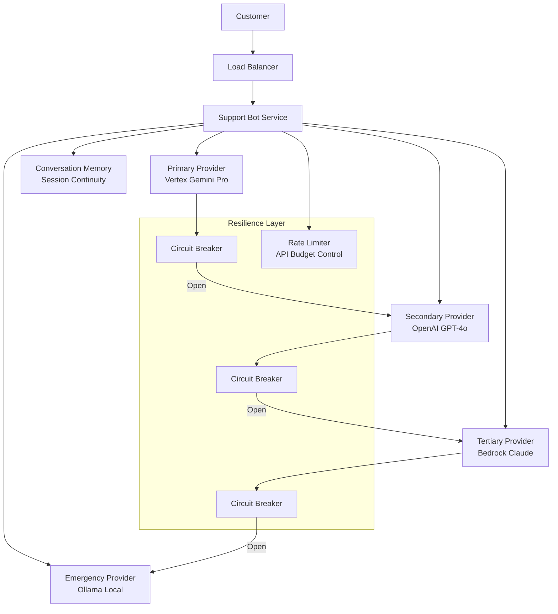

You will build an enterprise customer support bot with 99.9% uptime using NeuroLink's multi-provider fallback, circuit breakers, rate limiting, and conversation memory. By the end of this tutorial, your bot will automatically switch providers during outages, maintain session continuity across switches, and handle zero-downtime deployments.

> **Note:** The 99.9% uptime target refers specifically to the AI provider availability layer (achieved through multi-provider failover). Overall system uptime depends on all infrastructure components — databases, networking, deployment platform, and monitoring. A comprehensive SLA requires end-to-end reliability engineering beyond the AI layer.
{: .prompt-info }

## High-availability architecture

Start by understanding the architecture that makes 99.9% uptime achievable. The key insight: every component has a fallback, and every fallback has a fallback.



The architecture centers on a fallback chain pattern. Each provider in the chain is wrapped in a `CircuitBreaker` that monitors its health in real time. When a provider starts failing (three consecutive failures by default), the circuit breaker "opens" and all traffic is immediately routed to the next provider in the chain. No manual intervention required.

The `CircuitBreakerManager` from NeuroLink coordinates all breakers centrally. It tracks which providers are healthy, which are in recovery (half-open state), and which are completely down. The emergency fallback to Ollama running locally ensures that even if every cloud provider is down simultaneously, customers still get responses -- perhaps slower, perhaps less sophisticated, but never silence.

External tool integrations such as CRM lookups and ticket creation are similarly protected by `MCPCircuitBreaker`, ensuring that a flaky third-party API does not cascade into a full system failure.

## Multi-provider fallback chain

The core of our resilience strategy is the provider cascade. Each provider gets its own circuit breaker configuration tuned to its characteristics. A cloud provider with lower latency expectations gets a tighter timeout. A more reliable but slower provider gets a higher failure threshold.

```typescript
import {
  AIProviderFactory,
  CircuitBreaker,
  withRetry,
  RateLimiter,
} from '@juspay/neurolink';
import { MCPCircuitBreaker, CircuitBreakerManager } from '@juspay/neurolink';

const cbManager = new CircuitBreakerManager();

// Create circuit breakers for each provider
const vertexBreaker = cbManager.getBreaker("vertex", {
  failureThreshold: 3,
  resetTimeout: 30000,
  halfOpenMaxCalls: 2,
  operationTimeout: 15000,
});
const openaiBreaker = cbManager.getBreaker("openai", {
  failureThreshold: 3,
  resetTimeout: 30000,
});
const bedrockBreaker = cbManager.getBreaker("bedrock", {
  failureThreshold: 5,
  resetTimeout: 60000,
});

// Provider cascade with circuit breakers
async function getResponse(userMessage: string, sessionId: string) {
  const providers = [
    { name: "vertex", model: "gemini-2.5-pro", breaker: vertexBreaker },
    { name: "openai", model: "gpt-4o", breaker: openaiBreaker },
    { name: "bedrock", model: null, breaker: bedrockBreaker },
    { name: "ollama", model: "llama3.1:8b", breaker: null }, // No breaker for local
  ];

  for (const { name, model, breaker } of providers) {
    try {
      const provider = await AIProviderFactory.createProvider(name, model);

      const execute = () => withRetry(
        () => provider.generate({
          input: { text: userMessage },
          sessionId, // Use session for conversation continuity
          disableTools: false,
        }),
        { maxAttempts: 2, initialDelay: 1000 }
      );

      const result = breaker
        ? await breaker.execute(execute)
        : await execute();

      return { response: result, provider: name };
    } catch (error) {
      console.warn(`Provider ${name} failed, trying next...`);
      continue;
    }
  }

  return {
    response: "We're experiencing issues. A human agent will assist you shortly.",
    provider: "fallback",
  };
}
```

Let us break down what is happening here. The `CircuitBreakerManager` manages multiple breakers through a single interface. Each breaker tracks the health of its provider using a state machine with three states:

- **Closed** (healthy): Requests pass through normally. Failures are counted.
- **Open** (unhealthy): After `failureThreshold` consecutive failures, the breaker opens. All requests immediately fail without calling the provider, enabling instant fallback to the next provider in the chain.
- **Half-open** (recovering): After `resetTimeout` milliseconds, the breaker allows `halfOpenMaxCalls` test requests through. If they succeed, the breaker closes again. If they fail, it reopens.

The `withRetry` wrapper adds an additional layer: each individual call gets up to two attempts with a one-second initial delay and exponential backoff. This handles transient network blips without triggering the circuit breaker for temporary issues.

The Ollama emergency fallback has no circuit breaker because it is running locally. If the local model is down, the entire machine is likely down, and no amount of circuit breaking will help.

> **Tip:** Call `getHealthSummary()` on your `CircuitBreakerManager` to get a snapshot of all breaker states. Feed this into your monitoring dashboard for real-time visibility.
{: .prompt-tip }

## Conversation memory for session continuity

Next, you will add conversation memory so customers never notice a provider switch. NeuroLink stores conversation history independently of the provider, so any provider can pick up where the last one left off.

```typescript
// Environment configuration
process.env.NEUROLINK_MEMORY_ENABLED = "true";
process.env.NEUROLINK_MEMORY_MAX_SESSIONS = "10000";
process.env.NEUROLINK_SUMMARIZATION_ENABLED = "true";
process.env.NEUROLINK_TOKEN_THRESHOLD = "100000";

// From NeuroLink's conversation memory configuration:
// MEMORY_THRESHOLD_PERCENTAGE = 0.8 -- triggers summarization at 80% of context
// RECENT_MESSAGES_RATIO = 0.3 -- keeps 30% as recent, summarizes 70%
// CONVERSATION_INSTRUCTIONS appended to system prompt for context awareness
```

The memory system is token-aware. When a conversation grows long -- as support conversations often do, with back-and-forth troubleshooting -- the system automatically summarizes older messages when the conversation exceeds 80% of the model's context window. The 30% most recent messages are preserved verbatim to maintain immediate context, while the older 70% gets condensed into a summary.

This means a customer who has been going back and forth for thirty messages does not lose context, but the system also does not burn excessive tokens sending the entire history to the LLM on every turn.

When structured output is needed (for example, when the bot creates a support ticket), `STRUCTURED_OUTPUT_INSTRUCTIONS` are appended to ensure the LLM returns clean JSON that can be parsed programmatically and fed directly into your ticketing system.

## Rate limiting and cost control

Now you will add rate limiting and cost control. Your bot needs to handle burst traffic during outages without bankrupting the company on API costs.

```typescript
import { RateLimiter } from '@juspay/neurolink';
import { ModelConfigurationManager } from '@juspay/neurolink';

const modelConfig = ModelConfigurationManager.getInstance();

// Per-customer rate limiter
const customerLimiters = new Map<string, RateLimiter>();

function getCustomerLimiter(customerId: string): RateLimiter {
  if (!customerLimiters.has(customerId)) {
    customerLimiters.set(customerId, new RateLimiter(20, 60000)); // 20 msgs/min
  }
  return customerLimiters.get(customerId)!;
}

// Cost tracking per interaction
const vertexCost = modelConfig.getCostInfo("vertex", "gemini-2.5-pro");
// Returns: { input: 0.000075, output: 0.0003 }
```

The `RateLimiter` uses a sliding window algorithm, allowing 20 messages per minute per customer by default. This prevents a single automated client from consuming your entire API budget while still allowing normal human conversation rates.

Cost optimization goes further with intelligent routing. Simple queries like "What are your business hours?" do not need GPT-4o. Route them to a fast, cheap model and save the expensive reasoning models for complex troubleshooting:

```typescript
async function routeByComplexity(message: string, sessionId: string) {
  const isSimple = message.length < 100;

  if (isSimple) {
    // Fast tier: ~$0.0001 per query
    return neurolink.generate({
      input: { text: message },
      provider: "vertex",
      model: "gemini-2.5-flash",
    });
  }

  // Quality tier: ~$0.003 per query
  return neurolink.generate({
    input: { text: message },
    provider: "vertex",
    model: "gemini-2.5-pro",
  });
}
```

## MCP tool integration for CRM access

Next, you will connect your bot to real backend systems. NeuroLink's MCP integration provides a standardized tool interface for CRM lookups, ticket creation, and knowledge base search.

```typescript
import { MCPRegistry } from '@juspay/neurolink';

const mcpRegistry = new MCPRegistry();

// Register CRM tool server
await mcpRegistry.registerServer("crm-connector", {
  description: "Customer CRM data access",
  tools: {
    lookupCustomer: { /* tool schema */ },
    createTicket: { /* tool schema */ },
    getOrderHistory: { /* tool schema */ },
  },
});

// Register knowledge base server
await mcpRegistry.registerServer("kb-search", {
  description: "Internal knowledge base search",
  tools: {
    searchArticles: { /* tool schema */ },
    getArticle: { /* tool schema */ },
  },
});

// List all available tools
const tools = await mcpRegistry.listTools();
// Returns: [{ name: "lookupCustomer", serverId: "crm-connector" }, ...]
```

The `MCPRegistry` manages all external tool integrations. Each tool server (CRM, knowledge base, ticketing system) is registered with its available tools and their schemas. When the LLM decides it needs to look up a customer record, it calls `lookupCustomer` through the registry, which routes the call to the appropriate backend.

Each tool call is wrapped with `MCPCircuitBreaker` for fault tolerance. If your CRM API starts timing out, the circuit breaker prevents the support bot from hanging on every request. Instead, the bot gracefully acknowledges that it cannot access customer data at the moment and offers alternative help.

## Monitoring and health checks

You will now add health monitoring so you can maintain 99.9% uptime with full visibility into provider health.

```typescript
// Health check endpoint
app.get("/health", (req, res) => {
  const health = cbManager.getHealthSummary();
  const stats = {
    ...health,
    memoryEnabled: process.env.NEUROLINK_MEMORY_ENABLED === "true",
    providers: cbManager.getBreakerNames().map(name => ({
      name,
      ...cbManager.getBreaker(name).getStats(),
    })),
  };
  const status = health.openBreakers > 2 ? 503 : 200;
  res.status(status).json(stats);
});
```

The health check returns detailed statistics for each provider: current circuit breaker state, total call count, failure rate, and next retry time for open breakers. When more than two breakers are open (meaning three of your four providers are down), the endpoint returns a 503, triggering your load balancer to route traffic to backup instances or alerting your operations team.

Each breaker's `getStats()` returns a `CircuitBreakerStats` object with `state`, `totalCalls`, `failureRate`, and `nextRetryTime`. Feed these into Grafana, Datadog, or your preferred observability platform for real-time dashboards.

You can also use `ServiceRegistry.getRegisteredServices()` for a broader view of all registered services and their health, including MCP tool servers.

## Graceful shutdown

Finally, you will add graceful shutdown for zero-downtime deployments. The `GracefulShutdown` utility ensures in-flight conversations complete before the old instance shuts down.

```typescript
import { GracefulShutdown } from '@juspay/neurolink';

const shutdown = new GracefulShutdown();

// Track in-flight requests
app.use((req, res, next) => {
  const promise = handleRequest(req, res);
  shutdown.track(promise);
  next();
});

// Clean shutdown
process.on("SIGTERM", async () => {
  await shutdown.shutdown(30000); // 30s grace period
  cbManager.destroyAll(); // Clean up circuit breakers
  process.exit(0);
});
```

When a SIGTERM signal arrives (standard for Kubernetes rolling deployments), the shutdown handler waits up to 30 seconds for all tracked in-flight requests to complete. No customer mid-sentence gets an abrupt disconnection. After all requests finish (or the grace period expires), `cbManager.destroyAll()` cleans up all circuit breaker timers and event listeners, preventing memory leaks during shutdown.

## Putting it all together

Here is what the complete support bot looks like when all the pieces come together:

```typescript
import { NeuroLink } from '@juspay/neurolink';

const neurolink = new NeuroLink({
  conversationMemory: true,
  hitl: {
    enabled: true,
    dangerousActions: ['refund', 'account-delete', 'escalate-manager'],
    timeout: 60000,
    autoApproveOnTimeout: false,
  },
});

// Every customer message flows through:
// 1. Rate limiter - prevents abuse
// 2. Provider cascade - tries Vertex, OpenAI, Bedrock, Ollama in order
// 3. Circuit breakers - skips unhealthy providers instantly
// 4. Conversation memory - maintains context across provider switches
// 5. MCP tools - accesses CRM, knowledge base, ticketing
// 6. HITL - requires human approval for refunds and account deletions
// 7. Health monitoring - exposes status for operational visibility
```

> **Warning:** Always set `autoApproveOnTimeout: false` for sensitive actions. A timed-out approval should route to a human agent, never auto-approve a refund or account deletion.
{: .prompt-warning }

## What you built and what's next

You built a support bot with multi-provider failover, circuit breakers, conversation memory, rate limiting, MCP tool integration, and graceful shutdown. To extend this architecture:

- Add multi-agent orchestration for routing different query types to specialized agents
- Set up [production error handling](/posts/error-handling-patterns/) for resilient operations
- Implement [enterprise security patterns](/posts/enterprise-security-guide/) for compliance in regulated industries

---

**Related posts:**

- [Error Handling Patterns for AI Applications](/posts/error-handling-patterns/)
- [Multi-Provider Failover: Never Lose an API Call](/posts/provider-failover-patterns/)
- [Conversation Memory: Building Stateful AI Applications](/posts/conversation-memory-guide/)
