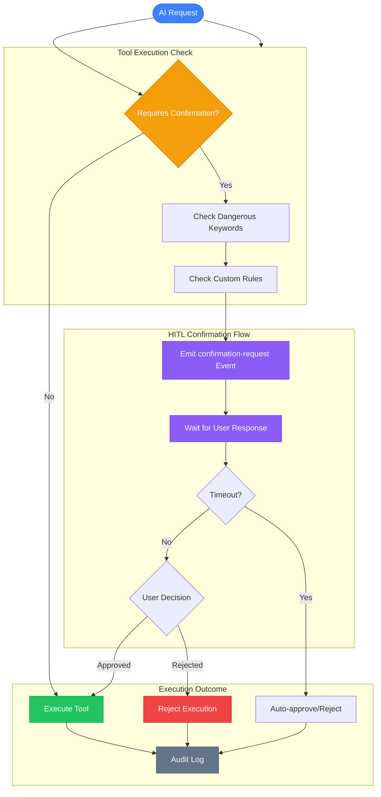
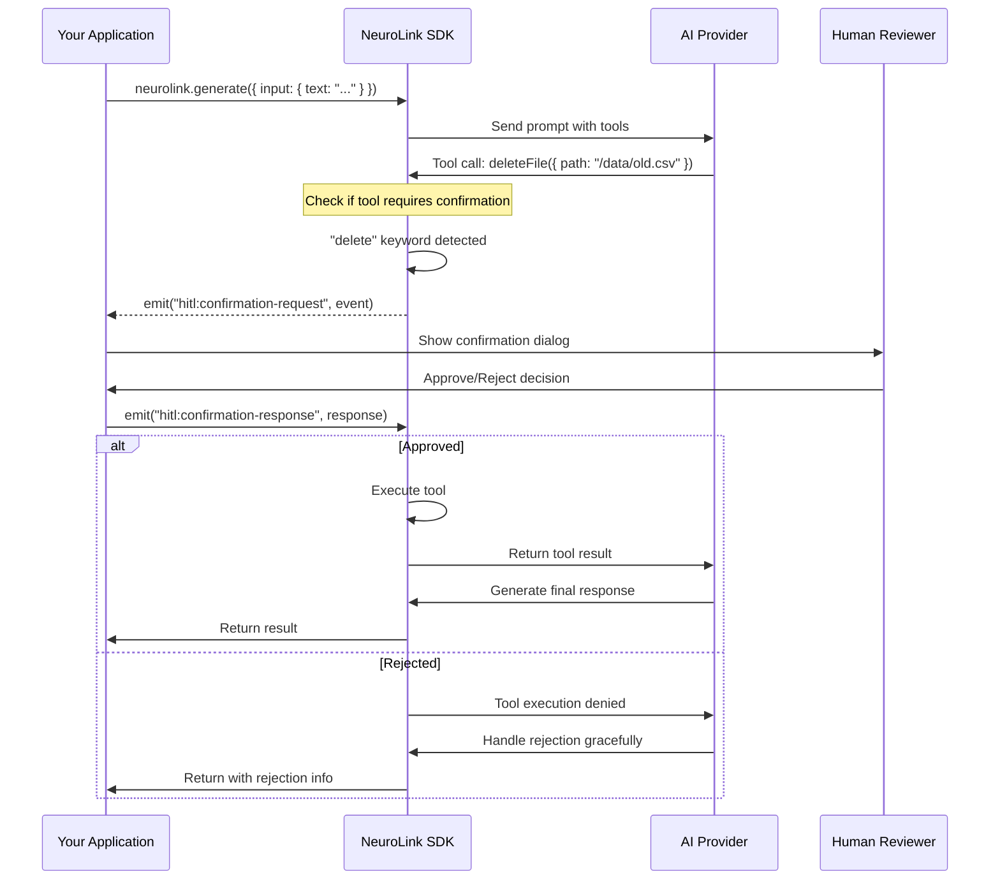

# Human-in-the-Loop (HITL) Security Guide for NeuroLink

## The Missing Safety Layer in Enterprise AI

Deploying AI in production without safety controls is like driving without brakes. When AI assistants can execute tools that delete files, modify databases, or send emails, a single mistake can result in data loss, regulatory fines, and lost customer trust.

Traditional AI frameworks leave you to build safety layers from scratch. NeuroLink takes a different approach: **Human-in-the-Loop (HITL) workflows built directly into the SDK**. With event-based confirmation for dangerous operations, configurable triggers, argument modification support, and comprehensive audit logging, you get production-ready AI safety in minutes rather than months.



---

## Why Enterprise AI Needs HITL

Modern enterprises face a complex landscape where AI assistants are increasingly capable of taking real-world actions. Whether your AI can delete files, execute code, modify databases, or send communications, human oversight is essential for preventing costly mistakes.

### Risk Mitigation

Without HITL safeguards, enterprises face:

- **Data Loss**: Accidental file or database deletions
- **Security Breaches**: Unauthorized code execution
- **Compliance Violations**: Unreviewed actions in regulated domains
- **Reputational Damage**: Automated communications sent without review

### When to Use HITL

**Require confirmation for:**

- File deletion or modification operations
- Database write/delete operations
- Code execution in any environment
- Sending emails or messages
- Making purchases or payments
- Modifying production systems

**Skip confirmation for:**

- Read-only operations (fetching data, searching)
- Content generation without external effects
- Development/testing environments with isolated data

---

## Quick Start: Your First HITL Configuration

Getting started with NeuroLink HITL takes minutes. Here is a complete configuration:

```typescript
import { NeuroLink } from "@juspay/neurolink";

// Configure HITL in the constructor
const neurolink = new NeuroLink({
  hitl: {
    enabled: true,
    dangerousActions: ["delete", "remove", "drop", "truncate", "kill"],
    timeout: 30000, // 30 seconds for user to respond
    allowArgumentModification: false, // Let users edit tool arguments (default: false)
    autoApproveOnTimeout: false, // Reject if user doesn't respond
    auditLogging: true, // Enable audit trail for compliance
  },
});
```

**Configuration Summary:**

| Setting | Value | Description |
|---------|-------|-------------|
| `enabled` | `true` | Master switch for HITL functionality |
| `dangerousActions` | `["delete", ...]` | Keywords that trigger confirmation |
| `timeout` | `30000` | Milliseconds to wait for user response |
| `allowArgumentModification` | `false` | Users can modify tool arguments during approval (default: `false`) |
| `autoApproveOnTimeout` | `false` | Reject operations when timeout occurs |
| `auditLogging` | `true` | Log all HITL events for compliance |

---

## Event-Based Confirmation Workflow

NeuroLink's HITL system uses events for communication between the SDK and your application. When a dangerous tool is about to execute, the SDK emits a confirmation request that your app handles.

### Setting Up Event Listeners

```typescript
import { NeuroLink } from "@juspay/neurolink";

const neurolink = new NeuroLink({
  hitl: {
    enabled: true,
    dangerousActions: ["delete", "remove", "drop"],
    timeout: 30000,
  },
});

// Listen for confirmation requests
neurolink.getEventEmitter().on("hitl:confirmation-request", async (event) => {
  const {
    confirmationId,
    toolName,
    arguments: args,
    timeoutMs,
    allowModification,
  } = event.payload;

  console.log(`HITL: AI wants to execute ${toolName}`);
  console.log(`Arguments:`, JSON.stringify(args, null, 2));

  // Show your application's confirmation UI
  const userDecision = await showConfirmationDialog({
    action: toolName,
    details: args,
    message: `AI wants to ${toolName}. Allow this action?`,
    timeoutMs,
    allowModification,
  });

  // Send response back to NeuroLink
  neurolink.getEventEmitter().emit("hitl:confirmation-response", {
    type: "hitl:confirmation-response",
    payload: {
      confirmationId, // Must match the request
      approved: userDecision.approved,
      reason: userDecision.approved ? undefined : userDecision.reason,
      modifiedArguments: userDecision.modifiedArgs,
      metadata: {
        timestamp: new Date().toISOString(),
        responseTime: Date.now(),
        userId: "current-user-id",
      },
    },
  });
});

// Handle timeouts
neurolink.getEventEmitter().on("hitl:timeout", (event) => {
  console.warn(`HITL timeout for ${event.payload.toolName}`);
  // Notify user that the operation was not completed
});
```

### Complete Flow Diagram



---

## Confirmation Request Event Structure

When HITL is triggered, the SDK emits a structured event with all context needed for the user to make an informed decision:

```typescript
// Event payload structure
interface ConfirmationRequestEvent {
  type: "hitl:confirmation-request";
  payload: {
    // Unique ID to match with response
    confirmationId: string;

    // Tool information
    toolName: string;
    serverId?: string; // MCP server ID if external tool
    actionType: string; // Human-readable description

    // Tool parameters for review
    arguments: unknown;

    // Context metadata
    metadata: {
      timestamp: string; // ISO timestamp
      sessionId?: string;
      userId?: string;
      dangerousKeywords: string[]; // Keywords that triggered HITL
    };

    // Confirmation settings
    timeoutMs: number;
    allowModification: boolean;
  };
}
```

### Example Request Event

```json
{
  "type": "hitl:confirmation-request",
  "payload": {
    "confirmationId": "hitl-1705312800000-a1b2c3d4-e5f6-7890-abcd-ef1234567890",
    "toolName": "deleteFile",
    "actionType": "Delete Operation",
    "arguments": {
      "path": "/data/customer-records.csv"
    },
    "metadata": {
      "timestamp": "2026-01-15T10:00:00.000Z",
      "sessionId": "sess_abc123",
      "userId": "user_456",
      "dangerousKeywords": ["delete"]
    },
    "timeoutMs": 30000,
    "allowModification": false
  }
}
```

---

## Confirmation Response Structure

Your application responds with approval or rejection:

```typescript
// Response payload structure
interface ConfirmationResponseEvent {
  type: "hitl:confirmation-response";
  payload: {
    // Must match the request
    confirmationId: string;

    // User decision
    approved: boolean;
    reason?: string; // Required if rejected

    // Modified arguments (if user edited them)
    modifiedArguments?: unknown;

    // Response metadata
    metadata: {
      timestamp: string;
      responseTime: number; // Milliseconds
      userId?: string;
    };
  };
}
```

### Example Response Events

**Approval:**

```typescript
neurolink.getEventEmitter().emit("hitl:confirmation-response", {
  type: "hitl:confirmation-response",
  payload: {
    confirmationId: "hitl-1705312800000-a1b2c3d4...",
    approved: true,
    metadata: {
      timestamp: new Date().toISOString(),
      responseTime: 5200, // User took 5.2 seconds
      userId: "admin@company.com",
    },
  },
});
```

**Rejection with reason:**

```typescript
neurolink.getEventEmitter().emit("hitl:confirmation-response", {
  type: "hitl:confirmation-response",
  payload: {
    confirmationId: "hitl-1705312800000-a1b2c3d4...",
    approved: false,
    reason: "File contains active customer data - cannot delete",
    metadata: {
      timestamp: new Date().toISOString(),
      responseTime: 12000,
      userId: "admin@company.com",
    },
  },
});
```

**Approval with modified arguments:**

```typescript
neurolink.getEventEmitter().emit("hitl:confirmation-response", {
  type: "hitl:confirmation-response",
  payload: {
    confirmationId: "hitl-1705312800000-a1b2c3d4...",
    approved: true,
    modifiedArguments: {
      path: "/data/archived/customer-records-2024.csv", // Changed path
    },
    metadata: {
      timestamp: new Date().toISOString(),
      responseTime: 8500,
      userId: "admin@company.com",
    },
  },
});
```

---

## Custom Rules for Advanced Scenarios

For complex enterprises, you can define custom rules that go beyond keyword matching:

```typescript
import { NeuroLink } from "@juspay/neurolink";

const neurolink = new NeuroLink({
  hitl: {
    enabled: true,
    dangerousActions: ["delete", "remove"],
    timeout: 60000,
    auditLogging: true,
    customRules: [
      {
        name: "large-batch-operations",
        requiresConfirmation: true,
        condition: (toolName, args) => {
          // Require confirmation for batch operations over 100 items
          if (typeof args === "object" && args !== null) {
            const typedArgs = args as Record<string, unknown>;
            if (Array.isArray(typedArgs.items) && typedArgs.items.length > 100) {
              return true;
            }
          }
          return false;
        },
        customMessage: "Large Batch Operation (100+ items)",
      },
      {
        name: "production-environment",
        requiresConfirmation: true,
        condition: (toolName, args) => {
          // Always confirm operations targeting production
          if (typeof args === "object" && args !== null) {
            const typedArgs = args as Record<string, unknown>;
            return typedArgs.environment === "production";
          }
          return false;
        },
        customMessage: "Production Environment Operation",
      },
      {
        name: "financial-transactions",
        requiresConfirmation: true,
        condition: (toolName, args) => {
          // Require confirmation for transactions over $1000
          if (typeof args === "object" && args !== null) {
            const typedArgs = args as Record<string, unknown>;
            if (typeof typedArgs.amount === "number" && typedArgs.amount > 1000) {
              return true;
            }
          }
          return false;
        },
        customMessage: "High-Value Transaction ($1000+)",
      },
    ],
  },
});
```

---

## Complete Example: File Management with HITL

Here is a production-ready example with tools that require human confirmation:

```typescript
import { NeuroLink } from "@juspay/neurolink";
import * as fs from "fs/promises";
import * as readline from "readline";

// Initialize NeuroLink with HITL
const neurolink = new NeuroLink({
  hitl: {
    enabled: true,
    dangerousActions: ["delete", "remove", "write", "modify"],
    timeout: 60000, // 1 minute
    allowArgumentModification: false,
    autoApproveOnTimeout: false,
    auditLogging: true,
  },
});

// Set up console-based confirmation UI
const rl = readline.createInterface({
  input: process.stdin,
  output: process.stdout,
});

function askQuestion(question: string): Promise<string> {
  return new Promise((resolve) => {
    rl.question(question, resolve);
  });
}

// Handle HITL confirmation requests
neurolink.getEventEmitter().on("hitl:confirmation-request", async (event) => {
  const { confirmationId, toolName, arguments: args, timeoutMs } = event.payload;

  console.log("\n========================================");
  console.log("HITL CONFIRMATION REQUIRED");
  console.log("========================================");
  console.log(`Tool: ${toolName}`);
  console.log(`Arguments: ${JSON.stringify(args, null, 2)}`);
  console.log(`Timeout: ${timeoutMs / 1000} seconds`);
  console.log("========================================");

  const answer = await askQuestion("Approve this action? (yes/no): ");
  const approved = answer.toLowerCase() === "yes" || answer.toLowerCase() === "y";

  let reason: string | undefined;
  if (!approved) {
    reason = await askQuestion("Reason for rejection: ");
  }

  // Send response
  neurolink.getEventEmitter().emit("hitl:confirmation-response", {
    type: "hitl:confirmation-response",
    payload: {
      confirmationId,
      approved,
      reason,
      metadata: {
        timestamp: new Date().toISOString(),
        responseTime: Date.now(),
      },
    },
  });
});

// Handle timeouts
neurolink.getEventEmitter().on("hitl:timeout", (event) => {
  console.log(`\nTimeout: Operation "${event.payload.toolName}" was not approved in time.`);
});

// Define tools - HITL triggers based on dangerousActions keywords and customRules
const tools = [
  {
    name: "deleteFile",
    description: "Permanently deletes a file from the filesystem",
    // HITL triggers automatically because "delete" is in dangerousActions
    parameters: {
      type: "object",
      properties: {
        path: { type: "string", description: "Path to the file to delete" },
      },
      required: ["path"],
    },
    execute: async (args: { path: string }) => {
      await fs.unlink(args.path);
      return { success: true, message: `Deleted ${args.path}` };
    },
  },
  {
    name: "readFile",
    description: "Reads contents of a file",
    // No HITL trigger - "read" is not in dangerousActions
    parameters: {
      type: "object",
      properties: {
        path: { type: "string", description: "Path to the file to read" },
      },
      required: ["path"],
    },
    execute: async (args: { path: string }) => {
      const content = await fs.readFile(args.path, "utf-8");
      return { success: true, content };
    },
  },
  {
    name: "writeFile",
    description: "Writes content to a file (creates or overwrites)",
    // HITL triggers automatically because "write" is in dangerousActions
    parameters: {
      type: "object",
      properties: {
        path: { type: "string", description: "Path to write to" },
        content: { type: "string", description: "Content to write" },
      },
      required: ["path", "content"],
    },
    execute: async (args: { path: string; content: string }) => {
      await fs.writeFile(args.path, args.content);
      return { success: true, message: `Wrote to ${args.path}` };
    },
  },
];

// Use the AI with HITL-protected tools
async function main() {
  try {
    const result = await neurolink.generate({
      input: {
        text: "Please delete the file at /tmp/test-data.csv",
      },
      provider: "anthropic",
      model: "claude-sonnet-4-5-20250929",
      tools,
    });

    console.log("\nAI Response:", result.content);
  } catch (error) {
    console.error("Error:", error);
  } finally {
    rl.close();
  }
}

main();
```

---

## Audit Logging for Compliance

When `auditLogging` is enabled, every HITL event is logged for compliance and debugging:

```typescript
// Audit log entry structure
interface HITLAuditLog {
  timestamp: string; // ISO timestamp
  eventType:
    | "confirmation-requested"
    | "confirmation-approved"
    | "confirmation-rejected"
    | "confirmation-timeout"
    | "confirmation-auto-approved";
  toolName: string;
  userId?: string;
  sessionId?: string;
  arguments: unknown;
  reason?: string;
  responseTime?: number;
}
```

### Listening to Audit Events

```typescript
// Subscribe to audit events for external logging
neurolink.getEventEmitter().on("hitl:audit", (auditEntry) => {
  // Send to your logging system
  console.log("[HITL Audit]", JSON.stringify(auditEntry));

  // Example: Send to external logging service
  // await loggingService.log(auditEntry);

  // Example: Store in database for compliance
  // await database.hitlAuditLogs.insert(auditEntry);
});
```

### Example Audit Log Entries

**Confirmation Requested:**

```json
{
  "timestamp": "2026-01-15T10:00:00.000Z",
  "eventType": "confirmation-requested",
  "toolName": "deleteFile",
  "userId": "user_456",
  "sessionId": "sess_abc123",
  "arguments": { "path": "/data/old-records.csv" }
}
```

**Confirmation Approved:**

```json
{
  "timestamp": "2026-01-15T10:00:05.200Z",
  "eventType": "confirmation-approved",
  "toolName": "deleteFile",
  "userId": "admin@company.com",
  "arguments": { "path": "/data/old-records.csv" },
  "responseTime": 5200
}
```

**Confirmation Rejected:**

```json
{
  "timestamp": "2026-01-15T10:00:12.000Z",
  "eventType": "confirmation-rejected",
  "toolName": "deleteFile",
  "userId": "admin@company.com",
  "arguments": { "path": "/data/active-customers.csv" },
  "reason": "File contains active customer data",
  "responseTime": 12000
}
```

---

## Framework Comparison

How does NeuroLink HITL compare to other AI frameworks?

### Feature Comparison

| Feature | NeuroLink | LangChain | Vercel AI SDK |
|---------|-----------|-----------|---------------|
| Built-in HITL | Yes | No | No |
| Event-based Workflow | Yes | Manual | Manual |
| Keyword Triggers | Built-in | Manual | Manual |
| Custom Rules | Built-in | Manual | Manual |
| Argument Modification | Built-in | Manual | Manual |
| Audit Logging | Built-in | Manual | Manual |
| Timeout Handling | Built-in | Manual | Manual |

### Implementation Comparison

**NeuroLink** - Configuration only, minutes to deploy:

```typescript
import { NeuroLink } from "@juspay/neurolink";

const neurolink = new NeuroLink({
  hitl: {
    enabled: true,
    dangerousActions: ["delete", "remove"],
    timeout: 30000,
  },
});

neurolink.getEventEmitter().on("hitl:confirmation-request", async (event) => {
  // Handle confirmation UI
});
```

**Other Frameworks** - Full custom implementation required:

```typescript
// You must build your own HITL layer:
// - Tool interception middleware
// - Confirmation state management
// - Timeout handling
// - Audit logging
// - Event coordination
// This typically requires 200-500 lines of code
```

---

## Best Practices

### For Developers

1. **Use keyword triggers** - Add dangerous action keywords to `dangerousActions` array
2. **Use customRules for specific tools** - Target tools by name with condition functions
3. **Clear prompts** - Ensure users understand exactly what will happen
4. **Set appropriate timeouts** - Balance security with usability
5. **Log everything** - Enable audit logging for compliance
6. **Handle denials gracefully** - The AI should recover from rejected operations

### What to Confirm

**Always require confirmation:**

- File deletions
- Database write/delete operations
- Sending emails or messages
- Code execution
- Production environment changes
- Financial transactions

**Skip confirmation:**

- Read-only operations
- Search and fetch operations
- Content generation
- Non-destructive previews

### Timeout Configuration

| Use Case | Recommended Timeout | Rationale |
|----------|---------------------|-----------|
| Interactive CLI | 30-60 seconds | User is present |
| Web Application | 60-120 seconds | User may switch tabs |
| Batch Processing | 300+ seconds | May require expert review |
| Critical Operations | 600+ seconds | Multi-level approval |

---

## Troubleshooting

### Problem: Tool executes without asking for permission

**Cause**: Tool name does not contain any keywords from `dangerousActions` and no `customRules` match

**Solution**: Use `dangerousActions` for keyword matching or `customRules` for specific tool targeting:

```typescript
const neurolink = new NeuroLink({
  hitl: {
    enabled: true,
    // Option 1: Add keywords that match tool names
    dangerousActions: ["delete", "remove", "drop", "transfer"],
    // Option 2: Use customRules to target specific tools by name
    customRules: [
      {
        name: "specific-tool-rule",
        condition: (toolName, args) => toolName === "myDangerousTool",
        customMessage: "Confirm dangerous operation",
      },
      {
        name: "amount-threshold",
        condition: (toolName, args) => {
          if (typeof args === "object" && args !== null) {
            const typedArgs = args as Record<string, unknown>;
            return typeof typedArgs.amount === "number" && typedArgs.amount > 1000;
          }
          return false;
        },
        customMessage: "High-value transaction requires approval",
      },
    ],
  },
});
```

> **Note**: The SDK does not support a `requiresConfirmation` property on individual tool definitions. HITL triggers are controlled entirely through the `dangerousActions` keywords and `customRules` configuration.
>
> **Tip**: For simpler use cases where you want to require confirmation for specific tools without complex conditions, you can use a straightforward `customRules` entry:
> ```typescript
> customRules: [
>   {
>     name: "confirm-send-email",
>     condition: (toolName) => toolName === "sendEmail",
>     customMessage: "Confirm email send",
>   },
> ]
> ```
> This effectively acts as a per-tool `requiresConfirmation: true` option.

### Problem: Confirmation dialog never shows

**Cause**: Not listening to `hitl:confirmation-request` event

**Solution**:

```typescript
// Set up event listener BEFORE making AI requests
neurolink.getEventEmitter().on("hitl:confirmation-request", async (event) => {
  // Your confirmation UI logic
});

// Then make AI requests
const result = await neurolink.generate({
  input: { text: "Delete the file" },
});
```

### Problem: AI keeps asking for confirmation repeatedly

**Cause**: Confirmation response sent with wrong `confirmationId`

**Solution**:

```typescript
neurolink.getEventEmitter().on("hitl:confirmation-request", async (event) => {
  const { confirmationId } = event.payload; // Extract exact ID

  // ... get user decision ...

  neurolink.getEventEmitter().emit("hitl:confirmation-response", {
    type: "hitl:confirmation-response",
    payload: {
      confirmationId, // Must match exactly
      approved: true,
      metadata: { timestamp: new Date().toISOString(), responseTime: Date.now() },
    },
  });
});
```

### Problem: Operations timeout before user can respond

**Cause**: Timeout too short for your use case

**Solution**:

```typescript
const neurolink = new NeuroLink({
  hitl: {
    enabled: true,
    dangerousActions: ["delete"],
    timeout: 120000, // Increase to 2 minutes
    autoApproveOnTimeout: false, // Keep rejecting on timeout for safety
  },
});
```

---

## Next Steps

Ready to deploy enterprise-grade HITL safety? Here are your next steps:

1. **Install NeuroLink**: `npm install @juspay/neurolink`

2. **Configure HITL**: Start with basic keyword triggers and tune based on your needs

3. **Set up event handlers**: Implement confirmation UI appropriate for your application

4. **Enable audit logging**: Ensure compliance from day one

5. **Monitor and tune**: Track approval rates and response times

For detailed API documentation, see the [NeuroLink HITL Documentation](https://docs.neurolink.ink/features/hitl/).

**Related Resources:**

- [Custom Tools Guide]() - Build tools with HITL support
- [Framework Comparison]() - Compare NeuroLink to other SDKs

---

## Summary

Enterprise AI safety is not optional - it is a requirement for production deployments where AI assistants can take real-world actions. NeuroLink provides a comprehensive HITL solution with:

- **Event-Based Workflow**: Clean separation between SDK and UI via events
- **Keyword Triggers**: Automatic detection of dangerous operations
- **Custom Rules**: Flexible conditions for complex enterprise scenarios
- **Argument Modification**: Allow users to edit tool parameters during approval
- **Audit Logging**: Complete compliance coverage for regulated industries

What takes weeks to build custom is available in minutes with NeuroLink.

## Join the Community

NeuroLink is open source and actively developed. We welcome contributions and feedback:

- **GitHub**: [github.com/juspay/neurolink](https://github.com/juspay/neurolink) - Star the repo, report issues, submit PRs
- **Discord**: Join our community for discussions and support
- **Documentation**: [docs.neurolink.ink](https://docs.neurolink.ink) - Complete API reference and guides

---

**One SDK. Complete Safety. Enterprise Ready.**
