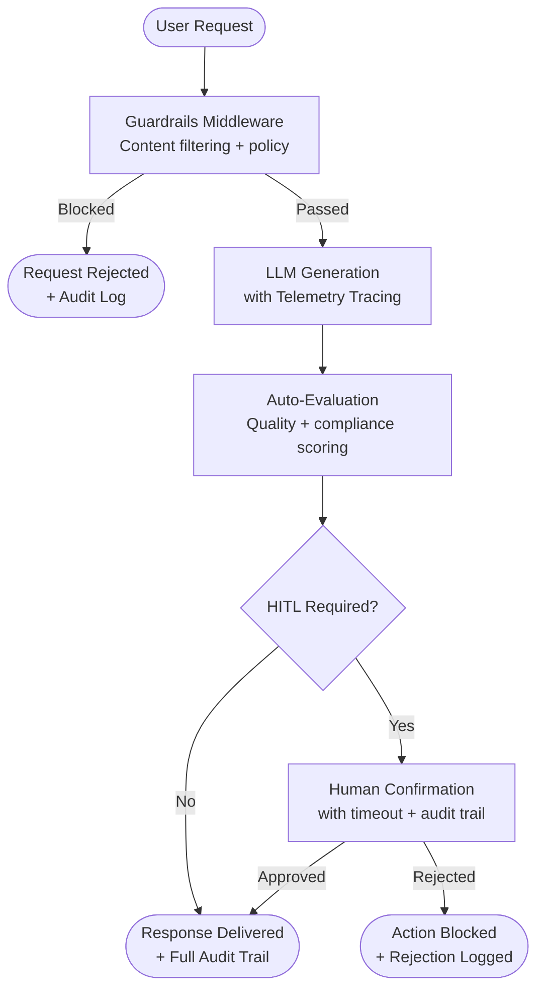
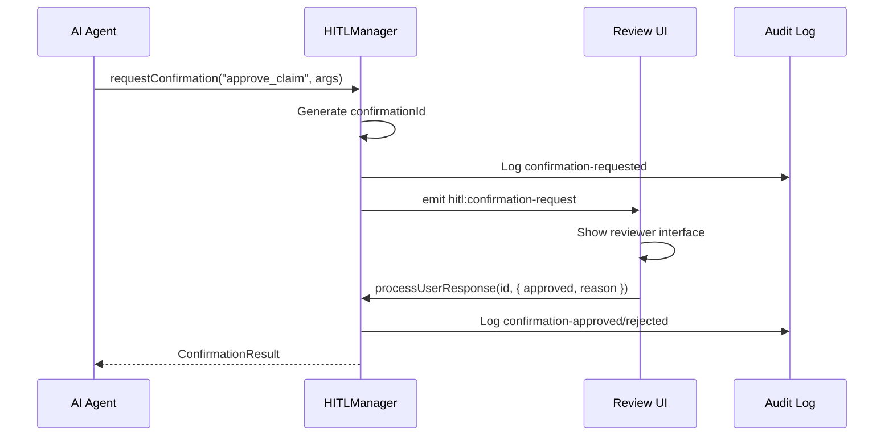

We designed NeuroLink's audit infrastructure around a hard constraint: in regulated industries, every AI decision must produce a trace, every action must have an approval record, and every output must pass validation. "The AI did it" is not an acceptable audit response under HIPAA, SOX, Basel III, or GDPR.

> **Note:** HIPAA (healthcare), SOX (financial reporting/public companies), and Basel III (banking capital requirements) have distinct compliance requirements. The patterns shown here address common cross-regulatory concerns but each regulation requires domain-specific implementation. Consult qualified legal counsel for your specific regulatory obligations.
{: .prompt-info }

The architecture addresses three distinct stakeholder needs simultaneously. Compliance teams need to see who approved what, when, and why. Security teams need proof that sensitive data was filtered before it reached the LLM. Operations teams need full request tracing for incident diagnosis.

This deep dive covers the three pillars we built: HITL for action confirmation with audit logging, guardrails middleware for content filtering and policy enforcement, and OpenTelemetry-based observability for complete request tracing. We explore the trade-offs in each design decision and how the pillars compose into a unified compliance pipeline.

## Architecture: The Auditable AI Pipeline

We designed the pipeline so that every stage produces evidence -- a log entry, a trace span, an approval record -- retrievable months later during an audit. Here is how the stages compose.



Every request enters through guardrails that filter content against policy rules. If the request passes, it proceeds to LLM generation wrapped in OpenTelemetry spans for distributed tracing. The output is automatically evaluated for quality and compliance. If the action is classified as dangerous, a human reviewer must explicitly approve it before it takes effect. At every stage, audit events are emitted and logged.

## Pillar 1: Human-in-the-Loop (HITL)

We made HITL a first-class SDK primitive rather than an application-level concern. The rationale: when an AI system can approve insurance claims or execute financial trades, the approval mechanism must be reliable, auditable, and impossible to accidentally bypass. Building it at the SDK level eliminates an entire class of implementation errors.

### HITL Configuration

The HITL configuration defines which actions require human approval and how the approval process behaves:

```typescript
import { NeuroLink } from '@juspay/neurolink';

const neurolink = new NeuroLink({
  hitl: {
    enabled: true,
    dangerousActions: ['delete', 'transfer', 'approve_claim', 'prescribe', 'execute_trade'],
    timeout: 30000,              // 30 seconds to respond
    confirmationMethod: 'event', // Event-based confirmation
    allowArgumentModification: true,  // Allow reviewer to modify parameters
    autoApproveOnTimeout: false,      // NEVER auto-approve in regulated contexts
    auditLogging: true,               // Log every decision for compliance
    customRules: [
      {
        name: 'high-value-transaction',
        requiresConfirmation: true,
        condition: (toolName, args) => {
          const amount = (args as { amount?: number })?.amount;
          return toolName.includes('transfer') && amount !== undefined && amount > 10000;
        },
        customMessage: 'High-value transaction requires manager approval',
      },
    ],
  },
});
```

Key configuration points for regulated environments:

- **`autoApproveOnTimeout: false`** is non-negotiable. In regulated contexts, an unanswered approval request must fail closed, never fail open. If no reviewer responds within the timeout, the action is blocked.
- **`dangerousActions`** lists the tool names that always require approval. These are matched against tool calls during generation.
- **`customRules`** enable conditional logic. In the example above, only transfers over $10,000 require manager-level approval, while smaller transfers might flow through standard approval channels.
- **`allowArgumentModification: true`** lets reviewers adjust parameters before approving. A reviewer might approve a claim but modify the payout amount.

### Handling HITL Events

The HITL system is event-driven. When the AI triggers a dangerous action, a confirmation request is emitted. Your application subscribes to these events and presents them to human reviewers through whatever UI your organization uses.

```typescript
const hitlManager = neurolink.getHITLManager();

// Listen for confirmation requests
hitlManager.on('hitl:confirmation-request', (event) => {
  const { confirmationId, toolName, arguments: args, timeoutMs } = event.payload;

  // Present to reviewer with full context
  showReviewUI({
    confirmationId,
    toolName,
    args,
    timeoutMs,
    triggeredKeywords: event.payload.metadata.dangerousKeywords,
  });
});

// Submit reviewer response
hitlManager.processUserResponse(confirmationId, {
  approved: true,
  reason: 'Reviewed and approved per policy 4.2.1',
  modifiedArguments: modifiedArgs, // Optional: reviewer can adjust parameters
  userId: 'reviewer-jane-doe',
});
```

Every confirmation request includes the full context: which tool is being called, with what arguments, what triggered the review (the `dangerousKeywords` metadata), and how long the reviewer has to respond. The reviewer's response includes their identity, their decision, and a mandatory reason field -- all of which become part of the permanent audit record.

### HITL Statistics and Audit

The HITL system maintains running statistics that are invaluable for compliance reporting:

```typescript
// Access real-time statistics
const stats = hitlManager.getStatistics();
console.log(`Total requests: ${stats.totalRequests}`);
console.log(`Approved: ${stats.approvedRequests}`);
console.log(`Rejected: ${stats.rejectedRequests}`);
console.log(`Timed out: ${stats.timedOutRequests}`);
console.log(`Avg response time: ${stats.averageResponseTime}ms`);

// Audit events are emitted for external logging
hitlManager.on('hitl:audit', (auditLog) => {
  // Send to compliance logging system
  complianceLogger.log(auditLog);
});
```

The `hitl:audit` event fires for every decision -- approvals, rejections, and timeouts. Each audit log entry contains the full context of the decision: who requested it, who reviewed it, what they decided, why, and when. These logs are designed to be ingested by compliance platforms like Splunk, Datadog, or purpose-built audit systems.



## Pillar 2: Guardrails Middleware

Guardrails are your first line of defense. They filter content before it reaches the LLM (preventing prompt injection and policy violations) and after the LLM responds (preventing sensitive data leakage and inappropriate content).

### Content Filtering Configuration

NeuroLink's guardrails middleware is configured through the `MiddlewareFactory`, separate from the core NeuroLink constructor:

```typescript
const neurolink = new NeuroLink();

// Guardrails middleware is configured separately through the MiddlewareFactory:
const guardrailsMiddleware = new MiddlewareFactory({
  middlewareConfig: {
    guardrails: {
      enabled: true,
      config: {
        badWords: ['confidential', 'SSN', 'password'],
        modelFilter: {
          enabled: true,
          filterModel: guardianModel, // Secondary model for safety checks
        },
        precallEvaluation: {
          enabled: true, // Evaluate prompts BEFORE sending to LLM
        },
      },
    },
  },
});
```

### How Guardrails Work Internally

The guardrails middleware operates at multiple stages of the request lifecycle:

1. **`transformParams` (pre-call):** Before the prompt reaches the LLM, `precallEvaluation` analyzes it for policy violations. A prompt asking for a customer's SSN would be blocked here, before any tokens are consumed.

2. **`wrapGenerate` (post-generation):** After the LLM responds, content filtering runs against the bad word list and the model-based safety checker. Any response containing sensitive data is replaced with `<REDACTED BY AI GUARDRAIL>` and an audit event is logged.

3. **`wrapStream` (real-time streaming):** For streaming responses, guardrails perform chunk-level content inspection. This is more complex than batch filtering because sensitive content might span multiple chunks, but the middleware handles reassembly and detection.

Every blocking action is logged with the reason for blocking, the content that triggered it, and the guardrail rule that fired. This creates a compliance trail showing that your system actively prevented data leakage.

> **Tip:** We recommend configuring both `badWords` and `modelFilter` for defense in depth. Bad word lists catch known patterns with zero latency; model-based filtering catches novel phrasings that a static word list would miss. The trade-off is added latency from the secondary model call.
{: .prompt-tip }

## Pillar 3: Observability with OpenTelemetry

Observability is the pillar that transforms the other two from claims into proof. Without tracing, you assert that HITL and guardrails are working. With tracing, you demonstrate it.

### Telemetry Setup

NeuroLink's telemetry system is built on OpenTelemetry, the industry standard for distributed tracing. Enable it with environment variables:

```bash
export NEUROLINK_TELEMETRY_ENABLED=true
export OTEL_EXPORTER_OTLP_ENDPOINT=http://localhost:4317
export OTEL_SERVICE_NAME=healthcare-ai-pipeline
export OTEL_SERVICE_VERSION=1.0.0
```

### What Gets Traced

The `TelemetryService` automatically instruments every AI request with counters, histograms, and distributed traces:

```typescript
// TelemetryService automatically tracks:
// Counters:
//   ai_requests_total      - by provider, model
//   ai_tokens_used_total   - by provider, model
//   ai_provider_errors_total - by provider, error type
//   mcp_tool_calls_total   - by tool, success/failure
//   connections_total      - by connection type
//
// Histograms:
//   ai_request_duration_ms - by provider, model
//   response_time_ms       - by endpoint, method
//
// Distributed tracing:
//   Each AI request gets a span: ai.{provider}.{operation}
//   Spans include provider, operation, status, and error details
```

Every AI request becomes a trace span with attributes for the provider, model, operation type, and outcome. These spans flow to your OTLP-compatible backend (Jaeger, Grafana Tempo, Datadog) where you can query them during audits: "Show me every AI request from this user on this date that involved the `approve_claim` tool."

### Health Monitoring

Real-time health monitoring catches issues before they impact compliance:

```typescript
import { TelemetryService } from '@juspay/neurolink';

const telemetry = TelemetryService.getInstance();
const health = await telemetry.getHealthMetrics();

console.log(`Memory usage: ${(health.memoryUsage.heapUsed / 1024 / 1024).toFixed(1)} MB`);
console.log(`Uptime: ${health.uptime}s`);
console.log(`Active connections: ${health.activeConnections}`);
console.log(`Error rate: ${health.errorRate}%`);
console.log(`Avg response time: ${health.averageResponseTime}ms`);
```

A rising error rate might indicate a provider issue. Increasing memory usage might signal a context window leak. Slow response times might mean your rate limits are being hit. All of these are signals that something in your auditable pipeline needs attention.

## Putting it all together: A Compliant Pipeline

Here is how the three pillars compose into a single pipeline. The design choice to keep middleware configuration separate from the core NeuroLink constructor was deliberate -- it allows different pipeline configurations per deployment environment without changing the core AI logic.

```typescript
const neurolink = new NeuroLink({
  hitl: {
    enabled: true,
    dangerousActions: ['approve_claim', 'transfer_funds'],
    timeout: 60000,
    auditLogging: true,
    autoApproveOnTimeout: false,
  },
});

// Middleware is configured separately through the MiddlewareFactory:
const complianceMiddleware = new MiddlewareFactory({
  middlewareConfig: {
    analytics: { enabled: true },
    guardrails: { enabled: true, config: { badWords: ['SSN'] } },
    autoEvaluation: { enabled: true, config: { threshold: 8 } },
  },
});
// Note: Pass middleware via options in generate()/stream() calls:
// await neurolink.generate({ ..., middleware: complianceMiddleware })

// Every request now has:
// 1. Pre-call guardrail filtering
// 2. Post-generation content filtering
// 3. Quality evaluation with scoring
// 4. HITL confirmation for dangerous actions
// 5. Full OpenTelemetry tracing
// 6. Audit logs for every decision
```

With this configuration, every request to your AI pipeline is:

- **Filtered** before it reaches the LLM (guardrails pre-call evaluation)
- **Filtered** after the LLM responds (guardrails content filtering)
- **Scored** for quality (auto-evaluation with a threshold of 8/10)
- **Gated** for dangerous actions (HITL with human approval)
- **Traced** end-to-end (OpenTelemetry spans and metrics)
- **Logged** for compliance (audit events for every decision)

## Industry-Specific Configurations

Different regulated industries have different evaluation priorities. NeuroLink's domain configuration system allows you to tune quality scoring for your specific compliance requirements:

- **Healthcare:** Evaluation criteria focus on accuracy, safety, compliance, and clarity. A response suggesting an incorrect dosage must score zero on safety regardless of how well-written it is.
- **Finance:** Criteria focus on accuracy, risk-awareness, compliance, and timeliness. Risk metrics must be tracked per interaction for regulatory reporting.
- **E-commerce:** Criteria shift to conversion potential, user experience, and revenue impact. While less regulated, quality gates still prevent brand-damaging responses.

These domain configurations are available through NeuroLink's config system and can be set per-request or globally for your application.

## Compliance checklist

Before going to production with an AI pipeline in a regulated industry, verify each of these items:

- Every AI decision is traceable to a unique request ID through OpenTelemetry spans
- Every dangerous action requires explicit human approval with a logged reason
- Content is filtered for PII, sensitive data, and policy violations at both input and output stages
- Quality scores are recorded for every output with domain-specific evaluation criteria
- Full telemetry data is exported to a compliance-approved observability platform
- HITL timeouts fail closed (blocked), never fail open (auto-approved)
- Audit logs include reviewer identity, decision, reason, and timestamp
- Guardrail blocking events include the triggering content and the rule that fired

> **Warning:** Audit log retention periods vary by regulation. HIPAA requires six years, SOX requires seven years, and GDPR requires documentation for the life of the processing. Misconfiguring retention is a compliance violation in itself. These regulations apply to different industries -- verify which apply to your organization and consult qualified legal counsel.
{: .prompt-warning }

## Design decisions and Trade-offs

We chose to embed these primitives at the SDK level rather than requiring external infrastructure for three reasons: lower integration cost for teams adopting AI in regulated environments, guaranteed consistency across all AI calls (no accidental bypass), and composability through middleware chains. The trade-off is SDK surface area -- NeuroLink's API is larger than a minimal AI client. For teams that only need basic generation without compliance requirements, this is unnecessary overhead.

For teams building in regulated industries, the three-pillar approach -- HITL, guardrails, observability -- provides the primitives to satisfy auditors while maintaining developer velocity. Explore [advanced HITL configurations](/posts/hitl-guardrails-guide/) and the [AI security checklist](/posts/ai-security-checklist-owasp-top-10-llm/) for deeper coverage of each pillar.

---

**Related posts:**

- [Human-in-the-Loop (HITL) Security Guide for NeuroLink](/posts/hitl-guardrails-guide/)
- [AI Application Security Checklist: OWASP Top 10 for LLM Applications](/posts/ai-security-checklist-owasp-top-10-llm/)
- [Security Best Practices for AI Applications](/posts/enterprise-security-guide/)
