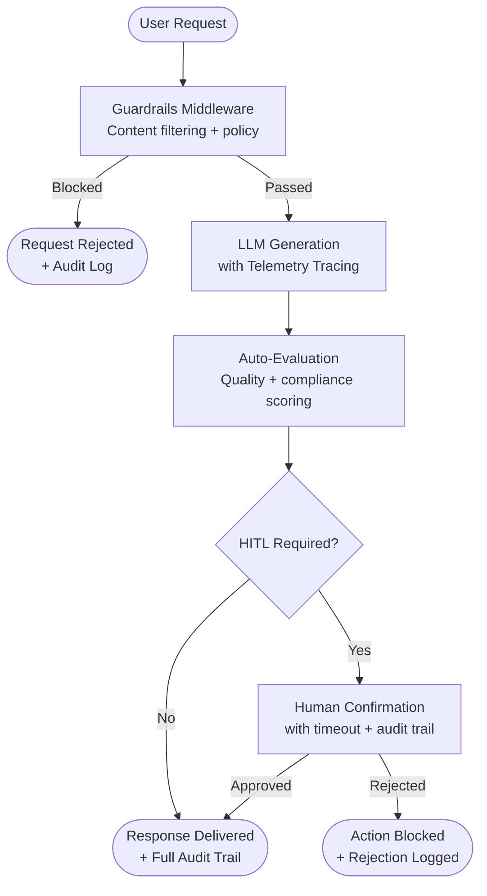
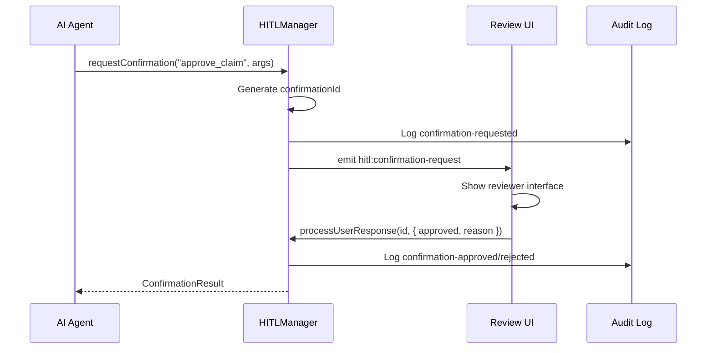

Auditable AI infrastructure starts with a hard constraint: every consequential AI decision should produce a trace, every sensitive action should have an approval record, and every output should pass the validation required by its domain. "The AI did it" is not an adequate audit response in regulated settings.

> **Note:** HIPAA (healthcare), SOX (financial reporting/public companies), and Basel III (banking capital requirements) have distinct compliance requirements. The patterns shown here address common cross-regulatory concerns but each regulation requires domain-specific implementation. Consult qualified legal counsel for your specific regulatory obligations.
{: .prompt-info }

The architecture addresses three distinct stakeholder needs simultaneously. Compliance teams need to see who approved what, when, and why. Security teams need proof that sensitive data was filtered before it reached the LLM. Operations teams need full request tracing for incident diagnosis.

This deep dive covers three pillars: HITL for action confirmation with audit logging, guardrails middleware for content filtering and policy enforcement, and OpenTelemetry-based observability for complete request tracing. It explores the trade-offs in each design decision and how the pillars compose into a unified audit pipeline.

## Architecture: The Auditable AI Pipeline

The pipeline is designed so every stage produces evidence -- a log entry, a trace span, or an approval record -- that the application can retain under its audit policy. Here is how the stages compose.


```mermaid
flowchart TB
    INPUT(["User Request"]) --> GUARD["Guardrails Middleware<br/>Content filtering + policy"]
    GUARD -->|"Blocked"| REJECT(["Request Rejected<br/>+ Audit Log"])
    GUARD -->|"Passed"| LLM["LLM Generation<br/>with Telemetry Tracing"]
    LLM --> EVAL["Auto-Evaluation<br/>Quality + compliance scoring"]
    EVAL --> HITL{"HITL Required?"}
    HITL -->|"Yes"| CONFIRM["Human Confirmation<br/>with timeout + audit trail"]
    HITL -->|"No"| OUTPUT
    CONFIRM -->|"Approved"| OUTPUT(["Response Delivered<br/>+ Full Audit Trail"])
    CONFIRM -->|"Rejected"| REJECT2(["Action Blocked<br/>+ Rejection Logged"])
```

Every request enters through guardrails that filter content against policy rules. If the request passes, it proceeds to LLM generation wrapped in OpenTelemetry spans for distributed tracing. The output is automatically evaluated for quality and compliance. If the action is classified as dangerous, a human reviewer must explicitly approve it before it takes effect. At every stage, audit events are emitted and logged.

## Pillar 1: Human-in-the-Loop (HITL)

NeuroLink exposes HITL as an SDK primitive rather than leaving it entirely to application code. When an AI system can propose sensitive actions, the approval mechanism should be reliable, auditable, and difficult to bypass accidentally. Centralizing it in the SDK reduces the chance that each integration implements confirmation differently.

### HITL Configuration

The HITL configuration defines which actions require human approval and how the approval process behaves:

```typescript
import { NeuroLink } from '@juspay/neurolink';

const neurolink = new NeuroLink({
  hitl: {
    enabled: true,
    dangerousActions: ['delete', 'transfer', 'approve_claim', 'prescribe', 'execute_trade'],
    timeout: 30000,              // 30 seconds to respond
    confirmationMethod: 'event', // Event-based confirmation
    allowArgumentModification: true,  // Allow reviewer to modify parameters
    autoApproveOnTimeout: false,      // NEVER auto-approve in regulated contexts
    auditLogging: true,               // Emit confirmation lifecycle audit entries
    customRules: [
      {
        name: 'high-value-transaction',
        requiresConfirmation: true,
        condition: (toolName, args) => {
          const amount = (args as { amount?: number })?.amount;
          return toolName.includes('transfer') && amount !== undefined && amount > 10000;
        },
        customMessage: 'High-value transaction requires manager approval',
      },
    ],
  },
});
```

Key configuration points for regulated environments:

- **`autoApproveOnTimeout: false`** is non-negotiable. In regulated contexts, an unanswered approval request must fail closed, never fail open. If no reviewer responds within the timeout, the action is blocked.
- **`dangerousActions`** lists the tool names that always require approval. These are matched against tool calls during generation.
- **`customRules`** enable conditional logic. In the example above, only transfers over $10,000 require manager-level approval, while smaller transfers might flow through standard approval channels.
- **`allowArgumentModification: true`** lets reviewers adjust parameters before approving. A reviewer might approve a claim but modify the payout amount.

### Handling HITL Events

The HITL system is event-driven. When the AI triggers a dangerous action, a confirmation request is emitted. Your application subscribes to these events and presents them to human reviewers through whatever UI your organization uses.

```typescript
// NeuroLink has no getHITLManager() accessor -- the HITL manager it creates
// from the `hitl:` config is private. Subscribe through the shared event
// emitter instead; it forwards confirmation-request, confirmation-response,
// and timeout events from that internal manager.
neurolink.getEventEmitter().on('hitl:confirmation-request', async (event) => {
  const { confirmationId, toolName, arguments: args, timeoutMs } = event.payload;
  const requestedAt = Date.parse(event.payload.metadata.timestamp);

  // Present to reviewer with full context and await the decision
  const review = await showReviewUI({
    confirmationId,
    toolName,
    args,
    timeoutMs,
    triggeredKeywords: event.payload.metadata.dangerousKeywords,
  });

  // Submit the reviewer's response by emitting it back on the same emitter
  neurolink.getEventEmitter().emit('hitl:confirmation-response', {
    type: 'hitl:confirmation-response',
    payload: {
      confirmationId, // Must match the request
      approved: review.approved,
      reason: review.reason,
      modifiedArguments: review.modifiedArguments,
      metadata: {
        timestamp: new Date().toISOString(),
        responseTime: Date.now() - requestedAt, // elapsed milliseconds
        userId: review.userId,
      },
    },
  });
});
```

Every confirmation request includes the tool, arguments, triggering `dangerousKeywords`, and response timeout. The response can include reviewer identity, decision, reason, modified arguments, and elapsed response time; persist those fields in your approved audit store when your policy requires a durable record.

### HITL Statistics and Audit

Two capabilities do not reach `neurolink.getEventEmitter()`: running statistics and the `hitl:audit` stream for confirmation workflow events. Both live only on the standalone `HITLManager` class that `new NeuroLink({ hitl: {...} })` builds and keeps private. If your compliance reporting needs them directly, instantiate `HITLManager` yourself instead of going through the `hitl:` constructor option -- the confirmation-request/response event contract is identical, so the rest of your integration is unchanged:

```typescript
import { HITLManager } from '@juspay/neurolink';

const hitlManager = new HITLManager({
  enabled: true,
  dangerousActions: ['delete', 'transfer', 'approve_claim', 'prescribe', 'execute_trade'],
  timeout: 30000,
  auditLogging: true,
});

// Access real-time statistics
const stats = hitlManager.getStatistics();
console.log(`Total requests: ${stats.totalRequests}`);
console.log(`Approved: ${stats.approvedRequests}`);
console.log(`Rejected: ${stats.rejectedRequests}`);
console.log(`Timed out: ${stats.timedOutRequests}`);
console.log(`Avg response time: ${stats.averageResponseTime}ms`);

// hitl:audit fires on the manager for request/decision/timeout lifecycle events
hitlManager.on('hitl:audit', (auditLog) => {
  // Send to compliance logging system
  complianceLogger.log(auditLog);
});

hitlManager.on('hitl:confirmation-request', (event) => {
  /* present to reviewer, then call hitlManager.processUserResponse(...) */
});
```

Each audit log entry contains the full context of the decision: who requested it, what they decided, why, and when. These logs are designed to be ingested by compliance platforms like Splunk, Datadog, or purpose-built audit systems.


```mermaid
sequenceDiagram
    participant Agent as AI Agent
    participant HITL as HITLManager
    participant UI as Review UI
    participant Audit as Audit Log

    Agent->>HITL: requestConfirmation("approve_claim", args)
    HITL->>HITL: Generate confirmationId
    HITL->>Audit: Log confirmation-requested
    HITL->>UI: emit hitl:confirmation-request
    UI->>UI: Show reviewer interface
    UI->>HITL: processUserResponse(id, { approved, reason })
    HITL->>Audit: Log confirmation-approved/rejected
    HITL-->>Agent: ConfirmationResult
```

## Pillar 2: Guardrails Middleware

Guardrails are your first line of defense. They filter content before it reaches the LLM (preventing prompt injection and policy violations) and after the LLM responds (preventing sensitive data leakage and inappropriate content).

### Content Filtering Configuration

NeuroLink's guardrails middleware is configured separately from the core NeuroLink constructor, as a plain `MiddlewareFactoryOptions` object passed to `generate()`/`stream()` via the `middleware` field (not a `MiddlewareFactory` instance -- see the note at the end of this section):

```typescript
const neurolink = new NeuroLink();

const guardrailsMiddleware = {
  middlewareConfig: {
    guardrails: {
      enabled: true,
      config: {
        badWords: { enabled: true, list: ['confidential', 'SSN', 'password'] },
        modelFilter: {
          enabled: true,
          filterModel: guardianModel, // Secondary model for safety checks
        },
        precallEvaluation: {
          enabled: true, // Evaluate prompts BEFORE sending to LLM
        },
      },
    },
  },
};

await neurolink.generate({
  input: { text: userPrompt },
  middleware: guardrailsMiddleware,
});
```

### How Guardrails Work Internally

The guardrails middleware operates at multiple stages of the request lifecycle:

1. **`transformParams` (pre-call):** Before the prompt reaches the LLM, `precallEvaluation` analyzes it for policy violations. A prompt asking for a customer's SSN would be blocked here, before any tokens are consumed.

2. **`wrapGenerate` (post-generation):** After the LLM responds, bad-word filtering replaces matching terms with the configured `replacementText` (`[REDACTED]` by default). When enabled, the model-based checker can separately classify the generated text as safe or unsafe.

3. **`wrapStream` (real-time streaming):** For streaming responses, guardrails buffer contiguous text runs before applying the bad-word filter, so a prohibited term split across adjacent deltas is still detected. This trades incremental delivery of that text run for reliable filtering.

The guardrails middleware logs filter activity through NeuroLink's logger, but those debug/warning logs are not a durable compliance audit trail by themselves. Export the relevant telemetry and application decision records to your approved audit store, applying your redaction and retention policy.

> **Tip:** Configure both `badWords` and `modelFilter` for defense in depth. Bad-word matching catches known patterns without an additional model call; model-based filtering can catch novel phrasings that a static word list would miss. The trade-off is added latency from the secondary model call.
{: .prompt-tip }

## Pillar 3: Observability with OpenTelemetry

Observability is the pillar that transforms the other two from claims into proof. Without tracing, you assert that HITL and guardrails are working. With tracing, you demonstrate it.

### Telemetry Setup

NeuroLink's telemetry system is built on OpenTelemetry, the industry standard for distributed tracing. Enable it with environment variables:

```bash
export NEUROLINK_TELEMETRY_ENABLED=true
export OTEL_EXPORTER_OTLP_ENDPOINT=http://localhost:4317
export OTEL_SERVICE_NAME=healthcare-ai-pipeline
export OTEL_SERVICE_VERSION=1.0.0
```

### What Gets Traced

The `TelemetryService` automatically instruments every AI request with counters, histograms, and distributed traces:

```typescript
// TelemetryService automatically tracks:
// Counters:
//   ai_requests_total      - by provider, model
//   ai_tokens_used_total   - by provider, model
//   ai_provider_errors_total - by provider, error type
//   mcp_tool_calls_total   - by tool, success/failure
//   connections_total      - by connection type
//
// Histograms:
//   ai_request_duration_ms - by provider, model
//   response_time_ms       - by endpoint, method
//
// Distributed tracing:
//   Each AI request gets a span: ai.{provider}.{operation}
//   Spans include provider, operation, status, and error details
```

Every AI request becomes a trace span with attributes for the provider, model, operation type, and outcome. These spans flow to your OTLP-compatible backend (Jaeger, Grafana Tempo, Datadog) where you can query them during audits: "Show me every AI request from this user on this date that involved the `approve_claim` tool."

### Health Monitoring

`TelemetryService` itself is an internal class -- it is not exported from the package. The public surface is two wrapper functions, `initializeTelemetry()` and `getTelemetryStatus()`:

```typescript
import { initializeTelemetry, getTelemetryStatus } from '@juspay/neurolink';

await initializeTelemetry(); // bootstraps the OTel tracer/exporter if one is configured

const status = await getTelemetryStatus();
console.log(`Telemetry enabled: ${status.enabled}`);
console.log(`Initialized: ${status.initialized}`);
console.log(`Exporter endpoint: ${status.endpoint ?? 'not configured'}`);
```

For the finer-grained signals -- error rate, memory usage, per-provider response time -- query the counters and histograms from "What Gets Traced" (`ai_provider_errors_total`, `ai_request_duration_ms`, and friends) on your OTLP backend rather than polling the SDK directly; that is where this pipeline already sends them. A rising error rate might indicate a provider issue. Slow response times might mean your rate limits are being hit. All of these are signals that something in your auditable pipeline needs attention.

## Putting it all together: A Compliant Pipeline

Here is how the three pillars compose into a single pipeline. The design choice to keep middleware configuration separate from the core NeuroLink constructor was deliberate -- it allows different pipeline configurations per deployment environment without changing the core AI logic.

```typescript
const neurolink = new NeuroLink({
  hitl: {
    enabled: true,
    dangerousActions: ['approve_claim', 'transfer_funds'],
    timeout: 60000,
    auditLogging: true,
    autoApproveOnTimeout: false,
  },
});

// Middleware is a plain options object, passed via the `middleware` field
// on generate()/stream() -- not a MiddlewareFactory instance:
const complianceMiddleware = {
  middlewareConfig: {
    analytics: { enabled: true },
    guardrails: { enabled: true, config: { badWords: { enabled: true, list: ['SSN'] } } },
    autoEvaluation: { enabled: true, config: { threshold: 8 } },
  },
};

await neurolink.generate({
  input: { text: userPrompt },
  middleware: complianceMiddleware,
});

// Every request now has:
// 1. Pre-call guardrail filtering
// 2. Post-generation content filtering
// 3. Quality evaluation with scoring
// 4. HITL confirmation for dangerous actions
// 5. Full OpenTelemetry tracing
// 6. Audit logs for every decision
```

With this configuration, every request to your AI pipeline is:

- **Filtered** before it reaches the LLM (guardrails pre-call evaluation)
- **Filtered** after the LLM responds (guardrails content filtering)
- **Scored** for quality (auto-evaluation with a threshold of 8/10)
- **Gated** for dangerous actions (HITL with human approval)
- **Traced** end-to-end (OpenTelemetry spans and metrics)
- **Logged** for compliance (audit events for every decision)

## Industry-Specific Configurations

Different regulated industries have different evaluation priorities. NeuroLink's domain configuration system allows you to tune quality scoring for your specific compliance requirements:

- **Healthcare:** Evaluation criteria focus on accuracy, safety, compliance, and clarity. A response suggesting an incorrect dosage must score zero on safety regardless of how well-written it is.
- **Finance:** Criteria focus on accuracy, risk-awareness, compliance, and timeliness. Risk metrics must be tracked per interaction for regulatory reporting.
- **E-commerce:** Criteria shift to conversion potential, user experience, and revenue impact. While less regulated, quality gates still prevent brand-damaging responses.

These domain configurations are available through NeuroLink's config system and can be set per-request or globally for your application.

## Compliance checklist

Before going to production with an AI pipeline in a regulated industry, verify each of these items:

- Every AI decision is traceable to a unique request ID through OpenTelemetry spans
- Every dangerous action requires explicit human approval with a logged reason
- Content is filtered for PII, sensitive data, and policy violations at both input and output stages
- Quality scores are recorded for every output with domain-specific evaluation criteria
- Full telemetry data is exported to a compliance-approved observability platform
- HITL timeouts fail closed (blocked), never fail open (auto-approved)
- Audit logs include reviewer identity, decision, reason, and timestamp
- Guardrail blocking events include the triggering content and the rule that fired

> **Warning:** Audit-log retention requirements vary by regulation, record type, jurisdiction, and institutional policy; HIPAA, SOX, and GDPR do not impose one interchangeable retention period on every AI audit record. Define a retention schedule with qualified legal and compliance teams, and verify which rules apply to your organization and data.
{: .prompt-warning }

## Design decisions and Trade-offs

Embedding these primitives at the SDK level can lower integration cost, make policy consistent across AI calls, and compose controls through middleware chains. It does not replace external audit storage, identity systems, retention policies, or compliance review. The trade-off is SDK surface area -- NeuroLink's API is larger than a minimal AI client, and teams that only need basic generation may not need these controls.

For teams building in regulated industries, the three-pillar approach -- HITL, guardrails, observability -- provides the primitives to satisfy auditors while maintaining developer velocity. Explore [advanced HITL configurations](/posts/hitl-guardrails-guide/) and the [AI security checklist](/posts/ai-security-checklist-owasp-top-10-llm/) for deeper coverage of each pillar.

---

**Related posts:**

- [Human-in-the-Loop (HITL) Security Guide for NeuroLink](/posts/hitl-guardrails-guide/)
- [AI Application Security Checklist: OWASP Top 10 for LLM Applications](/posts/ai-security-checklist-owasp-top-10-llm/)
- [Security Best Practices for AI Applications](/posts/enterprise-security-guide/)
