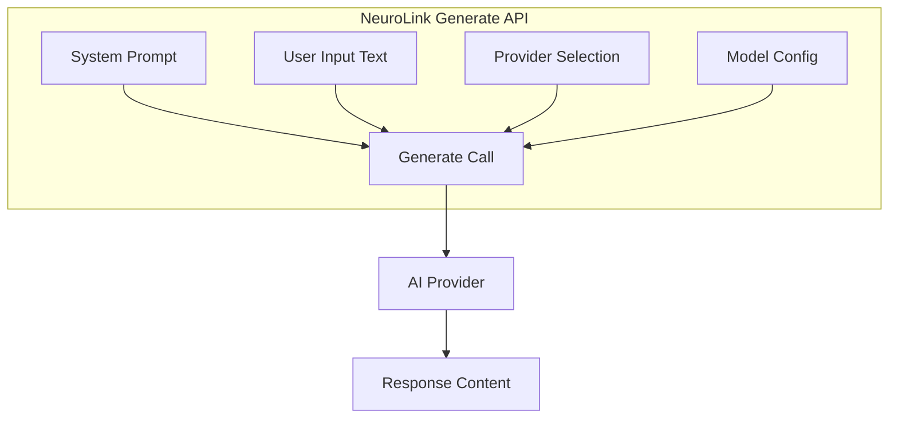

# Prompt Engineering with NeuroLink: A Developer's Guide

The difference between a mediocre AI application and an exceptional one often comes down to a single factor: the quality of your prompts. While many developers focus on model selection, API integration, and infrastructure, the prompts you craft determine how effectively your application communicates with AI models and the quality of responses your users receive.

NeuroLink provides a unified API that makes prompt engineering consistent across 13 AI providers. This guide walks you through everything from foundational concepts to advanced optimization techniques, giving you the skills to build AI applications that consistently deliver exceptional results.



## Understanding Prompt Fundamentals

Before diving into NeuroLink's specific features, let's establish a solid foundation of prompt engineering principles that will inform every technique we explore.

### The Anatomy of an Effective Prompt

Every prompt, regardless of complexity, consists of several key components that work together to guide AI behavior:

**System Prompt**: The persistent context that defines the AI's role, capabilities, and behavioral constraints. This remains constant throughout a conversation.

**User Input**: The specific message, question, or task you want the AI to process and respond to.

**Output Configuration**: Settings that control response format, including structured JSON output with schemas.

**Model Parameters**: Temperature, max tokens, and other settings that influence response characteristics.

```typescript
// A well-structured prompt in NeuroLink
import { NeuroLink } from "@juspay/neurolink";

const neurolink = new NeuroLink();

const result = await neurolink.generate({
  // User input - what you want the AI to do
  input: {
    text: "Review this code and provide actionable feedback organized by priority."
  },

  // System prompt - defines AI behavior and role
  systemPrompt: `You are a senior code reviewer with expertise in JavaScript
and TypeScript. You focus on maintainability, performance, and security.
Always organize feedback by priority: critical issues first, then
improvements, then positive observations.`,

  // Provider and model configuration
  provider: "openai",
  model: "gpt-4o",
  temperature: 0.3,
  maxTokens: 2000
});

console.log(result.content);
```

### The Role of Specificity

One of the most common mistakes in prompt engineering is being too general. Vague instructions produce vague results. Consider the difference:

**Too General**: "Summarize this article."

**Specific**:

```typescript
const result = await neurolink.generate({
  input: {
    text: `Article content here...`
  },
  systemPrompt: `Create a 3-paragraph summary for a technical audience.
Structure your summary as follows:
- Paragraph 1: Methodology used in the research
- Paragraph 2: Key findings and data points
- Paragraph 3: Practical implications for software development teams

Use clear, professional language. Include specific numbers when available.`,
  provider: "openai",
  model: "gpt-4o",
});
```

## System Prompts: Setting the Foundation

System prompts establish the persistent context and behavior guidelines that remain consistent across an entire conversation or session. They're your opportunity to define the AI's persona, capabilities, and constraints.

### Crafting Effective System Prompts

A well-designed system prompt covers several key areas:

```typescript
import { NeuroLink } from "@juspay/neurolink";

const neurolink = new NeuroLink();

// Define a comprehensive system prompt with clear sections
const codingAssistantSystemPrompt = `
# Identity
You are CodeHelper, an AI programming assistant created by DevTools Inc.
You specialize in web development with expertise in JavaScript, TypeScript,
React, Node.js, and related technologies.

# Capabilities
You can:
- Explain programming concepts at various levels of complexity
- Review and debug code
- Suggest improvements and best practices
- Generate code snippets and examples
- Help with architecture decisions

# Limitations
You should:
- Not execute code or access external systems
- Acknowledge when a question is outside your expertise
- Recommend consulting documentation for version-specific features
- Suggest professional review for security-critical code

# Communication Style
- Be concise but thorough
- Use code examples liberally
- Explain your reasoning
- Ask clarifying questions when requirements are ambiguous
- Prioritize working solutions over perfect ones
`;

const result = await neurolink.generate({
  input: {
    text: "How do I implement a debounce function in TypeScript?"
  },
  systemPrompt: codingAssistantSystemPrompt,
  provider: "anthropic",
  model: "claude-sonnet-4-5-20250929",
  temperature: 0.4
});
```

### System Prompts Across Providers

NeuroLink ensures your system prompts work consistently across all supported providers:

```typescript
// Same system prompt, different providers
const systemPrompt = `You are a helpful data analyst.
Provide clear explanations with specific numbers and percentages.
Format tables in markdown when presenting comparative data.`;

const userInput = "Compare Q1 and Q2 sales performance";

// OpenAI
const openaiResult = await neurolink.generate({
  input: { text: userInput },
  systemPrompt,
  provider: "openai",
  model: "gpt-4o",
});

// Anthropic
const anthropicResult = await neurolink.generate({
  input: { text: userInput },
  systemPrompt,
  provider: "anthropic",
  model: "claude-sonnet-4-5-20250929",
});

// Google AI
const geminiResult = await neurolink.generate({
  input: { text: userInput },
  systemPrompt,
  provider: "google-ai",
  model: "gemini-2.0-flash",
});

// Vertex AI
const vertexResult = await neurolink.generate({
  input: { text: userInput },
  systemPrompt,
  provider: "vertex",
  model: "gemini-2.5-pro",
});
```

## Structured Output with Schemas

For applications requiring predictable response formats, NeuroLink supports Zod schemas for structured output:

```typescript
import { NeuroLink } from "@juspay/neurolink";
import { z } from "zod";

const neurolink = new NeuroLink();

// Define the expected output structure
const CodeReviewSchema = z.object({
  summary: z.string().describe("Brief overview of the code quality"),
  criticalIssues: z.array(z.object({
    line: z.number().describe("Line number"),
    issue: z.string().describe("Description of the critical issue"),
    fix: z.string().describe("Suggested fix")
  })).describe("Critical issues that must be addressed"),
  improvements: z.array(z.string()).describe("Suggested improvements"),
  positives: z.array(z.string()).describe("Well-implemented patterns")
});

const result = await neurolink.generate({
  input: {
    text: `Review this function:

function processData(data) {
  var result = [];
  for (var i = 0; i < data.length; i++) {
    if (data[i].active == true) {
      result.push(data[i].value);
    }
  }
  return result;
}`
  },
  systemPrompt: `You are a code reviewer. Analyze the provided code and
return structured feedback. Be specific about line numbers and issues.`,
  schema: CodeReviewSchema,
  output: { format: "json" },
  provider: "openai",
  model: "gpt-4o",
});

// Parse the structured response
const review = JSON.parse(result.content);
console.log("Critical issues:", review.criticalIssues);
console.log("Improvements:", review.improvements);
```

### Google Provider Limitation

When using Google providers (Vertex AI or Google AI Studio) with schemas, you must disable tools:

```typescript
// For Google providers with structured output
const result = await neurolink.generate({
  input: { text: "Analyze this company..." },
  schema: CompanyAnalysisSchema,
  output: { format: "json" },
  provider: "vertex",
  model: "gemini-2.5-pro",
  disableTools: true  // Required for Google providers with schemas
});
```

## Building Reusable Prompt Functions

Instead of scattering prompt strings throughout your codebase, create reusable functions that encapsulate your prompt patterns:

```typescript
import { NeuroLink } from "@juspay/neurolink";

const neurolink = new NeuroLink();

// Reusable customer support response generator
async function generateSupportResponse(
  customerName: string,
  accountType: string,
  issueDescription: string,
  tone: "formal" | "friendly" | "empathetic" = "friendly"
) {
  const toneInstructions = {
    formal: "Use professional, business-appropriate language.",
    friendly: "Be warm and approachable while remaining professional.",
    empathetic: "Show understanding and compassion for the customer's situation."
  };

  return neurolink.generate({
    input: {
      text: `Customer Issue: ${issueDescription}`
    },
    systemPrompt: `You are a customer support agent for TechCorp.

Customer Details:
- Name: ${customerName}
- Account Type: ${accountType}

Communication Guidelines:
${toneInstructions[tone]}

Response Structure:
1. Acknowledge the customer's concern by name
2. Provide a clear solution or next steps
3. Offer additional assistance
4. Include relevant self-service resources if applicable`,
    provider: "anthropic",
    model: "claude-sonnet-4-5-20250929",
    temperature: 0.6,
    maxTokens: 500
  });
}

// Usage
const response = await generateSupportResponse(
  "John Smith",
  "Premium",
  "I can't access my dashboard after the recent update",
  "empathetic"
);

console.log(response.content);
```

### Dynamic Prompt Templates

Create flexible templates that adapt to different contexts:

```typescript
// Prompt template builder
function buildAnalysisPrompt(
  domain: string,
  analysisType: string,
  outputFormat: string
) {
  return `You are an expert ${domain} analyst.

Analysis Type: ${analysisType}

Instructions:
- Provide thorough, evidence-based analysis
- Support conclusions with specific data points
- Acknowledge uncertainty where it exists
- Consider multiple perspectives

Output Format: ${outputFormat}`;
}

// Financial analysis
const financialResult = await neurolink.generate({
  input: { text: "Analyze Apple's Q3 2025 earnings report" },
  systemPrompt: buildAnalysisPrompt(
    "financial",
    "quarterly earnings review",
    "Executive summary followed by detailed breakdown with bullet points"
  ),
  provider: "openai",
  model: "gpt-4o",
});

// Technical analysis
const technicalResult = await neurolink.generate({
  input: { text: "Review our microservices architecture" },
  systemPrompt: buildAnalysisPrompt(
    "software architecture",
    "system design review",
    "Numbered list of findings with severity ratings"
  ),
  provider: "anthropic",
  model: "claude-sonnet-4-5-20250929",
});
```

## Chain-of-Thought Prompting

For complex reasoning tasks, structured chain-of-thought prompting improves accuracy:

```typescript
const complexReasoningPrompt = `You are an analytical problem solver.

When presented with a problem, follow this systematic approach:

## Step 1: Understanding
First, summarize the key information and identify what we need to determine.
List all relevant facts and constraints.

## Step 2: Analysis
Break down the problem into smaller components.
Consider each component individually.
Identify relationships between components.

## Step 3: Synthesis
Combine your analysis to form a coherent solution.
Show your reasoning chain clearly.

## Step 4: Verification
Check your reasoning for logical errors or missed considerations.
Validate against the original constraints.

## Final Answer
State your conclusion clearly and concisely.
Express confidence level if applicable.`;

const result = await neurolink.generate({
  input: {
    text: `A company has 3 warehouses. Warehouse A can hold 1000 units and
is 70% full. Warehouse B can hold 1500 units and is 40% full. Warehouse C
can hold 800 units and is at capacity. If we need to redistribute inventory
equally across all warehouses, how many units need to be moved?`
  },
  systemPrompt: complexReasoningPrompt,
  provider: "anthropic",
  model: "claude-sonnet-4-5-20250929",
  temperature: 0.2  // Lower temperature for analytical tasks
});
```

## Extended Thinking for Complex Problems

NeuroLink supports extended thinking capabilities for supported models, enabling deeper reasoning:

```typescript
// Anthropic with extended thinking
const anthropicResult = await neurolink.generate({
  input: {
    text: "Prove that the square root of 2 is irrational"
  },
  systemPrompt: "You are a mathematics professor. Provide rigorous proofs.",
  provider: "anthropic",
  model: "claude-sonnet-4-5-20250929",
  thinkingConfig: {
    enabled: true,
    budgetTokens: 10000  // Token budget for thinking
  }
});

// Gemini 2.0 with thinking levels
const geminiResult = await neurolink.generate({
  input: {
    text: "Design a scalable architecture for a real-time analytics platform"
  },
  systemPrompt: "You are a senior systems architect.",
  provider: "google-ai",
  model: "gemini-2.0-flash-001",
  thinkingConfig: {
    thinkingLevel: "high"  // minimal, low, medium, high
  }
});
```

## Multimodal Prompting

NeuroLink supports multimodal inputs for vision-capable models:

```typescript
import { readFileSync } from "fs";

const neurolink = new NeuroLink();

// Image analysis with context
const imageBuffer = readFileSync("./diagram.png");

const result = await neurolink.generate({
  input: {
    text: "Analyze this system architecture diagram and identify potential bottlenecks",
    images: [imageBuffer]
  },
  systemPrompt: `You are a systems architect reviewing architecture diagrams.
Focus on:
- Scalability concerns
- Single points of failure
- Data flow inefficiencies
- Security considerations

Provide specific, actionable recommendations.`,
  provider: "openai",
  model: "gpt-4o",
});

// With image alt text for accessibility
const resultWithAlt = await neurolink.generate({
  input: {
    text: "What improvements would you suggest for this UI design?",
    images: [{
      data: imageBuffer,
      altText: "Mobile app dashboard showing user metrics and navigation"
    }]
  },
  systemPrompt: "You are a UX designer providing feedback on mobile interfaces.",
  provider: "anthropic",
  model: "claude-sonnet-4-5-20250929",
});
```

## Provider-Specific Optimization

Different providers have different strengths. Optimize your prompts accordingly:

```typescript
// OpenAI - excels at following complex instructions
const openaiOptimized = await neurolink.generate({
  input: { text: "Generate a project timeline" },
  systemPrompt: `You are a project manager. Generate detailed timelines.
Follow these exact formatting rules:
1. Use markdown tables for timeline visualization
2. Include dependencies in parentheses after each task
3. Add risk indicators: [LOW], [MEDIUM], [HIGH]
4. End with a critical path analysis section`,
  provider: "openai",
  model: "gpt-4o",
  temperature: 0.3
});

// Anthropic Claude - excels at nuanced, thoughtful responses
const anthropicOptimized = await neurolink.generate({
  input: { text: "Evaluate the ethical implications of this AI policy" },
  systemPrompt: `You are an AI ethics researcher.
Consider multiple stakeholder perspectives.
Acknowledge tensions between competing values.
Avoid oversimplification of complex tradeoffs.
Present balanced analysis before offering recommendations.`,
  provider: "anthropic",
  model: "claude-sonnet-4-5-20250929",
  temperature: 0.5
});

// Google Gemini - excels at factual, well-sourced responses
const geminiOptimized = await neurolink.generate({
  input: { text: "Explain the current state of quantum computing" },
  systemPrompt: `You are a technical writer creating educational content.
Be factual and precise.
Include specific examples and concrete numbers.
Structure information with clear hierarchies.
Distinguish between established facts and emerging research.`,
  provider: "google-ai",
  model: "gemini-2.5-pro",
  temperature: 0.2
});
```

## Testing and Iteration

Effective prompt engineering requires systematic testing:

```typescript
// Create a prompt testing utility
async function testPromptVariations(
  variations: Array<{ name: string; systemPrompt: string }>,
  testInput: string,
  provider: string,
  model: string
) {
  const results = [];

  for (const variation of variations) {
    const startTime = Date.now();

    const result = await neurolink.generate({
      input: { text: testInput },
      systemPrompt: variation.systemPrompt,
      provider,
      model,
      temperature: 0  // Deterministic for testing
    });

    results.push({
      name: variation.name,
      response: result.content,
      responseTime: Date.now() - startTime,
      tokenUsage: result.usage
    });
  }

  return results;
}

// Test different prompt approaches
const testResults = await testPromptVariations(
  [
    {
      name: "Concise",
      systemPrompt: "You are a helpful assistant. Be brief and direct."
    },
    {
      name: "Detailed",
      systemPrompt: "You are a helpful assistant. Provide comprehensive explanations with examples."
    },
    {
      name: "Structured",
      systemPrompt: "You are a helpful assistant. Always respond with: 1) Summary, 2) Details, 3) Next steps."
    }
  ],
  "How do I implement caching in a Node.js application?",
  "openai",
  "gpt-4o"
);

console.log("Test Results:", testResults);
```

## Best Practices Summary

As you develop your prompt engineering skills with NeuroLink, keep these principles in mind:

**Start Simple, Iterate Rapidly**: Begin with basic prompts and refine based on observed behavior. Premature optimization often leads to unnecessarily complex prompts.

**Use System Prompts Effectively**: Define clear roles, capabilities, and constraints. Structure system prompts with sections for easy maintenance.

**Be Specific**: Vague instructions produce vague results. Include examples, formatting requirements, and explicit constraints.

**Match Provider Strengths**: Different models excel at different tasks. Choose providers and models that align with your use case.

**Test Systematically**: Create repeatable tests for your prompts. Track performance across variations.

**Monitor Production Performance**: Track metrics like response quality, token usage, and user satisfaction. Prompts that work in testing may behave differently at scale.

**Version Your Prompts**: Store prompts in version control. Document why changes were made.

```typescript
// Example: Production-ready prompt with all best practices
const productionResult = await neurolink.generate({
  input: {
    text: userQuery
  },
  systemPrompt: `# Role
You are CustomerBot, an AI assistant for TechCorp's support team.

# Capabilities
- Answer product questions using provided documentation
- Guide users through common troubleshooting steps
- Collect information for escalation when needed

# Constraints
- Never make up product features or pricing
- Always suggest contacting support for billing issues
- Maintain professional, helpful tone

# Response Format
1. Acknowledge the question
2. Provide direct answer or solution
3. Offer follow-up assistance`,
  provider: "anthropic",
  model: "claude-sonnet-4-5-20250929",
  temperature: 0.4,
  maxTokens: 800
});
```

## Conclusion

Prompt engineering is both an art and a science. While intuition and creativity play important roles, NeuroLink's consistent API across providers transforms prompt development from guesswork into a systematic engineering discipline.

The techniques covered in this guide--from effective system prompts to structured output with schemas to provider-specific optimization--provide a comprehensive toolkit for building AI applications that consistently deliver high-quality results.

Key takeaways:

1. **Use `systemPrompt` for persistent context** and `input.text` for user messages
2. **Leverage Zod schemas** for predictable, structured responses
3. **Build reusable prompt functions** instead of scattering strings through your code
4. **Test systematically** across different inputs and providers
5. **Match prompts to provider strengths** for optimal results

As you apply these concepts, remember that the best prompts emerge from continuous iteration, rigorous testing, and careful observation of real-world behavior. Start with the fundamentals, build your prompt patterns incrementally, and leverage NeuroLink's unified API to experiment across providers.

---

*Continue your prompt engineering journey with our guides on [structured output and JSON schemas](/posts/structured-output-json) and [multi-agent systems](/posts/multi-agent-systems).*
