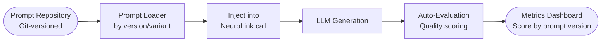
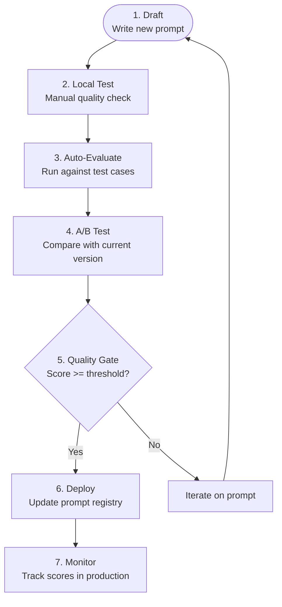

You will build a complete prompt management system that versions, tests, evaluates, and deploys prompts with the same rigor as application code. By the end of this tutorial, you will have prompt templates, a version registry, A/B testing with auto-evaluation, automated quality gates for CI, and production monitoring -- all using NeuroLink's evaluation and middleware systems.

## The prompt lifecycle

Start by understanding the lifecycle that every production prompt will follow:



Prompts live in a git-versioned repository. A loader retrieves the correct version for each request. The prompt is injected into a NeuroLink generation call. After generation, auto-evaluation scores the output quality. Metrics are tracked per prompt version over time, giving you visibility into which prompts are performing well and which need iteration.

## Pattern 1: Prompt Templates

You will start by extracting prompts from your application code into structured templates. Each template is a versioned object with a system prompt and a templating function.

```typescript
// prompts/product-description.ts
export const productDescriptionPrompts = {
  v1: {
    version: '1.0.0',
    systemPrompt: 'You are a product copywriter. Write compelling descriptions.',
    template: (product: Product) =>
      `Write a product description for: ${product.name}\nCategory: ${product.category}\nFeatures: ${product.features.join(', ')}`,
  },
  v2: {
    version: '2.0.0',
    systemPrompt: `You are a senior product copywriter specializing in SEO-optimized e-commerce copy.
Rules:
- Lead with the primary benefit
- Include 2-3 sensory details
- End with a clear call to action
- Target length: 150-200 words`,
    template: (product: Product) =>
      `Write an SEO-optimized product description.\n\nProduct: ${product.name}\nCategory: ${product.category}\nTarget Audience: ${product.targetAudience}\nKey Features:\n${product.features.map(f => `- ${f}`).join('\n')}\nPrice Point: ${product.priceRange}`,
  },
};
```

Notice the progression from v1 to v2. The system prompt evolved from a vague instruction ("write compelling descriptions") to a detailed specification with concrete rules. The template evolved from bare-bones product info to rich context including target audience and price range. Each change is documented, reviewable, and revertible.

The type safety of TypeScript templates is a significant advantage. If your `Product` type changes -- say you add a `sustainability` field -- the compiler tells you which templates need updating.

## Pattern 2: Prompt Registry

Next, you will create a central registry for managing prompts across your team.

```typescript
class PromptRegistry {
  private prompts: Map<string, Map<string, PromptVersion>> = new Map();

  register(name: string, version: string, prompt: PromptVersion): void {
    if (!this.prompts.has(name)) {
      this.prompts.set(name, new Map());
    }
    this.prompts.get(name)!.set(version, prompt);
  }

  get(name: string, version?: string): PromptVersion {
    const versions = this.prompts.get(name);
    if (!versions) throw new Error(`Prompt "${name}" not found`);

    if (version) {
      const specific = versions.get(version);
      if (!specific) throw new Error(`Version "${version}" not found for "${name}"`);
      return specific;
    }

    // Return latest version
    const sorted = Array.from(versions.entries())
      .sort((a, b) => a[0].localeCompare(b[0], undefined, { numeric: true }));
    return sorted[sorted.length - 1][1];
  }

  listVersions(name: string): string[] {
    return Array.from(this.prompts.get(name)?.keys() ?? []);
  }
}

// Usage
const registry = new PromptRegistry();
registry.register('product-description', '1.0.0', productDescriptionPrompts.v1);
registry.register('product-description', '2.0.0', productDescriptionPrompts.v2);
```

The registry provides three essential capabilities:

1. **Lookup by name and version:** Retrieve a specific prompt version for deterministic behavior.
2. **Latest version resolution:** When no version is specified, get the most recent. This is useful for development environments.
3. **Version listing:** See all available versions for a prompt, useful for A/B testing selection.

> **Warning:** Always pin prompt versions explicitly in production. An unintentional prompt update should never silently change production behavior.
{: .prompt-warning }

## Pattern 3: A/B Testing Prompts

Now you will set up A/B testing to compare prompt versions objectively using NeuroLink's auto-evaluation middleware.

```typescript
import { NeuroLink } from '@juspay/neurolink';

const neurolink = new NeuroLink();

// Middleware is configured separately through the MiddlewareFactory:
const abTestMiddleware = new MiddlewareFactory({
  middlewareConfig: {
    analytics: { enabled: true },
    autoEvaluation: {
      enabled: true,
      config: { threshold: 7, blocking: false }, // Non-blocking for A/B
    },
  },
});

async function abTestPrompt(
  product: Product,
  variants: PromptVersion[]
): Promise<ABTestResult> {
  const results = await Promise.all(
    variants.map(async (variant) => {
      const result = await neurolink.generate({
        input: { text: variant.template(product) },
        provider: 'anthropic',
        model: 'claude-sonnet-4-5-20250929',
        systemPrompt: variant.systemPrompt,
        middleware: abTestMiddleware,
      });

      return {
        version: variant.version,
        content: result.content,
        evaluationScore: result.evaluationResult?.finalScore ?? 0,
        tokenUsage: result.usage,
      };
    })
  );

  // Compare versions by evaluation score
  const ranked = results.sort((a, b) => b.evaluationScore - a.evaluationScore);

  return {
    winner: ranked[0].version,
    results: ranked,
  };
}
```

The A/B test runs both prompt variants against the same input, scores each output using auto-evaluation, and ranks them. The `blocking: false` setting ensures that evaluation failures do not prevent responses from being returned -- you want data, not hard failures during testing.

A few important considerations for prompt A/B testing:

- **Use the same model** for all variants to isolate the prompt's effect from model differences.
- **Run multiple test cases** to avoid overfitting to a single input. A prompt that scores well on one product might fail on another.
- **Track token usage** alongside quality scores. A prompt that scores 9/10 but uses 3x the tokens might not be the right choice for high-volume use cases.

## Pattern 4: Automated Quality Gates for Prompt Changes

Next, you will integrate prompt evaluation into your CI pipeline so every prompt change is automatically tested against the current baseline.

```typescript
// In CI: test new prompt version against baseline
async function evaluatePromptChange(
  promptName: string,
  oldVersion: string,
  newVersion: string,
  testCases: TestCase[]
): Promise<PromptChangeReport> {
  const neurolink = new NeuroLink();

  // Auto-evaluation middleware is configured separately through the MiddlewareFactory:
  const qualityGateMiddleware = new MiddlewareFactory({
    middlewareConfig: {
      autoEvaluation: {
        enabled: true,
        config: { threshold: 7, blocking: true },
      },
    },
  });

  const oldPrompt = registry.get(promptName, oldVersion);
  const newPrompt = registry.get(promptName, newVersion);

  const comparisons = await Promise.all(
    testCases.map(async (testCase) => {
      const [oldResult, newResult] = await Promise.all([
        neurolink.generate({
          input: { text: oldPrompt.template(testCase.input) },
          systemPrompt: oldPrompt.systemPrompt,
          provider: 'anthropic',
          model: 'claude-sonnet-4-5-20250929',
          middleware: qualityGateMiddleware,
        }),
        neurolink.generate({
          input: { text: newPrompt.template(testCase.input) },
          systemPrompt: newPrompt.systemPrompt,
          provider: 'anthropic',
          model: 'claude-sonnet-4-5-20250929',
          middleware: qualityGateMiddleware,
        }),
      ]);

      return {
        testCase: testCase.name,
        oldScore: oldResult.evaluationResult?.finalScore ?? 0,
        newScore: newResult.evaluationResult?.finalScore ?? 0,
        improved: (newResult.evaluationResult?.finalScore ?? 0) >
                  (oldResult.evaluationResult?.finalScore ?? 0),
      };
    })
  );

  if (testCases.length === 0) throw new Error('testCases cannot be empty');

  const avgOldScore = comparisons.reduce((sum, c) => sum + c.oldScore, 0) / comparisons.length;
  const avgNewScore = comparisons.reduce((sum, c) => sum + c.newScore, 0) / comparisons.length;

  return {
    promptName,
    oldVersion,
    newVersion,
    avgOldScore,
    avgNewScore,
    improvement: avgNewScore - avgOldScore,
    passesGate: avgNewScore >= 7 && avgNewScore >= avgOldScore - 0.5,
    comparisons,
  };
}
```

The quality gate has two conditions, both of which must pass:

1. **Absolute threshold:** The new prompt must score at least 7/10 on average. This prevents deploying a fundamentally broken prompt.
2. **Regression threshold:** The new prompt must not score more than 0.5 points below the old prompt. This allows minor regressions (LLM non-determinism causes score fluctuations) while catching genuine quality drops.

If the gate fails, the CI pipeline blocks the pull request with a detailed report showing which test cases regressed and by how much. The developer can then iterate on the prompt before merging.

## Pattern 5: Domain-Specific Prompt Evaluation

Different domains have different quality criteria. A prompt for generating medical summaries should be evaluated on accuracy and safety, not on creative flair. NeuroLink's domain configuration system provides context-aware evaluation:

```typescript
// Use NeuroLink's domain configuration for context-aware evaluation
// Domain: healthcare -> criteria: accuracy, safety, compliance, clarity
// Domain: finance -> criteria: accuracy, risk-awareness, compliance, timeliness
// Domain: ecommerce -> criteria: conversion-potential, user-experience, revenue-impact

const neurolink = new NeuroLink();

// Set evaluation domain via config
// neurolink config init -> Select "Default evaluation domain"
// Or set in code via preferences.defaultEvaluationDomain
```

When a domain is set, the auto-evaluation middleware adjusts its scoring rubric to prioritize domain-relevant criteria. A healthcare prompt that gives accurate but unclear instructions would score lower on clarity. A finance prompt that ignores risk would score lower on risk-awareness.

## Prompt engineering workflow

Bringing all the patterns together, here is the complete workflow for a prompt engineering team:



1. **Draft:** Write the new prompt version with clear metadata (version number, author, intent).
2. **Local test:** Run a few manual tests to verify the prompt produces reasonable outputs.
3. **Auto-evaluate:** Run the prompt against your test case suite with NeuroLink's auto-evaluation middleware.
4. **A/B test:** Compare the new version against the current production version on the same test cases.
5. **Quality gate:** The CI pipeline checks that the new prompt meets both absolute and regression thresholds.
6. **Deploy:** Update the prompt registry with the new version. Use feature flags for gradual rollout.
7. **Monitor:** Track evaluation scores per prompt version in production. Alert on score degradation.

## Version control best practices

Treat your prompt repository with the same care as your application code:

- **Dedicated directory:** Store all prompts in a `prompts/` directory in your repository. This makes prompt changes visible and reviewable in pull requests.
- **Semantic versioning:** Use major (breaking changes to output format), minor (improvements that maintain compatibility), and patch (typo fixes and minor clarifications) versions.
- **Metadata:** Every prompt version should include its version number, author, creation date, and a summary of changes from the previous version.
- **Git tags:** Tag deployed prompt versions so you can always identify exactly which prompt was running at any point in time.
- **Changelogs:** Document what changed and why. "Changed system prompt" is not helpful. "Added SEO optimization rules to increase organic traffic by targeting long-tail keywords" is.

## Monitoring prompt performance in Production

Deployment is not the end. You will set up monitoring because prompt performance degrades over time due to model updates, data drift, and changing user behavior.

Track these metrics per prompt version:

- **Evaluation scores over time:** A downward trend might indicate model drift or a mismatch between your prompt and current user inputs.
- **Token usage:** Longer prompts consume more tokens. Track cost per prompt version to identify efficiency regressions.
- **Latency:** More complex prompts with detailed instructions can increase generation time.
- **User feedback signals:** If available, correlate evaluation scores with actual user satisfaction metrics.

Use the analytics middleware to attribute costs to specific prompt versions:

```typescript
const analyticsMiddleware = new MiddlewareFactory({
  middlewareConfig: {
    analytics: { enabled: true },
  },
});

// After generation, result.usage contains:
// { input: tokenCount, output: tokenCount, total: tokenCount }
// Track this per prompt version for cost attribution
```

> **Tip:** Set up alerts for score degradation. A prompt scoring 8.5/10 last week but 6.5/10 now needs immediate investigation -- likely a model update, input pattern shift, or unintended prompt change.
{: .prompt-tip }

## What you built and What's Next

You built a complete prompt management system: versioned templates, a central registry, A/B testing with auto-evaluation, automated CI quality gates, domain-specific evaluation, and production monitoring. Every prompt change is now testable, measurable, and reversible.

Continue with [prompt engineering patterns](/posts/prompt-engineering-neurolink/) for crafting better prompts, and [testing AI applications](/posts/testing-ai-applications/) for quality assurance.

---

**Related posts:**

- [Prompt Engineering with NeuroLink: A Developer's Guide](/posts/prompt-engineering-neurolink/)
- [Testing AI Applications: A Complete Guide](/posts/testing-ai-applications/)
- [The Middleware System: Analytics, Guardrails, and Custom Pipelines](/posts/middleware-system/)
