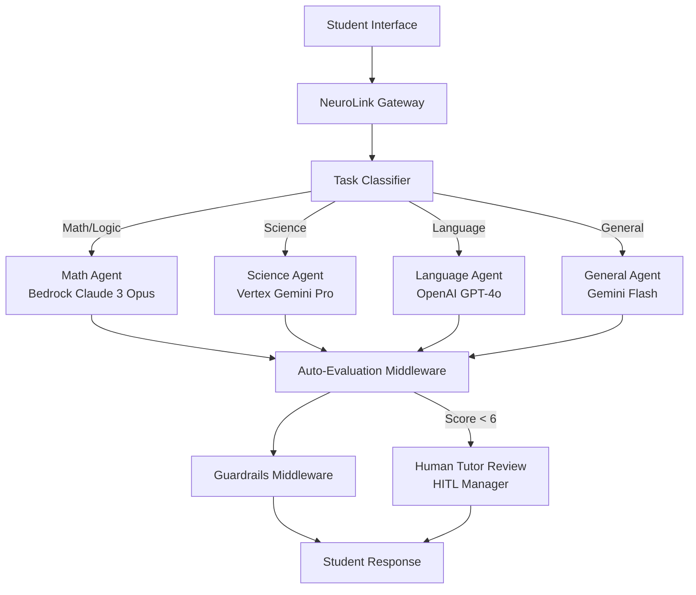

We designed the multi-agent orchestration architecture to solve a fundamental trade-off in AI tutoring: no single model excels at every subject. We built NeuroLink's multi-agent orchestration to solve a problem that single-model tutoring platforms cannot: different subjects demand fundamentally different AI capabilities. Mathematical reasoning requires a model optimized for logical deduction. Creative writing needs a model with natural language fluency. Simple factual queries need a fast, cost-efficient model that does not waste budget on unnecessary sophistication.

The design decision was to treat subject routing as a first-class orchestration concern, not an application-level afterthought. We chose to combine task classification, middleware guardrails, evaluation scoring, and human-in-the-loop oversight into a unified pipeline. The trade-off is increased architectural complexity in exchange for measurably better per-subject response quality and dramatically lower cost per interaction.

This deep dive covers the architecture we designed, the provider selection rationale for each subject domain, and the adaptive difficulty system that uses auto-evaluation scores to personalize the learning experience.

## System architecture

The platform uses a multi-agent architecture where each subject area is handled by a specialized agent backed by the model best suited for that domain.



The routing pattern is powered by NeuroLink's `TaskClassifier`. It analyzes student prompts using pattern matching against predefined categories. Math and logic questions matching reasoning patterns (words like "solve," "prove," "calculate") route to a strong reasoning model through Bedrock. Simple factual questions ("What is photosynthesis?") route to a fast, cost-efficient model. Creative writing assignments route to GPT-4o for its natural language generation strengths.

Each agent is created through `AIProviderFactory.createProvider()` with a subject-specific system prompt that shapes the model's teaching style for that domain.

## Provider setup per Subject

Each subject agent uses a different provider and model chosen for its strengths in that domain:

```typescript
import { AIProviderFactory } from '@juspay/neurolink';

// Math agent - strong reasoning model via Bedrock
const mathAgent = await AIProviderFactory.createProvider(
  "bedrock",
  "anthropic.claude-3-opus-20240229-v1:0"
);

// Science agent - balanced model via Vertex AI
const scienceAgent = await AIProviderFactory.createProvider(
  "vertex",
  "gemini-2.5-pro"
);

// Language arts agent - creative model via OpenAI
const langAgent = await AIProviderFactory.createProvider(
  "openai",
  "gpt-4o"
);

// General/fast agent - cost-efficient for simple queries
const generalAgent = await AIProviderFactory.createProvider(
  "google-ai",
  "gemini-2.5-flash"
);
```

The `ModelConfigurationManager` organizes models into three tiers per provider: `fast`, `balanced`, and `quality`. The math agent uses the quality tier for deep reasoning. The general agent uses the fast tier for quick factual lookups. The science and language agents use balanced models that offer a good trade-off between quality and cost.

The tier system is backed by constants like `MODEL_NAMES.BEDROCK.QUALITY` which maps to the specific model identifier. These can be overridden with environment variables (`BEDROCK_QUALITY_MODEL`, `VERTEX_BALANCED_MODEL`) for deployment-time configuration without code changes.

> **Tip:** Model selection is one of the most impactful cost decisions in a multi-agent system. A simple "What is the capital of France?" query costs roughly $0.0001 with Gemini Flash but $0.003 with Claude Opus -- a 30x difference. Route wisely.
{: .prompt-tip }

## Middleware for Content Safety

In an educational context, content safety is paramount. Students might try to get the AI to give them answers to homework assignments, bypass learning exercises, or access inappropriate content. NeuroLink's middleware system provides layered protection.

```typescript
import { MiddlewareFactory } from '@juspay/neurolink';

const middleware = new MiddlewareFactory({
  preset: "security",
  middlewareConfig: {
    guardrails: {
      enabled: true,
      config: {
        badWords: ["cheat", "hack", "answer key", "bypass"],
        precallEvaluation: {
          enabled: true,
        },
        modelFilter: {
          enabled: true,
          filterModel: generalAgent, // Use fast model for filtering
        },
      },
    },
    autoEvaluation: {
      enabled: true,
      config: {
        minScore: 6, // Minimum acceptable quality score
      },
    },
  },
});

// Apply middleware to each subject agent's model
const safeModel = middleware.applyMiddleware(
  await scienceAgent.getModel(),
  middleware.createContext("vertex", "gemini-2.5-pro", {}, {
    sessionId: studentSessionId,
    userId: studentId,
  })
);
```

The middleware operates through a multi-stage pipeline:

1. **Pre-call evaluation** (`handlePrecallGuardrails`): Before the prompt reaches the LLM, it is analyzed for harmful intent. A student asking "Give me the answer key for chapter 5" would be blocked here.

2. **Content filtering** (`applyContentFiltering`): The `badWords` list catches explicit attempts to bypass the tutoring intent. These words trigger immediate blocking without consuming LLM tokens.

3. **Model-based safety** (`modelFilter`): A secondary model (the fast Gemini Flash agent in this case) provides AI-powered safety checking that catches sophisticated attempts to subvert the system that a word list would miss.

4. **Post-generation quality scoring** (`autoEvaluation`): After generation, the response is scored for educational quality. Responses scoring below 6/10 trigger additional review.

The `"security"` preset activates a pre-configured set of guardrails optimized for safety-sensitive applications. Built-in presets include `"default"`, `"all"`, and `"security"`, each with different middleware combinations.

## Auto-Evaluation for Adaptive Difficulty

The auto-evaluation system is the core of adaptive learning. After every response, NeuroLink evaluates the AI tutor's output for relevance, accuracy, and completeness. These scores drive difficulty adjustment.

```typescript
import { generateEvaluation } from '@juspay/neurolink';

const evaluation = await generateEvaluation({
  userQuery: studentQuestion,
  aiResponse: tutorResponse,
  primaryDomain: "mathematics",
  toolUsage: [],
  conversationHistory: sessionHistory,
});

// Evaluation returns scores 1-10 for:
// - relevance, accuracy, completeness, overall
// - domainAlignment, terminologyAccuracy (when domain specified)

if (evaluation.overall >= 8) {
  // Increase difficulty for next question
  difficultyLevel++;
} else if (evaluation.overall < 5) {
  // Flag for human tutor review
  await hitlManager.requestConfirmation(
    "low-quality-response",
    { question: studentQuestion, response: tutorResponse, score: evaluation.overall }
  );
}
```

The `generateEvaluation()` function uses a Zod schema (`EvaluationSchema`) for validated scoring, ensuring that evaluation results are always well-formed. The evaluation considers the student's question, the AI's response, the conversation history for context, and the domain for appropriate scoring criteria.

When `primaryDomain` is set to "mathematics," the evaluator weighs accuracy and logical correctness more heavily. For "language arts," it might prioritize creativity and grammar. The `parseEvaluationResult()` function uses both JSON parsing and regex fallback for robust score extraction, handling cases where the evaluating model returns slightly malformed JSON.

The adaptive learning loop is straightforward: high scores (8+) indicate the student is mastering the material at the current difficulty level, so increase it. Low scores (below 5) indicate the AI produced a questionable response, so flag it for human review before the student sees it.

## Human-in-the-Loop for Sensitive Content

In educational settings, HITL serves two purposes: ensuring AI response quality and providing teacher oversight for sensitive topics. NeuroLink's `HITLManager` provides event-based confirmation with full audit logging for FERPA compliance.

```typescript
import { HITLManager } from '@juspay/neurolink';

const hitl = new HITLManager({
  enabled: true,
  dangerousActions: ["grade-override", "curriculum-change", "student-report"],
  timeout: 120000, // 2 minutes for teacher response
  confirmationMethod: "event",
  allowArgumentModification: true,
  auditLogging: true,
  customRules: [
    {
      name: "low-confidence-response",
      requiresConfirmation: true,
      condition: (toolName, args) => {
        const typedArgs = args as { score?: number };
        return typedArgs?.score !== undefined && typedArgs.score < 5;
      },
      customMessage: "AI response scored below threshold. Teacher review required.",
    },
  ],
});

// Listen for confirmation requests
hitl.on("hitl:confirmation-request", (event) => {
  // Send to teacher dashboard via WebSocket
  teacherDashboard.send(event.payload);
});
```

The `customRules` configuration is the bridge between auto-evaluation and HITL. When the evaluation score drops below 5, the custom rule triggers a confirmation request that appears on the teacher's dashboard. The teacher can then review the AI's response, modify it if needed (`allowArgumentModification: true`), and either approve the modified version or reject it entirely.

The audit logging supports FERPA (Family Educational Rights and Privacy Act) compliance by recording every AI interaction with student data, every teacher review, and every decision. The `ConfirmationResult` includes `approved`, `reason`, `modifiedArguments`, and `responseTime`, creating a comprehensive audit trail.

> **Warning:** FERPA compliance requires comprehensive data governance including consent management, data minimization, breach notification procedures, and institutional policies beyond what audit logging alone provides. This implementation addresses the technical audit trail requirement but does not constitute full FERPA compliance.
{: .prompt-warning }

## Conversation memory for Session Continuity

Tutoring sessions can span hours. A student working through a multi-step physics problem needs the AI to remember previous steps. NeuroLink's conversation memory handles this with token-aware summarization.

```typescript
// Configure conversation memory for tutoring sessions
process.env.NEUROLINK_MEMORY_ENABLED = "true";
process.env.NEUROLINK_MEMORY_MAX_SESSIONS = "100";
process.env.NEUROLINK_SUMMARIZATION_ENABLED = "true";
process.env.NEUROLINK_SUMMARIZATION_PROVIDER = "google-ai";
process.env.NEUROLINK_SUMMARIZATION_MODEL = "gemini-2.5-flash";
```

The memory system is configured with these key parameters:

- **`MEMORY_THRESHOLD_PERCENTAGE = 0.8`**: When the conversation reaches 80% of the model's context window, summarization kicks in automatically.
- **`RECENT_MESSAGES_RATIO = 0.3`**: The 30% most recent messages are preserved verbatim for immediate context. The older 70% is summarized.
- **`CONVERSATION_INSTRUCTIONS`**: A string appended to system prompts that instructs the model to be aware of its conversation history, enabling coherent multi-turn tutoring.

Using Gemini Flash for summarization keeps the cost low while maintaining enough quality for context preservation. The summarization happens transparently -- neither the student nor the teaching model knows that earlier messages have been condensed.

## Resilience: Circuit Breaker and Retry

A tutoring platform used by thousands of students simultaneously needs resilience patterns. If the Bedrock math agent goes down during an exam review session, students cannot be left waiting.

```typescript
import { withRetry, CircuitBreaker } from '@juspay/neurolink';

const mathCircuit = new CircuitBreaker(3, 30000); // 3 failures, 30s timeout

const response = await mathCircuit.execute(async () => {
  return withRetry(
    () => mathAgent.generate({ input: { text: studentQuestion } }),
    { maxAttempts: 3, initialDelay: 1000, backoffMultiplier: 2 }
  );
});
```

The `CircuitBreaker` wraps each agent with health monitoring. After three consecutive failures, it opens and immediately fails all subsequent requests, allowing the system to fall back to an alternative provider. The `withRetry` wrapper handles transient failures with exponential backoff (1s, 2s, 4s delays) and jitter (`calculateBackoffDelay()`) to prevent thundering herd problems when many student sessions retry simultaneously.

For critical scenarios, `AIProviderFactory.createProviderWithFallback()` provides automatic provider switching. If the primary math agent (Bedrock Claude) is down, it transparently switches to a fallback (such as Vertex Gemini Pro) without the student noticing any disruption.

## Deployment considerations

Building the platform is one challenge. Running it efficiently at scale is another.

**Cost optimization** is critical for EdTech. Route simple questions to Gemini Flash at approximately $0.000075 per 1K input tokens. Reserve Claude Opus (approximately $0.0015 per 1K input tokens) for complex reasoning tasks. Use `ModelConfigurationManager.getCostInfo()` for real-time cost tracking per interaction.

**Monitoring** middleware performance with `MiddlewareFactory.getChainStats()` gives you visibility into how much latency each middleware layer adds and whether guardrails or evaluation are becoming bottlenecks.

**Scaling** across serverless functions requires singleton management. `ServiceRegistry` from NeuroLink ensures that provider instances, middleware chains, and HITL managers are properly shared across function invocations without re-initialization overhead.

**Compliance** is simplified by the audit logging built into every HITL interaction. These logs help address FERPA requirements for educational data protection, providing a detailed trail of every AI interaction with student data. Full FERPA compliance requires additional institutional policies and data governance measures beyond audit logging.

## Design decisions and Trade-offs

The multi-agent architecture introduces complexity that a single-model approach avoids: more provider configurations, more middleware chains, more failure modes. We chose this trade-off because the per-subject quality improvement is measurable and significant. A math question routed to a reasoning-optimized model scores 15-20% higher on evaluation than the same question routed to a general-purpose model.

The adaptive difficulty system using evaluation scores is a pragmatic compromise. Ideally, difficulty would adapt based on pedagogical assessment of the student's understanding. In practice, evaluation scores are a reliable proxy that can be implemented without custom ML models.

For related design patterns:

- See the [enterprise customer support bot](/posts/enterprise-customer-support-bot/) for similar multi-agent patterns applied to a different domain
- Read about [auditable AI pipelines](/posts/auditable-ai-pipelines/) for deeper compliance patterns
- Explore [building AI agents](/posts/building-ai-agents/) for the foundational agent architecture

---

**Related posts:**

- [Building an Enterprise Customer Support Bot That Never Goes Down](/posts/enterprise-customer-support-bot/)
- [Building Auditable AI Pipelines: HITL, Guardrails, and Observability for Regulated Industries](/posts/auditable-ai-pipelines/)
- [Building AI Agents with NeuroLink: From Chatbot to Autonomous System](/posts/building-ai-agents/)
