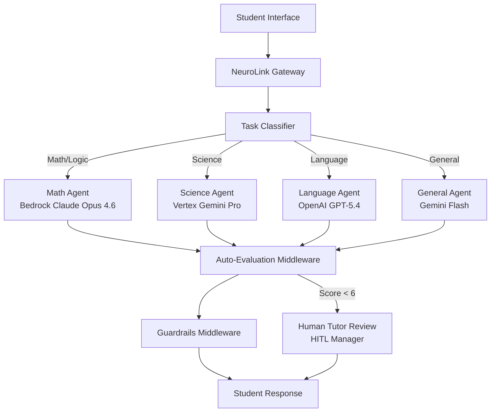

Multi-agent orchestration addresses a fundamental trade-off in AI tutoring: no single model excels at every subject. A single-model tutoring platform cannot serve every subject well, because different subjects demand fundamentally different AI capabilities. Mathematical reasoning requires a model optimized for logical deduction. Creative writing needs a model with natural language fluency. Simple factual queries need a fast, cost-efficient model that does not waste budget on unnecessary sophistication.

This design treats subject routing as a first-class orchestration concern rather than an application-level afterthought, combining task classification, middleware guardrails, evaluation scoring, and human-in-the-loop oversight into a unified pipeline. The trade-off is increased architectural complexity in exchange for measurably better per-subject response quality and lower cost per interaction.

This deep dive covers the resulting architecture, the provider selection rationale for each subject domain, and the adaptive difficulty system that uses auto-evaluation scores to personalize the learning experience.

## System architecture

The platform uses a multi-agent architecture where each subject area is handled by a specialized agent backed by the model best suited for that domain.


```mermaid
flowchart TB
    Student[Student Interface] --> Gateway[NeuroLink Gateway]
    Gateway --> Classifier[Task Classifier]
    Classifier -->|Math/Logic| MathAgent[Math Agent<br/>Bedrock Claude Opus 4.6]
    Classifier -->|Science| ScienceAgent[Science Agent<br/>Vertex Gemini Pro]
    Classifier -->|Language| LangAgent[Language Agent<br/>OpenAI GPT-5.4]
    Classifier -->|General| GeneralAgent[General Agent<br/>Gemini Flash]

    MathAgent --> Evaluator[Auto-Evaluation Middleware]
    ScienceAgent --> Evaluator
    LangAgent --> Evaluator
    GeneralAgent --> Evaluator

    Evaluator --> Guardrails[Guardrails Middleware]
    Guardrails --> Response[Student Response]

    Evaluator -->|Score < 6| HITL[Human Tutor Review<br/>HITL Manager]
    HITL --> Response
```

The routing pattern is application-level logic: a classifier function analyzes student prompts using pattern matching against predefined categories and dispatches to the agent for that subject. Math and logic questions matching reasoning patterns (words like "solve," "prove," "calculate") route to a strong reasoning model through Bedrock. Simple factual questions ("What is photosynthesis?") route to a fast, cost-efficient model. Creative writing assignments route to GPT-5.4 for its natural language generation strengths. (NeuroLink itself uses an internal binary task classifier to help pick default models per request, but that classifier is not part of the public API -- the subject router here is code you write.)

Each agent is created through `AIProviderFactory.createProvider()` with a subject-specific system prompt that shapes the model's teaching style for that domain.

## Provider setup per Subject

Each subject agent uses a different provider and model chosen for its strengths in that domain:

```typescript
import { AIProviderFactory } from '@juspay/neurolink';

// Math agent - strong reasoning model via Bedrock
const mathAgent = await AIProviderFactory.createProvider(
  "bedrock",
  "anthropic.claude-opus-4-6-v1"
);

// Science agent - balanced model via Vertex AI
const scienceAgent = await AIProviderFactory.createProvider(
  "vertex",
  "gemini-2.5-pro"
);

// Language arts agent - creative model via OpenAI
const langAgent = await AIProviderFactory.createProvider(
  "openai",
  "gpt-5.4"
);

// General/fast agent - cost-efficient for simple queries
const generalAgent = await AIProviderFactory.createProvider(
  "google-ai",
  "gemini-2.5-flash"
);
```

The `ModelConfigurationManager` organizes models into three tiers per provider: `fast`, `balanced`, and `quality`. The math agent uses the quality tier for deep reasoning. The general agent uses the fast tier for quick factual lookups. The science and language agents use balanced models that offer a good trade-off between quality and cost.

The tier system is backed by constants like `MODEL_NAMES.BEDROCK.QUALITY` which maps to the specific model identifier. These can be overridden with environment variables (`BEDROCK_QUALITY_MODEL`, `VERTEX_BALANCED_MODEL`) for deployment-time configuration without code changes.

> **Tip:** Model selection is one of the most impactful cost decisions in a multi-agent system. A simple "What is the capital of France?" query costs an order of magnitude less with Gemini Flash than with a flagship reasoning model like Claude Opus (check current provider pricing pages for exact rates, since these change independently of NeuroLink). Route wisely.
{: .prompt-tip }

## Middleware for Content Safety

In an educational context, content safety is paramount. Students might try to get the AI to give them answers to homework assignments, bypass learning exercises, or access inappropriate content. NeuroLink's middleware system provides layered protection.

```typescript
let evaluationScore = 0;

const response = await scienceAgent.generate({
  input: { text: studentQuestion },
  middleware: {
    preset: "security",
    middlewareConfig: {
      guardrails: {
        enabled: true,
        config: {
          badWords: {
            enabled: true,
            list: ["cheat", "hack", "answer key", "bypass"],
          },
          precallEvaluation: {
            enabled: true,
          },
          modelFilter: {
            enabled: true,
            // A provider:model string is resolved to a model handle by guardrails
            filterModel: "google-ai:gemini-2.5-flash",
          },
        },
      },
      autoEvaluation: {
        enabled: true,
        config: {
          threshold: 6,
          blocking: true,
          onEvaluationComplete: (evaluation) => {
            evaluationScore = evaluation.overall ?? 0;
          },
        },
      },
    },
  },
});
```

The middleware operates through a multi-stage pipeline:

1. **Pre-call evaluation** (`handlePrecallGuardrails`): Before the prompt reaches the LLM, it is analyzed for harmful intent. Whether a suspicious request is blocked, sanitized, warned, or allowed depends on the configured actions and thresholds.

2. **Content filtering** (`applyContentFiltering`): After generation, the `badWords` list replaces matching terms with the configured replacement text. It is a simple output filter, not a semantic detector of cheating intent.

3. **Model-based safety** (`modelFilter`): A secondary model (Gemini Flash in this case) checks the generated response and redacts it when the classifier returns `unsafe`, complementing the static term list.

4. **Post-generation quality scoring** (`autoEvaluation`): After generation, the response is scored for educational quality. The callback captures that score so the application can route responses below 6/10 for additional review.

The `"security"` preset activates a pre-configured set of guardrails optimized for safety-sensitive applications. Built-in presets include `"default"`, `"all"`, and `"security"`, each with different middleware combinations.

## Auto-Evaluation for Adaptive Difficulty

The auto-evaluation system is the core of adaptive learning. After every response, NeuroLink evaluates the AI tutor's output for relevance, accuracy, and completeness. These scores drive difficulty adjustment.

```typescript
// The evaluation score is not a field on the generate() result -- it only
// arrives through the autoEvaluation middleware's onEvaluationComplete
// callback. `blocking: true` makes generate() await the evaluation, so the
// callback has already run by the time the score is read below.
let evaluationScore = 0;

const result = await mathAgent.generate({
  input: { text: studentQuestion },
  middleware: {
    middlewareConfig: {
      autoEvaluation: {
        enabled: true,
        config: {
          threshold: 6,
          blocking: true,
          onEvaluationComplete: (evaluation) => {
            evaluationScore = evaluation.overall ?? 0;
          },
        },
      },
    },
  },
});

// Evaluation scores (1-10) cover relevance, accuracy, completeness, and
// overall, plus domainAlignment/terminologyAccuracy when a domain is
// configured for the middleware's evaluation prompt.

if (evaluationScore >= 8 && studentAssessment.passed) {
  // Advance only when both the tutor response and student assessment pass
  difficultyLevel++;
} else if (evaluationScore < 5) {
  // Flag for human tutor review
  await hitl.requestConfirmation(
    "low-quality-response",
    { question: studentQuestion, response: result?.content, score: evaluationScore }
  );
}
```

The auto-evaluation middleware scores the tutor's output for relevance, accuracy, and completeness using an LLM-as-judge. The evaluation considers the student's question and the AI's response, scored against the configured rubric.

Domain-specific weighting (accuracy and logical correctness for math, creativity and grammar for language arts) is configured through NeuroLink's domain evaluation settings rather than a per-call parameter -- see the domain-specific evaluation pattern in the [prompt versioning guide](/posts/prompt-versioning-management/) for how to set it.

The adaptive learning loop is straightforward, but the signal needs careful interpretation: the auto-evaluation score measures the tutor response, not the student's mastery. High tutor-response scores (8+) allow the application to continue its planned progression, while scores below 5 indicate a questionable AI response that should be held for human review. Adapt actual difficulty using student answers or assessment results alongside this response-quality gate.

## Human-in-the-Loop for Sensitive Content

In educational settings, HITL serves two purposes: ensuring AI response quality and providing teacher oversight for sensitive topics. NeuroLink's `HITLManager` provides event-based confirmation and optional audit events for the confirmation workflow; applications must export and retain those records under their own education-data policies.

```typescript
import { HITLManager } from '@juspay/neurolink';

const hitl = new HITLManager({
  enabled: true,
  dangerousActions: ["grade-override", "curriculum-change", "student-report"],
  timeout: 120000, // 2 minutes for teacher response
  confirmationMethod: "event",
  allowArgumentModification: true,
  auditLogging: true,
});

// Listen for confirmation requests
hitl.on("hitl:confirmation-request", (event) => {
  // Send to teacher dashboard via WebSocket
  teacherDashboard.send(event.payload);
});
```

The direct low-score path shown earlier calls `requestConfirmation()` explicitly. For action-based policies, add `customRules`, call `hitl.requiresConfirmation(toolName, args)` before execution, and request confirmation only when it returns true. The teacher can review the request, submit modified arguments when `allowArgumentModification` is enabled, and approve or reject it.

With `auditLogging` enabled, `HITLManager` emits audit entries for confirmation requests, decisions, timeouts, and configuration changes. It does not record every AI interaction automatically. The `ConfirmationResult` includes `approved`, `reason`, `modifiedArguments`, and `responseTime`; persist those results with request and reviewer identifiers in your approved audit store if your policy requires them.

> **Warning:** FERPA compliance requires comprehensive data governance including consent management, data minimization, breach notification procedures, and institutional policies beyond what audit logging alone provides. This implementation addresses the technical audit trail requirement but does not constitute full FERPA compliance.
{: .prompt-warning }

## Conversation memory for Session Continuity

Tutoring sessions can span hours. A student working through a multi-step physics problem needs the AI to remember previous steps. NeuroLink's conversation memory handles this with token-aware summarization.

```typescript
// Configure conversation memory for tutoring sessions
process.env.NEUROLINK_MEMORY_ENABLED = "true";
process.env.NEUROLINK_MEMORY_MAX_SESSIONS = "100";
process.env.NEUROLINK_SUMMARIZATION_ENABLED = "true";
process.env.NEUROLINK_SUMMARIZATION_PROVIDER = "google-ai";
process.env.NEUROLINK_SUMMARIZATION_MODEL = "gemini-2.5-flash";
```

The memory system is configured with these key parameters:

- **`MEMORY_THRESHOLD_PERCENTAGE = 0.8`**: When the conversation reaches 80% of the model's context window, summarization kicks in automatically.
- **`RECENT_MESSAGES_RATIO = 0.3`**: The 30% most recent messages are preserved verbatim for immediate context. The older 70% is summarized.
- **`CONVERSATION_INSTRUCTIONS`**: A string appended to system prompts that instructs the model to be aware of its conversation history, enabling coherent multi-turn tutoring.

Using Gemini Flash for summarization keeps the cost low while maintaining enough quality for context preservation. The summarization happens transparently -- neither the student nor the teaching model knows that earlier messages have been condensed.

## Resilience: Circuit Breaker and Retry

A tutoring platform used by thousands of students simultaneously needs resilience patterns. If the Bedrock math agent goes down during an exam review session, students cannot be left waiting.

```typescript
import { withRetry, executeWithCircuitBreaker } from '@juspay/neurolink';

const response = await executeWithCircuitBreaker(
  "math-agent", // breaker name -- state is tracked per name
  async () => {
    return withRetry(
      () => mathAgent.generate({ input: { text: studentQuestion } }),
      { maxRetries: 3, baseDelayMs: 1000, maxDelayMs: 8000 }
    );
  },
  "generate",
);
```

`executeWithCircuitBreaker()` wraps the operation with a named circuit breaker (created and cached on first use, defaulting to 5 consecutive failures before it opens). Once open, it immediately fails subsequent requests for that name, allowing the system to fall back to an alternative provider -- pass a `config` with a custom `failureThreshold` via `getCircuitBreaker()` to tune this per agent. The `withRetry` wrapper handles transient failures with exponential backoff, doubling the delay on each attempt up to `maxDelayMs`, to reduce thundering-herd problems when many student sessions retry simultaneously.

For critical scenarios, `AIProviderFactory.createProviderWithFallback()` instantiates a primary and a fallback provider together (`{ primary, fallback }`) in one call. It does not switch between them itself -- combine it with the circuit breaker and retry logic above, catching failures on the primary math agent (Bedrock Claude) and falling back to the secondary (such as Vertex Gemini Pro) so the student sees a slower response rather than an outage.

## Deployment considerations

Building the platform is one challenge. Running it efficiently at scale is another.

**Cost optimization** is critical for EdTech. Route simple questions to a fast, cheap model like Gemini Flash and reserve a flagship reasoning model like Claude Opus for complex reasoning tasks -- check current provider pricing pages for per-token rates, since these change independently of NeuroLink. A `ModelConfigurationManager` instance exposes `getCostInfo(provider, model)` for configured per-token rates; combine that with each generation result's `usage` fields to estimate interaction cost.

**Monitoring** middleware performance is straightforward: a `MiddlewareFactory` instance's `getChainStats(context, config)` reports, per middleware layer, whether it was applied and its average execution time, plus chain totals -- useful for spotting which layer adds latency.

**Scaling** across serverless functions requires singleton management. Cache provider instances, middleware chains, and `HITLManager` instances at module scope (outside the request handler) so a warm serverless invocation reuses them instead of re-initializing on every request.

**Compliance** is simplified by the audit logging built into every HITL interaction. These logs help address FERPA requirements for educational data protection, providing a detailed trail of every AI interaction with student data. Full FERPA compliance requires additional institutional policies and data governance measures beyond audit logging.

## Design decisions and Trade-offs

The multi-agent architecture introduces complexity that a single-model approach avoids: more provider configurations, more middleware chains, more failure modes. That trade-off is worth making when the per-subject quality improvement is measurable: run the same test cases through both a reasoning-optimized model and a general-purpose model via the auto-evaluation middleware from earlier, and compare the resulting scores for your own subject mix before committing to the added complexity.

The adaptive difficulty system using evaluation scores is a pragmatic compromise. Ideally, difficulty would adapt based on pedagogical assessment of the student's understanding. In practice, evaluation scores are a reliable proxy that can be implemented without custom ML models.

For related design patterns:

- See the [enterprise customer support bot](/posts/enterprise-customer-support-bot/) for similar multi-agent patterns applied to a different domain
- Read about [auditable AI pipelines](/posts/auditable-ai-pipelines/) for deeper compliance patterns
- Explore [building AI agents](/posts/building-ai-agents/) for the foundational agent architecture

---

**Related posts:**

- [Building an Enterprise Customer Support Bot That Never Goes Down](/posts/enterprise-customer-support-bot/)
- [Building Auditable AI Pipelines: HITL, Guardrails, and Observability for Regulated Industries](/posts/auditable-ai-pipelines/)
- [Building AI Agents with NeuroLink: From Chatbot to Autonomous System](/posts/building-ai-agents/)
