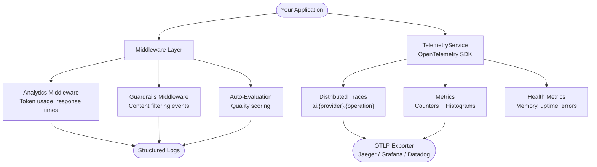
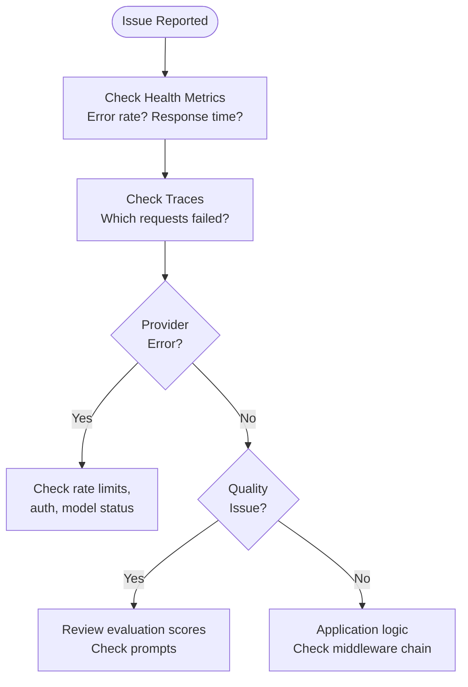

You will set up a complete observability stack for debugging AI applications using NeuroLink's built-in telemetry, analytics middleware, and health monitoring. By the end of this tutorial, you will have OpenTelemetry tracing for every AI request, middleware-level analytics for token usage and quality scoring, and health monitoring with alerting for production degradation.

AI applications present debugging challenges that traditional software does not. Outputs are non-deterministic. Failures are hidden behind confident, well-formed responses that happen to be wrong. Latency swings from 200ms to 30 seconds depending on provider load. Costs spike when prompts accidentally trigger verbose responses.

You will address these challenges with a three-layer approach: request-level tracing (what happened), middleware insights (what the system did with the response), and health monitoring (whether the infrastructure is healthy).

## Architecture: NeuroLink observability stack

NeuroLink's observability system has three major components that work together to give you complete visibility into your AI application.



The middleware layer provides application-level insights: how many tokens each request consumed, whether guardrails blocked any content, and what quality score the response received. The telemetry layer provides infrastructure-level visibility: distributed traces across providers, aggregated metrics for dashboards, and health monitoring for operational alerting.

## Setting up observability

### Enable telemetry

NeuroLink's telemetry system is built on OpenTelemetry and configured through environment variables:

```bash
# Environment variables
export NEUROLINK_TELEMETRY_ENABLED=true
export OTEL_EXPORTER_OTLP_ENDPOINT=http://localhost:4317
export OTEL_SERVICE_NAME=my-ai-app
export OTEL_SERVICE_VERSION=1.0.0
```

### TelemetryService API

The `TelemetryService` is a singleton that initializes the OpenTelemetry SDK and provides instrumentation methods:

```typescript
import { TelemetryService } from '@juspay/neurolink';

const telemetry = TelemetryService.getInstance();
await telemetry.initialize();

// Check status
const status = telemetry.getStatus();
console.log(`Enabled: ${status.enabled}`);
console.log(`Endpoint: ${status.endpoint}`);
console.log(`Service: ${status.service}`);
```

The `getStatus()` method returns the current telemetry configuration: whether it is enabled, the OTLP endpoint, and the service name. Use this to verify that telemetry is properly configured before running diagnostic queries.

## Debugging layer 1: request-level tracing

The first layer of debugging is understanding what happened at the request level. Every AI request can be wrapped in an OpenTelemetry span that captures the provider, operation type, duration, and outcome.

### AI request tracing

```typescript
// TelemetryService wraps AI requests in OpenTelemetry spans
const result = await telemetry.traceAIRequest('openai', async () => {
  return await neurolink.generate({
    input: { text: 'Analyze this data...' },
    provider: 'openai',
    model: 'gpt-4o',
  });
}, 'generate_text');

// Each span includes:
// - ai.provider: "openai"
// - ai.operation: "generate_text"
// - Status: OK or ERROR with message
```

The `traceAIRequest()` method creates a span named `ai.openai.generate_text` with attributes for the provider, operation type, and status. If the request fails, the span captures the error message and sets the status to ERROR. These spans flow to your tracing backend (Jaeger, Grafana Tempo, Datadog) where you can visualize the full request timeline.

### Recording metrics

Beyond tracing, the telemetry service provides methods for recording structured metrics:

```typescript
// Record AI request metrics
telemetry.recordAIRequest('openai', 'gpt-4o', tokenCount, durationMs);

// Record errors
telemetry.recordAIError('openai', new Error('Rate limit exceeded'));

// Record MCP tool calls
telemetry.recordMCPToolCall('web_search', 1200, true);

// Record custom metrics
telemetry.recordCustomMetric('cache_hits', 1, { cache_type: 'prompt' });
telemetry.recordCustomHistogram('prompt_length', 2500, { model: 'gpt-4o' });
```

Each method maps to an OpenTelemetry counter or histogram with standardized labels (provider, model, tool name, success/failure). This consistency means your Grafana dashboards work the same way regardless of which provider or model you are using.

## Debugging layer 2: middleware insights

The middleware layer provides application-level debugging information that traces alone cannot capture. This is where you understand *what* the system did with the AI's response, not just whether the AI call succeeded.

### Analytics middleware

The analytics middleware automatically captures token usage, response time, and request metadata for every generation:

```typescript
const neurolink = new NeuroLink();

// Configure middleware separately
const middleware = new MiddlewareFactory({
  middlewareConfig: {
    analytics: { enabled: true },
  },
});

const result = await neurolink.generate({
  input: { text: 'Summarize this report...' },
  provider: 'openai',
  model: 'gpt-4o',
});

// Access analytics from result metadata
// result.experimental_providerMetadata.neurolink.analytics:
// {
//   requestId: "analytics-1708000000000",
//   responseTime: 1250,
//   timestamp: "2026-02-14T...",
//   usage: { input: 150, output: 500, total: 650 }
// }
```

The analytics data is attached to the result object, making it available to your application logic. You can use it for cost tracking, latency monitoring, and anomaly detection. A sudden spike in `usage.total` might indicate a prompt regression that is generating overly verbose responses.

> **Tip:** Token counts use `usage.total`, `usage.input`, and `usage.output` -- not `totalTokens`, `inputTokens`, or `outputTokens`. This is the NeuroLink-standard naming convention.
{: .prompt-tip }

### Guardrails debugging

When responses are unexpectedly empty or contain the placeholder `<REDACTED BY AI GUARDRAIL>`, guardrails are the likely cause. The guardrails middleware logs events at the debug level:

```typescript
// When guardrails block content:
// - transformParams logs "Applying to generate/stream call"
// - Blocked content replaced with "<REDACTED BY AI GUARDRAIL>"
// - Model-based filter logs "flagged content as unsafe"
// - All events logged at debug level via NeuroLink logger
```

Enable debug-level logging to see exactly which guardrail rule fired and why. The logs include the specific bad word that matched or the model-based filter's assessment of why the content was flagged.

### Auto-evaluation results

Auto-evaluation provides structured quality scores for every response:

```typescript
// Evaluation results include detailed scoring
// {
//   relevanceScore: 8,
//   accuracyScore: 7,
//   completenessScore: 9,
//   finalScore: 8,
//   isPassing: true,
//   suggestedImprovements: "...",
//   reasoning: "...",
//   evaluationModel: "gemini-1.5-flash",
//   evaluationTime: 3200,
// }
```

When debugging quality issues, the `suggestedImprovements` and `reasoning` fields are invaluable. They tell you not just that the response scored low, but why. A response might score high on accuracy but low on completeness, indicating that your prompt needs to explicitly request comprehensive coverage.

## Debugging layer 3: health monitoring

The third layer provides system-level health information: memory usage, uptime, connection counts, error rates, and response times.

```typescript
const health = await telemetry.getHealthMetrics();

// HealthMetrics includes:
// {
//   timestamp: 1708000000000,
//   memoryUsage: { heapUsed: 52428800, heapTotal: 104857600, ... },
//   uptime: 3600,
//   activeConnections: 12,
//   errorRate: 0.5,           // Percentage
//   averageResponseTime: 850  // Milliseconds
// }

// Alert on degradation
if (health.errorRate > 5) {
  alertOps('High error rate detected', health);
}
if (health.averageResponseTime > 5000) {
  alertOps('Slow response times', health);
}
```

Health metrics are particularly useful for detecting slow degradation. A memory leak might not cause immediate failures but will gradually increase `heapUsed` until the process crashes. An increasing error rate might indicate that a provider is experiencing partial outages. Rising response times might mean your rate limits are being hit and requests are being queued.

## Available metrics reference

Here is the complete reference of metrics tracked by NeuroLink's telemetry system:

**Counters:**

- `ai_requests_total` -- total AI requests by provider and model
- `ai_tokens_used_total` -- total tokens consumed by provider and model
- `ai_provider_errors_total` -- total errors by provider and error type
- `mcp_tool_calls_total` -- total MCP tool calls by tool name and success/failure
- `connections_total` -- total connections by connection type

**Histograms:**

- `ai_request_duration_ms` -- request duration by provider and model
- `response_time_ms` -- response time by endpoint and method

**Labels:** provider, model, tool, success, connection_type, endpoint, method

**Duration buckets:** fast (<100ms), medium (<500ms), slow (<1000ms), very_slow (>=1000ms)

**Status buckets:** excellent (<200ms), good (<500ms), acceptable (<1000ms), poor (>=1000ms)

## Common failure patterns and solutions

When debugging AI applications, most issues fall into a handful of recognizable patterns:

| Symptom | Likely Cause | Debugging Approach |
|---------|--------------|-------------------|
| Slow responses | Model overloaded or large prompt | Check `ai_request_duration_ms` histogram |
| Token budget exceeded | Unbounded context growth | Monitor `ai_tokens_used_total` counter |
| Empty responses | Guardrails blocking | Check guardrails logs for "REDACTED" |
| Quality degradation | Model drift or prompt issues | Review auto-evaluation scores over time |
| Provider errors | Rate limits or auth issues | Check `ai_provider_errors_total` by provider |
| High memory usage | Large file processing | Monitor `memoryUsage.heapUsed` in health metrics |

Each pattern has a distinct signature in the observability data. Slow responses show up as outliers in the duration histogram. Token budget issues appear as a sudden jump in the tokens counter. Empty responses correlate with guardrails blocking events. Quality degradation manifests as declining evaluation scores over time.

## Debugging workflow for production issues

When an issue is reported in production, follow this structured workflow:



1. **Health check first:** Is the error rate elevated? Are response times degraded? This tells you whether it is a systemic issue or an isolated incident.
2. **Trace the request:** Find the specific failing requests in your tracing backend. Look at the span attributes for provider, model, and error details.
3. **Classify the issue:** Is it a provider-side error (rate limits, auth failures, model downtime) or an application-side quality issue?
4. **Provider issues:** Check the provider's status page, verify API keys, review rate limit configurations.
5. **Quality issues:** Review auto-evaluation scores for the affected time period. Check if prompts were recently changed.
6. **Application issues:** Inspect the middleware chain. Check if guardrails are blocking legitimate content. Verify that the right model is being selected by the router.

## CLI debugging commands

NeuroLink's CLI provides quick diagnostic commands that complement the programmatic observability tools:

```bash
# Check server health
neurolink serve status --format json

# Test MCP server connectivity
neurolink mcp test

# Debug mode on any command
neurolink serve --debug

# View model availability
neurolink models list --provider openai --format json
```

The `--debug` flag enables verbose logging across all middleware and provider layers, showing you exactly what is happening at each stage of the request pipeline. Use this in development or when reproducing issues locally.

## What you built

You set up a complete observability stack for AI applications: OpenTelemetry tracing for request-level visibility, analytics middleware for token usage and cost tracking, auto-evaluation for quality scoring, and health monitoring for infrastructure alerting. Every AI request is now traceable, measurable, and diagnosable.

Continue with these related tutorials:

- [Auditable AI pipelines](/posts/auditable-ai-pipelines/) for compliance-grade observability
- [Prompt versioning and management](/posts/prompt-versioning-management/) for tracking prompt changes that affect quality
- [Enterprise customer support bot](/posts/enterprise-customer-support-bot/) for monitoring patterns in multi-provider architectures

---

**Related posts:**

- [Building Auditable AI Pipelines: HITL, Guardrails, and Observability for Regulated Industries](/posts/auditable-ai-pipelines/)
- [Error Handling Patterns for AI Applications](/posts/error-handling-patterns/)
- [Prompt Versioning and Management: Treating Prompts as Code](/posts/prompt-versioning-management/)
