You will build a complete AI recruitment pipeline that handles resume parsing, skill matching, bias prevention, candidate ranking, recruiter approval, and interview scheduling. By the end of this tutorial, you will have a multi-stage pipeline using GPT-4o for resume parsing, Gemini Pro for skill matching, Claude Sonnet for candidate ranking, guardrails middleware for bias prevention, HITL for recruiter approval, and Gemini Flash for automated interview scheduling.

Every automated hiring decision must be auditable and free of bias against protected characteristics under EEOC, ADA, and Title VII regulations. Every final hiring decision must involve a human.

Next, you will configure each pipeline stage with the appropriate model, middleware, and oversight controls.

## Pipeline architecture

The recruitment pipeline is a multi-stage process where each stage uses a different model optimized for its specific task.

```mermaid
flowchart LR
    Resume[Resume Upload] --> Parser[Resume Parser<br/>GPT-4o Vision]
    Parser --> Matcher[Skill Matcher<br/>Gemini Pro]
    Matcher --> BiasCheck[Bias Guardrails<br/>Middleware]
    BiasCheck --> Ranker[Candidate Ranker<br/>Claude Sonnet]
    Ranker --> HITL[Recruiter Review<br/>HITL Manager]
    HITL -->|Approved| Scheduler[Interview Scheduler<br/>Gemini Flash + Tools]
    HITL -->|Rejected| Archive[Archive with Reason]

    subgraph Structured Output
        Parser -->|JSON| ATS[ATS Integration]
        Ranker -->|JSON| ATS
    end
```



Each stage in the pipeline is handled by a specialized model:

- **Resume Parser (GPT-4o):** Multimodal vision capabilities for parsing PDF and image-based resumes into structured JSON data.
- **Skill Matcher (Gemini Pro):** Balanced model for matching extracted skills against job requirements with nuanced understanding.
- **Bias Check (Guardrails Middleware):** Content filtering that removes protected characteristics from both inputs and outputs before they influence evaluations.
- **Candidate Ranker (Claude Sonnet):** Nuanced comparative evaluation across multiple candidates with reasoning explanations.
- **Interview Scheduler (Gemini Flash + Tools):** Cost-efficient model with calendar tool integration for scheduling logistics.

## Resume parsing with Structured Output

The first stage extracts structured data from resumes in any format -- PDF, Word, or image. GPT-4o's multimodal capabilities handle all these formats through a single interface.

```typescript
import { AIProviderFactory } from '@juspay/neurolink';

const parser = await AIProviderFactory.createProvider("openai", "gpt-4o");

const systemPrompt = `You are a resume parser. Extract structured data from resumes.
${STRUCTURED_OUTPUT_INSTRUCTIONS}`;

// STRUCTURED_OUTPUT_INSTRUCTIONS from NeuroLink's conversation memory config:
// "Output ONLY valid JSON. No markdown, text, or decorations--ever."
// "REQUIRED: response starts with { and ends with }, valid JSON only"

const result = await parser.generate({
  input: {
    text: systemPrompt + "\n\nParse this resume:\n" + resumeText,
  },
});

// Expected output shape:
// {
//   "name": "...",
//   "email": "...",
//   "skills": ["TypeScript", "Python", "AWS"],
//   "experience_years": 5,
//   "education": [{ "degree": "BS CS", "school": "..." }],
//   "previous_roles": [{ "title": "...", "company": "...", "duration": "..." }]
// }
```

The `STRUCTURED_OUTPUT_INSTRUCTIONS` from NeuroLink's conversation memory configuration is critical here. It instructs the model to output pure JSON without markdown wrapping, conversational preamble, or decorative formatting. This ensures that the parsed output can be directly fed into your Applicant Tracking System (ATS) without additional text processing.

For PDF resumes, GPT-4o's vision capabilities process the document as an image, handling complex layouts, tables, and multi-column formats that text-only parsers struggle with. This eliminates the need for a separate PDF parsing library in your pipeline.

> **Tip:** Always validate parsed resume data against a schema before storing it. LLMs can hallucinate fields or produce malformed JSON despite structured output instructions. A Zod schema validation step adds milliseconds but prevents data quality issues downstream.
{: .prompt-tip }

## Bias prevention guardrails

Bias prevention is the most critical middleware in a recruitment pipeline. NeuroLink's guardrails system filters protected characteristics from both inputs (preventing biased prompts from reaching the LLM) and outputs (preventing biased evaluations from reaching recruiters).

```typescript
import { MiddlewareFactory } from '@juspay/neurolink';

const recruitmentMiddleware = new MiddlewareFactory({
  middlewareConfig: {
    guardrails: {
      enabled: true,
      config: {
        badWords: [
          // Protected characteristics - must never appear in AI evaluations
          "age", "gender", "race", "ethnicity", "religion",
          "disability", "pregnancy", "marital status",
          "sexual orientation", "national origin",
          // Proxy indicators
          "graduation year", "university prestige", "photo",
        ],
        precallEvaluation: {
          enabled: true, // Block biased prompts before LLM
        },
        modelFilter: {
          enabled: true,
          // Use a separate model to check for bias in outputs
        },
      },
    },
    analytics: {
      enabled: true, // Track every evaluation for audit
    },
  },
});
```

> **Note:** This substring-based filter is intentionally simplified for illustration. In production, words like "age" will produce false positives by matching "manage", "package", and "average". Use NLP-based bias detection (e.g., a dedicated classifier or embedding similarity) for production-grade compliance filtering.
{: .prompt-info }

The guardrails operate at three levels:

1. **`badWords` filtering:** Removes references to protected characteristics from both the prompt sent to the LLM and the response received. If a resume mentions the candidate's age, that information is redacted before the matching model sees it. If the ranking model mentions ethnicity in its evaluation, that content is filtered from the output.

2. **`precallEvaluation`:** Before any prompt reaches the LLM, it is analyzed for biased framing. A prompt like "Rank candidates, preferring those from top-tier universities" would be flagged and blocked because "university prestige" is a proxy indicator for socioeconomic bias.

3. **`modelFilter`:** A separate AI model reviews the output for subtle bias that word lists cannot catch. The model can detect coded language, implicit assumptions, and evaluative framing that correlates with protected characteristics.

The `wrapGenerate` and `wrapStream` methods from the guardrails middleware apply these filters to both synchronous and streaming responses, ensuring no evaluation path bypasses the bias checks.

Every filtering action is logged through the analytics middleware, creating an audit trail that helps support compliance efforts with employment regulations such as EEOC, ADA, and Title VII. Note that keyword filtering alone is not sufficient for compliance and may produce false positives — consult legal counsel for your specific requirements.

## HITL for Recruiter Approval

No AI system should make final hiring decisions autonomously. NeuroLink's `HITLManager` ensures that recruiters review and approve every shortlisting decision with full audit logging.

```typescript
import { HITLManager } from '@juspay/neurolink';

const recruitmentHITL = new HITLManager({
  enabled: true,
  dangerousActions: ["shortlist", "reject", "schedule-interview"],
  timeout: 86400000, // 24 hours for recruiter review
  confirmationMethod: "event",
  allowArgumentModification: true,
  autoApproveOnTimeout: false,
  auditLogging: true,
  customRules: [
    {
      name: "auto-shortlist-high-match",
      requiresConfirmation: true, // Always require human review for hiring decisions
      condition: (_toolName, args) => {
        const typedArgs = args as { matchScore?: number };
        return typedArgs?.matchScore !== undefined && typedArgs.matchScore >= 95;
      },
    },
    {
      name: "manual-review-medium-match",
      requiresConfirmation: true,
      condition: (_toolName, args) => {
        const typedArgs = args as { matchScore?: number };
        return typedArgs?.matchScore !== undefined &&
          typedArgs.matchScore >= 60 && typedArgs.matchScore < 95;
      },
      customMessage: "Candidate match score in review range. Recruiter decision required.",
    },
  ],
});
```

The `customRules` configuration implements threshold-based routing that reduces recruiter workload without sacrificing oversight:

- **95%+ match score:** Flag for priority recruiter review. High-confidence matches are surfaced first but still require human approval before advancing.
- **60-94% match score:** Require manual recruiter review. These candidates are in the consideration zone where human judgment adds value.
- **Below 60%:** Flagged for batch review. A recruiter reviews archived candidates weekly to catch false negatives.

The `allowArgumentModification: true` setting lets recruiters adjust match scores, add notes, or modify the shortlisting decision before confirming. This is essential for cases where the AI missed a relevant qualification or over-weighted an irrelevant skill.

The 24-hour timeout (`86400000` milliseconds) gives recruiters a full business day to review. With `autoApproveOnTimeout: false`, unanswered reviews are not auto-approved -- they are flagged for attention.

Every decision -- approval, rejection, modification, and timeout -- is logged through `auditLogging: true`, creating an audit trail that supports compliance goals for EEOC, ADA, and Title VII. The `getStatistics()` method provides aggregate metrics: approval rates, rejection rates, and average review response times.

> **Compliance Note:** The EU AI Act classifies recruitment AI as high-risk (Annex III). Under EEOC guidelines, automated screening decisions are employment decisions requiring human oversight. Never fully automate candidate rejection — always provide a path for human review of AI-filtered candidates.
{: .prompt-warning }

## Interview scheduling with Tools

Once a candidate is approved, the final stage is automated interview scheduling. NeuroLink's tool integration connects the AI scheduler to your calendar system.

```typescript
import { tool } from "ai";
import { z } from "zod";

const scheduleInterview = tool({
  description: "Schedule an interview with a candidate",
  parameters: z.object({
    candidateEmail: z.string().email(),
    interviewerEmail: z.string().email(),
    duration: z.number().describe("Duration in minutes"),
    preferredSlots: z.array(z.string()).describe("ISO date strings"),
  }),
  execute: async ({ candidateEmail, interviewerEmail, duration, preferredSlots }) => {
    // Integration with Google Calendar / Microsoft Graph API
    const slot = await findAvailableSlot(interviewerEmail, preferredSlots, duration);
    await createCalendarEvent(candidateEmail, interviewerEmail, slot, duration);
    return { scheduled: true, datetime: slot, duration };
  },
});

const scheduler = await AIProviderFactory.createProvider("google-ai", "gemini-2.5-flash");
```

The tool definition uses the standard Vercel AI SDK `tool()` function with Zod schemas for type-safe parameter validation. The scheduler model (Gemini Flash) is cost-efficient because scheduling logic is straightforward -- it does not require the reasoning capabilities of a more expensive model.

The tool connects to your calendar API (Google Calendar, Microsoft Graph, or your internal system) to find available slots, create events, and send invitations. The AI handles the natural language aspect ("Schedule a 45-minute technical interview next week") while the tool handles the calendar logic.

## Evaluation and Quality Gates

Before any candidate evaluation reaches a recruiter, it passes through a quality gate. NeuroLink's evaluation system scores the AI's assessment for accuracy and relevance, preventing low-confidence evaluations from wasting recruiter time.

```typescript
import { generateEvaluation } from '@juspay/neurolink';

const evaluation = await generateEvaluation({
  userQuery: `Match candidate skills against job requirements: ${jobDescription}`,
  aiResponse: matchingResult,
  primaryDomain: "recruitment",
});

// Quality gate: only proceed if evaluation passes
if (evaluation.accuracy >= 7 && evaluation.relevance >= 7) {
  await proceedToShortlist(candidate, matchingResult);
}
```

The `generateEvaluation()` function scores the AI's skill matching output on multiple dimensions. With `primaryDomain: "recruitment"`, the evaluation weights domain-specific criteria. A score below 7 on either accuracy or relevance means the matching result is not confident enough to present to a recruiter -- the candidate might need to be re-evaluated with additional context or flagged for manual processing.

## Cost optimization

Recruitment pipelines process hundreds or thousands of candidates per role. Cost optimization at each stage adds up significantly:

- **Resume parsing (GPT-4o):** Approximately $0.005 per resume for multimodal processing. This is the most expensive per-candidate step but provides the highest-quality extraction.
- **Skill matching (Gemini Pro):** Approximately $0.0003 per candidate. The balanced tier provides good matching quality at a fraction of the parsing cost.
- **Ranking (Claude Sonnet):** Approximately $0.003 per batch of 10 candidates. Ranking is done in batches for comparative evaluation, amortizing the cost across multiple candidates.
- **Scheduling (Gemini Flash):** Approximately $0.0001 per scheduling request. The fast tier is more than sufficient for scheduling logic.

Use `getCostInfo()` from `ModelConfigurationManager` for real-time cost tracking per interaction. For a typical role with 200 applicants, the total AI cost is approximately $1.20 -- less than the cost of a recruiter spending five minutes reviewing a single resume manually.

## What you built

You built a complete AI recruitment pipeline: resume parsing with GPT-4o Vision, skill matching with Gemini Pro, bias prevention with guardrails middleware, candidate ranking with Claude Sonnet, recruiter approval with HITL, and interview scheduling with Gemini Flash and calendar tools. Every evaluation is auditable, bias-checked, and human-approved.

Continue with these related tutorials:

- [Auditable AI pipelines](/posts/auditable-ai-pipelines/) for deeper compliance patterns applicable to HR systems
- [Enterprise customer support bot](/posts/enterprise-customer-support-bot/) for similar multi-agent patterns in a different domain
- [AI tutoring platform](/posts/ai-tutoring-platform/) for multi-agent orchestration with HITL

---

**Related posts:**

- [Building Auditable AI Pipelines: HITL, Guardrails, and Observability for Regulated Industries](/posts/auditable-ai-pipelines/)
- [Human-in-the-Loop (HITL) Security Guide for NeuroLink](/posts/hitl-guardrails-guide/)
- [Building AI Agents with NeuroLink: From Chatbot to Autonomous System](/posts/building-ai-agents/)
