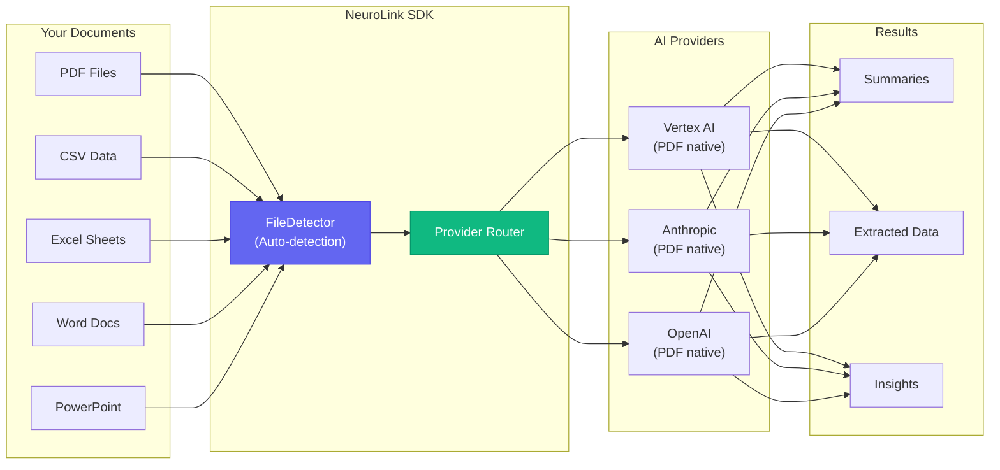
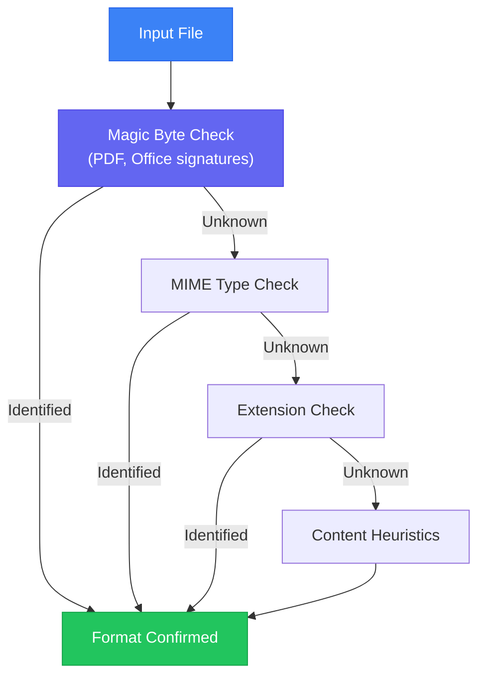
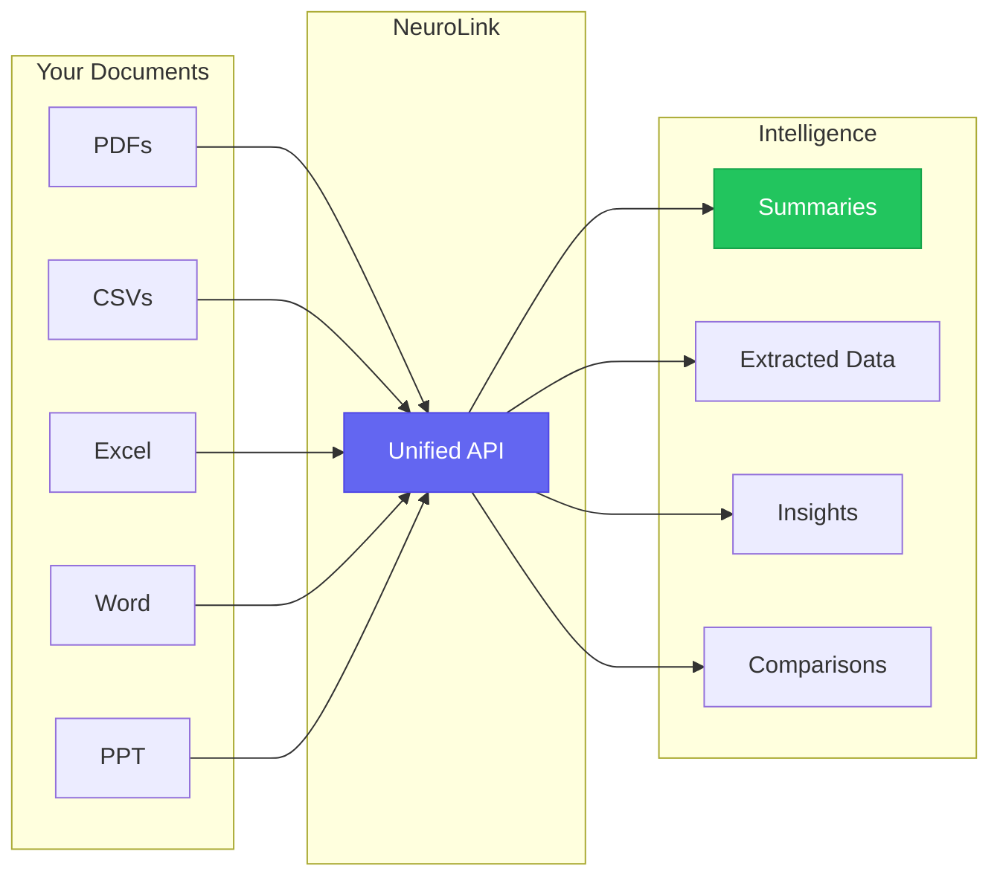

# Processing PDFs, CSVs, and Office Documents with AI

Document processing sits at the heart of enterprise AI adoption. Financial reports, contracts, invoices, spreadsheets, presentations. Your business runs on documents. Now AI can understand them all.

The challenge? Each format requires different parsing. PDFs need visual analysis. CSVs need tabular understanding. Office documents need text extraction. Different APIs. Different libraries. Different headaches.

NeuroLink solves this with a unified multimodal API. One interface handles every format. Auto-detection identifies file types. Smart routing selects the right provider. You write one code path for all documents.

This tutorial walks you through complete document processing with NeuroLink. You will learn PDF analysis, CSV data extraction, Office document handling, and production pipeline patterns. By the end, you will process any business document through a single, type-safe TypeScript interface.



---

## Why Unified Document Processing Matters

Traditional document AI requires juggling multiple tools:

| Document Type | Traditional Approach | Problems |
|--------------|---------------------|----------|
| PDF | pdf-parse + OCR + separate API | Loses visual context, slow |
| CSV | csv-parser + custom formatting | No semantic understanding |
| Excel | xlsx library + cell traversal | Complex, error-prone |
| Word | mammoth.js + text extraction | Loses formatting intent |
| PowerPoint | pptx2json + slide parsing | Misses visual relationships |

NeuroLink replaces this complexity with one API call:

```typescript
import { NeuroLink } from "@juspay/neurolink";

const ai = new NeuroLink();

// Process ANY document type
const result = await ai.generate({
  input: {
    text: "Analyze this document and extract key insights",
    files: ["report.pdf", "data.csv", "summary.xlsx"]
  }
});
```

The SDK handles everything:
- **Format Detection**: Magic bytes identify file type accurately
- **Provider Selection**: Routes PDFs to vision-capable providers
- **Text Optimization**: Formats tabular data for LLM consumption
- **Error Handling**: Graceful fallbacks for edge cases

---

## Document Processing Architecture

### FileDetector: Automatic Format Recognition

NeuroLink's FileDetector uses multiple strategies to identify files correctly:



This multi-layer approach handles edge cases like:
- Renamed files (`.txt` containing CSV data)
- Missing extensions (cloud storage downloads)
- Corrupted headers (partial uploads)

### Processing Modes by Format

Different formats require different processing strategies:

| Format | Processing Mode | Provider Support | Best For |
|--------|----------------|------------------|----------|
| PDF | Native binary (visual) | Vertex AI, Anthropic, OpenAI, Google AI, Bedrock | Charts, tables, layouts |
| CSV | Text conversion (markdown) | All providers | Data analysis |
| Excel | Text extraction per sheet | All providers | Multi-sheet data |
| Word | Text with structure markers | All providers | Contract analysis |
| PowerPoint | Slide-by-slide extraction | All providers | Presentation summary |

---

## Part 1: PDF Processing

PDFs are the workhorse of business documents. NeuroLink processes them natively, preserving visual context that OCR-based approaches lose.

### Why Native PDF Matters

Traditional PDF processing converts to text, destroying valuable information:

| Approach | Charts | Tables | Images | Layout |
|----------|--------|--------|--------|--------|
| OCR-based | Lost | Partial | Lost | Lost |
| Text extraction | Lost | Lost | Lost | Lost |
| **Native visual (NeuroLink)** | Preserved | Preserved | Analyzed | Understood |

Native processing sends the PDF directly to vision-capable models. The AI sees exactly what humans see.

### Basic PDF Analysis

```typescript
import { NeuroLink } from "@juspay/neurolink";

const ai = new NeuroLink();

// Analyze a PDF document
const result = await ai.generate({
  input: {
    text: "What is the total revenue mentioned in this financial report?",
    pdfFiles: ["quarterly-report.pdf"]
  },
  provider: "vertex",  // PDF-capable provider
  maxTokens: 1000
});

console.log(result.content);
// "The Q3 2025 report shows total revenue of $42.3 million,
//  a 15% increase from Q2's $36.8 million..."
```

> **Code Example:** See the [PDF Support documentation](https://docs.neurolink.ink/features/pdf-support/) for complete examples and patterns.

### Structured Data Extraction with Schema

Extract structured JSON from unstructured PDFs using schema enforcement:

```typescript
import { NeuroLink } from "@juspay/neurolink";

const ai = new NeuroLink();

// Extract structured data from invoice
const invoice = await ai.generate({
  input: {
    text: "Extract invoice details in JSON format",
    pdfFiles: ["invoice.pdf"]
  },
  provider: "anthropic",
  schema: {
    type: "object",
    properties: {
      vendor: { type: "string" },
      invoiceNumber: { type: "string" },
      date: { type: "string" },
      lineItems: {
        type: "array",
        items: {
          type: "object",
          properties: {
            description: { type: "string" },
            quantity: { type: "number" },
            unitPrice: { type: "number" },
            total: { type: "number" }
          }
        }
      },
      subtotal: { type: "number" },
      tax: { type: "number" },
      total: { type: "number" }
    }
  },
  output: { format: "json" }
});

console.log(JSON.parse(invoice.content));
// { vendor: "Acme Corp", invoiceNumber: "INV-2025-001", ... }
```

Schema enforcement guarantees the output structure. No more parsing inconsistent responses.

### Multi-PDF Comparison

Compare multiple documents in a single request:

```typescript
const comparison = await ai.generate({
  input: {
    text: "Compare Q1 and Q2 reports. What changed in revenue and expenses?",
    pdfFiles: ["q1-report.pdf", "q2-report.pdf"]
  },
  provider: "vertex",
  maxTokens: 2000
});

console.log(comparison.content);
// "Comparing Q1 to Q2:
//  - Revenue increased 18% ($31.2M to $36.8M)
//  - Operating expenses decreased 5% due to..."
```

The model maintains context across documents, enabling meaningful comparisons.

### CLI PDF Commands

Process PDFs directly from the command line:

```bash
# Basic PDF analysis
npx @juspay/neurolink generate "Summarize this contract" \
  --pdf contract.pdf \
  --provider vertex

# Multiple PDFs
npx @juspay/neurolink generate "Compare these invoices" \
  --pdf invoice1.pdf \
  --pdf invoice2.pdf \
  --provider anthropic

# Stream PDF analysis (for long documents)
npx @juspay/neurolink stream "Explain this document in detail" \
  --pdf technical-spec.pdf \
  --provider bedrock
```

---

## Part 2: CSV Data Analysis

CSV files contain the data that drives decisions. NeuroLink transforms raw data into actionable insights.

### How CSV Processing Works


The process:
1. **Streaming parser** handles large files without memory issues
2. **LLM-optimized formatting** presents data as markdown tables or JSON
3. **Works with ALL providers** (not just vision-capable ones)
4. **Auto-detects** delimiters, encodings, and headers

### Basic CSV Analysis

```typescript
import { NeuroLink } from "@juspay/neurolink";

const ai = new NeuroLink();

// Analyze CSV data
const insights = await ai.generate({
  input: {
    text: "What are the key trends in this sales data? Identify top performers.",
    csvFiles: ["sales-2024.csv"]
  }
});

console.log(insights.content);
// "Key trends from your sales data:
//  1. Q4 showed strongest growth at 23% MoM
//  2. Top performer: Sarah Chen ($2.3M total)
//  3. Product category 'Enterprise' leads at 45% of revenue..."
```

> **Code Example:** See the [CSV Support documentation](https://docs.neurolink.ink/features/csv-support/) for more patterns.

### Advanced CSV Options

Control how CSV data is processed:

```typescript
const analysis = await ai.generate({
  input: {
    text: "Identify the top 10 customers by total revenue",
    csvFiles: ["customers.csv"]
  },
  csvOptions: {
    maxRows: 1000,            // Limit rows (1-10000)
    formatStyle: "markdown",  // "raw" | "markdown" | "json"
    includeHeaders: true      // Include header row
  }
});
```

For large files, `maxRows` prevents token overflow while maintaining representativeness.

### Combining CSV with PDF

Cross-reference data across formats:

```typescript
// Verify spreadsheet data against report
const verification = await ai.generate({
  input: {
    text: "Does the transaction data in the CSV match the totals in the PDF report?",
    files: [
      "transactions.csv",    // Auto-detected as CSV
      "monthly-report.pdf"   // Auto-detected as PDF
    ]
  },
  provider: "vertex"  // Supports both formats
});
```

NeuroLink's auto-detection handles mixed formats seamlessly.

### CLI CSV Commands

```bash
# Analyze CSV data
npx @juspay/neurolink generate "Find trends in this data" --csv sales.csv

# Multiple CSVs
npx @juspay/neurolink generate "Compare datasets" --csv q1.csv --csv q2.csv

# With options
npx @juspay/neurolink generate "Summarize top rows" \
  --csv large-data.csv \
  --csv-max-rows 500 \
  --csv-format json
```

---

## Part 3: Office Documents

Excel, Word, and PowerPoint files dominate enterprise workflows. NeuroLink extracts intelligence from all of them.

### Excel Processing

```typescript
const ai = new NeuroLink();

// Analyze Excel spreadsheet
const excel = await ai.generate({
  input: {
    text: "Summarize the financial projections across all sheets",
    files: ["projections.xlsx"]
  }
});

console.log(excel.content);
// "Financial Projections Summary:
//  Sheet 'Revenue': Projects $50M by 2026
//  Sheet 'Expenses': Shows 12% reduction target
//  Sheet 'Cash Flow': Positive by Q3 2025..."
```

Multi-sheet workbooks are processed automatically. Each sheet contributes to the complete analysis.

> **Code Example:** See the [Office Documents documentation](https://docs.neurolink.ink/features/office-documents/) for Excel patterns.

### Word Document Analysis

Extract structured information from contracts and agreements:

```typescript
// Extract structured information from Word doc
const contract = await ai.generate({
  input: {
    text: "Extract all obligations, deadlines, and parties from this agreement",
    files: ["service-agreement.docx"]
  },
  schema: {
    type: "object",
    properties: {
      parties: { type: "array", items: { type: "string" } },
      effectiveDate: { type: "string" },
      obligations: { type: "array", items: { type: "string" } },
      deadlines: { type: "array", items: { type: "string" } },
      terminationClauses: { type: "array", items: { type: "string" } }
    }
  },
  output: { format: "json" }
});

console.log(JSON.parse(contract.content));
// { parties: ["Acme Corp", "TechStart Inc"],
//   effectiveDate: "2025-01-01",
//   obligations: ["Deliver software by Q2", ...] }
```

### PowerPoint Summarization

Create executive summaries from presentation decks:

```typescript
// Create executive summary of presentation
const presentation = await ai.generate({
  input: {
    text: "Create an executive summary of this quarterly review deck",
    files: ["quarterly-review.pptx"]
  },
  maxTokens: 1500
});

console.log(presentation.content);
// "Executive Summary - Q3 2025 Review:
//  Key Achievements: Launched 3 products, grew ARR 40%
//  Challenges: Supply chain delays, talent acquisition
//  Next Quarter Focus: International expansion, AI integration..."
```

### CLI Office Commands

```bash
# Excel analysis
npx @juspay/neurolink generate "Compare sheets" --file budget.xlsx

# Word extraction
npx @juspay/neurolink generate "Find all deadlines" --file contract.docx --output json

# PowerPoint summary
npx @juspay/neurolink generate "Create 3-bullet summary" --file presentation.pptx
```

---

## Part 4: Production Patterns

Real-world document processing requires robust patterns for scale and reliability.

### Document Processing Pipeline

```typescript
import { NeuroLink } from "@juspay/neurolink";
import fs from "fs";
import path from "path";

interface ProcessingResult {
  file: string;
  summary: string;
  success: boolean;
  error?: string;
}

class DocumentPipeline {
  private ai: NeuroLink;

  constructor() {
    this.ai = new NeuroLink({
      conversationMemory: { enabled: true }
    });
  }

  async processDirectory(dirPath: string): Promise<ProcessingResult[]> {
    const files = fs.readdirSync(dirPath);
    const results: ProcessingResult[] = [];

    for (const file of files) {
      const filePath = path.join(dirPath, file);
      const ext = path.extname(file).toLowerCase();

      // Select appropriate provider based on file type
      const provider = this.selectProvider(ext);

      try {
        const result = await this.ai.generate({
          input: {
            text: "Extract key information and create a summary",
            files: [filePath]
          },
          provider
        });

        results.push({
          file,
          summary: result.content,
          success: true
        });
      } catch (error: any) {
        results.push({
          file,
          summary: "",
          success: false,
          error: error.message
        });
      }
    }

    return results;
  }

  private selectProvider(ext: string): string {
    // PDF needs vision-capable provider
    if (ext === ".pdf") return "vertex";
    // Others work with any provider
    return "openai";
  }
}
```

> **Code Example:** See the [Advanced Examples documentation](https://docs.neurolink.ink/examples/advanced/) for the complete pipeline implementation.

### Error Handling Best Practices

Production document processing encounters various error conditions. A robust error handling strategy anticipates these failures and recovers gracefully. Here is a comprehensive approach:

```typescript
import { NeuroLink, NeuroLinkError } from "@juspay/neurolink";

const ai = new NeuroLink();

async function processDocumentSafely(filePath: string, query: string) {
  try {
    const result = await ai.generate({
      input: {
        text: query,
        files: [filePath]
      },
      provider: "vertex"
    });

    return { success: true, content: result.content };
  } catch (error: any) {
    // Handle specific error codes
    switch (error.code) {
      case "FILE_TOO_LARGE":
        // PDF exceeds provider page limit (100 pages for most providers)
        // Strategy: Split document into chunks
        console.log(`Document ${filePath} exceeds page limit`);
        return await processLargeDocument(filePath, query);

      case "UNSUPPORTED_FORMAT":
        // File type not recognized or supported
        // Strategy: Convert to supported format or log for manual review
        console.log(`Unsupported format: ${filePath}`);
        return { success: false, error: "Format not supported", requiresManualReview: true };

      case "PROVIDER_NOT_CAPABLE":
        // Provider cannot handle this file type (e.g., Ollama with native PDF)
        // Strategy: Automatic fallback to capable provider
        console.log("Falling back to vision-capable provider");
        return await processWithFallbackProvider(filePath, query);

      case "FILE_NOT_FOUND":
        // File path invalid or file deleted
        console.log(`File not found: ${filePath}`);
        return { success: false, error: "File not found" };

      case "RATE_LIMIT_EXCEEDED":
        // Provider rate limit hit
        // Strategy: Exponential backoff retry
        console.log("Rate limited, retrying with backoff");
        return await retryWithBackoff(() => processDocumentSafely(filePath, query));

      case "CONTEXT_LENGTH_EXCEEDED":
        // Document content exceeds model context window
        // Strategy: Summarize in chunks or use larger context model
        console.log("Context length exceeded, chunking document");
        return await processInChunks(filePath, query);

      case "AUTHENTICATION_ERROR":
        // Invalid or expired API credentials
        console.error("Authentication failed - check provider credentials");
        throw error; // Cannot recover, must fix credentials

      case "NETWORK_ERROR":
        // Transient network failure
        console.log("Network error, scheduling retry");
        return await retryWithBackoff(() => processDocumentSafely(filePath, query), 3);

      default:
        // Unknown error - log and rethrow
        console.error(`Unexpected error processing ${filePath}:`, error);
        throw error;
    }
  }
}

// Helper: Process large documents by splitting
async function processLargeDocument(filePath: string, query: string) {
  // Implementation depends on document type
  // For PDFs: Extract page ranges and process separately
  // For CSVs: Process in row batches
  console.log("Splitting document for processing...");
  // ... implementation
  return { success: true, content: "Aggregated results", chunked: true };
}

// Helper: Fallback to different provider
async function processWithFallbackProvider(filePath: string, query: string) {
  const fallbackProviders = ["vertex", "anthropic", "bedrock"];

  for (const provider of fallbackProviders) {
    try {
      const result = await ai.generate({
        input: { text: query, files: [filePath] },
        provider
      });
      return { success: true, content: result.content, provider };
    } catch (e) {
      continue; // Try next provider
    }
  }

  return { success: false, error: "All providers failed" };
}

// Helper: Exponential backoff retry
async function retryWithBackoff<T>(
  fn: () => Promise<T>,
  maxRetries: number = 3
): Promise<T> {
  for (let attempt = 0; attempt < maxRetries; attempt++) {
    try {
      return await fn();
    } catch (error) {
      if (attempt === maxRetries - 1) throw error;
      const delay = Math.pow(2, attempt) * 1000; // 1s, 2s, 4s
      await new Promise(resolve => setTimeout(resolve, delay));
    }
  }
  throw new Error("Max retries exceeded");
}
```

This error handling pattern covers the most common failure modes in production document processing. The key principles are: fail fast on unrecoverable errors, retry transient failures, and provide graceful degradation for capability mismatches.

### File Validation Before Processing

Validate files before sending to the API to catch problems early:

```typescript
import fs from "fs";
import path from "path";

interface ValidationResult {
  valid: boolean;
  error?: string;
  fileInfo?: {
    size: number;
    extension: string;
    estimatedPages?: number;
  };
}

function validateDocument(filePath: string): ValidationResult {
  // Check file exists
  if (!fs.existsSync(filePath)) {
    return { valid: false, error: "File not found" };
  }

  const stats = fs.statSync(filePath);
  const ext = path.extname(filePath).toLowerCase();

  // Check file size (50MB limit for most providers)
  const maxSize = 50 * 1024 * 1024;
  if (stats.size > maxSize) {
    return { valid: false, error: `File exceeds ${maxSize / 1024 / 1024}MB limit` };
  }

  // Check empty files
  if (stats.size === 0) {
    return { valid: false, error: "File is empty" };
  }

  // Validate supported extensions
  const supportedExtensions = [".pdf", ".csv", ".xlsx", ".xls", ".docx", ".doc", ".pptx", ".ppt"];
  if (!supportedExtensions.includes(ext)) {
    return { valid: false, error: `Unsupported extension: ${ext}` };
  }

  // Estimate PDF pages (rough calculation: ~100KB per page average)
  const estimatedPages = ext === ".pdf" ? Math.ceil(stats.size / 100000) : undefined;

  return {
    valid: true,
    fileInfo: {
      size: stats.size,
      extension: ext,
      estimatedPages
    }
  };
}
```

### Streaming for Long Document Analysis

When processing lengthy documents, streaming provides real-time feedback and prevents timeout issues:

```typescript
import { NeuroLink } from "@juspay/neurolink";

const ai = new NeuroLink();

async function analyzeWithStreaming(filePath: string) {
  console.log("Starting document analysis...\n");

  const result = await ai.stream({
    input: {
      text: "Provide a comprehensive analysis of this document including key themes, important data points, and actionable recommendations",
      files: [filePath]
    },
    provider: "vertex",
    maxTokens: 4000
  });

  let fullResponse = "";

  for await (const chunk of result.stream) {
    if (chunk.type === "text") {
      process.stdout.write(chunk.content);
      fullResponse += chunk.content;
    }
  }

  // Usage is available after stream completes
  if (result.usage) {
    console.log(`\n[Total tokens: ${result.usage.total}]`);
  }

  return fullResponse;
}
```

Streaming is particularly valuable for:
- **User experience**: Display results as they generate rather than waiting for completion
- **Timeout prevention**: Long-running analysis stays active with continuous data flow
- **Progress indication**: Users see immediate feedback that processing is occurring
- **Memory efficiency**: Process chunks instead of buffering entire responses

### Batch Processing with Rate Limiting

Process multiple documents while respecting API limits:

```typescript
async function batchProcess(files: string[]) {
  const ai = new NeuroLink();
  const results = [];

  // Process in batches of 2 to respect rate limits
  const batchSize = 2;

  for (let i = 0; i < files.length; i += batchSize) {
    const batch = files.slice(i, i + batchSize);

    const batchResults = await Promise.all(
      batch.map(async (file) => {
        try {
          const result = await ai.generate({
            input: {
              text: "Summarize this document",
              files: [file]
            },
            provider: "vertex"
          });
          return { file, success: true, content: result.content };
        } catch (error: any) {
          return { file, success: false, error: error.message };
        }
      })
    );

    results.push(...batchResults);

    // Add delay between batches
    if (i + batchSize < files.length) {
      await new Promise(resolve => setTimeout(resolve, 1000));
    }
  }

  return results;
}
```

---

## Provider Comparison for Documents

Not all providers handle documents equally:

| Provider | Native PDF | Max Size | Max Pages | CSV | Excel | Word |
|----------|------------|----------|-----------|-----|-------|------|
| Vertex AI | Yes | 5 MB | 100 | Yes | Yes | Yes |
| Anthropic | Yes | 5 MB | 100 | Yes | Yes | Yes |
| Google AI | Yes | 2 GB | 100 | Yes | Yes | Yes |
| OpenAI | Yes | 10 MB | 100 | Yes | Yes | Yes |
| Bedrock | Yes | 5 MB | 100 | Yes | Yes | Yes |
| Azure | No* | - | - | Yes | Yes | Yes |
| Mistral | No* | - | - | Yes | Yes | Yes |
| Ollama | No* | - | - | Yes | Yes | Yes |

*These providers convert PDFs to images for processing

> **Note:** Pricing changes frequently. Check provider documentation for current rates.

**Recommendation:** Use Vertex AI or Anthropic for PDF-heavy workloads with native support. Fall back to Anthropic for its reasoning quality on complex documents.

---

## Performance Optimization

Optimizing document processing involves balancing speed, cost, and quality. These patterns help you achieve production-grade performance.

### Memory Management for Large Files

Large documents can exhaust memory if not handled carefully. Configure processing options at the `generate()` call level:

```typescript
const ai = new NeuroLink({
  conversationMemory: { enabled: true }
});

// CSV options are passed in the generate() call, not constructor
const result = await ai.generate({
  input: {
    text: "Analyze this data",
    csvFiles: ["large-data.csv"]
  },
  csvOptions: {
    maxRows: 500,           // Limit rows (1-10000)
    formatStyle: "markdown" // "raw" | "markdown" | "json"
  }
});
```

For very large files, process in segments:

```typescript
async function processLargePDF(filePath: string) {
  const ai = new NeuroLink();

  // For large PDFs, instruct the model via the text prompt
  // PDF processing is automatic - no pdfOptions needed
  const result = await ai.generate({
    input: {
      text: `Analyze this document comprehensively. Focus on:
        1. Executive summary of key points
        2. Important data and figures
        3. Main conclusions and recommendations

        If the document is very long, prioritize the most important sections.`,
      pdfFiles: [filePath]
    },
    provider: "vertex",  // Native PDF support with 100 page limit
    maxTokens: 4000
  });

  return result.content;
}

// For documents exceeding provider page limits, split the PDF externally
// and process each part separately, then combine results
async function processMultiPartPDF(pdfParts: string[]) {
  const ai = new NeuroLink();
  const summaries: string[] = [];

  for (const partPath of pdfParts) {
    const result = await ai.generate({
      input: {
        text: "Summarize the key points from this document section",
        pdfFiles: [partPath]
      },
      provider: "vertex"
    });
    summaries.push(result.content);
  }

  // Combine segment summaries into final summary
  const finalResult = await ai.generate({
    input: {
      text: "Combine these section summaries into a cohesive document summary",
    },
    messages: [{ role: "user", content: summaries.join("\n\n---\n\n") }]
  });

  return finalResult.content;
}
```

### Caching Repeated Analysis

Avoid reprocessing identical documents by implementing a cache layer:

```typescript
import { createHash } from "crypto";
import fs from "fs";

interface CacheEntry {
  content: string;
  timestamp: number;
  fileHash: string;
}

const cache = new Map<string, CacheEntry>();
const CACHE_TTL = 3600000; // 1 hour

async function analyzeWithCache(filePath: string, query: string) {
  // Create cache key from file content hash + query
  const fileBuffer = fs.readFileSync(filePath);
  const fileHash = createHash("md5").update(fileBuffer).digest("hex");
  const cacheKey = createHash("md5")
    .update(fileHash + query)
    .digest("hex");

  // Check cache validity
  const cached = cache.get(cacheKey);
  if (cached && Date.now() - cached.timestamp < CACHE_TTL) {
    console.log("Cache hit - returning cached result");
    return cached.content;
  }

  // Process and cache
  const result = await ai.generate({
    input: { text: query, files: [filePath] }
  });

  cache.set(cacheKey, {
    content: result.content,
    timestamp: Date.now(),
    fileHash
  });

  return result.content;
}
```

For production systems, replace the in-memory Map with Redis or another distributed cache.

### Provider Selection for Cost Optimization

Different providers have different cost structures. Select based on your needs:

```typescript
function selectOptimalProvider(fileType: string, priority: "speed" | "cost" | "quality") {
  const providerMatrix = {
    pdf: {
      speed: "vertex",      // Fastest for PDFs
      cost: "vertex",       // $0.00125 per 1K tokens
      quality: "anthropic"  // Best reasoning
    },
    csv: {
      speed: "openai",      // Fast text processing
      cost: "openai",       // Competitive pricing
      quality: "anthropic"  // Best analysis
    },
    default: {
      speed: "openai",
      cost: "vertex",
      quality: "anthropic"
    }
  };

  const providers = providerMatrix[fileType as keyof typeof providerMatrix] || providerMatrix.default;
  return providers[priority];
}

// Usage
const provider = selectOptimalProvider(".pdf", "cost");
const result = await ai.generate({
  input: { text: query, files: [filePath] },
  provider
});
```

### Parallel Processing for Multiple Documents

When processing many documents, parallelize within rate limits:

```typescript
import pLimit from "p-limit";

async function processDocumentsParallel(files: string[], concurrency: number = 3) {
  const ai = new NeuroLink();
  const limit = pLimit(concurrency);

  const tasks = files.map(file =>
    limit(async () => {
      const result = await ai.generate({
        input: {
          text: "Extract key information from this document",
          files: [file]
        }
      });
      return { file, content: result.content };
    })
  );

  return Promise.all(tasks);
}

// Process 10 files with max 3 concurrent requests
const results = await processDocumentsParallel(documentList, 3);
```

### Token Usage Optimization

Reduce costs by optimizing token consumption:

```typescript
// 1. Use concise prompts
const efficientPrompt = "List: vendor, amount, date, items"; // Fewer tokens
const verbosePrompt = "Please extract the vendor name, total amount, invoice date, and line items"; // More tokens

// 2. Limit output tokens appropriately
const result = await ai.generate({
  input: { text: efficientPrompt, files: [invoice] },
  maxTokens: 500  // Sufficient for structured extraction
});

// 3. Use schema to constrain output
const structured = await ai.generate({
  input: { text: "Extract invoice data", files: [invoice] },
  schema: invoiceSchema,
  output: { format: "json" }  // JSON is typically more token-efficient
});
```

---

## Next Steps

You now have everything needed to process any business document with AI. Here's where to go next:

### Expand Your Capabilities

- **[OpenRouter Integration Guide]()** - Access 300+ models through a single API
- **[Enterprise HITL & Guardrails Guide](https://docs.neurolink.ink/features/hitl/)** - Add human review for high-stakes documents
- **[Conversation Memory Configuration](https://docs.neurolink.ink/conversation-memory/)** - Remember context across document sessions

### Reference Documentation

- **[Full SDK API Reference](https://docs.neurolink.ink/sdk/api-reference/)** - Complete TypeScript API documentation
- **[Provider Configuration Options](https://docs.neurolink.ink/getting-started/provider-setup/)** - Detailed setup for all 13 supported providers
- **[CLI Command Reference](https://docs.neurolink.ink/cli/commands/)** - Every CLI command with examples

### Get Started Now

Install NeuroLink and start processing documents:

```bash
# One command to get started
pnpm dlx @juspay/neurolink setup
```

The setup wizard guides you through configuration. You'll analyze your first PDF in under five minutes.

---

## Summary

Document processing is now solved. NeuroLink's unified API handles PDFs, CSVs, Excel, Word, and PowerPoint through a single interface. Auto-detection identifies formats. Smart routing selects providers. Type-safe schemas extract structured data.

You learned how to:

- Process PDFs with native visual analysis
- Extract insights from CSV and Excel data
- Analyze Word documents and PowerPoint presentations
- Build production pipelines with error handling
- Optimize for performance and cost

Stop juggling document libraries. Start extracting insights. One API. Any document. Real intelligence.

---

*Have questions about document processing? Join our [Discord community](https://discord.gg/neurolink) or [open an issue on GitHub](https://github.com/juspay/neurolink/issues). We're here to help you build.*



**One API. Any Document. Real Intelligence.**
