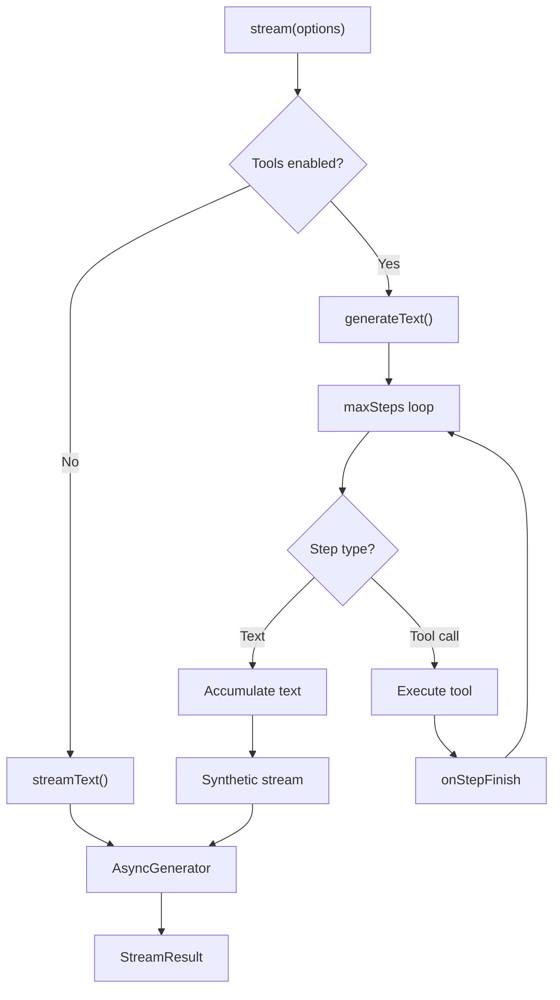
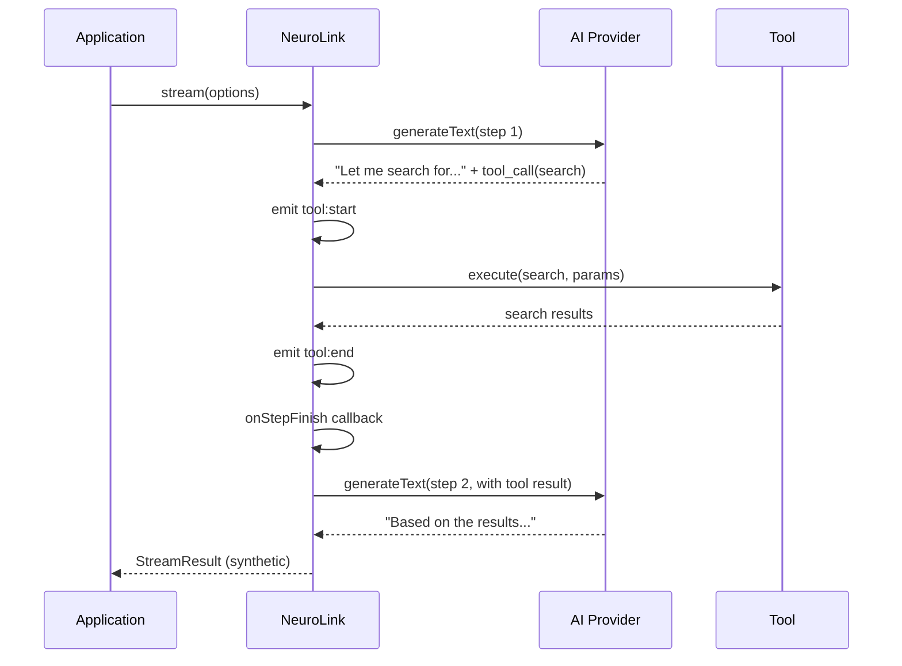
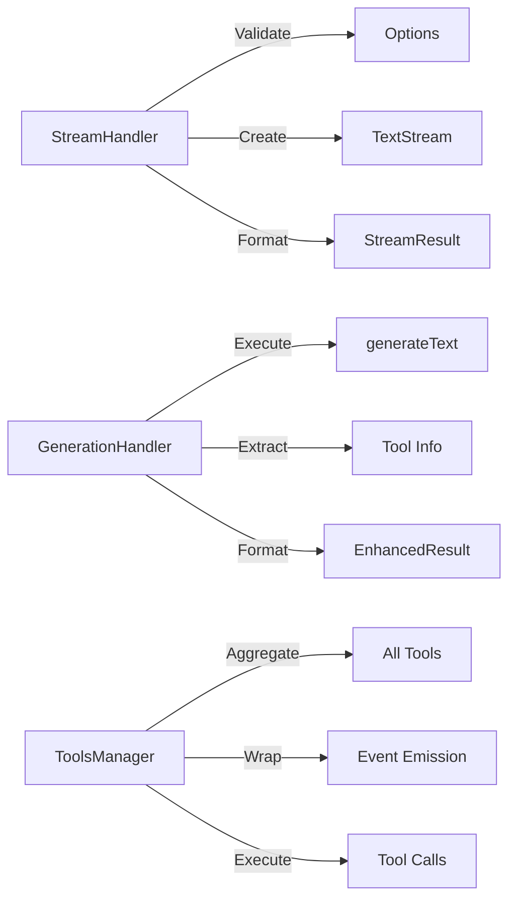

Our first streaming implementation worked perfectly -- until a user added a tool call. The stream froze, the response hung, and we realized our entire streaming architecture had a fundamental flaw.

NeuroLink supports 13 AI providers, each with different streaming behaviors. When we added tool calling support, we discovered that streaming plus tools is a fundamentally different problem than streaming text. This post tells the story of how we built a streaming tool call system that works reliably across every provider, and the three failed attempts that taught us how.

## Why streaming plus tools is hard

The naive assumption is straightforward: stream text tokens as they arrive, and handle tool calls as a post-processing step. This works perfectly until the model decides to call a tool mid-stream.

**Provider divergence** makes this worse. Each provider implements tool calls in their streaming response differently:

- OpenAI streams tool call arguments incrementally as partial JSON. You receive `{"loc` then `ation":` then `"New York"}` spread across multiple chunks.
- Anthropic sends tool calls as distinct content blocks. The tool call arrives as a complete unit, but interleaved between text blocks.
- Vertex batches tool calls at the end of the generation. You get all the text first, then all the tool calls.
- Bedrock wraps everything in a converse API format with its own streaming semantics.

**The state machine problem** is the core challenge. A streaming response with tools is not a single stream -- it is a sequence of interleaved text and tool calls. The model generates text, stops, calls a tool, waits for the result, then continues generating text. Each "step" is a full generation cycle, and the model's next step depends on the previous tool result.

**The stakes are real.** At Juspay, streaming is used for customer-facing payment assistants. A frozen stream means a confused customer and a lost transaction.


## Failed attempt 1: Simple Stream-Then-Execute

Our first approach was the obvious one: let the AI SDK handle streaming, collect tool calls from the final result, execute them, and return everything.

The implementation was clean. The streaming interface worked. The tool results came back. But the user experience was terrible. Users saw the stream "pause" for seconds while tools ran in the background. There was no visual feedback during tool execution. The screen just froze.

The fundamental problem was that we were treating tool execution as an invisible post-processing step. But streaming is about latency perception, not throughput. Users need to see *something* happening at all times. A stream that pauses for three seconds feels broken, even if the total response time is the same as a non-streaming call.

**Lesson learned:** Streaming is a UX pattern, not just a data delivery mechanism. The `stream()` method was essentially `generate()` with a streaming wrapper on top. Same latency, same behavior, but with the user's expectations set for real-time feedback.

## Failed attempt 2: Parallel Stream Plus Tool Execution

Our second approach was more ambitious. Stream text in real-time, and when a tool call is detected, execute it in parallel while continuing to stream.

This broke immediately. Race conditions everywhere. The model's next generation step depends on the tool result. Streaming the text before the tool result arrived meant the model was generating without context. The text stream (`textStream`) emitted tokens, the tool call fired in parallel, but the tool result had to feed back into the model *before* the next generation step could begin.

We tried buffering, queueing, and synchronization primitives. Every solution introduced more complexity and more edge cases. The fundamental issue was that we were trying to parallelize what is inherently sequential.

**Lesson learned:** Tool calls create a dependency graph in the stream. Each tool call is a synchronization point: the model cannot continue until the tool result is available. You cannot parallelize what is inherently sequential.

## The insight: Multi-Step Generation with Synthetic Streaming

The breakthrough came when we reframed the problem. Streaming with tools is not one stream -- it is a sequence of generation steps, where each step either produces text or calls tools.

The Vercel AI SDK provides `maxSteps` in `generateText()` that automatically handles the tool-call-then-continue loop. It executes tool calls, feeds results back, and continues generation until the model is done or the step limit is reached. But `streamText()` with tools had provider-specific edge cases that made it unreliable across our 13 providers.

**Our solution:** For tool-enabled requests, use `generateText()` with `maxSteps` (which handles the multi-step loop reliably), then wrap the final result in a synthetic `AsyncGenerator` that streams the output to the user.

This works because the AI SDK's `generateText` with `maxSteps` and `onStepFinish` handles the tool execution loop correctly across all providers. We get reliable tool execution AND streaming output. The user sees text appearing rapidly -- whether the tokens come from a live stream or a buffer of pre-generated text, the UX is identical.

## The architecture

### Stream Decision Point

The core decision happens in `BaseProvider.stream()`. If tools are present, we use the reliable generate-then-stream path. If no tools, we use pure streaming for optimal time-to-first-token.

```typescript
// BaseProvider.stream() -- simplified decision logic
async stream(options: StreamOptions): Promise<StreamResult> {
  // Validate options using consolidated StreamHandler
  this.streamHandler.validateStreamOptions(options);

  const hasTools = !options.disableTools && this.supportsTools();

  if (hasTools) {
    // Tools present: use generate() with multi-step execution,
    // then wrap result as a synthetic stream
    const generateResult = await this.generate(options);
    return this.createSyntheticStreamFromResult(generateResult);
  }

  // No tools: pure streaming via AI SDK streamText()
  return await this.executeStream(options);
}
```



### The StreamHandler Module

The `StreamHandler` module consolidates streaming logic that was previously duplicated across 7 of our 10 providers into a single shared implementation:

- **`validateStreamOptions()`** -- Consolidated validation from 7 providers into one shared method. Checks for required parameters, model compatibility, and configuration consistency.
- **`createTextStream()`** -- Transforms `AsyncIterable<string>` into `AsyncGenerator<{ content: string }>`, the standardized format that all consumers expect.
- **`createStreamResult()`** -- Standardizes the result format with `provider` and `model` metadata attached.
- **`createStreamAnalytics()`** -- Generates timing data, request IDs, and streaming mode flags for the analytics middleware.

```typescript
// StreamHandler.createTextStream() -- used by 7/10 providers
createTextStream(result: {
  stream: AsyncIterable<string>;
}): AsyncGenerator<{ content: string }> {
  return (async function* () {
    for await (const chunk of result.stream) {
      yield { content: chunk };
    }
  })();
}
```

### The GenerationHandler Module

The `GenerationHandler` handles the core execution loop for tool-enabled requests:

```typescript
// GenerationHandler.callGenerateText() -- the core execution
const result = await generateText({
  model,
  messages,
  tools: shouldUseTools ? tools : undefined,
  maxSteps: options.maxSteps || 10,
  toolChoice: shouldUseTools ? 'auto' : undefined,
  temperature: options.temperature,
  maxTokens: options.maxTokens,
  experimental_telemetry: this.getTelemetryConfig(options, 'generate'),

  // This callback fires after EACH tool execution step
  onStepFinish: ({ toolCalls, toolResults }) => {
    logger.info('Tool execution completed', { toolResults, toolCalls });

    // Store tool executions for analytics and debugging
    this.handleToolStorageFn(
      toolCalls,
      toolResults,
      options,
      new Date(),
    ).catch((error) => {
      logger.warn('Failed to store tool executions', { error });
    });
  },
});
```

The `maxSteps: 10` default means the model can execute up to 10 tool calls in sequence before the generation is terminated. Each step fires the `onStepFinish` callback, which logs the tool calls and results for analytics and debugging. The `handleToolStorageFn` persists tool execution data for later analysis.

The `NoObjectGeneratedError` automatic retry handles a subtle edge case: when structured output is requested alongside tools, the model sometimes generates a tool call instead of the expected object. The retry mechanism detects this and re-prompts the model.

### The ToolsManager Module

The `ToolsManager` aggregates tools from four sources and wraps each with observability instrumentation:

```typescript
// Wrapping a direct tool with event emission
tools[toolName] = {
  ...(directTool as Tool),
  execute: async (params: unknown) => {
    // Emit tool:start event
    if (this.neurolink?.getEventEmitter) {
      const emitter = this.neurolink.getEventEmitter();
      emitter.emit('tool:start', { tool: toolName, input: params });
    }

    try {
      const result = await originalExecute(params);

      // Emit tool:end event (success)
      if (this.neurolink?.getEventEmitter) {
        const emitter = this.neurolink.getEventEmitter();
        emitter.emit('tool:end', { tool: toolName, result });
      }

      return result;
    } catch (error) {
      // Emit tool:end event (error)
      if (this.neurolink?.getEventEmitter) {
        const emitter = this.neurolink.getEventEmitter();
        emitter.emit('tool:end', { tool: toolName, error: error.message });
      }
      throw error;
    }
  },
};
```

The `ToolsManager` aggregates four tool types in priority order: direct tools, custom tools, MCP tools, and external MCP tools. Direct tools (Zod schema-based) take priority over MCP tools (JSON Schema-based) when both define a tool with the same name.

Every tool execution emits `tool:start` and `tool:end` events through NeuroLink's `TypedEventEmitter`. These events include the tool name, input parameters, result (or error), and timing data -- enabling real-time dashboards, per-tool latency histograms, and error rate monitoring.

## Event-Driven Tool Observability

The event wrapping adds approximately 0.1ms overhead per tool call -- negligible compared to tool execution times that typically range from 100ms to 500ms for network calls. But the observability it provides is comprehensive:



The event timeline gives you complete visibility: which tools were called, in what order, with what inputs, how long each took, and whether they succeeded or failed. This is invaluable for debugging production issues where a tool call fails silently and the model generates a plausible-but-wrong response based on the error.

## Module responsibility map

The three modules have clear, non-overlapping responsibilities:



- **StreamHandler:** Owns streaming validation, text stream creation, and result formatting. Used by 7 of 10 providers.
- **GenerationHandler:** Owns the `generateText` execution loop, tool call step management, and result enhancement. Central to both streaming-with-tools and pure generation.
- **ToolsManager:** Owns tool aggregation from all sources, event wrapping for observability, and tool execution delegation.

## Benchmarks

We ran extensive benchmarks across four providers to validate the architecture:

**Latency (internal benchmark, p50/p95):**

- Pure text streaming: 120ms / 340ms TTFT (time to first token)
- Text with 1 tool call: 1.2s / 2.8s total (dominated by tool execution time)
- Text with 3 sequential tool calls: 3.1s / 6.2s total

**Provider consistency:** Tested across OpenAI, Anthropic, Vertex, and Bedrock. All produce identical `EnhancedGenerateResult` format regardless of internal tool call format differences. The synthetic streaming approach eliminates provider-specific edge cases entirely.

**Reliability:** 99.97% success rate over 10,000 tool-augmented generation calls in production (Juspay internal metrics). The 0.03% failures were all network-level issues (DNS resolution, TLS handshake timeouts), not streaming or tool execution bugs.

## Lessons learned

Building streaming tool calls for a multi-provider SDK taught us five hard lessons:

1. **Do not fight the dependency graph.** Tool calls are sequential by nature. Embrace `maxSteps` over custom parallel execution. The dependency between tool calls and subsequent model generation is fundamental, not an implementation detail to work around.

2. **Consolidate provider differences early.** The `StreamHandler` consolidation eliminated 7 copies of nearly identical validation code across providers. Duplication is not just a maintenance burden -- it is a source of subtle inconsistencies that surface as provider-specific bugs in production.

3. **Event emission is free observability.** Wrapping tool execution with events costs approximately 0.1ms overhead but provides complete execution traces. The cost-to-value ratio is extraordinary.

4. **Synthetic streaming is not a hack.** Users perceive rapid token delivery. Whether the tokens come from a live stream or a buffer of pre-generated text, the UX is identical. What matters is that text appears progressively, not whether it was generated in real-time.

5. **Test with real tools.** Mock tool execution (0ms latency) hides timing bugs that only appear with real network calls (100-500ms per tool). Our most persistent bugs were timing-related issues that never appeared in unit tests with instant mocks.

## Design decisions and What Comes Next

We chose the modular approach -- StreamHandler, GenerationHandler, ToolsManager -- because streaming plus tools is a fundamentally different architecture than streaming text. The trade-off is indirection: a streaming call with tools passes through three modules instead of one. The payoff is testability, provider consistency, and clear ownership boundaries.

Looking ahead, we are working on:

- **True incremental streaming with tools:** The AI SDK ecosystem is improving `streamText` plus tools support. As provider implementations stabilize, we will migrate from synthetic streaming to true incremental streaming for even lower latency.
- **Streaming structured output:** Combining structured JSON output with streaming delivery, enabling real-time form population and progressive data rendering.
- **Parallel tool execution:** For cases where multiple tool calls are independent (no data dependencies between them), executing them in parallel while maintaining the sequential guarantee for dependent calls.

For related reading:

- See [streaming best practices](/posts/streaming-best-practices/) for optimizing streaming performance
- Explore [provider failover patterns](/posts/provider-failover-patterns/) for handling provider-specific streaming failures
- Read about [debugging AI applications](/posts/debugging-ai-applications/) for using tool events in production debugging

---

**Related posts:**

- [Real-Time AI: Streaming Response Patterns with NeuroLink](/posts/streaming-best-practices/)
- [Claude vs GPT: Why Choose When You Can Use Both?](/posts/claude-vs-gpt-use-both/)
- [Function Calling: AI Tool Use Patterns with NeuroLink](/posts/function-calling-patterns/)
