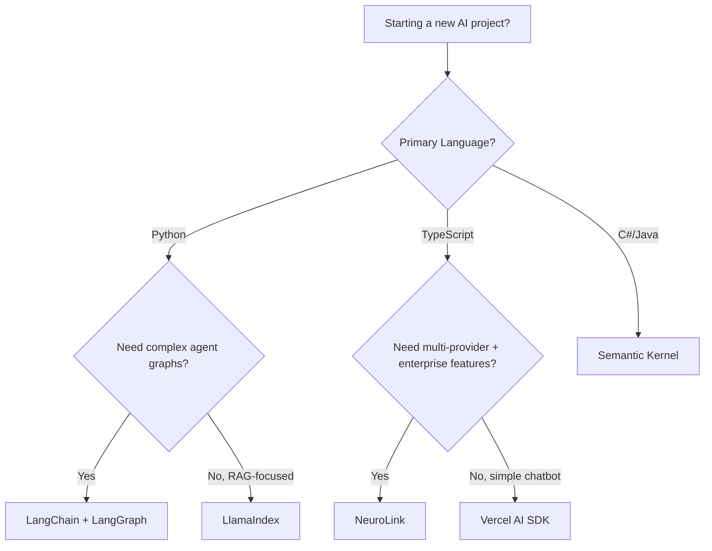

The AI SDK landscape in 2026 includes over a dozen frameworks targeting different use cases, languages, and complexity levels. For engineering leads evaluating options for new projects or migrations, the choices are genuinely overwhelming -- and most comparison articles are thinly disguised vendor pitches.

This comparison is architecture-focused and acknowledges competitor strengths honestly. We cover NeuroLink, Vercel AI SDK, LangChain and LangGraph, LlamaIndex, Semantic Kernel, and Haystack. To be fair, each tool has a genuine sweet spot where it outperforms the alternatives. The evidence shows that the right choice depends on your team's language preferences, your deployment constraints, and the complexity of your AI workflows.

One important caveat: NeuroLink builds on top of the Vercel AI SDK, so the comparison here is complementary, not competitive. Understanding the full landscape helps you see where each tool fits.

## The Taxonomy: SDKs vs Frameworks vs Platforms

Before comparing specific tools, it helps to classify them. Not all "AI frameworks" are the same kind of tool.

| Category | Definition | Examples |
|---|---|---|
| **Lightweight SDK** | Thin abstraction over provider APIs | Vercel AI SDK, NeuroLink |
| **Framework** | Opinionated pipeline with chains/agents | LangChain, LlamaIndex |
| **Platform** | Full managed service (infra + code) | AWS Bedrock SDK, Azure AI Studio |
| **Orchestration Engine** | Graph-based workflow execution | LangGraph, Temporal + AI |

NeuroLink sits between SDK and Framework. Its core is lightweight -- a unified provider interface built on the Vercel AI SDK -- but it includes optional enterprise modules: workflow engine, RAG pipeline, server adapters, MCP integration, middleware system, and HITL. You use only what you need.

## Vercel AI SDK

**What it is:** Low-level TypeScript primitives for AI applications: `streamText`, `generateText`, `generateObject`.

**Architecture:** Provider-agnostic interface, React and Next.js hooks, streaming-first design.

**Strengths:**

- Excellent React integration with `useChat` and `useCompletion` hooks
- Clean, minimal API surface that is easy to learn
- First-class streaming support that works naturally with React Server Components
- Growing provider ecosystem with community-contributed adapters

**Relationship with NeuroLink:** NeuroLink uses the Vercel AI SDK under the hood. All NeuroLink providers extend a `BaseProvider` that calls the Vercel AI SDK's `streamText()` and `generateText()` methods. NeuroLink adds the enterprise layers on top: multi-provider management, MCP integration, middleware, workflow engine, RAG pipeline, server adapters, and HITL.

**Weaknesses:**

- No built-in multi-provider management, failover, or middleware pipeline -- you build those yourself
- Tightly coupled to the React and Next.js ecosystem; using it outside that context requires more manual wiring

**When to use Vercel AI SDK alone:** Simple chatbot UIs, React and Next.js applications where you need one provider, and situations where you want maximum control with minimum abstraction.

**When to graduate to NeuroLink:** When you need multiple providers with failover, content safety guardrails, quality evaluation, server-side deployment outside Next.js, or enterprise features like HITL and audit logging.

## LangChain and LangGraph

**What it is:** Python-first comprehensive AI framework with chain composition and agent building.

**Architecture:** Chains compose into agents, LCEL (LangChain Expression Language) pipelines provide functional composition, and LangGraph adds stateful agent graphs with cycles and branching.

**Strengths:**

- Largest integration ecosystem with over 1,000 integrations (vector stores, document loaders, tools)
- LangSmith for observability, prompt management, and evaluation
- LangGraph for complex stateful agent workflows with human-in-the-loop
- Massive community, extensive documentation, and tutorials

**Weaknesses:**

- Python-first. The TypeScript port exists but consistently lags behind the Python version in features and documentation.
- Heavy abstraction layer can obscure what is actually happening. Debugging a chain of chains requires understanding multiple abstraction levels.
- Frequent breaking changes between versions have been a persistent pain point for production users.
- Over-engineering risk for simple use cases. Adding LangChain to a project that just needs `generateText` is like using React to build a static landing page.

**vs NeuroLink:** Different philosophy entirely. LangChain is a framework -- it wants to own your entire AI pipeline. NeuroLink is an SDK -- it provides building blocks that you compose into your application architecture. LangChain is Python-first; NeuroLink is TypeScript-first. LangChain has a larger integration ecosystem; NeuroLink has deeper provider abstraction and built-in enterprise features.

## LlamaIndex

**What it is:** Data framework for LLM applications, focused specifically on RAG (Retrieval-Augmented Generation).

**Architecture:** Index abstractions, Query Engine, and Response Synthesizer form a pipeline from raw data to LLM-ready context.

**Strengths:**

- Best-in-class RAG pipeline tooling with deep retrieval optimizations
- Excellent document parsing and chunking capabilities
- LlamaHub provides community data connectors for hundreds of data sources
- Strong focus on data quality and retrieval accuracy

**Weaknesses:**

- Narrower scope means you will likely need a second framework for non-RAG concerns like agent orchestration or multi-provider management
- The TypeScript version (LlamaIndex.TS) is functional but has a smaller community and fewer integrations than the Python version

**vs NeuroLink RAG:** NeuroLink's built-in RAG pipeline includes 10 chunking strategies, hybrid search (BM25 plus vector), Graph RAG, and reranking. LlamaIndex has deeper retrieval optimizations and a larger ecosystem of data connectors. If RAG is your primary use case and you are in the Python ecosystem, LlamaIndex is likely the better choice. If RAG is one feature of a larger TypeScript application, NeuroLink's built-in RAG is more than capable and saves you from adding a Python dependency.

## Microsoft Semantic Kernel

**What it is:** Multi-language SDK (.NET, Python, Java) for building AI agents and plugins, with deep Azure integration.

**Architecture:** Plugin-based system where AI capabilities are exposed as plugins that the kernel can compose. Enterprise-focused with built-in security, compliance, and monitoring features.

**Strengths:**

- Deep Azure ecosystem integration (Azure AI Studio, Azure OpenAI, Azure Cognitive Services)
- Enterprise compliance and security features built in
- Multi-language support covering .NET, Python, and Java -- important for enterprise teams with diverse tech stacks
- Strong planner system for agent orchestration

**Weaknesses:**

- Steeper learning curve for teams outside the .NET ecosystem, particularly for the plugin authoring model
- Provider support beyond Azure OpenAI is limited compared to truly provider-agnostic SDKs

**vs NeuroLink:** Semantic Kernel is tied to the Microsoft ecosystem. If your organization is all-in on Azure, it provides the tightest integration. NeuroLink is provider-agnostic with 13 providers, making it the better choice for multi-cloud or cloud-agnostic architectures. Both target enterprise use cases, but from different starting points.

## Haystack by deepset

**What it is:** Python framework for building production-ready NLP and LLM pipelines.

**Strengths:** Clean pipeline composition model, production-focused design, modular component system. Strong in document processing and search applications.

**vs NeuroLink:** Python versus TypeScript is the primary differentiator. Haystack focuses on NLP pipelines and document processing, while NeuroLink is broader in scope (multi-provider orchestration, workflows, server adapters, MCP). For Python-based document processing pipelines, Haystack is a mature choice. Haystack's pipeline composition model is arguably the cleanest in the Python ecosystem -- components declare their inputs and outputs explicitly, which makes debugging and testing easier than LangChain's more implicit chain composition.

## Comprehensive feature matrix

Here is the detailed comparison across all major features:

| Feature | NeuroLink | Vercel AI SDK | LangChain | LlamaIndex | Semantic Kernel |
|---|---|---|---|---|---|
| **Primary Language** | TypeScript | TypeScript | Python | Python | C#/Python/Java |
| **Provider Abstraction** | 13 unified | Provider adapters | 70+ integrations | 20+ LLMs | Azure-focused |
| **Streaming** | Unified | Native | Provider-specific | Basic | Basic |
| **RAG** | 10 chunkers, Graph RAG | None built-in | Via retrievers | Best-in-class | Basic |
| **Agents** | MCP tools + agent loop | None built-in | Agents + LangGraph | Agents | Plugins |
| **MCP Support** | Native (4 transports) | None | Via adapter | Via adapter | Via plugin |
| **Workflow Engine** | Ensemble, chain, adaptive | None | LangGraph | None | Planner |
| **Server Adapters** | 4 frameworks | Next.js | LangServe | Flask | ASP.NET |
| **Middleware** | Factory pattern | None | Callbacks | None | Filters |
| **HITL** | Built-in | None | LangGraph interrupt | None | Manual |
| **Observability** | OpenTelemetry + Langfuse | None built-in | LangSmith | Built-in tracing | Azure Monitor |
| **Memory** | Redis + Mem0 | None | Multiple types | Chat stores | Semantic memory |
| **Image/Video Gen** | Imagen, Veo 3.1 | None | Third-party | None | DALL-E |
| **Open Source** | Yes (Apache 2.0) | Yes (Apache 2.0) | Yes (MIT) | Yes (MIT) | Yes (MIT) |

A few observations from this matrix:

- **MCP support** is a differentiator today. The Model Context Protocol is becoming the standard for tool integration, and NeuroLink is ahead with native support for multiple transport types (stdio, SSE, Streamable HTTP, and WebSocket via the SDK's experimental transport module).
- **Middleware** is surprisingly absent from most frameworks. NeuroLink's factory pattern for middleware (guardrails, analytics, evaluation) is unique in providing a composable middleware pipeline similar to what Express or Koa provide for HTTP.
- **HITL** is only built into NeuroLink. LangGraph provides interrupt-based human-in-the-loop, but it is a lower-level primitive. Semantic Kernel leaves HITL entirely to the application developer.

> **Note:** Feature matrices are snapshots in time. All of these frameworks are actively developed and adding features regularly. Check current documentation before making decisions based on specific feature availability.
{: .prompt-info }

## Decision framework

Use this flowchart as a starting point for your evaluation:

**Recommendations by use case:**

- **React chatbot with one provider:** Vercel AI SDK. It provides the tightest React integration with the least overhead.
- **TypeScript production API with multi-provider needs:** NeuroLink. The unified provider interface, middleware, and enterprise features are designed for this use case.
- **Python data pipeline with heavy document processing:** LlamaIndex. Purpose-built for RAG with the deepest retrieval optimizations.
- **Complex agent orchestration in Python:** LangGraph. The graph-based execution model handles cycles, branches, and state machines that simpler frameworks cannot express.
- **Enterprise .NET application on Azure:** Semantic Kernel. The Azure integration and .NET-first design make it the natural choice.
- **Multi-provider with automatic failover:** NeuroLink. Built-in circuit breakers, fallback chains, and rate limiting for production resilience.

**Additional decision criteria worth weighing:**

- **Team size and skill set.** Small teams benefit from lightweight SDKs that do not require deep framework knowledge. NeuroLink and Vercel AI SDK have significantly smaller API surfaces than LangChain, which means less onboarding time and fewer footguns in production. LangChain's depth pays off at scale when you have dedicated ML engineers who can leverage the full integration ecosystem.
- **Migration cost.** If you already have a LangChain pipeline in production, migrating to NeuroLink is a substantial rewrite -- different language, different paradigm. In that case, consider whether LangGraph solves your immediate pain points before committing to a cross-language migration. On the other hand, migrating from raw Vercel AI SDK to NeuroLink is incremental because NeuroLink extends those same primitives.
- **Learning curve.** Vercel AI SDK has the gentlest on-ramp: five core functions, excellent TypeScript types, and minimal concepts to learn. NeuroLink adds complexity proportional to the features you adopt. LangChain has the steepest learning curve due to its layers of abstraction (chains, agents, LCEL, callbacks, memory types). Semantic Kernel falls somewhere in between, with a clean plugin model but enterprise configuration overhead.
- **Long-term maintenance burden.** Consider not just initial development speed but ongoing maintenance. Frameworks with frequent breaking changes (LangChain has historically been aggressive about API evolution) impose an ongoing upgrade tax. SDKs with stable, narrow API surfaces tend to age better in production codebases.

## The convergence trend

Despite their differences, all major AI frameworks are converging on several patterns:

- **MCP for tool integration** is becoming the standard. LangChain has added MCP adapters. Others will follow.
- **Streaming is expected everywhere.** Every framework now provides some form of streaming support, though implementation quality varies.
- **Provider abstraction is table stakes.** No one wants to be locked to a single AI provider. Multi-provider support is expected, not optional.
- **Structured output is everywhere.** JSON schema-constrained generation was once a differentiating feature. Today every major SDK supports it: Vercel AI SDK's `generateObject`, LangChain's output parsers, NeuroLink's schema validation middleware. It is no longer a selection criterion.
- **Tool calling has standardized.** In early 2025, each framework had its own tool definition format. Now most have converged on OpenAI-style function calling schemas, and MCP is unifying the tool discovery layer above that.
- **The future is composable.** Rather than monolithic frameworks, the trend is toward mixing SDKs for different layers. You might use Vercel AI SDK for your React frontend, NeuroLink for your API layer, and LlamaIndex for your data pipeline.

NeuroLink's approach aligns with this composability trend: build on top of the Vercel AI SDK rather than replacing it, and add enterprise layers that can be adopted incrementally. The frameworks that thrive long-term will be those that play well with others rather than demanding full ownership of the stack.

## The verdict

No single SDK is best for everything. To be fair, each framework has a genuine sweet spot:

- **React chatbot with one provider:** Vercel AI SDK wins on integration simplicity.
- **TypeScript production API with multi-provider needs:** NeuroLink provides the unified interface, middleware, and enterprise features.
- **Python data pipeline with heavy document processing:** LlamaIndex has the deepest retrieval optimizations.
- **Complex agent orchestration in Python:** LangGraph handles cycles and state machines that simpler frameworks cannot.
- **Enterprise .NET on Azure:** Semantic Kernel is the natural fit.

The evidence shows that composability is the winning strategy -- mix SDKs for different layers rather than forcing one framework to do everything. For detailed comparisons, see our [NeuroLink vs LangChain post](/posts/neurolink-vs-langchain/) and [Claude vs GPT: Use Both](/posts/claude-vs-gpt-use-both/).

---

**Related posts:**

- [The Future of AI SDKs: What's Next for Developer Tools](/posts/future-of-ai-sdks/)
- [NeuroLink vs LangChain: When to Use Which (An Honest Comparison)](/posts/neurolink-vs-langchain/)
- [Building AI Agents with NeuroLink: From Chatbot to Autonomous System](/posts/building-ai-agents/)
